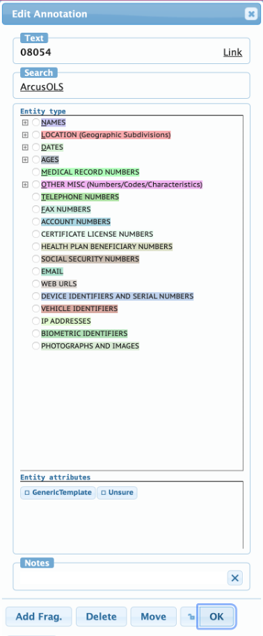
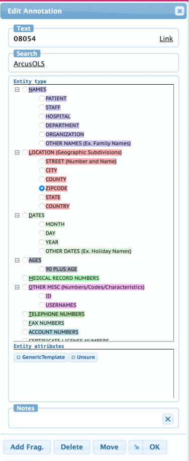
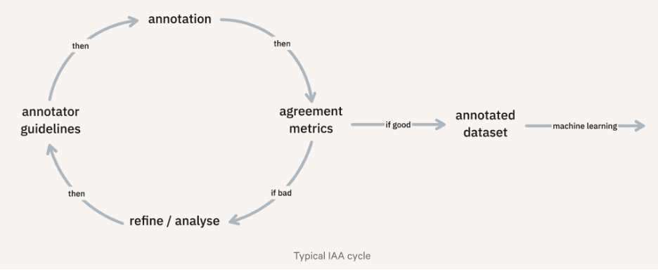
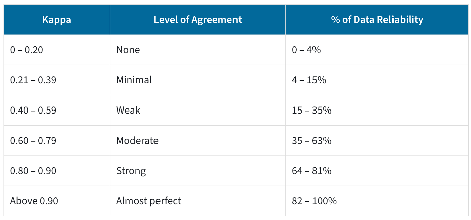
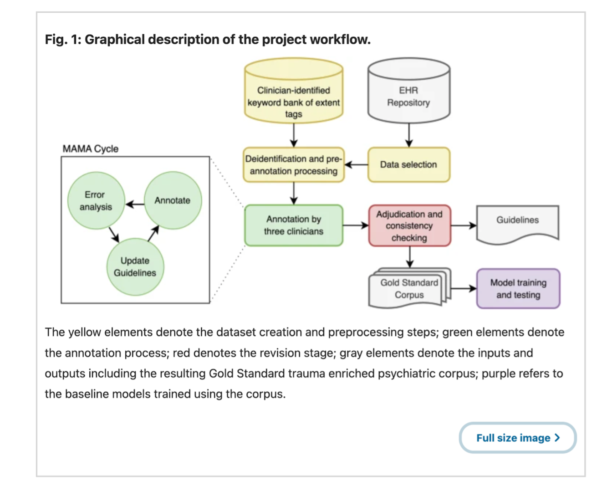

<!--
title: Checklist for Creating a Gold-Standard Annotated Dataset for your Research Project

comment:  Labeling, the process for adding annotations to data, helps us understand data in a more meaningful way by allowing us to better analyze and use it for our purposes. Consistent and correct data annotation preserves information integrity across different datasets and makes them interoperable with other AI systems, reducing errors that lead to misclassification or misinterpretation of data by AI algorithms.  

This training is designed to arm researchers and their study teams with industry identified best practices on achieving high-quality, gold-standard annotated data for your desired purpose, whether that be for model training, model validation, publication, secondary analysis, or archival reuse. It is encouraged to be taken prior to beginning a project that requires this knowledge but can be informational at any stage of the process.  

@learning_objectives  

At the end of this module, you will emerge with the knowledge of: 

- The importance of accurate data annotation 
- The steps to be taken pre-, during-, and post-annotation for the annotated dataset to be considered gold-standard 
- How you can contribute to maximizing CHOP’s return on investment for this work and help accelerate AI and Machine Learning research across the organization 

@end

language: en
mode: Textbook

import: https://raw.githubusercontent.com/arcus/virtual_library/main/_module_templates/macros.md
-->

## Creating Gold-Standard Annotated Datasets
**Best Practices and Checklist for your next Research Project**

There is an ocean of data out there: clinical records, scans, sensor readings, research papers, and so much more, but there is the challenge of how to use it effectively. How do we turn this vast amount of data into something that can give us insight into a specific question or problem? Annotation is how by:

- Turning data into actionable information
- Making data more understandable by both humans and computers
- Enabling faster searching to find specific information based on labels
- Enabling structured research and statistical analysis
- Making data reusable as data annotated for one project/purpose can be used for others
- Transforming unstructured or semi-structured data into valuable structured assets

Through this work of adding labels, tags, notes, metadata, or other descriptive notation to the data, you are providing context and meaning, enabling:

- Learning models to recognize patterns, categorize information, and make accurate predictions in supervised learning,
- Validation of both automated systems and manual processes,
- Accuracy in the biomedical research by the annotated data serving as gold-standard (referring to the benchmark dataset that is considered the most reliable and accurate in a specific context, used to evaluate the quality of work done by individuals or machines by comparing the results to the trusted dataset) or ground-truth (referring to the correct or definitive answers for a dataset, often used in comparing model predictions).

### The Importance of Accurate Data Annotation

Labeling, the process for adding annotations to data, helps us understand data in a more meaningful way by allowing us to better analyze and use it for our purposes. Consistent and correct data annotation preserves information integrity across different datasets and makes them interoperable with other AI systems, reducing errors that lead to misclassification or misinterpretation of data by AI algorithms.

Important traits of high-quality, gold-standard labeled data include:

1. Accurate: Data should be meticulously checked and labeled correctly against expert consensus or a ground truth.
2. Consistent: The same concepts must be labeled consistently across all examples
3. Diverse: Data should cover all known scenarios a future model must handle to account for ambiguities or class imbalances.
4. Unbiased: There must be no systemic skew toward a specific class or trend.
5. Contextual: Relationships between interconnected data points provide crucial context.
6. Performant: Data must help future models achieve key performance indicators around accuracy, sensitivity, specificity, etc.

The best practices outlined here should direct you towards achieving high-quality, gold-standard annotations.

## Best Practices: Pre-Annotation

Successful gold-standard annotation projects begin before labels are applied. The pre-annotation phase lays the foundation for high-quality, reliable annotated datasets by ensuring that data is representative, privacy requirements are addressed, annotation standards are clearly defined, and annotators are properly trained. Careful preparation helps reduce bias, improve consistency, and ensure that annotated data can effectively support downstream research, analytics, or machine learning objectives. This section outlines key pre-annotation best practices, including data selection and preparation, HIPAA and IRB considerations, development of annotation guidelines and ontologies, and annotator recruitment and training that support the creation of accurate, reproducible, gold-standard datasets.

### Diverse, Representative Data

Make sure to choose the right data that is both relevant and representative of real-world scenarios. Diversity helps to minimize dataset bias by encompassing a variety of use cases, scenarios, and edge cases, but also allows for the data to align with project objectives. If the goal is to create a machine learning model, consider what specific tasks it needs to perform. This will help determine the kind of data it needs to learn from.

Ensure that the sample size of the data used in annotation is appropriate for the intended model. An adequate sample size varies by task complexity, model type, and performance goals, but generally should be large enough to avoid overfitting and support strong statistical generalization.

Once a dataset is obtained, consider any data preparation steps that need to be taken before annotation efforts begin to remove noise, duplicates, irrelevant information, etc., optimizing the data for annotation.

### Privacy

Before using a dataset for annotation work, researchers should review the dataset to determine whether the data contains [Protected Health Information (PHI)](https://chop.policymedical.net/policymed/anonymous/docViewer?stoken=14de2fa8-d9f5-4188-983b-29545b20809f&dtoken=6d8d4887-3dec-4a76-8d83-14726c00d185) as defined by HIPAA. The HIPAA Privacy Rule establishes protections for identifiable health information created, received, maintained, or transmitted in research. A review of the dataset includes checking for the 18 HIPAA identifiers:

![List of the 18 HIPAA Identifiers incluing: names, social security numbers, device identifiers and serial numbers, addresses, medical record numbers, web URLs, elements of dates related to the individual, health plan beneficiary numbers, IP addresses, telephone numbers, account numbers, biometric identifiers, fax numbers, certificate/license numbers, full-face photographic images, email addresses, vehicle identifiers and serial numbers, any other unique identifying number, characteristic, or code.](media/Annotation_HIPAAPHI.png)

If annotation work involves identifiable or potentially identifiable data, the activity likely must be covered by an Institutional Review Board (IRB) protocol. Even when annotation is part of secondary data use, IRB review is often necessary to confirm the appropriate regulatory pathway, document privacy safeguards, and establish data access conditions. When in doubt, consult the IRB. Additionally, all individuals who will access the data (including annotators) must abide by all applicable laws, regulations, policies, and agreements. This includes but is not limited to being named in the IRB protocol (where required), completing all required training, and, if accessing CHOP data, being an active Workforce member (e.g., a regular employee or non-traditional personnel (NTP)).

Depending on the protocol and intended reuse, datasets may need to be de-identified or coded prior to annotation. De-identified data are no longer considered PHI under HIPAA, while coded datasets retain a re-linking key under controlled conditions and remain PHI for anyone with the key. Researchers should also assess whether free-text fields, images, or derived annotations could inadvertently reintroduce identifiable information.

### Annotation Standards

**A Blueprint for Consistent Labeling**

Begin defining clear annotation guidelines through the establishment of a set of instructions that are easy to understand and remain consistent across all data points. Begin by:

- Determining key terms for labels
  - Creating an ontology for tagging OR utilizing an existing ontology (HPO, SNOWMED, UMLS) ensuring that labeling criteria are well defined and that annotators are following guidelines [(View the Ontologies learning module for more information)](https://liascript.github.io/course/?https://raw.githubusercontent.com/arcus/virtual_library/refs/heads/annotations-ontologies/ontologies/OntologyTraining_LiaScript.md#1)
- Outlining the end goal of the project to show the bigger picture
- Detailing specific labeling instructions including providing detailed examples that outline realistic scenarios to help annotators identify edge cases and complex patterns

Establishing clear inclusion and exclusion guidelines for annotating a dataset along with defining clear categories/classes for labeling, ensures annotators have an easy-to-understand schema to use as a blueprint for consistent labeling.

Note that developing these guidelines is not a one-time task. It is an iterative process that requires regular review and refinement as feedback is incorporated.

As the standards evolve, be sure to conduct consensus checks, where multiple annotators independently label the same data, and discrepancies are resolved collaboratively or through a supervisor intervention / tiebreaker. It is imperative to track inter-annotator agreement (see the [Inter-Annotator Agreement](https://liascript.github.io/course/?https://raw.githubusercontent.com/arcus/virtual_library/refs/heads/annotations-ontologies/annotations/AnnotationsTraining_LiaScript.md#13) and [Common Methods of Assessment](https://liascript.github.io/course/?https://raw.githubusercontent.com/arcus/virtual_library/refs/heads/annotations-ontologies/annotations/AnnotationsTraining_LiaScript.md#14) sections under Best Practices: During Annotation for more information) and annotation error rates to monitor quality. These activities strengthen your standards and support the creation of gold-standard annotations.

General Overview of Annotation workflow (three phases):

1. Training: The training phase provides an initial look at sample data that will appear in the project. This stage will iterate on the ontology and annotation guidelines, so they accurately reflect the project scope and the data available. It will provide the annotators with examples, edge cases and practice tasks, and offer feedback to ensure consistent interpretation of labels
2. Validation: During the validation phrase, there is a focus on achieving consistent annotations across annotators. Having multiple annotators label the same items, calculate inter-annotator agreement (e.g. Cohen's Kappa, Krippendorff's alpha, etc.) and publish these scores. Iterate on guidelines and retrain annotators until agreement meets the predefined threshold. The disagreements can be resolved either through consensus meets or supervisor adjudication
3. Gold-standard Annotation: The gold-standard annotation phase produced the gold-standard dataset. Annotators may work in parallel on different subsets of the data but continue periodic consensus checks and spot audits to ensure ongoing consistency. This process should continue building out documentation and corner cases so that the gold-standard data remains reproducible.

#### Annotation Guidelines - Template Outline

Here is an example outline for annotation guidelines:

1. An introduction to the problem containing the most important information
2. A description of the possible labels that can be used
3. Detailed examples with realistic use cases
4. Instructions on how to handle ambiguous and edge cases
5. Instructions on how to navigate and use the annotation tool (Note that these can be separate from the annotation guidelines if that seems more appropriate)

>Use Case Study: Annotation Guidelines for the "De-identification" project
>
>This project involved annotating a selected set of clinical notes to identify Protected Health Information (PHI) according to HIPAA rules. The goal is to use this annotated data to validate various off-the-shelf de-identification models. Human coders marked specific text spans (like names or addresses) within documents, labeling them as PHI and detailing their specific category based on a customized ontology (see below). This ensures that NLP de-identification models are thoroughly validated, and their accuracy in identifying and removing sensitive information (PHI) is examined to comply with HIPAA regulations.
>
>HIPAA: [Health Insurance Portability and Accountability Act](https://www.hhs.gov/hipaa/for-professionals/index.html). This is a law in the United States that protects certain health information, establishing strict rules around the use and disclosure of PHI.
>
>PHI: Protected Health Information. PHI is a specific term for the kind of information that is protected by the [HIPAA Privacy Rule](https://www.hhs.gov/hipaa/for-professionals/privacy/index.html). PHI is "individually identifiable health information".
>
>[Coding Clinical Notes for Deidentification Annotation Guidelines](https://liascript.github.io/course/?https://raw.githubusercontent.com/arcus/Arcus_Labs_Orientation/deid_notes_instructions/deid_notes_annotation_guidelines.md#1)

### Annotator Selection

Annotators (sometimes known as labelers) are the people who provide the right context to the data, that will inform the end model or analysis. Depending on the needs of your project, annotators should either be subject experts that can be trained in annotation skills or experienced annotators that can learn about the subject.

As annotators are human, their lived experiences and biases shape how they label data. For instance, individuals who have experienced online harassment may apply safety labels differently from those who have not. Considering the diversity, perspectives, and potential bias of annotators - along with providing training of unconscious bias when appropriate - can improve the overall quality of labels.

### Pre-Annotation Checklist

- [ ] Data selected is relevant to project objectives with diverse scenarios, stratified across key variables, use and edge cases
- [ ] Dataset includes adequate sample size
- [ ] Data cleaned and prepared: noise, duplicates, and irrelevant information removed
- [ ] Deidentification performed to remove PHI in accordance with HIPAA (when applicable)
- [ ] Ontology created with well-defined key terms and labeling criteria
- [ ] Comprehensive annotation guidelines created
- [ ] Annotators with relevant domain expertise or annotation experience recruited and trained
- [ ] Test annotations completed and reviewed

## Best Practices: During Annotation

The annotation phase is where guidelines are put into practice and data is transformed into having high-quality, reliable labels. Success during this stage depends on well-trained annotators, clear communication channels, ongoing quality assurance, and continuous monitoring of annotation consistency. Annotation is an iterative process that requires regular feedback, guideline refinement, and consensus-building to address ambiguities and improve accuracy. By implementing structured training programs, conducting routine quality checks, tracking inter-annotator agreement, and documenting updates to annotation standards, teams can maintain consistency across annotators and produce reproducible, gold-standard datasets.

### Annotator Training

It is imperative that annotators are effectively trained. This includes hands-on exercises where they can practice with sample datasets to understand the guidelines thoroughly as well as be presented with realistic scenarios that will help them identify edge cases. Ongoing training and open communication are also important as it ensures everyone on the team is up to date as the standards and project needs evolve.

A communication method for annotators should be set to track progress, report issues, and flag challenging cases and come to a consensus. This can be done through regular team meetings, team message systems, or project management software.

>Use Case Study: Annotator Training Details for the "De-identification Project"  
>
>The Principal Investigators annotated a small subset of clinical notes which created a ground truth of annotations for the remaining annotators who were not experts in the subject to be trained on. The PIs created an ontology that would be used when applying annotations by other annotators. The annotators were then tasked with labeling the same clinical notes that the PIs annotated where they initially saw a range of Cohen-kappa, accuracy, and F1 scores (min:0.31, max:0.95) across annotators. That led the team to run another round of training and a reliability check. After this second round, the minimum Cohen-kappa score increased to 0.88 with similar patterns reflected with accuracy and F1 scores as well. At that point, the team felt confident in the training process and moved on to annotating additional clinical notes with occasional interventions.
>
>Annotation Application in BRAT from the defined ontology:
>
> 
> 

It is important to remember that there is no one solution or one agreement-level score that should specifically be targeted. This number may be unknown and need continuous refinement through the course of the annotation process to meet that individual project's needs.

>Use Case Study: Annotator Training Details for the Mucositis and Cancer Research Study 
> 
>The annotations were completed manually by PIs with subject matter expertise. Because the annotators were domain experts, no additional annotator training was conducted. Instead, they collaborated with each other regularly to review the applied annotations to ensure that they reached at least 80% level of agreement (F1 accuracy) before continuing to the next round.
>
>To develop a consensus-based gold-standard dataset, the experts annotated three separate random batches of 100 notes each. For each batch, the experts first annotated the notes independently. After each round, they met to compare annotations, discuss areas of agreement, clarify definitions, and improve consistency in subsequent rounds. Once all three rounds were complete, they adjudicated all the remaining differences to produce a final gold-standard set of 300 annotated notes.

#### QA Process

As part of training, there will need to be regular, continuous review of errors or inconsistencies among annotators through an established QA process that assesses the quality of the labels. Some ways to do that:

- Audit tasks: Include "audit" tasks among regular tasks to test the annotation work quality. These tasks should not differ from other work items to avoid bias.
- Targeted QA: Prioritize work items that contain disagreements for annotators to review as part of a peer review process or supervisor adjudication.
- Random QA: Regularly check a random sample of works items for each annotator to test the quality of their work.

These findings should be used to improve defined guidelines. Changes to the guidelines should be documented explaining the rationale for the changes. Any changes need to be version controlled, and annotators should be retrained when necessary.

### Inter-Annotator Agreement

Inter-Annotator Agreement (IAA) is a measure of the agreement or consistency between different annotators working on the same task or data set, as part of the preparation of a training, validation, or testing dataset for AI.

How does the IAA help ensure the reliability of AI annotations?

1. Measuring the consistency of annotations
2. Identifying errors and ambiguities in the developed Annotation Standard guidelines as well as shortcomings in the training process (more on that below)
3. Clarification of annotation criteria through the identification of areas of disagreement between annotators
4. Optimization of the annotation process through the identification of trends and recurring problems in the evaluations

A few conditions should, minimally, be met to compute reliable inter-annotator agreement metrics:

1. The annotators should follow the annotation guidelines to make sure their output is consistent and reproducible.
2. The annotators should work independently as groupthink will likely obfuscate any potential issues with the annotation schema or the interpretation of the data leading to unfairly high agreement scores.
3. The annotators should be sampled from a well-defined population to understand better their interpretation of the guidelines (and the data).
4. The subset of the data used for IAA calculation should be representative of the corpus to be annotated in terms of data types and categories.

#### Common Methods of Assessment

There are several common methods to assess the reliability of each annotation, including but not limited to:

1. Cohen's kappa\*: A statistical measure that assesses the agreement between two annotators corrected by the possibility of random agreement. It is calculated by comparing the observed frequency of agreement between annotators to the expected frequency of agreement by chance. This coefficient varies from -1 to 1, where 1 indicates perfect agreement, 0 indicates agreement equivalent to that obtained by chance, and -1 indicates perfect disagreement, although this is unlikely to happen in practice. This measure is widely used to assess the reliability of binary or categorical annotations, such as a presence or absence of annotation, or even a classification annotation in predefined categories. In most cases, a coefficient close to 0.8 is considered reliable, although the exact value may vary depending on the requirements of a particular project.
2.  Fleiss' kappa\*: This method measures the consistency between a fixed number of annotators (but can be more than 2), an extension of the classic Cohen's kappa. Also, like Cohen's metric, Fleiss' ranges from 0 to 1, where 0 is equal to no agreement and 1 is equal to perfect agreement.
3.  Krippendorff's alpha: An inter-annotator reliability measure that assesses agreement between multiple annotators for categorical, ordinal, or nominal data. It can be used to calculate inter-annotator reliability for incomplete data and can also account for scenarios in which annotators only partially agree. The Krippendorff alpha coefficient takes into account sample size, category diversity, and the possibility of agreement by chance. It varies from 0 to 1, where 1 indicates perfect agreement, and 0 indicates complete disagreement. This measure is particularly useful for evaluating the reliability of annotations in situations where multiple annotators are involved, such as in inter-annotator studies.
4. F1 Score: This method measures the quality of labeling by calculating the harmonic mean between precision (the proportion of identified positive cases out of actual positive ones) and recall (the proportion of actual positive cases that were successfully identified) by the annotators. Scoring varies from 0 to 1, with 1 being perfect. While frequently used to compare an annotator against a ground truth or gold-standard, in the strict context of IAA without a gold-standard, it can be used to measure pairwise agreement by temporarily treating one annotator's labels as the reference.

>\* Kappa values are interpreted as follows:
> 

When considering which metric to use, keep in mind that both the Cohen and Fleiss coefficients are subject to the kappa paradox. This is a complex phenomenon where, under certain conditions, the statistic assumes a low value (indicating less agreement) even when there is actually a high inter-annotator agreement.
>
>In conventional surveys, when the task is to answer a set of (multi-choice) questions, the raters choose among a set of pre-defined choices, and their interrater agreement can be measured using Kappa metrics. For example, Cohen's Kappa can be used for exactly two raters and Fleiss' Kappa for three or more raters or when different sets of raters evaluate different items. However, an annotation project may be more complex than answering multi-choice questions. For example, in a phenotyping task where the rater is tasked to find the phrase associated with a specific symptom (e.g., Nausea) and then assign a severity level to it (e.g., Grade 3), each time, the rater is answering two questions (instead of one in conventional surveys). First, the rater is identifying the span/phrase in the text with marking begin index to end index, and then assigning a tag (here, the severity level) from the defined ontology. While you can still use Kappa metrics to measure the interrater agreement, note that you first need to map the raters' spans, and that by itself can showcase variability or otherwise disagreement among them. As a result, the standard Kappa value interpretation may be unrealistic to achieve.

### During Annotation Checklist

- [ ] Iterative Quality Control Implemented
  - [ ] Disagreements and issues addressed and guidelines updated
  - [ ] Changes are version controlled and documented
  - [ ] Annotators retrained as necessary
- [ ] Inter-annotator agreement chosen and metrics tracked
- [ ] Regular communication and progress tracking occurs

## Best Practices: Post-Annotation

The post-annotation phase ensures that annotated data is accurate, well-documented, compliant, and ready for use. Before datasets are used for model development, shared with collaborators, or archived for future research, they should undergo final quality validation, including inter-annotator agreement assessment, expert review, and bias evaluation. Equally important is the creation of comprehensive documentation that captures annotation methods, standards, ontologies, and quality assurance processes to support reproducibility and transparency. By preparing annotated data in structured, machine-readable formats and following FAIR (Findable, Accessible, Interoperable, and Reusable) principles, we are able to maximize the value of researcher annotation efforts, facilitate data sharing and reuse, and ensure that high-quality datasets remain accessible for future research, AI development, and collaborative discovery.

### Final Quality Validation

Before using the annotated data to train a model, or publishing the dataset for reuse, it needs to be validated for quality. There should be a final Inter Annotator Agreement score using the chosen method (Cohen's kappa, Fleis kappa, or Krippendorff's alpha, or F1 score). For a high degree of accuracy, a multi-metric approach can be used, with both a kappa score and F1 score. Gold-standard annotations have a kappa score of 0.8 and a F1 score of 0.85, but this guideline is dependent on the complexity of the task, clinical requirements, and precedents.

A final quality audit should be performed, where a senior expert or the PI for the study reviews a random sample of the annotations and confirms they are correct. There should also be a review of any potential bias in the annotations, with a final explanation of the potential bias.

Generic Example of a Graphical Description of a Project Workflow Utilizing the Outlined Steps in this training:

### Data Preparation and Documentation

For archiving and sharing annotated datasets, create a final data package that includes the results along with all related contextual and reference information. The data, annotations, and contextual information should be packaged together in an organized file structure with a clear folder and file naming structure. See the [Arcus Project Template](https://github.research.chop.edu/arcus/arcus-project-template) for an example of this structure.

The specific data types and metadata structure will depend on the type of data annotated, but generally, the Data and Documentation package should include the following:

**Raw Data Files**

Store the original data that was annotated in a non-proprietary or widely used file format:

- Images: JPG or PNG
- Tabular datasets: CSV or tab-delimited files (include a data dictionary that describes and specifics each element)
- Text files: TXT or other plain text format

**Annotation Files**

Store the annotated data in a structured, machine-readable format.

- For annotated text: Use a structured file format such as JSON that specifies: the file annotated, the text span annotated, and the annotation applied.
  - EXAMPLE: [.ann file for BRAT](https://brat.nlplab.org/standoff.html)
- For annotated images: Use JSON or XML format that specifies: the file annotated, the segmentation or bounding box coordinates, and the annotation.
  - EXAMPLE: [COCO data format](https://cocodataset.org/#format-data)

**Ontology (if applicable)**

If you created an ontology, export it in an interoperable file format: CSV, JSON, OWL, BigQuery. Include definitions and hierarchical relationships between terms

**Technical Documentation**

Include a README or configuration file that specifies: software and versions needed to use the data, file format specifications, instructions for accessing and interpreting annotations.

[**Annotation card**](https://github.research.chop.edu/arcus/model-cards/blob/main/templates/annotation-card.md)

- Documented details include a summary of the overall goal and process of annotating the data, along with any associated model(s), dataset details, inputs and outputs, methods, standards and ontologies, reference files, ethical considerations, validation, evaluation, and quality assurance, publications and citations.
- [View here for a sample annotation card markdown file.](https://github.research.chop.edu/arcus/model-cards/blob/main/examples/annotation-card-AGV.md)
- _Live examples in Gene, CHOP's Enterprise Data Catalog coming soon!_

### Data Sharing and/or Archival Plan

Before sharing the annotations, a final review should be conducted to confirm that all technical, grant/funder, and privacy/compliance requirements have been met. Among other steps, this final review should include carefully checking the dataset for any identifiable or potentially identifiable information. If impermissible identifiers are present, they must be removed before release. If deidentification is not possible, the identifiers should be documented, and access restricted to approved users.

As with any publicly shared research data, the [Findable, Accessible, Interoperable, and Reusable (FAIR) principles](https://www.go-fair.org/fair-principles/) should guide the archiving and sharing of annotated data. These principles enhance the value of research outputs by ensuring data can be easily located, accessed, integrated, and reused by both people and machines. Adhering to FAIR principles fosters collaboration and innovation while supporting compliance with funder and publication requirements, including [NIH data sharing policies](https://grants.nih.gov/policy-and-compliance/policy-topics/sharing-policies/dms).

The annotated dataset should have a robust archival plan to ensure long-term preservation and access. It should be preserved alongside sufficient documentation (see documentation section above) to support **reproducibility**. When preparing data for sharing, use non-proprietary, machine-readable formats whenever possible to promote **interoperability** across systems. To meet **findability** and **accessibility** standards, deposit data in trusted domain repositories (e.g., NIH-supported repositories, Arcus, or discipline-specific platforms) that provide persistent identifiers, enforce privacy protections, support clear data use terms, maintain structured metadata, and enable formal citation.

The Arcus Library Science team can help with preparing annotated data for archiving and sharing, choosing an appropriate sharing method, and preparing a NIH Data Management and Sharing Plan (DMSP). To reach out to the Library Science team, see the [following website for more information](https://chop365.sharepoint.com/sites/ResearchDataManagementandSharingSupport/SitePages/Grants.aspx?csf=1&web=1&e=tXImlr).

#### Arcus Archives and the Gold-Standard Annotation Data Repository

The Arcus Archives is an organized collection of contributed research data from across the Research Institute at CHOP. Data deposited in the Arcus Archives is subsequently made available to other Arcus Users for analysis in their own research projects. [View here](https://chop.alationcloud.com/app/document/18397/overview) for a current list of all available archived research data and reference cohorts in the Arcus Archives.

As part of the [Arcus Annotation Initiative](https://forum.arcus.chop.edu/t/arcus-annotation-initiative-maximizing-the-value-of-your-labeled-data-recap-resources/893), Arcus wants to enable study teams from across the Research Institute to deposit gold-standard annotated data (annotated data that follows the best practices outlined here) into an annotated data repository within the Arcus Archives. By archiving and sharing these valuable assets, we can:

- Maximize the return on investment for the hard work already done.
- Accelerate AI and Machine Learning research across CHOP.
- Enable multimodal research by combining different types of annotated data.

### Post-Annotation Checklist

- [ ] Final dataset quality score and select metric documented
  - [ ] IAA score
- [ ] Final quality audit performed
- [ ] Documentation created
  - [ ] Ontology exported
  - [ ] Annotated Data Results exported
  - [ ] Annotation Card created
- [ ] Dataset check for PHI and removed, anonymized, or documented
- [ ] Archival Plan
- [ ] Sharing Plan

## Knowledge Check 

1. What is the primary value of creating a gold-standard annotated dataset?  

[( )] A. Increasing dataset size 
[(X)] B. Producing high-quality, expert‑validated labels to enable reliable model training and evaluation 
[( )] C. Ensuring annotations are proprietary and non‑shareable 
[( )] D. Automating all data cleaning steps 

---

2. Which of the following is **not** a quality of high-quality, gold-standard labeled data?
[( )] A. Performant
[( )] B. Consistent
[(X)] C. Simple
[( )] D. Unbiased

---

3. True or false: High-quality annotations can improve model performance, interoperability, and reproducibility.
- [(x)] True
- [( )] False

---

4. Which pre-annotation activity most directly reduces privacy risk before annotation begins?

[( )] A. Choosing a larger sample size  
[(X)] B. Deidentifying PHI or applying access controls and IRB review  
[( )] C. Training annotators on the annotation tool  
[( )] D. Creating detailed annotation guidelines  

---

5. True or false: It is best practice to pilot annotation guidelines on as large a sample as possible.

[( )] True  
[(X)] False  

---

6. During the validation phase, the primary purpose of having multiple annotators label the same items is to:

[( )] A. Produce the final gold dataset directly  
[(X)] B. Measure inter-annotator agreement and identify ambiguous guidelines  
[( )] C. Increase annotator throughput by duplicating work  
[( )] D. Train annotators to use the annotation software  

---

7. In which phase of the annotation workflow is there a focus on achieving consistent annotations across annotators?

[( )] A.Assessment  
[( )] B. Training  
[(X)] C. Validation  
[( )] D. Gold-standard annotation  

---

8. Which strategies help reduce annotator bias and improve annotation quality? (Select all that apply.)

[[X]] A. Recruiting annotators with diverse backgrounds  
[[X]] B. Providing ongoing training, examples, and feedback channels  
[[ ]] C. Allowing annotators to develop private undocumented rules  
[[X]] D. Using subject-matter experts for complex clinical judgments  

---

9. True or false: For highly technical clinical annotation tasks, untrained crowd annotators are as suitable as domain experts.

[( )] True  
[(X)] False  

---

10. Which QA technique is most useful for identifying systematic annotation errors concentrated in ambiguous cases?

[( )] A. Random spot audits only  
[( )] B. Increasing the number of annotators per item to 10  
[( )] C. Deleting ambiguous items from the dataset  
[(X)] D. Targeted audits focused on items with high annotator disagreement  

---

11. Embedding items with predetermined correct labels into annotation batches to monitor annotator performance would be an example of an ______ task.

[[audit]]

---

12. Which IAA metrics are appropriate choices depending on task and number of annotators? (Select all that apply.)

[[X]] A. Cohen’s kappa  
[[X]] B. Fleiss’ kappa  
[[X]] C. Krippendorff’s alpha  
[[ ]] D. Bayesian Information Criterion (BIC)  

---

13. True or false: A very high percent agreement always implies a high kappa score.

[( )] True  
[(X)] False  

---

14. Which of the following should be included in the final data package for a gold dataset? (Select the best single answer.)

[( )] A. Raw data only  
[(X)] B. Machine-readable annotation files, README/technical docs, ontology exports, and provenance/QA metrics  
[( )] C. Only a summary slide deck with results  
[( )] D. Encrypted proprietary formats only  

---

15. The principles summarized by the acronym FAIR stand for Findable, Accessible, Interoperable, and ______.

[[Reusable]]

---

16. Which of the following is a recommended archival practice for long-term dataset reuse?

[(X)] A. Deposit in a trusted repository and include metadata/documentation  
[( )] B. Store only on a local hard drive with no README  
[( )] C. Use a proprietary undocumented file format  
[( )] D. Avoid documenting version history to reduce complexity  

---

17. True or false: Before sharing a dataset externally, PHI must be removed or access must be restricted in accordance with IRB/HIPAA and organizational policies.

[(X)] True  
[( )] False 

## Checklist

<object data="/media/GoldStandardAnnotationChecklist.pdf" type="application/pdf" width="700px" height="700px">
    <embed src="https://github.com/arcus/virtual_library/blob/annotations-ontologies/annotations/media/GoldStandardAnnotationChecklist.pdf">
        
This browser does not support PDFs. Please download the PDF to view it: <a href="https://github.com/arcus/virtual_library/blob/annotations-ontologies/annotations/media/GoldStandardAnnotationChecklist.pdf">Download PDF</a>.

    </embed>
</object>

## Key Terms

Archive: A repository that collects, preserves, and provides access to scientific data, publications, and/or biospecimens to support, validate, and advance biomedical research.

Annotation: The process of labeling, tagging, or adding metadata to raw data (text, images, video, or audio). It this context, it is used interchangeably with the term Labeling.

Annotator: The person or machine who is adding the annotations to raw data.

Class: In ontologies, a class is a named category or concept that groups together individuals sharing common characteristics, defined by the conditions something must meet to belong to it. Classes form the backbone of an ontology by representing the key concepts within a domain.

Gold-Standard Data: Refers to the benchmark dataset that is considered the most reliable and accurate in a specific context. It is used to evaluate the quality of work done by individuals or machines by comparing the results to the trusted dataset.

Ground Truth Data: Refers to the correct or definitive answers for a dataset, often used in comparing model predictions.

IAA: Inter Annotator Agreement: The measure of how well multiple annotators can make the same annotation decision for a certain label category or class.

Labeling: Another way of referring to Annotation work. See Annotation.

Metadata: A set of data that describes and gives information about other data. Essentially "data about data."

Ontology: A complex, flexible framework used to model the relationships between entities and their properties, providing a rich, formal representation of knowledge within a domain, capturing not only the hierarchy, but also the various relationships between concepts. An ontology essentially connects taxonomies, capturing the interrelationships among entities to provide rich information.

Taxonomy: A hierarchical classification system used to categorize and organize information into groups and sub-groups. It is often thought of as a structured way of grouping entities based on shared characteristics represented as a tree-like structure where each note is a category or subcategory.

Relationship: A relationship in ontologies defines a named, directional link between two classes that expresses how they are logically or semantically connected within a domain.

Parent-Child relationship: A parent-child relationship is a hierarchical link in which a child class inherits the properties of its parent class, representing an "is-a" relationship (e.g. Dog is a Mammal).

Many-to-Many relationship: A many-to-many relationship exists when multiple instances of one class can be associated with multiple instances of another class, such as an Author writing many Books, and a Book having many Authors.

Reproducibility: Refers to the ability of a researcher to duplicate the results of a prior study using the same materials and procedures as were used by the original investigator.

Schema: In the context of annotations, it is a guideline for annotators, ensuring that annotations are applied consistently and accurately. It specifies the types of annotations, the format of the labels, and the relationships between different annotated elements.

Tagging: Another way of referring to Annotation work. See Annotation.

## Annotation Sources

Akhtar, M., Benjelloun, O., Conforti, C., Gijsbers, P., Giner-Miguelez, J., Jain, N., Kurchnik, M., Lhoest, Q., Marcenac, P., Maskey, M., Mattson, P., Oala, L., Ruyssen, P. Shinde, R., Simperl, E., Thomas, G., Tykhonov, S., Vanschoren, J., van der Veld, J., ... Wu, C. (2024). Croissant: A metadata format for ML-ready datasets. _DEEM '24: Proceedings of the Eighth Workshop on Data Management for End-to-End Machine Learning_, 1-6. <https://doi.org/10.1145/3650203.3663326>

Alavi, H. (2025, February 2025). Understanding the FI score: A deep dive into classification metrics. _Medium_. <https://medium.com/@hesam.alavi1380/understanding-the-f1-score-a-deep-dive-into-classification-metrics-f80a5ce46d16>

ATL Translate. (2023). _Labeling data: Best practices_. <https://www.atltranslate.com/ai/blog/labeling-data-best-practices>

Boczenowski, D. (2024, January 3). What is protected health information (PHI)? _Compass IT Compliance_. <https://www.compassitc.com/blog/what-is-protected-health-information-phi>

Casey, M. (2023, September 29). _Data labeling: A practical guide (2024)_. Snorkel AI. <https://snorkel.ai/data-labeling/>

Centers for Disease Control and Prevention. (2024, September 10). _Health insurance portability and accountability act of 1996 (HIPAA)_. <https://www.cdc.gov/phlp/php/resources/health-insurance-portability-and-accountability-act-of-1996-hipaa.html>

Datasaur. (n.d.). _Inter-annotator agreement (IAA)_. <https://docs.datasaur.ai/workspace-management/analytics/inter-annotator-agreement>

Figueroa, R.L., Zeng-Treitler, Q., Kandula, S., & Ngo, L.H. (2012). Predicting sample size required for classification performance. _BMC Medical Informatics and Decision Making, 12_(8). <https://doi.org/10.1186/1472-6947-12-8>

Google PAIR. (2019). Data and model evolution: Prepare your data for AI. _People + AI Guidebook_. <https://pair.withgoogle.com/guidebook/chapters/data-and-model-evolution/prepare-your-data-for-ai>

Harvard Medical School. (n.d.). _Reproducibility._ <https://datamanagement.hms.harvard.edu/collect-analyze/reproducibility>

Holderness, E., Atwood, B., Verhagen, M., Shinn, A., Cawkwell, P., Cerruti, H., Pustejovsky, J., & Hall, M. (2025). Machine learning in psychiatric health records: A gold standard approach to trauma annotation. _Translational Psychiatry, 15_(260). <https://doi.org/10.1038/s41398-025-03487-0>

Innovatiana. (2024, May 10). _Inter-annotator agreement or how to check the reliability of the data evaluated for AI?_ <https://www.innovatiana.com/en/post/inter-annotator-agreement>

Joshi, S. (2024, October 1). _Top 5 quality control metrics in text annotation_. HitechDigital Solutions. <https://www.hitechdigital.com/blog/quality-control-metrics-in-text-annotation>

Kim, N., & Park, C. (2023). Inter-annotator agreement in the wild: Uncovering its emerging roles and considerations in real-world scenarios. _Proceedings of the 40th International Conference on Machine Learning. ICML, 2023._ <https://arxiv.org/pdf/2306.14373>

McHugh M. L. (2012). Interrater reliability: the kappa statistic. _Biochemia medica_, _22_(3), 276-282. <https://pmc.ncbi.nlm.nih.gov/articles/PMC3900052/>

Pokotylo, P. (2025, February 24). Measuring inter-annotator agreement: Building trustworthy datasets. _Keymakr._ <https://keymakr.com/blog/measuring-inter-annotator-agreement-building-trustworthy-datasets/>

Prodigy. (n.d.). _Annotation metrics_. <https://prodi.gy/docs/metrics>

Raghavan, P., Fosler-Lussier, E., & Lai, A. M. (2012). Inter-annotator reliability of medical events, coreferences and temporal relations in clinical narratives by annotators with varying levels of clinical expertise. _AMIA ... Annual Symposium proceedings. AMIA Symposium, 2012,_ 1366-1374. <https://pmc.ncbi.nlm.nih.gov/articles/PMC3540452/>

Ramos-Flores, O., Gomez-Adorno, H., Vazquez, M., De Ita, R., Mimiaga-Morales, J., Campos-Campechano, F., Quevedo-Martinez, M., Aguilar-Sanchez, M., Ramirez-Mejia, M., & Jaramillo-Sanchez, D. (2025). Manual annotation of Robson criteria and obstetric entities: Inter-annotator agreement and initial NER models implementation. _Computers in Biology and Medicine, 197_(A). <https://doi.org/10.1016/j.compbiomed.2025.110964>

Sapien. (n.d.). _Annotations schema_. <https://www.sapien.io/glossary/definition/annotations-schema>

Sapien. (2024, April 14). _Data labeling: Data labeling for AI: Essential strategies for high-quality model training_. <https://www.sapien.io/blog/why-high-quality-data-labeling-for-ai-model-development-is-so-important>

Sapien. (2024, November 20). _Data labeling: Data labeling methods and essential techniques for success_. <https://www.sapien.io/blog/data-labeling-methods>

Schmidt, T., Winterl, B., Maul, M., Schark, A., Vlad, A., & Wolff, C. (2019). Inter-rater agreement and usability: A comparative evaluation of annotation tools for sentiment annotation. _INFORMATIK 2019 Workshops, Lecture Notes in Informatics (LNI), Gesellschaft fur Informatik_, 121-133. <https://doi.org/10.18420/inf2019_ws12>

ScienceDirect. (n.d.). _Gold standard data._ <https://www.sciencedirect.com/topics/computer-science/gold-standard-data>

Stubbs, A., & Uzuner, O. (2015). Annotating longitudinal clinical narratives for de-identification: The 2014 i2b2/UTHealth corpus. _Journal of Biomedical Informatics, 58_(Supplement), S20-S29. <https://doi.org/10.1016/j.jbi.2015.07.020>

SuperAnnotate. (2025, August 8). _What is data labeling? The ultimate guide._ <https://www.superannotate.com/blog/guide-to-data-labeling>

Stollenwerk, F., Ohman, J., Petrelli, D., Wallero, E., Olsson, F., Bengtsson, C., Horndahl, A., & Gandler, G.Z. (2021). _Text annotation handbook: A practical guide for machine learning projects_. <https://arxiv.org/pdf/2310.11780>

TELUS Digital. (2023, August 9). _Four key metrics for ensuring data annotation accuracy_. <https://www.telusdigital.com/insights/data-and-ai/article/data-annotation-metrics>

U.S. Food and Drug Administration. (2025). _Institutional review boards frequently asked questions: Guidance for institutional review boards and clinical investigators_. <https://www.fda.gov/regulatory-information/search-fda-guidance-documents/institutional-review-boards-frequently-asked-questions>

U.S. Department of Health & Human Services. (n.d.). _What is PHI?_ <https://www.hhs.gov/answers/hipaa/what-is-phi/index.html>

Volkers, H. (2025, December 9). F1 score in machine learning. _International Association of Business Analytics Certification_. <https://iabac.org/blog/f1-score-in-machine-learning>
