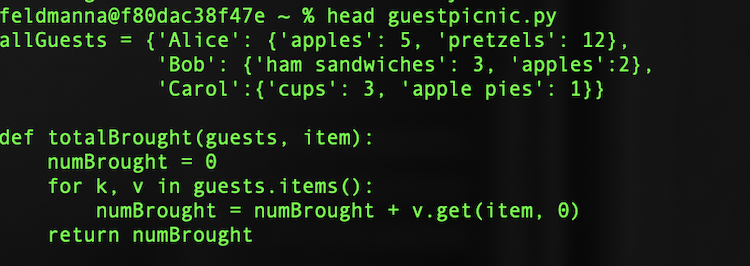
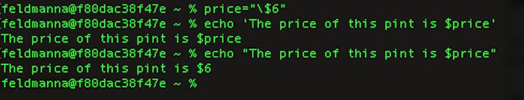

<!--

author:   Nicole Feldman and Elizabeth Drellich
email:    feldmanna@chop.edu and drelliche@chop.edu
version:  1.0.0
module_template_version: 2.0.0
language: en
narrator: UK English Female
title:  Bash: Scripting Basics
comment:  This module will teach you how to create and use simple bash scripts so to make repetitive tasks as simple as possible. If you have some experience with bash and want to learn how to save and reuse bash processes, this lesson is for you.
estimated_time: 30 minutes

@learning_objectives

After completion of this module, learners will be able to:

- Identify the structure of a bash script
- Call bash scripts
- Write simple bash scripts
@end

link:  https://chop-dbhi-arcus-education-website-assets.s3.amazonaws.com/css/styles.css

script: https://kit.fontawesome.com/83b2343bd4.js
-->

# Bash: Scripting Basics

## Overview

@comment

**Is this module right for me?**

@long_description

**Estimated time to completion:** @estimated_time

**Pre-requisites**

Learners should be familiar with using a bash shell to navigate a directory system. Learners will get the most out of this lesson if they can also create directories and files, write text to files, and read files from their bash shell command line interface.

**Learning Objectives**

@learning_objectives

## Lesson Preparation

You will get the most out of this lesson if you follow along with the examples and try out the commands. In order to do that you need to have a bash shell open on your computer. Please follow the instructions appropriate for the computer you are using.

## What is a script?

why are the so freakin cool?

### Structure

Title, shebang start line, end in `.sh`

### Location

`/bin` folder?

### Quiz: Scripts

## Calling a script
downloadable examples?
### Basic examples

### Scripts that take arguments

### Interactive scripts

### Quiz: Calling scripts

## Writing a script

### Basic commands
### Bash syntax

### Quiz: Writing scripts

- `cat`: very powerful three-part function that allows a reader to view, combine (concatenate), or create a new version of a file

  - `cat file 1 file 2` will display the contents of both files on separate lines.
  - `cat > file 4` will create a new file named file 4
  - `cat file 1 >> file 2` will append the contents of file 1 at the end of file 2.
  - `cat file 2` will now confirm if the content in file 1 was successfully appended to the end of file 2.

  

### Viewing the contents of a file

- `less`: view contents of a file without opening a separate editor

  

### Quiz: Bash commands

Select the three functions of the `cat` command?

[[X]] View
[[ ]] Categorize
[[X]] Concatenate
[[X]] Create New Version
***

The `sort` command is used to categorize files in bash.

***

## Bash syntax

- `~` shortcut for your home directory
- `.` shortcut for your current directory
- `..` shortcut for your previous directory
  The above three shortcuts are highly useful for executing scripts in the proper location once you are collaborating in an active project with multiple files and folders.

  - `echo`: prints out text in the terminal window- especially useful for declaring environment variables which reveal both permissions and what strings can be passed.

    

### Writing output to a file with `>`
- `>` takes the output of the command you executed in the terminal and places it in a new file

### Linking commands with `|`

- `|` takes the output of one command and passes it to the next command in the sequence. Allows for integrating of commands

### Defining variables with `$`
- `$` used to define a variable expression as used in the echo example above.

### Quiz: Bash syntax

What character passes the output of one command to the next command in a sequence?

[(X)] \|
[( )] &
[( )] +
[( )] -
***

This character is called a **pipe**, and it's name is a great way to visualize what it does: the output from the command to the left flows into the commands to the right through the pipe to create a pipeline :)

***

## Setting up a User/Home Directory

- As you get comfortable in bash, it is important to create a default home directory in an easily accessible place.
- It is recommended that you use the native user directory in the home directory on your computer. Your user directory contains a folder named “bin” which is the root directory of any unix like operating system.
- Bin is short for “binary” and is where you can store any configuration or executable files for programs you run on the CLI. This will be a good place to store bash scripts (.sh files) once you have become comfortable executing commands and learning syntax.

## Permissions and working with other users

- `Chmod` or change mode is used to set the permissions on a file or directory.
- The three basic permissions are:

  - **read** - access the contents of a file
  - **write** - modify the contents of a file or directory
  - **execute** - run a bash script on a file or directory.

- [Consult this documentation and table for guidance on how to apply useful file and directory level permissions](https://linuxcommand.org/lc3_lts0090.php)
- `Chown`: change file ownership
- `Chgrp`: change group ownership
- `Sudo` - assume super user privileges on an as-needed basis.

**Proceed with caution!** Using the `Sudo` command is decidedly not best data security practice, but might need to be invoked as you continue to learn bash, as permissioning can be quite granular and dynamic.

### Quiz: Permissions

Which numerical sequence grants no restrictions on permissions and should generally be avoided?

[( )] 755
[( )] 666
[( )] 700
[(X)] 777
[[?]] Hint: Check out the link to the file permissions documentation on the previous page!
***

Giving all users access to manipulate files and directories in any way doesn't tend to lead to great outcomes. 755, in which the file owner can read, write, while enabling all other permissioned users to read and execute a file, is a safer and more productive option to choose.

***

## Mounting external file shares and basic navigation

- When you mount something you are placing access to a file directory system within your root file system structure, giving yourself a fixed location by which to access files. This is not unlike the C: or D: drives visible in Windows or the Mac HD icon on a Mac.
- `cd/mnt/file_path` opens up access to this external directory within the shell scripting window. As long as permissions have been appropriately granted, you can now collaborate with colleagues in the mounted file directory.

## Glossary

- Binary or Executable File: A file that causes a computer to follow a series of tasks represented in encoded instructions. It should be noted that .bin is the preferred Mac extension and .exe is the preferred Windows extension.
- Unix: Widely used class of computer operating systems which support multitasking and multiusers.
- Linux: Open source operating system modeled on Unix. Bash is the most common shell for Linux.

## Additional Resources

- [Brief Illustration of the Difference between Shell and Kernel](https://www.geeksforgeeks.org/difference-between-shell-and-kernel/)
- [Exhaustive Wiki of Linux Filesystem Hierarchy](https://tldp.org/LDP/Linux-Filesystem-Hierarchy/html/index.html)
- [Reinforce Your New Knowledge through this Learing the Shell Page](https://linuxcommand.org/lc3_learning_the_shell.php)
- [Unix Command Line I Arcus Education Webinar](https://digitalrepository.chop.edu/commandline_computingtools/3/)
- [Unix Command Line II Arcus Education Webinar](https://digitalrepository.chop.edu/commandline_computingtools/2/)
- [Intermediate Bash Scripting Arcus Education Webinar](https://digitalrepository.chop.edu/commandline_computingtools/1/)

## Feedback

In the beginning, we stated some goals.

**Learning Objectives:**

@learning_objectives

We ask you to fill out a brief (5 minutes or less) survey to let us know:

* If we achieved the learning objectives
* If the module difficulty was appropriate
* If we gave you the experience you expected

We gather this information in order to iteratively improve our work. Thank you in advance for [filling out our brief survey](https://redcap.chop.edu/surveys/?s=KHTXCXJJ93&module_name=%22Bash+Scripting+Basic%22)!
