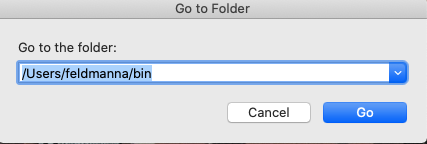
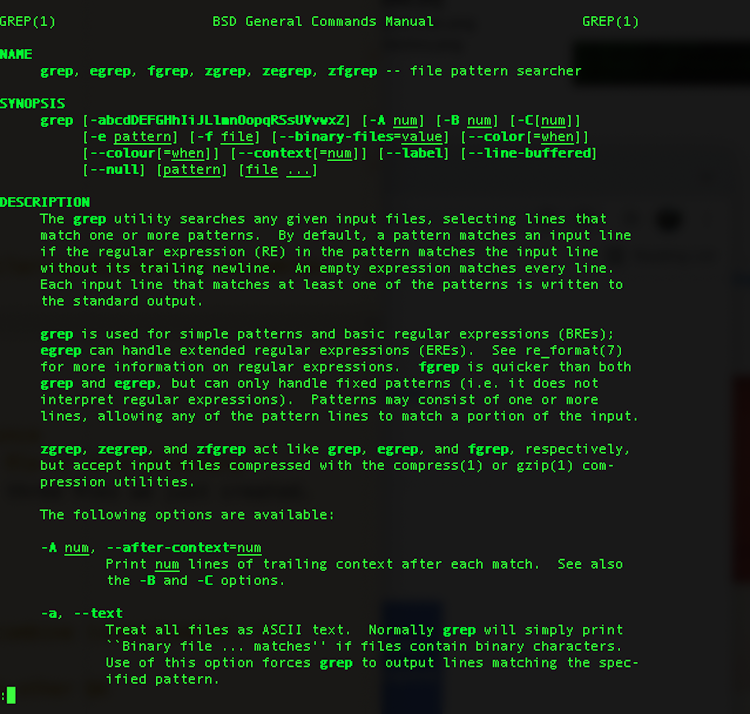

<!--

author:   Nicole Feldman
email:    feldmanna@chop.edu
version:  1.1.0
language: en
narrator: UK English Female
title: Bash Scripting 101
comment:  This course will focus on accessing a command line program and running shell scripts on your home computer, learning how to execute useful commands and recognize basic syntax, and, finally, learning how to set permissions in a way that leads to collaborating on a shared file directory with colleagues.

long_description: This module is for people interested in harnessing the power of well-organized files and folders and who want to try a relatively accessible programming language.
estimated_time: 30 minutes

@learning_objectives

After completion of this module, learners will be able to:

- Describe what bash scripting is and why they might want to learn it for data management and research
- Recognize bash scripting commands and syntax
- Know how to access the command line and execute bash scripting commands in the linux shell environment
- Know how to modify permissions on shared files and directories in bash
@end

link:  https://chop-dbhi-arcus-education-website-assets.s3.amazonaws.com/css/styles.css

script: https://kit.fontawesome.com/83b2343bd4.js
-->

# Bash Scripting 101

## Overview

@comment

**Is this module right for me?**

@long_description

**Estimated time to completion:** @estimated_time

**Pre-requisites**

Learners should be familiar with locating files and folders stored in a directory system. Familiarity with using a command line interface to execute code is recommended but not required. This course is designed to be equally useful for those with experience running code as well as for those who are total newbies.

**Learning Objectives**

@learning_objectives

## What is the shell? Why would I use it?

Bash or unix shell is a free command line language and the default login shell for most Linux machines. A command line interface or CLI allows a user to pass a series of text (commands) to a program in order to execute code. The execution of shell commands is known as shell scripting.

**Why is it called a "shell"?** Your computer has an operating system (OS), most commonly either Windows, Mac, or Linux. The core for the OS itself is called the kernel; it's the heart of how everything works in your computer, but you can't actually interface with it directly as a user. Programs that are designed to work with your OS can communicate with the kernel (Word, RStudio, Chrome, etc.), but if you want to do something outside of one of those programs you can't connect to the kernel directly yourself. That's where a shell comes in.

The shell is like a layer outside the kernel that you as a user can communicate with. You can type commands in the shell, and it will execute them for you in the kernel. Back when computers were newer and there were few ready programs available, the shell was the primary way to get stuff done on a computer.

To learn more, check out this post for [an excellent breakdown of the difference between the shell and the kernel](https://www.geeksforgeeks.org/difference-between-shell-and-kernel/).

Shell scripting’s portable, user-friendly syntax belies its power. Straightforward bash command line interfaces are available pre-installed on both Mac and Windows machines and can be readily accessed by just searching in the correct place.

There are several ways shell scripting can be useful to researchers and others working with data:

- Commands run on one’s local machine or on a training data set can be scaled up to working with large volumes of data in a high performance computing (hpc) or cloud hosted environment.
- Shell scripts can also call on multiple other programming languages, like R and python, to build pipelines that run across several software applications as well as enable a user to have greater facility with tools like git and docker.
- Adoption of shell scripting also reinforces the importance of having well-structured and well-named files and file directory structures.

### Quiz: Why bash?

Which of the following are TRUE about bash/shell scripting? Select all that apply.

[[X]] Shell scripting is a way for a user to interact with the core (or kernel) of your operating system.
[[X]] Command line interfaces are pre-installed on most operating systems.
[[ ]] Bash is expensive.
[[X]] Shell scripts can work with other programming languages, such as R and Python, in pipelines.
***

Bash, or shell, scripting is a way to interface with your computer's operating system, and the necessary applications are probably already on your computer! You can also create pipelines that utilize bash and other programming languages. It's also 100% free!

***

## How do I get it?

Everything that is necessary to run bash on your Mac or Windows machine is probably already installed; in fact, you may have done some shell without even realizing it!

### Mac Installation

- On a Mac machine, bash is the default login shell in the Terminal command line program.
- Type "terminal" in your Mac spotlight search to pull up this program for the first time (though it might already launch in the dock on your machine).
- It should be noted that Macs with the Catalina Operating System or later are running zsh instead of bash. That said, zsh is [functionally a later and greater version of bash with some key differences noted](https://medium.com/@harrison.miller13_28580/bash-vs-z-shell-a-tale-of-two-command-line-shells-c65bb66e4658).

### Windows Installation

- On a Windows machine, the WSL (Windows Subsystem for Linux) has Ubuntu, which is just a widely used flavor of Bash, installed as its default shell scripting environment. This is automatically installed on any Windows computer running Windows 10 or later.
- To confirm this feature is enabled, check to see if developer mode is enabled in settings and WSL is turned on in Features.
- Search Bash in Cortana to launch WSL for the first time and click “Y” when asked to install Ubuntu for the first time. [Microsoft has their own internal documentation on WSL which features additional visual resources and FAQS](https://docs.microsoft.com/en-us/windows/wsl/).
- Create a username and password when prompted and now you are ready to do some shell scripting! These user credentials have no bearing on your Windows user name and you will be automatically logged in for future sessions.

### Quiz: Accessing the bash shell

What is the name of the pre-installed program used to run shell scripts on a Mac?

[( )] Together
[( )] MSL (Mac Subsystem for Linux)
[(X)] Terminal
[( )] Ubuntu
***

WSL is the Windows utility for running shell. Ubuntu is a well known Linux operating system that is often used as the default shell scripting environment.

***

## Setting up a User/Home Directory

- As you get comfortable in bash, it is important to create a default home directory in an easily accessible place.
- It is recommended that you use the native user directory in the home directory on your computer. Your user directory contains a folder named “bin” which is the root directory of any unix like operating system.
- Bin is short for “binary” and is where you can store any configuration or executable files for programs you run on the CLI. This will be a good place to store bash scripts (.sh files) once you have become comfortable executing commands and learning syntax.

## Useful Commands and Syntax

In our installation section, we covered how accessing CLI tools to run bash scripts is quite uncomplicated on either operating system. Similarly, bash commands and syntax are approachable and integrate well to allow for a gradual increasing in the complexity of utilities run.

### Commands

- `Ls`: list directory contents
- `Mkdir`: create a new directory at the folder level
- `Cd`: change directory
- `Echo`: prints out text in the terminal window- especially useful for declaring environment variables which reveal both permissions and what strings can be passed.

  

- `Touch`: creates a new file

  - `touch file 1` will create a single new file
  - `touch file 1 file 2 file 3` will create multiple uniquely named files at once

- `Grep`: powerful search function to locate a string or pattern within a file or in a directory. Grep stands for global regular expression print.

  - `grep 'panda' file 1 file 2 file 3` will search for the word "panda" in the three files we just created.

- `Man`: reveals function of a given command

  

- `Mv`: move or rename a directory and allows for batch processing
  `mv *.txt folder` will move all files with a .txt file extension into a folder for example.
- `Less`: view contents of a file without opening a separate editor

  

- `Cat`: very powerful three-part function that allows a reader to view, combine (concatenate), or create a new version of a file

  - `cat file 1 file 2` will display the contents of both files on separate lines.
  - `cat > file 4` will create a new file named file 4
  - `cat file 1 >> file 2` will append the contents of file 1 at the end of file 2.
  - `cat file 2` will now confirm if the content in file 1 was successfully appended to the end of file 2.

  

### Quiz: Bash commands

Select the three functions of the `cat` command?

[[X]] View
[[ ]] Categorize
[[X]] Concatenate
[[X]] Create New Version
***

The `sort` command is used to categorize files in bash.

***

### Syntax

- `>` takes the output of the command you executed in the terminal and places it in a new file
- `|` takes the output of one command and passes it to the next command in the sequence. Allows for integrating of commands
- `~` shortcut for your home directory
- `.` shortcut for your current directory
- `..` shortcut for your previous directory
  The above three shortcuts are highly useful for executing scripts in the proper location once you are collaborating in an active project with multiple files and folders.
- `*` character sequence wildcard. Very useful in running a command on all files with a given file extension as demonstrated in the mv example above.
- `$` used to define a variable expression as used in the echo example above.

### Quiz: Bash syntax

What character passes the output of one command to the next command in a sequence?

[(X)] \|
[( )] &
[( )] +
[( )] -
***

This character is called a **pipe**, and it's name is a great way to visualize what it does: the output from the command to the left flows into the commands to the right through the pipe to create a pipeline :)

***

## Permissions and working with other users

- `Chmod` or change mode is used to set the permissions on a file or directory.
- The three basic permissions are:

  - **read** - access the contents of a file
  - **write** - modify the contents of a file or directory
  - **execute** - run a bash script on a file or directory.

- [Consult this documentation and table for guidance on how to apply useful file and directory level permissions](https://linuxcommand.org/lc3_lts0090.php)
- `Chown`: change file ownership
- `Chgrp`: change group ownership
- `Sudo` - assume super user privileges on an as-needed basis.

**Proceed with caution!** Using the `Sudo` command is decidedly not best data security practice, but might need to be invoked as you continue to learn bash, as permissioning can be quite granular and dynamic.

### Quiz: Permissions

Which numerical sequence grants no restrictions on permissions and should generally be avoided?

[( )] 755
[( )] 666
[( )] 700
[(X)] 777
[[?]] Hint: Check out the link to the file permissions documentation on the previous page!
***

Giving all users access to manipulate files and directories in any way doesn't tend to lead to great outcomes. 755, in which the file owner can read, write, while enabling all other permissioned users to read and execute a file, is a safer and more productive option to choose.

***

## Mounting external file shares and basic navigation

- When you mount something you are placing access to a file directory system within your root file system structure, giving yourself a fixed location by which to access files. This is not unlike the C: or D: drives visible in Windows or the Mac HD icon on a Mac.
- `cd/mnt/file_path` opens up access to this external directory within the shell scripting window. As long as permissions have been appropriately granted, you can now collaborate with colleagues in the mounted file directory.

## Glossary

- Binary or Executable File: A file that causes a computer to follow a series of tasks represented in encoded instructions. It should be noted that .bin is the preferred Mac extension and .exe is the preferred Windows extension.
- Unix: Widely used class of computer operating systems which support multitasking and multiusers.
- Linux: Open source operating system modeled on Unix. Bash is the most common shell for Linux.

## Additional Resources

- [Brief Illustration of the Difference between Shell and Kernel](https://www.geeksforgeeks.org/difference-between-shell-and-kernel/)
- [Exhaustive Wiki of Linux Filesystem Hierarchy](https://tldp.org/LDP/Linux-Filesystem-Hierarchy/html/index.html)
- [Reinforce Your New Knowledge through this Learing the Shell Page](https://linuxcommand.org/lc3_learning_the_shell.php)
- [Unix Command Line I Arcus Education Webinar](https://digitalrepository.chop.edu/commandline_computingtools/3/)
- [Unix Command Line II Arcus Education Webinar](https://digitalrepository.chop.edu/commandline_computingtools/2/)
- [Intermediate Bash Scripting Arcus Education Webinar](https://digitalrepository.chop.edu/commandline_computingtools/1/)

## Feedback

_5 minute survey_

At the beginning of this module we described the following goals:

**Learning Objectives**: After completion of this module, learners will be able to:

- Describe what bash scripting is and why they might want to learn it for data management and research
- Recognize bash scripting commands and syntax
- Know how to access the command line and execute bash scripting commands in the linux shell environment
- Know how to modify permissions on shared files and directories in bash

We ask you to fill out a brief (5 minutes or less) survey to let us know:

- If we achieved the learning objectives
- If the module difficulty was appropriate
- If we gave you the experience you expected

We gather this information in order to iteratively improve our work. Thank you in advance for [filling out our brief survey](https://redcap.chop.edu/surveys/?s=KHTXCXJJ93&module_name=%22Bash+Scripting+101%22)!
