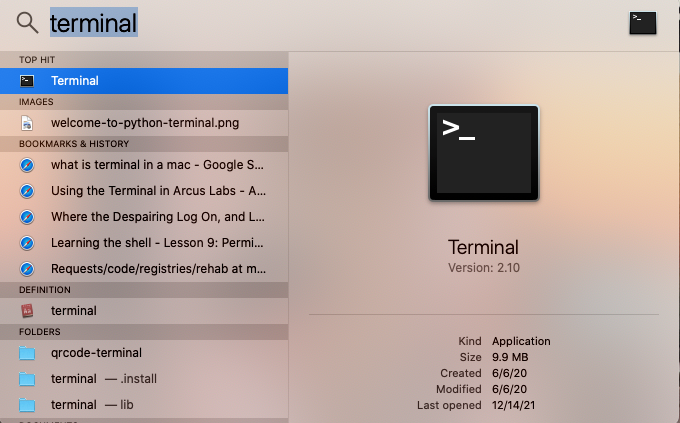
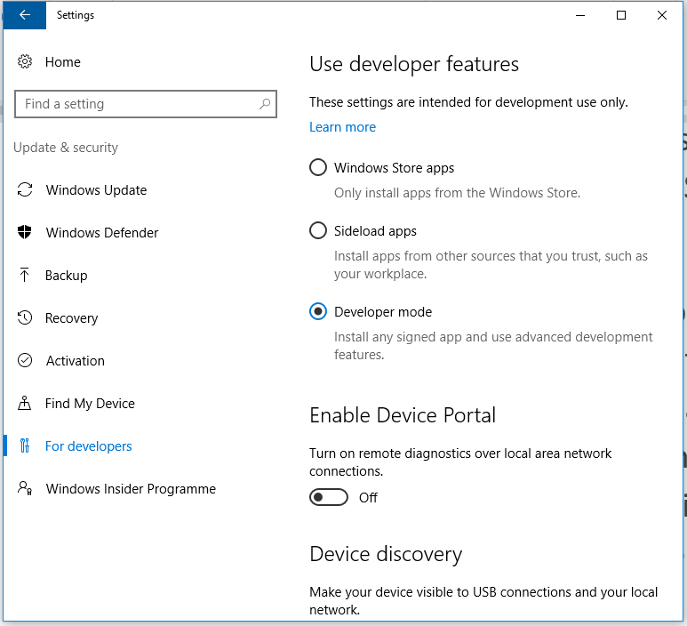
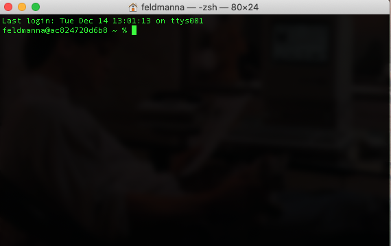

<!--

author:   Nicole Feldman and Elizabeth Drellich
email:    feldmanna@chop.edu drelliche@chop.edu
version:  1.1.0
module_template_version: 2.0.0
language: en
narrator: UK English Female
title: Bash Scripting 101
comment:  This course will focus on accessing a command line program and running shell scripts on your home computer and learning how to navigate your file system as well as editing and searching files.

long_description: This course is designed to be both an introduction to bash for those who are total newbies as well as refresher for those some with experience running code who want a more solid command of the basics.

estimated_time: 30 minutes

@learning_objectives

After completion of this module, learners will be able to:

- Describe what bash scripting is and why they might want to learn it for data management and research
- Navigate their file system using the bash shell
- View and edit the contents of a file from the bash shell
@end

link:  https://chop-dbhi-arcus-education-website-assets.s3.amazonaws.com/css/styles.css

script: https://kit.fontawesome.com/83b2343bd4.js
-->

# Bash Scripting 101

<div class = "overview">

## Overview

@comment

**Is this module right for me?**

@long_description

**Estimated time to completion:** @estimated_time

**Pre-requisites**

Learners should be familiar with locating files and folders stored in a directory system.


**Learning Objectives**

@learning_objectives

</div>


## Lesson Preparation

You will get the most out of this lesson if you follow along with the examples and try out the commands. In order to do that you need to have a bash shell open on your computer. Please follow the instructions appropriate for the computer you are using.

While it is true that the bash shell is a powerful tool that can be used to make major changes on a computer, we won't be learning how to do any of that in this lesson. This is a zero risk exploration to get you comfortable with using the bash shell.

### Mac Computers



On a Mac computer, bash is the default login shell in the **Terminal** command line program.

1. Type "terminal" in your Mac spotlight search to pull up this program.

2. The terminal may take a few seconds to start, once it is open you should see a blinking cursor where you can type.

<div class = "learnmore">
It should be noted that Macs with the Catalina Operating System or later are running zsh instead of bash. That said, zsh is [functionally a later and greater version of bash with some key differences noted](https://medium.com/@harrison.miller13_28580/bash-vs-z-shell-a-tale-of-two-command-line-shells-c65bb66e4658).
</div>

### Windows Computers

Check in your start menu if you have either **WLS** (the Windows Subsystem for Linux) or **Git Bash** already installed on your computer. If you have either one of those programs and can open a command line interface using it, you are all ready to get started!

If you do not have either of those programs available, please follow the instructions below. **Do not use the PowerShell** program for this lesson, it utilizes a different scripting language.

<div class = "warning">
There are two sets of instructions for Windows users, one for users who have administrative access to their computers, and one that will work for most users who don't. That said, your organization may have stricter controls on what a non-admin user can download.

**If the instructions for non-admin users do not work for you, you may have to talk to your organization's IT support about getting access.**
</div>

**Windows users with admin access**


1. On a Windows machine, the WSL (Windows Subsystem for Linux) has Ubuntu, which is just a widely used flavor of Bash, installed as its default shell scripting environment. This is automatically installed on any Windows computer running Windows 10 or later.

2. To confirm this feature is enabled, check to see if developer mode is enabled in settings and WSL is turned on in Features. **If you are unable to turn on the developer mode, you may not have admin permissions. Follow the instructions for downloading Git Bash below.**




3. Search "Bash" in Cortana to launch WSL for the first time and click “Y” when asked to install Ubuntu for the first time. [Microsoft has their own internal documentation on WSL which features additional visual resources and FAQS](https://docs.microsoft.com/en-us/windows/wsl/).

4. Create a username and password when prompted and now you are ready to do some shell scripting! These user credentials have no bearing on your Windows user name and you will be automatically logged in for future sessions.

**Windows users with or without admin access**

You will need to download and use the **Git Bash**, a bash shell that is downloaded when you set up **Git** on your computer.

Git is a powerful version control system for organizing your work and you will likely want to use at some point in the (near) future if you don't use it already. For that reason, we recommend that you follow these instructions for [setting up Git on your Windows computer](https://liascript.github.io/course/?https://raw.githubusercontent.com/arcus/education_modules/main/git_setup_windows/git_setup_windows.md#Lesson-Preparation).
You do not need to configure Git at the this time, so following the instructions in the Lesson Preparation section will suffice. The installation process may take about 10 to 15 minutes.

Once you have Git Bash installed, you are ready to get started learning how to use the bash shell!


## The bash shell

Your computer has an **O**perating **S**ystem (OS), most commonly either Windows, Mac, or Linux. The core for the OS itself is called the kernel; it's the heart of how everything works in your computer, but you can't actually interface with it directly as a user. Programs that are designed to work with your OS can communicate with the kernel (Word, RStudio, Chrome, etc.), but if you want to do something outside of one of those programs you can't connect to the kernel directly yourself. That's where a shell comes in.

The shell is like a layer outside the kernel that you as a user can communicate with. You can type commands in the shell, and it will execute them for you in the kernel. Back when computers were newer and there were few ready programs available, the shell was the primary way to get stuff done on a computer.

<div class = "learnmore">
To learn more, check out this post for [an excellent breakdown of the difference between the shell and the kernel](https://www.geeksforgeeks.org/difference-between-shell-and-kernel/).
</div>


### What is it?

A **C**ommand **L**ine **I**nterface or CLI allows a user to pass a series of text (commands) to a program in order to execute code. The execution of shell commands is known as shell scripting.

**Bash** (or **unix shell**) is a free command line language.  

A lot of organizational tasks that you might do with "point and click" programs, like opening files and folders, editing or moving their contents, renaming files and folders, can be done in a bash shell. If you computer uses a Linux operating system, the bash shell may be the default way to do these things, but even if you are using a different operating system like iOS (Mac) or Windows, it can be very useful to use bash scripting.

### Why would I use it?

If you have ever spent time painstakingly renaming files to prepare them for processing one at a time, then you know how difficult that task can be using point and click methods. Bash scripting can can make this kind of task easier, faster, and more accurate.

Shell scripting can be useful to researchers and others working with data:

- Commands run on one’s local machine or on a training data set can be scaled up to working with large volumes of data in a **h**igh **p**erformance **c**omputing (hpc) or cloud hosted environment.

- Shell scripts can call on multiple other programming languages, like R and python, to build pipelines that run across several software applications as well as enable a user to have greater facility with tools like Git and docker.

- Adoption of shell scripting also reinforces the importance of having well-structured and well-named files and file directory structures.

### Quiz: Why bash?

Which of the following are TRUE about bash/shell scripting? Select all that apply.

[[X]] Shell scripting is a way for a user to interact with the core (or kernel) of your operating system.
[[X]] Command line interfaces are pre-installed on most operating systems.
[[ ]] Bash is expensive.
[[X]] Shell scripts can work with other programming languages, such as R and Python, in pipelines.
***
<div class = "answer">
Bash, or shell, scripting is a way to interface with your computer's operating system, and the necessary applications are probably already on your computer! You can also create pipelines that utilize bash and other programming languages. It's also 100% free!
</div>
***


## Navigating in bash

If you are new to bash scripting, it can take some adjustment to navigate by typing text. Once you get the hang of a few basic commands, this can be an easier way to deal with files and folders than dropdown menus and dragging icons from place to place. Even the language we use is a little different. In bash scripting you will hear folders refered to as **directories**.

To enter a command into the shell, type it in where the blinking cursor appears and press `Enter` or `return` on your keyboard.

### Navigation Commands

Just like when you navigate any file system, it is important to know where you are, see what files and folders are in that location, and move to other locations.

**Where am I?**

The command `pwd`, which stands for **p**resent **w**orking **d**irectory, will return the path through your directory system to your current location.

**What is here?**

The bash shell doesn't show the icons of the files and directories in your present working directory. Instead you will need to ask for a list of the directory's contents with the command `ls`.

**How do I move around?**

The command `cd` lets you **c**hange **d**irectory. Unlike the previous two commands, `cd` requires you to provide additional information: the directory you want to move to. You can move to a location relative to your current location, or you can move anywhere directly if you know the path to get there.

- Move to a directory relative to your present working directory:

  * If the directory `directory_name` is in your present working directory (i.e. it is one of the listed items when you enter `ls`) you can navigate into it with the command `cd directory_name`

  * To move to the parent directory of your current location, use `cd ..`

  * Use slashes `/` to link directions. For example `cd ../..` up to the the parent directory of your parent directory.

  * It is possible to move up and then back down in your file hierarchy. For example `cd ../other_directory` would move you to the `other_directory` that shares the same parent directory as your current location.

- Move to a directory using its file path:

  * To return to your home directory use `cd ~`

  * If you know how to get to the directory you want from your home directory, you can go directly there with `cd ~/fixed/path/to/directory`


**Give it a try!** Use these commands to explore the directories on your computer. Try navigating around some files and folders that you are already familiar with to get comfortable with how they look through the bash shell.

### Tab completion

If it seems like there is an awful lot to make sure you are typing correctly  into your bash shell, you are right. Luckily you don't have to type everything out fully because you can use the `tab` key on your computer.

Once you start typing the first few letters of a directory, press `tab`. The shell will automatically fill in as much as it can of what you are typing. For example if I have only two directories in my current location, named `my_directory` and `shared_directory`, I don't need to type out the full name of the directory I want to `cd` into. In fact since they start with different letters, `cd m` followed by the `tab` instead of the `enter` or `return` key will automatically be completed to the only possibility, `cd my_directory`.

If there were another directory that started with the same few letters, the shell will guess as far as it can. For example if there were also a folder `my_random_files`, typing `cd m` followed by `tab` would prompt the shell to complete as much as it can: `cd my_` and then you could keep typing either an `r` or `d` followed by another `tab` to complete the line of code.

<div class = "important">
Tab completion is useful not just for navigating your file system, but for all sorts of commands in bash scripting. By minimizing the amount you have to type it can make your work both easier and more accurate. You should always be sure to double check that the `tab` completed the line to what you wanted it to be.
</div>


### Quiz: Navigation

Your project is located in the directory `project` which has fixed path `~/project` and contains directories `notes` and `data`. You run `pwd` and see that you are in `project/notes/1_jan_2022/`. How would you navigate to the `data` directory?

[[cd ../../data]]
<script>
let input = "@input".trim();
  input == "cd ../../data" || input == "cd ~/project/data";
</script>
***
<div class = "answer">
The `cd` function changes what directory you are in. There are a couple of ways to move to the `data` directory:

- The fixed path to the `data` directory is `~/project/data`, so `cd ~/project/data` will get you there.

- Relative to your current location, you can go up one level with `..` to the `notes` directory, then up another level with `..` to `project`. Once in the `project` directory you can move down a level into `data`.

    * You can do this in three steps: `cd ..` followed by `cd ..` again and lastly `cd data`

  * You can link the three steps together with `cd ../../data`
</div>
***

## Editing Files

The bash shell can see and move files of all types, but it is most useful for interacting directly with plain text files.

A [**plain text**](https://en.wikipedia.org/wiki/Plain_text) file is a file that contains only text characters like the ones you can type directly using your keyboard. For example the words "plain text" at the beginning of this paragraph, which are both bolded and hyperlinked, are not being presented to you as plain text. You might have run into problems with files that aren't in plain text if, for example, you ever opened a file in a new program and lost some of the formatting like particular fonts in Word or conditional highlighting in Excel.

<div class = "learnmore">
Even though the words "plain text" in the previous paragraph have some non-text attributes, the are all recorded as plain text in the Markdown (`.md`) file of this lesson. If you open the [Markdown file](link/to/git/of/this/file), you will see only characters that can be typed by a keyboard:

```
[**plain text**](https://en.wikipedia.org/wiki/Plain_text)
```
</div>

If you have been using a particular program to write and edit your files like Word, RStudio, or Jupyter notebook, you will need to continue to use that program to edit those files. If you expect your project to grow substantially in size or number of files, having as much of your work as possible in plain text files may make scaling up easier.

Some common types of plain text files you might have seen before are:

| file ending | description |
|:---:| :---|
| `.txt` | text file |
| `.csv` | comma separated values |
| `.md` | markdown file |
| `.html` | html file |

<div class = "learnmore">
The file endings like `.txt`, `.csv`, or `.doc` (Word), `.xslx` (Excel) are the part of the file name that lets your computer know what type of program to use to open it. The ending doesn't actually impact the contents of the file, which is why we were able to create files like `my_file` in the previous section with no file ending at all.
</div>


### Creating files


<div class = "important">
You will get the most out of this section if you follow along in your own command line interface, running the commands as you learn them.

So that we don't change any of your pre-existing files, we will practice this in a new directory that you can play around with or delete later.
</div>


Make sure you are in your home directory with `pwd`. If not, `cd ~` will get you there.

**Making a new directory**

The command `mkdir` will create a new directory in your current location. Let's make a new directory called `learning_bash`:

```
cd ~
mkdir learning_bash
```

You will now see `learning_bash` when you ask for the list of files and directories with `ls`, and can use `cd` to navigate into it.

**Creating a new file**

The command `touch` creates a new file. You need to give your file a name.

From your `learning_bash` directory create a new file called `my_file`:

```
cd ~/learning_bash
touch my_file
```

You can also create multiple files at a time by listing their unique names one after another:

```
cd ~/learning_bash
touch file_1 file_2 file_3
```

Now if you use `ls` to see the contents of `learning_bash`, you should see four files: `file_1`, `file_2`, `file_3`, and `my_file`.

Since these are files and not directories, we can't use `cd` to open them, and we didn't put anything into these files yet anyway. We will learn how to interact with their contents in the next section.


<div class = "warning">
You might have noticed that none of the file or directory names we used had spaces in them. Bash scripting gets quite a bit more complicated when you have spaces in names, so it is considered best practice to avoid them.
</div>

### Writing to a file directly

We have created 4 files, but so far all of them are empty. The most direct way to write text to a file is to use the `echo` and `>>` commands.

**`echo`**

The bash command `echo` returns any text that follows it. Give it a try in your command line interface!

**`>>`**

The bash command `>>` is used to write the output of a command to the end of a file. For example the following code will create a file called `my_sentences` and write the text `This is a sentence.` in that file.

```
echo "This is a sentence." >> my_sentences
```

If you then want to add an additional line to `my_sentences` you can use the same method.

```
echo "This is another sentence." >> my_sentences
```

Now the file `my_sentences` has two lines:

```
This is a sentence.
This is another sentence.
```

**Give it a try!** Add some text to the files you already created!

<div class = "warning">
Make sure you use the two arrows in `>>`. Using only a single arrow will also write text to your file, but instead of appending it to the end of the file, it will replace the entire contents of the file with that new text.
</div>

Next, we will see learn how to look at the contents of our file to ensure that it really does contain what we think it should.

### Viewing the contents of a file

The easiest way to see the contents of a file is the `cat` function. If you run `cat` followed by a file name, the command line interface will print out the contents of that file line by line.

Give it a try:

```
cat my_sentences
```

<div class = "learnmore">
The command `cat` is very powerful three-part function that allows a reader to view, combine, or create a new version of a file. In fact `cat` is a shortening of the word "con**cat**enate."
</div>


### Text editors

The commands `echo` and `cat` are extremely useful if you are automatically writing files by running code, but they aren't particularly easy to use if you are creating large files with lots of text that you are going to want to edit.

Luckily there are lots and lots of programs that edit text files. Some of these may already be on your computer as part of the bash shell, while others you will have to download.

The switch from a **word processor** program that lets you format text to a **text editor** that only deals in plain text might initially feel unsettling, but it is well worth never having to worry about losing parts of your work when something gets opened in the wrong program!

There are some text editors already installed in your bash shell, like nano. These are useful because they don't require new downloads, but can have a steep learning curve since you need to learn new commands to open, save, and quit in those programs.

Other, more user-friendly, text editors exist and can be downloaded. [Atom](https://atom.io/) is a particularly good free text editor that includes helpful tools like color coding text.


**`nano`**

The `nano` text editor is already in Bash Shell. You can type `nano` to start a new file, or `nano file_name` to open a file that already exists. You will need to use keyboard commands to save, or WriteOut, and exit the program, but they are all helpfully listed at the bottom of your window when you are in nano.

For example to exit nano, the `^X` reminder at the bottom means that you should hold down the `control` button at the same time as the key `X`. You will then be helpfully asked if you want to "Save modified buffer," or in other words, save your changes. Type `Y` and you will be asked for the "File name to write." If you are working in a new file, give it a name here! Otherwise you can press `enter`/`return` to accept the name the file already had.  


**Atom**

Atom is a free text editor that you can download from [https://atom.io/](https://atom.io/). Once you open the Atom program, you will see "File" and "Edit" menus like you might expect from a word processing program. You can open files, save them, as well as create new folders and files from Atom's "File" menu.


**Vim**

Vim may be the default editor in your shell, but that doesn't mean it is the best one. It is notoriously un-friendly to new users so we don't recommend it as your first (or second) choice of text editor.

<div class = "help">

**Stuck in Vim?**

The default text editor on macOS and Linux is usually set to Vim, which is not famous for being intuitive. That is why we don't recommend it as a text editor. If you accidentally find yourself stuck in it, hit the `Esc` key, followed by `:`+`Q`+`!` (colon, lower-case 'q', exclamation mark), then hitting Return to return to the shell.
</div>


### Quiz: Editing files

1. You want to make a new folder inside `learning_bash` called `data` and put two files in it, `data_1` and `data_2`.

```
cd ~/learning_bash
______A_______
______B_______
touch data_1 data_2
```
What code should go in lines A and B?

Line A should be:

[[ `touch data`| (`mkdir data`) | `cd data` ]]

Line B should be:

[[ `touch data`| `mkdir data` | (`cd data`) ]]
***
<div class = "answer">
You must first make the directory `data` and then move into that directory with `cd data`.

The command `touch data` will create a file named `data`, not a directory that can contain files.
</div>
***


2. Now that you have created the files `data_1` you want to put some content into it. How would you make the file `data_1` contain the text `sample 1: 45`?

[[echo "sample 1: 45" >> data_1]]
<script>
let input = "@input".trim();
  input == "echo \"sample 1: 45\" >> data_1" || input == "echo sample 1: 45 >> data_1" || input == "echo \"sample 1: 45\" > data_1" || input == "echo sample 1: 45 > data_1";
</script>
***
<div class = "answer">
The command `echo "sample 1: 45" >> data_1` will add `sample 1: 45` as a new line at the end of the current contents of the file `data_1`.

Since there wasn't anything in `data_1` to begin with, you will get the same outcome if you use a single `>` to replace the entire file with `sample 1: 45`.

The quotes around the text can also be safely omitted in this case, but that isn't a good habit to get into since you may need them later as you progress in your bash scripting.
</div>
***


## Additional Resources

- [Brief Illustration of the Difference between Shell and Kernel](https://www.geeksforgeeks.org/difference-between-shell-and-kernel/)

- [Reinforce Your New Knowledge through this Learning the Shell Page](https://linuxcommand.org/lc3_learning_the_shell.php)


## Feedback

In the beginning, we stated some goals.

**Learning Objectives:**

@learning_objectives

We ask you to fill out a brief (5 minutes or less) survey to let us know:

* If we achieved the learning objectives
* If the module difficulty was appropriate
* If we gave you the experience you expected

We gather this information in order to iteratively improve our work. Thank you in advance for [filling out our brief survey](https://redcap.chop.edu/surveys/?s=KHTXCXJJ93&module_name=%22Bash+Scripting+101%22)!
