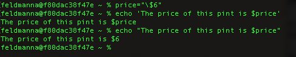
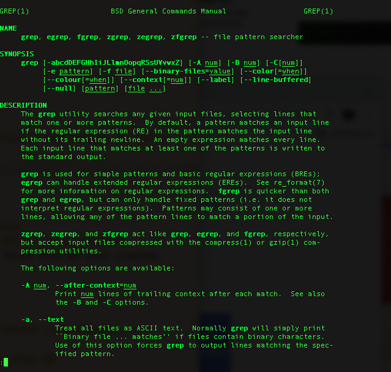
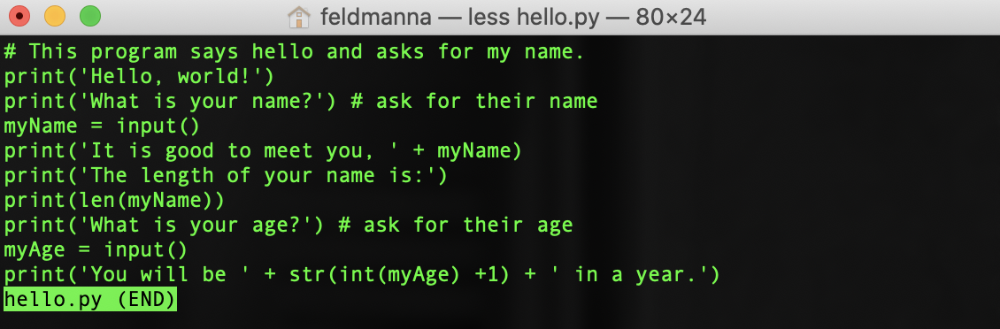

<!--

author:   Nicole Feldman
email:    feldmanna@chop.edu
version:  1.0.0
language: en
narrator: UK English Female
title: Command Line 101
comment:  This course will focus on accessing a command line program and running shell scripts on your home computer, learning how to execute useful commands and recognize basic syntax, and, finally,how to set permissions in a way that leads to collaborating on a shared file directory with colleagues.
long_description:
@learning_objectives

After completion of this module, learners will be able to:

- Describe what bash scripting is and why they might want to learn it for data management and research
- Recognize bash scripting commands and syntax
- Know how to access the command line and execute bash scripting commands in the linux shell environment
- Know how to modify permissions on shared files and directories in bash
@end
link:  https://chop-dbhi-arcus-education-website-assets.s3.amazonaws.com/css/modules.css

-->

# Command Line 101

## Overview

@comment

**Is this module right for me?**

If you're interested in harnessing the power of well-organized files and folders and want to try a relatively accessible programming language.

**Estimated time to completion:** ~30 minutes

**Pre-requisites**

Familarility with locating files and folders stored in a directory system. Familiarity using a command line interface to execute code is recommended but not required.

**Learning Objectives**

@learning_objectives

## What is the shell? Why would I use it?

- Bash or unix shell is a free command line language and the default login shell for most Linux machines. The execution of shell commands is known as shell scripting.
- Shell scripting’s portable, user friendly syntax belies its power.
- Commands easily mastered on one’s local machine or on a training data set can be scaled up to working with large volumes of data in a high performance computing (hpc) or cloud hosted environment.
- Adoption of shell scripting, also reinforces the importance of having well-structured and well-named files and file directory structures.

## How do I get it?

- It is very easy to run bash on a Mac or Windows machine. (In fact you may have already done some shell scripting without evening realizing it).

### Mac Installation

- On a Mac machine, bash is the default login shell in the Terminal command line program.
- Type terminal in your Mac spotlight search to pull up this program for the first time though it likely already launches in dock on your machine.
- It should be noted that Mac’s with the Catalina Operating System or later are running zsh instead of bash. That said, zsh is functionally a later and greater version of bash but key differences are noted [here](https://medium.com/@harrison.miller13_28580/bash-vs-z-shell-a-tale-of-two-command-line-shells-c65bb66e4658).

### Windows Installation

- On a Windows machine, the WSL (Windows Subsystem for Linux) has Ubuntu, which is just a widely used flavor of Bash, installed as its default shell scripting environment. This is automatically installed on any Windows computer running Windows 10 or greater.
- To confirm this feature is enabled, check to see if developer mode is enabled in settings and WSL is turned on in Features.
- Search Bash in Cortana to launch WSL for the first time and click “Y” when asked to install Ubuntu for the first time. Find detailed WSL instructions [here](https://docs.microsoft.com/en-us/windows/wsl/).
- Create a username and password when prompted and now you are ready to do some shell scripting! These user credentials have no bearing on your Windows user name and will be automatically logged in for future sessions.

### Knowledge Check 1

What is the name of the pre-installed program used to run shell scripts on a Mac?

[[]] Together
[[]] MSL (Mac Subsystem for Linux)
[[X]] Terminal
[[]] Ubuntu

---

WSL is the Windows utility for running shell. Ubuntu is a well known Linux operating system that is often used as the default shell scripting environment.

***********************************************************************

## Setting up a User/Home Directory

- As you get comfortable in bash, it is important to create a default home directory in an easily accessible place.
- It is recommended that you use the native user directory in the home directory on your computer. Your user directory contains a folder named “bin” which is the root directory of any unix like operating system.
- Bin is short for “binary” and is where you can store any configuration or executable files for programs you run on the CLI. This will be a good place to store bash scripts (.sh files) once you have become comfortable executing commands and learning syntax.

## Useful Commands and Syntax

### Commands

- Ls: list directory contents
- Mkdir: create a new directory at the folder level
- Cd:change directory
- Echo: prints out text in the terminal window- especially useful for declaring environment variables which reveal permissions and what strings can be passed.
  

- Touch: creates a new file
  `touch file 1` will create a single new file
  `touch file 1 file 2 file 3` will create multiple uniquely named files at once
- Grep:powerful search function to locate a string or pattern within a file or in a directory. Grep stands for global regular expression print.
  `grep 'panda' file 1 file 2 file 3` will search for the word "panda" in the three files we just created.
- Man:reveals function of a given command

  

- Mv: move or rename a directory and allows for batch processing
  `mv *.txt folder` will move all files with a .txt file extension into a folder for example.
- Less: view contents of a file without opening a separate editor

  

- Cat:very powerful three part function that allows a reader to view, combine (concatenate), or create a new version of a file
  - `cat file 1 file 2` will display the contents of both files on separate lines.
  - `cat > file 4` will create a new file named file 4
  - `cat file 1 >> file 2` will append the contents of file 1 at the end of file 2.
  - `cat file 2` will now confirm if the content in file 1 was successfully appended to the end of file 2.
- Head: read first ten lines of a file - useful for checking logs or doing other QA

  

### Knowledge Check 2

Select the three functions contained in the cat command?

[[X]] View
[[]] Categorize
[[X]] Concatenate
[[X]] Create New Version

---

The sort command is used to categorize files in bash.

***********************************************************************

### Syntax

- '>' takes the output of the command you executed in the terminal and places it in a new file
- | takes the output of one command and passes it to the next command in the sequence. Allows for integrating of commands
- ~ shortcut for your home directory
- . shortcut for your current directory
- .. shortcut for your previous directory
  The above three shortcuts are highly useful for executing scripts in the proper location once you are collaborating in an active project with multiple files and folders.
- '\*' character sequence wildcard. Very useful in running a command on all files with a given file extension as demonstrated in the mv example above.
- $ used to define a variable expression as used in the echo example above.

### Knowledge Check 3

What character passes the output of one command to the next command in a sequence?

[[X]] |
[[]] &
[[]] +
[[]] -

---

Stringing commands together in bash is quite easy if you know your pipes :).

***********************************************************************

## Permissions and working with other users

- Chmod or change mode is used to set the permissions on a file or directory.
- The three basic permissions are **read** - access the contents of a file **write** - modify the contents of a file or directory and **execute** - run a bash script on a file or directory.
- [Consult this documentation and table for guidance on how to apply useful file and directory level permissions](https://linuxcommand.org/lc3_lts0090.php)
- Chown: change file ownership
- Chgrp: change group ownership
- Sudo - assume super user privileges on an as needed basis. **Proceed with caution** This is decidedly not best data security practices but might need to be invoked as you continue to learn bash as permissioning can be quite granular and dynamic.

### Knowledge Check 4

Which numerical sequence grants no restrictions on permissions and should generally be avoided?

[[]] 755
[[]] 666
[[]] 700
[[X]] 777

---

Giving all users access to manipulate files and directories in any way doesn't tend to lead to great outcomes. 755 in which the file owner can read, write, while enabling all others permissioned users to read and execute a file is a safer and more productive option to choose.

***********************************************************************

## Mounting external file shares and basic navigation

- When you mount something you are placing access to a file directory system within your root file system structure, giving yourself a fixed location by which to access files. This is not unlike the C: or D: drives visible in Windows.
- `cd/mnt/file_path` opens up access to this external directory within the shell scripting window. As long as permissions have been appropriately granted, you can now collaborate with colleagues in the mounted file directory.

## Additional Resources

- [Exhaustive Wiki of Linux Filesystem Hierarchy](https://tldp.org/LDP/Linux-Filesystem-Hierarchy/html/index.html)
- [Reinforce Your New Knowledge through this Learing the Shell Page](https://linuxcommand.org/lc3_learning_the_shell.php)
- [Unix Command Line I Arcus Education Webinar](https://digitalrepository.chop.edu/commandline_computingtools/3/)
- [Unix Command Line II Arcus Education Webinar](https://digitalrepository.chop.edu/commandline_computingtools/2/)
- [Intermediate Bash Scripting Arcus Education Webinar](https://digitalrepository.chop.edu/commandline_computingtools/1/)

## Feedback

_5 minute survey_

At the beginning of this module we described the following goals:

**Learning Objectives**: After completion of this module, learners will be able to:

- Describe what bash scripting is and why they might want to learn it for data management and research
- Recognize bash scripting commands and syntax
- Know how to access the command line and execute bash scripting commands in the linux shell environment
- Know how to modify permissions on shared files and directories in bash

We ask you to fill out a brief (5 minutes or less) survey to let us know:

- If we achieved the learning objectives
- If the module difficulty was appropriate
- If we gave you the experience you expected

We gather this information in order to iteratively improve our work. Thank you in advance for [filling out our brief survey](https://redcap.chop.edu/surveys/?s=KHTXCXJJ93&module_name=%22Intro+to+Python%22)!
