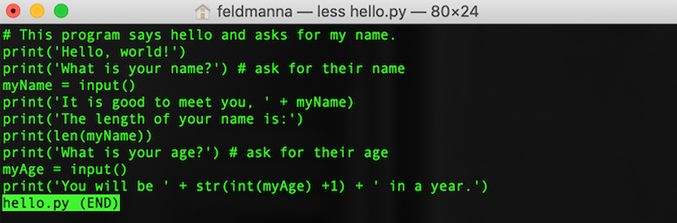

<!--

author:   Nicole Feldman
email:    feldmanna@chop.edu
version:  1.1.0
module_template_version: 2.0.0
language: en
narrator: UK English Female
title: Bash Scripting 101
comment:  This course will focus on accessing a command line program and running shell scripts on your home computer and learning how to navigate your file system as well as editing and searching files.

long_description: This course is designed to be both an introduction to bash for those who are total newbies as well as refresher for those some with experience running code who want a more solid command of the basics.

estimated_time: 30 minutes

@learning_objectives

After completion of this module, learners will be able to:

- Describe what bash scripting is and why they might want to learn it for data management and research
- Navigate their file system using the bash shell
- View and edit the contents of a file from the bash shell
- Search for character strings in files
@end

link:  https://chop-dbhi-arcus-education-website-assets.s3.amazonaws.com/css/styles.css

script: https://kit.fontawesome.com/83b2343bd4.js
-->

# Bash Scripting 101

<div class = "overview">

## Overview

@comment

**Is this module right for me?**

@long_description

**Estimated time to completion:** @estimated_time

**Pre-requisites**

Learners should be familiar with locating files and folders stored in a directory system.


**Learning Objectives**

@learning_objectives

</div>


## Lesson Preparation

You will get the most out of this lesson if you follow along with the examples and try out the commands. In order to do that you need to have a bash shell open on your computer. Please follow the instructions appropriate for the computer you are using.

### Mac Computers


On a Mac computer, bash is the default login shell in the **Terminal** command line program.

1. Type "terminal" in your Mac spotlight search to pull up this program.

2. The terminal may take a few seconds to start, once it is open you should see a blinking cursor where you can type.

<div class = "learnmore">
It should be noted that Macs with the Catalina Operating System or later are running zsh instead of bash. That said, zsh is [functionally a later and greater version of bash with some key differences noted](https://medium.com/@harrison.miller13_28580/bash-vs-z-shell-a-tale-of-two-command-line-shells-c65bb66e4658).
</div>

### Windows Computers


- On a Windows machine, the WSL (Windows Subsystem for Linux) has Ubuntu, which is just a widely used flavor of Bash, installed as its default shell scripting environment. This is automatically installed on any Windows computer running Windows 10 or later.
- To confirm this feature is enabled, check to see if developer mode is enabled in settings and WSL is turned on in Features.
- Search Bash in Cortana to launch WSL for the first time and click “Y” when asked to install Ubuntu for the first time. [Microsoft has their own internal documentation on WSL which features additional visual resources and FAQS](https://docs.microsoft.com/en-us/windows/wsl/).
- Create a username and password when prompted and now you are ready to do some shell scripting! These user credentials have no bearing on your Windows user name and you will be automatically logged in for future sessions.


## The bash shell

Your computer has an **O**perating **S**ystem (OS), most commonly either Windows, Mac, or Linux. The core for the OS itself is called the kernel; it's the heart of how everything works in your computer, but you can't actually interface with it directly as a user. Programs that are designed to work with your OS can communicate with the kernel (Word, RStudio, Chrome, etc.), but if you want to do something outside of one of those programs you can't connect to the kernel directly yourself. That's where a shell comes in.

The shell is like a layer outside the kernel that you as a user can communicate with. You can type commands in the shell, and it will execute them for you in the kernel. Back when computers were newer and there were few ready programs available, the shell was the primary way to get stuff done on a computer.

<div class = "learnmore">
To learn more, check out this post for [an excellent breakdown of the difference between the shell and the kernel](https://www.geeksforgeeks.org/difference-between-shell-and-kernel/).
</div>


### What is it?

A **C**ommand **L**ine **I**nterface or CLI allows a user to pass a series of text (commands) to a program in order to execute code. The execution of shell commands is known as shell scripting.

**Bash** (or **unix shell**) is a free command line language.  

A lot of organizational tasks that you might do with "point and click" programs, like opening files and folders, editing or moving their contents, renaming files and folders, can be done in a bash shell. If you computer uses a Linux operating system, the bash shell may be the default way to do these things, but even if you are using a different operating system like iOS (Mac) or Windows, it can be very useful to use bash scripting.

### Why would I use it?

If you have ever spent time painstakingly renaming files to prepare them for processing one at a time, then you know how difficult that task can be using point and click methods. Bash scripting can can make this kind of task easier, faster, and more accurate.

Shell scripting can be useful to researchers and others working with data:

- Commands run on one’s local machine or on a training data set can be scaled up to working with large volumes of data in a **h**igh **p**erformance **c**omputing (hpc) or cloud hosted environment.

- Shell scripts can call on multiple other programming languages, like R and python, to build pipelines that run across several software applications as well as enable a user to have greater facility with tools like Git and docker.

- Adoption of shell scripting also reinforces the importance of having well-structured and well-named files and file directory structures.

### Quiz: Why bash?

Which of the following are TRUE about bash/shell scripting? Select all that apply.

[[X]] Shell scripting is a way for a user to interact with the core (or kernel) of your operating system.
[[X]] Command line interfaces are pre-installed on most operating systems.
[[ ]] Bash is expensive.
[[X]] Shell scripts can work with other programming languages, such as R and Python, in pipelines.
***
<div class = "answer">
Bash, or shell, scripting is a way to interface with your computer's operating system, and the necessary applications are probably already on your computer! You can also create pipelines that utilize bash and other programming languages. It's also 100% free!
</div>
***


## Navigating in bash

If you are new to bash scripting, it can take some adjustment to navigate by typing text. Once you get the hang of a few basic commands, this can be an easier way to deal with files and folders than dropdown menus and dragging icons from place to place. Even the language we use is a little different. In bash scripting you will hear folders refered to as **directories**.

To enter a command into the shell, type it in where the blinking cursor appears and press `Enter` or `return` on your keyboard.

### Navigation Commands

Just like when you navigate any file system, it is important to know where you are, see what files and folders are in that location, and move to other locations.

**Where am I?**

The command `pwd`, which stands for **p**resent **w**orking **d**irectory, will return the path through your directory system to your current location.

**What is here?**

The bash shell doesn't show the icons of the files and directories in your present working directory. Instead you will need to ask for a list of the directory's contents with the command `ls`.

**How do I move around?**

The command `cd` lets you **c**hange **d**irectory. Unlike the previous two commands, `cd` requires you to provide additional information: the directory you want to move to. You can move to a location relative to your current location, or you can move anywhere directly if you know the path to get there.

- Move to a directory relative to your present working directory:

  * If the directory `directory_name` is in your present working directory (i.e. it is one of the listed items when you enter `ls`) you can navigate into it with the command `cd directory_name`

  * To move to the parent directory of your current location, use `cd ..`

- Move to a directory using its file path:

  * To return to your home directory use `cd ~`

  * If you know how to get to the directory you want from your home directory, you can go directly there with `cd ~/path/to/directory`


**Give it a try!** Use these commands to explore the directories on your computer. Try navigating around some files and folders that you are already familiar with to get comfortable with how they look through the bash shell.

### Creating and moving files

You can also create new directories and files. So that we don't change any of your pre-existing files, we will practice this in a new directory that you can play around with or delete later.

Make sure you are in your home directory with `pwd`. If not, `cd ~` will get you there.

**Making a new directory**

The command `mkdir` will create a new directory in your current location. Let's make a new directory called `learning_bash`:

```
cd ~
mkdir learning_bash
```

You will now see `learning_bash` when you ask for the list of files and directories with `ls`, and can use `cd` to navigate into it.

**Creating a new file**

The command `touch` creates a new file. You need to give your file a name.

From your `learning_bash` directory create a new file called `my_file`:

```
cd ~/learning_bash
touch my_file
```

You can also create multiple files at a time by listing their unique names one after another:

```
cd ~/learning_bash
touch file_1 file_2 file_3
```

Now if you use `ls` to see the contents of `learning_bash`, you should see four files: `file_1`, `file_2`, `file_3`, and `my_file`.

Since these are files and not directories, we can't use `cd` to open them, and we didn't put anything into these files yet anyway. We will learn how to interact with their contents in the next section.

**Moving files**

Inside of `learning_bash`, create a new directory called `numbered_files`:

```
cd ~/learning_bash
mkdir numbered_files
```

The `mv` command will move files from their current location to a new location. This command needs to know **what** you want to move and **where** you want to move it to.

To move `file_1` to `numbered_files` run the command:

```
mv file_1 numbered_files
```

Now you can use `cd` and `ls` to see that `file_1` is now in `numbered_files`.

You can also move multiple files at a time by entering them one after another, as long as the directory you want them to end up in is at the end.

```
mv file_2 file_3 numbered_files
```

<div class = "warning">
You might have noticed that none of the file or directory names we used had spaces in them. Bash scripting gets quite a bit more complicated when you have spaces in names, so it is considered best practice to avoid them.
</div>

### Quiz: Navigation

You want to make a new folder inside `learning_bash` called `data` and put two files in it, `data_1` and `data_2`.

```
cd ~/learning_bash
______A_______
______B_______
touch data_1 data_2
```
What code should go in lines A and B?

[[ ]] Line A should be `touch data`
[[ ]] Line B should be `touch data`
[[X]] Line A should be `mkdir data`
[[ ]] Line B should be `mkdir data`
[[ ]] Line A should be `cd data`
[[X]] Line B should be `cd data`
***
<div class = "answer">
You must first make the directory `data` and then move into that directory with `cd data`.

The command `touch data` will create a file named `data`, not a directory that can contain files.
</div>
***


## Editing Files

The bash shell can see and move files of all types, but it is most useful for interacting directly with plain text files.

A [**plain text**](https://en.wikipedia.org/wiki/Plain_text) file is a file that contains only text characters like the ones you can type directly using your keyboard. For example the words "plain text" at the beginning of this paragraph, which are both bolded and hyperlinked, are not being presented to you as plain text. However they are recorded as plain text in the Markdown (`.md`) file this lesson is written in. If you open the Markdown file, you will see only characters that can be typed by a keyboard:

```
[**plain text**](https://en.wikipedia.org/wiki/Plain_text)
```

If you have been using a particular program to write and edit your files like Word, RStudio, or Jupyter notebook, you will need to continue to use that program to edit those files. If you expect your project to grow substantially in size or number of files, having as much of your work as possible in plain text files may make scaling up easier.

Some common types of plain text files you might have seen before are:

| file ending | description |
|:---:| :---|
| `.txt` | text file |
| `.csv` | comma separated values |
| `.md` | markdown file |
| `.html` | html file |

<div class = "learnmore">
The file endings like `.txt`, `.csv`, or `.doc` (Word), `.xslx` (Excel) are the part of the file name that lets your computer know what type of program to use to open it. The ending doesn't actually impact the contents of the file, which is why we were able to create files like `my_file` in the previous section with no file ending at all.
</div>

### Writing to a file

- `cat`: very powerful three-part function that allows a reader to view, combine (concatenate), or create a new version of a file

  - `cat file 1 file 2` will display the contents of both files on separate lines.
  - `cat > file 4` will create a new file named file 4
  - `cat file 1 >> file 2` will append the contents of file 1 at the end of file 2.
  - `cat file 2` will now confirm if the content in file 1 was successfully appended to the end of file 2.


### Viewing the contents of a file

- `less`: view contents of a file without opening a separate editor

  

### File editors

atom, nano, long list from git modules

### Quiz: Editing files


## Searching files

### `grep`

`grep`: powerful search function to locate a string or pattern within a file or in a directory. Grep stands for global regular expression print.

`grep 'panda' file 1 file 2 file 3` will search for the word "panda" in the three files we just created.

### Character sequence wildcard `*`

`*` character sequence wildcard. Very useful in running a command on all files with a given file extension as demonstrated in the mv example above.

### Quiz: Searching files


## Additional Resources

- [Brief Illustration of the Difference between Shell and Kernel](https://www.geeksforgeeks.org/difference-between-shell-and-kernel/)
- [Exhaustive Wiki of Linux Filesystem Hierarchy](https://tldp.org/LDP/Linux-Filesystem-Hierarchy/html/index.html)
- [Reinforce Your New Knowledge through this Learning the Shell Page](https://linuxcommand.org/lc3_learning_the_shell.php)
- [Unix Command Line I Arcus Education Webinar](https://digitalrepository.chop.edu/commandline_computingtools/3/)
- [Unix Command Line II Arcus Education Webinar](https://digitalrepository.chop.edu/commandline_computingtools/2/)
- [Intermediate Bash Scripting Arcus Education Webinar](https://digitalrepository.chop.edu/commandline_computingtools/1/)

## Feedback

In the beginning, we stated some goals.

**Learning Objectives:**

@learning_objectives

We ask you to fill out a brief (5 minutes or less) survey to let us know:

* If we achieved the learning objectives
* If the module difficulty was appropriate
* If we gave you the experience you expected

We gather this information in order to iteratively improve our work. Thank you in advance for [filling out our brief survey](https://redcap.chop.edu/surveys/?s=KHTXCXJJ93&module_name=%22Bash+Scripting+101%22)!
