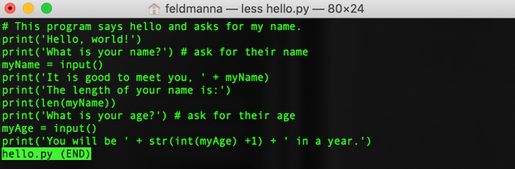

<!--

author:   Nicole Feldman and Elizabeth Drellich
email:    feldmanna@chop.edu and drelliche@chop.edu
version:  1.0.0
module_template_version: 2.0.0
language: en
narrator: UK English Female
title:  Bash: Searching and Organizing Files
comment:  This module will teach you how to use the bash shell to search and organize your files.
long_description: This module is for people who have a bit of experience with bash scripting and want to learn to use it's power to organize their file and folders.
estimated_time: 30 minutes

@learning_objectives

After completion of this module, learners will be able to:

- Search existing files for particular character strings.
- Search folders for files with certain titles.
- Move files to new locations in a directory system.
- Rename files.
@end

link:  https://chop-dbhi-arcus-education-website-assets.s3.amazonaws.com/css/styles.css

script: https://kit.fontawesome.com/83b2343bd4.js
-->

# Bash: Searching and Organizing Files

<div class = "overview">

## Overview

@comment

**Is this module right for me?**

@long_description

**Estimated time to completion:** @estimated_time

**Pre-requisites**

Learners should be familiar with using a bash shell to navigate a directory system. Learners will get the most out of this lesson if they can also create directories and files, write text to files, and read files from their bash shell command line interface.


**Learning Objectives**

@learning_objectives

</div>


## Lesson Preparation

You will get the most out of this lesson if you follow along with the examples and try out the commands. In order to do that you need to have a bash shell open on your computer. Please follow the instructions appropriate for the computer you are using.

Open a bash shell. If you are using a computer with running iOS (i.e. a Mac) you can use the **Terminal** program. If you are on a computer using Windows, open either **WLS** (Windows Linux Subsytem) or **Git Bash**. If you don't have these programs there are instructions for how to download and set them up in the [Bash 101](link/here) module.


We want to be able to search, move, and rename files during this module, but don't want to do that with your important files. Therefore we will set up a little directory with a few files to experiment with. You can safely delete the whole thing afterwards if you want.

**Create a mini repo with a bunch of files in it and nested folder system?**

You can download this from GitHub or if you have Git installed on your computer, run `git clone` in your command line interface.


## Searching files

### `grep`

`grep`: powerful search function to locate a string or pattern within a file or in a directory. Grep stands for global regular expression print.

`grep 'panda' file 1 file 2 file 3` will search for the word "panda" in the three files we just created.

### Character sequence wildcard `*`

`*` character sequence wildcard. Very useful in running a command on all files with a given file extension as demonstrated in the mv example above.

### Quiz: Searching files


## Organizing files

Just because you created a file in one location, doesn't mean it has to stay there forever.

### Moving files

Inside of `learning_bash`, create a new directory called `numbered_files`:

```
cd ~/learning_bash
mkdir numbered_files
```

The `mv` command will move files from their current location to a new location. This command needs to know **what** you want to move and **where** you want to move it to.

To move `file_1` to `numbered_files` run the command:

```
mv file_1 numbered_files
```

Now you can use `cd` and `ls` to see that `file_1` is now in `numbered_files`.

You can also move multiple files at a time by entering them one after another, as long as the directory you want them to end up in is at the end.

```
mv file_2 file_3 numbered_files
```

### Renaming Files

### Copying Files

### Quiz: Organizing Files


- `cat`: very powerful three-part function that allows a reader to view, combine (concatenate), or create a new version of a file

  - `cat file 1 file 2` will display the contents of both files on separate lines.
  - `cat > file 4` will create a new file named file 4
  - `cat file 1 >> file 2` will append the contents of file 1 at the end of file 2.
  - `cat file 2` will now confirm if the content in file 1 was successfully appended to the end of file 2.

  


### Viewing the contents of a file


- `less`: view contents of a file without opening a separate editor

  


### Quiz: Bash commands

Select the three functions of the `cat` command?

[[X]] View
[[ ]] Categorize
[[X]] Concatenate
[[X]] Create New Version
***
<div class = "answer">

The `sort` command is used to categorize files in bash.

</div>
***

## Bash syntax

- `~` shortcut for your home directory
- `.` shortcut for your current directory
- `..` shortcut for your previous directory
  The above three shortcuts are highly useful for executing scripts in the proper location once you are collaborating in an active project with multiple files and folders.

  - `echo`: prints out text in the terminal window- especially useful for declaring environment variables which reveal both permissions and what strings can be passed.

    


### Writing output to a file with `>`
- `>` takes the output of the command you executed in the terminal and places it in a new file

### Linking commands with `|`

- `|` takes the output of one command and passes it to the next command in the sequence. Allows for integrating of commands

### Defining variables with `$`
- `$` used to define a variable expression as used in the echo example above.


### Quiz: Bash syntax

What character passes the output of one command to the next command in a sequence?

[(X)] \|
[( )] &
[( )] +
[( )] -
***
<div class = "answer">

This character is called a **pipe**, and it's name is a great way to visualize what it does: the output from the command to the left flows into the commands to the right through the pipe to create a pipeline :)

</div>
***


## Additional Resources


- [Exhaustive Wiki of Linux Filesystem Hierarchy](https://tldp.org/LDP/Linux-Filesystem-Hierarchy/html/index.html)
- [Reinforce Your New Knowledge through this Learning the Shell Page](https://linuxcommand.org/lc3_learning_the_shell.php)


## Feedback

In the beginning, we stated some goals.

**Learning Objectives:**

@learning_objectives

We ask you to fill out a brief (5 minutes or less) survey to let us know:

* If we achieved the learning objectives
* If the module difficulty was appropriate
* If we gave you the experience you expected

We gather this information in order to iteratively improve our work. Thank you in advance for [filling out our brief survey](https://redcap.chop.edu/surveys/?s=KHTXCXJJ93&module_name=%22Bash+Scripting+101%22)!
