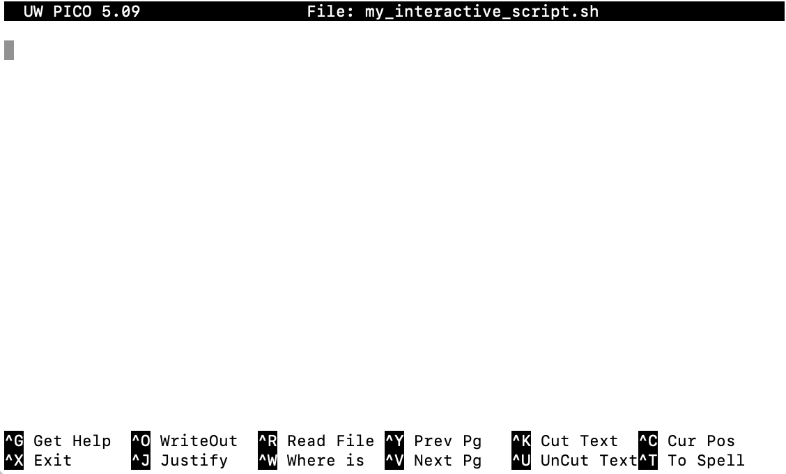

<!--

author:   Elizabeth Drellich
email:    drelliche@chop.edu
version: 1.2.2
current_version_description: Updated metadata and macros
module_type: standard
docs_version: 2.0.0
language: en
narrator: UK English Female
mode: Textbook
title:  Bash: Reusable Scripts
comment:  This module will teach you how to create and use simple Bash scripts to make repetitive tasks as simple as possible. 
long_description: If you have some experience with Bash and want to learn how to save and reuse Bash processes, this lesson will teach you how to write your own Bash scripts and understand and use simple scripts written by others.
estimated_time_in_minutes: 60

@pre_reqs
Learners should be familiar with using a Bash shell to navigate a directory system. Learners will get the most out of this lesson if they can also create directories and files, write text to files, and read files from their Bash shell command line interface.

Bash commands that will be used without explanation include:

- `ls`
- `cat`
- `>` and `>>`
- `echo`
- `grep`
- `wc`
@end

@learning_objectives

After completion of this module, learners will be able to:

- Identify the structure of a Bash script
- Run existing Bash scripts
- Write simple Bash scripts
@end

good_first_module: false
collection: learn_to_code
coding_required: true
coding_level: intermediate
coding_language: bash
sequence_name: bash_basics
previous_sequential_module: bash_conditionals_loops

@sets_you_up_for

@end

@depends_on_knowledge_available_in

- bash_command_line_102
- bash_103_combining_commands
- bash_conditionals_loops

@end

@version_history 

Previous versions: 

- [1.1.0](https://liascript.github.io/course/?https://raw.githubusercontent.com/arcus/education_modules/3cdfc807be26db43d837de9e325b66c9213a3d5c/bash_scripts/bash_scripts.md): Improved instructions for downloading learning_bash repository.
- [1.0.0](https://liascript.github.io/course/?https://raw.githubusercontent.com/arcus/education_modules/): Initial version.
@end


import: https://raw.githubusercontent.com/arcus/education_modules/main/_module_templates/macros.md
import: https://raw.githubusercontent.com/arcus/education_modules/main/_module_templates/macros_bash.md

-->

# Bash: Reusable Scripts

@overview

## Lesson Preparation

@lesson_prep_bash_basics

## What is a script?

A **script** is a small program that you can run on your computer.

A **Bash script** is a small program that automates Bash commands and lets you run the same sequence of commands as many times as you want. It might be as simple as a program that takes a file you have downloaded and standardizes the file name, or as complicated as creating new files based on information stored in several other files in other locations or doing complex tasks based on a user's typed responses to questions. Once you get the hang of writing scripts, you can automate almost any work that you expect to need to use multiple times!  

<div class = "cool-fact">
<b style="color: rgb(var(--color-highlight));">Did you know?</b><br>

A **scripting language** is a type of programming language that, like Bash or Python, does not need to be compiled in order for your code to run.

Even though "scripting" is not unique to the Bash language, you might sometimes hear the terms "script" and "Bash scripting" and "shell script" used interchangeably.

</div>

### Why use a script?

Anything that you can type into the command line can be incorporated into a script. But what makes a script better than entering code directly into the command line?

Reproducibility
---
If you are processing research data, it is important for you, your collaborators, and any potential readers or users of your work to be able to reproduce your results. While you might be able to describe what steps you took, it is much easier and more robust to say "we processed the data using `initial_processing.sh`" and providing that file so that others can exactly replicate your steps.

Reusability
---
If you have data you will have to process each time it is updated, a script can save you from having to relearn how to code the steps each time.

Organization and troubleshooting
---

Even if you don't care about reproducibility or reusability, putting a long command into a script can save you lots of time because you can edit the script if you make a typo instead of re-entering the entire command. This is particularly true when using loops or piping multiple commands in a sequence.

Even the simplest of loops are easier handle as scripts than typed into the command line. Compare entering something like `bash scripts/identify_dat_files.sh` to entering this correctly:

```
for file in *.dat
do
  echo $file is a data file
done
```

### Recognizing a Bash script

You don't have to be able to write a script in order to use one, but you do need to know how to recognize one. Any file could in theory be a Bash script, but there are a few conventions that good scripts frequently use to help you, and your computer, know that the file is a script.

File name
---

The standard file ending for a script is `.sh`. Usually a script will be informatively named, for example `fibonacci.sh` might be a script that computes the numbers in the Fibonacci sequence. Even though scripts don't have to use the file ending `.sh`, this is the most common way to name them so that you and your collaborators can locate all of the scripts quickly and easily (i.e. `find *.sh`).

First line
---

Sometimes scripts contain a special first line that looks something like this:

```
#! /usr/bin/bash
```

This first line does two things:

1. It makes the script **executable**.  
2. It tells your computer that it should run the rest of the file as Bash code. 

An executable script can be run as its own command. We won't be creating executable scripts in this module, but it is good to know that they exist. Such scripts let you combine the power of multiple programming languages: you might see a script that starts with the first line `#! /usr/bin/python`. This would tell both you and your computer that the following code is not in Bash, but in the programming language Python.

The two symbol sequence `#!` is called a [**shebang**](https://en.wikipedia.org/wiki/hash-bang) and without it your computer wouldn't know that it is expected to run what follows as code.

<div class = "cool-fact">
<b style="color: rgb(var(--color-highlight));">Did you know?</b><br>

The symbol `#` has [many names](https://en.wikipedia.org/wiki/Number_sign#). You might be most familiar with it as a "hashtag," "number sign," or the "pound sign." In the context of coding it is usually called either a "hash" or, borrowing from musical notation, a "sharp."

In the context of coding, the symbol `!` is called a "bang." The word shebang is a shortening of either ha**sh**-bang or **sh**arp-bang.

</div>

The example scripts in this module will NOT start with `#! /usr/bin/bash`
---

There are several reasons, but the two most important are

1. Executing scripts frequently requires you to change the permissions on the script's file and possibly updating it to the location of the Bash language on your computer, both of which are beyond the scope of this module.
2. We don't need to! Because we are working inside a Bash shell and only using the Bash language, we can run all of our scripts using the command `bash`.


### Quiz: Scripts

Which of the following statements about scripts are TRUE?

[[ ]] A script isn't very useful because you could just as easily run code by typing it in line by line.
[[X]] The standard file ending for a script file is `.sh`.
[[ ]] Every Bash command is a script.
[[X]] If you are going to want to do a particular sequence of commands many times, a script can help you by automating that sequence.
***
<div class = "answer">

**A script isn't very useful because you could just as easily run code by typing it in line by line.** FALSE: You can speed up the process a lot, and avoid typos, by using a script to automate procedures you want to do multiple times!

**The standard file ending for a script file is `.sh`.** TRUE: Although the file ending doesn't impact what the script does, ending the file name with `.sh` is standard practice.

**Every Bash command is a script.** FALSE: Even though Bash is a "scripting language," the word "script" refers to a small program, not an individual Bash command.

**If you are going to want to do a particular sequence of commands many times, a script can help you by automating that sequence.** TRUE

</div>
***

## Calling an existing script


The `learning_bash` folder contains a few different types of files and folders for us to experiment with. The ones we will be using in this module are:

* a `.csv` file called `Animals.csv` containing a list of animals and whether they are birds, mammals, fish, reptiles, or insects.
* `.dat` files like `blue_whale.dat` containing two lines with data about an animal's length and weight.
* a folder called `scripts` containing three `.sh` files.

In this section we will learn how to use the pre-written scripts in the `scripts` folder inside your `learning_bash-main` directory.

Navigate to the `scripts` folder and use `ls` to take a look at the example scripts there.

```
count_mammals.sh
count_type.sh
interactive_count_type.sh
```

The `.sh` file extension tells us these are scripts, but they are also just plain text files so we can look at the contents with `cat`. Try `cat count_mammals.sh` and see what it contains.

The first lines starting with `#`'s are a description of what the code does. The `#` symbol (not followed by a `!`) tells the computer that what follows is a **comment** for human readers of this file, not code that the computer should try to read. While every script _should_ include a commented out section explaining its function, not every script does.

<div class = "warning">
<b style="color: rgb(var(--color-highlight));">Warning!</b><br>

Using a script written by a trusted colleague can help you streamline your work without replicating their effort! But running a script you downloaded off of the internet isn't a good idea unless you can look at the code and verify that it does what you think it should, and nothing else.

</div>

### Running a script with `bash`

The command `bash` takes a file as its argument and executes all of the commands in that file. Every line in the file that is not commented out with a `#` will be automatically entered into the command line, in order.

The `count_mammals.sh` script contains two lines of code:

```
count=$(grep mammal Animals.csv | wc -l)

echo There are $count mammals on the list.
```

Entering these two lines into the command line by hand will give you the exact same output as running the script.

<div class = "care">
<b style="color: rgb(var(--color-highlight));">A little encouragement...</b><br>


Don't worry if you haven't seen code like the `count=$(commands here)` line before, we will be going into more detail about it later in this module.

</div>

Where are you?
---
The first line of code above assumes that there is a file called `Animals.csv` in your present working directory. If you try to run that command from somewhere else, like inside the `scripts` directory, you will get an error message.

Give it a try:

```
count=$(grep mammal Animals.csv | wc -l)
```

If you are in `scripts` you will get the message:

```
No such file or directory
```

But if you are in `learning_bash-main` you won't get any output at all. This is because the code is defining a variable, `count`. Try running the second line and see what happens:

```
echo There are $count mammals on the list.
```

Where is the script?
---
The commands inside of the `count_mammals.sh` script need to be run from the `learning_bash-main` directory, but that is not where the script itself is. You can use the relative path `scripts/count_mammals.sh` to refer to the file from that main directory.

Try it yourself
---
Use `pwd` to check that you are currently in the `learning_bash-main` directory, and if not, navigate there. Now you can call the script with the `bash` command:

```
bash scripts/count_mammals.sh
```

### Scripts that take arguments

The `bash` command takes only one argument, the name of a file, but that file may itself take one or more arguments. These arguments follow the name of the file.

The `count_type.sh` script takes one argument. Give it a try:

```
bash scripts/count_type.sh mammal
```

Try running the command again but replacing the argument `mammal` with `fish`, `red`, `bear`, or `alien`. What happens?

### Interactive scripts

The third script also takes an argument, but instead of getting that argument from the entry into the command line, this script prompts you (the user) to enter the argument it needs.

Try running it:

```
bash scripts/interactive_count_type.sh
```

You will get a message asking you what string you want to search for. Type a string (e.g. `mammal` or `fish` or `red`) and press the `enter` or `return` key.

Each time you run this interactive script, you can enter a different string to search for in the `Animals.csv` file.

### Quiz: Calling scripts

Suppose there were another file called `my_code.sh` in the folder `scripts`. A trusted colleague wrote it, and luckily they did a better job including comments than naming their file. The first two lines of the code are:

```
# Takes one argument and returns a list of the animals listed in Animals.csv that contain that string
# Run from the directory containing Animals.csv
```

You navigate to the `learning_bash-main` directory. You want a list of the animals in that have the word "bear" in their name. What should you enter into the command line?

[[bash scripts/my_code.sh bear]]
<script>
  let input = "@input".trim();
  input == "bash scripts/my_code.sh bear" || input == "bash scripts/my_code.sh \"bear\"" || input == "bash scripts/my_code.sh \'bear\'";
</script>
***
<div class = "answer">

You can run the script with the command `bash scripts/my_code.sh bear`.

- The `bash` command says you are going to run all of the lines of code inside the file.
- The relative path to the script is `scripts/my_code.sh`.
- The script takes one argument, the string you are searching for. In this case the string you are searching for is `bear`.

You can also put the string `bear` in single or double quotes and it will still be interpreted as a single string.

</div>
***

## Writing a script

In this section you will be writing some scripts of your own. For consistency, put your new scripts in the `scripts` folder within the `learning_bash-main` directory.

Let's start by making a file

```
echo "echo This is my first script" > first_script.sh
```

You should now have a file called `first_script.sh` which contains the single line

```
echo This is my first script
```

What do you think will happen if you run `bash first_script.sh`? Try it and find out if you were right.

### Incorporating arguments

If your script has an argument, you need to be able to refer to that argument in the script even though you don't know what the user might input. Bash scripts can take any number of arguments, and they are referred to by the order in which they are entered:

| Variable | References |
| :-: | :- |
| `$1` | First argument |
| `$2` | Second argument |
| `$3` | Third argument |
| $\vdots$ | $\vdots$ |
| `$29` | 29th argument |
| $\vdots$ | $\vdots$ |

Let's update `first_script.sh` to an argument:

```
echo "echo My script can take an argument, like \$1" >> first_script.sh
```

<div class = "help">
<b style="color: rgb(var(--color-highlight));">Troubleshooting help</b><br>

When using the `echo` command to write a line into the file `first_script,sh`, it is important to put a backslash `\ ` in front of the dollar sign `$`. The backslash functions as an **escape character**, telling Bash that you mean the **symbol** `$`.

Without that backslash, `$1` will be interpreted as a **variable**, which you probably haven't defined yet, rather than the string `$1` which you want to appear verbatim in your file.

</div>

Use `cat` to check that `first_script.sh` now contains two lines:

```
echo This is my first script
echo My script can take an argument, like $1
```

Notice that the backslash doesn't appear in the file's second line, but the dollar sign does!

<div class = "options">
<b style="color: rgb(var(--color-highlight));">Another option</b><br>

Using a text editor to write directly to your file `first_script.sh` can sometimes save you the worry of using escape characters, but if you want to write a script that writes a file with contents like `$1`, you will still need to use the backslash.

</div>

Now that `first_script.sh` takes an argument, try running it and see what happens:

```
bash first_script.sh my_argument
```

The order in which you enter arguments into the command line matters. Let's make a new script that will take 3 arguments:

```
echo "echo \$3 \$2 \$1" > reverse_three.sh
```

The `reverse_three.sh` script takes three arguments, let's give it a try:

```
bash reverse_three.sh alpha beta gamma
```

<div class = "important">
<b style="color: rgb(var(--color-highlight));">Important note</b><br>

If a script takes more arguments than you give it, it treats the arguments you didn't give it as empty strings. Try giving `reverse_three.sh` only two arguments and see what happens.

If you give a script arguments it doesn't use, it just ignores the extra arguments. Try giving `reverse_three.sh` four arguments and see what happens.

</div>

An argument could even have spaces in it, as long as you surround the argument with quotes. Consider the following commands, how do you think their output will differ? Run them and see if you were right.

```
bash first_script.sh "I love Bash"
bash first_script.sh I love Bash
bash reverse_three.sh "I love Bash"
bash reverse_three.sh I love Bash
```


### Defining new variables using subshells

Let's take a closer look at the scripts we saw in the previous section of the module. The first line of `count_mammals.sh` reads

```
count=$(grep mammal Animals.csv | wc -l)
```

Inside the parentheses we see the command `grep mammal Animals.csv | wc -l` which

1. finds all lines in the file `Animals.csv` that contain the string `mammal` and then
2. pipes those lines into the word count command `wc -l` to return how many such lines were found.

If we were to write a script containing just this command, running it would return the number of animals in `Animals.csv` that are mammals, (there are 14). But the script doesn't just return `14`, it defines the variable `count` to be that output. In order to do this, the script uses a **subshell**.

<div class = "important">
<b style="color: rgb(var(--color-highlight));">Important note</b><br>

A **subshell** in Bash works much the same way as parentheses in a mathematical expression. Commands inside the subshell are executed first.

</div>

Surrounding commands with `$()` puts them into a subshell. In the first line of code in `count_mammals.sh` is telling Bash to define `count` to equal whatever the output of the subshell is, in this case 14.

Why use subshells?
---
Using the subshell allows the script use that output in new ways. Without the subshell the only thing Bash could do with the output of `grep mammal Animals.csv | wc -l` is print it out on its own line. With the subshell, Bash can include that output in other commands. In this script, the variable `count` is included in the `echo` command on the second line.

Why use variables?
---
Consider another script that contains only one line:

```
echo There are $(grep mammal Animals.csv | wc -l) mammals on the list.
```

This script does the same thing as the original 2 line `count_mammals.sh`, it has just replaced the variable `count` with what that variable was defined to be. This is unobjectionable in such a short script, but defining variables like `count` is a good habit to get into because using variables instead of including the entire subshell each time you need it

- lets you change all instances of that variable in a single place,
- makes your script much more human-readable, and  
- prevents, or at least helps you catch, typos.


Once you define a variable with `new_variable=$(commands here)` you can call it elsewhere in the script using `$new_variable`.

<div class = "help">
<b style="color: rgb(var(--color-highlight));">Troubleshooting help</b><br>

When defining a new variable, there should not be any spaces on either side of the equals sign `=`.

</div>

<div class = "options">
<b style="color: rgb(var(--color-highlight));">Another option</b><br>

If you look at older Bash scripts, you may see backticks `\`commands here\`` used instead of the dollar sign and parentheses to create subshells.

While backticks will work to create a subshell, the `$()` construction has some advantages, namely that you can nest subshells like this:

```
$(outer subshell depends on $(inner subshell))
```

</div>

### Interactive inputs

The last way to create new variables for a script is to have the script's user (maybe you, maybe someone else) enter them interactively.


You saw this in action when you called the script `interactive_count_type.sh` earlier in this module. Now we are going to look at how to make scripts interactive.

Interactive scripts are most powerful when they include useful prompts. Let's take a look at one:

```
echo Enter your new variable here:
read new_var
echo You entered "$new_var"
```

1. The first line is what the script will initially print. The user will see `Enter your new variable here:` and then can type anything they want.

2. The second line is where the interactivity comes into play. The `read` command tells the script to pause and wait for the user to input something. Once the user presses `enter` or `return`, whatever they typed will be saved as `new_var` and the script will continue to the next line.

3. The third line then takes the new variable and tells you what you entered. The quotes around `$new_var` are there because there may be spaces in the user input. These spaces would not make a difference in this script, but might if this line used a command expecting multiple arguments.

This isn't a particularly useful script as currently written, but the structure is a good setup for creating your own interactive scripts, including scripts that take more than one user input.

<div class = "important">
<b style="color: rgb(var(--color-highlight));">Important note</b><br>

An interactive script will execute each line in the order it appears. You can prompt the user for input multiple times and at each line starting with `read` the script will pause and wait for the user to enter their response.

</div>

### Putting it all together

You are now going to create an interactive script that uses several of the techniques we have just learned. Since the script will contain several lines, it will be helpful to use a text editor. We suggest `nano` which you can open from the command line with

```
nano my_interactive_script.sh
```

This will open the nano text editor inside of the shell where you will be able to edit the (currently empty) plain text file `my_interactive_script.sh`



<div class = "help">
<b style="color: rgb(var(--color-highlight));">Troubleshooting help</b><br>

The nano text editor is a very basic way to edit text files, and it doesn't have most of the user-friendly features that many other text editors employ. Within the nano program, you will need to navigate with the arrows on your keyboard, although you may be able to copy and paste text using your mouse.

The `^` symbol next to each of the option at the bottom of the nano screen refers to the `control` button (which may or may not have a `^` symbol on it on your keyboard). For example, to exit the nano program, hit `control` and `X`.

</div>

Now it is time to put some commands into this script. Here is an example you can copy and experiment with by changing some of the lines to other commands you know.

```
echo What is your name?
read name
echo What is your favorite number $name?
read number
echo Why do you prefer $number to $(($number + 1)?
read answer
echo That is an interesting answer $name. My favorite number is $(($number * 2 + 1)).
```

<div class = "important">
<b style="color: rgb(var(--color-highlight));">Important note</b><br>

Bash can do mathematical operations, including `+`, `-`, `*`, `/`, but they must be inside of a special [Arithmetic Expansion](https://www.gnu.org/software/bash/manual/html_node/Arithmetic-Expansion.html) subshell, surrounded by double parentheses:

```
$((mathematical expression here))
```

</div>

<div class = "help">
<b style="color: rgb(var(--color-highlight));">Troubleshooting help</b><br>

Each line of code must be on a single line inside the plain text file. For example if you insert a line break into the last line, the `echo` command will only know to print out the text on the same line as it, and Bash will try to treat the next line as a new command. This will result in an error message like "command not found"

</div>

### Quiz: Writing scripts

The contents of the script `interactive_count_type.sh` are shown below, with some of the contents replaced by underscores:

```
# This script is an interactive script that returns a count of how many animals
# in Animals.csv contain that input string.

# This script should be run from the directory containing Animals.csv.

__1__ What string do you want to search for?

__2__ __3__

count=$(grep $string Animals.csv | wc -l)

echo There are $count lines in Animals.csv that contain the string \"$string\".
```

Without looking at the contents of the original file `interactive_count_type.sh`, what should go in the three blank spots in the code?

1.
[[echo]]
***

<div class = "answer">

The  `echo` command tells Bash to print out the question "What string do you want to search for?"

</div>

***


2.
[[read]]
***

<div class = "answer">

The  `read` command tells Bash to expect user input and to save that input as a variable.

</div>

***

3.
[[string]]
***

<div class = "answer">

The variable `$string` is called in the last two lines of the script, so the user's input must be assigned to the variable `string`.

</div>

***


## Additional Resources

- [Exhaustive Wiki of Linux Filesystem Hierarchy](https://tldp.org/LDP/Linux-Filesystem-Hierarchy/html/index.html)
- [Reinforce Your New Knowledge through this Learning the Shell Page](https://linuxcommand.org/lc3_learning_the_shell.php)

These webinars are a great walk through the command line:

- [Unix Command Line I Arcus Education Webinar](https://www.youtube.com/watch?v=2BKwvSyeZis)
- [Unix Command Line II Arcus Education Webinar](https://www.youtube.com/watch?v=msgeSVHl8ZA)
- [Intermediate Bash Scripting Arcus Education Webinar](https://www.youtube.com/watch?v=Ops9Bo6yVn0)

## Feedback

@feedback
