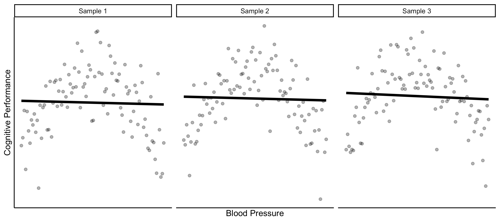
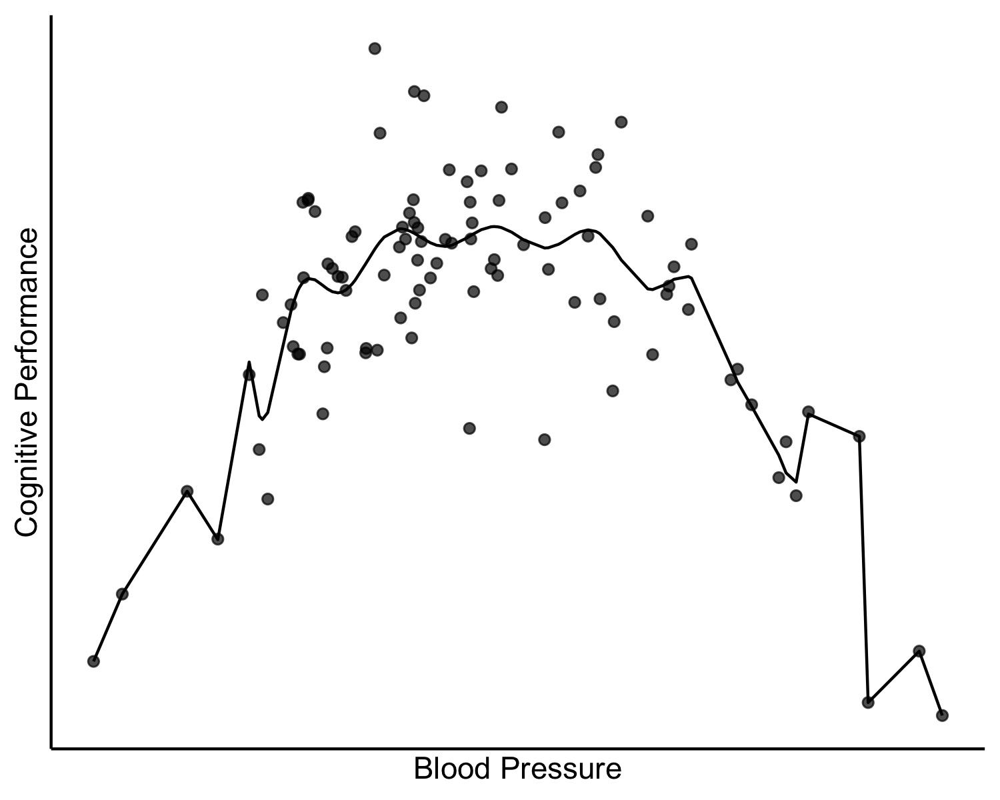
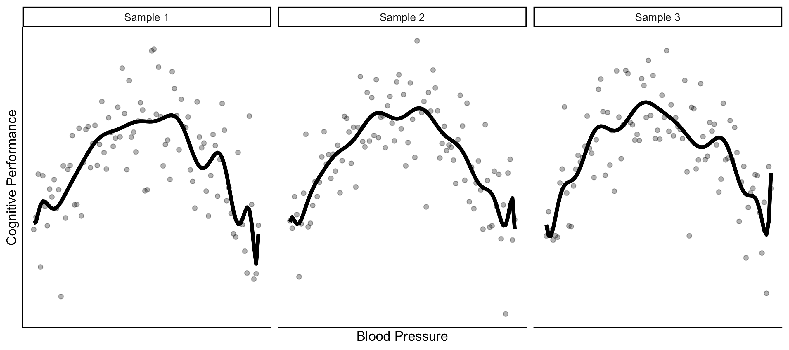
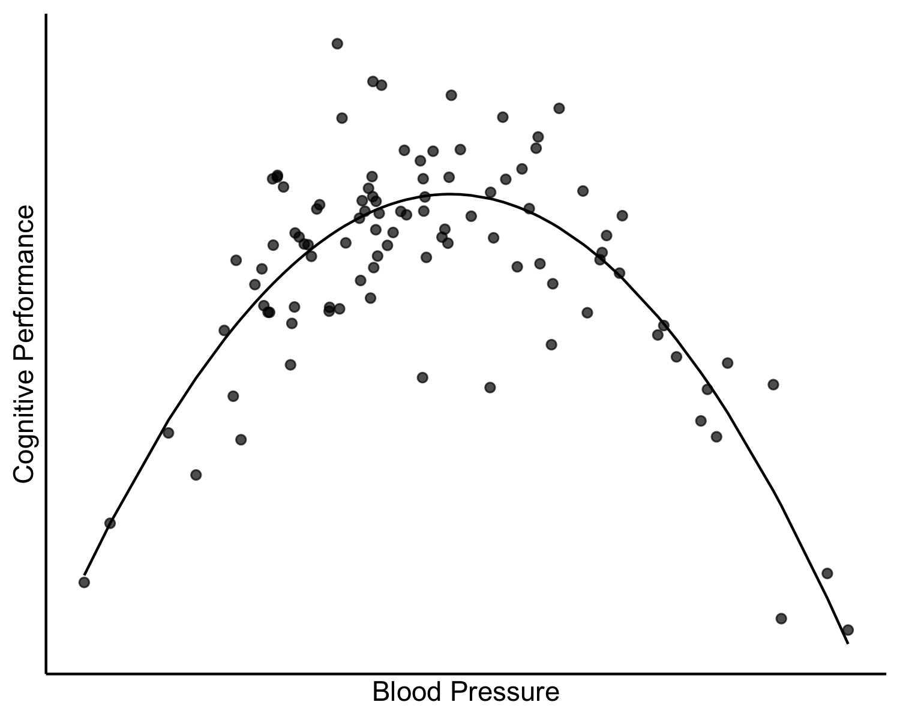

<!--
module_id: bias_variance_tradeoff
author:   Rose Hartman
email:    hartmanr1@chop.edu
version:  1.0.4
current_version_description: Initial version.
module_type: standard
docs_version: 1.1.0
language: en
narrator: UK English Female
mode: Textbook

title: Understanding the Bias-Variance Tradeoff

comment:  The bias-variance tradeoff is a central issue in nearly all machine learning analyses. This module explains what the tradeoff is, why it matters for machine learning, and what you can do to manage it in your own analyses. 

long_description: Whether you're new to machine learning or just looking to deepen your knowledge, this module will provide the background to help you understand machine learning models better. This is a conceptual module only; there will be no hands-on exercises, so no coding experience is required. 

estimated_time_in_minutes: 20

@pre_reqs

This module assumes learners have been exposed to introductory statistics, like the distinction between [continuous and discrete variables](https://www.khanacademy.org/math/statistics-probability/random-variables-stats-library/random-variables-discrete/v/discrete-and-continuous-random-variables), [linear and quadratic relationships](https://www.khanacademy.org/math/statistics-probability/advanced-regression-inference-transforming#nonlinear-regression), and [ordinary least squares regression](https://www.youtube.com/watch?v=nk2CQITm_eo).
It's fine if you don't know how to conduct a regression analysis, but you should be familiar with the concept.

@end

@learning_objectives  


- define bias and variance as they apply to machine learning
- explain the bias-variance tradeoff
- recognize techniques designed to manage the bias-variance tradeoff

@end

good_first_module: false
collection: machine_learning, statistics
coding_required: false

@sets_you_up_for

@end

@depends_on_knowledge_available_in

- demystifying_machine_learning

@end

@version_history 

No previous versions.

@end

import: https://raw.githubusercontent.com/arcus/education_modules/main/_module_templates/macros.md
-->

# Understanding the Bias-Variance Tradeoff

@overview

## The bias-variance tradeoff

Machine learning covers a wide range of different analyses and techniques, but there is one idea that is central to pretty much any machine learning analysis: the bias-variance tradeoff.

But first, a quick note about how data are used in machine learning:

Because machine learning models "learn", the process of fitting a model to data is called **training**.
The goal of training is to get a final version of your model; often this means estimating the model's parameters (although depending on the technique, it could also be things like feature selection or identifying coordinates for group centroids).

<div class = "important">
<b style="color: rgb(var(--color-highlight));">Important note</b><br>

What are **parameters**?  
Parameters are like the dials and switches that govern how an algorithm works and how it mathematically works with our data to make predictions.  
For example, one kind of parameter would be the coefficient used in a linear model.  
Is 3, 2.2, or -1.6 the best coefficient for creating a good linear model?  
Machine learning can rapidly change parameters to optimize things like weights and coefficients, which is what makes it so attractive.  

What's a **feature**?  
A feature is something we're bringing in from our data that will be mathematically included in our model making.  
Sometimes we might experiment to see whether adding information we have but aren't sure is useful is actually helpful.  
For example, birth order may not seem to be very clinically relevant, but we might try adding that data in as a new feature and discover that for our area of interest, that feature is useful and improves our model outcome.  
Other times, we might realize that simplifying our model and leaving out some features makes our model more generalizable (for example, not every patient record has birth order, so it might be better to leave it out) or easier to calculate.

</div>

For a regression model, which we'll discuss more in the example, training means estimating the intercept and the coefficeint(s) for the predictor(s) -- for a linear regression with just one predictor, training is estimating the intercept and the slope.

For a polynomial linear regression, training is estimating the intercept and each of the coefficients for the polynomial terms.

<div class = "learn-more">
<b style="color: rgb(var(--color-highlight));">Learning connection</b><br>

Looking for a review of what linear regression models are and how they work?
Check out [this tutorial on linear regression](https://education.arcus.chop.edu/ordinary_linear_regression/).

</div>


### What is variance, and what is bias?

Briefly, **variance** is how much your model fit changes depending on which data you happen to train them on.
You want to get variance as low as possible; if you were to reach a variance of 0 (this doesn't actually happen), that would mean your model was totally robust to changes in the randomly sampled data it was trained on.

**Bias** refers to how far off your predictions are from the underlying truth.
You also want bias to be as low as possible; if you have a bias of 0 (again, this doesn't actually happen), that means your model perfectly captures the real-life phenomenon that creates the data.

### An example

Imagine you had collected measurements of blood pressure and cognitive performance from a sample of patients (these are made up data).
Let's pretend that the true relationship between these variables in real life is perfectly quadratic (U-shaped), where medium blood pressure is associated with the best cognitive performance and blood pressure that is either too low or too high is associated with lower cognitive performance.

One way to model the relationship between these variables would be a plain linear relationship, as depicted in the scatterplot below.
There are only two parameters to estimate for a linear model like this: intercept and slope.

<!-- style = "max-width: 45%; display: block; margin-left: auto; margin-right: auto;"-->


If you ran this study over and over, collecting data from new participants each time and always fitting a linear model, the exact parameter estimates for the model would change a little study to study (one time the slope might be -0.15, another time -0.21, then -0.17, etc.). That's the **variance**.
But there's also the fact that your model will always be systematically off because a linear model isn't a good approximation of the true relationship in the data; you'll always overestimate cognitive performance at very low and very high blood pressures.
That's the **bias**.




A better model for these data would be more complex; it would allow a curve in the trend line, which would require estimating more parameters.

<div class = "important">
<b style="color: rgb(var(--color-highlight));">Important note</b><br>

In general, as you increase the complexity of your model, you can lower the **bias**; in other words, you can get closer to the truth.

</div>

Let's try a model that's much more flexible (and complex).
If we give the model a lot of freedom to fit itself to the data, we should see it follow that U-shaped curve more, so it's no longer systematically overestimating cognitive performance at the low and high ends of blood pressure.

Here are the blood pressure and cognitive performance data again, this time with a model that allows a lot of flexibility.

<!-- style = "max-width: 45%; display: block; margin-left: auto; margin-right: auto;"-->

This model is much too complex -- if you estimated that model on a different sample, you could get wildly different results.
There's less bias now, but the variance will be high.
When we estimate that model on different samples of random data, it produces quite differently shaped trend lines:



<div class = "important">
<b style="color: rgb(var(--color-highlight));">Important note</b><br>

So you can reduce bias by fitting a more complex model, but there's a point of diminishing returns.
If you make your model too complex and flexible, it will start to model random noise in your data, and this increases the **variance**.
In general, as models get more complex, variance increases.

</div>

So that's the tradeoff:
If your model is not flexible enough, you'll have high bias.
But if it's too flexible, you'll have high variance.

A model that is not flexible enough is said to be **underfit**, and a model that's too flexible is **overfit**.

The goal of any machine learning analysis is to find a model that strikes the right balance between bias and variance, that's just the right level of complexity for the problem.
In this pretend example, we know the true underlying relationship is quadratic, so a quadratic model will be the one that hits the sweet spot between underfitting and overfitting.

<!-- style = "max-width: 45%; display: block; margin-left: auto; margin-right: auto;"-->

Unlike the example here, in a real analysis we never know what the true underlying relationship is, and that makes it very hard to know if you're under- or overfitting.


<details>

<summary> Want to see the R code that generated those plots? </summary>

```r
# generate fake quadratic trend data
n <- 100
set.seed(8675309)

# x is randomly sampled from a normal distribution
x <- rnorm(n=n, mean = 0, sd = 1)
# y is x squared, plus random noise
y <- -1*x^2 + rnorm(n=n, mean = 0, sd = 2)

# trend lines
linear <- predict(lm(y ~ x))
quadratic <- predict(lm(y ~ poly(x, 2, raw = TRUE)))
nthpoly <- predict(lm(y ~ poly(x, n-2, raw = TRUE)))

# put it into a data frame for plotting
df <- data.frame(x=x,
                 y=y,
                 l = linear,
                 q = quadratic,
                 n = nthpoly)

# plots
library(ggplot2)

base_plot <- ggplot(df, aes(x=x, y=y)) +
  geom_point(alpha = .7) +
  labs(x="Blood Pressure", y="Cognitive Performance") +
  scale_x_continuous(breaks = NULL) +
  scale_y_continuous(breaks = NULL) +
  theme_classic()

# underfit
base_plot +
  geom_line(aes(y=l))

# overfit
base_plot +
  geom_line(aes(y=n))

# goodfit
base_plot +
  geom_line(aes(y=q))

```

</details>

## What to do 

When you're faced with an actual dataset, the temptation is often to just focus on getting the best model fit you can, but that can lead you into trouble. 
As you increase the complexity of your model, the fit will just get better and better on the training data, which could lead you to overfit.

In the example above, you might consider testing a cubic or even quartic polynomial regression (adding terms for blood pressure raised to the third, or third and fourth power, respectively); that adds only a little more complexity to the model, but it would allow you to model a more subtle relationship between blood pressure and cognitive performance. 
If you don't know the true underlying relationship (which, in any real analysis, you never will), how could you be expected to know that a quartic relationship is overly complicated in this case?

If you were to run a quartic polynomial model on your data, there's a good chance it would reveal a better fit (less error) than the quadratic model. 
When we move from a simple linear regression to a quadratic regression, we see a reduction in error because we've substantially reduced the bias.
But when we move from a quadratic model to a cubic or quartic model, we would still see a reduction in error --- the problem is that now that reduction in error will be accompanied by an increase in variance. 

That shift from reducing bias to increasing variance happens invisibly, though.
All we can see in our results is an improvement in model fit. 

**So how can you tell if your model is hitting a good balance between bias and variance?**

It would be great if we could measure bias directly, since the real goal is generally to get a model that's as close as possible to the truth (i.e. low bias).
But except in a made-up example, we never know the real underlying truth, so it's not possible to measure how far our model is from it.

Instead, we can work to **reduce error as much as possible without increasing the variance**, and variance, unlike bias, is measurable.
That's why we separate out test data from the training data.

### Training data and test data

One thing that is very typical of machine learning analyses is splitting your data into (at least) two separate pieces: one to **train** your model and another to **test** it.

That means you use only part of your data to build your model, and you reserve the rest to test the model's performance on fresh data.

Testing your model on fresh data gives you a chance to catch an overfitting problem.
As you train a model, you can always reduce errors by increasing its flexibility (i.e. making it more complex).
But on the training data you can't tell if the improvement in model fit is mostly because you're reducing error from bias (good) or mostly because you're modeling random error from the idiosyncrasies of these particular data (bad).
The only way to find out is by running the model on new data, so you can capture the variance.
Splitting your data into training and test sets to estimate how well the model will generalize to new data is called [cross validation](https://developers.google.com/machine-learning/glossary#cross-validation).

If you've let your model get too complex in your attempt to reduce bias, then when you test that model on fresh data, the error will go up on the fresh data because your variance got too high.

<div class = "important">
<b style="color: rgb(var(--color-highlight));">Important note</b><br>

If your measure of model fit on the test data is substantially worse than your measure of model fit on the training data, you know you've overfit the model.

</div>

For an excellent video summary of how splitting your data into training and test sets helps with the bias-variance tradeoff, see this StatQuest video (note the section on splitting your data starts about halfway through, but feel free to also watch the beginning if you want to get a review of the definitions of bias and variance):

!?["Machine Learning Fundamentals: Bias and Variance" by StatQuest](https://youtu.be/EuBBz3bI-aA?t=170)

### Techniques

There are many different ways to handle the bias-variance tradeoff!

To explore some ways to cross validate, you can read about two popular approaches: k-fold cross validation and leave one out cross validation (LOOCV, sometimes pronounced "luke-vee").
Both are discussed in the StatQuest video on cross validation:

!?["Machine Learning Fundamentals: Cross Validation" by StatQuest.](https://youtu.be/fSytzGwwBVw)

You'll also see analyses that use [regularization](https://developers.google.com/machine-learning/crash-course/regularization-for-simplicity/l2-regularization), [boosting](https://developers.google.com/machine-learning/glossary#boosting), and [bagging](https://developers.google.com/machine-learning/glossary#bagging), all of which are different approaches to try to deal with the bias-variance tradeoff.

Most of the machine learning tools you'll encounter are designed with the bias-variance tradeoff in mind.

## Quiz

In your own words, what is **bias**?

[[answer]]
<script>
  let input = "@input".trim();
  /.*/i.test(input);
</script>
***
<div class = "answer">

Bias refers to how much a model deviates from the real underlying truth.

(Note that because of the open-ended nature of this question, we can't automatically grade your response. It will show up as correct no matter what you write.)

</div>
***

In your own words, what is **variance**?

[[answer]]
<script>
  let input = "@input".trim();
  /.*/i.test(input);
</script>
***
<div class = "answer">

Variance is how much the model changes on different samples of the same data.

(Note that because of the open-ended nature of this question, we can't automatically grade your response. It will show up as correct no matter what you write.)

</div>
***

Which of the following best summarizes the bias-variance tradeoff?

[( )] As models get more complex, bias goes up but variance goes down
[( )] As sample size increases, bias goes up but variance goes down
[(X)] As models get more complex, bias goes down but variance goes up
[( )] As sample size increases, bias goes down but variance goes up
****
<div class = "answer">

You can reduce bias by allowing your model to be more complex, but at some point you'll end up overfitting -- making your model too tightly tuned to the idiosyncrasies of the training data -- and the increase in variance will overtake any reduction in bias.

The goal in any machine learning analysis is to hit the sweet spot of model complexity where bias is as low as you can get it without increasing variance too much.

</div>
****

True or False: If you want to get an estimate of your model's variance, you need at least two different samples of data (or to split your data into two or more sections).

[(X)] True
[( )] False
***
<div class = "answer">

True. 
Variance captures how much your model changes on different data, so you need more than one pool of data available to measure it. 

</div>
***

True or False: You can't measure bias directly.

[(X)] True
[( )] False
***
<div class = "answer">

True. 
Bias is the difference between your model and the real-world truth, so to measure it directly you would need to know what the underlying truth was. 
Except in made-up examples, that's not possible.

</div>
***

Which of the following are techniques to make it easier to hit the right balance between bias and variance? Select all that apply.

[[X]] cross validation
[[X]] regularization
[[X]] bagging
[[X]] boosting
****
<div class = "answer">

These are all techniques to hit the right balance between bias and variance and reduce the chance of overfitting!
For resources and links to learn more, go back to the section on [training data and test data](#training-data-and-test-data).

</div>
****

## Additional Resources

For a more in-depth explanation of the bias-variance tradeoff, see [Chapter 2 of An Introduction to Statistical Learning (ISLR)](https://static1.squarespace.com/static/5ff2adbe3fe4fe33db902812/t/6062a083acbfe82c7195b27d/1617076404560/ISLR%2BSeventh%2BPrinting.pdf#page=43). 

There is also a very popular (free!) [online course to accompany the ISLR book](https://www.statlearning.com/online-courses), taught by two of the authors. It provides an excellent, practical introduction to machine learning techniques. 

The videos from the course are all also posted on youtube, so if you prefer you can access them individually there. For example, here is the video covering the bias-variance tradeoff:

!?[Statistical Learning: Model Selection and Bias Variance Tradeoff.](https://www.youtube.com/watch?v=pvcEQfcO3pk&list=PLoROMvodv4rOzrYsAxzQyHb8n_RWNuS1e&index=6)

## Feedback

@feedback
