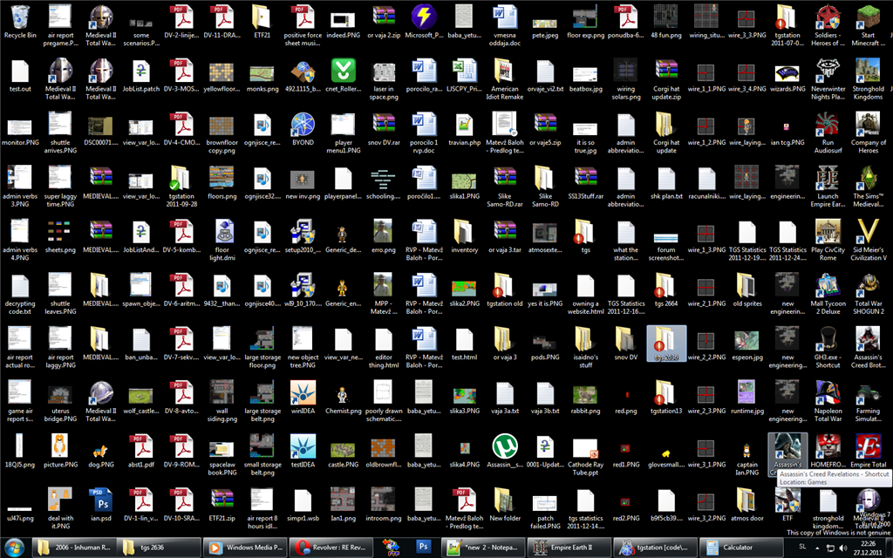

<!--

author:   Nicole Feldman
email:    feldmanna@chop.edu
version:  1.0.0
language: en
narrator: UK English Female
title: Types of Data Storage Solutions
comment:  This course will focus on different data storage solutions available to an end user and the unique characteristics of each type. This course will also cover how each storage type impacts one's access to data and computing capabilities.
long_description: This module is for people interested in understanding the types of data storage solutions available to them at their institution and why they might want to store their files or perform certain computational tasks in each.

@learning_objectives

After completion of this module, learners will be able to:

- Identify and describe different data storage solutions
- Understand the benefits and the limitations of each covered storage solution
- Describe what computational tasks are best suited to the described data storage types
- Know the upfront costs and ongoing maintenance the various storage solutions require

@end

link:  https://chop-dbhi-arcus-education-website-assets.s3.amazonaws.com/css/styles.css

script: https://kit.fontawesome.com/83b2343bd4.js

-->

# Types of Data Storage Models

## Overview

@comment

**Is this module right for me?** @long_description

**Estimated time to completion:** ~30 minutes

**Pre-requisites**

None, this module is intended for all end users regardless of their technical skill set and computing set up. This module is the first in a series on data storage topics. It can be paired with a more technical and advanced module on security, privacy, and backup considerations for the data storage types discussed herein.

**Learning Objectives**

@learning_objectives

## Why should I care about how and where I store my data?

- You might have a chaotic looking desktop littered with document icons or you might already be storing your files in the cloud.
- If your storage setup isn't impeding you from getting your work done you probably haven't thought too deeply about modifying where you are storing things.
- However your choice, might be limiting your ability to collaborate with colleagues, hampering your ability to scale up your research, or costing you valuable time and money.
- This module will discuss the variety of storage options available to you and the benefits and drawbacks to storing your data and performing certain computational tasks in the options covered.
- The aim of this module is to illustrate the breadth of options available, and to evince what computing activities should be performed in each type and to make the storage selection process straightforward for the end user.

## Local Storage

<!-- style = "max-width: 45%; display: block; margin-left: auto; margin-right: auto;"-->

- For basic solo scratch work and other draft materials that are not likely to have a longterm shelf life, it is good to harness the variety of local storage options readily at your disposable.

### Native to your Computer

<!-- style = "max-width: 45%; display: block; margin-left: auto; margin-right: auto;"-->

- As you complete your day-to-day activities, you are probably creating a fair amount of documentation and saving numerous versions of files to your machine.
- Even when working in this more casual, temporary way it is good to be aware of the native storage options on your personal computer.
- **Desktop** storage is recommend for nonsensitive files that you frequently use and that are not likely to be retained longterm. Items stored here are not robustly backed up and you should not store high value or sensitive materials in this location.
- Moreover, a desktop, like your physical desk, can quickly become cluttered and hard to navigate and should never be where the bulk of your work is saved.
- **Documents** folder storage is another default option on your personal computer that provides better security, organizing potential and backup than your desktop. This is a good storage choice for frequently updated and accessed smaller files that are critical to business operations and for which you are the sole contributor.

### Quiz: Storage on your Computer

What is true of desktop storage?

[( )] Requires physical space to maintain and host servers
[( )] Requires in house IT staff or vendor support to maintain the technical infrastructure
[(X)] Once you have made the resource investment, making changes is quite easy
[( )] Files can be only accessed over the network or through a VPN client
***

For all its computational advantages, on premises network storage has significant up front costs and you are generally trapped into a pretty rigid setup once you have made the selection.

****

### Removable Media

- Another form of local storage that allows your files to be both accessed on additional computers and backed up at a location other than your personal computer is removable media or **expandable storage**. - This a great option for backing up files you access daily that are personally maintained and owned by you.

<!-- style = "max-width: 45%; display: block; margin-left: auto; margin-right: auto;"-->

- Most removable media types require a playback reader including popular optical disc storage formats like CDs or DVDs. These formats should largely be avoided since most modern computers are not even equipped with CD or DVD drives, their storage allotment is limited, and they can easily become damaged and unplayable.

<!-- style = "max-width: 45%; display: block; margin-left: auto; margin-right: auto;"-->

- Removable storage devices like USB flash drives and external hard drives are a better option, though they require a USB drive to access files which could potentially become obsolete on your future personal computing device.
- These devices also have an added advantage in that they have more storage space, offer better security in that they can be readily encrypted or password protected, and are less likely to suffer physical degradation.
- That said, if you misplace your external device, you have also misplaced your access to a backup copy.

### Quiz: Removable Media

Why are USB flash drives a preferable removable media format than CDs or DVDs?

[( )] They do not require a playback reader to access what is stored there
[( )] If they become physically damaged, data can still be accessed
[( )] They have less storage space than an optical disc format
[(X)] Many popular options offer enhanced security like password protection and data encryption
***

Both optical discs and USB flash drives require playback media and can suffer irreparable physical degradation. USB flash drives actually have more storage space than CDs or DVDs, which is another reason they are a preferred removable media storage solution.

****

## On Premises Network

<!-- style = "max-width: 45%; display: block; margin-left: auto; margin-right: auto;"-->

- We have covered the local storage options suitable for smaller files owned and maintained by you.
- Now we will cover on premise resources that facilitate working with larger amounts of data and collaborating with multiple users.

### Installation and Ongoing Maintenance

<!-- style = "max-width: 45%; display: block; margin-left: auto; margin-right: auto;"-->

- **On Premises Storage** denotes your organization standing up servers hosted on site that are either maintained by your IT department or an external vendor.
- Data is accessible over the network, including over a VPN (virtual private network) client while working remotely.
- This is a great storage solution for larger, high value files that need to be kept for a considerable amount of time and that will be accessed by and modified by several users. These network servers often provide failover support (switch to a backup server if the primary system becomes unavailable) and automatically retain multiple copies of assets by design.
- Beyond the huge upgrade in storage capacity, on premises network computing resources also offer faster processing time for complex workloads and operations.
- It should be noted that while multiple users can atomically update a data object, multiple users cannot be working on the same file at the same time.
- All things considered, this is a much improved way of collaborating with a peer than physically walking a file over to them.

<!-- style = "max-width: 45%; display: block; margin-left: auto; margin-right: auto;"-->

- However, it is not just a mere flip of the switch to provide these resources, and it is a huge investment of time and upfront costs to get this kind of infrastructure in place.
- If your organization is partnering with an external vendor, you might also be locked into their allotted technological constraints as well as be subject to time and cost intensive things like hardware, software, and licensing updates.

### Quiz: On Premises Network

What is not true of on premises network storage?

[( )] Requires physical space to maintain and host servers
[( )] Requires in house IT staff or vendor support to maintain the technical infrastructure
[(X)] Once you have made the resource investment, making changes is quite easy
[( )] Files can be only accessed over the network or through a VPN client
***

For all its computational advantages, on premises network storage has significant up front costs and you are generally trapped into a pretty rigid setup once you have made the selection.

****

## Cloud Storage

<!-- style = "max-width: 45%; display: block; margin-left: auto; margin-right: auto;"-->

- Cloud storage offers many of the same features as on premises storage in terms of allowing enterprise level technological capabilities as well as enhanced backup and security protocols.
- However, it is important to be aware of the unique characteristics of cloud resources as well.

### Highly Customizable but Less Control

<!-- style = "max-width: 45%; display: block; margin-left: auto; margin-right: auto;"-->

- If you are already storing files in Google Drive or Microsoft OneDrive then you are already fully immersed in **cloud storage** technologies (whether you realize it or not) and have experienced firsthand how utilizing these tools unlocks the ability to work from anywhere and to dynamically collaborate with others on shared assets in real time.
- Web hosted cloud storage frees information from being tethered to physical media while still providing the desired access controls.
- Unlike on premises storage, which necessitate a huge immediate outlay and tremendous physical infrastructure and corresponding staffing, cloud storage presents a more hands off and flexible choice.

<!-- style = "max-width: 45%; display: block; margin-left: auto; margin-right: auto;"-->

- Cloud storage providers cover the hosting of these resources and have a variety of subscription models that are tailored to meet your operational needs and that can be modified as those needs change.
- One of the biggest tradeoffs in using cloud storage is learning to move away from instant access to data, however this feature encourages more responsible data management and retention strategies.
- As long as an on premises server is up and running, a user can access data residing there.
- Yet, having immediate access to all data in the cloud is extremely expensive and not a realistic business strategy. Accordingly, in a cloud storage model, speed of access to data is directly correlated with the cost.
- Having to make thoughtful decisions like these as you work out your support agreement with your cloud service provider illustrates the compromises you must consider when storing data in the cloud.

### Quiz: Cloud Storage

True or False: Cost of storage in the cloud is inversely related to how instantly it can be accessed

[( )] TRUE
[(X)] FALSE
***

The most economical storage in the cloud is coldline or archival tier storage. This option can offer up to a several day retrieval time.

****

### The Hybrid Storage Option

<!-- style = "max-width: 45%; display: block; margin-left: auto; margin-right: auto;"-->

- We have covered how both on premises storage and cloud storage are equally adept at facilitating collaborative work on larger data holdings, but differ in terms of calculating costs, degrees of control, and flexibility.
- It is possible to select a **hybrid storage** solution in which data is stored partially on premises and partially in the cloud and, if desired, in both places.
- You might choose to store business critical or highly sensitive assets on site, while electing to store archival data in the cloud.
- This is certainly a moving target and something you can take time to find a resolution on as you navigate these scaled up storage solutions.

## Additional Resources

- [CDW Resource on Various Data Storage Types and their Features](https://www.cdw.com/content/cdw/en/articles/datacenter/what-is-data-storage.html)
- [Comprehensive Cloud Storage Overview](https://www.techtarget.com/searchstorage/definition/cloud-storage)
- [Concise Breakdown of On Premises vs. Clould Storage Differences](https://www.microsoft.com/en-us/microsoft-365/business-insights-ideas/resources/cloud-storage-vs-on-premises-servers)
- [Recommended Practices for Storing Data on Removable Media](https://staysafeonline.org/blog/security-best-practices-for-removable-media-and-devices/)

## Feedback

In the beginning, we stated some goals.

**Learning Objectives:**

@learning_objectives

We ask you to fill out a brief (5 minutes or less) survey to let us know:

- If we achieved the learning objectives
- If the module difficulty was appropriate
- If we gave you the experience you expected

We gather this information in order to iteratively improve our work. Thank you in advance for filling out [our brief survey](https://redcap.chop.edu/surveys/?s=KHTXCXJJ93&module_name=%22Types+of+Data+Storage+Solutions%22)!
