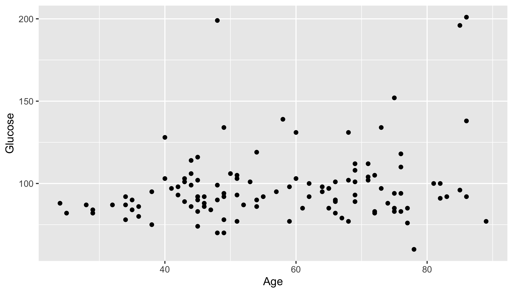

<!--

author:   Rose Hartman
email:    hartmanr1@chop.edu
version:  0.0.1
language: en
narrator: UK English Female
title: Data Visualization in ggplot2
comment:  This module includes code and explanations for several popular data visualizations, using R's ggplot2 package. It also includes examples of how to modify ggplot2 plots to customize them for different uses (e.g. adhering to journal requirements for visualizations).
link: https://chop-dbhi-arcus-education-website-assets.s3.amazonaws.com/css/modules.css

-->
# Data Visualization in ggplot2

<div class = "overview">
# Overview

This module includes code and explanations for several popular data visualizations, using R's ggplot2 package. It also includes examples of how to modify ggplot2 plots to customize them for different uses (e.g. adhering to journal requirements for visualizations).

**Estimated time to completion:** 1 hr

**Pre-requisites**

This module assumes some familiarity with principles of data visualizations as applied in the ggplot2 library. If you've used ggplot2 (or python's seaborn) a little already and are just looking to extend your skills, this module should be right for you. If you are brand new to ggplot2 and seaborn, start with the overview of [data visualizations in open source software](link) first, and then come back here.

This module also assumes some basic familiarity with R, including

* [installing and loading packages](link)
* [reading in data](link)
* manipulating data frames, including [calculating new columns](link), and [pivoting from wide format to long](link)
* some [statistical tests](link)

If you are brand new to R (or want a refresher) consider starting with [Intro to R](link) first.

**Learning Objectives**

After completion of this module, learners will be able to:

* use ggplot2 to create several common data visualizations
* customize some elements of a plot, and know where to look to learn how to customize others
</div>

Content:
=======

## Lesson Preparation

This module makes use of [pangeo binder](https://binder.pangeo.io/) for interactive code examples in R. You don't need to install anything or set up an account, but you need a modern web browser like Chrome and a moderately good wifi connection. If you have R already installed on your computer and you prefer to work through code examples there, you can [download all the code for this module to run offline](link).

If you intend to do the hands-on activities in this module with pangeo binder, we have a bit of preparation for you to do now. Because it can take a few minutes for the environment to be created, we suggest you click the link below to start up the activity now. It will open in a new tab or window, and you can simply return here to continue learning, while the environment finishes loading. Here is the link:

[](https://binder.pangeo.io/v2/gh/arcus/education_r_environment/roseh-data-viz-module?urlpath=rstudio){:target="_blank"} **Click the "launch binder" button!**


You don't have to do anything except come back here once the link opens in a new tab or window.

## Making plots in ggplot2

This module is a practical, hands-on guide to making data visualizations in R's ggplot2. Snippets of code are included throughout the text here, but you are strongly encouraged to try running the code yourself instead of just reading it. Better yet, try to modify the code for each of the example plots to use with your own data!

<div class = "warning">
If you are using the [pangeo binder instance we prepared](#lesson-preparation), then all of the R packages you need will already be installed and you're all set.

If you are using R on your own machine, though, then you may need to run the following code in R before continuing with the code examples here:

```r
install.packages("ggplot2", "readr", "dplyr")

```
</div>

### How ggplot2 works

If you've already used R for other tasks, you may feel like the R code for ggplot2 is a little different. Usually, when you want R to do something, you use a single function, or for more complicated tasks, a set of nested or [piped functions](https://style.tidyverse.org/pipes.html). For example, if you want to [create a scatterplot in base R](https://www.statmethods.net/graphs/scatterplot.html), you might run something like this:

```r
plot(wt, mpg, data = mtcars)
```

In ggplot2, use the ggplot() function to generate an empty base plot, and then you **add** each of the elements

## Scatterplots

Scatterplots show the relationship between two continuous variables, one on the x-axis and one on the y-axis. Because they show each individual data point as a marker, they also provide a handy way to check visually for outliers. For more background on scatterplots, watch [this Kahn Academy series](https://www.khanacademy.org/math/cc-eighth-grade-math/cc-8th-data/cc-8th-scatter-plots/v/constructing-scatter-plot).

### Basic scatterplot

First, we need to load the libraries we'll be using:

```r
# the libraries we'll be using
library(readr)
library(dplyr)
library(ggplot2)

```

<div class = "learnmore">
The readr and dplyr packages, like ggplot2 are part of the [tidyverse](https://www.tidyverse.org/), a set of R packages for data science. Check out the free R for Data Science book online to learn more about both readr (the [data import](https://r4ds.had.co.nz/data-import.html) chapter) and dplyr (the [data transformation](https://r4ds.had.co.nz/transform.html) chapter).
</div>

And then read in the data set:

```r
breast_cancer_data <- read_csv("https://archive.ics.uci.edu/ml/machine-learning-databases/00451/dataR2.csv")

```

To make any plot using ggplot2, we start by specifying the variables we'll be using and how --- this information is called the aesthetics, and is included in the aes() argument of the ggplot2 command. Here, the important aesthetics are just x and y. After setting the aesthetics with the ggplot() command, then we add a "layer" specifying how we want ggplot2 to plot this information, in our case as a scatterplot, which is specified using geom_point().

```r
# basic scatter plot
ggplot(breast_cancer_data, aes(y=Glucose, x=Age)) +
  geom_point()

```



### Using color for continuous variables

Let's try adding information about a third variable by using color. ggplot2 uses color differently depending on whether the variable is continuous ("numeric" in R) or categorical (a "factor" in R). First we'll look at a continuous variable.

```r
# use color to add information about a continuous variable
ggplot(breast_cancer_data, aes(y=Glucose, x=Age, color = BMI)) +
  geom_point()

```


Note that when you add an aesthetic for color (or shape, line type, alpha, or size), it will automatically add a legend to your plot.

### Using color to show groups

Now let's look at using color for a categorical variable. In this case, the variable is a categorical one (Classification, 1 or 2), but it isn't properly coded as a factor in the data frame. We'll fix that first and then send the corrected dataframe to the ggplot command.

<div class = "important">
Tip: It's generally much easier to make any necessary changes to the data, such as mutating variables, before sending it to the plotting command.
</div>

```r
# the Classification variable is currently treated as numeric,
# so convert it to a factor
breast_cancer_data <- breast_cancer_data %>%
  mutate(Class_factor = factor(Classification,
                                 levels = c(1,2),
                                 labels = c("Class 1", "Class 2")))

# use color to add information about a categorical variable
ggplot(breast_cancer_data, aes(y=Glucose, x=Age, color = Class_factor)) +
  geom_point()

```


### Distinguish groups more clearly with custom colors and shape

So far, we've been sticking to ggplot's default color scheme, but you can control what colors are used in your plots. There are a number of [excellent](https://ggplot2-book.org/scale-colour.html) [tutorials](https://ggplot2-book.org/scale-colour.html) [available](https://www.r-graph-gallery.com/ggplot2-color.html) about how to control the colors in your ggplot visualizations. Here we'll just show one approach, using colors you specify by hand.

```r
# save the colors you want to use as a vector
# you can specify colors by name (e.g. "blue"),
# or use HTML codes, as from https://htmlcolorcodes.com/color-picker/
class_colors <- c(`Class 1` = "#FEB648", `Class 2` = "#3390FF")

# add a layer with scale_color_manual to specify the colors you want to use
ggplot(breast_cancer_data, aes(y=Glucose, x=Age, color = Class_factor)) +
  geom_point() +
  scale_color_manual(values = class_colors)

```


<div class = "important">
Tip: Don't use color alone to convey important information in your plots because if your end users are unable to distinguish the colors, the plot loses its value. Instead, double-up color information with another element, such as shape, to make the different groups easier to distinguish. For help selecting colors that are most likely to work for users with color vision deficiencies, [read about the colorspace package in R](https://arxiv.org/abs/1903.06490).
</div>

We'll improve this plot by using shape and color together to mark the Classification groups.

```r
# add shape as a second signal to distinguish Classification
ggplot(breast_cancer_data, aes(y=Glucose, x=Age, color = Class_factor,
                               shape = Class_factor)) +
  geom_point() +
  scale_color_manual(values = class_colors)

```


### Changing background color with theme

Finally, we can control the background (and other aspects of the plot's general appearance) by adjusting the theme. There are quite a lot of [pre-made themes available](https://ggplot2-book.org/polishing.html#themes), or you can [specify your own](https://ggplot2-book.org/polishing.html#modifying-theme-components). I'll use the theme called theme_bw().

```r
# change the theme to theme_bw()
ggplot(breast_cancer_data, aes(y=Glucose, x=Age, color = Class_factor,
                               shape = Class_factor)) +
  geom_point() +
  scale_color_manual(values = class_colors) +
  theme_bw()

```


### Custom colors for continuous variables

We can also manually control the color for a continuous variable, such as BMI. To do that, we'll use `scale_color_continuous()` instead of `scale_color_manual()`. We'll use theme_bw() again here, as well.

```r
# manually adjust color for a continuous variable
ggplot(breast_cancer_data, aes(y=Glucose, x=Age, color = BMI)) +
  geom_point() +
  scale_color_gradient(low = "lightgrey", high ="darkred") +
  theme_bw()
```


### Quiz: Scatterplots

True or False: The only two crucial aesthetics for a ggplot2 scatterplot are x and y.

[(X)] TRUE
[( )] FALSE
***********************************************************************
<div class = "answer">
While x and y are the only two **crucial** aesthetics, you may want to include others, such as color and shape, to communicate information about additional variables in the data.
</div>
***********************************************************************

What is the geom command for a scatterplot in ggplot2?

[[geom_point()]]
<script>
  let input = "@input".trim();
  /geom_point/.test(input);
</script>
***********************************************************************
<div class = "answer">
Every ggplot2 visualization starts with the `ggplot()` command first to set which data will be used and how (i.e., the aesthetics), and then one or more "geoms" that control what type of plot will be created.
</div>
***********************************************************************


Which of the following can be used to manually set the color for a **numeric** variable in ggplot2?

[(X)] `scale_color_gradient()`
[( )] `scale_color_manual()`
[( )] `theme_color()`
[( )] Any of the above
***********************************************************************
<div class = "answer">
`scale_color_gradient()` is for continuous variables, and `scale_color_manual()` is for categorical variables (factors).
</div>
***********************************************************************

## Histograms

Histograms show the distribution of a continuous variable. The values of the variable are shown along the x-axis, and data are grouped into bins, with the height of each bin corresponding to the number of data points in that bin. In other words, it communicates where your data for a given variable fall within its range. It is a great way to quickly assess for symmetry vs skew, outliers, and less common issues like multimodality.

We'll continue using the same data we explored to make scatter plots.

### Basic histogram

Because histograms show just one variable, the only aesthetic they require is x. The y-axis of the plot will just show the counts of observations in each bin on the x-axis. (Note that it is possible to provide ggplot2 with y instead of x, in which case it will generate a sideways histogram.)

```r
# a basic histogram
ggplot(breast_cancer_data, aes(x=Glucose)) +
  geom_histogram() +
  theme_bw()
```


Note that we can use theme_bw() again to make a white background, as we did with the scatter plots.

### Change the number of bins

The appearance of a histogram can change a lot depending on the number of bins you use along the x-axis. It's a good idea to try a few different sets of bins to see what works well for communicating this distribution.

```r
# try fewer bins
ggplot(breast_cancer_data, aes(x=Glucose)) +
  geom_histogram(bins=10) +
  theme_bw()

```


```r
# try more bins
ggplot(breast_cancer_data, aes(x=Glucose)) +
  geom_histogram(bins=100) +
  theme_bw()

```


### Using color to show groups

As with scatterplots, we can add information about an additional variable by using color. Let's add the Classification factor to our aesthetics so we can see how the distribution of glucose values differs in the two groups.

<div class = "important">
Tip: ggplot2 thinks about color differently for points and lines vs. filled in objects like bars. To adjust the color of the bars in a histogram, we need to use the fill aesthetic, not color.
</div>

Note that we can set fill manually, just as we did with color in the scatterplots. In fact, we can use the same vector of colors we specified there to control fill now, giving our plots a coherent appearance.

```r
# use color to show Classification as well
ggplot(breast_cancer_data, aes(x=Glucose, fill = Class_factor)) +
  geom_histogram(bins=30) +
  scale_fill_manual(values = class_colors) +
  theme_bw()

```


You may be noticing that the distribution for Class 1 appears to be stacked on top of the distribution for Class 2. This makes it easy to still see the overall distribution across both classification groups, but it makes it hard to see what the Class 1 distribution is like on its own. You can have ggplot display both groups as if they were each their own histogram instead of stacking by changing the position argument in the geom_histogram() function. It defaults to "stacked", but if you make it "identity", then it will plot by the height of each bin within each group rather than both groups added together.

If we do this, we'll also need to control the transparency in the plot --- otherwise one distribution will obscure the other where they overlap. Alpha is a value between 0 (totally transparent) and 1 (totally opaque), and it defaults to 1. We'll try it at .5 here to see if that lets us see both distributions well enough.

<div class = "important">
Tip: When your data overlap on a plot, use alpha to make them more transparent.
</div>

```r
# plot as two overlapping histograms, rather than stacked bins
# use alpha to control transparency
ggplot(breast_cancer_data, aes(x=Glucose, fill = Class_factor)) +
  geom_histogram(bins=30, alpha = .5, position = "identity") +
  scale_fill_manual(values = class_colors) +
  theme_bw()
```


### Transforming axes

Let's take a look at another variable in the breast cancer data, Insulin:

```r
# a histogram of a positively skewed variable
ggplot(breast_cancer_data, aes(x=Insulin)) +
  geom_histogram(bins=30) +
  theme_bw()
```


This is a variable with positive skew. That means that the bulk of the data are clustered at the left end of the range between 0 and 10, with a long tail extending up toward 60.

You may want to adjust the scale so that you can see more of the detail in the 0-10 range. One way to do that would be to statistically transform the Insulin variable in the data and then re-plot it with the transformed variable, but actually ggplot2 has built in functions to transform an axis so there's no need to modify the data. We'll use a common log transformation here, but there are [many more transformations](https://ggplot2.tidyverse.org/reference/scale_continuous.html) available.

```r
# transform the x-axis to show more detail at lower values
ggplot(breast_cancer_data, aes(x=Insulin)) +
  geom_histogram(bins=30) +
  scale_x_continuous(trans = "log10") +
  theme_bw()
```


Note the scale on the x-axis. Fully half of the plot now shows the 0-10 range, allowing us to better see what the distribution there is like.

### Quiz: Histograms

What is the geom function for creating a histogram in ggplot2?

[[geom_histogram()]]
<script>
  let input = "@input".trim();
  input == "geom_histogram()" || input == "geom_histogram";
</script>

Which of the following aesthetics can be used to plot a histogram in ggplot2?

[( )] x only
[(X)] either x or y
[( )] y only
[( )] both x and y
***********************************************************************
<div class = "answer">
Histograms can only make use of one dimension of data (x or y, but never both) because the other dimension will always be the count of observations in each bin. If you try to provide both x and y as aesthetics, ggplot2 will give you an error.

In all of our examples, we used the x aesthetic for our histograms, but it is possible to provide a y aesthetic instead. As an experiment, try generating one of the plots above, but substitute y for x and see what happens!
</div>
***********************************************************************


What do you use to control transparency in ggplot2?

[[alpha]]
***********************************************************************
<div class = "answer">
Note the second plot in the [Using color to show groups](#using-color-to-show-groups), which includes an alpha adjustment.
</div>
***********************************************************************

True or False: Many common scale transformations are available in ggplot2, so you don't have to transform the data itself before plotting if you want to correct skew in your visualization.

[(X)] True
[( )] False
***********************************************************************
<div class = "answer">
For a review, see [transforming axes](#transforming-axes).

There are a few common transformations with their own ggplot2 functions, but there are many more available, and you can even [write your own transformation to use in ggplot2](https://scales.r-lib.org/reference/trans_new.html) if you like.
</div>
***********************************************************************

## Line Plots

Line plots are especially useful when you want to show data points that are connected in a meaningful way. The most common application is repeated measures over time, such as when patients are measured on a given variable (plotted on the y-axis) at several times (plotted along the x-axis), and each line would represent one patient, or a summary across a group of patients.

<div class = "important">
A word of caution: You may see line plots where the data points don't actually share a meaningful theoretical connection (e.g. all being from the same patient, or the same group). Although it's not uncommon, this is generally not considered good practice and you may receive pushback from reviewers or readers.
</div>

### Basic line plot

### Using color and line type to show groups

### Quiz: Line Plots

***********************************************************************
<div class = "answer">

</div>
***********************************************************************

## Trend Lines

Trend lines look like line plots, but they are different in one key way: They show a **summary* of other data, rather than plotting data directly.

Trend lines are used to show the overall trend in a scatterplot. Sometimes, the scatterplot points themselves are omitted and just the trend lines are shown to keep the visualization as clean as possible, but they're still implied.

### Method 1: geom_smooth

Because trend lines are such a useful visual summary, ggplot2 provides several built-in functions to add trend lines to your plots quickly and easily. These functions are available in the geom_smooth() command.

By default[^1](Actually, the default is only a loess curve for 1000 or fewer observations; it switches to a generalized additive model if you have more.), geom_smooth() uses a loess curve to summarize your data, rather than a straight linear regression best fit line.

### Method 2: geom_abline

Rather than having ggplot2 run a linear regression for you, you may prefer to use the coefficients from your model to draw the line of best fit directly.

This is especially handy if your model differs from ggplot2's, or if you're not sure what model ggplot2 is running and you want to make sure your plotted trend line matches the model you ran.

The geom_abline() function allows you to specify a y-intercept and slope (which you can pull from your model coefficients) and it will draw a line accordingly.

### Method 3: geom_line

The third approach for drawing trend lines actually uses the same geom we used for line plots, geom_line.

### Quiz: Trend Lines

***********************************************************************
<div class = "answer">

</div>
***********************************************************************

## Additional Resources

For an excellent quick reference, see the [ggplot2 cheatsheet](https://ggplot2.tidyverse.org/#cheatsheet). It includes a tremendous amount of information in a very compact format, so it's not great for people just getting started with ggplot2, but it's a valuable reference to keep on hand for when you start making plots for your own analyses.

For more detail on controlling color in ggplot2, refer to the [ggplot2 book](https://ggplot2-book.org/scale-colour.html), available for free online.

To learn how to make these plots in python using seaborn, see Data visualization in seaborn (coming soon).

## Feedback

In the beginning, we stated some goals.

Learning Objectives:  
---

After completion of this module, learners will be able to:

* identify key elements
* do a task
* articulate the rationale for something

We ask you to fill out a brief (5 minutes or less) survey to let us know:

* If we achieved the learning objectives
* If the module difficulty was appropriate
* If we gave you the experience you expected

We gather this information in order to iteratively improve our work.  Thank you in advance for filling out [our brief survey](https://redcap.chop.edu/surveys/?s=KHTXCXJJ93&module_name=%22Data+visualizations+in+ggplot2%22)!
