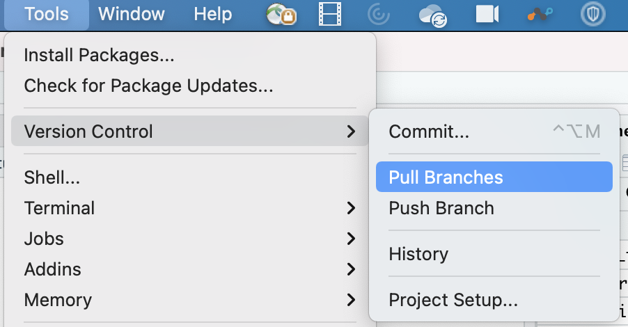
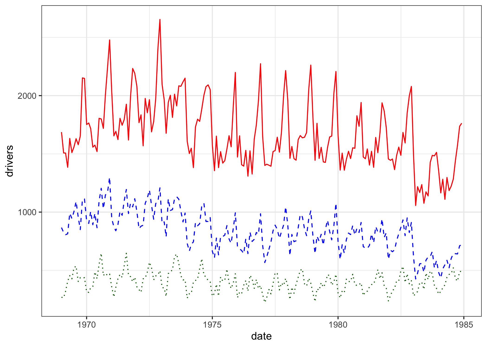

<!--

author:   Rose Hartman
email:    hartmanr1@chop.edu
version:  1.2.0
module_template_version: 2.0.0
language: en
narrator: UK English Female
title: Data Visualization in ggplot2
comment:  This module includes code and explanations for several popular data visualizations, using R's ggplot2 package. It also includes examples of how to modify ggplot2 plots to customize them for different uses (e.g. adhering to journal requirements for visualizations).
long_description: You can use the ggplot2 library in R to make many different kinds of data visualizations (also called plots, or charts), including scatterplots, histograms, line plots, and trend lines. This module provides an example of each of these kinds of plots, including R code to make them using the ggplot2 library. It may be hard to follow if you are brand new to R, but it is appropriate for beginners with at least a small amount of R experience.
estimated_time: 60 min

r_code: data\_visualization\_in\_ggplot2

@learning_objectives  

After completion of this module, learners will be able to:

- use ggplot2 to create several common data visualizations
- customize some elements of a plot, and know where to look to learn how to customize others

@end

@gifPreload
<script>
(function($) {

  // Get the .gif images from the "data-alt".
	var getGif = function() {
		var gif = [];
		$('img').each(function() {
			var data = $(this).data('alt');
			gif.push(data);
		});
		return gif;
	}

	var gif = getGif();

	// Preload all the gif images.
	var image = [];

	$.each(gif, function(index) {
		image[index]     = new Image();
		image[index].src = gif[index];
	});

	// Change the image to .gif when clicked and vice versa.
	$('figure').on('click', function() {

		var $this   = $(this),
				$index  = $this.index(),

				$img    = $this.children('img'),
				$imgSrc = $img.attr('src'),
				$imgAlt = $img.attr('data-alt'),
				$imgExt = $imgAlt.split('.');

		if($imgExt[1] === 'gif') {
			$img.attr('src', $img.data('alt')).attr('data-alt', $imgSrc);
		} else {
			$img.attr('src', $imgAlt).attr('data-alt', $img.data('alt'));
		}

		// Add play class to help with the styling.
		$this.toggleClass('play');

	});

})(jQuery);
</script>
@end

link:  https://chop-dbhi-arcus-education-website-assets.s3.amazonaws.com/css/styles.css
script: https://kit.fontawesome.com/83b2343bd4.js

-->
# Data Visualization in ggplot2

<div class = "overview">
# Overview
@comment

**Is this module right for me?** @long_description

**Estimated time to completion:** @estimated_time

**Pre-requisites**

This module assumes some familiarity with principles of data visualizations as applied in the ggplot2 library. If you've used ggplot2 (or python's seaborn) a little already and are just looking to extend your skills, this module should be right for you. If you are brand new to ggplot2 and seaborn, start with the overview of [data visualizations in open source software](https://liascript.github.io/course/?https://raw.githubusercontent.com/arcus/education_modules/main/data_visualization_in_open_source_software/data_visualization.md) first, and then come back here.

This module also assumes some basic familiarity with R, including

* [installing and loading packages](https://r4ds.had.co.nz/data-visualisation.html#prerequisites-1)
* [reading in data](https://r4ds.had.co.nz/data-import.html)
* manipulating data frames, including [calculating new columns](https://r4ds.had.co.nz/transform.html#add-new-variables-with-mutate), and [pivoting from wide format to long](https://r4ds.had.co.nz/tidy-data.html#longer)
* some [statistical tests](https://liascript.github.io/course/?https://raw.githubusercontent.com/arcus/education_modules/main/statistical_tests/statistical_tests.md), especially linear regression

If you are brand new to R (or want a refresher) consider starting with [Intro to R](https://liascript.github.io/course/?https://raw.githubusercontent.com/arcus/education_modules/main/r_basics_introduction/r_basics_introduction.md) first.

**Learning Objectives**

@learning_objectives

</div>

## Lesson Preparation: Our RStudio Environment

Please do this step now, because we're going to ask you to follow along throughout and try out code as you go.  

<div class = "important">
Please read over both options before you start performing any actions, to make sure you pick the right option for you.
</div>

<h3>Option 1: Work in the Cloud</h3>

This might work well for you if you either can't or don't want to install R and RStudio on your computer.  The benefit is that you don't have to install anything, but one negative is that this option requires a bit of waiting for your environment to come online.

**First**, we need to create a small container in the cloud for you to work in just using your web browser.  **Click "Launch binder" below.**  It might take a while (5 minutes) to create, depending on how recently it was created (when it's being used more, it's quicker!).  We're looking for a faster way to get you off and running in RStudio without downloads and without creating accounts, but for now this is a great, free way for us to get you working with no extra work on your part.

  <a href = "https://mybinder.org/v2/gh/arcus/education_r_environment/main?urlpath=rstudio" target = "_blank"></a> **← Click the "launch binder" button!**

<div class = "hint" style = "align-items: center; display: flex;">

<div style = "margin: 1rem; max-width: 45%; float:left;"> If you're the first person to fire up this environment in a while, you might see this loading screen for up to five minutes.  Be patient!</div>
<div style = "margin: 1rem auto; max-width: 45%; float:left;"> <!--
style = "border: 1px solid rgb(var(--color-highlight));"-->
</div>
</div>

**Then**, once you have access to RStudio and you see something like the image below, you'll need to open the sample data for this course.  In the file area to the lower right, you'll see, among multiple choices, the folder called "@r_code".  That's the code for this module!

<!--
style = "border: 1px solid rgb(var(--color-highlight)); max-width: 800px;"-->

<h3>Option 2: Work on Your Computer</h3>

If you have [R](https://www.r-project.org/) and [RStudio](https://www.rstudio.com/products/rstudio/download/#download) installed already on your local computer, you might be interested in simply downloading our sample code to your computer. Here's how.  Note -- if you've already done this step in another module, you might have the material for this module already!

* In RStudio, open a new project (File, New Project)
* Select Version Control, then Git
* Drop this link into the "Repository URL": https://github.com/arcus/education_r_environment
* Change the "Project directory name" and "Create project as a subdirectory of" boxes to suit your needs (where will this code be stored on your computer?).
* Click to select the "Open in new session" checkbox
* Click "Create Project"
* In the file area to the lower right, you'll see, among multiple choices, the folder called "@r_code".  That's the code for this module!

**Want to watch this process?  Click on the image below to play an animated gif.  It will continue to loop and you can re-start it by clicking again.**

<div style="display:none">@gifPreload</div>

<figure>
  

<figcaption style = "font-size: 1em;">Click on the image to play the demo of the above steps!</figcaption>
</figure>

If you already completed this work for a previous module, and it's been a while since you downloaded this project to your computer, you may want to get any new and improved files that have been placed there in the meantime:

* Open your project.
* In the Version Control menu, choose "pull branches".  There are two places to do this, as shown below:

<!-- style = "border: 1px solid rgb(var(--color-highlight)); max-width:400px;" -->  
<!-- style = "border: 1px solid rgb(var(--color-highlight)); max-width:400px;" -->

<div class = "warning">
If you're pulling branches after having worked in other R modules, you might have made local changes (for example, when you filled in exercise code) that will be overwritten by pulling the latest version.  If you want to save your changes, consider making a copy of any exercise files and naming them something new.  For example, if you have already worked in the `r_basics_example` exercise files, you might want to save your version of `example_exercises.Rmd` to `my_example_exercises.Rmd`.  That way, you can pull down the latest version of code, overwriting `example_exercises.Rmd` while holding on to your changes in the new file.
</div>


## Making plots in ggplot2

This module is a practical, hands-on guide to making data visualizations in R's ggplot2. Snippets of code are included throughout the text here, but you are strongly encouraged to try running the code yourself instead of just reading it. Better yet, try to modify the code for each of the example plots to use with your own data!

<div class = "important">
If you are using the [binder instance we prepared](#lesson-preparation), then all of the R packages you need will already be installed and you're all set.

If you are using R on your own machine, though, then you may need to run the following code in R before continuing with the code examples here:

```r
install.packages("ggplot2", "readr", "dplyr")

```
</div>

### How ggplot2 works

If you've already used R for other tasks, you may feel like the R code for ggplot2 is a little different. Usually, when you want R to do something, you use a single function, or for more complicated tasks, a set of nested or [piped functions](https://style.tidyverse.org/pipes.html). For example, if you want to [create a scatterplot in base R](https://www.statmethods.net/graphs/scatterplot.html), you might run something like this:

```r
plot(wt, mpg, data = mtcars)
```

In ggplot2, you use the ggplot() function to generate an empty base plot, and then you **add** each of the elements of the plot as a layer. For example, to generate a scatterplot, you start with a command like `ggplot(mtcars, mapping = aes(x=mpg, y=wt))` to set up the basic information for the plot, and then you add a layer saying what kind of plot you want to draw, like `+ geom_point()` to indicate a scatterplot.

At first, this seems like more work than just using a single command in another plotting system, and it is true that ggplot visualizations are often more lines of code than other kinds of visualizations. The idea of breaking a plot into different kinds of pieces and applying each as a layer has some advantages, though, in that it makes it easier to tweak plots to get exactly what you want --- this is important both for generating plots that can be made to adhere to formatting rules (like for a journal article submission), and because tweaking a plot and re-visualizing the data is a powerful way to explore trends and patterns when you're analyzing a data set.

<div class = "learnmore">
To learn more about the theory behind ggplot2, read [Hadley Wickham's article, "A Layered Grammar of Graphics"](http://vita.had.co.nz/papers/layered-grammar.pdf)
</div>

## Working through interactive coding examples in binder

If you chose [Option 1 in Lesson Preparation](#lesson-preparation) hopefully your binder instance is done loading now! If not, be patient --- it can take as long as 20 or 30 minutes some times if the files haven't been used recently.

When it is ready, you should see the RStudio application running in your browser. In the Files pane in the lower right corner, there is a list of subfolders available. Open the one called "@r_code", and open the .rmd file in that subfolder.

All of the example code in this module is in that "@r_code.rmd" file. While you read through this module, we recommend you keep returning back to the binder instance to try running the code for yourself. Even better, try changing the code and see what happens.

<div class = "important">
Note that binder instances aren't stable. When you close the window or if it idles too long, it may erase all of your work. If you want to save any code or output you come up with while working in binder, you need to copy-paste the code to a new file to save it on your computer.
</div>

## Scatterplots

Scatterplots show the relationship between two continuous variables, one on the x-axis and one on the y-axis. Because they show each individual data point as a marker, they also provide a handy way to check visually for outliers. For more background on scatterplots, watch [this Kahn Academy series](https://www.khanacademy.org/math/cc-eighth-grade-math/cc-8th-data/cc-8th-scatter-plots/v/constructing-scatter-plot).

### The data

First, we need to load the libraries we'll be using:

```r
# the libraries we'll be using
library(readr)
library(dplyr)
library(ggplot2)

```

<div class = "learnmore">
The readr and dplyr packages, like ggplot2, are part of the [tidyverse](https://www.tidyverse.org/), a set of R packages for data science. Check out the free R for Data Science book online to learn more about both readr (the [data import](https://r4ds.had.co.nz/data-import.html) chapter) and dplyr (the [data transformation](https://r4ds.had.co.nz/transform.html) chapter).
</div>

And then read in the data set:

```r
breast_cancer_data <- read_csv("https://archive.ics.uci.edu/ml/machine-learning-databases/00451/dataR2.csv")

```

<div class="learnmore">
Run the above code yourself in binder (see [lesson preparation](#lesson-preparation) for links to start the binder instance) or on your own computer.

In the data_visualization_ggplot2.r file, the code at the top of the file includes these library commands and the command to read the csv file for the data. Before you will be able to generate the plots in the rest of the module, you should run those lines of code.
</div>


### Basic scatterplot

To make any plot using ggplot2, we start by specifying the variables we'll be using and how --- this information is called the [aesthetic mapping](https://ggplot2.tidyverse.org/reference/aes.html), and is included by using the aes() function in the mapping argument of the ggplot2 command. Here, the important aesthetics are just x and y. After setting the aesthetics with the ggplot() command, then we add a layer specifying how we want ggplot2 to plot this information, in our case as a scatterplot, which is specified using geom\_point().

```r
ggplot(breast_cancer_data, mapping = aes(y=Glucose, x=Age)) +
  geom_point()

```


### Using color for continuous variables

Let's try adding information about a third variable by using color. ggplot2 uses color differently depending on whether the variable is continuous ("numeric" in R) or categorical (a "factor" in R). First we'll look at a continuous variable.

```r
# use color to add information about a continuous variable
ggplot(breast_cancer_data(y=Glucose, x=Age, color = BMI)) +
  geom_point()

```


Note that when you add an aesthetic for color (or shape, line type, alpha, or size), it will automatically add a legend to your plot.

### Using color to show groups

Now let's look at using color for a categorical variable. In this case, the variable is a categorical one (Classification, 1 or 2), but it isn't properly coded as a factor in the data frame. We'll fix that first and then send the corrected dataframe to the ggplot command.

<div class = "important">
Tip: It's generally much easier to make any necessary changes to the dataframe, such as mutating variables, before sending it to the plotting command.
</div>

```r
# the Classification variable is currently treated as numeric,
# so convert it to a factor
breast_cancer_data <- breast_cancer_data %>%
  mutate(Class_factor = factor(Classification,
                                 levels = c(1,2),
                                 labels = c("Class 1", "Class 2")))

# use color to add information about a categorical variable
ggplot(breast_cancer_data, mapping = aes(y=Glucose, x=Age, color = Class_factor)) +
  geom_point()

```


### Distinguish groups more clearly with custom colors and shape

So far, we've been sticking to ggplot's default color scheme, but you can control what colors are used in your plots. There are a number of excellent tutorials available about how to control the colors in your ggplot visualizations (here is one [color in ggplot tutorial]((https://blogs.uoregon.edu/rclub/2015/02/17/picking-pretty-plot-palates/)), and [another color in ggplot tutorial](https://www.r-graph-gallery.com/ggplot2-color.html)). Here we'll just show one approach, using colors you specify by hand.

```r
# save the colors you want to use as a vector
# you can specify colors by name (e.g. "blue"),
# or use HTML codes, as from https://htmlcolorcodes.com/color-picker/
class_colors <- c(`Class 1` = "#FEB648", `Class 2` = "#3390FF")

# add a layer with scale_color_manual to specify the colors you want to use
ggplot(breast_cancer_data, mapping = aes(y=Glucose, x=Age, color = Class_factor)) +
  geom_point() +
  scale_color_manual(values = class_colors)

```


<div class = "important">
Tip: Don't use color alone to convey important information in your plots because if your end users are unable to distinguish the colors, the plot loses its value. Instead, double-up color information with another element, such as shape, to make the different groups easier to distinguish. For help selecting colors that are most likely to work for users with color vision deficiencies, [read about the colorspace package in R](https://arxiv.org/abs/1903.06490).
</div>

We'll improve this plot by using shape and color together to mark the Classification groups.

```r
# add shape as a second signal to distinguish Classification
ggplot(breast_cancer_data, mapping = aes(y=Glucose, x=Age, color = Class_factor,
                               shape = Class_factor)) +
  geom_point() +
  scale_color_manual(values = class_colors)

```


### Changing background color with theme

Finally, we can control the background (and other aspects of the plot's general appearance) by adjusting the theme. There are quite a lot of [pre-made themes available](https://ggplot2-book.org/polishing.html#themes), or you can [specify your own](https://ggplot2-book.org/polishing.html#modifying-theme-components). I'll use the theme called theme_bw().

<div class = "learnmore">
Some journals or other organizations have pre-made ggplot2 themes available that you can apply to make your plots adhere to their aesthetic guidelines. It's worth asking! For more information about using themes and modifying them to meet journal requirements, see the [figures chaper in Writing Papers with R and Friends](https://bookdown.org/content/43652694-3819-41d2-9e70-8cfc8dd25fd1/figures.html).  
</div>

```r
# change the theme to theme_bw()
ggplot(breast_cancer_data, mapping = aes(y=Glucose, x=Age, color = Class_factor,
                               shape = Class_factor)) +
  geom_point() +
  scale_color_manual(values = class_colors) +
  theme_bw()

```


### Custom colors for continuous variables

We can also manually control the color for a continuous variable, such as BMI. To do that, we'll use `scale_color_continuous()` instead of `scale_color_manual()`. We'll use theme_bw() again here, as well.

```r
# manually adjust color for a continuous variable
ggplot(breast_cancer_data, mapping = aes(y=Glucose, x=Age, color = BMI)) +
  geom_point() +
  scale_color_gradient(low = "lightgrey", high ="darkred") +
  theme_bw()
```


### Quiz: Scatterplots

True or False: The only two crucial aesthetics for a ggplot2 scatterplot are x and y.

[(X)] TRUE
[( )] FALSE
****
<div class = "answer">
While x and y are the only two **crucial** aesthetics, you may want to include others, such as color and shape, to communicate information about additional variables in the data.
</div>
****

What is the geom command for a scatterplot in ggplot2?

[[geom_point()]]
<script>
  let input = "@input".trim();
  /geom_point/.test(input);
</script>
****
<div class = "answer">
Every ggplot2 visualization starts with the `ggplot()` command first to set which data will be used and how (i.e., the aesthetics), and then one or more "geoms" that control what type of plot will be created.
</div>
****


Which of the following can be used to manually set the color for a **numeric** variable in ggplot2?

[(X)] `scale_color_gradient()`
[( )] `scale_color_manual()`
[( )] `theme_color()`
[( )] Any of the above
****
<div class = "answer">
`scale_color_gradient()` is for continuous variables, and `scale_color_manual()` is for categorical variables (factors).
</div>
****

Modify the code from the example above under [changing the background color with theme](#changing-background-color-with-theme) to apply a different theme. Add another layer to the plot with `theme(legend.position = "bottom")`. (Note: see the ggplot2 website for more on [modifying the legend for a plot](https://ggplot2.tidyverse.org/reference/guides.html).)

```r -Solution
# Note this is just one possible solution!
# If your code generates a plot you like, that's a good solution.

ggplot(breast_cancer_data, mapping = aes(y=Glucose, x=Age, color = Class_factor,
                               shape = Class_factor)) +
  geom_point() +
  scale_color_manual(values = class_colors) +
  theme_classic() +
  theme(legend.position = "bottom")

```

## Histograms

Histograms show the distribution of a continuous variable. The values of the variable are shown along the x-axis, and data are grouped into bins, with the height of each bin corresponding to the number of data points in that bin. In other words, it communicates where your data for a given variable fall within its range. It is a great way to quickly assess for symmetry vs skew, outliers, and less common issues like multimodality.

We'll continue using the same data we explored to make scatter plots.

### Basic histogram

Because histograms show just one variable, the only aesthetic they require is x. The y-axis of the plot will just show the counts of observations in each bin on the x-axis. (Note that it is possible to provide ggplot2 with y instead of x, in which case it will generate a sideways histogram.)

```r
# a basic histogram
ggplot(breast_cancer_data, mapping = aes(x=Glucose)) +
  geom_histogram() +
  theme_bw()
```


Note that we can use theme_bw() again to make a white background, as we did with the scatter plots.

### Change the number of bins

The appearance of a histogram can change a lot depending on the number of bins you use along the x-axis. It's a good idea to try a few different sets of bins to see what works well for communicating this distribution.

```r
# try fewer bins
ggplot(breast_cancer_data, mapping = aes(x=Glucose)) +
  geom_histogram(bins=10) +
  theme_bw()

```


```r
# try more bins
ggplot(breast_cancer_data, mapping = aes(x=Glucose)) +
  geom_histogram(bins=100) +
  theme_bw()

```


### Using color to show groups

As with scatterplots, we can add information about an additional variable by using color. Let's add the Classification factor to our aesthetics so we can see how the distribution of glucose values differs in the two groups.

<div class = "hint">
Tip: ggplot2 thinks about color differently for points and lines vs. filled in objects like bars. To adjust the color of the bars in a histogram, we need to use the fill aesthetic, not color.
</div>

Note that we can set fill manually, just as we did with color in the scatterplots. In fact, we can use the same vector of colors we specified there to control fill now, giving our plots a coherent appearance.

```r
# use color to show Classification as well
ggplot(breast_cancer_data, mapping = aes(x=Glucose, fill = Class_factor)) +
  geom_histogram(bins=30) +
  scale_fill_manual(values = class_colors) +
  theme_bw()

```


You may be noticing that the distribution for Class 1 appears to be stacked on top of the distribution for Class 2. This makes it easy to still see the overall distribution across both classification groups, but it makes it hard to see what the Class 1 distribution is like on its own. You can have ggplot display both groups as if they were each their own histogram instead of stacking by changing the position argument in the geom\_histogram() function. It defaults to "stacked", but if you make it "identity", then it will plot by the height of each bin within each group rather than both groups added together.

If we do this, we'll also need to control the transparency in the plot --- otherwise one distribution will obscure the other where they overlap. Alpha is a value between 0 (totally transparent) and 1 (totally opaque), and it defaults to 1. We'll try it at .5 here to see if that lets us see both distributions well enough.

<div class = "important">
Tip: When your data overlap on a plot, use alpha to make them more transparent.
</div>

```r
# plot as two overlapping histograms, rather than stacked bins
# use alpha to control transparency
ggplot(breast_cancer_data, mapping = aes(x=Glucose, fill = Class_factor)) +
  geom_histogram(bins=30, alpha = .5, position = "identity") +
  scale_fill_manual(values = class_colors) +
  theme_bw()
```


### Transforming axes

Let's take a look at another variable in the breast cancer data, Insulin:

```r
# a histogram of a positively skewed variable
ggplot(breast_cancer_data, mapping = aes(x=Insulin)) +
  geom_histogram(bins=30) +
  theme_bw()
```


This is a variable with positive skew. That means that the bulk of the data are clustered at the left end of the range between 0 and 10, with a long tail extending up toward 60.

You may want to adjust the scale so that you can see more of the detail in the 0-10 range. One way to do that would be to statistically transform the Insulin variable in the data and then re-plot it with the transformed variable, but actually ggplot2 has built in functions to transform an axis so there's no need to modify the data. We'll use a common log transformation here, but there are [many more transformations](https://ggplot2.tidyverse.org/reference/scale_continuous.html) available.

```r
# transform the x-axis to show more detail at lower values
ggplot(breast_cancer_data, mapping = aes(x=Insulin)) +
  geom_histogram(bins=30) +
  scale_x_continuous(trans = "log10") +
  theme_bw()
```


Note the scale on the x-axis. Fully half of the plot now shows the 0-10 range, allowing us to better see what the distribution there is like.

### Quiz: Histograms

What is the geom function for creating a histogram in ggplot2?

[[geom_histogram()]]
<script>
  let input = "@input".trim();
  input == "geom_histogram()" || input == "geom_histogram";
</script>

Which of the following aesthetics can be used to plot a histogram in ggplot2?

[( )] x only
[(X)] either x or y
[( )] y only
[( )] both x and y
****
<div class = "answer">
Histograms can only make use of one dimension of data (x or y, but never both) because the other dimension will always be the count of observations in each bin. If you try to provide both x and y as aesthetics, ggplot2 will give you an error.

In all of our examples, we used the x aesthetic for our histograms, but it is possible to provide a y aesthetic instead. As an experiment, try generating one of the plots above, but substitute y for x and see what happens!
</div>
****


What do you use to control transparency in ggplot2?

[[alpha]]
****
<div class = "answer">
Note the second plot in the [Using color to show groups](#using-color-to-show-groups), which includes an alpha adjustment.
</div>
****

True or False: Many common scale transformations are available in ggplot2, so you don't have to transform the data itself before plotting if you want to correct skew in your visualization.

[(X)] True
[( )] False
****
<div class = "answer">
For a review, see [transforming axes](#transforming-axes).

There are a few common transformations with their own ggplot2 functions, but there are many more available, and you can even [write your own transformation to use in ggplot2](https://scales.r-lib.org/reference/trans_new.html) if you like.
</div>
****

## Line Plots

Line plots are especially useful when you want to show data points that are connected in a meaningful way. The most common application is repeated measures over time (also called time series data), such as when patients are measured on a given variable (plotted on the y-axis) at several times (plotted along the x-axis), and each line would represent one patient, or a summary across a group of patients.

<div class = "important">
A word of caution: You may see line plots where the data points don't actually share a meaningful theoretical connection (e.g. all being from the same patient, or the same group). Although it's not uncommon, this is generally not considered good practice and you may receive pushback from reviewers or readers.
</div>

<div class = "learnmore">
A more detailed [tutorial on plotting time series in ggplot2](https://www.r-graph-gallery.com/279-plotting-time-series-with-ggplot2.html), including options for changing the way dates display along the x-axis.
</div>

### Data for line plots

The breast cancer data we've used for the other examples doesn't include any variables that would make sense for a line plot. Instead, for this example we'll use one of the [datasets that comes built-in with R](https://stat.ethz.ch/R-manual/R-devel/library/datasets/html/00Index.html), called `Seatbelts`. It contains some publicly available data about road deaths in the UK from 1969 to 1984. The wearing of seatbelts was made compulsory in the UK in Jan 1983, so this is an interesting period over which to measure driver safety.

This dataset comes already installed in R, so you don't need to download it to be able to use it.

To learn more about the Seatbelts data, pull up its help documentation in R by running the following command:

```r
?Seatbelts
```

This data file is actually a special time series object in R, rather than being a regular dataframe. Before we use it for visualization, we'll turn it into a dataframe, and add a column that gives the date of each record. This is not a step you would likely need to take with your own data since most data will import into R as a dataframe by default, not a time series object.

```r
seatbelt_data <- Seatbelts %>%
  as.data.frame() %>%
  # add a column specifying the date
  mutate(date = seq(from = as.Date("1969-01-01"), to = as.Date("1984-12-01"), by="month"))

```

### Basic line plot

```r
ggplot(seatbelt_data, mapping = aes(x = date, y=drivers)) +
  geom_line() +
  theme_bw()
```


### Using color and line type to show groups

If you want multiple lines on one plot, there are two ways to achieve that.

The first is to add more `geom_line` layers, each with one variable you want plotted. The second is to convert the dataframe into long format, so the variables you want to plot are represented as two columns, one indicating the variable name and a second indicating the value.

#### Method 1: Multiple layers

```r
ggplot(seatbelt_data, mapping = aes(x = date)) +
  geom_line(mapping = aes(y=drivers), color = "red", linetype = 1) +
  geom_line(mapping = aes(y=front), color = "blue", linetype = 2) +
  geom_line(mapping = aes(y=rear), color = "darkgreen", linetype = 3) +
  theme_bw()
```

Note that we've added an aesthetic mapping to each of the `geom_line` layers. Plot layers will inherit the aesthetic mapping set in the orginal `ggplot` command, or you can override it for just that layer by putting a new aesthetic mapping in. In this case, each layer inherits the same x-axis, but gets its own separate y-axis variable.



There are a couple things about this plot that aren't quite ideal:

- The y-axis is labeled "drivers" because that was the first geom layer we put in. The other two lines aren't for drivers, though, they're for front and rear seat passengers. It would be better to have an axis label that described all three lines well, like "deaths".
- We have to set color and line type individually for each layer. In some cases, that may be your preference, but in others it's more convenient to have colors and line types selected automatically for you without you having to set them.
- There is no legend showing which variable goes with each color and line type. We could [create a legend manually](https://community.rstudio.com/t/adding-manual-legend-to-ggplot2/41651/3), or we could provide that information in notes below the chart, but it's usually more convenient to have a legend generated automatically.

#### Method 2: Convert data to long format

The second way to create a line plot with several variables is to [convert the data from wide format to long](https://r4ds.had.co.nz/tidy-data.html#longer). This means we'll take the three variables we want to plot (drivers, front, and rear), and convert them into two columns: one that indicates which variable it is (drivers, front, or rear), and another that gives how many deaths occurred.

This is called long format because it will make the data longer and narrower (more rows, fewer columns). In this case, since we have three variables for each time point, the new dataframe will end up being three times as many rows as before. This format is generally harder for humans to read, but it's usually much easier to work with for plotting. There are many cases where you'll find [converting data to a long format makes plotting it easier](https://scc.ms.unimelb.edu.au/resources-list/simple-r-scripts-for-analysis/r-scripts).

To convert the seatbelt dataframe to long format, we'll use the `pivot_longer` function:

```r
seatbelt_data_long <- seatbelt_data %>%
  pivot_longer(cols = c(drivers, front, rear), names_to = "seat", values_to = "deaths")

```

In the code above, we are taking the three specified columns (drivers, front, rear), and pivoting them into two columns, one called seat and one called deaths.

Then we can use the new long dataframe to plot the data with separate lines for each seat.

```r
ggplot(seatbelt_data_long, mapping = aes(x=date, y=deaths, color = seat, linetype = seat)) +
  geom_line() +
  theme_bw()
```

Note that now there is only one `geom_line` layer, but the aesthetic mapping is more complex --- it includes both x and y axes, but also color and linetype are set to vary by seat.


### Adding a reference line

It is possible to add a reference line to any ggplot visualization by adding a layer. We'll add a reference line here to indicate when the seatbelt law was passed (Jan 1983), since we might expect to see the number of deaths decrease after that date.

There are two different functions for adding reference lines in ggplot2: `geom_hline` for horizontal reference lines, and `geom_vline` for vertical reference lines. We'll use `geom_vline` here since we want the line to mark a specific date on the x-axis.

```r
ggplot(seatbelt_data, mapping = aes(x = date, y=drivers)) +
  geom_line() +
  geom_vline(xintercept = as.Date("1983-01-031"), linetype = 2, color = "red") +
  theme_bw()
```


### Quiz: Line Plots

What is the geom function for creating a line plot in ggplot2?

[[geom_line()]]
<script>
  let input = "@input".trim();
  input == "geom_line()" || input == "geom_line";
</script>

True or False: Line plots are usually appropriate as an alternative to scatterplots.

[( )] TRUE
[(X)] FALSE
****
<div class = "answer">
Line plots and scatterplots are generally used for different kinds of data, so a line plot is usually not a good alternative to a scatterplot. Line plots are used to communicate **meaningfully connected** data, most often repeated observations over time.
</div>
****

Modify the code from the first example, the [basic line plot](#basic-line-plot), to add a horizontal reference line at 1000 deaths. Make it a dashed line.

```r  -Solution
ggplot(seatbelt_data, mapping = aes(x = date, y=drivers)) +
  geom_line() +
  geom_hline(yintercept=1000, linetype = 2) +
  theme_bw()
```

Modify the code from the [long data version of the plot with multiple lines](#method-2:-convert-data-to-long-format) so that you control the colors used for the three lines. You can set them to anything you like. (Hint: You can use the same approach we used in the scatterplot section to [distinguish groups more clearly with custom colors and shape](#distinguish-groups-more-clearly-with-custom-colors-and-shape).)

```r  -Solution
colors <- c(drivers = "#FEB648", front = , "#7B085D", rear = "#3390FF")

ggplot(seatbelt_data_long, mapping = aes(x=date, y=deaths, color = seat, linetype = seat)) +
  geom_line() +
  scale_color_manual(values = colors) +
  theme_bw()
```

## Trend Lines

Trend lines look like line plots, but they are different in one key way: They show a **summary** of other data (usually a linear model), rather than plotting data directly.

Trend lines are used to show the overall trend in a scatterplot. Sometimes, the scatterplot points themselves are omitted and just the trend lines are shown to keep the visualization as clean as possible, but they're still implied.

### Method 1: geom\_smooth

Because trend lines are such a useful visual summary, ggplot2 provides several built-in functions to add trend lines to your plots quickly and easily. These functions are available in the geom\_smooth() command. If you add a geom\_smooth layer to a scatterplot, it will show a trend line.

```r
ggplot(breast_cancer_data, mapping = aes(y=Glucose, x=Age)) +
  geom_point() +
  geom_smooth() +
  theme_bw()

```


By default[^1](Actually, the default is only a loess curve for 1000 or fewer observations; it switches to a generalized additive model if you have more.), geom\_smooth() uses a loess curve to summarize your data, rather than a straight linear regression best fit line. To see a linear trendline, set the `method` argument to "lm" (short for linear model) in the geom\_smooth command.

```r
ggplot(breast_cancer_data, mapping = aes(y=Glucose, x=Age)) +
  geom_point() +
  geom_smooth(method = "lm") +
  theme_bw()

```


What happens to the trend line if you make the underlying scatterplot more complicated? Let's try using geom\_smooth to put a trend line on the scatterplot we made [distinguishing groups with custom colors and shape](#distinguish-groups-more-clearly-with-custom-colors-and-shape).

```r
ggplot(breast_cancer_data, mapping = aes(y=Glucose, x=Age,
                                         color = Class_factor,
                                         shape = Class_factor)) +
  geom_point() +
  geom_smooth(method = "lm") +
  scale_color_manual(values = class_colors) +
  theme_bw()

```


Note that the color aesthetic affects the line drawn by geom\_smooth as well. Each layer inherits the aesthetic mappings from the original ggplot command, so geom\_smooth is drawn using x, y, and Class (set by color, which affects lines, and shape which has no effect on lines) --- that means we automatically get a trend line fit within each Class.

The grey confidence interval around the trend lines doesn't change, though, because that is controlled by fill, not color (for a reminder about color vs fill in ggplot2, see how we changed color in the [histograms](#histograms)). To make the confidence interval match the Class color as well, add a fill aesthetic. You can add it either to the ggplot command at the top, or you could put a `aes()` mapping into the geom\_smooth layer itself.

```r
ggplot(breast_cancer_data, mapping = aes(y=Glucose, x=Age,
                                         color = Class_factor,
                                         fill = Class_factor,
                                         shape = Class_factor)) +
  geom_point() +
  geom_smooth(method = "lm") +
  scale_color_manual(values = class_colors) +
  theme_bw()

```


### Method 2: geom\_abline

Rather than having ggplot2 run a linear regression for you, you may prefer to use the coefficients from your model to draw the line of best fit directly.

This is especially handy if your model differs from ggplot2's, or if you're not sure what model ggplot2 is running and you want to make sure your plotted trend line matches the model you ran.

The geom\_abline() function allows you to specify a y-intercept and slope (which you can pull from your model coefficients) and it will draw a line accordingly.

The first step is to run the linear model you want to get trend lines from. We won't step through how to run linear models in R here.

<div class = "learnmore">
For a more in-depth example of linear regression models in R, including using geom\_abline to draw linear trend lines, see this [Arcus Education post on ordinary linear regression](https://education.arcus.chop.edu/ordinary_linear_regression/).
</div>

```r
# run a linear model
model <- lm(Glucose ~ Age, data = breast_cancer_data)
# print the coefficients estimated from the model, so you can see what they are
model$coefficients

```

Briefly, this code estimates a linear model from the breast_cancer_data dataframe, with Glucose as the outcome and Age as the predictor and saves it as an object named `model`. We can see the coefficients estimated from the model by running `model$coefficients`.

We can then use those coefficients in a geom\_abline layer on our scatterplot to draw this trend line.

```r
ggplot(breast_cancer_data, mapping = aes(y=Glucose, x=Age)) +
  geom_point() +
  geom_abline(intercept = model$coefficients[1],
              slope = model$coefficients[2]) +
  theme_bw()

```


Note that unlike geom\_smooth, geom\_abline doesn't draw a confidence interval around the trend line. Also note that since we're drawing the trend line manually, changing the underlying scatterplot won't affect the line drawn by geom\_abline --- if we were to add color and shape aesthetics, it would still just draw this same single black line.

### Method 3: geom\_line

The third approach for drawing trend lines actually uses the same geom we used for line plots, geom\_line. It takes advantage of the fact that R returns the predicted values for any model as a hidden piece of the model results --- that means you can use those predicted values to plot a line, which will draw any trendline produced by your model.

Just as with [the geom\_abline approach](#method-2:-geom_abline), first you need a model object. We can use the same model we saved for the geom\_abline plot. This time, though, instead of pulling out the coefficients for the intercept and slope to draw a line that way, we'll use the fitted values.

The fitted values are the expected outcome (Glucose) value for each observation in the data, based on the predictor(s) (in this case, just Age). If we connect all of the fitted values, that is the trend line from the model.

Recall from the section on [line plots](#line-plots) that the geom\_line function connects points in a line. So we'll add a geom\_line layer and set its aesthetic mapping to use Age as the x-axis and `model$fitted.values` for the y-axis. It will inherit `x=Age` from the aesthetic mapping in the original ggplot command, but we want to override the y mapping and replace it with `y=model$fitted.values` for just the geom\_line layer.

```r
ggplot(breast_cancer_data, mapping = aes(y=Glucose, x=Age)) +
  geom_point() +
  geom_line(mapping = aes(y=model$fitted.values)) +
  theme_bw()

```


<div class="seealso">
There's a second way to get predicted values from a model, the `predict` function. So `predict(model)` will give you the same set of fitted values as `model$fitted.values`. The `predict` function gives you a little more flexibility (for example, to get fitted values from a different dataset from the one you originally trained the model on), but at the default settings it will give you the exact same results as `model$fitted.values`.
</div>

Note that the results from the geom\_abline approach and the geom\_line approach look very similar, but there's one important difference: The geom\_abline approach will draw lines that extend all the way from one edge of your plot to the other, while geom\_line (like geom\_smooth) will only draw the trend line across the range of the observed data. This means geom\_abline can imply predictions outside of the observed range, which is often okay but sometimes not what you want.

### Quiz: Trend Lines

What is the geom function for creating a trend line in ggplot2?

[[geom_smooth(), geom_line(), geom_abline() all work!]]
<script>
  let input = "@input".trim();
  /geom_smooth|geom_line|geom_abline/.test(input);
</script>
****
<div class = "answer">
This is a little bit of a trick question (sorry!) since there is no single correct answer: geom\_smooth(), geom\_line(), geom\_abline() all work to create trend lines!

If you use geom\_abline or geom\_line, you need to first run the model, and then use the model results in your ggplot commands. The geom\_smooth function actually runs a model for you behind the scenes. Another difference is that geom\_smooth can print a confidence interval around your trend line, but geom\_line and geom\_abline just draw the line itself.
</div>
****

True or False: If you wanted to, you could use geom\_abline or geom\_line to draw a totally unrelated trend line on a scatterplot (e.g. one derived from different data).

[(X)] TRUE
[( )] FALSE
****
<div class = "answer">
True! And this is an important point, because this can happen by accident. If you run several models in your code, always double check to make sure you're referencing the correct model to get the coefficients (for geom\_abline) or fitted values (for geom\_line) when you create the trend line.

One good strategy is to generate trend lines a couple different ways while you're working and check to make sure they all look the same. For example, add a trend line using geom\_smooth, and then run that model yourself and try to generate the same trend line using geom\_line or geom\_abline. That way you can confirm that you know the details of the model that geom\_smooth is using.  
</div>
****

Modify the code from [the first example in the geom\_smooth approach](#method-1:-geom_smooth) to change the appearance of the trend line it draws. Make it black, and make it a dashed line. (Hint: See the examples in the [line plots](#line-plots) section for a reminder of setting color and line type.)

```r  -Solution
ggplot(breast_cancer_data, mapping = aes(y=Glucose, x=Age)) +
  geom_point() +
  geom_smooth(color = "black", linetype = 2) +
  theme_bw()
```

Write code to draw a linear trend line showing the relationship between Age and Glucose, but create a plot with just the line, no scatterplot underneath. Try it each of the three ways, using geom\_smooth, geom\_abline, and geom\_line.

```r  -Solution using geom_smooth
ggplot(breast_cancer_data, mapping = aes(y=Glucose, x=Age)) +
  geom_smooth(method = "lm") +
  theme_bw()
```
```r  -Solution using geom_abline
# note that this doesn't actually plot a line, since there are no observations to set the x and y scales
# you'll see a blank plot
ggplot(breast_cancer_data, mapping = aes(y=Glucose, x=Age)) +
  geom_abline(intercept = model$coefficients[1], slope = model$coefficients[2]) +
  theme_bw()

# you can set the x and y scales yourself manually by adding a layer for each
ggplot(breast_cancer_data, mapping = aes(y=Glucose, x=Age)) +
  geom_abline(intercept = model$coefficients[1], slope = model$coefficients[2]) +
  scale_y_continuous(limits = c(min(breast_cancer_data$Glucose), max(breast_cancer_data$Glucose))) +
  scale_x_continuous(limits = c(min(breast_cancer_data$Age), max(breast_cancer_data$Age))) +
  theme_bw()

```
```r  -Solution using geom_line
ggplot(breast_cancer_data, mapping = aes(y=Glucose, x=Age)) +
  geom_line(mapping = aes(y=model$fitted.values)) +
  theme_bw()
```
```r  -Another solution, using alpha
# you can also make any element of a plot invisible by setting its alpha to 0
# in this case, we can make the dots of the scatterplot disappear from any of the plots we made above
# for example:
ggplot(breast_cancer_data, mapping = aes(y=Glucose, x=Age)) +
  geom_point(alpha = 0) +
  geom_line(mapping = aes(y=model$fitted.values)) +
  theme_bw()

# this has the advantage of keeping the scales for the plot consistent
# and it means you don't have to set the scales manually when using geom_abline
```

## Additional Resources

For an excellent quick reference, see the [ggplot2 cheatsheet](https://ggplot2.tidyverse.org/#cheatsheet). It includes a tremendous amount of information in a very compact format, so it's not great for people just getting started with ggplot2, but it's a valuable reference to keep on hand for when you start making plots for your own analyses.

For more detail on controlling color in ggplot2, refer to the [ggplot2 book](https://ggplot2-book.org/scale-colour.html), available for free online.

To learn how to make plots in python using seaborn, see [data visualization in seaborn](https://liascript.github.io/course/?https://raw.githubusercontent.com/arcus/education_modules/main/data_viz_seaborn/data_visualization_in_seaborn.md).

## Feedback

In the beginning, we stated some goals.

**Learning Objectives:**

@learning_objectives

We ask you to fill out a brief (5 minutes or less) survey to let us know:

* If we achieved the learning objectives
* If the module difficulty was appropriate
* If we gave you the experience you expected

We gather this information in order to iteratively improve our work.  Thank you in advance for filling out [our brief survey](https://redcap.chop.edu/surveys/?s=KHTXCXJJ93&module_name=%22Data+visualizations+in+ggplot2%22)!
