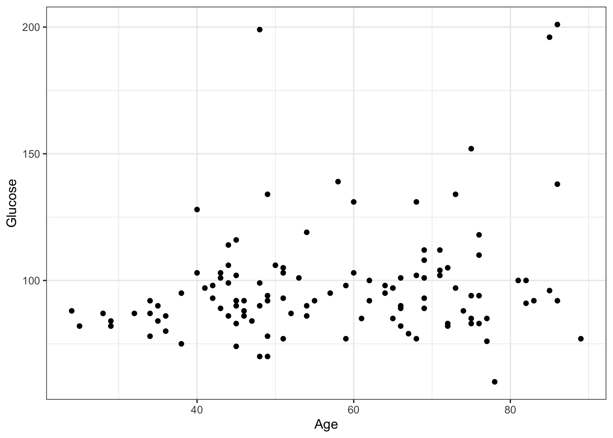
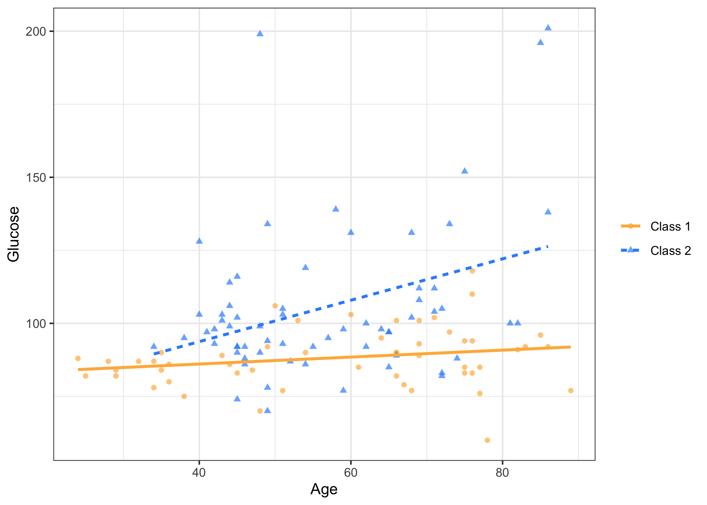
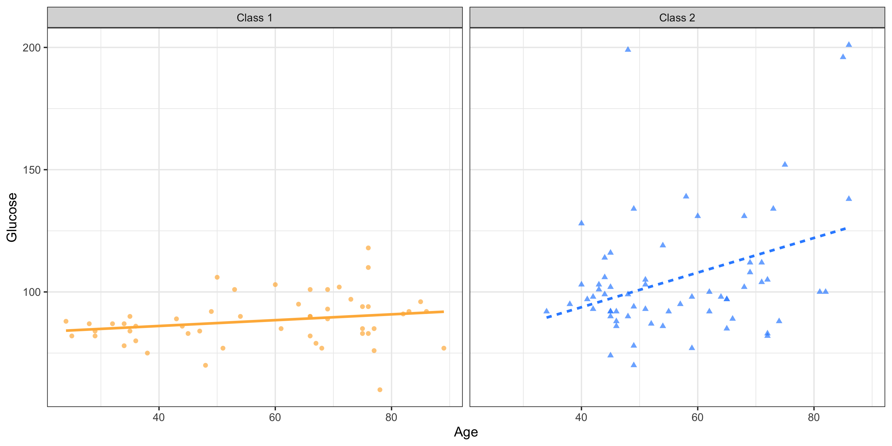

<!--

author:   Rose Hartman
email:    hartmanr1@chop.edu
version: 1.1.3
module_template_version: 2.0.0
language: en
narrator: UK English Female
title: Data Visualization in Open Source Software
comment:   Introduction to principles of data vizualization and typical data vizualization workflows using two common open source libraries: ggplot2 and seaborn.

long_description: This module introduces ggplot2 and seaborn, popular data visualization libraries in R and python, respectively. It lays the groundwork for using ggplot2 and seaborn by 1) highlighting common features of plots that can be manipulated in plot code, 2) discussing a typical data visualization workflow and best practices, and 3) discussing data preparation for plotting. This content will be most useful for people who have some experience creating data visualizations and/or reading plots presented in research articles or similar contexts. Some prior exposure to R and/or python is helpful but not required. This is appropriate for beginners.

estimated_time: 20 minutes

@learning_objectives

After completion of this module, learners will be able to:

* identify key elements in a plot that communicate information about the data
* describe the role ggplot2 and seaborn play in the R and python programming languages, respectively
* describe a typical data vizualization workflow
* list some best practices for creating accessible vizualizations

@end

link:  https://chop-dbhi-arcus-education-website-assets.s3.amazonaws.com/css/styles.css
script:  https://kit.fontawesome.com/83b2343bd4.js

-->
# Data Visualization in Open Source Software

<div class = "overview">
## Overview

@comment

**Is this module right for me?**

@long_description

**Estimated time to completion:** @estimated_time

**Pre-requisites**

This module assumes some familiarity with data and statistics, in particular

* familiarity with some different kinds of plots, although deep understanding is not needed --- people who are used to seeing plots presented in research articles will be sufficiently prepared
* the distinction between [continuous and categorical variables](https://education.arcus.chop.edu/variable-types/)

This module also assumes some basic familiarity with either R or python, but is appropriate for beginners.

**Learning Objectives**

@learning_objectives

</div>

## Introduction to visualizing data

The value of a good visualization is that it can show **a lot of information** at once, much more than you get from descriptive statistics or model parameter estimates, but in a way that is **simple to interpret**. A good visual will be clean, informative, and easy to read.

To display information visually, you can use a few different tools, each of which corresponds to an element of the plot.

## Plot elements

The most basic plot element used to communicate information about your data is **position on a dimension**.

Most plots make use of two dimensions, the x-axis and the y-axis, and you can communicate data values by where you depict data markers physically on the plot. For example, each of the dots in a scatterplot tell you what that data point's values are (at least roughly) for the variables plotted on the two axes. A typical barplot gives group membership along one axis (usually x) and shows counts along the other. In geographical data, the axes themselves are generally not shown in preference for displaying a map, but the implied axes are latitude and longitude.



Analysts frequently find themselves in situations where they want to depict more than two dimensions at a time. While it is possible to create 3D plots and animated plots, there are often simpler ways to express additional dimensions --- and simpler is nearly always better when it comes to visualizations!

You can use **color** to communicate either continuous (e.g. darker = higher value) or categorical values (e.g. red = "no" and blue = "yes"). **Shape** (e.g. circle, triangle, cross) or **line type** (e.g. solid or dashed) can also indicate category membership and have the advantage of not relying on end users' ability to distinguish color. **Size** is often used to indicate count or population values.



Another valuable tool is **faceting**. This is when similar plots (that share one or both axes) are lined up next to each other to facilitate comparison. For example, when you want to show the relationship between two variables, X and Y, for several different subsets of the data, you can generate a scatter plot of X and Y for each subset of the data as its own facet. If you have more than two or three groups, faceting generally produces clearer plots than using color or shape to distinguish groups.



Most of these plot elements can be applied across a wide range of kinds of visualizations. Knowing how to identify these key plot elements will help you select effective visualizations for your own data.

Before we dive into how plotting works in practice, though, we'll explore some popular open source tools for data visualization.

## Plotting libraries in R and python

There are many options available for creating data visualizations in R and python. For this module, we'll focus on just one plotting library in each: `ggplot2` in R, and `seaborn` in python.

<div class="important">

Note: This module provides an overview of the tools only, to orient learners to the options available.
Practical exercises and example code for `ggplot2` and `seaborn` are provided in subsequent modules (see [Additional Resources](#additional-resources)).

</div>

### `ggplot2` in R

R comes with plenty of plotting functions ready to go in base R (the set of functions you can use without needing to install any additional packages), and for quick-and-dirty visualizations, that is usually the fastest option.
However, the [popular library `ggplot2`](https://ggplot2.tidyverse.org/) provides much more flexibility and control over your visualizations, and if you're creating visualizations to share (e.g. in a manuscript or presentation), you'll probably find you need to switch to `ggplot2` at some point anyway to get more control over the appearance of your visualizations.

To get started with `ggplot2` in R on your own machine, you'll need to install it, and then load the library in R:

```r
# You only need to install it once
install.packages("ggplot2")

# You'll need to load the library again for each R session
library("ggplot2")
```

The `ggplot2` package is part of the [tidyverse](https://www.tidyverse.org/) of R packages, and is designed to work well with other tidyverse libraries like dplyr and tidyr, all of which work together to streamline common data science workflows in R. It's also fine to use `ggplot2` on its own, though.

For an excellent quick reference, see the [`ggplot2` cheatsheet](https://ggplot2.tidyverse.org/#cheatsheet). It includes a tremendous amount of information in a very compact format, so it's not great for people just getting started with `ggplot2`, but it's a valuable reference to keep on hand for when you start making plots for your own analyses.

### `seaborn` in python

In python, there's a similar situation: The [`seaborn` library](https://seaborn.pydata.org/) is a plotting library that works on top of the more basic and powerful library [matplotlib](https://matplotlib.org/), making it easier to use for common data science applications.

To use `seaborn` in python on your own machine, you'll need to [install `seaborn`](https://seaborn.pydata.org/installing.html) first. You can use either PyPi (`pip install seaborn`) or Anaconda (`conda install seaborn`) to install it, whichever you use for your other python modules.

When you're ready to use `seaborn` in python, by convention, `seaborn` should be imported with the abbreviation sns (this isn't necessary for `seaborn` to work, but you'll see a lot of help documentation online using the sns abbreviation, so it's a good idea to get in the habit of doing that yourself, too, so that your code is similar to online examples):

```python
import seaborn as sns
```

The `seaborn` functions are designed to work well with [pandas](https://pandas.pydata.org/) data structures, which are organized a little differently (and generally much better for data science purposes!) from the default data structures in python. If you're not using pandas dataframes, though, [you can still use `seaborn`](https://seaborn.pydata.org/tutorial/data_structure.html).

Because `seaborn` is built on top of matplotlib, it doesn't automatically show plots you create, it waits until you ask to see them. If you want to see the plots you're making, you need to either use the command `matplotlib.pyplot.show()` after each plot or, if you're using an interactive jupyter notebook you can put it in [matplotlib mode](https://ipython.readthedocs.io/en/stable/interactive/plotting.html).

## How plotting works in practice

Often, the best way to get the visualization you want is by finding an existing example that's similar to what you want and then copying that code and modifying it as needed.

<div class = "care">
Don't expect to become fully "fluent" in either `ggplot2` or `seaborn`! They are complex and powerful systems, with lots and lots of detail. Even experienced programmers frequently rely on google to get their plotting code just right.
</div>

### Selecting the right plot for your data

There are many kinds of plots available, and in most cases more than one kind of plot would be a reasonable choice for your data.

When selecting a plot type, consider

- the type(s) of variables you wish to plot (especially whether they are continuous or categorical)
- what idea or story you want your plot to communicate

When you're just getting started with data visualization, it's a good idea to spend as much time as you can examining plots you think work well --- What is it that makes them effective and attractive? How do they communicate information? What can you tell about the underlying data from examining the plot?

Google's Material Design provides a [good overview of most kinds of plots and their typical uses](https://material.io/design/communication/data-visualization.html#selecting-charts). Browsing through that collection and others can help give you ideas of plots to try.

### Data visualization workflow

Here is a good workflow for creating a new data visualization using `ggplot2` or `seaborn`:

1. Spend time carefully thinking through the plot you want to create, as covered in [the previous section](#selecting-the-right-plot-for-your-data). For many people, this means drawing a sketch (a great excuse to keep colored pencils at your desk!). Include as many details as you can, like labels, facets, and scales.
2. Search (online or through the help documentation) for the basic commands to make the kind of plot you're thinking of (scatterplot, line plot, box plot, etc.). If you're an experienced user, this may be a step you can do without google, at least for plots you make frequently.
3. Using what you found in step 2, write out code to generate a basic version of your plot (note that this might also require code to transform the data before plotting, depending on your data structure). Don't worry about plot appearance at this stage, the goal is just to get the basic structure down. You'll likely try a few different versions, tweaking the code and re-running it, before you get what you want.
4. Once you have the structure of the plot in place, turn your attention to appearance (labels, colors, themes, axes, etc.). You'll likely need to return to your search engine to get these details right.
5. Admire your beautiful visualization! And be grateful all the work you just did is saved in your code, so it will be easy for others (including Future You) to recreate your plot and make other similar ones.

**Galleries of example plots**

For both step 2 and 4 in the data visualization workflow, browsing galleries of example plots will save you tons of time.

There are many examples of `seaborn` visualizations with code online, including the large [example gallery on the `seaborn` website](https://seaborn.pydata.org/examples/index.html). Likewise, there are lots of great [example ggpolot2 plots with code](https://www.r-graph-gallery.com/ggplot2-package.html).

<div class = "warning">
When you look for example plotting code, pay careful attention to the format of the data being used. You may need to perform some transformations on your data before you can use the example code.

In most cases, it is easier to plot with data that is in [long form](https://argoshare.is.ed.ac.uk/healthyr_book/reshaping-data-long-vs-wide-format.html), where each variable is represented in only one column. If you have repeated measures (e.g. several encounters for each patient), that means each subject may have several rows, one for each observation. This is different from how humans typically prefer to read data, so if you're used to examining your data in a speadsheet-like view, you probably don't keep it in long format --- you would need to first transform your data frame to long format (often called "pivoting") before using it in a plotting function.
</div>

## Accessible design for data visualizations

Some data visualizations are just for your own eyes (for example, during data exploration), but if you're creating visualizations to communicate with an audience, then it's important to keep in mind that your audience will likely include people with a range of abilities and preferences for visual communication.

There are some basic best practice guidelines you can use to make your visualizations more accessible, especially for people with limited ability to distinguish color or folks working with a screen or printer that doesn't render color well, for example:

- Avoid using color as the sole indicator for important information. Instead, double color up with a second indicator like shape or line type.
- Keep visualizations clean and simple, avoiding unnecessary visual clutter. In other words, keep the [data-to-ink ratio](https://infovis-wiki.net/wiki/Data-Ink_Ratio) high.

<div class="learn-more">

**What about colorblind-friendly palettes?**

There are several excellent color palettes available that are designed to be more visually distinct for people with various types of colorblindness.
One popular example is the [viridis](https://cran.r-project.org/web/packages/viridis/vignettes/intro-to-viridis.html#the-color-scales) palette.
(For a fascinating look into the development process behind colorblind-friendly palettes like viridis, check out the [presentation where the developers introduce that scale and discuss the theory behind it](https://www.youtube.com/watch?v=xAoljeRJ3lU).)

One important thing to keep in mind, though, is that there are many different varieties of colorblindness, so a palette that works for one person with colorblindness may not work for another --- and no palette will work for people without visual access at all.
So colorblind-friendly palettes are a good idea, but don't stop there.

</div>

Even those precautions won't help you reach people with severely limited or nonexistent visual access, though.

In general, a [good principle for inclusive design](https://idrc.ocadu.ca/about/philosophy/) is providing **options** for your users so they can select for themselves the best way for them to interact with your content. Thinking about data visualizations, relevant additional options for accessing the information in your visualization may include the following:

- Informative figure captions, alt text (for online visuals), or note text explaining the visualization
- A "headline" title for your visualization that articulates the take-home message
- A data table presenting the data shown in the chart (note that this may be in an appendix or similar)
- A summary in your text of the important information in the visualization

For more guidance on accessible design of data visualizations, see this presentation by [Kent Eisenhuth](http://kenteisenhuth.com/), a user experience designer at Google. It's set to start at his discussion of how to provide a really valuable summary of a data visualization, but if you're interested you may like to scroll back and watch it from the beginning.

<iframe width="560" height="315" src="https://www.youtube-nocookie.com/embed/4zV9XqK0foM?start=2940" title="YouTube video player" frameborder="0" allow="accelerometer; autoplay; clipboard-write; encrypted-media; gyroscope; picture-in-picture" allowfullscreen></iframe>


## Quiz

Which of the following statements best describes the `seaborn` and `ggplot2` libraries?

[(X)] They are designed to integrate well with other popular data science libraries
[( )] They have basic plotting functions that are quick to use but offer little control
[( )] They come standard in base python or R, respectively, so you don't have to install them before use
****
<div class = "answer">

Both `seaborn` and `ggplot2` are powerful libraries designed for use in data science. Because they offer so much flexibility, they can be difficult to learn initially, but if you'll be producing data visualizations for use in publications and presentations you'll be glad you put in the time to learn to use them.

Neither `ggplot2` nor `seaborn` are included when you install R or python, so you'll need to install them before the first time you use them. You should also periodically check for updates and install the newest versions of these and other packages you rely on.

</div>
****

True or False: It's generally NOT necessary to reformat data before plotting.

[( )] TRUE
[(X)] FALSE
****
<div class = "answer">

Although some data reformatting can be completed as part of the plotting code, in many cases it will be necessary (or at least a lot easier!) to do any data manipulation before plotting.

</div>
****

List as many plot elements as you can that can be used as tools to communicate data values.

[[color, position on axis/dimension, shape, line type, size, facet]]
[[?]] Hint: Go back to [Plot elements](#plot-elements) and pay special attention to the **bold** terms.
<script>
  let input = "@input".trim();
  /color|dimension|shape|line type|size|facet/i.test(input);
</script>
****
<div class = "answer">

Correct answers include color, position on axis/dimension, shape, line type, size, and facet. If you got at least a couple items from the above list, give yourself a pat on the back!

</div>
****

For someone who has spent a lot of time getting good at `ggplot2` or `seaborn`, which of the following would likely be part of their typical workflow when building a new data visualization? Select all that apply.

[[X]] Spending time thinking about (and maybe drawing) the plot they want before they start coding
[[X]] Searching for example code for similar plots online
[[X]] Going through several different versions of their code before they get a plot that they want to keep
****
<div class = "answer">

All of these are typical for experienced programmers!

Sometimes it can feel discouraging when, as a beginner, you feel like everything you code takes several false starts before you make any real progress. The truth is that writing code is full of false starts, even for the most expert programmers. Everyone, including experts, reuses code from example plots and previous visualizations (that's why [galleries of example plots](#data-visualization-workflow) are so popular!). You shouldn't expect to be able to write `ggplot2` or `seaborn` code from a blank slate. As with so many programming skills, the main difference between a `ggplot2`/`seaborn` expert and a novice is that the expert knows exactly what to google!

And although planning a plot carefully before you start is a good idea and will save you time, don't expect that it will save you from having to re-work it. Creating a good visualization is almost always an iterative process --- that's one reason it's such an advantage to do your plotting in a scripted language like R or python! If you want to make a small change to a plot, you don't have to start from scratch, you can just tweak the code and re-run it.

If you want to see what real life data visualization coding done by a true expert looks like, check out [David Robinson's Tidy Tuesday videos](https://www.youtube.com/playlist?list=PL19ev-r1GBwkuyiwnxoHTRC8TTqP8OEi8). He livestreams himself analyzing a new dataset each week. He is an extremely experienced R user, and an expert at `ggplot2`. You'll notice that he can do a tremendous amount from memory (he's been using R every day professionally for years), but you'll also see that he makes lots of mistakes and often goes back to revise or tweak his code.

</div>
****

Which of the following are good strategies to extend the accessibility of your data visualizations? Select all that apply.

 [[X]] Avoid using color as the sole means of distinguishing important information
 [[X]] Provide informative alt text (for online visuals) or captions
 [[X]] Avoid cluttered, complex visuals
 [[X]] Present the information from the plot in alternate forms (a data table in an appendix, narrative description in the text, etc.)
 ****
<div class = "answer">

All of these are good strategies!

In general, review your work asking yourself "If the reader didn't have visual access, would this still communicate everything I intend it to?" It may not always be possible to make your work maximally accessible, but there's often a lot you can do to improve it.

**Note**: We've discussed visual accessibility exclusively here because that is a common stumbling block for data visualizations, but access is much more than vision. For broader guidance on creating accessible content, see the [Web Content Accessibility Guidelines](https://www.w3.org/WAI/WCAG21/quickref/) and [The Inclusive Learning Design Handbook](https://handbook.floeproject.org/about/).

 </div>
 ****


## Additional Resources

If you are brand new to R or python (or want a refresher), check out [Intro to R](https://liascript.io/course/?https://raw.githubusercontent.com/arcus/education_modules/main/r_basics_introduction/r_basics_introduction.md) or [Intro to python](https://liascript.github.io/course/?https://raw.githubusercontent.com/arcus/education_modules/main/demystifying_python/demystifying_python.md) to learn more about how to use each programming language. Before you can create visualizations of your own data, you'll need to be able to read data into R or python, and check and manipulate data frames.

For more detail on `ggplot2`, see [Data Visualization in ggplot2](https://liascript.github.io/course/?https://raw.githubusercontent.com/arcus/education_modules/main/data_visualization_in_ggplot2/data_visualization_in_ggplot2.md).
Another valuable resource is [the `ggplot2` website](https://ggplot2.tidyverse.org/), especially the [resources for learning `ggplot2`](https://ggplot2.tidyverse.org/#learning-ggplot2).

For more detail on `seaborn`, see [Data Visualization in seaborn](https://liascript.github.io/course/?https://raw.githubusercontent.com/arcus/education_modules/main/data_visualization_in_seaborn/data_visualization_in_seaborn.md).
Also check out [the `seaborn` website](https://seaborn.pydata.org/), especially the [excellent introduction to `seaborn` article](https://seaborn.pydata.org/introduction.html).

## Feedback

In the beginning, we stated some goals.

**Learning Objectives**

@learning_objectives

We ask you to fill out a brief (5 minutes or less) survey to let us know:

* If we achieved the learning objectives
* If the module difficulty was appropriate
* If we gave you the experience you expected

We gather this information in order to iteratively improve our work.  Thank you in advance for filling out [our brief survey](https://redcap.chop.edu/surveys/?s=KHTXCXJJ93&module_name=%22Data+visualization+in+open+source+software%22&version=1.1.3)!
