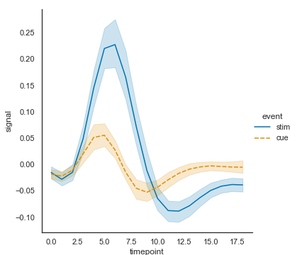

<!--

author:   Rose Hartman
email:    hartmanr1@chop.edu
version:  1.0.1
module_template_version: 2.0.0
language: en
narrator: UK English Female
title: Data Visualization in seaborn

comment:  This module includes code and explanations for several popular data visualizations using python's seaborn library. It also includes examples of how to modify seaborn plots to customize them for different uses.  

long_description: You can use the seaborn module in python to make many different kinds of data visualizations (also called plots or charts), including scatterplots, histograms, line plots, and trend lines. This module provides an example of each of these kinds of plots, including python code to make them using the seaborn module. It may be hard to follow if you are brand new to python, but it is appropriate for beginners with at least a small amount of python experience.

estimated_time: 1 hour

@learning_objectives  

After completion of this module, learners will be able to:

- use seaborn to create several common data visualizations
- customize some elements of a plot, and know where to look to learn how to customize others

@end

link:  https://chop-dbhi-arcus-education-website-assets.s3.amazonaws.com/css/styles.css
script: https://kit.fontawesome.com/83b2343bd4.js

script: https://sagecell.sagemath.org/static/embedded_sagecell.js

@sage
<script input="hidden">
// Make *any* div with class 'python' a Sage cell
sagecell.makeSagecell({inputLocation: 'div.python',
                       evalButtonText: 'Run python',
                       languages: ["python"],
                       hide: ['fullScreen', 'permalink'],
                       });
// Make *any* div with class 'python_run' a Sage cell
sagecell.makeSagecell({inputLocation: 'div.python_run',
                      evalButtonText: 'Run python',
                      languages: ["python"],
                      hide: ['fullScreen', 'permalink'],
                      autoeval: 'true'
                      });                                    
</script>
@end
-->

# Data Visualization in seaborn

<div class = "overview">

## Overview
@comment

**Is this module right for me?** @long_description

**Estimated time to completion:** @estimated_time

**Pre-requisites**

This module assumes some familiarity with statistical concepts like distributions, outliers, and linear regression, but even if you don't understand those concepts well you should be able to learn and apply the data visualization content.
When statistical concepts are referenced in the lesson, links to learn more are generally provided.

This module also assumes some basic familiarity with python, including

* installing and importing python modules
* reading in data
* manipulating data frames, including calculating new columns

If you are brand new to python (or want a refresher) consider starting with [Intro to python](https://liascript.github.io/course/?https://raw.githubusercontent.com/arcus/education_modules/main/intro_to_python/intro_to_python.md#1) first.

**Learning Objectives**

@learning_objectives

</div>

## Lesson Preparation
@sage

You will have opportunities for hands-on coding as you work your way through this module using interactive python cells.
The interactive python cells are powered by [SageMathCell](https://sagecell.sagemath.org/).
For the most part, these will appear with some code already in them, and you can run that code by clicking the **Run python** button.
You can also edit the code in these cells and run your own code.


**Give it a try:**
<div class="python">
<lia-keep>
<script type="text/x-sage">
m = 3
print(m+2)
</script>
</lia-keep>
</div>


You can change anything you want in the cell.
You can always refresh the page to return the code (and the stored memory of the cell) to its initial state.

Code will not persist from one cell to the next, so we'll end up repeating a lot of commands from one cell to the next.

<div class = "important">
These cells will compute everything you ask them to, but will only output what you explicitly request using the `print()` command.
</div>


### Importing seaborn
@sage

To use the seaborn library to make visualizations, you need to import it.

By convention, you import it with the shorthand `sns`.
This is optional, but we recommend you do that because when you look at seaborn code online, you'll nearly always see it with that same abbreviation.
Following that convention will make your code more comparable to examples you see online.

<div class="python">
<lia-keep>
<script type="text/x-sage">
import seaborn as sns
</script>
</lia-keep>
</div>


### The data
@sage

First, we need to load the python modules we'll be using:

<div class="python">
<lia-keep>
<script type="text/x-sage">
import pandas as pd
import numpy as np
import matplotlib.pyplot as plt
import seaborn as sns
</script>
</lia-keep>
</div>


<div class = "learnmore">
The [`pandas` module](https://pandas.pydata.org/docs/getting_started/index.html)) is for working with data in python. It is conventional to import `pandas` as `pd`.

The [`numpy` module](https://numpy.org/) has several useful functions for statistical calculations and other mathematical operations useful in scientific computing. It is conventional to import `numpy` as `np`.

The `seaborn` module is the plotting module that is the focus of this lesson, and it requires some pieces of `matplotlib`, since it is built as an extension to it.
</div>

And then read in the data set (note that we have to repeat our commands to load the libraries here, since this is a new cell):

<div class="python">
<lia-keep>
<script type="text/x-sage">
import pandas as pd
import numpy as np
import matplotlib.pyplot as plt
import seaborn as sns

covid_data = pd.read_csv("https://raw.githubusercontent.com/kendavidn/yaounde_serocovpop_shared/v1.0.0/data/yaounde_covid_seroprev_dataset.csv")
print(covid_data.shape) # gives the number of rows and columns
</script>
</lia-keep>
</div>

These data are from a COVID-19 serological survey conducted in Yaounde, Cameroon (Nwosu, K., Fokam, J., Wanda, F. et al., 2021[^1](Kene David Nwosu, Joseph Fokam, Franck Wanda, Lucien Mama, Erol Orel, Nicolas Ray, Jeanine Meke, Armel Tassegning, Desire Takou, Eric Mimbe, Beat Stoll, Josselin Guillebert, Eric Comte, Olivia Keiser, & Laura Ciaffi. 2021. kendavidn/yaounde\_serocovpop\_shared: Initial release v1.0.0. Zenodo. https://doi.org/10.5281/zenodo.5218965)). The authors have made all of the code and data publicly available under a [creative commons 4.0 license](https://creativecommons.org/licenses/by/4.0/legalcode) to facilitate re-use.


<div class="learnmore">
To learn more about the study, see the [zenodo page for this dataset](https://zenodo.org/record/5218965#.YeBq2RPMITW). You can also read the published article online: [SARS-CoV-2 antibody seroprevalence and associated risk factors in an urban district in Cameroon](https://www.nature.com/articles/s41467-021-25946-0).
</div>

<div class="important">
The code from this section will be at the top of each code block in this module.

If you want to practice this code on your own computer, make sure to include the code to import the necessary modules and read in the data as the first lines, but you'll only have to do it once at the top of your script, not before each new command.
</div>

## Scatterplots

Scatterplots show the relationship between two continuous variables, one on the x-axis and one on the y-axis. Because they show each individual data point as a marker, they also provide a handy way to check visually for outliers.

For more background on scatterplots, watch [this Kahn Academy series](https://www.khanacademy.org/math/cc-eighth-grade-math/cc-8th-data/cc-8th-scatter-plots/v/constructing-scatter-plot).


### Basic scatterplot
@sage

The seaborn library includes a powerful function called `relplot`, short for "relationships plot" because it's designed to highlight relationships among variables in the data.

If you provide `relplot` with two continuous variables, it will default to making a scatterplot. Here we'll plot age and height.

<div class="python">
<lia-keep>
<script type="text/x-sage">
import pandas as pd
import numpy as np
import matplotlib.pyplot as plt
import seaborn as sns
covid_data = pd.read_csv("https://raw.githubusercontent.com/kendavidn/yaounde_serocovpop_shared/v1.0.0/data/yaounde_covid_seroprev_dataset.csv")

sns.relplot(data = covid_data,
            x="val_age", y="val_height_cm")
plt.show()
</script>
</lia-keep>
</div>

Note that in the above code, the `sns.relplot()` command is the one that actually creates the plot, but by default python won't show you the plot unless you ask to print it.
The `plt.show()` command (imported from the `matplotlib` module) tells it to print out the plot it just made.

If the code ran correctly, you should have generated a scatterplot like the one below:


<div class = "options">
You can also create scatterplots with a similar function: `regplot` (short for "regression plot"), which we'll take a closer look at in the [trend lines section](#trend-lines).
</div>

### Using color for continuous variables
@sage

Let's try adding information about a third variable, weight, by using color.

<div class="python">
<lia-keep>
<script type="text/x-sage">
import pandas as pd
import numpy as np
import matplotlib.pyplot as plt
import seaborn as sns
covid_data = pd.read_csv("https://raw.githubusercontent.com/kendavidn/yaounde_serocovpop_shared/v1.0.0/data/yaounde_covid_seroprev_dataset.csv")

sns.relplot(data = covid_data,
            x="val_age", y="val_height_cm", hue="val_weight_kg")
plt.show()
</script>
</lia-keep>
</div>

<details>
<summary>Click to see the plot with alt text available</summary>


</details>

<br>

Note that adding hue to the command automatically adds a legend to your plot as well.

### Using color to show groups
@sage

Now let's look at using color for a categorical variable (`is_smoker`, with options `ex_fumeur`, `fumeur`, and `non_fumeur`, referring to former smokers, current smokers, and non-smokers, respectively).

The values entered for `is_smoker` in the data are actually much longer than we need them to be --- they include the text of the option after the shorthand for it (e.g. former smokers are indicated by `ex_fumeur__j_ai_fum__mais_ne_fume_plus`). We don't want that additional text in the plot, so we'll recode that variable now.

<div class="python">
<lia-keep>
<script type="text/x-sage">
import pandas as pd
import numpy as np
import matplotlib.pyplot as plt
import seaborn as sns
covid_data = pd.read_csv("https://raw.githubusercontent.com/kendavidn/yaounde_serocovpop_shared/v1.0.0/data/yaounde_covid_seroprev_dataset.csv")

# recode is_smoker to make the variable labels shorter
orig_codes = ["ex_fumeur__j_ai_fum__mais_ne_fume_plus", "fumeur__je_fume_actuellement", "non_fumeur__je_n_ai_jamais_fum"]
new_codes = ["ex-smoker", "smoker", "non-smoker"]

covid_data['is_smoker'] = covid_data['is_smoker'].replace(orig_codes, new_codes)
</script>
</lia-keep>
</div>


<div class = "learnmore">
For a refresher, see this tutorial on [recoding variables in a pandas dataframe](https://www.sfu.ca/~mjbrydon/tutorials/BAinPy/05_recode.html#replacing-values-from-a-list).
</div>

Then we can update our scatterplot to use `is_smoker` for color.

<div class="python">
<lia-keep>
<script type="text/x-sage">
import pandas as pd
import numpy as np
import matplotlib.pyplot as plt
import seaborn as sns
covid_data = pd.read_csv("https://raw.githubusercontent.com/kendavidn/yaounde_serocovpop_shared/v1.0.0/data/yaounde_covid_seroprev_dataset.csv")
# recode is_smoker to make the variable labels shorter
orig_codes = ["ex_fumeur__j_ai_fum__mais_ne_fume_plus", "fumeur__je_fume_actuellement", "non_fumeur__je_n_ai_jamais_fum"]
new_codes = ["ex-smoker", "smoker", "non-smoker"]
covid_data['is_smoker'] = covid_data['is_smoker'].replace(orig_codes, new_codes)

sns.relplot(data = covid_data,
            x="val_age", y="val_height_cm",
            hue="is_smoker")
plt.show()
</script>
</lia-keep>
</div>

<details>
<summary>Click to see the plot with alt text available</summary>


</details>

<div class = "important">
Tip: It's generally much easier to make any necessary changes to the dataframe, such as modifying variables, before sending it to the plotting command.
</div>

### Distinguish groups more clearly with color and shape
@sage

We'll improve this plot by using shape (controlled by the `style` argument) and color (controlled by `hue`) together to mark the smoking status groups.

<div class = "important">
Tip: Don't use color alone to convey important information in your plots because if your end users are unable to distinguish the colors, the plot loses its value. Instead, double-up color information with another element, such as marker shape, to make the different groups easier to distinguish.
</div>

<div class="python">
<lia-keep>
<script type="text/x-sage">
import pandas as pd
import numpy as np
import matplotlib.pyplot as plt
import seaborn as sns
covid_data = pd.read_csv("https://raw.githubusercontent.com/kendavidn/yaounde_serocovpop_shared/v1.0.0/data/yaounde_covid_seroprev_dataset.csv")
# recode is_smoker to make the variable labels shorter
orig_codes = ["ex_fumeur__j_ai_fum__mais_ne_fume_plus", "fumeur__je_fume_actuellement", "non_fumeur__je_n_ai_jamais_fum"]
new_codes = ["ex-smoker", "smoker", "non-smoker"]
covid_data['is_smoker'] = covid_data['is_smoker'].replace(orig_codes, new_codes)

sns.relplot(data = covid_data,
            x="val_age", y="val_height_cm",
            hue="is_smoker", style = "is_smoker")
plt.show()
</script>
</lia-keep>
</div>

<details>
<summary>Click to see the plot with alt text available</summary>


</details>

### Custom colors
@sage

The seaborn library includes many color palettes to choose from, or you can specify colors manually.

Here we'll try switching from the default color palette to a version that is easier to distinguish for people with some types of colorblindness (although remember that even when using a palette that is supposedly colorblind friendly, you should still avoid using color on its own to display important information).

<div class="python">
<lia-keep>
<script type="text/x-sage">
import pandas as pd
import numpy as np
import matplotlib.pyplot as plt
import seaborn as sns
covid_data = pd.read_csv("https://raw.githubusercontent.com/kendavidn/yaounde_serocovpop_shared/v1.0.0/data/yaounde_covid_seroprev_dataset.csv")
# recode is_smoker to make the variable labels shorter
orig_codes = ["ex_fumeur__j_ai_fum__mais_ne_fume_plus", "fumeur__je_fume_actuellement", "non_fumeur__je_n_ai_jamais_fum"]
new_codes = ["ex-smoker", "smoker", "non-smoker"]
covid_data['is_smoker'] = covid_data['is_smoker'].replace(orig_codes, new_codes)

sns.relplot(data = covid_data,
            x="val_age", y="val_height_cm",
            hue="is_smoker", style = "is_smoker",
           palette = "colorblind")
plt.show()
</script>
</lia-keep>
</div>

<details>
<summary>Click to see the plot with alt text available</summary>


</details>

Rather than changing the palette for each individual plot, you may want to change the default color palette for all of the plots you're generating. To do that, use `set_theme` to change the default settings for seaborn plots.

For example, `sns.set_theme(palette="colorblind")` will set the colorblind palette as default.
We'll add that to the code that runs automatically at the top of each page.
Now all of our plots will use the `colorblind` palette, unless we specify otherwise.

<div class = "learnmore">
The seaborn library has many different built-in color palettes to choose from. To learn more about setting custom colors in seaborn visualizations, see the [seaborn tutorial on color palettes](https://seaborn.pydata.org/tutorial/color_palettes.html).
</div>

### Controlling figure aesthetics

The seaborn library handles the appearance of plots with two kinds of functions: style, and context.

- `style` refers to things like background color, gridlines, and axis ticks
- `context` refers to the visual scale of the plot, such as the size of the font used for axis labels

Seaborn controls style and context separately so that you can get a plot that has all the style elements you want, and then you can present that same plot scaled appropriately in different contexts --- for example, if you want to include it in a slide deck presentation, you probably want the fonts much larger and the lines heavier than you would if you wanted to include it as a figure in a paper. In this case, you would leave all of the style settings the same, but change context to "talk" to scale it for the slide deck and "paper" to scale it for use in the paper.

<div class = "learnmore">
We'll show a quick example of changing style and context here, but there are many more options available. To learn more about tweaking style and context, see the [seaborn tutorial on controlling figure aesthetics](https://seaborn.pydata.org/tutorial/aesthetics.html).
</div>

#### Setting plot style
@sage

There are 5 preset seaborn themes: darkgrid, whitegrid, dark, white, and ticks.

<div class="python">
<lia-keep>
<script type="text/x-sage">
import pandas as pd
import numpy as np
import matplotlib.pyplot as plt
import seaborn as sns
covid_data = pd.read_csv("https://raw.githubusercontent.com/kendavidn/yaounde_serocovpop_shared/v1.0.0/data/yaounde_covid_seroprev_dataset.csv")
# recode is_smoker to make the variable labels shorter
orig_codes = ["ex_fumeur__j_ai_fum__mais_ne_fume_plus", "fumeur__je_fume_actuellement", "non_fumeur__je_n_ai_jamais_fum"]
new_codes = ["ex-smoker", "smoker", "non-smoker"]
covid_data['is_smoker'] = covid_data['is_smoker'].replace(orig_codes, new_codes)
# color palette
sns.set_theme(palette="colorblind")

sns.set_style("white")

sns.relplot(data = covid_data,
            x="val_age", y="val_height_cm",
            hue="is_smoker", style = "is_smoker")
plt.show()
</script>
</lia-keep>
</div>

<details>
<summary>Click to see the plot with alt text available</summary>


</details>

<div class = "help">
Have you noticed we're using `style` to mean two completely different things in this code?

In `seaborn`, `style` can refer to either marker type (circle, cross, square, etc.) in a scatterplot, or it can refer to the overall plot style (background color, gridlines, etc.).
It's unfortunate that the same word gets used for both, but you can still tell them apart by how they're used in the code:

- overall aesthetic style of the plot is changed in a general `sns` command, not within a plotting command like `relplot` (e.g. `sns.set_style("white")`)
- marker style for scatterplots is changed within a plotting command like `relplot` (e.g. `style = "is_smoker"`)
</div>


#### Setting plot context
@sage

There are 4 different contexts available: notebook (default), paper, talk, and poster.

<div class="python">
<lia-keep>
<script type="text/x-sage">
import pandas as pd
import numpy as np
import matplotlib.pyplot as plt
import seaborn as sns
covid_data = pd.read_csv("https://raw.githubusercontent.com/kendavidn/yaounde_serocovpop_shared/v1.0.0/data/yaounde_covid_seroprev_dataset.csv")
# recode is_smoker to make the variable labels shorter
orig_codes = ["ex_fumeur__j_ai_fum__mais_ne_fume_plus", "fumeur__je_fume_actuellement", "non_fumeur__je_n_ai_jamais_fum"]
new_codes = ["ex-smoker", "smoker", "non-smoker"]
covid_data['is_smoker'] = covid_data['is_smoker'].replace(orig_codes, new_codes)
# color palette
sns.set_theme(palette="colorblind")
# style
sns.set_style("white")

sns.set_context("poster")

sns.relplot(data = covid_data,
            x="val_age", y="val_height_cm",
            hue="is_smoker", style = "is_smoker")
plt.show()
</script>
</lia-keep>
</div>

<details>
<summary>Click to see the plot with alt text available</summary>


</details>


To set the context back to `notebook` (the default), use `sns.set_context("notebook")`.

### Quiz: Scatterplots

What is the command to create a scatterplot in `seaborn`?

[[sns.relplot()]]
<script>
  let input = "@input".trim();
  /relplot/.test(input) || /regplot/.test(input);
</script>
***
<div class = "answer">

By default, the `sns.relplot` command creates a scatterplot (although it can also be used to create [line plots](#line-plots)). You can also use `sns.regplot` to create scatterplots, as we'll see in the [trend lines section](#trend-lines).

Note the `sns` before the function name. That's because we imported the seaborn library with an alias, as is conventional. See [making plots in seaborn](#making-plots-in-seaborn).

</div>
***

True or False: The only two crucial arguments to supply (in addition to providing the data) for a scatterplot are x and y.

[(X)] TRUE
[( )] FALSE
***
<div class = "answer">

While x and y are the only two **crucial** arguments for you to supply the plotting function, you may want to include others, such as hue and style, to communicate information about additional variables in the data.

</div>
***

## Histograms

Histograms show the distribution of a continuous variable. The values of the variable are shown along the x-axis, and data are grouped into bins, with the height of each bin corresponding to the number of data points in that bin. In other words, it communicates where your data for a given variable fall within its range. It is a great way to quickly assess for symmetry vs skew, outliers, and less common issues like multimodality.

We'll continue using the same data we explored to make scatterplots.

### Basic histogram
@sage

Because histograms show just one variable, the only aesthetic they require is x. The y-axis of the plot will just show the counts of observations in each bin on the x-axis. (Note that it is possible to provide `sns.displot` with y instead of x, in which case it will generate a sideways histogram.)

<div class="python">
<lia-keep>
<script type="text/x-sage">
import pandas as pd
import numpy as np
import matplotlib.pyplot as plt
import seaborn as sns
covid_data = pd.read_csv("https://raw.githubusercontent.com/kendavidn/yaounde_serocovpop_shared/v1.0.0/data/yaounde_covid_seroprev_dataset.csv")
# recode is_smoker to make the variable labels shorter
orig_codes = ["ex_fumeur__j_ai_fum__mais_ne_fume_plus", "fumeur__je_fume_actuellement", "non_fumeur__je_n_ai_jamais_fum"]
new_codes = ["ex-smoker", "smoker", "non-smoker"]
covid_data['is_smoker'] = covid_data['is_smoker'].replace(orig_codes, new_codes)
# color palette and style
sns.set_theme(palette="colorblind")
sns.set_style("white")

sns.displot(covid_data, x="val_age")
plt.show()
</script>
</lia-keep>
</div>

<details>
<summary>Click to see the plot with alt text available</summary>


</details>


### Change the number of bins
@sage

The appearance of a histogram can change a lot depending on the number of bins you use along the x-axis. It's a good idea to try a few different sets of bins to see what works well for communicating this distribution.

<div class="python">
<lia-keep>
<script type="text/x-sage">
import pandas as pd
import numpy as np
import matplotlib.pyplot as plt
import seaborn as sns
covid_data = pd.read_csv("https://raw.githubusercontent.com/kendavidn/yaounde_serocovpop_shared/v1.0.0/data/yaounde_covid_seroprev_dataset.csv")
# recode is_smoker to make the variable labels shorter
orig_codes = ["ex_fumeur__j_ai_fum__mais_ne_fume_plus", "fumeur__je_fume_actuellement", "non_fumeur__je_n_ai_jamais_fum"]
new_codes = ["ex-smoker", "smoker", "non-smoker"]
covid_data['is_smoker'] = covid_data['is_smoker'].replace(orig_codes, new_codes)
# color palette and style
sns.set_theme(palette="colorblind")
sns.set_style("white")

sns.displot(covid_data, x="val_age", binwidth=1)
plt.show()
</script>
</lia-keep>
</div>

<details>
<summary>Click to see the plot with alt text available</summary>


</details>


<div class="python">
<lia-keep>
<script type="text/x-sage">
import pandas as pd
import numpy as np
import matplotlib.pyplot as plt
import seaborn as sns
covid_data = pd.read_csv("https://raw.githubusercontent.com/kendavidn/yaounde_serocovpop_shared/v1.0.0/data/yaounde_covid_seroprev_dataset.csv")
# recode is_smoker to make the variable labels shorter
orig_codes = ["ex_fumeur__j_ai_fum__mais_ne_fume_plus", "fumeur__je_fume_actuellement", "non_fumeur__je_n_ai_jamais_fum"]
new_codes = ["ex-smoker", "smoker", "non-smoker"]
covid_data['is_smoker'] = covid_data['is_smoker'].replace(orig_codes, new_codes)
# color palette and style
sns.set_theme(palette="colorblind")
sns.set_style("white")

sns.displot(covid_data, x="val_age", binwidth=10)
plt.show()
</script>
</lia-keep>
</div>

<details>
<summary>Click to see the plot with alt text available</summary>


</details>

In the examples above, the take-away message from the histogram changes a fair amount depending on the binwidth used.

In the first histogram, using the default binwidths, there apppears to be a drop in late teens --- the counts of patients roughly 5-15 and 20-30 is similar, but there are about half as many in the bin in between.

With binwidths of just 1 year, every dip and spike is visible, so it no longer appears that the counts of children under 15 is uniform.
There are a number of spikes and dips there, as there are through most of the rest of the age range.
The dip in the late teens is most extreme at about 18 or 19, so the drop in counts from middle childhood to late teens appears more gradual.

In the final histogram, where each bin covers an entire decade, much of the nuance available in the earlier plots is not visible.
Instead, the more general overall trend is more apparent: There are higher counts of younger people (children, folks in their 20's and folks in their 30's), then a steady dropoff for each of the older decades.  

The best binwidth to choose depends on what you want your histogram to convey.

### Using color to show groups
@sage

As with scatterplots, we can add information about an additional variable by using color. Let's put in the variable `is_smoker` for hue so we can see how the distribution of ages differs by smoking status.

Note that seaborn is continuing to use the color palette we set when we were making scatterplots (see [custom colors](#custom-colors)). If you want to change the color palette, you can do so at any time.

<div class="python">
<lia-keep>
<script type="text/x-sage">
import pandas as pd
import numpy as np
import matplotlib.pyplot as plt
import seaborn as sns
covid_data = pd.read_csv("https://raw.githubusercontent.com/kendavidn/yaounde_serocovpop_shared/v1.0.0/data/yaounde_covid_seroprev_dataset.csv")
# recode is_smoker to make the variable labels shorter
orig_codes = ["ex_fumeur__j_ai_fum__mais_ne_fume_plus", "fumeur__je_fume_actuellement", "non_fumeur__je_n_ai_jamais_fum"]
new_codes = ["ex-smoker", "smoker", "non-smoker"]
covid_data['is_smoker'] = covid_data['is_smoker'].replace(orig_codes, new_codes)
# color palette and style
sns.set_theme(palette="colorblind")
sns.set_style("white")

sns.displot(covid_data, x="val_age", hue="is_smoker")
plt.show()
</script>
</lia-keep>
</div>

<details>
<summary>Click to see the plot with alt text available</summary>


</details>

You may be noticing that the distribution of non-smokers, which makes up the majority of the data, appears to be covering the other smaller groups. By default, `seaborn` plots each group as if they were each their own histogram, making each slightly translucent so you can see where distributions overlap. The height of each colored bar shows the count for that bin within that group.

That's often the most useful way to plot multiple histograms, but in this case, it makes it hard to see the smoker and ex-smoker distributions clearly because they are completely covered by the non-smoker distribution.

You can control how `seaborn` plots the distributions with the `multiple` argument. To show stacked groups instead, use `multiple = "stack"`. This will put the three distributions one on top of the other, so the height of all three colors together in each bin corresponds to the total count across groups; the silhouette of this histogram will be identical to the original histogram without coloring by group.

<div class="python">
<lia-keep>
<script type="text/x-sage">
import pandas as pd
import numpy as np
import matplotlib.pyplot as plt
import seaborn as sns
covid_data = pd.read_csv("https://raw.githubusercontent.com/kendavidn/yaounde_serocovpop_shared/v1.0.0/data/yaounde_covid_seroprev_dataset.csv")
# recode is_smoker to make the variable labels shorter
orig_codes = ["ex_fumeur__j_ai_fum__mais_ne_fume_plus", "fumeur__je_fume_actuellement", "non_fumeur__je_n_ai_jamais_fum"]
new_codes = ["ex-smoker", "smoker", "non-smoker"]
covid_data['is_smoker'] = covid_data['is_smoker'].replace(orig_codes, new_codes)
# color palette and style
sns.set_theme(palette="colorblind")
sns.set_style("white")

sns.displot(covid_data, x="val_age", hue="is_smoker", multiple="stack")
plt.show()
</script>
</lia-keep>
</div>

<details>
<summary>Click to see the plot with alt text available</summary>


</details>

<div class = "options">
You can also use this same `displot` function to create [density plots](https://seaborn.pydata.org/tutorial/distributions.html#kernel-density-estimation) instead of histograms.
</div>

### Adding marginal histograms to other plots
@sage

Sometimes you may wish to show a distribution as context for another plot, such as a scatterplot. You can add marginal histograms to a bivariate plot with the `jointplot` function.

<div class="python">
<lia-keep>
<script type="text/x-sage">
import pandas as pd
import numpy as np
import matplotlib.pyplot as plt
import seaborn as sns
covid_data = pd.read_csv("https://raw.githubusercontent.com/kendavidn/yaounde_serocovpop_shared/v1.0.0/data/yaounde_covid_seroprev_dataset.csv")
# recode is_smoker to make the variable labels shorter
orig_codes = ["ex_fumeur__j_ai_fum__mais_ne_fume_plus", "fumeur__je_fume_actuellement", "non_fumeur__je_n_ai_jamais_fum"]
new_codes = ["ex-smoker", "smoker", "non-smoker"]
covid_data['is_smoker'] = covid_data['is_smoker'].replace(orig_codes, new_codes)
# color palette and style
sns.set_theme(palette="colorblind")
sns.set_style("white")

sns.jointplot(data=covid_data, x="val_age", y="val_height_cm")
plt.show()
</script>
</lia-keep>
</div>

<details>
<summary>Click to see the plot with alt text available</summary>


</details>

By default, it plots x and y as a scatterplot, adding a marginal histogram for each.

<div class = "learnmore">
Learn more about a variety of ways to add marginal distribution information to plots in the [seaborn distributions tutorial](https://seaborn.pydata.org/tutorial/distributions.html#distribution-visualization-in-other-settings).
</div>

### Quiz: Histograms

Which of the following aesthetics can be used to plot a histogram using `displot`?

[( )] x only
[(X)] either x or y
[( )] y only
[( )] both x and y
****
<div class = "answer">

Histograms can only make use of one dimension of data (x or y, but never both) because the other dimension will always be the count of observations in each bin. If you try to provide variables for both x and y, `seaborn` will plot a [bivariate distribution heatmap](https://seaborn.pydata.org/tutorial/distributions.html#visualizing-bivariate-distributions) instead of a histogram.

In all of our examples, we used the x argument for our histograms, but it is possible to provide y instead. As an experiment, try generating one of the plots above, but substitute y for x and see what happens!

</div>
****

True or False: To show multiple histograms for different subgroups on a single plot (e.g. age distributions for smokers, non-smokers, and ex-smokers), use the `jointplot` function.

[( )] True
[(X)] False
****
<div class = "answer">

The `jointplot` function is for showing a bivariate plot with supplemental univariate distributions in the margins (for a review, see [adding marginal histograms to other plots](#adding-marginal-histograms-to-other-plots)).

To show histograms for two or more subgroups in a single plot, use the `hue` argument to color each subgroup separately (for a review, see [using color to show groups](#using-color-to-show-groups)).

</div>
****

True or False: When making histograms, you should stick with the default binwidth in `seaborn` for most data sets.

[( )] True
[(X)] False
****
<div class = "answer">

Not necessarily! The `seaborn` defaults are sensible, so that's often a good starting place, but it can be dangerous to accept the default bins without examining other options.  Changing the binwidth on a histogram can dramatically change the patterns highlighted in the data, so it's always a good idea to try multiple binwidths when you're making a histogram.

You can read more about this issue in the [seaborn distributions tutorial](https://seaborn.pydata.org/tutorial/distributions.html#choosing-the-bin-size).

</div>
****

## Line Plots

Line plots are especially useful when you want to show data points that are connected in a meaningful way. The most common application is repeated measures over time (also called time series data), such as when patients are measured on a given variable (plotted on the y-axis) at several times (plotted along the x-axis). Each line would represent one patient or a summary across a group of patients.

<div class = "warning">
A word of caution: You may see line plots where the data points don't actually share a meaningful theoretical connection (e.g. all being from the same patient, or the same group). Although it's not uncommon, this is generally not considered good practice and you may receive pushback from reviewers or readers.
</div>

### Data for line plots

The data we've been using for the other examples so far doesn't lend itself well to line plots. Instead, for this example we'll use [one of the datasets included with the seaborn module](http://seaborn.pydata.org/generated/seaborn.load_dataset.html#seaborn.load_dataset), called `fmri`. It contains the hemodynamic response (`signal`) at several timepoints for a number of subjects in response to two different events (`stim` and `cue`) in two brain regions (`parietal` and `frontal`).

This dataset is a special example dataset for `seaborn`, so you don't need to download it separately. You can call it with the `load_dataset` function (although you will need an internet connection for that to work).

We'll modify the code that runs automatically at the top of each page to load the `fmri` dataset instead of the Covid-19 data we've been working with the command: `fmri = sns.load_dataset("fmri")`

### Basic line plot
@sage

<div class="python">
<lia-keep>
<script type="text/x-sage">
import pandas as pd
import numpy as np
import matplotlib.pyplot as plt
import seaborn as sns
fmri = sns.load_dataset("fmri")
sns.set_theme(palette="colorblind")
sns.set_style("white")

sns.relplot(x="timepoint", y="signal", kind="line", data=fmri)
plt.show()
</script>
</lia-keep>
</div>

<details>
<summary>Click to see the plot with alt text available</summary>


</details>

Note that by default `seaborn` aggregates across multiple observations at each time point, with a line at the mean and a 95% confidence interval shaded around it.

In this case, we have several different subjects, and from each we have readings from two brain regions and in response to two events, so there are many observations at each timepoint. If there were only a single observation for each timepoint (more typical of standard time series data), then `relplot` would show a line connecting those observations and no confidence interval.

### Using color and line type to show groups
@sage

If you want to show multiple lines on a single plot, you can achieve that by adding arguments for `hue` (controls color) and `style` (controls line type, like solid or dashed), as we did for scatterplots and histograms.

<div class="python">
<lia-keep>
<script type="text/x-sage">
import pandas as pd
import numpy as np
import matplotlib.pyplot as plt
import seaborn as sns
fmri = sns.load_dataset("fmri")
sns.set_theme(palette="colorblind")
sns.set_style("white")

sns.relplot(x="timepoint", y="signal", hue="event", style="event", kind="line", data=fmri)
plt.show()
</script>
</lia-keep>
</div>

<details>
<summary>Click to see the plot with alt text available</summary>



</details>

### Using facets to compare plots
@sage

If you want to make more than one version of a similar plot, consider using facets.
Facets let you split one complicated plot into a number of comparable mini plots, usually by separating the data out by levels of a categorical variable.

In the current example, let's say we wanted to create two versions of the signal line plots for the two types of events: one showing the response in the parietal region, and one showing the response in the frontal region.

You can add facets to a `seaborn` plot by adding an argument for either `col` (for columns) or `row` (for rows) --- or both, if you want to show several different facets.

<div class="python">
<lia-keep>
<script type="text/x-sage">
import pandas as pd
import numpy as np
import matplotlib.pyplot as plt
import seaborn as sns
fmri = sns.load_dataset("fmri")
sns.set_theme(palette="colorblind")
sns.set_style("white")

sns.relplot(x="timepoint", y="signal", hue="event", style="event", col = "region", kind="line", data=fmri)
plt.show()
</script>
</lia-keep>
</div>

<details>
<summary>Click to see the plot with alt text available</summary>


</details>

<div class = "learnmore">
For many more examples of line plots, see the [seaborn relplot tutorial section on line plots](https://seaborn.pydata.org/tutorial/relational.html#emphasizing-continuity-with-line-plots).
</div>

### Quiz: Line Plots

True or False: You can create both scatterplots and line plots with the same function in `seaborn`.

[(X)] TRUE
[( )] FALSE
****
<div class = "answer">

We used just one function, `relplot`, to make both scatterplots and line plots. Under the hood, there are actually two separate functions being used --- `scatterplot()` and `lineplot()`, which are equivalent to `relplot()` with `kind = "scatter"` (the default) and `kind = "line"`, respectively --- but it's nice to be able to stick to the higher-level `relplot` function for simplicity.

Because they're both called by the `relplot` function, you can use the same additional variables (e.g. `hue`, `style`, `col`) applied to either scatter or line plots, and they work in much the same way.

</div>
****

True or False: Line plots are appropriate in most situations in which a scatterplot would work, so you can general pick whichever one you prefer.

[( )] TRUE
[(X)] FALSE
****
<div class = "answer">

There are very few situations in which a scatterplot and line plot are equally appropriate.

Line plots emphasize continuity and because of that are rarely used except for with data that have some kind of time component. Scatterplots are much more flexible and can work to show the relationship between almost any two continuous variables.  

</div>
****

What argument do you add to include facets in a `seaborn` plot?

[[col, row]]
<script>
  let input = "@input".trim();
  /col|row/i.test(input);
</script>
****
<div class = "answer">

You can add facets to a plot by including the arguments for `col`, `row`, or both.

</div>
****

## Trend Lines

Trend lines look like line plots, but they are different in one key way: They show a **summary** of other data (usually a linear model), rather than plotting data directly.

Trend lines are used to show the overall trend in a scatterplot. Sometimes, the scatterplot points themselves are omitted and just the trend lines are shown to keep the visualization as clean as possible, but they're still implied.


<div class = "help">
Note that the content in this section references statistics concepts more than in the previous sections.
Polynomial regression and lowess regression in particular may be new to some learners.

If you're unfamiliar with the statistics referenced, you have two good options:

- You can gloss over the explanations and just focus on the code and the resulting data visualizations
- You can click through to the links provided within the section and/or follow up with material referenced in the [Additional Resources](#additional-resources) section at the end to learn more

Either way is fine! The best approach for you likely depends on your level of interest and how much time you have available to dig into extra content.
</div>

### Linear regression trend lines
@sage

Because trend lines are such a useful visual summary, `seaborn` provides several options to add trend lines to your plots quickly and easily.

<div class = "options">
There are two very similar functions available for drawing trend lines: `regplot` and `lmplot`. For many use cases, they are close to identical. For simplicity, we'll stick to `lmplot` in this lesson. Try subbing in `regplot` instead and make note of how the plots differ.

For more background on `regplot` vs. `lmplot`, see [the seaborn regression tutorial](https://seaborn.pydata.org/tutorial/regression.html#controlling-the-size-and-shape-of-the-plot).
</div>

<div class="python">
<lia-keep>
<script type="text/x-sage">
import pandas as pd
import numpy as np
import matplotlib.pyplot as plt
import seaborn as sns
covid_data = pd.read_csv("https://raw.githubusercontent.com/kendavidn/yaounde_serocovpop_shared/v1.0.0/data/yaounde_covid_seroprev_dataset.csv")
# recode is_smoker to make the variable labels shorter
orig_codes = ["ex_fumeur__j_ai_fum__mais_ne_fume_plus", "fumeur__je_fume_actuellement", "non_fumeur__je_n_ai_jamais_fum"]
new_codes = ["ex-smoker", "smoker", "non-smoker"]
covid_data['is_smoker'] = covid_data['is_smoker'].replace(orig_codes, new_codes)
# color palette and style
sns.set_theme(palette="colorblind")
sns.set_style("white")

sns.lmplot(data = covid_data,
            x="val_age", y="val_height_cm")
plt.show()
</script>
</lia-keep>
</div>

<details>
<summary>Click to see the plot with alt text available</summary>


</details>

A couple things about this plot are not ideal:

1. Overplotting. The density of the scatterplot makes it hard to see the trend line as it runs through the bulk of the data.
2. The linear trend doesn't appear to be a very good description of the relationship between age and height. It systematically over-estimates height at the very young ages, then under-estimates through early adulthood and over-estimates again late in life.

We can address the first issue by adjusting alpha for the scatterplot to make the markers more transparent. Alpha ranges between 0 (totally transparent) and 1 (totally opaque).

### Using alpha to fix overplotting
@sage

One reasonable guess for how to adjust `alpha` in our plot would be to add an `alpha` argument to the command, as we did previously for `hue` and `style`.
For example, you might try to set alpha to .1 by doing something like this:

<div class="python">
<lia-keep>
<script type="text/x-sage">
import pandas as pd
import numpy as np
import matplotlib.pyplot as plt
import seaborn as sns
covid_data = pd.read_csv("https://raw.githubusercontent.com/kendavidn/yaounde_serocovpop_shared/v1.0.0/data/yaounde_covid_seroprev_dataset.csv")
# recode is_smoker to make the variable labels shorter
orig_codes = ["ex_fumeur__j_ai_fum__mais_ne_fume_plus", "fumeur__je_fume_actuellement", "non_fumeur__je_n_ai_jamais_fum"]
new_codes = ["ex-smoker", "smoker", "non-smoker"]
covid_data['is_smoker'] = covid_data['is_smoker'].replace(orig_codes, new_codes)
# color palette and style
sns.set_theme(palette="colorblind")
sns.set_style("white")

# this won't work
sns.lmplot(data = covid_data,
            x="val_age", y="val_height_cm",
           alpha = .1)
plt.show()
</script>
</lia-keep>
</div>

If you try to run that code, you'll get an error.
The problem is that we're using a single function to draw both the scatterplot and the trend line, so `seaborn` wouldn't know if we meant `alpha` to refer to the scatterplot, the trend line, or both.

<div class = "options">
Note that even though adding `alpha = .1` to the `lmplot` command won't work, it does work in a plain scatterplot!

Try adding `alpha = .1` (or any value you like between 0 and 1) to some of the `relplot` commands from the scatterplot section and see what happens.
</div>

So how do we adjust alpha for the scatterplot without affecting the line?
The solution is to pass additional arguments to the `matplotlib` functions on which `seaborn` is built.

Although `seaborn` is great at making many complex data visualizations smoothly and with very few lines of code, it sometimes lacks control of little details within those plots. It is built on top of the extremely powerful and flexible `matplotlib` library, however, so if you ever find yourself wanting more control of your `seaborn` visualizations, the answer is often to leverage the underlying `matplotlib` functions.

<div class = "care">
There is a much steeper learning curve for `matplotlib` compared to `seaborn`, however, and you may find you're happy with most `seaborn` plots without needing additional control --- don't bother with it if it feels too overwhelming. When you're ready to read more about `matplotlib`, start with their [introductory tutorials](https://matplotlib.org/stable/tutorials/index).
</div>

In this case, we can add an argument `scatter_kws` that passes additional "keyword arguments" to the `matplotlib` function drawing the scatterplot via a [python dictionary](https://www.w3schools.com/python/python_dictionaries.asp). There are [many possible keyword arguments](https://matplotlib.org/3.5.1/api/_as_gen/matplotlib.lines.Line2D.html#matplotlib.lines.Line2D) you can use, but we'll just set `alpha` here.

<div class="python">
<lia-keep>
<script type="text/x-sage">
import pandas as pd
import numpy as np
import matplotlib.pyplot as plt
import seaborn as sns
covid_data = pd.read_csv("https://raw.githubusercontent.com/kendavidn/yaounde_serocovpop_shared/v1.0.0/data/yaounde_covid_seroprev_dataset.csv")
# recode is_smoker to make the variable labels shorter
orig_codes = ["ex_fumeur__j_ai_fum__mais_ne_fume_plus", "fumeur__je_fume_actuellement", "non_fumeur__je_n_ai_jamais_fum"]
new_codes = ["ex-smoker", "smoker", "non-smoker"]
covid_data['is_smoker'] = covid_data['is_smoker'].replace(orig_codes, new_codes)
# color palette and style
sns.set_theme(palette="colorblind")
sns.set_style("white")

sns.lmplot(data = covid_data,
            x="val_age", y="val_height_cm",
           scatter_kws={"alpha": .1})
plt.show()
</script>
</lia-keep>
</div>

<details>
<summary>Click to see the plot with alt text available</summary>


</details>

This solves the overplotting issue, but we still have the problem of the linear trend line not being a good fit for the data.

### Polynomial regression trend lines
@sage

One way to add more flexibility to a linear trend line is by adding [polynomial terms](https://www.theanalysisfactor.com/regression-modelshow-do-you-know-you-need-a-polynomial/) to the model. A second order polynomial model includes linear and quadratic terms, a third order polynomial model includes linear, quadratic, and cubic terms, and so on.

We'll try adding a quadratic term here, to see if it looks like a second order polynomial linear regression is a better description of the data.

<div class="python">
<lia-keep>
<script type="text/x-sage">
import pandas as pd
import numpy as np
import matplotlib.pyplot as plt
import seaborn as sns
covid_data = pd.read_csv("https://raw.githubusercontent.com/kendavidn/yaounde_serocovpop_shared/v1.0.0/data/yaounde_covid_seroprev_dataset.csv")
# recode is_smoker to make the variable labels shorter
orig_codes = ["ex_fumeur__j_ai_fum__mais_ne_fume_plus", "fumeur__je_fume_actuellement", "non_fumeur__je_n_ai_jamais_fum"]
new_codes = ["ex-smoker", "smoker", "non-smoker"]
covid_data['is_smoker'] = covid_data['is_smoker'].replace(orig_codes, new_codes)
# color palette and style
sns.set_theme(palette="colorblind")
sns.set_style("white")

sns.lmplot(data = covid_data,
            x="val_age", y="val_height_cm",
           scatter_kws={"alpha": .1},
           order = 2)
plt.show()
</script>
</lia-keep>
</div>

<details>
<summary>Click to see the plot with alt text available</summary>


</details>

This appears to be a slight improvement on the linear regression model, especially at the youngest ages, but it is still systematically over-estimating height for young children and, because the quadratic trend follows a smooth arc shape, it predicts a drop in height at the older ages which is neither supported by the data nor sensible from a theoretical standpoint. A model that suggests height peaks around 40 years of age and then drops off dramatically does not make practical sense.

<div class = "warning">
As you add higher order polynomials, your regression line is allowed to follow more subtle patterns in the data, but interpretation gets much messier. It can be tempting to add higher and higher order polynomials until you achieve excellent model fit, but it's generally not advisable.

In general, polynomial models are a good choice when the polynomial relationship is **theoretically motivated**, which almost always means sticking to second or third order polynomials only.
</div>

### Lowess curve trend lines
@sage

If you want a high level of flexibility in your trend line, you can achieve that with much less complexity by switching to a non-parametric approach like [local regression](https://en.wikipedia.org/wiki/Local_regression), one example of which is lowess ("locally weighted scatterplot smoothing") curves.

<div class = "learnmore">
For a deeper understanding of what is meant by parametric vs. non-parametric models, see section 2.1.2 of the book [Statistical Learning](https://hastie.su.domains/ISLR2/ISLRv2_website.pdf).

For a good conceptual explanation of lowess curves in particular, see the [StatsQuest video "Lowess and Loess, Clearly Explained"](https://www.youtube.com/watch?v=Vf7oJ6z2LCc).
</div>

<div class="python">
<lia-keep>
<script type="text/x-sage">
import pandas as pd
import numpy as np
import matplotlib.pyplot as plt
import seaborn as sns
covid_data = pd.read_csv("https://raw.githubusercontent.com/kendavidn/yaounde_serocovpop_shared/v1.0.0/data/yaounde_covid_seroprev_dataset.csv")
# recode is_smoker to make the variable labels shorter
orig_codes = ["ex_fumeur__j_ai_fum__mais_ne_fume_plus", "fumeur__je_fume_actuellement", "non_fumeur__je_n_ai_jamais_fum"]
new_codes = ["ex-smoker", "smoker", "non-smoker"]
covid_data['is_smoker'] = covid_data['is_smoker'].replace(orig_codes, new_codes)
# color palette and style
sns.set_theme(palette="colorblind")
sns.set_style("white")

sns.lmplot(data = covid_data,
            x="val_age", y="val_height_cm",
           scatter_kws={"alpha": .1},
           lowess=True)
plt.show()
</script>
</lia-keep>
</div>

<details>
<summary>Click to see the plot with alt text available</summary>


</details>

<div class = "learnmore">
There are several more options for kinds of trend lines to draw in `seaborn`, including [logistic regression trend lines and robust regression trend lines](https://seaborn.pydata.org/tutorial/regression.html#fitting-different-kinds-of-models).
</div>

### Quiz: Trend Lines
@sage

What function can you use to draw a scatterplot with trend line?

[[regplot, lmplot]]
<script>
  let input = "@input".trim();
  /regplot|lmplot/i.test(input);
</script>
****
<div class = "answer">

Either `regplot` or `lmplot` can be used to draw scatterplots with trend lines.

</div>
****

<div class = "important">
For the following two questions, you'll be asked to modify code from the lesson.
As you work on the code, test it out by editing the interactive code block so you can see what your code does.

Note that your solution may not look exactly like the solution code provided --- if your code works and it generates a plot that meets your needs, then it's perfect!
</div>

<div class="python">
<lia-keep>
<script type="text/x-sage">
import pandas as pd
import numpy as np
import matplotlib.pyplot as plt
import seaborn as sns
covid_data = pd.read_csv("https://raw.githubusercontent.com/kendavidn/yaounde_serocovpop_shared/v1.0.0/data/yaounde_covid_seroprev_dataset.csv")
# recode is_smoker to make the variable labels shorter
orig_codes = ["ex_fumeur__j_ai_fum__mais_ne_fume_plus", "fumeur__je_fume_actuellement", "non_fumeur__je_n_ai_jamais_fum"]
new_codes = ["ex-smoker", "smoker", "non-smoker"]
covid_data['is_smoker'] = covid_data['is_smoker'].replace(orig_codes, new_codes)
# color palette and style
sns.set_theme(palette="colorblind")
sns.set_style("white")

sns.lmplot(data = covid_data,
            x="val_age", y="val_height_cm",
           scatter_kws={"alpha": .1},
           lowess=True)
plt.show()
</script>
</lia-keep>
</div>

Modify the code from the final example, the [lowess curve trend line](#lowess-curve-trend-lines) (copied above), to separate out respondents by smoking status (`is_smoker`) with a separate facet for each.

```python  -Solution
sns.lmplot(data = covid_data,
            x="val_age", y="val_height_cm",
           scatter_kws={"alpha": .1},
           lowess=True,
           col = "is_smoker")

# Note that row = "is_smoker" would also work.
# If you used col, try switching to row now to see how the plot changes!
```

<div class="python">
<lia-keep>
<script type="text/x-sage">
import pandas as pd
import numpy as np
import matplotlib.pyplot as plt
import seaborn as sns
covid_data = pd.read_csv("https://raw.githubusercontent.com/kendavidn/yaounde_serocovpop_shared/v1.0.0/data/yaounde_covid_seroprev_dataset.csv")
# recode is_smoker to make the variable labels shorter
orig_codes = ["ex_fumeur__j_ai_fum__mais_ne_fume_plus", "fumeur__je_fume_actuellement", "non_fumeur__je_n_ai_jamais_fum"]
new_codes = ["ex-smoker", "smoker", "non-smoker"]
covid_data['is_smoker'] = covid_data['is_smoker'].replace(orig_codes, new_codes)
# color palette and style
sns.set_theme(palette="colorblind")
sns.set_style("white")

sns.lmplot(data = covid_data,
            x="val_age", y="val_height_cm",
           scatter_kws={"alpha": .1},
           lowess=True)
plt.show()
</script>
</lia-keep>
</div>

Modify the above code again. This time change it to get separate trend lines for each smoking status (`is_smoker`), but all shown together on single plot. (Hint: Use color to distinguish the groups.)

```python  -Solution
sns.lmplot(data = covid_data,
            x="val_age", y="val_height_cm",
           scatter_kws={"alpha": .1},
           lowess=True,
           hue = "is_smoker")

# We're using hue again to control color, as we did for scatterplots and again for line plots.           
```

## Additional Resources

The creator of `seaborn` [Michael Waskom](https://mwaskom.github.io/) maintains an [excellent website](https://seaborn.pydata.org/) with examples, explanations, tutorials, and more.

There are also many questions and answers about `seaborn` available on [stackoverflow](https://stackoverflow.com/questions/tagged/seaborn/) and [discourse](https://discourse.matplotlib.org/c/3rdparty/seaborn/21), so if you run into trouble that can be a good place to look for answers.

You may find the [pandas cheatsheet (pdf)](https://pandas.pydata.org/Pandas_Cheat_Sheet.pdf) helpful.

To learn how to make plots in R using ggplot2, see [data visualization in ggplot2](https://liascript.github.io/course/?https://raw.githubusercontent.com/arcus/education_modules/main/data_visualization_in_ggplot2/data_visualization_ggplot2.md).

For resources about statistics in general, rather than data visualization specifically, see the [Additional Resources section of the module on statistical tests](https://liascript.github.io/course/?https://raw.githubusercontent.com/arcus/education_modules/main/statistical_tests/statistical_tests.md#learning-statistics).

## Feedback

In the beginning, we stated some goals.

**Learning Objectives:**

@learning_objectives

We ask you to fill out a brief (5 minutes or less) survey to let us know:

* If we achieved the learning objectives
* If the module difficulty was appropriate
* If we gave you the experience you expected

We gather this information in order to iteratively improve our work.  Thank you in advance for filling out [our brief survey](https://redcap.chop.edu/surveys/?s=KHTXCXJJ93&module_name=%22Data+Visualizations+in+seaborn%22)!
