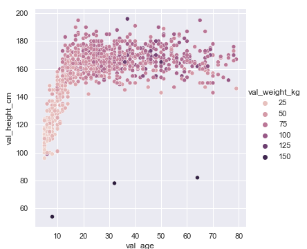
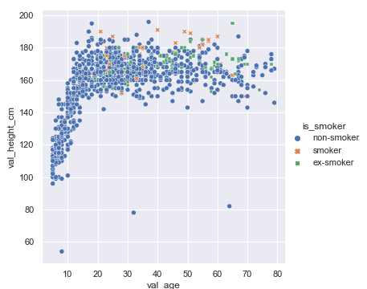
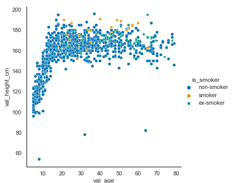

<!--

author:   Rose Hartman
email:    hartmanr1@chop.edu
version:  0.0.1
language: en
narrator: UK English Female
title: Data visualizations in seaborn

comment:  This module includes code and explanations for several popular data visualizations, using python's seaborn library. It also includes examples of how to modify seaborn plots to customize them for different uses (e.g. adhering to journal requirements for visualizations).  

long_description: FINISH

@learning_objectives  

After completion of this module, learners will be able to:

- identify key elements
- create a product
- do a task
- articulate the rationale for something

@end

link:  https://chop-dbhi-arcus-education-website-assets.s3.amazonaws.com/css/modules.css

-->

# Data visualizations in seaborn

<div class = "overview">

## Overview
@comment

**Is this module right for me?** @long_description

**Estimated time to completion:**

**Pre-requisites**

This module assumes some familiarity with principles of data visualizations as applied in the seaborn library. If you've used seaborn (or R's ggplot2) a little already and are just looking to extend your skills, this module should be right for you. If you are brand new to ggplot2 and seaborn, start with the overview of [data visualizations in open source software](link) first, and then come back here.

This module also assumes some basic familiarity with python, including

* installing and importing libraries
* reading in data
* manipulating data frames, including calculating new columns, and pivoting from wide format to long
* some [statistical tests](link)

If you are brand new to python (or want a refresher) consider starting with [Intro to python](link) first.

**Learning Objectives**

@learning_objectives

</div>

## Lesson Preparation
<!--
@@@block-comments

This module makes use of [pangeo binder](https://binder.pangeo.io/) for interactive code examples in python. You don't need to install anything or set up an account, but you need a modern web browser like Chrome and a moderately good wifi connection.

@end
-->

If you have python already installed on your computer and you prefer to work through code examples there, you can <a href="https://raw.githubusercontent.com/arcus/education_modules/main/data_visualization_in_seaborn/data_visualization_seaborn.ipynb" download>download the code for this module to run offline</a>.

<!--
@@@block-comments
If you intend to do the hands-on activities in this module with pangeo binder, we have a bit of preparation for you to do now. Because it can take a few minutes for the environment to be created, we suggest you click the link below to start up the activity. We recommend using right-click to open it in a new tab or window, and then returning here to continue learning while the environment finishes loading. Here is the link:

[](https://binder.pangeo.io/v2/gh/arcus/education_r_environment/main?urlpath=rstudio) **Click the "launch binder" button!**

You don't have to do anything except come back here once the link opens in a new tab or window.
@end
-->

## Making plots using seaborn

To use the seaborn library to make visualizations, you need to import it.

By convention, you import it with the shorthand `sns`. This is optional, but we do recommend you do that because when you look at seaborn code online, you'll nearly always see it with that same abbreviation; following that convention will make your code more comprable to examples you see online.

```Python
import seaborn as sns
```


## Working through interactive coding examples

<!--
@@@block-comments
Hopefully your [binder instance](#lesson-preparation) is done loading now! If not, be patient --- it can take as long as 20 or 30 minutes some times if the files haven't been used recently.

When it is ready, you should see a jupyter notebook in your browser with the code for this module. While you read through this module, we recommend you keep returning back to the binder instance to try running the code for yourself. Even better, try changing the code and see what happens.

<div class = "important">
Note that binder instances aren't stable. When you close the window or if it idles too long, it may erase all of your work. If you want to save any code or output you come up with while working in binder, you need to copy-paste the code to a new file to save it on your computer.
</div>
@end
-->

## Scatterplots

Scatterplots show the relationship between two continuous variables, one on the x-axis and one on the y-axis. Because they show each individual data point as a marker, they also provide a handy way to check visually for outliers.

For more background on scatterplots, watch [this Kahn Academy series](https://www.khanacademy.org/math/cc-eighth-grade-math/cc-8th-data/cc-8th-scatter-plots/v/constructing-scatter-plot).

### Basic scatterplot

The seaborn library includes a powerful function called `relplot`, short for "relationships plot" because it's designed to highlight relationships among variables in the data.

If you provide `relplot` with two continuous variables, it will default to making a scatterplot. Here we'll plot age and glucose.

```Python
sns.relplot(data = breast_cancer_data,
            x="Age", y="Glucose")
```


<div class = "options">
You can also create scatterplots with a similar function: `regplot` (short for "regression plot"). We'll take a look at `regplot` more closely in the [trend lines](#trend-lines) section.
</div>

### Using color for continuous variables

Let's try adding information about a third variable, BMI, by using color.

```Python
sns.relplot(data = breast_cancer_data,
            x="Age", y="Glucose", hue="BMI")
```


Note that adding hue to the command automatically adds a legend to your plot as well.

### Using color to show groups

Now let's look at using color for a categorical variable. In this case, the variable is a categorical one (Classification, 1 or 2), but it isn't properly coded as categorical in the data. We'll fix that first and then send the corrected dataframe to the plotting command.

<div class = "important">
Tip: It's generally much easier to make any necessary changes to the dataframe, such as mutating variables, before sending it to the plotting command.
</div>

```Python
# note that Classification is treated as a numeric variable in the data, but it should really be categorical
# convert the Classification column to categorical
breast_cancer_data["Classification"] = breast_cancer_data["Classification"].astype("category")


sns.relplot(data = breast_cancer_data,
            x="Age", y="Glucose",
            hue="Classification")
```


### Distinguish groups more clearly with color and shape

We'll improve this plot by using shape and color together to mark the Classification groups.

<div class = "important">
Tip: Don't use color alone to convey important information in your plots because if your end users are unable to distinguish the colors, the plot loses its value. Instead, double-up color information with another element, such as marker shape, to make the different groups easier to distinguish.
</div>

```Python
sns.relplot(data = breast_cancer_data,
            x="Age", y="Glucose",
            hue="Classification", style = "Classification")
```


### Custom colors

The seaborn library includes many color palettes to choose from, or you can specify colors manually.

Here we'll try switching from the default color palette to a version that is easier to distinguish for people with some types of colorblindness (although remember that even when using a palette that is supposedly colorblind friendly, you should still avoid using color on its own to display important information).

```Python
sns.relplot(data = breast_cancer_data,
            x="Age", y="Glucose",
            hue="Classification", style = "Classification",
           palette = "colorblind")
```


Rather than changing the palatte for each individual plot, you may want to change the default color palatte for all of the plots you're generating. To do that, use `set_theme` to change the default settings for seaborn plots.

```Python
# to set the colorblind palette as default
sns.set_theme(palette="colorblind")
```

Now all of our plots will use the `colorblind` palette, unless we specify otherwise.

<div class = "learnmore">
The seaborn library has many different built-in color palattes to choose from. To learn more about setting custom colors in seaborn visualizations, see the [seaborn tutorial on color palettes](https://seaborn.pydata.org/tutorial/color_palettes.html).
</div>

### Controlling figure aesthetics

The seaborn library handles the appearance of plots with two kinds of functions: style, and context.

- `style` refers to things like background color, gridlines, and axis ticks
- `context` refers to the visual scale of the plot, such as the size of the font used for axis labels

Seaborn controls style and context separately so that you can get a plot that has all the style elements you want, and then you can present that same plot scaled appropriately in different contexts --- for example, if you want to include it in a slide deck presentation, you probably want the fonts much larger and the lines heavier than you would if you wanted to include it as a figure in a paper. In this case, you would leave all of the style settings the same, but change context to "talk" to scale it for the slide deck and "paper" to scale it for use in the paper.

<div class = "learnmore">
We'll show a quick example of changing style and context here, but there are many more options available. To learn more about tweaking style and context, see the [seaborn tutorial on controlling figure aesthetics](https://seaborn.pydata.org/tutorial/aesthetics.html).
</div>

#### Setting plot style

```Python
# there are 5 preset seaborn themes: darkgrid, whitegrid, dark, white, and ticks
sns.set_style("white")

sns.relplot(data = breast_cancer_data,
            x="Age", y="Glucose",
            hue="Classification", style = "Classification")
```



#### Setting plot context

```Python
# there are 4 different contexts available: notebook (default), paper, talk, and poster
sns.set_context("poster")

sns.relplot(data = breast_cancer_data,
            x="Age", y="Glucose",
            hue="Classification", style = "Classification")
```


```Python
# set context back to notebook (the default)
sns.set_context("notebook")
```

### Quiz: Scatterplots

What is the command to create a scatterplot in seaborn?

[[sns.relplot()]]
<script>
  let input = "@input".trim();
  /relplot/.test(input) || /regplot/.test(input);
</script>
***
<div class = "answer">
By default, the `relplot` command creates a scatterplot (although it can also be used to create [line plots](#line-plots)). You can also use `regplot` to create scatterplots, as we'll see in the [trend lines](#trend-lines) section.

Note the `sns` before the function name. That's because we imported the seaborn library with an alias, as is conventional. See [making plots in seaborn](#making-plots-in-seaborn).
</div>
***

True or False: The only two crucial arguments to supply (in addition to providing the data) for a scatterplot are x and y.

[(X)] TRUE
[( )] FALSE
***
<div class = "answer">
While x and y are the only two **crucial** arguments for you to supply the plotting function, you may want to include others, such as hue and style, to communicate information about additional variables in the data.
</div>
***

## Histograms

## Line Plots

## Trend Lines

## Additional Resources

We have several interactive python data science notebooks available on google colab.

- [Introduction to tabular .csv data with pandas](https://colab.research.google.com/github/arcus/education-materials/blob/master/tidy-csv-pandas/tidy-csv-pandas-full.ipynb)
- [Exploring diagnostic data with python](https://colab.research.google.com/github/arcus/education-materials/blob/master/data-analysis-with-pandas/01-exploring-diagnostic-data-with-pandas.ipynb)
- [Exploring data using pandas and seaborn](https://colab.research.google.com/github/arcus/education-materials/blob/master/explore-pandas-seaborn/explore-pandas-seaborn-full.ipynb)
- [Intro to machine learning, Part 1: Classification with Scikit-learn](https://colab.research.google.com/github/arcus/education-materials/blob/master/intro-to-ml/ml_workbook_00_intro.ipynb) (note, this pairs with an article on the Arcus Education team website: [What type of machine learning should I use?](https://education.arcus.chop.edu/types-of-ml/))
- [Intro to machine learning, Part 2: Validation, tuning, and model selection](https://colab.research.google.com/github/arcus/education-materials/blob/master/intro-to-ml/ml_workbook_01_validation_tuning.ipynb)
- [Intermediate machine learning](https://github.com/arcus/education-materials/tree/master/ml-intermediate) (scroll down to the README description for links to several interactive notebooks)
- [Network analysis and visualization with NetworkX](https://colab.research.google.com/github/arcus/education-materials/blob/master/network-viz/introduction.ipynb)

You may find the [pandas cheatsheet (pdf)](https://pandas.pydata.org/Pandas_Cheat_Sheet.pdf) helpful.

## Feedback

In the beginning, we stated some goals.

**Learning Objectives:**

@learning_objectives

We ask you to fill out a brief (5 minutes or less) survey to let us know:

* If we achieved the learning objectives
* If the module difficulty was appropriate
* If we gave you the experience you expected

We gather this information in order to iteratively improve our work.  Thank you in advance for filling out [our brief survey](https://redcap.chop.edu/surveys/?s=KHTXCXJJ93&module_name=%22Data+Visualizations+in+Python%22)!
