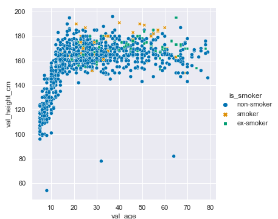
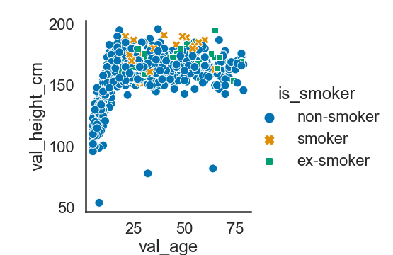
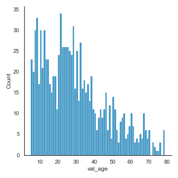
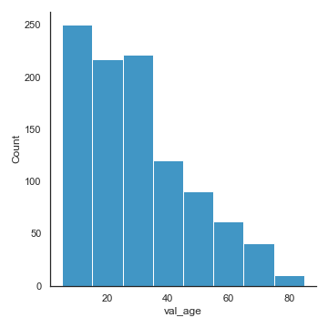
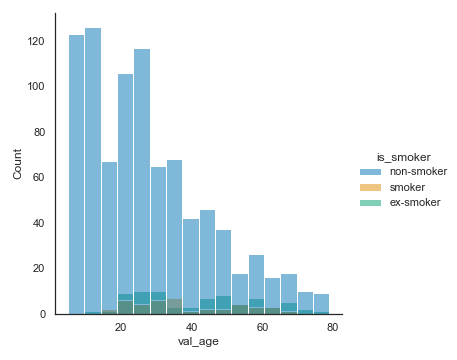
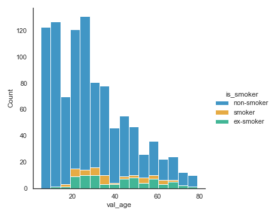
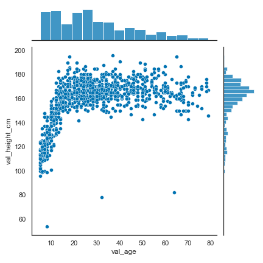

<!--

author:   Rose Hartman
email:    hartmanr1@chop.edu
version:  0.0.1
language: en
narrator: UK English Female
title: Data visualizations in seaborn

comment:  This module includes code and explanations for several popular data visualizations, using python's seaborn library. It also includes examples of how to modify seaborn plots to customize them for different uses (e.g. adhering to journal requirements for visualizations).  

long_description: FINISH

@learning_objectives  

After completion of this module, learners will be able to:

- identify key elements
- create a product
- do a task
- articulate the rationale for something

@end

link:  https://chop-dbhi-arcus-education-website-assets.s3.amazonaws.com/css/styles.css

-->

# Data visualizations in seaborn

<div class = "overview">

## Overview
@comment

**Is this module right for me?** @long_description

**Estimated time to completion:**

**Pre-requisites**

This module assumes some familiarity with principles of data visualizations as applied in the seaborn library. If you've used seaborn (or R's ggplot2) a little already and are just looking to extend your skills, this module should be right for you. If you are brand new to ggplot2 and seaborn, start with the overview of [data visualizations in open source software](link) first, and then come back here.

This module also assumes some basic familiarity with python, including

* installing and importing libraries
* reading in data
* manipulating data frames, including calculating new columns, and pivoting from wide format to long
* some [statistical tests](link)

If you are brand new to python (or want a refresher) consider starting with [Intro to python](link) first.

**Learning Objectives**

@learning_objectives

</div>

## Lesson Preparation


This module makes use of [pangeo binder](https://binder.pangeo.io/) for interactive code examples in python. You don't need to install anything or set up an account, but you need a modern web browser like Chrome and a moderately good wifi connection.


If you have python already installed on your computer and you prefer to work through code examples there, you can <a href="https://raw.githubusercontent.com/arcus/education_modules/main/data_visualization_in_seaborn/data_visualization_seaborn.ipynb" download>download the code for this module to run offline</a>.


If you intend to do the hands-on activities in this module with pangeo binder, we have a bit of preparation for you to do now. Because it can take a few minutes for the environment to be created, we suggest you click the link below to start up the activity. We recommend using right-click to open it in a new tab or window, and then returning here to continue learning while the environment finishes loading. Here is the link:

[](https://binder.pangeo.io/v2/gh/arcus/education_r_environment/main?urlpath=rstudio) **Click the "launch binder" button!**

You don't have to do anything except come back here once the link opens in a new tab or window.


### Importing seaborn

To use the seaborn library to make visualizations, you need to import it.

By convention, you import it with the shorthand `sns`. This is optional, but we do recommend you do that because when you look at seaborn code online, you'll nearly always see it with that same abbreviation; following that convention will make your code more comparable to examples you see online.

```Python
import seaborn as sns
```


### Working through interactive coding examples


Hopefully your [binder instance](#lesson-preparation) is done loading now! If not, be patient --- it can take as long as 20 or 30 minutes some times if the files haven't been used recently.

When it is ready, you should see a jupyter notebook in your browser with the code for this module. While you read through this module, we recommend you keep returning back to the binder instance to try running the code for yourself. Even better, try changing the code and see what happens.

<div class = "important">
Note that binder instances aren't stable. When you close the window or if it idles too long, it may erase all of your work. If you want to save any code or output you come up with while working in binder, you need to copy-paste the code to a new file to save it on your computer.
</div>


### The data

First, we need to load the modules we'll be using:

```python
import pandas as pd
import numpy as np
import matplotlib.pyplot as plt
import seaborn as sns

```

<div class = "learnmore">
The `pandas` module is for working with data in python. To learn more, see the [pandas guide](https://pandas.pydata.org/docs/getting_started/index.html).

The `numpy` module has several useful functions for statistical calculations and other mathematical operations useful in scientific computing. To learn more, see the [numpy website](https://numpy.org/).

The `seaborn` module is the plotting module that is the focus of this lesson, and it requires some pieces of `matplotlib`, since it is built as an extension to it.
</div>

And then read in the data set:

```python
covid_data = pd.read_csv("https://raw.githubusercontent.com/kendavidn/yaounde_serocovpop_shared/v1.0.0/data/yaounde_covid_seroprev_dataset.csv")

```

These data are from a COVID-19 serological survey conducted in Yaounde, Cameroon (Nwosu, K., Fokam, J., Wanda, F. et al., 2021[^1](Kene David Nwosu, Joseph Fokam, Franck Wanda, Lucien Mama, Erol Orel, Nicolas Ray, Jeanine Meke, Armel Tassegning, Desire Takou, Eric Mimbe, Beat Stoll, Josselin Guillebert, Eric Comte, Olivia Keiser, & Laura Ciaffi. (2021). kendavidn/yaounde_serocovpop_shared: Initial release (v1.0.0). Zenodo. https://doi.org/10.5281/zenodo.5218965)). The authors have made all of the code and data publicly available under a [creative commons 4.0 license](https://creativecommons.org/licenses/by/4.0/legalcode) to facilitate re-use.


<div class="learnmore">
To learn more about the study, see the [zenodo page for this dataset](https://zenodo.org/record/5218965#.YeBq2RPMITW). You can read the published article online: [](https://www.nature.com/articles/s41467-021-25946-0)
</div>

<div class="learnmore">
Run the above code yourself in binder (see [lesson preparation](#lesson-preparation) for links to start the binder instance) or on your own computer.

In the data\_visualization\_seaborn.ipynb file, the code at the top of the file includes these import commands and the command to read the csv file for the data. Before you will be able to generate the plots in the rest of the module, you should run those lines of code.
</div>

## Scatterplots

Scatterplots show the relationship between two continuous variables, one on the x-axis and one on the y-axis. Because they show each individual data point as a marker, they also provide a handy way to check visually for outliers.

For more background on scatterplots, watch [this Kahn Academy series](https://www.khanacademy.org/math/cc-eighth-grade-math/cc-8th-data/cc-8th-scatter-plots/v/constructing-scatter-plot).


### Basic scatterplot

The seaborn library includes a powerful function called `relplot`, short for "relationships plot" because it's designed to highlight relationships among variables in the data.

If you provide `relplot` with two continuous variables, it will default to making a scatterplot. Here we'll plot age and glucose.

```Python
sns.relplot(data = covid_data,
            x="val_age", y="val_height_cm")
```


<div class = "options">
You can also create scatterplots with a similar function: `regplot` (short for "regression plot"). We'll take a look at `regplot` more closely in the [trend lines](#trend-lines) section.
</div>

### Using color for continuous variables

Let's try adding information about a third variable, weight, by using color.

```Python
sns.relplot(data = covid_data,
            x="val_age", y="val_height_cm", hue="val_weight_kg")
```


Note that adding hue to the command automatically adds a legend to your plot as well.

### Using color to show groups

Now let's look at using color for a categorical variable. In this case, the variable is a categorical one (`is_smoker`, with options `ex_fumeur`, `fumeur`, and `non_fumeur`, referring to former smokers, current smokers, and non-smokers, respectively).

The values entered for `is_smoker` in the data are actually much longer than we need them to be --- they include the text of the option after the shorthand for it (e.g. former smokers are indicated by `ex_fumeur__j_ai_fum__mais_ne_fume_plus`). We don't want that additional text in the plot, so we'll recode that variable now.

```Python
# recode is_smoker to make the variable labels shorter
orig_codes = ["ex_fumeur__j_ai_fum__mais_ne_fume_plus", "fumeur__je_fume_actuellement", "non_fumeur__je_n_ai_jamais_fum"]
new_codes = ["ex-smoker", "smoker", "non-smoker"]

covid_data['is_smoker'] = covid_data['is_smoker'].replace(orig_codes, new_codes)

```

<div class = "learnmore">
For a refresher, see this tutorial on [recording variables in a pandas dataframe](https://www.sfu.ca/~mjbrydon/tutorials/BAinPy/05_recode.html#replacing-values-from-a-list).
</div>

Then we can update our scatterplot to use `is_smoker` for color.

```Python
sns.relplot(data = covid_data,
            x="val_age", y="val_height_cm",
            hue="is_smoker")
```


<div class = "important">
Tip: It's generally much easier to make any necessary changes to the dataframe, such as modifying variables, before sending it to the plotting command.
</div>

### Distinguish groups more clearly with color and shape

We'll improve this plot by using shape and color together to mark the Classification groups.

<div class = "important">
Tip: Don't use color alone to convey important information in your plots because if your end users are unable to distinguish the colors, the plot loses its value. Instead, double-up color information with another element, such as marker shape, to make the different groups easier to distinguish.
</div>

```Python
sns.relplot(data = covid_data,
            x="val_age", y="val_height_cm",
            hue="is_smoker", style = "is_smoker")
```


### Custom colors

The seaborn library includes many color palettes to choose from, or you can specify colors manually.

Here we'll try switching from the default color palette to a version that is easier to distinguish for people with some types of colorblindness (although remember that even when using a palette that is supposedly colorblind friendly, you should still avoid using color on its own to display important information).

```Python
sns.relplot(data = covid_data,
            x="Age", y="Glucose",
            hue="Classification", style = "Classification",
           palette = "colorblind")
```


Rather than changing the palette for each individual plot, you may want to change the default color palatte for all of the plots you're generating. To do that, use `set_theme` to change the default settings for seaborn plots.

```Python
# to set the colorblind palette as default
sns.set_theme(palette="colorblind")
```

Now all of our plots will use the `colorblind` palette, unless we specify otherwise.

<div class = "learnmore">
The seaborn library has many different built-in color palettes to choose from. To learn more about setting custom colors in seaborn visualizations, see the [seaborn tutorial on color palettes](https://seaborn.pydata.org/tutorial/color_palettes.html).
</div>

### Controlling figure aesthetics

The seaborn library handles the appearance of plots with two kinds of functions: style, and context.

- `style` refers to things like background color, gridlines, and axis ticks
- `context` refers to the visual scale of the plot, such as the size of the font used for axis labels

Seaborn controls style and context separately so that you can get a plot that has all the style elements you want, and then you can present that same plot scaled appropriately in different contexts --- for example, if you want to include it in a slide deck presentation, you probably want the fonts much larger and the lines heavier than you would if you wanted to include it as a figure in a paper. In this case, you would leave all of the style settings the same, but change context to "talk" to scale it for the slide deck and "paper" to scale it for use in the paper.

<div class = "learnmore">
We'll show a quick example of changing style and context here, but there are many more options available. To learn more about tweaking style and context, see the [seaborn tutorial on controlling figure aesthetics](https://seaborn.pydata.org/tutorial/aesthetics.html).
</div>

#### Setting plot style

```Python
# there are 5 preset seaborn themes: darkgrid, whitegrid, dark, white, and ticks
sns.set_style("white")

sns.relplot(data = covid_data,
            x="Age", y="Glucose",
            hue="Classification", style = "Classification")
```


#### Setting plot context

```Python
# there are 4 different contexts available: notebook (default), paper, talk, and poster
sns.set_context("poster")

sns.relplot(data = covid_data,
            x="Age", y="Glucose",
            hue="Classification", style = "Classification")
```


```Python
# set context back to notebook (the default)
sns.set_context("notebook")
```

### Quiz: Scatterplots

What is the command to create a scatterplot in seaborn?

[[sns.relplot()]]
<script>
  let input = "@input".trim();
  /relplot/.test(input) || /regplot/.test(input);
</script>
***
<div class = "answer">
By default, the `relplot` command creates a scatterplot (although it can also be used to create [line plots](#line-plots)). You can also use `regplot` to create scatterplots, as we'll see in the [trend lines](#trend-lines) section.

Note the `sns` before the function name. That's because we imported the seaborn library with an alias, as is conventional. See [making plots in seaborn](#making-plots-in-seaborn).
</div>
***

True or False: The only two crucial arguments to supply (in addition to providing the data) for a scatterplot are x and y.

[(X)] TRUE
[( )] FALSE
***
<div class = "answer">
While x and y are the only two **crucial** arguments for you to supply the plotting function, you may want to include others, such as hue and style, to communicate information about additional variables in the data.
</div>
***

## Histograms

Histograms show the distribution of a continuous variable. The values of the variable are shown along the x-axis, and data are grouped into bins, with the height of each bin corresponding to the number of data points in that bin. In other words, it communicates where your data for a given variable fall within its range. It is a great way to quickly assess for symmetry vs skew, outliers, and less common issues like multimodality.

We'll continue using the same data we explored to make scatter plots.

### Basic histogram

Because histograms show just one variable, the only aesthetic they require is x. The y-axis of the plot will just show the counts of observations in each bin on the x-axis. (Note that it is possible to provide `sns.displot` with y instead of x, in which case it will generate a sideways histogram.)

```python
sns.displot(covid_data, x="val_age")
```


### Change the number of bins

The appearance of a histogram can change a lot depending on the number of bins you use along the x-axis. It's a good idea to try a few different sets of bins to see what works well for communicating this distribution.

```python
sns.displot(covid_data, x="val_age", binwidth=1)

```



```python
sns.displot(covid_data, x="val_age", binwidth=10)
```



### Using color to show groups

As with scatterplots, we can add information about an additional variable by using color. Let's put in the variable `is_smoker` for hue so we can see how the distribution of ages differs by smoking status.

Note that seaborn is continuing to use the color palette we set when we were making scatter plots (see [custom colors](#custom-colors)). If you want to change the color palette, you can do so at any time.

```python
sns.displot(covid_data, x="val_age", hue="is_smoker")

```



You may be noticing that the distribution of non-smokers, which makes up the majority of the data, appears to be covering the other smaller groups. By default, seaborn plots each group as if they were each their own histogram, making each slightly translucent so you can see where distributions overlap. The height of each colored bar shows the count for that bin within that group.

That's often the most useful way to plot multiple histograms, but in this case, it makes it hard to see the smoker and ex-smoker distributions clearly because they fall completely within the non-smoker distribution.

You can control how `seaborn` plots the distributions with the `multiple` argument. To show stacked groups instead, use `multiple = "stack"`. This will put the three distributions one on top of the other, so the height of all three colors together in each bin corresponds to the total count across groups; the silhouette of this histogram will be identical to the original histogram without coloring by group.


```python
sns.displot(covid_data, x="val_age", hue="is_smoker", multiple="stack")
```



<div class = "options">
You can also use this same `displot` function to create [density plots](https://seaborn.pydata.org/tutorial/distributions.html#kernel-density-estimation) instead of histograms.
</div>

### Adding marginal histograms to other plots

Some times you may wish to show a distribution as context for another plot, such as a scatter plot. You can add marginal histograms to a bivariate plot with the `jointplot` function.

```python
sns.jointplot(data=covid_data, x="val_age", y="val_height_cm")
```



By default, it plots x and y as a scatterplot, adding a marginal histogram for each.

<div class = "learnmore">
Learn more about a variety of ways to add marginal distribution information to plots in the [seaborn distributions tutorial](https://seaborn.pydata.org/tutorial/distributions.html#distribution-visualization-in-other-settings).
</div>

### Quiz: Histograms

Which of the following aesthetics can be used to plot a histogram using `displot`?

[( )] x only
[(X)] either x or y
[( )] y only
[( )] both x and y
****
<div class = "answer">
Histograms can only make use of one dimension of data (x or y, but never both) because the other dimension will always be the count of observations in each bin. If you try to provide variables for both x and y, `seaborn` will plot a [bivariate distribution heatmap](https://seaborn.pydata.org/tutorial/distributions.html#visualizing-bivariate-distributions) instead of a histogram.

In all of our examples, we used the x argument for our histograms, but it is possible to provide y instead. As an experiment, try generating one of the plots above, but substitute y for x and see what happens!
</div>
****

True or False: To show multiple histograms for different subgroups on a single plot (e.g. age distributions for smokers, non-smokers, and ex-smokers), use the `jointplot` function.

[( )] True
[(X)] False
****
The `jointplot` function is for showing a bivariate plot with supplemental univariate distributions in the margins (for a review, see [adding marginal histograms to other plots](#adding-marginal-histograms-to-other-plots)).

To show histograms for two or more subgroups in a single plot, use the `hue` argument to color each subgroup separately (for a review, see [using color to show groups](#using-color-to-show-groups)).
****

True or False: The default binwidth in `seaborn` should work well for most data sets.

[( )] True
[(X)] False
****
Not necessarily! The `seaborn` defaults are sensible, so that's often a good starting place, but it can be dangerous to accept the default bins without examining other options.  Changing the binwidth on a histogram can dramatically change the patterns highlighted in the data, so it's always a good idea to try multiple binwidths when you're making a histogram.

You can read more about this issue in the [seaborn distributions tutorial](https://seaborn.pydata.org/tutorial/distributions.html#choosing-the-bin-size).
****

## Line Plots

### Quiz: Line Plots

## Trend Lines

### Quiz: Trend Lines

## Assignment

<div class = "important">
</div>

## Additional Resources

We have several interactive python data science notebooks available on google colab.

- [Introduction to tabular .csv data with pandas](https://colab.research.google.com/github/arcus/education-materials/blob/master/tidy-csv-pandas/tidy-csv-pandas-full.ipynb)
- [Exploring diagnostic data with python](https://colab.research.google.com/github/arcus/education-materials/blob/master/data-analysis-with-pandas/01-exploring-diagnostic-data-with-pandas.ipynb)
- [Exploring data using pandas and seaborn](https://colab.research.google.com/github/arcus/education-materials/blob/master/explore-pandas-seaborn/explore-pandas-seaborn-full.ipynb)
- [Intro to machine learning, Part 1: Classification with Scikit-learn](https://colab.research.google.com/github/arcus/education-materials/blob/master/intro-to-ml/ml_workbook_00_intro.ipynb) (note, this pairs with an article on the Arcus Education team website: [What type of machine learning should I use?](https://education.arcus.chop.edu/types-of-ml/))
- [Intro to machine learning, Part 2: Validation, tuning, and model selection](https://colab.research.google.com/github/arcus/education-materials/blob/master/intro-to-ml/ml_workbook_01_validation_tuning.ipynb)
- [Intermediate machine learning](https://github.com/arcus/education-materials/tree/master/ml-intermediate) (scroll down to the README description for links to several interactive notebooks)
- [Network analysis and visualization with NetworkX](https://colab.research.google.com/github/arcus/education-materials/blob/master/network-viz/introduction.ipynb)

You may find the [pandas cheatsheet (pdf)](https://pandas.pydata.org/Pandas_Cheat_Sheet.pdf) helpful.

## Feedback

In the beginning, we stated some goals.

**Learning Objectives:**

@learning_objectives

We ask you to fill out a brief (5 minutes or less) survey to let us know:

* If we achieved the learning objectives
* If the module difficulty was appropriate
* If we gave you the experience you expected

We gather this information in order to iteratively improve our work.  Thank you in advance for filling out [our brief survey](https://redcap.chop.edu/surveys/?s=KHTXCXJJ93&module_name=%22Data+Visualizations+in+Python%22)!
