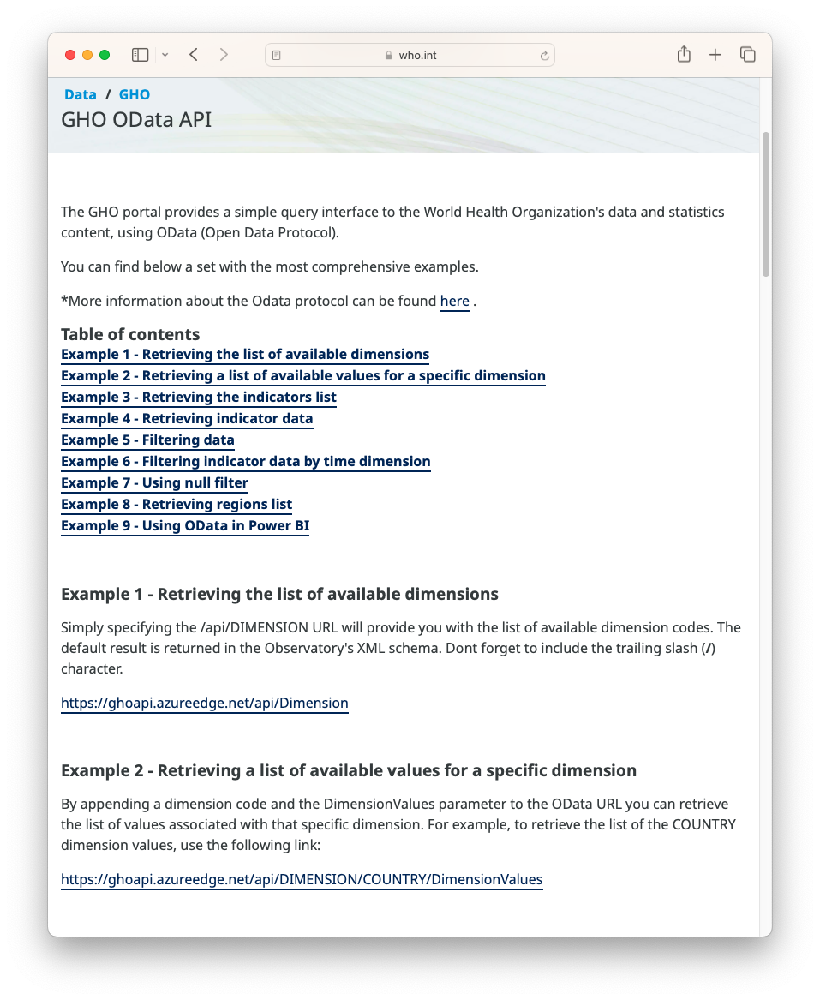
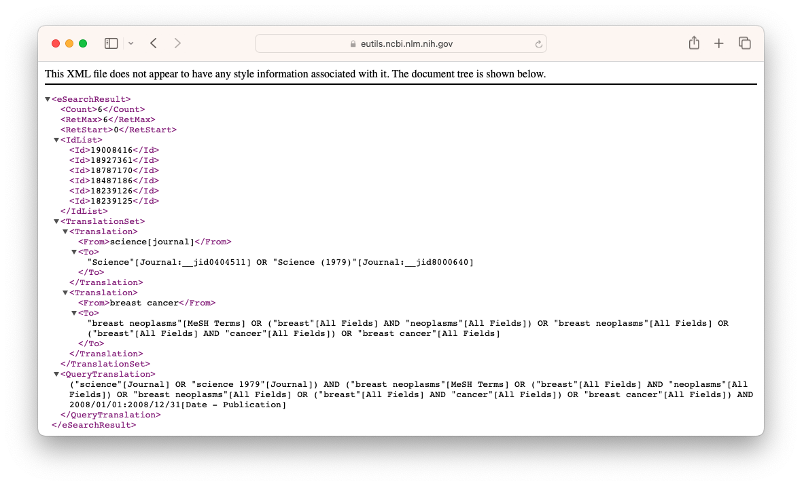
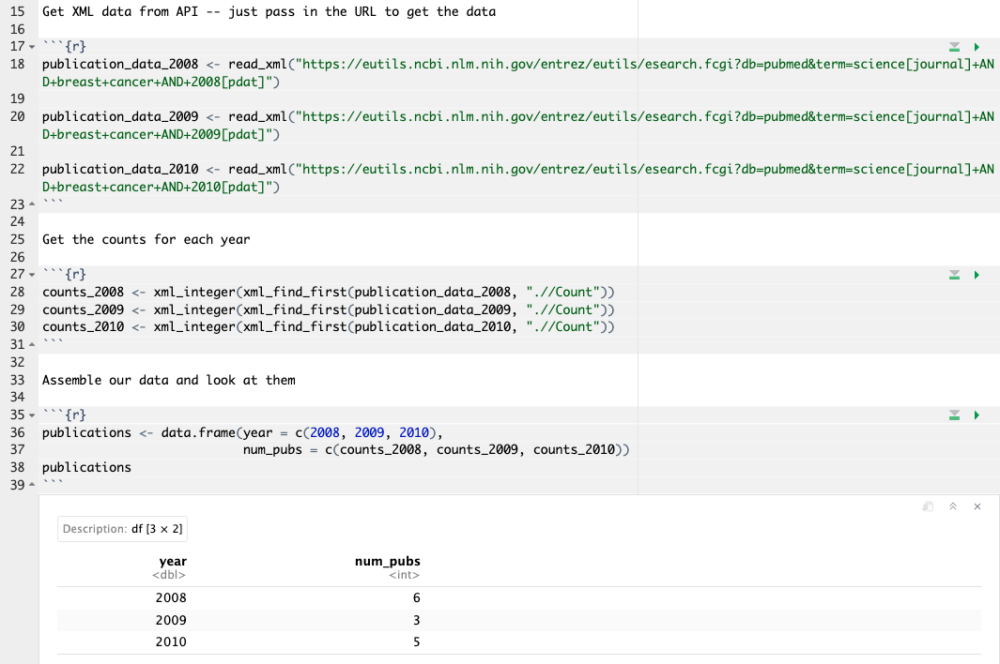
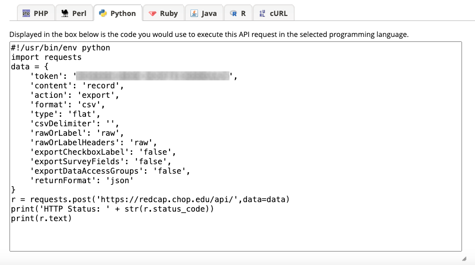
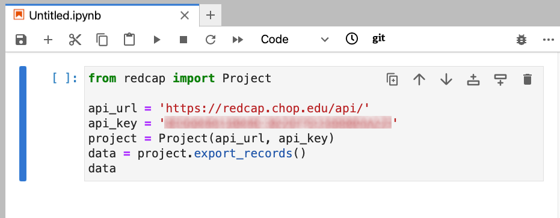

<!--
module_id: demystifying_api
author:   Joy Payton
email:    paytonk@chop.edu
version:  1.0.0
current_version_description: Initial version
module_type: standard
docs_version: 4.0.0
language: en
narrator: US English Female
mode: Textbook
title: Demystifying Application Programming Interfaces (APIs) 
comment:  Understand what an application programming interface (API) is and why APIs are useful!
long_description: An application programming interface (API) can allow you to work more easily with data sources and technical tools.  Learn more about what an API is, read about use cases, and understand how interaction with APIs can take place.  It's appropriate for brand new beginners.
estimated_time_in_minutes: 30

@pre_reqs
No particular skills or experience are required for this module.  
@end

@learning_objectives  
After completion of this module, learners will be able to:

- Define the term *application programming interface* (API)
- Explain why APIs can be useful to biomedical researchers
- Explain how to interact with an API

@end

good_first_module: true
collection: demystifying, infrastructure_and_technology
coding_required: false

@sets_you_up_for
- using_redcap_api
@end

@depends_on_knowledge_available_in

@end

@version_history 

Previous versions: 

No previous versions.

@end

import: https://raw.githubusercontent.com/arcus/education_modules/main/_module_templates/macros.md
-->

# Demystifying Application Programming Interfaces (APIs)

@overview

## What is an API?

**API** (you can pronounce it by saying each letter: A - P - I) stands for **Application Programming Interface**.  Let's take each of those words in turn.

An **application** is a computer system -- such as the system that holds the list of New York Times bestsellers, or the REDCap system of electronic research data capture, or the PubMed system of searchable academic articles related to medicine.

**Programming** is the use of special methods -- usually written computer code -- to control what an application does.  When you write code in Java, Python, javascript, Go, R, or other languages, you're programming.  The people who create applications have to use programming to create the set of rules for working with that application.

Finally, an **interface** is a way to interact with a system.  The dashboard of your car is an interface, and the menu in your word processing software is an interface.  Interfaces allow you to give instruction to a system, get information from a system, or both.

If we put these together, we can describe an API as a set of rules for message exchange that allows people or machines to:

* interact with (that's the **interface** part)
* software (that's the **application** part)
* in a very specific and prescribed way (thanks to the rules set up by the people **programming** the application). 

That feels very vague -- what about some examples?  We'll consider some on the next page.

## API Use Cases 

What kinds of APIs might you, a biomedical researcher, encounter?  Well, let's consider some practical use cases.

* Instead of manually doing a literature review where you copy/paste the results from a hand-typed search result page into a Word document, you might want to use [a PubMed API](https://www.ncbi.nlm.nih.gov/pmc/tools/developers/) to give you a count or list of results instead, and try plugging different values of year, search terms, or other data elements to quickly measure the effectiveness of your search terms.
* You might use the [REDCap API](https://liascript.github.io/course/?https://raw.githubusercontent.com/arcus/education_modules/main/using_redcap_api/using_redcap_api.md) to download today's latest recruitment numbers into a pre-made dashboard to share with your lab and encourage them to step up recruitment efforts in your weekly meeting.
* Perhaps you'd like to study newspaper coverage of a public health topic, and use a [New York Times API](https://developer.nytimes.com/apis) to give the the counts and references to articles written about your topic of interest, so you can visualize the change over time of public awareness and interest.
* As someone interested in the social determinants of health, you want to use an [API from the U.S. Census Bureau](https://www.census.gov/data/developers/data-sets.html) to obtain economic data from the American Community Survey about the census tracts in Philadelphia.
* Because you educate the public about infectious disease, you want to get the latest data about the popularity of posts and pages on your website, and analyze that data to see what kinds of articles get the most traction.
* The sensor data you use to study air quality across a particular region is only available via API, so you use an API to download data and give you historical information you need to understand the risk factors that might explain increased asthma acuity among your patients.
* Because you're building an automated system that your animal models will interact with, you want to use these systems to trigger data being written to REDCap or another data capture system.  That means interacting with an API!
* As someone interested in the spread of vaccine misinformation, you want to use social media APIs to gather information about messages that share common conspiracy theories about the measles vaccine.

Many systems may have manual, point-and-click ways to interact with them, in addition to APIs.  For example, in our use cases above, you could just go to [PubMed and search](https://pubmed.ncbi.nlm.nih.gov/), then copy-paste your results, or go to the [data portal of the census website](https://data.census.gov/) and find the ACS data to download.  

Why, then, create an automated way (these APIs we're describing) to work with systems? That's what we'll talk about next.

## Why Use APIs?

We've written about the "whys" behind API usage as well in our module [Using the REDCap API](https://liascript.github.io/course/?https://raw.githubusercontent.com/arcus/education_modules/main/using_redcap_api/using_redcap_api.md), so we're going to borrow some language from that module.

Two important advantages to using an API are **data freshness** and **reproducibility**.

**Data Freshness**

Let's say you have to run some analysis on data you're collecting in REDCap, and you want to re-run this analysis every couple of weeks to see the latest figures. One way to do that is to use a point-and-click method in which you manually export data from REDCap to a .csv and save it to a file that you analyze. 

REDCap likes to download files with a date stamp as part of the file name, so you have to keep track of various file names and make sure you are analyzing the right data, pointing your script to the right data, or changing the file name to match what your script expects. You may, after all, end up collecting multiple .csvs, each of which has a particular version of the data in REDCap. This can easily become overwhelming and cause confusion or mistakes.  Plus, it adds extra steps of downloading and renaming data files.

What's a better approach? Reach into the REDCap database directly each time you run your analysis script, using an API.  That way, you know you're using the most up-to-date data, because you're extracting it anew every time you run your analysis, and it's included in your code -- no extra download steps you have to do on your own.

**Reproducibility**

Another problem with using manually methods to obtain your data (whether that's from REDCap, or the search results page from the New York Times) is that this method requires unscripted, point-and-click manual work. If you were to document this carefully, you'd have to give several steps, like what system to go to or web page to go to, what log in to use (if applicable), which menu item to click or tab to select, any special download settings, how to name a file, and where to put the file. Most of us don't go into this level of detail in our manual workflows, for good reason! It's tiresome, and we know that sometimes things change in the look and feel of a website, so including screenshots and detailed instructions about where to look for a link or how to type into a search bar is a lot of work for something that might have slightly different steps next week or next month.

A better approach is to use a script that uses an API call. First of all, it's scripted, which means no manual steps to write up in a Word document or add to a GitHub repo or jot down on a sticky note. Also, the typical API has a standard interface that will change very little. API access may improve over time, adding new features, but it's very infrequent that an API will radically change and remove options, rendering your script unusable. The same half-dozen lines of code you use to access your data will almost always be stable for months or years, and if you do need to change it, you're only changing that small chunk of code, instead of a step-by-step document with words and images that describe a manual effort.

## Interacting with an API 

How do you interact with an Application Programming Interface?  Well, first, someone (like the IT department at the New York Times or the developers who work behind the scenes at REDCap) needs to have written an API, a set of rules that allows you, or your computer system, to interrogate their server, which is always listening for HTTP messages. 

You'll use your computer to send a message to the server asking for whatever you need from the API.  Then the server will send back some combination of a return code (such as 200, good, or 404, not found) and, if things went well, the data you requested in your message.

But how?  How do you send this message to a server?  What goes inside this message?

There are several ways to assemble a message, and it depends a bit on the complexity of what your API interaction is. You won't have to guess what to do, because most APIs have lots of documentation to help you learn how to use them. The API you're using will usually have very specific examples showing you exactly how the API works.

For example, here's a help page that gives information about how to use the World Health Organization API:

How can you find more information about your API?  By searching online!  Often the best first step is to do a search that includes the name of the application, website, or organization and the phrase "API".  

* Want to understand how to extract data from your Wordpress site?  Try "Wordpress API".
* Need to use World Health Organization data? "WHO API".

API documentation is often quite useful and detailed, with very specific examples to help non-programmer types get the information they need.  

While your best source of information about any given API is the documentation for that specific API, it might be helpful to get an overview of the main methods most APIs you'll come across will use.  This is just to give you a quick overview of some of the methods you might come across.  These include:

* Using a URL (a web address) that contains instructions for the API to give you specific data back.  You can use a URL:

  - in your web browser or 
  - in a program you're writing (say, an R script)
* Using a programming language like Python to construct the message and send it on your behalf and then work with the data that gets returned.  You can write code either:

  - using a manual method or 
  - using a specialty package designed for the specific API you're dealing with

Let's talk about each one in turn! 

### Using a URL in Your Browser

Some very simple API calls that don't require authentication or lots of information exchange can be handled just in a URL (the web address you can type into a browser window).  

<b style="color: rgb(var(--color-highlight));">Important note</b> 

Not every API can use this method!  Generally, the use of a URL is restricted to requests that are approved for anonymous users (so, things the application is fine sharing with the general public without a login), and for simple requests with only a few parameters.  

Let's look at an example!

NCBI, the National Center for Biotechnology Information, has an API called "Entrez" that you can use for a number of purposes, including to get PubMed article IDs that meet your conditions.  They provide the following example on [their website](https://www.ncbi.nlm.nih.gov/books/NBK25500/):

> Example: Get the PubMed IDs (PMIDs) for articles about breast cancer published in Science in 2008
>
> `https://eutils.ncbi.nlm.nih.gov/entrez/eutils/esearch.fcgi?db=pubmed&term=science[journal]+AND+breast+cancer+AND+2008[pdat]`

Note that there are some terms added in the URL, parameters like `db` and `term`.  There are clearly some rules about how `term` is structured, and if we wanted to learn more about this API we could read their documentation to learn what parameters we could include in the URL.

Try opening that URL (<lia-keep><a href=https://eutils.ncbi.nlm.nih.gov/entrez/eutils/esearch.fcgi?db=pubmed&term=science%5Bjournal%5D+AND+breast+cancer+AND+2008%5Bpdat%5D, target="blank">https://eutils.ncbi.nlm.nih.gov/entrez/eutils/esearch.fcgi?db=pubmed&term=science[journal]+AND+breast+cancer+AND+2008[pdat]</a></lia-keep>) in your browser and you'll get some text that's clearly formatted for computers, not for humans!  It will look something like this:

Sometimes you don't need to fully automate something, you're happy just to look at the results in your browser.  Maybe you're just doing a one-off search that you don't need to repeat, or you're testing things out.  Often, when you're learning how to use a new API, it can be helpful to do a browser test like this to make sure you understand the syntax of how to use the API and are getting the results you expect. 

<b style="color: rgb(var(--color-highlight));">Troubleshooting help</b> 

Entrez, like many APIs, has a limit to what you can do anonymously.  If you try to run this a few times in a row, you'll get an error message that starts with `{"error":"API rate limit exceeded"`...

### Using a URL in A Script or Program

If you're truly trying to automate something, you might want to ingest the data that you just looked at in a web browser in a different way.  For example, maybe you want to count the number of search results from that search of *Science* journal articles about breast cancer (by looking at the XML data labeled "Count"). Instead of copying that down, you'd like to have a table or graph generated for you automatically, in a dashboard or report.

To accomplish this, you can often just provide a URL to a function that will go and get that data for you, so you can do something with it later on in your script.

For example, let's consider this screenshot of some R code that looks at the count of articles about breast cancer published in Science in 2008 - 2010.  It creates a data frame (table) of data that you can then use to analyze trends, and you didn't have to copy-paste anything!  

<b style="color: rgb(var(--color-highlight));">A little encouragement...</b> 

Don't worry if you don't know R -- the important thing we want you to see is that we're using the URLs, but this time, we're not dropping those URLS into the browser address bar, we're using them in code.

<!-- style = "border: 1px solid rgb(var(--color-highlight));" -->

<b style="color: rgb(var(--color-highlight));">Another option</b> 

Note that if this were a real project, we'd probably write some functions to loop over the year instead of having lines of nearly identical code. For this example, however, we didn't want to get too complicated, to make it a bit simpler for people who aren't used to looking at R code.

### Constructing an API Call in a Programming Language: Manual Method

Many times, you may be using an API that isn't quite as simple as using a URL but requires you to construct a "message body" that goes beyond what you can express in just a URL. When you can't just use a URL, you'll use a programming language to construct and send the message to the API.

Sometimes, specific APIs are very popular, and people write software (like a special library or package) to streamline using them.  But that doesn't always happen!  

When there's not a specific library that is meant for your exact API, no need to worry.  There are ways to construct and send a message that are manual and generic -- they work across different APIs.  What you **include** in your message, of course, is very specific to each API, but the way you package and send that message, and receive the result, uses common libraries used to send messages across the Internet.

<b style="color: rgb(var(--color-highlight));">A little encouragement...</b> 

You're about to see some Python code, which may not make much sense to you.  Don't worry if that's the case! The important thing we want you to see is that the code is provided for you by REDCap -- it's given alongside lots of other sample code in other languages like PHP, Perl, R, and more.  We also want you to notice that the code uses `requests`, which is a multi-purpose, generic library that isn't specific to REDCap.

Most APIs will have sample code available for you in various common programming languages so you can copy/paste example code to get you started.  

Let's consider REDCap as an example.  REDCap is a system for storing research data, and has a very useful API.  Let's say we wanted to use the API to get all the records stored in a given database. In the REDCap app, there's a helpful "API playground", which provides code for given scenarios, like "please give me all the records."  

The API Playground suggests the following code for Python, which uses the `requests` library, which can be used for all kinds of message exchange over the Internet.

<!-- style = "border: 1px solid rgb(var(--color-highlight));" -->

<b style="color: rgb(var(--color-highlight));">Important note</b> 

Note that here, we obscured the authentication token here.  While the data in this REDCap database is public data, it's still not a good idea to share authentication details!

### Constructing an API Call in a Programming Language: API-Specific Packages

We said on the last page that sometimes, specific APIs are very popular, and people write software (like a special library or package) to streamline using them.  This is true of APIs like those belonging to PubMed, the US Census Bureau, REDCap, and many more.  People write libraries to streamline the use of these popular APIs so you don't have to write quite as many lines of code as you saw on the previous page.

For example, `PyCap` is a Python library written to streamline access to the REDCap API.  Because "get all the records from a given database" is such a frequently used API request, it got its own functionality in `PyCap`.  Compare the code below with the code on the previous page.  It's much shorter and less intimidating!

## Quiz 

What does "API" stand for?

[( )] Automated Programming Interaction
[( )] Applied Programmatic Intercommunication
[(X)] Application Programming Interface
[( )] Automation Providing Interaction
[( )] Automatic Processing Interaction
***

API stands for "Application Programming Interface."  An interface is a system for interaction between two entities.  In this case, one of the entities is an **application**.

***

Why might a researcher need to work with an API?  Check all that apply!

[[ ]] They need a more secure way to obtain information from a service, with additional encryption
[[X]] They want to record how they obtained their data in a highly reproducible way other people can easily replicate
[[X]] APIs can help researchers automate their work
[[ ]] APIs are the only way to get data from federal agencies like the Census Bureau
[[X]] APIs are a great way to get the most up-to-date information from an application
***

API messages are transmitted over the Internet and have the same kind of encryption that regular web page traffic to that application has.  Almost all modern web pages and APIs use secure, encrypted http.  You don't get "extra" encryption by using an API.

APIs are great for reproducibility, for obtaining data in a way that can be easily recorded and replicated.  They're also great for automating things that are repetitive, like creating a weekly dashboard.

While APIs are a great way to get data, they aren't the only way.  You can still obtain data manually from most sources, by using a web page to navigate to some resource (like a search function or a downloadable document).  This includes federal agencies.  Most have APIs as well as manual download portals where you can find materials or data to download by hand.

Finally, APIs are great for ensuring data freshness, and getting the latest information in real time from an application.

***

Which of the following are ways that you might interact with an API?

[[X]] Visiting a URL that you typed into the address bar of a web browser
[[X]] Automating a script to go to a URL and get the information from there
[[X]] Using common, generic methods to pack up and send a message using a programming language
[[X]] Using custom software written specifically for your API that makes it easier to send a message, from within a programming language
***

All of the above are ways you can interact with APIs!  Almost always, your API will give you detailed examples that you can copy and paste as you learn how to use the API.  So, rather than learn how to use APIs in general, you're better off searching for how to use the New York Times API or the Census Bureau API or the Open Data Philly API.

***

## Additional Resources

A number of libraries have lists of APIs that are useful for researchers, along with links to how to get started with each API.  The lists below have a number of overlaps, but we're including them all because there are also differences from institution to institution!

* [Temple University](https://guides.temple.edu/APIs)
* [University of California, Berkeley](https://guides.lib.berkeley.edu/information-studies/apis)
* [University of Virginia](https://guides.lib.virginia.edu/c.php?g=515084&p=10046079)
* [University of California, San Diego](https://ucsd.libguides.com/data-statistics/apis)

Some APIs (particularly those linked to social media applications) have changing rules relating to their use, due to monetization of data and data privacy.  Read more in [Shifting landscapes of social media data for research](https://www.timeshighereducation.com/campus/shifting-landscapes-social-media-data-research).

The United States Office of the National Coordinator for Health Information Technology (ONC) is driving an effort to develop and standardize APIs related to electronic health information.  Read more about [their project](https://www.healthit.gov/topic/scientific-initiatives/accelerating-apis-scientific-discovery)!

If you're a REDCap user, you might enjoy our (award-winning, at REDCapCon!) module on [Using the REDCap API](https://liascript.github.io/course/?https://raw.githubusercontent.com/arcus/education_modules/main/using_redcap_api/using_redcap_api.md).

## Feedback

@feedback