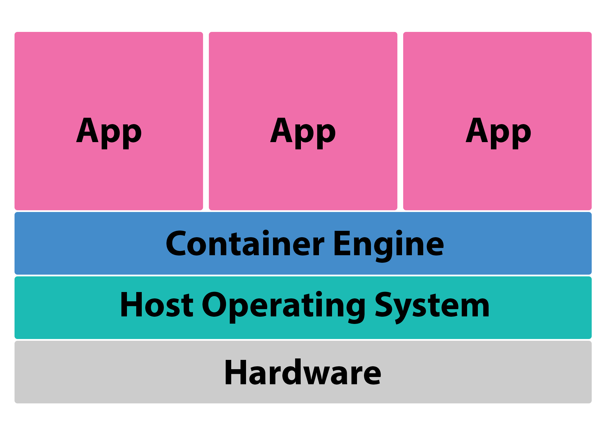

<!--

author:   Meredith Lee
email:    leemc@chop.edu
version:  1.0.0
current_version_description: Initial version
module_type: standard
docs_version: 1.0.0
language: en
narrator: UK English Female
mode: Textbook

title: Demystifying Containers

comment: Containers can be a useful tool for reproducible workflows and collaboration. This module describes what containers are, why a researcher might want to use them, and what your options are for implementation. 

long_description: Writing code in multiple environments can be tricky. Collaboration can be hindered by different language versions, packages, and even operating systems. Developing code in containers can be a solution to this problem. In this module, we'll describe what containers are at a high level and discuss how they might be useful to researchers. 

estimated_time_in_minutes: 20

@pre_reqs
The module assumes no prior familiarity with containers and requires no coding experience.  
@end

@learning_objectives  
After completion of this module, learners will be able to:

- understand when it might be useful to use containers for research
- describe the basic concept of containerization
- identify several containerization implementations
@end

good_first_module: false

@sets_you_up_for 
- docker_101
@end

@depends_on_knowledge_available_in

@end
@version_history
No previous versions. 
@end

import: https://raw.githubusercontent.com/arcus/education_modules/main/_module_templates/macros.md
-->

# Demystifying Containers

@overview

## The purpose of containerization

<b style="color: rgb(var(--color-highlight));">Learning connection</b> 

This module is a high-level discussion of what containers are and why you might want to use them. For information on how to get started with containers using Docker, see our module [Getting Started with Docker for Research](https://liascript.github.io/course/?https://raw.githubusercontent.com/arcus/education_modules/main/docker_101/docker_101.md#1).

If you have spent some time learning programming, you might have come across some terms like "container", "containerization", or "Docker". But what exactly do these terms mean, and why would you want to learn about them?

Essentially, a **container** is a lightweight, portable bundle that contains some code along with the necessary packages, files, and other dependencies that are required to run the code. It can seem like most of the information out there suggests that containers are exclusively used by software developers, but that's not true-- anyone working with code may run into situations in which containerizing that code would be beneficial. 

So why should you consider "containerizing" your code? The real power of developing code in a container is that you can control the environment in which that code will run. Have you ever had the problem where a script or application runs on your own computer, but when a coworker tries to run it on their machine, it doesn't work? This could be due to different language or package versions, or even completely different operating systems! This problem can largely be avoided by working in a container. 

Here are a few possible scenarios: 

- You're working on an application that will eventually need to run in an environment that isn't your personal computer (on a server, for example). 

- You and your coworkers regularly collaborate on some code, but you all have different language versions and different packages or libraries installed, making it difficult to send the code files from person to person without making a lot of changes either to the code itself or to your personal system (which could break other code that you're working on).

- You don't collaborate with others, but need to be able to develop and run your code on multiple computers (like a work and a personal computer, for example).

Working in a container can make all of these scenarios much easier to deal with-- it just requires a bit more work up-front. 

<b style="color: rgb(var(--color-highlight));">Learning connection</b> 

What does all of this mean for researchers? Recently, there have been calls to raise expectations for sharing code in published research, and sharing just the analysis scripts themselves is often insufficient. Containers offer a much better solution for sharing your code. To read more about these standards, see [this article by Heil et. al about reproducibility standards for machine learning](https://www.ncbi.nlm.nih.gov/pmc/articles/PMC9131851) and [this study by Trisovic et. al investigating the quality and execution of research code](https://www.ncbi.nlm.nih.gov/pmc/articles/PMC8861064/).

#### When not to use containers

While there are many situations in which containerization can improve your research by making code sharing and re-use easier, there are some occasions where containers are not the answer:

- If you are only ever going to run a script on your own computer, there's no need for containerization, which is most useful for sharing and re-using code in multiple environments. 

	

	<b style="color: rgb(var(--color-highlight));">Learning connection</b> 

	If you want to maintain a specific environment for running a particular script on your computer (for example, if you've got multiple analyses that require different language or package versions), you can instead use a **virtual environment**. Here are some resources about [virtual environments in R](https://posit.co/blog/renv-project-environments-for-r/) and [virtual environments in Python](https://docs.python.org/3/library/venv.html).

	

- If you use point-and-click software for analysis, containers aren't optimal for that kind of work, because the whole purpose of a container image is to lay out a reproducible set of instructions. If you want your analyses to be transparent, sharable, and reusable, consider using scripted analyses (which can be containerized)!

- If you need to use proprietary software that requires a license, you can include those in a container image; however, you are still limited by license requirements and limits, which could limit re-use. We recommend using open-source tools whenever possible. 

### Quiz: Why Containers?

Which of the following are situations that might be improved with containerization? Select all that apply. 

[[ ]] You are collecting some data in an Excel spreadsheet and creating scatter plots of those data.
[[X]] You and your colleagues are working together on an R script to help automate some of your analyses.  
[[X]] You are creating a web application to find the latest journal articles about a topic and display the title and abstract.
***

Collaborating on code and creating web applications are great uses of containers. While collecting and plotting data might be helped by collaboration tools, perhaps in the cloud, it is not a process that would be helped by containerization (no code needs to be run that would be dependent on the computing environment).

***

## How containers work

Before you build a container, you need a container **image**. An image is essentially the instructions for how to build the container: the code or application that you want in the container, what dependencies should be installed, and what should happen when the container launches. Often, you don't need to start completely from scratch when creating a container image. Many container platforms have **base images** that already have some basic building blocks in place (for example, you might select a Python base image, which will already have the instructions for installing Python and its dependencies); all you need to do then is to add anything special that your container needs. 

Generally, to get started making your container image, you'll need a couple of things:

- A set of instructions for building your container: This is usually the most difficult part of containerization. Usually you will start with a base image, then add anything else required. 
- A list of required packages: This lets the container platform you are using know what libraries to install. This is generally in a separate file from the other instructions, so that it is easy to update. 

After you have created your image, then the container platform you are using can take your instructions and build the container itself, a small computing environment that runs on your computer, but isolated from it, with only the components that it needs and nothing more. It only has access to what you have put inside it via your instructions, and once you're done, you can turn it off and it no longer exists until the next time you need it. You can even attach folders from your computer to the container, if you need to save data before the container stops running.

Additionally, and perhaps most powerfully, this means that you can send the container image to someone else and be confident that the code that you've developed will run on their computer just like it runs on yours! Collaborators will be able to create the exact same container with one command, regardless of how their environment is set up. 

<b style="color: rgb(var(--color-highlight));">A little encouragement...</b> 

Feeling overwhelmed? Containerization is a topic that can be difficult to wrap your head around at first! Don't worry about the implementation details right now-- this module is just here to give you a little sense of why containers might be useful and what's involved. 

### Containers vs. virtual machines

Some of you might be thinking that containers sound a bit like virtual machines. While virtual machines (or VMs) and containers can serve similar purposes, they aren't exactly the same. 

Virtual machines are divisions of a server into multiple, smaller units. Each machine has its own operating system, and you can divide up hardware elements like CPU and disk space. Virtual machines behave like computers in most respects-- but they're a "virtual" copy.

Containers are much smaller than virtual machines. The element that is "virtualized" is the software, not the hardware underneath (that all comes from your computer). Because of this, it is easier to share and modify container images. 

### Quiz: How containers work

Which of the following describes what a container image is?

[(X)] A set of instructions that describes how a container will be built.
[( )] A small package of software that has everything it needs to run in any environment.
[( )] A digital copy of a computer that runs on a server. 
***

Unlike a container, which is a lightweight bundle of software with all of the code and dependencies required to run in any environment, a container image is the set of instructions that describes how that container will be built. A digital copy of a computer that runs on a server is a virtual machine.  

***

## Container technology

There are a variety of choices when it comes to containerization technology, but the most popular is **Docker**. [Docker's website](https://www.docker.com/) has many resources and articles to help you get started, as well as a [registry for container images, called DockerHub](https://hub.docker.com/), where you can store your own container images and make use of images already out there. 

However, there are other providers that you might come across. Some of these are **container engines**, like Docker, and they are generally very similar, so we won't go into the details of the differences here. A good suggestion is to use the container engine that is most widely used in your field, as there will be more resources available to you. 

Container engines
=======

While this is far from an exhaustive list, here are a few "Docker alternatives" you might encounter: 

- [Podman](https://podman.io/) is a container service developed by [RedHat](https://www.redhat.com/en). It is often used in conjunction with [Buildah](https://buildah.io/).
- [Linux Daemon, or LXD](https://linuxcontainers.org/)
- [rkt](https://github.com/rkt/rkt), pronounced like "rocket", is a free container engine that is available on GitHub (although the project has ended and is no longer in active development, you can still use it).

Container orchestrators
=======

For individuals and small groups of collaborators who are only working with small numbers of containers, container orchestration is not a concern. However, you'll sometimes run across these tools for large-scale research projects where large numbers of containers are required and managing them manually would be difficult or impossible. Here are just a few of the most common tools you might encounter:

- [Kubernetes, pronounced "koo-br-neh-teez" and sometimes abbreviated k8s](https://kubernetes.io/) is the most popular container orchestration tool. It's open-source and was designed and developed by Google engineers, though it's now maintained by the [Cloud Native Computing Foundation](https://www.cncf.io/projects/).

- Docker has its own orchestration tool called [Docker Swarm](https://docs.docker.com/engine/swarm/). Docker Swarm is more light-weight than Kubernetes but also more limited in its capabilities. 

- [Nomad by HashiCorp](https://www.nomadproject.io/) is a flexible option that can be an alternative to or supplement Kubernetes, and can orchestration containerized and non-containerized workloads.

Containers in the Cloud 
=======

You can also run containers on cloud platforms like [Amazon Web Services, or AWS](https://aws.amazon.com/) and [Google Cloud Platform, or GCP](https://cloud.google.com/) using various orchestration (or automation of the operational tasks that are involved in deploying and managing containers) and computing tools. You can check out [containers in AWS](https://aws.amazon.com/containers/services/) and [containers in GCP](https://cloud.google.com/containers) for more information. 

### Quiz: Container technology

True or false: A Docker container is the only kind of container.

[( )] True
[(X)] False 
***

While Docker is the most popular container platform, and has many helpful resources to help you get started, it is not the only option. 

***

## Additional Resources

- [Another brief description of what a container is from the Docker website](https://www.docker.com/resources/what-container/)
- [Article with more information about containers vs. virtual machines](https://www.atlassian.com/microservices/cloud-computing/containers-vs-vms) 

## Feedback

@feedback

