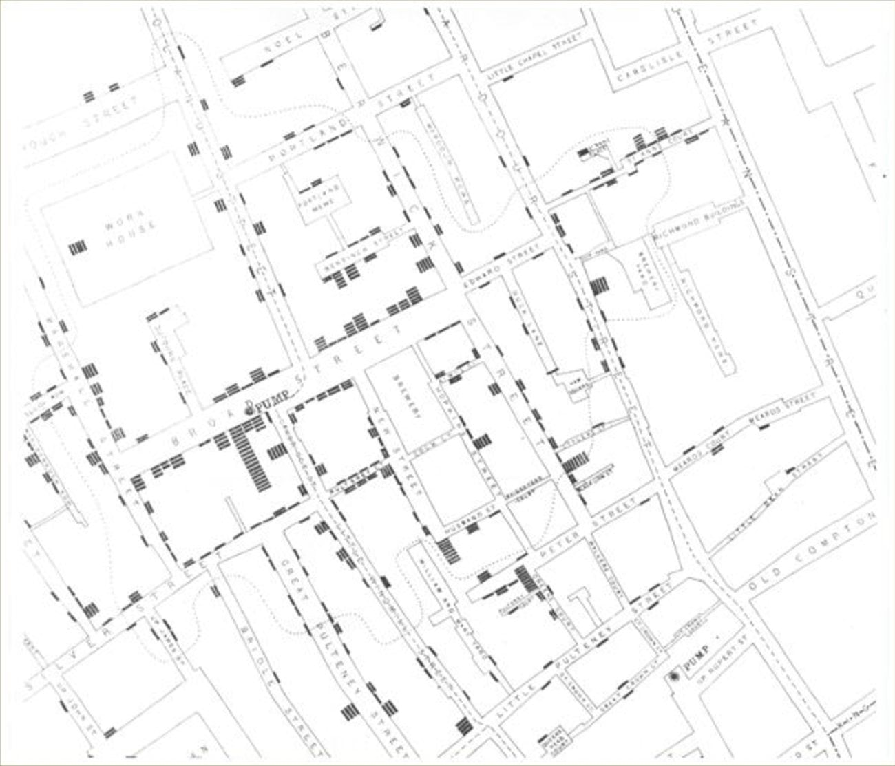

<!--

author:   Elizabeth Drellich
email:    drelliche@chop.edu
version:  1.0.0
module_template_version: 2.0.1
language: en
narrator: UK English Female
title: Module Title
comment:  This module is a brief introduction to geospatial (location) data.
long_description: This module will survey some of the benefits of using geospatial data for research purposes. No previous exposure to geospatial data is expected. If you have any interest in maps or are wondering if using geospatial data might be helpful for your work, this lesson is designed to help you decide whether learning more about geospatial techniques is right for you and your project.
estimated_time:  20 minutes

@learning_objectives  

After completion of this module, learners will be able to:

- Identify geospatial data
- Describe some of the benefits of using geospatial data
- Recognize some of the issues you may encounter when using geospatial data

@end

link:  https://chop-dbhi-arcus-education-website-assets.s3.amazonaws.com/css/styles.css

script: https://kit.fontawesome.com/83b2343bd4.js

-->

# Demystifying Geospatial Data

## Overview
@comment

**Is this module right for me?** @long_description

**Estimated time to completion:** @estimated_time

**Pre-requisites**: none

**Learning Objectives**

@learning_objectives

## What is Geospatial Data?

If you have ever look at a map, followed GPS directions, or even just used a cell phone to check the time, you have used geospatial data.

**Geospatial Data** is any data that includes information about the location of an object or event on the Earth. We think of these locations as being on the Earth's surface, but they might actually be a bit above the surface, like weather or airplane flight paths, or below, like oil deposits.

### Classic example: London's 1854 Cholera Outbreak

In the mid 1800s, the modern idea of germ theory was still in its nascent stages, one of several competing ideas about how diseases spread. Learning how diseases spread, cholera in particular, was of great concern because cholera was traveling along global trade routes to become a pandemic.

Ultimately it was determined that cholera is an infection caused by a water-born bacteria, [Vibrio cholerae](https://www.who.int/news-room/fact-sheets/detail/cholera). How did scientists figure out that cholera was spread by water? Using geospatial data!

In 1854, the city of London experienced an outbreak of cholera, with a particularly high number of cases among people who lived in near Broad Street in the Soho district. London kept good records of deaths so doctors, including one named John Snow, were able to put all of the cholera deaths on to a neighborhood map, shown below:

This map marks each cholera death as a dark bar at the deceased's address. If an address has multiple deaths from cholera, the bars stack to form a version of a bar graph.

One ([fictional](https://www.esri.com/arcgis-blog/products/arcgis-pro/mapping/something-in-the-water-the-mythology-of-snows-map-of-cholera/)) version of this story says that Dr. Snow created this map and had a "eureka" moment! On seeing the map he knew that the center of this area was a particular water pump, and heroically removed the handle of the pump preventing any more people from accessing the infected water and halting the spread of disease.

In reality, while he did identify the water pump as a possible source of the outbreak, Dr. Snow informed the local authorities who removed the pump about a month after the outbreak started. The map wasn't created until later when Dr. Snow was trying to prove his hypothesis about the pump.

He also created a second map, which added a dotted line showing which addresses were closer to that water pump than any other pump. This map shows that almost all of the cholera deaths were of people who not just lived near that pump, but likely used that pump to get their water.

### More than Maps

While maps can be an extremely effective way to display geospatial data, not all geospatial is easily represented by maps, nor are maps the most effective way to study some questions.

For example, a [study by the CHOP Policy Lab](https://link.springer.com/content/pdf/10.1007/s11524-022-00633-7.pdf) used geospatial data both about patient addresses and the locations of trees and other vegetation throughout the city of Philadelphia to study whether living near green spaces impacts the number of exacerbated asthma attacks experienced by children.

While this study relies heavily on geospatial data, including "satellite imaging and high resolution groundcover data," it doesn't produce any maps. Instead, the researchers process the location information they have about both patient addresses and the geographic location of greenery to find relationships between living near vegetation and exacerbated asthma.

## The power of geospatial data

All data has the capacity to illuminate, communicate, and effect change. Geospatial data is particularly useful for certain types of population analyses as all of us are impacted by our environments.

### Geographic connections

Because geospatial data asks the **where**, using it can help answer all sorts of questions that could otherwise not even be asked. Geospatial data lets you make all sorts of connections that might not otherwise be visible.

**Social determinants of health**

According to the [World Health Organization](https://www.who.int/health-topics/social-determinants-of-health#tab=tab_1):
> The social determinants of health (SDH) are the non-medical factors that influence health outcomes. They are the conditions in which people are born, grow, work, live, and age, and the wider set of forces and systems shaping the conditions of daily life. These forces and systems include economic policies and systems, development agendas, social norms, social policies and political systems.

Many social determinants of health are connected to a person's geographic location. During the 1854 London cholera outbreak, which water pump someone relied on ended up being the key determinant of whether they were exposed to the deadly bacteria.

### Effective interventions

If researchers can determine where a phenomenon is occurring, it can help them come up with more effective interventions for improving health outcomes. For example the study of how green spaces impact exacerbated asthma attacks doesn't just use geospatial data as an input, it also could produce output like "plant more trees in these neighborhoods."

Even if doctors had known in 1854 that cholera was water born, without the geospatial analysis they wouldn't have been able to recommend turning off just the one affected pump. This targeted intervention was only possible because they were able to determine which pump was infected, and far more effective than if they had turned off all of the pumps in the neighborhood, making people walk much farther to obtain water.

### Impactful communication

While not all geospatial data is amenable to being portrayed with maps, maps can be visually striking ways to present and communicate lot of geospatial data.

Identifying a problem, and even finding an effective solution to it, isn't enough. Researchers need to be able to communicate their findings and recommendations to those who can do something about it. Your audience might be the general public, or politicians and policy makers responsible for making changes.

## Issues impacting geospatial data

Now that you are convinced of the value of using geospatial data, we must unfortunately warn you of some of the issues you may come across.

Two hundred years ago, maps were drawn by hand and even the most accurate surveyor using the most accurate tools could not match the accuracy of modern Global Positioning Systems (GPS).

While GPS has greatly improved the quality of geospatial data, it is still not perfect and can have the same sorts of missing and nonsensical fields as any data set. For example, [Philadelphia records of police stops](github_link) record some small portion of stops as occurring in Cape Canaveral, Florida, approximately a thousand miles away.

The abundance of geospatial data created by modern systems also creates new problems. While it might seem like more data is always better, even the most high powered computer can only handle so much data at a time.

A single weather forecast, for example, incorporates a huge amount of real-time geospatial data, most of it recorded by satellites in low orbit around the Earth.

Of course there is far more location data than that collected by satellites.

### Privacy

As with all data, privacy and ownership of people's geospatial data is an important consideration. You might be personally aware of how much location data your devices, like your cell phone, are recording.

**Patient and participant privacy**

The maps of cholera deaths from 1854 might not contain the names of the individuals who died, but they do contain enough information to reconstruct a pretty good picture of which individuals are represented simply by looking at who lives, or lived at each address. As a researcher using geospatial data, you have additional responsibility to keep data private.

One way to do that is to only publishing location data in aggregate. For example you might take patient addresses and only record which postal code or other larger geographic region they are in.

Another method to preserve privacy is called **jittering**. Jittering means adding a small amount of random noise to the real location data so that the jittered data are close to, but not exactly in, their true locations. With this method you can publish maps and data that look like they disclose individual addresses, but don't actually show where individuals truly live.

Here is a map from a [CHOP Policy Lab article](https://www.sciencedirect.com/science/article/pii/S1876285922001814?via%3Dihub) on how neighborhood social context might increase or decrease the stress levels of mothers of young children.

While the **Participant Address** locations might appear at first glance to give away exactly where each participant lives, the image caption is reassuring: "Participant locations were randomly jittered and enlarged to ensure confidentiality."

An internal review board, funding agency, or local law may lay out how you are required to anonymize and protect location data in your research. Be sure to follow all required steps to protect personal data when conduction research with geospatial data!

### Expense

While there are a number of open source tools to process and analyze geospatial data, like `ggmap` in R or `geopandas` in Python, the most powerful tools for geospatial data are proprietary Geographical Information Systems (GIS).

If your research leads you to need more complex geographical information like elevation gradients or travel routes, you may eventually want to learn more about some of the paid platforms.

## Quiz

Which of these types of information are considered geospatial data? Select all that apply.

[[X]] The neighborhood that study participants live in.
[[X]] The locations of public swimming pools in a city.
[[ ]] The ages of study participants who came to a particular testing location.
***

Location information doesn't have to be as precise as an address to be useful, knowing what neighborhood study participants live in is definitely geospatial data. The location of public amenities like swimming pools is also geospatial data.

While you might link ages of study participants to the locations in which they were evaluated, the ages themselves are not inherently geospatial.

***

Which of these are potential benefits of incorporating geospatial data into your research? Select all that apply.

[[X]] Geospatial data can help illuminate social determinants of health.
[[ ]] All of the best and most powerful tools for studying geospatial data are free and open source.
[[X]] Geospatial data can help you figure out where to best locate services like clinics.
***

Incorporating geospatial data into your research can both help identify social determinants of health and figure out appropriate locations for intervention services.

While some free open source tools for studying geospatial data exist, the most powerful tools are proprietary.

***

Which of these potential issues should you be aware of when considering using geospatial data in your research? Select all that apply.

[[ ]] Geospatial data is sparse and generally unavailable.
[[X]] The privacy of study participants addresses and other location data must be carefully protected.
[[ ]] Politicians, policy makers, and the public generally have a harder time understanding results of research that relies on geospatial data.
***

Geospatial data is very rich and while not all of it is publicly available, there are abundant sources of it. It is partially because there is so much geospatial data generated all the time that privacy is of extra concern. Despite the privacy concerns, maps made from geospatial research can be extremely powerful tools to communicate your results to wider audiences.

***

## Additional Resources

The last section of the module content should be a list of additional resources, both ours and outside sources, including links to other modules that build on this content or are otherwise related.

## Feedback

In the beginning, we stated some goals.

**Learning Objectives:**

@learning_objectives

We ask you to fill out a brief (5 minutes or less) survey to let us know:

* If we achieved the learning objectives
* If the module difficulty was appropriate
* If we gave you the experience you expected

We gather this information in order to iteratively improve our work.  Thank you in advance for filling out [our brief survey](https://redcap.chop.edu/surveys/?s=KHTXCXJJ93&module_name=%22Demystifying+Geospatial+Data%22)!
