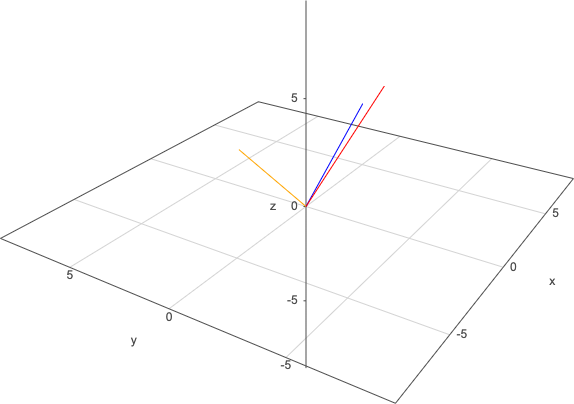

<!--

author:   Joy Payton
email:    paytonk@chop.edu
version:  1.0.0
current_version_description: Initial version
module_type: standard
docs_version: 1.0.0
language: en
narrator: US English Female
mode: Textbook

title: Demystifying Large Language Models

comment:  Learn about large language models (LLM) like ChatGPT.

long_description: There's lots of talk these days about large language models in academia, research, and medical circles.  What is a large language model, what can it actually do, and how might LLMs impact your career?  Learn more here!

estimated_time_in_minutes: 30

@pre_reqs
This module does not require any particular knowledge.  
@end

@learning_objectives  
After completion of this module, learners will be able to:

- Define "large language model" (LLM) 
- Give a brief description of n-grams
- Give a brief description of a neural network
- Give one example of a task that an LLM could do that could advance a biomedical project or career
- Give one example of a caveat or pitfall to be aware of when using an LLM

@end

@version_history 
No previous versions.
@end

import: https://raw.githubusercontent.com/arcus/education_modules/main/_module_templates/macros.md
-->

# Demystifying Large Language Models

@overview

## Large Language Models: Definitions

Large language models (LLMs) like [ChatGPT](https://openai.com/chatgpt) or the [Bing AI Chatbot](https://chat.bing.com) are getting a lot of attention these days.  The three words tell us in broad strokes what LLMs are.  They are:

* **Large**. Very large, in fact, with billions of parameters (numerical values that act as knobs for tuning the math that takes place within the model)
* **Language** related.  They take language as input and give language as output.
* **Models**.  They attempt to predict, or model, desired behavior.  In this case that means they try to generate what would be a likely result in the real world if real people generated the text output for the given input.

LLMs can generate language (human language and even computer language) that appears to be written by human intelligence.  In fact, we can even ask LLMs to explain themselves, and the resulting text is well-composed and realistic.  That's what we'll try on the next page!

### What Do They Say About Themselves?

When given the prompt, "briefly explain, in three to five sentences, what a large language model is and how it can be used in biomedical research," this is what [ChatGPT](https://openai.com/chatgpt) offered:

> A large language model, such as GPT-3, is an advanced artificial intelligence model designed to understand and generate human-like text based on the patterns it learns from vast amounts of training data. In biomedical research, these models can be used to analyze and generate text related to medical literature, clinical trials, patient records, and scientific articles. They can assist researchers in tasks such as information extraction, summarization, literature review, and even generating hypotheses by synthesizing existing knowledge. By leveraging their language processing capabilities, large language models can accelerate research, improve data analysis, and aid in decision-making processes in the biomedical field.

[Bing AI Chatbot](https://chat.bing.com) replied (and included footnotes!):

> Large language models (LLMs) such as GPT-3 have the potential to revolutionize biomedical research by helping scientists quickly and accurately analyze vast amounts of data. One of the most promising applications is in natural language processing (NLP) of biomedical literature. LLMs can efficiently navigate through the scientific literature, assisting researchers in literature reviews and information synthesis^1^. They can also be used to understand biomedical text^2^.  Learn more: 1. blog.bionl.ai 2. labs.feinberg.northwestern.edu 3. link.springer.com

<b style="color: rgb(var(--color-highlight));">Important note</b> 

**In this module, we will always disclose when we're using an LLM to generate text**.  
  
The use of LLMs to generate text in science and education is a controversial issue. Some proponents of these tools point out that using LLMs can help equalize access to language.  For example, LLMs can provide sample language to people who need to write an abstract or proposal in a language that they lack native fluency in.  Others indicate that LLMs can speed up routine tasks that require just a quick review of accuracy, like summarizing a manuscript for a lit review. However, there are also critics who believe that using LLMs to generate text is essentially plagiarism or even scientific misconduct.
  
We're not here to advocate for a particular stance in the ethical disputes around LLMs, but we do think that it's only fair to let you know when the text you're reading has been generated by a sophisticated model.

We'd disagree with some of the AI-generated explanation of large language models you just read.  For example, the use of the word "understand" seems to indicate cognition and subjectivity, which artificial intelligence lacks. Additionally, the use of the word "learns" can be misleading.  

### A Human Definition

Can large language models "learn" and "understand"?  Not in the way humans do!

"Learning" in AI (at least for now) means consuming enormous amounts of text and discovering how words interact with each other.  It's a study of mathematical probability and patterns, not meaning.  

Consider, for example, that a human (you, for example) can analyze geometric patterns and make good guesses as to what should appear next in a sequence, without attributing meaning to those symbols.  You could, with practice and some systems of tracking what you've seen so far, be able to predict what symbol would make sense in a pattern and what would be out of place.  Similarly, large language models can analyze the complex symbolic system of human language and make very good predictions of a realistic pattern, without any cognition or true understanding.

ChatGPT and Bing AI can imitate, thanks to their exposure to many types of text, what kinds of words and what kinds of word patterns emerge in definitions and descriptions of technology. They also can predict what kinds of words are associated with the phrase "biomedical researchers".  They aren't mulling over meaning, however, they are pattern matching.  The importance of this distinction is crucial. **These powerful tools are not modeling reality or truth, they are modeling language**.  

A Human-Generated Definition 
------

Given what we've discussed so far, we'd propose a definition for biomedical researchers that is a bit more humble:

Large language models are predictive systems that, after having analyzed huge volumes of text, are able to generate realistic texts that closely mimic human language.  They excel at imitating the form of language, that is, patterns of words and grammar, punctuation, word difficulty, and text length, all without having conceptual understanding of the meaning of the language they are generating.  Because of their accurate depiction of the form of human language, LLMs are useful for generating sample texts that may or may not be truthful.  Researchers may choose to use these tools to accelerate language tasks like literature reviews and abstract generation, but should disclose their use of these tools and be careful when it comes to trusting the accuracy of LLM-generated text. 

## How Do LLMs Work?

We know what an LLM is -- a system that mimics human language.  How did these LLMs come to be?  How did they become so good at imitating language, to the degree that they almost seem to have understanding and cognition?  To understand how LLMs came to be, we'll start by introducing just a bit of natural language processing (NLP).  We'll then move into neural networks and deep learning.

<b style="color: rgb(var(--color-highlight));">A little encouragement...</b> 
The next two pages may feel a bit dense.  If you don't need to know the history of large language models, and just want to jump ahead to the "what now" part of the module, you can just skim these pages. 
  
We'll add a **"TL;DR"** ("too long, didn't read") summary to the top of each page so you can get the main points.
  

### Natural Language Processing

<b style="color: rgb(var(--color-highlight));">Important note</b> 
As promised, here's the TL;DR of this page:

* **N-grams** are strings consisting of n words. "Mary had a little" is a 4-gram, for instance.
* Being exposed to lots of n-grams in language is useful for predicting an upcoming word (e.g. "lamb").
* Advances in language modeling required the use of neural networks.

A **natural language** is a language used to communicate by humans among themselves, like English or Swahili or Cantonese.  **Natural language processing** or NLP is the computerized analysis of natural language.  NLP includes tasks of trivial complexity, such as calculating word frequency in documents, as well as complex tasks such as predictive text generation.  NLP is a type of computing that falls under the large umbrella of "artificial intelligence", or AI.

In this module we'll talk only about **language models**, which are systems build to predict or generate text.  We won't address the many other areas of NLP which can be interesting to biomedical researchers, such as **named entity recognition** (for example, looking through clinical notes to find mentions of symptoms or illnesses that belong to an ontology such as SNOMED), **part of speech tagging** (measuring pronomial underuse in the language generated by autistic subjects), **sentiment analysis** (predicting depression risk related to patients' writing), etc. 

Heuristic Models
------

Early language models were **heuristic**, or rules-based systems. For example, [ELIZA](https://dl.acm.org/doi/10.1145/365153.365168), an early model of therapeutic language, had a rule on how to respond to texts that lacked keywords that would ordinarily be used to guide the automated reply. "Please go on" was one potential response.

N-grams
-----

Later, language models relied on statistical probability, and aimed to predict the next word given a string of previous words, an **n-gram**. The letter **n** here, as in many places, is a number. A bigram, for example, is a sequence of two words, and a trigram a sequence of three words.  Larger numbers of words in a sequence are usually called by the number: 5-grams, 10-grams, and generically as n-grams.  N-grams proved very useful in language prediction, because the probability of selecting the next word in a series goes up as the number of lead-in words goes up.

For example, can you predict the next word of a text if the preceding word is "and"?  It's very unlikely you'd guess correctly.  What about the word following "and they"?  You might guess (correctly) that the next word is a verb or part of a verb phrase, but which one? "And they are," "and they will," "and they thought," etc. are all reasonable guesses.  

What if we provided the text, "and they lived happily"? If you've been exposed to English since childhood, you might be able to guess (correctly) that the next word is "ever." 

Vectorizing Models
---

Another way of predicting language relies on thinking of words as **vectors**.  

Imagine a 3D space with three axes.  A vector would consist of an arrow beginning at the origin, the intersection of the axes, and ending at a specific point in three-dimensional space.  Vectors can be similar, because they end at points that are close together and the angle formed between the two vectors is small.  Or they can be very different because they are opposite one another, with a large angle between them. 

In the image below (thanks to [https://academo.org/demos/3d-vector-plotter/](https://academo.org/demos/3d-vector-plotter/)), there are two vectors that are quite similar, the red and the blue vectors.  The orange vector appears to be orthogonal to the others and is therefore less similar.

Words can be thought of as being vectors occupying n-dimensional space. These dimensions aren't attributes we could quickly summarize like "animal relatedness", or "degree of pleasant connotation" but consist of dimensions that are modeled computationally based on analyzing words that appear in similar contexts or are related in some way in training text. 

For example, in our image of the three vectors above, maybe the blue vector is the word "insect", the red vector is the word "bug", and the orange is the word "elevator".  In reality, these vectors would be in a highly dimensional space, with the number of dimensions much greater than three!

Words are modeled as multidimensional mathematical objects, which in turn enables language models to go beyond statistically predicting output text just based on how many times a particular n-gram appeared in training text.  Words have features that can be measured, and this allows for prediction that includes an understanding of word similarity.  

At this point in language modeling, we're using fairly sophisticated systems called **neural networks** to model words as vectors.  Let's talk about those systems next.

### Neural networks

<b style="color: rgb(var(--color-highlight));">Important note</b> 
As promised, here's the TL;DR of this page:

* **Neural networks** are systems with lots of small calculations using **weights** that interact with one another to result in a final prediction.  A neural network (also known as a **deep learning** model) consists of an input layer, hidden layers, and an output layer.
* **Transformers** revolutionized language neural networks because they allowed easier access to context clues from further back in text than an n-gram allows.  Today's LLMs rely on transformers.

Trial and Error
---

To understand neural networks, it's important to know that in machine learning (whether that's in a neural network or in another type of algorithm), there's a lot of trial and error.  In machine learning, the speed of calculation that a computer can offer allows the computer to try thousands of different values for the coefficient of a predictor variable, for example.  This allows the computer to determine which value ends up being the best coefficient, and do that for many different predictor (input) variables.

Neural networks take this power of trial and error and massively expand it. Neural networks are an attempt to in some way replicate the role of neurons in a brain. Various nodes (neurons) receive input, perform some mathematical transformation on that input, and either "fire" (pass some output on to a next step) or not depending on whether the result of the calculation passes a certain threshold.  Each node starts off with random weights that determine how to mathematically transform the data it receives, and the computer tries many combinations of different transformations of data to see which ones are the most accurate. 

An Example
-----

Let's consider a binary question.  Will a given person buy takeout for dinner?  Given seven input variables, you want a single outcome: 1 for "yes, they will get takeout" and 0 for "no, they will not get takeout."

In this image (created thanks to [http://alexlenail.me/NN-SVG/index.html](http://alexlenail.me/NN-SVG/index.html)), the leftmost column of circles represent **inputs**.  Maybe one input is an individual's level of tiredness, another is the number of days they have had takeout in the last week, a third input could be the number of leftovers in the person's fridge.  These inputs are scaled and normalized.

Lines of various intensity show the **weights** (think of them like coefficients in an equation) that each of these inputs contribute to ten nodes in the **hidden layer**, which is a set of nodes between input and output. The darker the line, the heavier that input is weighted for that node's calculation. Some nodes might heavily consider one's previous takeout habits, for example, while others disregard it entirely. Each hidden layer node calculates the sum of all its weighted inputs, and each one comes up with its own unique answer.  
Then, each node in the hidden layer either fires (sends output) to the next layer, which is our output layer, or it doesn't (for example, one node in the hidden layer doesn't reach a threshold of activation, so it doesn't fire).  The output layer also uses weights to calculate how much each hidden layer node contributes to its calculation.  Then a sum is calculated, and the final prediction is made: "yes, they will order takeout," or "no, they will not."

This prediction is checked for accuracy on a set of labeled data (maybe data on 500 people who either got takeout or did not).  Then, the weights are changed, and **that** set of weights is evaluated for accuracy.  Over time, after much repetition, the weights reach a point in which additional tweaking doesn't improve performance any more, and the final set of weights is set.  Now we have a model!

The model depicted above has only one hidden layer between input and output, but there can be an arbitrary number of hidden layers.  We can think of the number of hidden layers in a neural network as its "depth".  As neural networks gained more and more layers, the term **deep learning** emerged to describe these increasingly complex models.

Transformers
---

The way we think about language as humans doesn't just rely on the last few words we heard or read.  We don't have a simple four, five, or 100 word buffer or sliding window that we use to predict language.  We keep in mind the theme of the conversation or the literary genre we're reading or the overall reading level of a text.  We remember that the text is a question, an assertion, a shouted curse, or a song.  We hold context clues in mind, even long after these clues appeared. This can be referred to as "attention." 

The ability for language models to maintain attention to relatively distant context clues was necessary for language models to become more human-like.  After a few different attempts to make neural networks able to "look back" at prior context (such as recurrent neural networks or RNNs), a new, more efficient method to keep distant clues salient to prediction was developed.  This new algorithm was called a [transformer](https://arxiv.org/pdf/1706.03762.pdf), and from 2017 forward, language models became efficient enough to allow for many more parameters and became truly large.  There's some dispute about what could be called the first true LLM, but contenders include ELMo (Embeddings from Language Model) from 2017, GPT-1 (Generative Pre-trained Transformers-1) from 2018, and BERT (Bidirectional Encoder Representations from Transformers), also released in 2018.

## LLM Costs and Risks

Over time, with advances in the speed and size of computer processors (especially Graphical Processing Units, or GPUs), faster and more efficient data storage, and competition among cloud providers, computing has become less expensive.  That means that tasks can be performed today that would have been unrealistic (in terms of time and expense) to perform a few years ago.  That's true across computing, and it's certainly true in artificial intelligence.  But "less expensive" doesn't mean free.  Large language models are incredibly resource intensive, in terms of the amount of input required, the amount of computing required, and the energy consumed in building and running the models.

We're going to borrow a framework from Weidinger et al.  In ["Ethical and social risks of harm from Language Models,"](https://arxiv.org/abs/2112.04359) Weidinger and her co-authors cite six domains of risks, harms, and costs associated with large language models.  We summarize these risks below (and note, we have avoided the temptation to ask a large language model to summarize the text for us):

1. Discrimination, exclusion, and toxicity
-----

Where can one obtain huge amounts of text, generated by humans, for free?  The internet!  Language models and their abilities to predict text have grown in part because of better, faster, cheaper computers, but also in part because of the massive proliferation of human-generated text that can be analyzed.  Unfortunately, this set of language is biased in terms of who generates it and the opinions they share.  Toxic language and stereotypes abound, and these have already been documented in text generated by LLMs.

2. Information Hazards
------

Because the training data given to LLMs is so vast, there are cases (some involving litigation) of private information such as home addresses being leaked by LLMs responding to probing prompts.  While the authors do not explicitly mention this, another information hazard we want to point out is the risk of disclosing private or regulated information to an LLM via prompts.  One of the ways that LLMs acquire additional language samples is by adding the prompts that users supply to their vast collection of language examples.  Supplying private information when asking LLMs to generate text could constitute an impermissible breach of privacy or violation of intellectual property law or other regulation.

3. Misinformation Harms
---

4. Malicious Uses
---

5. Human-Computer Interaction Harms
---

6. Automation, Access, and Environmental Harms
---

## An AI-Generated Quiz

Large language models respond best to well crafted input texts, or prompts.  Consider this prompts, which we gave to ChatGPT: 

"Create a quiz question about n-grams."

> Question: What is an n-gram in natural language processing?  
>A) A single word or character in a text. 
>B) A sequence of n words or characters in a text. 
>C) A statistical measure of word frequency in a text. 
>D) A technique to analyze the grammatical structure of a sentence.  
>Please select the correct option (A, B, C, or D).

That's too easy!  Here's a better one, created by ChatGPT in response to the prompt "Create a multiple choice quiz question about n-grams and how they are used in predicting language."  Please do try and answer it!

Which of the following statements best describes n-grams and their role in predicting language?

[( )] N-grams are numerical values assigned to words in a language, used to predict their frequencies in a given text.
[(X)] N-grams are sets of adjacent words or characters in a text, used to analyze patterns and predict the likelihood of specific words or phrases.
[( )] N-grams are complex algorithms used to predict the syntax and grammatical structure of sentences in a language.
[( )] N-grams are specialized dictionaries used in natural language processing to identify and categorize words based on their semantic meanings.
***

**This explanation of the answer was created by a human, not by ChatGPT.**

N-grams aren't numerical values, algorithms, or dictionaries. The correct answer is that n-grams are sets of adjacent words or characters (in fact, n consecutive words), used to analyze patterns and predict the likelihood of specific words or phrases.  

***

When prompted, "Create a multiple choice question with several correct answers that asks 'which of the following are true statements about large language models'", ChatGPT gave us the following, which we'd like you to answer:   

Which of the following are true statements about large language models? (Select all that apply.)

[[X]] A) Large language models are trained on vast amounts of text data.
[[X]] B) They utilize deep learning techniques, such as neural networks.
[[X]] C) These models can generate coherent and contextually relevant text.
[[ ]] D) They require minimal computational resources for training and inference.
[[ ]] E) Large language models have the ability to understand and interpret human emotions.
[[X]] F) They have been instrumental in advancing various natural language processing tasks.
***

This time, we asked ChatGPT to explain the answers.  We added emphasis like **bold** text: 

>Here's a brief explanation for each statement:
>
>**A) Large language models are trained on vast amounts of text data.**
>This statement is **true** because large language models require substantial amounts of text data to train effectively. The models learn from billions of sentences or documents to capture the diverse patterns and structures of language.
>
>**B) They utilize deep learning techniques, such as neural networks.**
>This statement is **true** because large language models typically employ deep learning techniques, particularly neural networks. Neural networks are powerful models that can learn complex representations of language and are commonly used in training large language models.
>
>**C) These models can generate coherent and contextually relevant text.**
>This statement is **true** because large language models have demonstrated the ability to generate text that is coherent and contextually relevant to a given prompt. They analyze the input context and use the patterns learned during training to produce text that follows grammar rules and makes sense in the given context.
>
>**D) They require minimal computational resources for training and inference.**
>This statement is **false**. Large language models, such as GPT-3, actually require substantial computational resources for both training and inference. Training such models involves processing huge amounts of data and performing multiple iterations of training, which demands significant computational power. Similarly, generating text or performing inference with large language models is computationally intensive.
>
>**E) Large language models have the ability to understand and interpret human emotions.**
>This statement is **false**. While large language models can generate text that appears to understand emotions to some extent, they lack true understanding and interpretation of human emotions. The models do not possess emotions themselves but instead learn statistical patterns from the training data to generate text that can evoke emotional responses.
>
>**F) They have been instrumental in advancing various natural language processing tasks.**
>This statement is **true**. Large language models have made substantial contributions to advancing natural language processing tasks. They have achieved state-of-the-art performance in various tasks such as machine translation, text summarization, sentiment analysis, question answering, and language generation. These models have significantly improved the capabilities of language understanding and generation systems.
>
>These explanations clarify why each statement is either true or false based on the characteristics and capabilities of large language models.

We checked the questions and answers for accuracy, and we think you'll agree that these are high-quality questions and explanations!

***

We asked, 'Please create a multiple choice question that asks about the types of harms listed in Weidinger's article "Ethical and social risks of harm from Language Models."'.  The Bing AI Chatbot gave us this:

What are the types of harms listed in Weidinger’s article “Ethical and social risks of harm from Language Models?”

[( )] A. Harms to privacy 
[( )] B. Harms to autonomy 
[( )] C. Harms to democracy 
[(X)] D. All of the above
***

***

