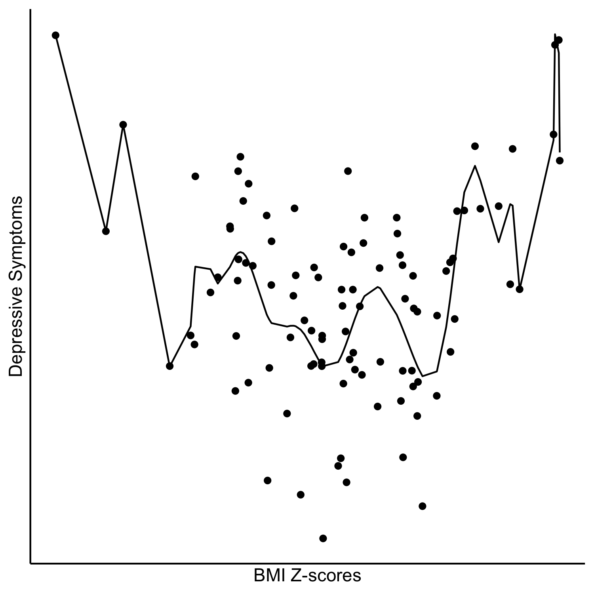
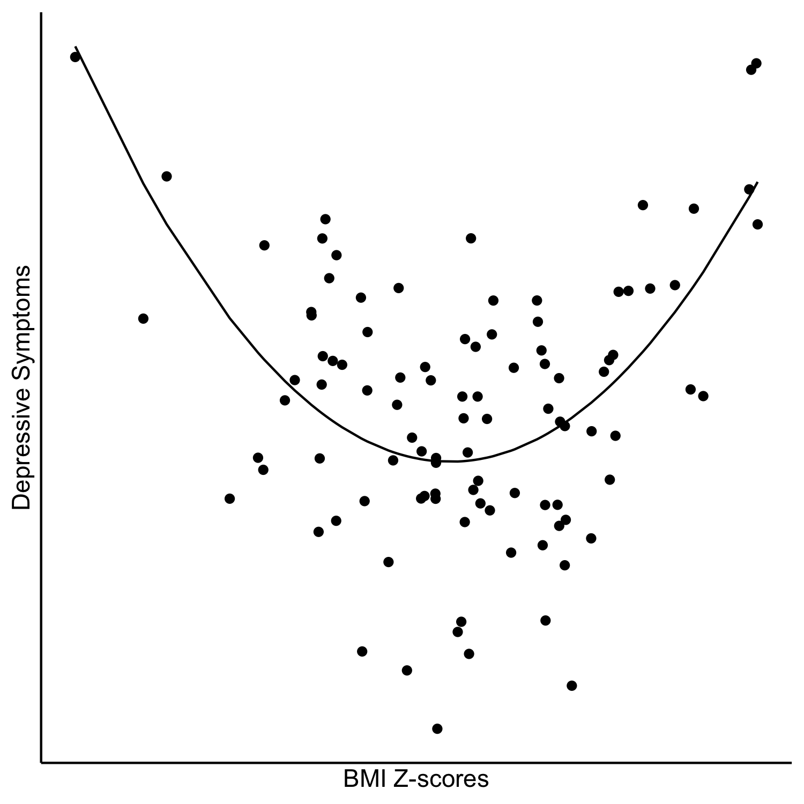

<!--

author:   Rose Hartman
email:    hartmanr1@chop.edu
version:  0.0.1
module_template_version: 2.0.0
language: en
narrator: UK English Female
title: Demystifying Machine Learning
comment:  This is a short, focused description of the module.
long_description: This is a longer description, which should be understandable for a lay audience. It will print under "Is this module right for me?" in the overview.
estimated_time: This is rough guess of how long it might take a learner to work through the module. It will print under "Estimated time to completion" in the overview

@learning_objectives  

After completion of this module, learners will be able to:

- list at least three potential applications of machine learning in biomedical science
- explain the bias-variance tradeoff
- describe three different statistical problems models can address and how they differ (e.g. prediction, anomaly detection, clustering, dimension reduction)
- describe some potential dangers of working with big data

@end

link:  https://chop-dbhi-arcus-education-website-assets.s3.amazonaws.com/css/styles.css

script: https://kit.fontawesome.com/83b2343bd4.js

-->

# Demystifying Machine Learning

<div class = "overview">

## Overview
@comment

**Is this module right for me?** @long_description

**Estimated time to completion:** @estimated_time

**Pre-requisites**

List any skills and knowledge needed to do this module here. When available, include links to resources, especially other modules we've made (to show learners where this falls within our catalog).

* one skill we have [another module for, linked here](https://education.arcus.chop.edu)
* some familiarity with [a topic](https://education.arcus.chop.edu)
* understanding of [one thing](https://education.arcus.chop.edu) and [another](https://education.arcus.chop.edu)

If relevant, you can include recommendations for somewhere else to start if the learner doesn't have these prereqs. For example: If you are brand new to R or python (or want a refresher) consider starting with [Intro to R](link) or [Intro to python](link) first and then coming back here.

**Learning Objectives**

@learning_objectives

</div>

## What exactly is machine learning?

Machine learning is a general term used to describe a range of different techniques to find and use patterns in data, especially large and messy data.
In particular, it refers to **algorithms whose performance improves as they are given more data** --- that's why it's called "learning".

Machine learning is a complex field that shares a lot of overlap with other topics, which can make it difficult to know what machine learning even is, let alone how to do it.

We'll start here by talking about how machine learning differs from other closely related fields like statistics and artificial intelligence.

![One stick figure holding a large paddle stands on what looks like a compost pile with Greek letters, numbers, and matrices mixed in. There is a large data funnel on one side and an answers box at the other. A second person approaches and says, "This is your machine learning system?" The first person responds, "Yup! You pour the data into this big pile of linear algebra, then collect answers on the other side." The second asks, "What if the answers are wrong?" The first answers, "Just stir the pile until they start looking right."](https://imgs.xkcd.com/comics/machine_learning.png "[Machine Learning](https://xkcd.com/1838/) comic by xkcd, [used with permission](https://xkcd.com/license.html).")

### Machine learning vs. artificial intelligence

Artificial intelligence (AI) is a broader category that includes things like machine learning, but also other tools like computer vision and neural networks.

AI is any computer system that seeks to mimic (or out-perform) human capabilities.
Machine learning is one example of this --- extracting patterns and making predictions from data is a lot of what human cognition is all about --- but not all AI can be described as machine learning.

<div class = "learn-more">
<b style="color: rgb(var(--color-highlight));">Learning connection</b><br>

To read more on this topic, check out this [blog post on the distinction between AI and machine learning](https://ai.engineering.columbia.edu/ai-vs-machine-learning/).

</div>

It's common in some publications to see machine learning approaches described as "artificial intelligence" rather than machine learning per se.
That's fine, and it's technically correct --- all machine learning models are examples of AI.

And some AI systems may include machine learning components in addition to other aspects of AI.
For example, [driverless cars rely on machine learning algorithms to process their environment and make predictions](https://www.bu.edu/articles/2021/self-taught-self-driving-cars/), but driving a car safely requires other tasks, like route planning, that are still examples of AI without really being machine learning.


### Machine learning vs. statistics

Machine learning is often based on classic statistical models (especially regression), but machine learning differs from more classic statistical tests in a few important ways:

The way you solve the equation
---

Statistical tests are (usually) **computationally tractable**, meaning given enough time and knowledge of matrix algebra you could theoretically work out the results with a pencil and paper.
In contrast, machine learning relies on tools like maximum likelihood estimation to "brute force" solutions by **iteratively fitting solutions** and checking them to identify the best one.
You need a computer to do machine learning, but you don't necessarily need one for statistics.

The kind of data you apply it to
---

Most statistical tests are intended for relatively **small datasets** (no more than a dozen or so variables, and usually no more than hundreds or thousands of observations).
It's possible to run many classic statistical tests on large datasets, but that's not the use they were designed for.
Machine learning algorithms, on the other hand, were built for **large and messy data**.
When you have a lot of variables to analyze and a lot of observations, machine learning may provide solutions that are quicker, more robust, and actually easier to interpret than more traditional statistical tests.

Moreover, many machine learning approaches actually won't work if your dataset is too small --- if you don't have enough information in the data, your machine learning algorithm may not be able to converge and you'll get no results at all.

Inference vs. prediction: A subtle distinction
---

Statistical tests are generally designed for **inference** --- you measure relationships in your sample in order to infer something about the relationships in a larger population.
Machine learning models are designed for **prediction** and **generalization** --- you build a model on your sample with the intention of predicting outcomes in new data and/or generalizing patterns to new data.

This is a tricky distinction because, in practice, an analyst will often use a statistical model to infer something about the population of interest with the intention of making a prediction.

For example, you might assess the relationship between [measurements taken during a prenatal ultrasound and the eventual weight of babies at birth](https://pubmed.ncbi.nlm.nih.gov/3881966/) because you want to be able to say for a particular patient, "Given the measurements we're seeing for the fetus today, I'd say she's at the 50th percentile for weight right now."
You can't measure the fetus's weight directly, but you're making a prediction about it based on what you know about the relationship between weight and, for example, sonographic measurements of femur length.
We frequently make predictions based on the results of inferential statistical tests.

The key difference is that statistical methods start with inference (which you might then logically extend to make a prediction), but machine learning can start directly with prediction.
Machine learning does not necessarily infer anything about the population.
For example, we may eventually replace manual ultrasound measurements with a machine learning algorithm that can produce a fetal weight estimate from the images.
Some machine learning approaches would produce those predictions without actually telling us anything interpretable at all about how information in the ultrasound relates to fetal weight.

<div class = "care">
<b style="color: rgb(var(--color-highlight));">A little encouragement...</b><br>

If you read the section above and thought "I'm still not sure I understand how to tell machine learning from other kinds of statistics", don't worry; it's a distinction with a lot of grey area.
As the authors in this [article in Nature Methods](https://www.nature.com/articles/nmeth.4642) note, the boundary is not always clear:

>The boundary between statistical inference and ML is subject to debate --- some methods fall squarely into one or the other domain, but many are used in both.

</div>

## The bias-variance tradeoff

Machine learning covers a wide range of different analyses and techniques, but there is one idea that is central to pretty much any machine learning analysis: the bias-variance tradeoff.

But first, a quick note about how data are used in machine learning:

Because machine learning models "learn", the process of fitting a model to data is called **training**.

### What is variance, and what is bias?

Briefly, **variance** is how much your model fit changes depending on which data you happen to train them on.
You want to get variance as low as possible; if you were to reach a variance of 0 (this doesn't actually happen), that would mean your model was totally robust to changes in the randomly sampled data it was trained on.

**Bias** refers to how far off your predictions are from the underlying truth.
You also want bias to be as low as possible; if you have a bias of 0 (again, this doesn't actually happen), that means your model perfectly captures the real-life phenomenon that creates the data.

### An example

Imagine you had collected measurements of blood pressure and cognitive performance from a sample of patients (these are made up data).
Let's pretend that the true relationship between these variables in real life is perfectly quadratic (U-shaped), where medium blood pressure is associated with the best cognitive performance and blood pressure that is either too low or too high is associated with lower cognitive performance.

One way to model the relationship between these variables would be a plain linear relationship, as depicted in the scatterplot below.
There are only two parameters to estimate for a linear model like this: intercept and slope.

<div class = "learn-more">
<b style="color: rgb(var(--color-highlight));">Learning connection</b><br>

Looking for a review of what linear regression models are and how they work?
Check out [this tutorial on linear regression](https://education.arcus.chop.edu/ordinary_linear_regression/).

</div>

If you ran this study over and over, collecting data from new participants each time and always fitting a linear model, the exact parameter estimates for the model would change a little study to study (one time the slope might be -0.15, another time -0.21, then -0.17, etc.). That's the **variance**.
But there's also the fact that your model will always be systematically off because a linear model isn't a good approximation of the true relationship in the data; you'll always overestimate cognitive performance at very low and very high blood pressures.
That's the **bias**.


A better model for these data would be more complex; it would allow a curve in the trend line, which would require estimating more parameters.

<div class = "important">
<b style="color: rgb(var(--color-highlight));">Important note</b><br>

In general, as you increase the complexity of your model, you can lower the **bias**; in other words, you can get closer to the truth.

However, there's a point of diminishing returns.
If you make your model too complex and flexible, it will start to model random noise in your data, and this increases the **variance**.
In general, as models get more complex, variance increases.

</div>

Here are the blood pressure and cognitive performance data again, this time with a model that is much too complex --- if you estimated that model on a different sample, you could get wildly different results.



So that's the tradeoff:
If your model is not flexible enough, you'll have high bias.
But if it's too flexible, you'll have high variance.

A model that is not flexible enough is said to be **underfit**, and a model that's too flexible is **overfit**.

The goal of any machine learning analysis is to find a model that strikes the right balance between bias and variance, that's just the right level of complexity for the problem.
In this pretend example, we know the true underlying relationship is quadratic, so a quadratic model will be the one that hits the sweet spot between underfitting and overfitting.



Unlike the example here, in a real analysis we never know what the true underlying relationship is, and that makes it very hard to know if you're under- or overfitting.

**So how can you tell if your model is hitting a good balance between bias and variance?**

As you increase the complexity of your model, the fit will just get better and better on the training data, which could lead you to overfit.
That's why we separate out test data from the training data.

<details>

<summary> Want to see the R code that generated those plots? </summary>

```r
# generate fake quadratic trend data
n <- 100
set.seed(8675309)

# x is randomly sampled from a normal distribution
x <- rnorm(n=n, mean = 0, sd = 1)
# y is x squared, plus random noise
y <- -1*x^2 + rnorm(n=n, mean = 0, sd = 2)

# trend lines
linear <- predict(lm(y ~ x))
quadratic <- predict(lm(y ~ poly(x, 2, raw = TRUE)))
nthpoly <- predict(lm(y ~ poly(x, n-2, raw = TRUE)))

# put it into a data frame for plotting
df <- data.frame(x=x,
                 y=y,
                 l = linear,
                 q = quadratic,
                 n = nthpoly)

# plots
library(ggplot2)

base_plot <- ggplot(df, aes(x=x, y=y)) +
  geom_point(alpha = .7) +
  labs(x="Blood Pressure", y="Cognitive Performance") +
  scale_x_continuous(breaks = NULL) +
  scale_y_continuous(breaks = NULL) +
  theme_classic()

# underfit
base_plot +
  geom_line(aes(y=l))

# overfit
base_plot +
  geom_line(aes(y=n))

# goodfit
base_plot +
  geom_line(aes(y=q))

```

</details>

### Training data and test data

One thing that is very typical of machine learning analyses is splitting your data into (at least) two separate pieces: one to **train** your model and another to **test** it.

That means you use only part of your data to build your model, and you reserve the rest to test the model's performance on fresh data.

Testing your model on fresh data gives you a chance to catch an overfitting problem.
As you train a model, you can always reduce errors by increasing its flexibility (i.e. making it more complex).
But on the training data you can't tell if the improvement in model fit is mostly because you're reducing error from bias (good) or mostly because you're modeling random error from the idiosyncrasies of these particular data (bad).
The only way to find out is by running the model on new data, so you can capture the variance.
Splitting your data into training and test sets to estimate how well the model will generalize to new data is called [cross validation](https://developers.google.com/machine-learning/glossary#cross-validation).

If you've let your model get too complex in your attempt to reduce bias, then when you test that model on fresh data, the error will go up on the fresh data because your variance got too high.

<div class = "important">
<b style="color: rgb(var(--color-highlight));">Important note</b><br>

If your measure of model fit on the test data is substantially higher than your measure of model fit on the training data, you know you've overfit the model.

</div>

For an excellent video summary of how splitting your data into training and test sets helps with the bias-variance tradeoff, see this StatsQuest video (note that it's set to start about halfway through, but if you want to get a review of the definitions of bias and variance ):

?!"["Machine Learning Fundamentals: Bias and Variance" by StatQuest](https://youtu.be/EuBBz3bI-aA?t=170)

<div class = "behind-the-scenes">
<b style="color: rgb(var(--color-highlight));">Behind the scenes</b><br>

There are many different ways to handle the bias-variance tradeoff!

To explore some ways to cross validate, you can read about two popular approaches: k-fold cross validation and leave one out cross validation (LOOCV, sometimes pronounced "luke-vee").
Both are discussed in the [StatQuest video on cross validation](https://youtu.be/fSytzGwwBVw).

You'll also see analyses that use [regularization](https://developers.google.com/machine-learning/crash-course/regularization-for-simplicity/l2-regularization), [boosting](https://developers.google.com/machine-learning/glossary#boosting), and [bagging](https://developers.google.com/machine-learning/glossary#bagging), all of which are different approaches to try to deal with the bias-variance tradeoff.

Most of the machine learning tools you'll encounter are designed with the bias-variance tradeoff in mind.

</div>


## Different questions need different kinds of models

[Google's free course on how to identify and frame machine learning problems](https://developers.google.com/machine-learning/problem-framing)

<div class = "care">
<b style="color: rgb(var(--color-highlight));">A little encouragement...</b><br>

As in many fields, machine learning involves a lot of technical language, some of which is unclear, redundant, or downright confusing.
For example:

**Outcome** variables are also called **response**, or **dependent** variables.

**Input** variables are also called **predictors**, **features**, **independent variables**, or even just **variables**.

If you find yourself stumbling on vocabulary as you read about machine learning, know you're not alone!

</div>

### Supervised vs. unsupervised machine learning

Within machine learning, many techniques can be described as one of two basic kinds of models: **supervised** and **unsupervised**.

Supervised models are focused on an outcome; there are input variables and a specific output variable that the model attempts to predict.
For example, a model that uses data from electronic health records to predict which patients will need to be seen again within a month after discharge would be a supervised model.

Unsupervised models, on the other hand, don't have a true outcome.
Instead, they focus on identifying patterns and structure with the data.
A model identifying clusters within cancer cell lines would be an unsupervised model.

<div class = "important">
<b style="color: rgb(var(--color-highlight));">Important note</b><br>

Although supervised and unsupervised machine learning cover a lot of techniques -- especially the more common ones used in research -- there are plenty of machine learning models that fall into neither category.
One important example is [reinforcement learning](https://en.wikipedia.org/wiki/Reinforcement_learning).

</div>

### Prediction

The goal of prediction models is to predict an outcome as accurately as possible.
Prediction models are usually supervised, meaning the training data includes the outcome of interest.

For example, consider [this article on medical image analysis](https://journals.plos.org/plosone/article?id=10.1371/journal.pone.0037245).
The authors used crowd sourcing to label a huge dataset of blood smear images as either infected with malaria or not, and then used that labeled dataset to train a machine learning algorithm to correctly identify infected cells in new blood smear images.
The outcome in this case is whether or not the cell is infected with malaria, and the input data are the images.

### Anomaly detection

The goal of anomaly detection is to identify observations that deviate from the expected pattern in the rest of the data, also called [outliers](https://en.wikipedia.org/wiki/Outlier).
Anomaly detection can be supervised or unsupervised.

In supervised anomaly detection, you train the model on labeled data, where all of the observations are marked as either normal or anomalous.
Unsupervised anomaly detection identifies outliers from unlabeled data.
Typically, the model (sometimes called a detector) is trained on a dataset of only normal observations and is designed to detect any new observations that deviate from what it learned in the training data.

Because by definition anomalies are much less common than typical observations, creating a training dataset with enough labeled anomalies to train a good supervised model is hard.
Unsupervised anomaly detection is therefore more often used than supervised anomaly detection.

<div class = "learn-more">
<b style="color: rgb(var(--color-highlight));">Learning connection</b><br>

For an example of anomaly detection in action, check out this article on [outlier detection for patient monitoring and alerting](https://www.ncbi.nlm.nih.gov/pmc/articles/PMC3567774/).
The authors created a machine learning algorithm that was trained on the electronic health records of post-cardiac surgical patients with the intention of flagging any anomalies in patient-management decisions.
By detecting decisions that deviate from typical patient care, the system can alert providers, potentially reducing medical errors.

</div>

### Clustering

The goal of clustering is to **group together observations** that show a similar pattern of response across variables.
Clustering models are unsupervised, because there is no outcome variable present in the training data.

For example, if you have a dataset of a variety of risk factors in adolescents, you may want to run a clustering analysis to see what typical profiles emerge (see [Walsh et al., 2020](https://doi.org/10.1016/j.jadohealth.2020.02.012)).
You might see one group of adolescents who are more likely to report both substance use and early sex, and another group who report insufficient nutrition, and so on.

Two common approaches for clustering analysis are [hierarchical clustering](https://en.wikipedia.org/wiki/Hierarchical_clustering) and [k-means clustering](https://en.wikipedia.org/wiki/K-means_clustering).


### Dimension reduction

The goal of dimension reduction is to **summarize complex data**, so it can be represented with **fewer variables** (fewer dimensions).
For example, if you have a dataset with 100 variables, you might use dimension reduction to get that down to just 10 variables that still capture nearly all of the information from the original data.
Like clustering, dimension reduction models are unsupervised.

There are two main ways to reduce the number of variables in your data: drop variables that you don't need, or summarize a lot of variables with fewer variables.
Dropping unnecessary variables is called [feature selection](https://en.wikipedia.org/wiki/Feature_selection), and is built into some machine learning approaches such as [lasso regression](https://en.wikipedia.org/wiki/Lasso_(statistics)).
There are many approaches for summarizing across multiple variables, but the most common approach is probably Principal Component Analysis (PCA).
[StatQuest](https://statquest.org/about/) has a great video on Principal Component Analysis:

!?[](https://www.youtube.com/watch?v=FgakZw6K1QQ)

Dimension reduction is sometimes used as an initial step in machine learning, to simplify the data before running it through another kind of analysis.
For example, you might use PCA to reduce a 100-variable dataset to just a handful of components, and then run a clustering analysis to see how your observations group together on those 10 components.
This is especially helpful when you have so many variables that your data are computationally difficult to analyze.

<div class = "cool-fact">
<b style="color: rgb(var(--color-highlight));">Did you know?</b><br>

Having data that are too complex to analyze is sometimes called the "[curse of dimensionality](https://en.wikipedia.org/wiki/Curse_of_dimensionality)".

</div>

## A word of caution about big data

Big data is often also messy data, and that can make it tricky to work with statistically.
Two of the biggest problems are low-quality data, and non-random sampling.

 comic by xkcd, [used with permission](https://xkcd.com/license.html).")


### Data quality

[Garbage in, garbage out](https://en.wikipedia.org/wiki/Garbage_in,_garbage_out) is such a common saying in mathematics and computer science that it's often simply abbreviated GIGO.
The idea is that if your inputs are bad, no analysis in the world will be able to produce valuable output from them.

Data quality is of particular concern in machine learning because  very large datasets can sometimes make it harder to spot problems with data quality.
If you have ten variables, you might notice that one of them looks like it was miscoded just by glancing at the data file, but what if you have hundreds of variables?
And millions of observations?

To make matters even worse, the models themselves are sometimes complex enough that even the people running the analysis might not understand exactly how the inputs and outputs are related --- that makes it harder to catch data quality problems by noticing confusing results.

**So what do you do?**

Don't skimp on exploratory data analysis.
Check that distributions look like what you would expect, examine outliers, understand your missing data.
If there is grouping structure in your data, run all of your exploratory analyses both within and across groups.
If anything seems off, pursue it until you understand.

Also, crucially, if you're using an existing dataset, be sure to read any accompanying documentation!
There may be known quality issues in the data, and you can save yourself a lot of headaches by learning as much as you can **about** the data before you try to learn anything **from** the data.

### Non-independent data

For example, if you're working with genomic data, you
[this tweet](https://twitter.com/jmschreiber91/status/1625192857920487424):

> ...because genomic data is not i.i.d., you CANNOT just do cross-validation. You must do grouped cross-validation, accounting for as many covariates as possible. Then, you must critically inspect your results.

Note: "i.i.d." stands for "independently and identically distributed".
It means your observations are independent of each other, and they all come from the same distribution.

### Another kind of bias

We've talked at length about bias in terms of **mathematical bias** in the [bias-variance tradeoff](#the-bias-variance-tradeoff), but there's another kind of bias that you need to consider in machine learning:

Many of the large datasets that might be analyzed with machine learning reflect the unfair and immoral inequalities inherent in our society; models trained on data with that kind of bias will reproduce that bias in their predictions and suggestions.
That means that it's very easy to unintentionally create machine learning systems that enforce racist/sexist/ableist reasoning, and that may have terrible consequences if applied in the real world.

<div class = "learn-more">
<b style="color: rgb(var(--color-highlight));">Learning connection</b><br>

To learn more about one particularly salient example of this problem, read ["Dissecting racial bias in an algorithm used to manage the health of populations"](https://www.science.org/doi/full/10.1126/science.aax2342) by Ziad Obermeyer and colleagues. From the abstract:

> The U.S. health care system uses commercial algorithms to guide health decisions. Obermeyer et al. find evidence of racial bias in one widely used algorithm, such that Black patients assigned the same level of risk by the algorithm are sicker than White patients (see the Perspective by Benjamin). The authors estimated that this racial bias reduces the number of Black patients identified for extra care by more than half.

You can also listen to the first author, [Ziad Obermeyer, talking about this paper at a workshop on algorithmic fairness](https://www.youtube.com/watch?v=u34e9CYIMZs).

</div>

Mathematician Cathy O'Neil has done a lot to bring public attention to issues of bias and unfairness in machine learning algorithms used in the sectors like education, finance, and the justice system.
For an excellent overview of the problem, watch her TED talk:

!?[Cathy O'Neil's TED Talk, "The era of blind faith in big data must end".](https://www.youtube.com/watch?v=_2u_eHHzRto)

**What should you do about unintended biases in your own algorithms?**

As both O'Neil and Obermeyer emphasize, algorithms can be interrogated.
In addition to assessing how accurate a model is, you can and should look for biases in your results.

For example, if you expect that your model's predictions shouldn't be systematically different for patients on [Medicaid](https://www.hhs.gov/answers/medicare-and-medicaid/who-is-eligible-for-medicaid/index.html) vs. private insurance, then check the output to see if that's the case.

## Quiz

Which of the following would be examples of machine learning? Select all that apply.

[[X]] Using ultrasound images, automatically flag potentially high-risk patient files for closer inspection by a clinician
[[ ]] Estimate the difference in average number of ER visits per year for patients with and without health insurance
[[X]] Based on a large sample of electronic health records, build a model to give the probability that a given patient will be readmitted within a week of hospital discharge
[[X]] Using data from electronic health records, identify meaningful clusters of patients with similar symptoms
[[ ]] Build a chatbot that will collect patient history information, replacing intake forms and questionnaires patients would otherwise have to complete
****
<div class = "answer">

Three of the five examples are machine learning.

Automatically flagging potentially high-risk patients based on ultrasound images is an example of machine learning.
It would be supervised machine learning, since there is a clear outcome to predict (is the patient high risk?).
The data analyzed would be images; image analysis is an excellent application of machine learning with a lot of active development (see, for example, this [collection in Nature](https://www.nature.com/collections/gfbjhfjfgg)).

Estimating the difference in average number of ER visits per year for patients with and without health insurance is an example of statistics, but not a machine learning model.
It is an example of statistical inference -- measure the difference in number of visits per year for each group in your collected data and take the difference, and use that to estimate (infer) the true difference between those two populations of patients.

Building a model to give the probability that a given patient will be readmitted is another example of supervised machine learning, with a clear outcome variable to predict (readmittance).

Identifying meaningful clusters of patients with similar symptoms would be an example of unsupervised machine learning.

Building a chatbot would be artificial intelligence (AI), but not machine learning per se.

</div>
****

True or False: Big data sets are generally higher quality than smaller data sets.

[( )] TRUE
[(X)] FALSE
****
<div class = "answer">

False.
Working with large datasets does not mean your data are higher quality --- in fact, problems with data quality can be harder to identify in big data, making them that much more problematic.

Moreover, many sources of big data involve data that are not randomly sampled, making them potentially much more difficult to work with statistically than smaller data without problems of non-independence.

</div>
****

## Sources

R4DS https://r4ds.had.co.nz/

Text analysis
- Supervised Machine Learning for Text Analysis in R https://smltar.com/
- Text Mining with R: https://www.tidytextmining.com/

Applied Predictive Modeling https://vuquangnguyen2016.files.wordpress.com/2018/03/applied-predictive-modeling-max-kuhn-kjell-johnson_1518.pdf

Feature Engineering and Selection: A Practical Approach for Predictive Models http://www.feat.engineering/

Tidy Modeling with R https://www.tmwr.org/

Introduction to Applied Machine Learning (online course) https://dionysus.psych.wisc.edu/iaml/

https://www.deeplearning.ai/ Several world-class courses on machine learning topics ranging from intro to very advanced, all free.

For a fun and detailed look at machine learning, check out [Google's comic about AI and machine learning tools](https://cloud.google.com/products/ai/ml-comic-1).
It follows the story of an engineer, Martha, as she learns about machine learning from a cat and a friendly flying robot.


## Additional Resources

There are many excellent (and free!) machine learning courses available online.
Here are a few of our favorites:

- [Google's Intro to Machine Learning](https://developers.google.com/machine-learning/intro-to-ml)
- [DeepLearning.ai](https://www.deeplearning.ai/): Several world-class courses on machine learning topics ranging from intro to very advanced
- [Introduction to Statistical Learning at Stanford](https://www.statlearning.com/online-course) (there is also a free [text book](https://hastie.su.domains/ISLR2/ISLRv2_website.pdf) and [R package](https://cran.r-project.org/web/packages/ISLR2/ISLR2.pdf) that go with this course)
- [Introduction to Applied Machine Learning at the University of Wisconsin](https://dionysus.psych.wisc.edu/iaml/)


This module includes links to many examples of machine learning applications, but there are so many more!
Because machine learning covers such a wide range of techniques and models, there are many potential applications in biomedical science.
If you want to read about more examples of machine learning in biomedical research, here's a list to get you started:

- [Predict which tests a patient entering the emergency department might need](https://healthitanalytics.com/news/machine-learning-model-helped-streamline-22-of-pediatric-ed-visits) so they can be ordered automatically and care delivered more quickly
- [More accurately estimate severity of osteoarthritis from knee X-ray images](https://www.nature.com/articles/s41591-020-01192-7), reducing unexplained racial disparities in pain that occur when images are graded by human physicians
- [Assess the feasibility of allocating Medicare funds based on predicted mortality](http://ziadobermeyer.com/wp-content/uploads/2019/09/eolspend.pdf), addressing the question of whether Medicare spending during what turns out to be the last year of life is wasteful from a policy perspective
- [Automatically extract things like symptoms and history from unstructured notes](https://arxiv.org/pdf/2107.02975.pdf), making complicated EHR (electronic health record) data easier to analyze
- [Guide clinicians performing radiofrequency ablation](https://pubmed.ncbi.nlm.nih.gov/30939953/)

To learn more about social implications of problems in big data, read Cathy O'Neil's best selling book [Weapons of Math Destruction](https://www.penguinrandomhouse.com/books/241363/weapons-of-math-destruction-by-cathy-oneil/9780553418835/).

## Feedback

In the beginning, we stated some goals.

**Learning Objectives:**

@learning_objectives

We ask you to fill out a brief (5 minutes or less) survey to let us know:

* If we achieved the learning objectives
* If the module difficulty was appropriate
* If we gave you the experience you expected

We gather this information in order to iteratively improve our work.  Thank you in advance for filling out [our brief survey](https://redcap.chop.edu/surveys/?s=KHTXCXJJ93&module_name=%22Demystifying+Machine+Learning%22)!
