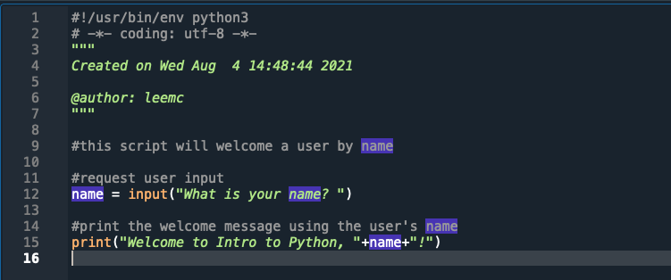
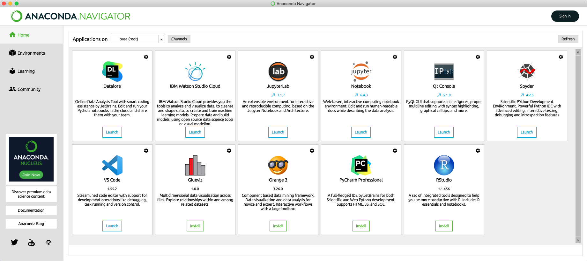
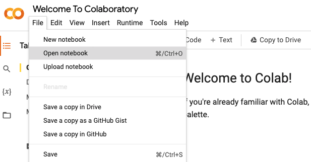

<!--
module_id: demystifying_python
author:   Meredith Lee
email:    leemc@chop.edu
version: 1.2.7
current_version_description: Updated highlight boxes and metadata
module_type: standard
docs_version: 2.0.0
language: en
narrator: UK English Female
mode: Textbook
title: Demystifying Python
comment:  This module introduces the Python programming language, explores why Python is useful in research, and describes how to download Python and Jupyter.
long_description: Python is a versatile programming language that is frequently used for data analysis, machine learning, web development, and more. If you are interested in using Python (or even just trying it out), and are looking for how to get set up, this module is a good place to start. This is appropriate for someone at the beginner level, including those with no prior knowledge of or experience with Python.
estimated_time_in_minutes: 20

@pre_reqs
Learners should be familiar with tabular data (data stored in a rectangular format, like an Excel spreadsheet or a comma separated file). It is helpful (but not essential) to have some familiarity with the [command line interface](https://liascript.github.io/course/?https://raw.githubusercontent.com/arcus/education_modules/main/demystifying_command_line/demystifying_command_line.md#1), [navigating to specific directories](https://liascript.github.io/course/?https://raw.githubusercontent.com/arcus/education_modules/main/bash_command_line_101/bash_command_line_101.md#1), and [running scripts in the Command Line/Terminal](https://liascript.github.io/course/?https://raw.githubusercontent.com/arcus/education_modules/main/bash_scripts/bash_scripts.md#1). Learners do not need to have access to Python or Jupyter notebooks on their own computers.
@end

@learning_objectives  

- Describe what Python is and why they might want to use it for research
- Identify several ways to write Python code
- Understand the purpose and utility of a Jupyter notebook
- Download Python and Jupyter, and access a Python notebook in Google Colab

@end

good_first_module: false
collection: demystifying
coding_required: false
coding_language: python

@sets_you_up_for
- python_basics_variables_functions
@end

@depends_on_knowledge_available_in
- demystifying_command_line
@end

@version_history 

Previous versions: 

- [1.1.0](https://liascript.github.io/course/?https://raw.githubusercontent.com/arcus/education_modules/6f4ca2c54c2fc72a33e5319b20a2ac50562b9ea6/demystifying_python/demystifying_python.md): Removed references to Atom, now sunsetted.
- [1.0.2](https://liascript.github.io/course/?https://raw.githubusercontent.com/arcus/education_modules/466799a081d2cb74d155dc0a26951d3492b81f8c/demystifying_python/demystifying_python.md): Initial Version.

@end

import: https://raw.githubusercontent.com/arcus/education_modules/main/_module_templates/macros.md

-->

# Demystifying Python

@overview

## The Python Programming Language

While the word "python" might immediately make you think of a snake, that's not all it is! Python refers to a programming language. There are a lot of different programming languages that are used for a variety of tasks, but what they all have in common is that they tell your computer what to do. Behind all of your favorite applications is a software developer (or, more often, several developers) who have written the instructions for the computer in a programming language. Python is a particularly versatile language that can be used for web development, data science, machine learning, and more.

So why should you consider Python for your data analysis? There are a few reasons:

- Python is designed to be human-readable. Creating human-readable code is great for research because your analyses will be more reproducible (if you know exactly what you did, you can reproduce it) and transparent (writing the methods section of a paper is much easier when there is clear language about what was done and why).

- Python is **free** to download and use; it is also **open source**, meaning that updates and innovations can happen more quickly than with proprietary software.

- Because Python is quite popular and fairly mature, there are quite a lot of resources out there to help you get started learning, from free online tutorials and cheatsheets to semester-long courses and everything in between.

### Quiz: The Python Programming Language

What are some reasons to consider using Python for data analysis? Select all that apply.

[[X]] Python is free and open-source.
[[ ]] Python is simple point-and-click software.
[[X]] Python is human-readable.
[[X]] The Python community has lots of resources to help you get started.
***

While Python is human-readable and free, it is not point-and-click software, and it can take some time and effort to learn how to write Python code. Don't worry, there are lots of resources out there to help you learn!

***

## Python Code

Python can be written in several ways:

* You can write Python code interactively using your computer's Terminal program or Command Line (if you're not sure where that is or how to use it, the [Bash/Command Line 101 module](https://liascript.github.io/course/?https://raw.githubusercontent.com/arcus/education_modules/main/bash_command_line_101/bash_command_line_101.md#1) will help you get started).
* You can write scripts that include Python code.
* You can create Python notebooks using [Jupyter](https://jupyter.org/) or online using [Google Colaboratory](https://colab.research.google.com/?utm_source=scs-index) (or "Colab" for short).

In most cases, you'll need to start with downloading Python to your computer (the exception is when using cloud-based solutions like Google Colab); which option you choose will come down to personal preference and your specific goals.

If you have Python installed on your computer, you can use your computer's Command Line or Terminal program to write Python code interactively using a Python **interpreter** by typing `python3`:

@gifPreload

<figure>

  

<figcaption>

Click on the image to play the demo.

</figcaption>

</figure>

To exit the Python interpreter, type the command `exit()` and then press the Enter key. Alternatively, you can simply close the interpreter window.

Using Python interactively in the terminal can be useful if you want to quickly test out short pieces of code. However, there are a couple of reasons why it's not useful to code interactively in the interpreter for longer or more complex code:

* If you want to re-run a line of code, because you want to change the parameters or accidentally included a typo, you'll need to re-type the code again with your edits. There are some shortcuts you can use to scroll through previous lines of code in the Terminal/Command Line (the up arrow on your keyboard will usually do it) but it can still be time-consuming if the code is longer than a line or two.

* The code you write in the interpreter will disappear once you exit.

Because of these reasons, you'll usually either be creating Python scripts or using a notebook instead.

## Python Scripts

For more complex tasks, it often makes sense to write a python **script** instead of writing instructions one at a time. Scripts allow you to write out a series of instructions ahead of time and then run in order with one command.

Scripts are often written using special text editors that are designed for writing code (such as [VS Code](https://code.visualstudio.com) or [Sublime](https://sublimetext.com)) or full-featured integrated development environments (IDEs) such as [PyCharm](https://www.jetbrains.com/pycharm/) or [Spyder](https://www.spyder-ide.org/), which have more debugging and automation capabilities than text editors.

Here is a short script written in the Spyder IDE:

In the above example, our script asks for input of a user's name using the `input()` function, stores that input in a variable we've called `name`, and prints out a welcome message to the screen that includes the name the user entered using the code `print("Welcome to Intro to Python, "+name+"!")`.

In the script above you can also see lines of text marked with a pound sign/hash mark `#` at the beginning. This symbol indicates the start of a **comment**, which is anything you write in a script that you don't want to run as code. Comments are a good way to briefly describe or explain aspects of your script, and can also be used to "hide" lines of code as you experiment (an alternative to deleting code that you may want to add back later).

The Spyder IDE has a console where you can see the output of your script without having to run it in the Command Prompt/Terminal. As you can see in the screenshot below, all we had to do was create the file one time and then run that file instead of typing in the code interactively. This can save you time and effort if you have a task you know you'll want to perform repeatedly. In the Spyder IDE there is a "run" button (a green arrow in menu at the top) but you could also run the same file in your Terminal/Command Line by typing the command `python` followed by the file name of your Python script.

@gifPreload

<figure>

  

<figcaption>

Click on the image to play the demo.

</figcaption>

</figure>

In this case, when you run the code we wrote before in the Spyder console, you'll be asked for an input value (I've supplied the name "Pythonista"). If you hit "Enter", the output of the second line of code will appear: `Welcome to Intro to Python, Pythonista!`.

Python scripts are saved with the file extension `.py`.  
To run the script in the example above using the Terminal, you would use Terminal to navigate to the correct directory(the folder where you've saved your file) and type `python intro-to-python.py`. If you are in the right place, you should see the output of your code!

### Quiz: Where to write Python code

Which of the following is **not** a recommended way to write Python code?

[( )] in the Python interpreter in the command line.
[(X)] as a script a Google document.
[( )] as a script in an IDE.
[( )] online in a notebook.
***

While it is technically possible to write Python scripts in a Google document, a word processor like Microsoft Word, or a text editor not designed to write code, it is generally not recommended and will make your life harder. There are a variety of text editors that are specifically designed for writing scripts. They generally support multiple languages and have special features that help you write code, such as syntax highlighting, smart code completion, and collaboration tools. Which features you have access to depends on on which editor you choose ([Visual Studio Code](https://code.visualstudio.com/) is an excellent free option).

***

## Jupyter Notebooks

If you are interested in using Python for data analysis, you might want to write Python in a [Jupyter notebook](https://jupyter.org/) (which was previously called an IPython notebook; this is where its file extension `.ipynb` comes from). There are a couple of reasons to consider using Jupyter notebooks:

* Notebooks provide the best of both worlds between interactive and scripted code: code is written in chunks that can be run individually, with any output displayed beneath the code chunk.

* You can intersperse sections of text, written in Markdown language, that can provide explanations and context for your code. This is similar to a scientific notebook, and is especially valuable for data analysis.

### Quiz: Jupyter Notebooks

What are the components of a Jupyter notebook? Select all that apply.

[[X]] Code cells
[[X]] Text cells written in Markdown
[[ ]] A console where you can write lines of code interactively
***

Jupyter notebooks contain code cells and text cells. The code cells are written in Python and can contain as much or as little code as you want; the output of the code can be displayed directly beneath the code cell and the code can be edited and re-run at any time. The text cells are written in Markdown language and can provide more context and reasoning than can easily be done using comments. Additionally, using Markdown allows you to add useful formatting to your text. Jupyter notebooks do not have a console, but since you can run each code cell independently, you don't really need one!

***

## Accessing Python

There are two primary ways to use Python: on your own computer, or in the cloud! Here are instructions for a way to get set up no matter which one you prefer.

Installing Python On Your Own Computer
=======

Your computer most likely will **not** have Python already installed. To check, you can open your Command Line/Terminal and type `python --version`. The version you have will be displayed if you have Python installed. If Python is not installed, you have a few options:

* You can [install Python using Anaconda](https://www.anaconda.com/products/individual) (recommended), a toolkit that gives you not only Python itself but also many other data science tools to help with coding, analysis, and visualization. The individual version of Anaconda is also free to download!

  Once you've downloaded Anaconda, you can open the Anaconda Navigator. When you do, you'll see the the window below. Now you have access to lots of tools for working with Python!
  

  
  

* You can also download [just the latest version of Python directly at python.org](https://www.python.org/downloads/). If you also want Jupyter or any IDEs, you will need to download those separately as well. [You can install Jupyter here](https://jupyter.org/install) and [here is a list of IDEs where you can write Python code](https://wiki.python.org/moin/IntegratedDevelopmentEnvironments).

<b style="color: rgb(var(--color-highlight));">Another option</b> 

  That list of IDEs might seem a bit intimidating! Let's narrow things down to a few good options. If you don't know where to start, [Thonney](https://thonny.org/) is a good option for beginners, and actually comes with Python built in. [Spyder](https://www.spyder-ide.org/) was designed for scientific programming, and is a popular option for data scientists and analysts. [PyCharm](https://www.jetbrains.com/pycharm/) is popular with professional developers and has many features that other IDEs lack, but may come with a steeper learning curve. Both Spyder and PyCharm come with the Anaconda distribution.
  
  

Using Python in the Cloud
=======

If you prefer to continue practicing in the cloud instead of downloading Python, [Google Colaboratory](https://colab.research.google.com/), or Google Colab, provides an online Jupyter notebook environment that is completely free (though you do need a Google account). The introduction is actually written as a Colab notebook itself, so you can jump right in practicing. While it won't look exactly like the Jupyter notebook we used for this module, it will be a very similar experience, with a mix of code cells and text cells written in Markdown.

You can even see what this module's notebook looks like in Google Colab! Once you've worked through the introduction above:

1. Click "File" in the upper left-hand corner and then "Open notebook" in the drop-down menu:

   

 2. In the window that appears, one of the options at the top is **GitHub**. Click that, and you'll see where you can type in a GitHub URL.
 3. In that space, copy and paste the repository where these modules live: [https://github.com/arcus/education_modules](https://github.com/arcus/education_modules).
 4. Click the magnifying glass to the far right to search. You should see a list of the Python notebooks in that repository.
 5. When you find the one you want, the button on the far right (an upward-slanting arrow in a box) will open the notebook file as a Colab notebook in another tab.

   

   @gifPreload

   

   <figure>

     

   <figcaption>

   Click on the image to play the demo.

   </figcaption>

   </figure>

### Quiz: Accessing Python on Your Computer

How can you access Python to begin practicing on your own?

[( )] By downloading the latest version at https://www.python.org/downloads/
[( )] By downloading the latest Anaconda distribution
[( )] By using cloud-based tools, such as Google Colab
[(X)] All of the above
***

You can download Python directly to your computer, use Anaconda to download Python as well as many other data science tools, or use cloud-based notebooks like Google Colab. The choice is yours!

***

## Additional Resources

* [python.org](https://www.python.org/) is a great resource for documentation, FAQs, and tutorials for beginners, as well as information about what is happening in the wider Python community. Check it out and explore!

* If you're interested in practicing more with Google Colab, check out [this notebook looking at statistics](https://colab.research.google.com/drive/1zkW5Y0SoV3gMU6sQtlgnZsfR2GIXi6F_?usp=sharing).

* If you are ready to actually write some Python code, check out the [Python Basics: Functions, Methods, and Variables](https://liascript.github.io/course/?https://raw.githubusercontent.com/arcus/education_modules/main/python_basics_variables_functions_methods/python_basics_variables_functions_methods.md) module.

## Feedback

@feedback
