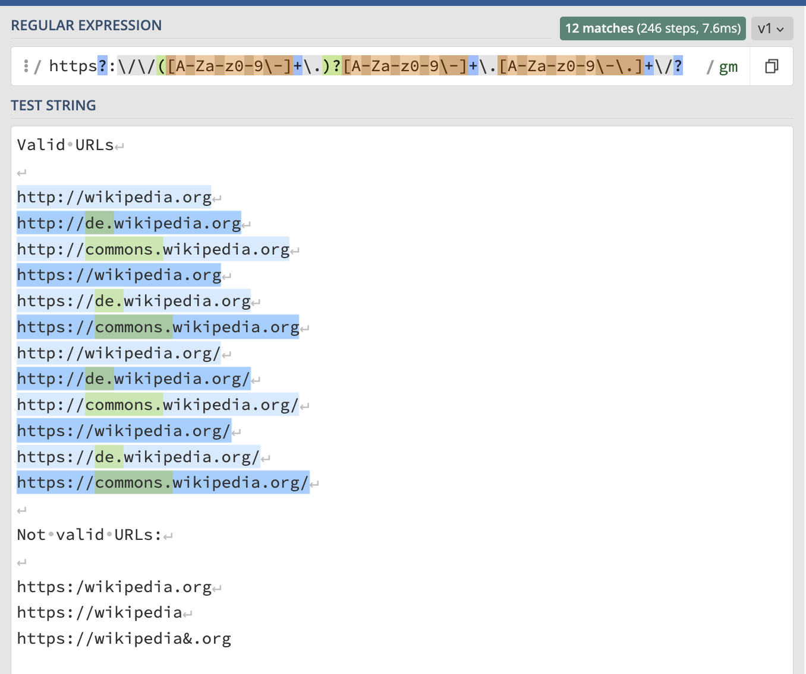

<!--

author:   Joy Payton
email:    paytonk@chop.edu
version:  1.0.0
current_version_description: Initial version
module_type: standard
docs_version: 1.0.0
language: en
narrator: UK English Female
mode: Textbook

title: Demystifying Regular Expressions

comment:  Learn about pattern matching using regular expressions, or regex.

long_description: Regular expressions, or regex, are a way to specify patterns (such as the pattern that defines a valid email address, medical record number, or credit card number) within text.  Learn about how regular expressions can move your research forward in this non-coding module.

estimated_time_in_minutes: 30

@pre_reqs
This module does not require any particular knowledge.  Anyone who has used a search function to find or find and replace text in a document will be able to engage with this content.
@end

@learning_objectives  
After completion of this module, learners will be able to:

- Explain what a regular expression is 
- Give an example of how regular expressions can be useful
- Use an online regular expressions checker that helps build and test regular expressions.

@end
good_first_module: false
coding_required: true
coding_level: getting_started
sequence_name: regex
previous_sequential_module: 
@sets_you_up_for
- regular_expressions_basics
@end 
@depends_on_knowledge_available_in

@end
@version_history
No previous versions. 
@end

import: https://raw.githubusercontent.com/arcus/education_modules/main/_module_templates/macros.md
import: https://github.com/arcus/education_modules/blob/warning_regex101/_module_templates/macros_regex.md
-->

# Demystifying Regular Expressions

@overview

## Regular Expressions, Defined

The word *regular* (like *regulate*) comes from the Latin root for "rule": *regula*.  A **regular expression** is a specific way to **express** a **rule** for a pattern.  

For example, one pattern rule might be for the URL of a root web page, like https://www.nytimes.com or http://apache.org.  

Other rules might describe the pattern of a valid credit card number, or a national identity number, or a postal address.  

As humans, we are very good at identifying patterns and realizing instantly that a certain text "looks like an email address" or "looks like a phone number."  Quantifying patterns and telling the computer what a pattern "looks like" is what regular expressions are all about.

Patterns in Biomedical Research
------

In biomedical research, patterns emerge in a number of ways:

* File names might follow a pattern that include a subject identifier and date stamp, which can be useful in filtering out only file names from a certain time period or for a certain subject.
* Clinical notes in an electronic health record might represent the phrases "rule out" or "ruled out" as `R/O`, `RO:`,  or `r/o`. It is important to find all of these in order to discover differential diagnosis clues.
* mRNA includes patterns like start and stop codons.
* A lab notebook that you want to clean up before you publish it to a wide audience might contain protected health information, including:

  - Medical Record Numbers (MRNs) that have a certain length and pattern of letters and numbers
  - Dates, which might look like several different kinds of patterns, depending on your region and who made the notes
* Survey response patterns (for example, many identical answers in a row that might indicate that the survey taker was just clicking through without reading the questions).
* Column names in your table might follow a pattern, such as including suffixes like `_pre` and `_post`.  Maybe you want to pair pre and post values on many different measures, and do that easily and quickly! 
* Blood pressure, pulse ox, body temperature, and other vital measurements are recognizable at a glance because they fit a pattern we expect.

You may think of many more patterns for your biomedical research.  Patterns can exist in the data itself (such as language patterns or measurements with units), in the ways you store data (like file names or column names in a table), or in the way you work with data (for example, certain Python or R code you use repeatedly).

Describing Patterns
--------

The goal of regular expressions is to describe patterns based in:

* which kinds of characters occur, and 
* if they are optional or mandatory,
* how many of that kind of character to expect, and
* in what order.  

You can also put in a "capturing" element, to capture a specific part of the pattern (for example, extracting the patient identifier and/or the sample number from a file name).

Some regular expressions are short and simple, and some can be many lines of text long.

## Why Use Regular Expressions?

There are two very common reasons you as a researcher might want to use regular expressions (also referred to as "regex", which you can pronounce either with "reg" rhyming with "beg" or "reg" rhyming with "wedge").

**Reason 1: Searching for the needle in the haystack**
-----

You're writing code or looking through data and want to find, or find and replace, something that matches a predictable pattern.  For example, maybe you have used hexidecimal color specifications such as `#ccc` or `#FF1451` in your data visualizations in R, and you want to find all of those, because you want to add comments in your code disclosing the color in English so that your code is more understandable. 

This goes beyond the typical search you would use in Word or other programs, because you want to find multiple values that start with a hash mark (#) and are immediately followed by three or six digits ranging from 0-9 and A-F (or a-f).  

**Reason 2: Extracting useful sub-strings**
-----

You're analyzing some text values and need to change them, mine them for parts, or clean them up. For example, in your data, every time you see an identifier that looks like `[some numbers]_[more numbers]` you want to extract the first set of numbers, which represents a patient identifier, and the second set of numbers, which represents a sample number, and create new data columns with that information, which will allow you to work with just the patient identifier or just the sample number more easily.

<b style="color: rgb(var(--color-highlight));">A little encouragement...</b> 

Regular expressions require a bit of effort to learn, and even people who use regular expressions often will end up making mistakes and using online tools for help.  

If you work with strings (character data) frequently, whether that's from free-text entries in a REDCap database, text from web-scraped blogs, file names from a huge dataset, or clinical notes from an electronic health record, the learning curve is definitely worth it!  

## Where Can You Use Regular Expressions?

Regex is often used in **code**.
---

For example, you might write Python code that searches for patterns that look like medical record numbers and redacts them, replacing them with 9999999.  

Or you could write R code that takes the file names from a directory full of video files with specially formatted file names like `subj412834_20230412_ALC.mp4` and makes a table of the information those file names contain (like subject id, date, initials of who made the interview recording, etc.).

Regular expressions can also be used in **text editors**.  
---

For example, this module was written using a text editor called [Visual Studio Code](https://code.visualstudio.com/) (or VS Code).  This text editor allows the user to search for patterns using regular expressions.  For example, the author can look for every time a word appears between single asterisks (which will mean the text will appear in italics), or every time a new line starts with a number, or every time a single or double quotation mark is followed by a period or comma.

VS Code also supports search and replace.  For example, if there's a style rule that indicates that words in *italics* (like `*regular*`) should also be in bold, the author can ask the text editor to find all the places where there's a word enclosed in single asterisks and enclose that word instead in triple asterisks (like `***regular***`, which will make the word render in ***bold italic***).

There are also some popular **command line tools** that use regular expressions.
---

These include commands like `sed`, `grep`, and `awk`.

## An Example Regular Expression

As we stated earlier, a **regular expression** is a specific way to **express** a **rule** for a pattern.  For example, one pattern rule might be for a valid URL of a root web page.

Our Use Case
-----

Let's consider a somewhat oversimplified pattern that defines a URL. 

We know that these URLs are valid, and we want our regular expression pattern to match them.  Some of these may, at first glance, look identical, but the URLs below are all distinct, with a few subtle changes (like a trailing forward slash or "http" versus "https").

* http://wikipedia.org
* http://de.wikipedia.org
* http://commons.wikipedia.org
* https://wikipedia.org
* https://de.wikipedia.org
* https://commons.wikipedia.org
* http://wikipedia.org/
* http://de.wikipedia.org/
* http://commons.wikipedia.org/
* https://wikipedia.org/
* https://de.wikipedia.org/
* https://commons.wikipedia.org/

And these are not valid URLs, so we want our pattern to not match these faulty URLs.

* https:/wikipedia.org
* https://wikipedia
* https://wikipedia&.org

For now we won't worry about pages and directories within a website like https://apache.org/licenses/LICENSE-2.0 or https://www.nytimes.com/es/, we're just going to capture the pattern for the main web page without any specification after the domain name.  So we're looking for simple URLs like https://www.nytimes.com or http://apache.org.  

Describing Our Pattern
-------

This is one way to describe that pattern:

* The letters "http"
* An optional letter "s", if it's using a secure connection
* A colon and two forward slashes (`://`)
* An optional subdomain (like "www" or "blog" or "shop" or "mail") which: 

  * Can contain only letters, numbers, and hyphen/dashes (`-`) and  
  * Is followed by a period (`.`)

* A domain, which includes:
  
  * An second level domain ("nytimes", "apache") which can contain only letters, numbers, and hyphen/dashes (`-`)
  * A period (`.`)
  * A top level domain (or "TLD") like "org", "edu", "co.uk", and many more, which can contain only letters, numbers, hyphen/dashes (`-`), and periods.

* Optionally, a closing slash (`/`)

<b style="color: rgb(var(--color-highlight));">Important note</b> 

Note that our definition here is not complete.  There are actually more rules about the lengths and contents of the various parts of URLs, but the rules we have are a good approximation to help us understand the pattern that defines a valid URL.  This definition is not exhaustive enough to actually use in software to reliably screen all the different cases of URLs, however!

A Coded Version
-----

There's a regular expression that does what we just did in words (describing the URL pattern), but in a much briefer, encoded format.  If you asked someone who knows regex to write down your pattern, this is what they would give you, and you can check that it works by using a regular expression checker.  We'll talk about a good regular expression checker on the next page.

This is the regular expression that captures the rules we listed above.

`https?:\/\/([A-Za-z0-9\-]+\.)?[A-Za-z0-9\-]+\.[A-Za-z0-9\-\.]+\/?`

<b style="color: rgb(var(--color-highlight));">A little encouragement...</b> 

Regular expressions look intimidating and hard to understand.  When you see the unintelligible stream of characters above, you might think to yourself that regular expressions will be too hard to understand, and that you have to be very good at memorization to be good at them.  

However, in this module, we're only going to lightly cover regular expressions without your having to understand exactly how they work or how to write them.

If you're interested in learning more, there are additional regular expressions modules that will teach you how to actually write and use these complex-looking codes, and we think that you may find it easier to learn than you might predict at first glance.

Using the pattern above, you could search for and find valid URLs (assuming we got the rules right) in your data. 

In this module, we're not going to go into the rules for making a regular expression, and we won't be exhaustive in explaining each part of our complicated code. For now, here's a sneak preview of what each segment of this regular expression mean.  Don't worry about translating these or understanding them!

* `http` : The literal characters "http"
* `s?`: Optionally, the letter "s"
* `:\/\/` : A colon and two forward slashes: "://"
* `([A-Za-z0-9\-]+\.)?`: Optionally, a group of characters consisting of: 

  - `[A-Za-z0-9\-]+` : One or more characters that's either in the A-Z range, the a-z range, the 0-9 range, or a literal hyphen (`-`)
  - `\.` : A literal period (`.`)
* `[A-Za-z0-9\-]+`: One or more characters that's either in the A-Z range, the a-z range, the 0-9 range, or a literal hyphen (`-`)
* `\.` : A literal period (`.`)
* `[A-Za-z0-9\-\.]+`: One or more characters that's either in the A-Z range, the a-z range, the 0-9 range, a literal hyphen (`-`), or a literal period (`.`)
* `\/?`: Optionally, a final forward slash

## A Great Tool to Start With

As a final step in demystifying regular expressions, it can be helpful to introduce the online regex checker as a great resource to learn and to check your regex before trying to learn how to make your own regular expressions or use regex in SQL, R, or Python code you're writing.

We like **Regex 101**, at https://www.regex101.com, but you can also search online for "regex checker" to find other, similar websites.  Regex 101 allows you to enter your regular expression as well as some sample text that you want to apply the regular expression to.  

@regular_expression_checker_warning

Below, or by [trying it out yourself](https://regex101.com/r/QUok4D), you can see that we put in our "valid URL" regular expression (at the top of the screen, in the appropriately labeled box) as well as the different varieties of URLs, some of which we think are valid and match our pattern, and some of which we think are invalid and should fail to match our pattern.

If our test strings match the pattern, they are highlighted, and if they do not match, they are not highlighted.

<!-- style = "border: 1px solid rgb(var(--color-highlight));" -->

This tool is useful, because sometimes you may not need to construct a regular expression, because it was given to you in a code sample you found online, or in code someone else wrote, like a coworker in your lab.  You will still want to test that it works the way you expect, however, even if you don't totally understand what each character of the regular expression means.  

## Quiz: Demystifying Regex

Please check all of the true statements below:

[[ ]] Regular expressions are a way to detect statistical outliers in data.
[[X]] Regular expressions are a way to define rules that describe a pattern in text.
[[X]] Regular expressions can be used in multiple coding languages.
[[ ]] The only way to check the accuracy of a regular expression someone gives you is by writing code. 
[[X]] Regular expressions can be used to extract useful substrings.
***

Regular expressions are used to express textual patterns, not statistical outliers in your data. Many programming languages support regular expressions, but you don't have to be a coder to check the accuracy of a regular expression. Online regular expression checkers are a great way to practice!  Regular expressions can indeed be used to extract useful substrings.

***

Which of the following is a use case for regular expressions?

[[ ]] Computing statistical tests 
[[X]] Extracting the part before an underscore (`_`) in file names
[[X]] Finding various ways to write blood pressure units ("mm", "mmhg", "mm Hg", etc.) and rewriting them to be consistent
[[ ]] Visualizing the spread or dispersion of data  
[[X]] Checking to see if column names in a table meet a naming standard
[[?]] Hint: There are multiple correct answers.
***

Regular expressions are all about finding and using patterns in text.  This can include:

* Finding patterns and using search or search and replace to deal with the patterns you find
* Extracting data from text, using a pattern (like "extract all the text after the colon" or "extract the text between the first and second underscores")
* Testing to see if text matches a pattern that describes an ideal or valid text (for example, checking to see if a URL is valid or a text contains an email address).

Regular expressions are not used to make data visualizations or compute statistical tests.

***

Please go to our ["URL checking" regex example](https://regex101.com/r/QUok4D) to answer the next question.  You will want to type strings in to the "Test String" box to check.

Which of these URLs is valid, according to our regular expression (the entire URL matches the pattern given)?  Select all the valid URLs.

[[X]] https://www.example.com.com.com
[[X]] https://www3.example.com
[[X]] https://www-3.example.com
[[ ]] https://www_3.example.com
[[ ]] https://www.example_3.com
[[ ]] https://www.example:3.com
[[?]] Hint: Feeling stuck?  Try using [Regex 101](https://regex101.com/r/QUok4D)!
***

Our rule isn't perfect, is it?  https://www.example.com.com.com passes our regular expression check, but we know from experience that it's probably not a valid URL!  The other two that pass our test are https://www3.example.com and https://www-3.example.com.  The other URLs only match partially or not at all!

***

## Additional Resources

**Text Editor**

We use Visual Studio Code to write these modules, and this free text editor has a lot of useful tools, including the ability to search and replace using regular expressions!  

For more information about Visual Studio Code or to download it, [visit their site](https://code.visualstudio.com/).

**Regular Expression Checkers**

If you want to check out regular expression checkers, here are a few we like:

* [Regex 101](https://regex101.com) is the regular expressions tester used in this module.  We use it regularly, even after working with regular expressions for many years.
* [RegExr](https://regexr.com/) has helpful teaching aids, including a hover-over explainer that allows you to investigate matches, and a way to look at complex nested elements (for instance, a range of characters inside square brackets inside a capturing group) in a visual way.
* [RegEx Testing](https://www.regextester.com/) has a clean, simple interface and a library of popular regular expressions to start with. 

@regular_expression_checker_warning

## Feedback

@feedback
