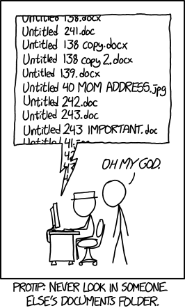

<!--

author:   Meredith Lee
email:    leemc@chop.edu
version:  0.0.1
language: en
narrator: UK English Female
title: Directories and File Paths
comment: In this module, learners will explore what a directory is and how to describe the location of a file using its file path.   
long_description: When doing data analysis in a programming language like R or Python, figuring out how to point the program to the file you need can be confusing. This module will help you learn about how files and folders are organized on your computer, how to describe the location of your file in a couple of different ways, and name files and folders in a descriptive and systematic way.
@learning_objectives  

After completion of this module, learners will be able to:
- Describe what a directory is
- Distinguish between a relative file path and an absolute file path
- Describe the location of a file using its file path
- Describe a few methods of naming files and folders

@end
link:  https://chop-dbhi-arcus-education-website-assets.s3.amazonaws.com/css/modules.css
-->

# Directories and File Paths

<div class = "overview">

## Overview

@comment

**Is this module right for me?**

@long_description

**Estimated time to completion**: ~ 15 min

**Pre-requisites**: None.

**Learning Objectives**:

@learning_objectives

</div>


## Files and folders

If you've ever saved a file on your computer, you probably have some familiarity with how files and folders work. Maybe you save a file to your Desktop, or in your Documents, or perhaps you made a special folder to hold all of your documents relating to a specific project. In some ways, it works very similarly to a physical filing system; related files go in labeled folders, which are stored in a known location (a file cabinet in a file room somewhere).

On your computer, you can have a mix of files and folders within folders. This is a hierarchical filing system; if you map it out, it looks like a tree.

<div style = "margin: 1rem; width: 750;">

</div>

Here is another representation, this time of how the file structure might look on your computer:

```
./
├── my_project
│   ├── analysis.R
│   ├── data
│   │   ├── experiment1.csv
│   │   └── experiment2.csv
│   │
│   ├── notebooks
│   │   ├── data_exploration.Rmd
│   │   └── enrollment_report.Rmd
│   │
│   └── output
│       ├──results.csv
│       └──results_scatterplot.png
└── Documents
    ├── article.pdf
    └── manuscripts
        ├── manuscript1.docx
        └── figures
            ├── fig1.png
            └── fig2.png

```

## File paths

While you are likely comfortable with accessing files using your computer's graphical interface, when you are trying to access a file using a programming language like R or Python, or in the Command Line, it can seem more complicated. In cases like these, you'll need to use a **file path** to point to the location of the file that you need. Every file has a place that it "lives" in your computer's memory, whether it's on your Desktop or in a folder within a folder within another folder! Accessing your file means pointing your computer to that place.

The simplest file paths might just be the name of the file you're trying to access; other times, the file path might be more complicated, containing the names of several folders, or even starting with "/Volume" or "C:/". The next sections will talk more about these different kinds of file paths and why you might use one or the other.

### Relative paths

As the name suggests, a **relative file path** is one that points to a location relative to a reference point. An example of a relative file path might be "data/my-data.csv". The important thing to remember when using relative paths is that for it to work, the language you're programming in needs to have a frame of reference to start from. It's a bit like giving directions to a brand new coworker about where to find your stapler. You might tell them that it is in the bottom drawer of your desk in your office. This works well if your coworker is on the same floor as you, since they can see that there is an office with your name on it, a desk in that office, and drawers in that desk. If your coworker is in another building, however, these directions aren't very helpful! You'd have to include the name of the building and the floor where your office is.

This illustrates a concept called a **working directory**. A working directory is really just another file path that sets the default for a process. In our example above, you could say that the working directory would include the floor of the building where your office is and the address of the building. From that frame of reference, you can access all sorts of things on the floor of that particular building with just a few directions.

### Absolute paths

While relative file paths require a frame of reference to start looking for a file, an **absolute file path** does not-- it already includes everything that the computer might need to find the file. Using the example above, the absolute path to your stapler would include not only where in your office it is, but also the floor number, the building name, the street the building is on, the city it's in, the county, the state, and the country. For a coworker who works in the same building that you do, this level of detail might seem unnecessary, or even overwhelming! However, if there was no frame of reference to start from, these directions would let anyone in the world find your stapler.

An example of an absolute file path to our file my-data.csv might look something like this:

"/Users/username/Documents/data/my-data.csv" (Unix-like, including Mac operating systems) or "C:\Users\username\Documents\data\my-data.csv" (Windows)

### So which kind file path should I use?

By now, you may be wondering whether absolute file paths or relative file paths are better, and the answer is, it depends! When referring to a file in an R or Python script, for example, which type of file path you use will depend on the purpose of the script and who will look at it or use it in the future. Absolute file paths can be useful because you don't have to know what working directory you're in-- you just have to know where the file is. However, as you might have noticed, absolute paths include things like the username of the user account and other folders that may exist on your computer and not anyone else's. If you are the only one using a script, and never plan on running from any other location, you might choose to use an absolute path, since no matter where your program lives on your computer, R or Python can find the file. However, if you are working with collaborators or have plans to make your script public, using a relative path might be a better choice. If you keep every file that you need in a single project folder (which could have several subfolders) and maintain/share that folder as a unit, then you can use file paths that are relative to where the script is being run, and it shouldn't matter where a collaborator saves the folder on their own computer. This is the reproducible choice!

<div class = "important">
When writing a script in a programming language like R or Python, it's possible to write code that sets your working directory to a specific location each time the script is run. While this might be tempting, in general it's not a great idea, especially in scripts you might share. The working directory you set may not exist on any other computer, and hardcoding it can cause problems later.
</div>

## Naming Conventions



(Image used under a Creative Commons Attribution-NonCommercial 2.5 License.  Original post at https://xkcd.com/1459/.)

When you're working with files and folders in a programming language like R or Python, how you name your files and folders is very important, especially for organization; having a well-defined and descriptive system for naming your files and folders will make it much easier to find the files that you need later.

There are a few best practices for file naming:  

* Names should be descriptive, giving information about what the file contains.
* Avoid spaces and special characters, (such as ! @ # $ % ^ & * ( ) ; : < > ? . , [ ] { } ' " |): some software can't recognize or work with files that contains spaces or special characters.
* File names shouldn't be too long; some operating systems have limits to how many characters a file name can contain.
* If you include dates in your file names, use the unambiguous ISO 8601 standard (YYYYMMDD).
* If you are not using versioning software (like git) for version control, consider including the version number in the file name.
* Be consistent! If you decide to use underscores to separate words, like my_project.Rmd, use that convention every time.

There are some common naming conventions you'll often see in computer programming:

* camelCase: This naming convention separates words in the file name by capitalizing the first letter of every word after the first (like myAwesomeScript.py). Sometimes you'll also see the first letter capitalized as well (MyAwesomeScript.py), and this is sometimes called UpperCamelCase.
* snake_case: This convention separates words with an underscore, with all letters being lowercase (like my_awesome_script.py). Notably, this is the convention in the Python and tidyverse R style guides (though other naming styles will also work).
* kebab-case: This convention is similar to snake_case, except words are separated by dashes instead of underscores (like my-awesome-script.py)

This is certainly not an exhaustive list, but these are some of the most common naming conventions you'll encounter. Some developers have a strong preference for one versus another; generally, the most important thing is that you and your team are internally consistent. If you're joining a new team, ask about their file naming preferences.

## Feedback

In the beginning, we stated some goals.

**Learning Objectives:**

@learning_objectives

We ask you to fill out a brief (5 minutes or less) survey to let us know:

* If we achieved the learning objectives
* If the module difficulty was appropriate
* If we gave you the experience you expected

We gather this information in order to iteratively improve our work.  Thank you in advance for filling out [our brief survey](https://redcap.chop.edu/surveys/?s=KHTXCXJJ93&module_name=%22Directories+and+File+Paths%22)!
