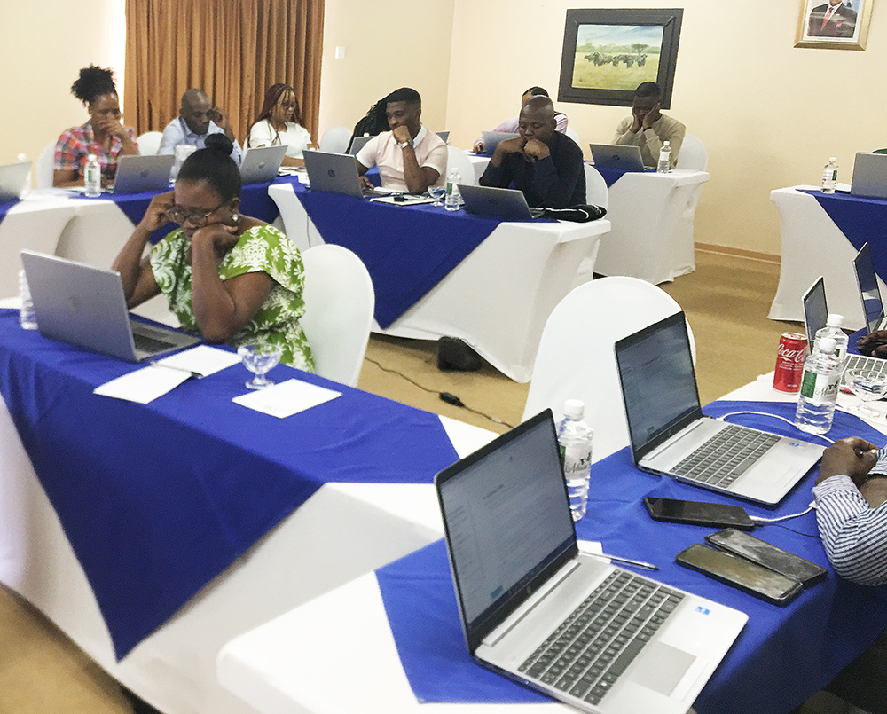

# News about the DART Program

## **June 2023 Newsletter**

### **Wave 1 Complete, Wave 2 to Begin August 7**

Our first wave of research closed in May, with nearly 100 researchers from various institutions across the United States.  We've learned a lot from this first wave, especially when it comes to our Communities of Practice. We look forward to making interaction between participants simpler and more rewarding in this second wave.  Speaking of Communities of Practice, here are some of what two of our participants shared in their communities as takeaways from their participation:

> "My favorite modules were Python and Data Management basics. These have changed the way I think about coding as well as how I am organizing my own data ... I look back over all the work I've done over the years and how silly annotation and storage mishaps have caused me to lose data, waste hours trying to locate files, and even repeating long time-course experiments all because I wasn't as organized as I could be. As a result of this program, I have seriously shifted my thoughts, attitude, and practices!"

> "The program did change my mind on Open Source data; I was skeptical and felt like in a lot of cases it doesn't make sense to share data, but now it makes more sense to me why we actually should have more datasets and codes readily available.
Thank you for this opportunity!"

**Our next wave of research begins on August 7, 2023, and we'll be sending reminders in July** so that interested biomedical researchers can fill out our screening form and begin the participation process. 

---

### **University of Botswana uses DART Modules in [Workshops](https://www.research.chop.edu/data-science-workshop-with-university-of-botswana)**

We intend for our modules to be used in many ways and encourage anyone to reuse our materials freely.  In April and May 2023, faculty at the University of Botswana used our modules to create a series of data science workshops for healthcare personnel, including clinicians, data and information science professionals, and Botswana Ministry of Health officials. Below, learners concentrate on self-guided modules in the workshop given in the northern town of Maun.

---

### **A Glimpse Into Our Process**

In a recent progress report to NIH, we shared information about progress on our research aims. An important part of our work is ongoing improvement of our materials.  From the report:

>\[W\]e continue to monitor module feedback data and have noted [24 user-reported suggestions with regard to modules](https://github.com/arcus/education_modules/issues?q=is%3Aissue+label%3Auser-reported+).  Some of these user-reported improvements have related to typos or mistakes, others have indicated accessibility concerns (such as a link to a resource located behind a paywall), and others are related to pedagogical needs, such as the desire to get more explicit quiz and exercise feedback within a module. 

If you've made a suggestion or error report in our feedback form, we take that seriously.  The number listed above, 24, is out of date – we are grateful for so many users suggesting improvements. We have now documented over forty [user-reported issues](https://github.com/arcus/education_modules/issues?q=is%3Aissue+is%3Aopen+label%3Auser-reported), more than twenty of which we have resolved.  **Thank you for your collaboration and feedback!**

---

### **Questions?**

Want to learn more about DART, offer us feedback, or find out how to use our materials in your context?  Email us at dart@chop.edu.

---
---

## Older Updates

### [March 2023 Newsletter](./newsletters/2023_03.md)

### [DART is now on LinkedIn](./newsletters/linkedin_announcement.md)
