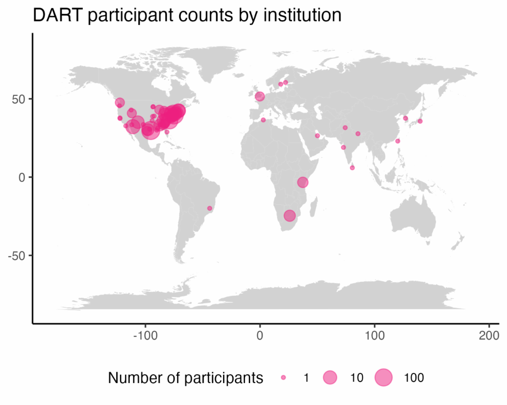

# News about the DART Program

## **April 2024 Newsletter**

You're receiving this email because you've expressed interest in the DART (Data and Analytics for Research Training) research study, which investigates data science instruction techniques aimed at helping biomedical researchers analyze their data in more reproducible, rigorous, and innovative ways.  The program is funded the National Institutes of Health award number 5R25GM141501. For more information, see our [interest form](https://redcap.link/dart-interest) or [study website](https://redcap.link/dart-interest). 
 
### Wave 2 Results are in! 

Our second study wave had over 400 participants from all over the world. Thank you to those of you who participated! We have conducted our pre-registered analyses, and participants' self-reported confidence in their own data science abilities increased significantly. 
 
 

  
 
We are preparing to publish our results and have already shared previews at two conferences: the C[ulminating Conference for the Year of Open Science](https://www.cos.io/yos-conference) (watch the recordings of the DART talks), and the [Katherine E. Welsh Symposium on Reforming Graduate Science Education at Johns Hopkins University](https://publichealth.jhu.edu/the-r3-center-for-innovation-in-science-education/events-at-the-r3-center).  
 
### We Made Changes in Response to Your Feedback 

One of the most common pieces of feedback we received was that the code blocks in the Python modules were difficult to use. We heard that loud and clear, and made some major changes to how those code blocks work. Instead of running as SageMath cells, they are now running [Pyodide](https://publichealth.jhu.edu/the-r3-center-for-innovation-in-science-education/events-at-the-r3-center). What that means is you can use arrow keys and see previous code you ran, similar to how the SQL cells work.  

If you got frustrated by how hard these modules were to use, we suggest you give them another try. Check out all of them in the [Analysis in Python](https://arcus.github.io/education_modules/example_pathways#pathway-5-analysis-in-python) sample pathway. 

The shift to Pyodide was a major improvement, but we're also making smaller tweaks all the time! If you're curious, you can see how we're processing all of your feedback in the [Issues section of our GitHub repository](https://github.com/arcus/education_modules/issues). 
 
### New Content 

Just because the DART research study has ended doesn't mean we're done teaching data science! We continue to update our old modules and publish new ones, including the following:  
 
* [Demystifying Application Programming Interfaces (APIs)](https://liascript.github.io/course/?https://raw.githubusercontent.com/arcus/education_modules/main/demystifying_apis/demystifying_apis.md#1)  
* [Demystifying the Command Line Interface](https://liascript.github.io/course/?https://raw.githubusercontent.com/arcus/education_modules/main/demystifying_command_line/demystifying_command_line.md#1)
* [Git Command Line Interface versus Graphical User Interface](https://liascript.github.io/course/?https://raw.githubusercontent.com/arcus/education_modules/main/demystifying_command_line/demystifying_command_line.md#1)
* [Generalized Linear Regression](https://liascript.github.io/course/?https://raw.githubusercontent.com/arcus/education_modules/main/demystifying_command_line/demystifying_command_line.md#1)
 
We also have some new webinar recordings you may enjoy! We recently presented five of our SQL modules in workshop form. If you've been wishing you could experience some of our content as videos, this is for you! Slides and recordings are available for all five sessions on the [SQL Skill Series website](https://arcus.github.io/arcus_skill_series_sql/), starting with our popular SQL overview in "Demystifying SQL" and working all the way up to "SQL Joins".  
 
And last but not least, we've been busy converting the DART program into a standing self-service resource, so biomedical researchers can interactively browse our catalog to find the right learning modules for them. Check out our [module discovery prototype](https://learn.arcus.chop.edu/) to see it in action!  

And if you do use the module discovery prototype, please click the button at the top right to leave us feedback about your experience. We're actively improving the design for this tool right now, so this is a great moment to let us know what works well for you and what doesn't.  
 
### Questions? 

Want to learn more about DART, offer us feedback, or find out how to use our materials in your context?  Email us at [dart@chop.edu](mailto:dart@chop.edu). 

## Older Updates

### [June 2023 Newsletter](./2023_03.md)

### [March 2023 Newsletter](./2023_03.md)

### [DART is now on LinkedIn](./newsletters/linkedin_announcement.md)
