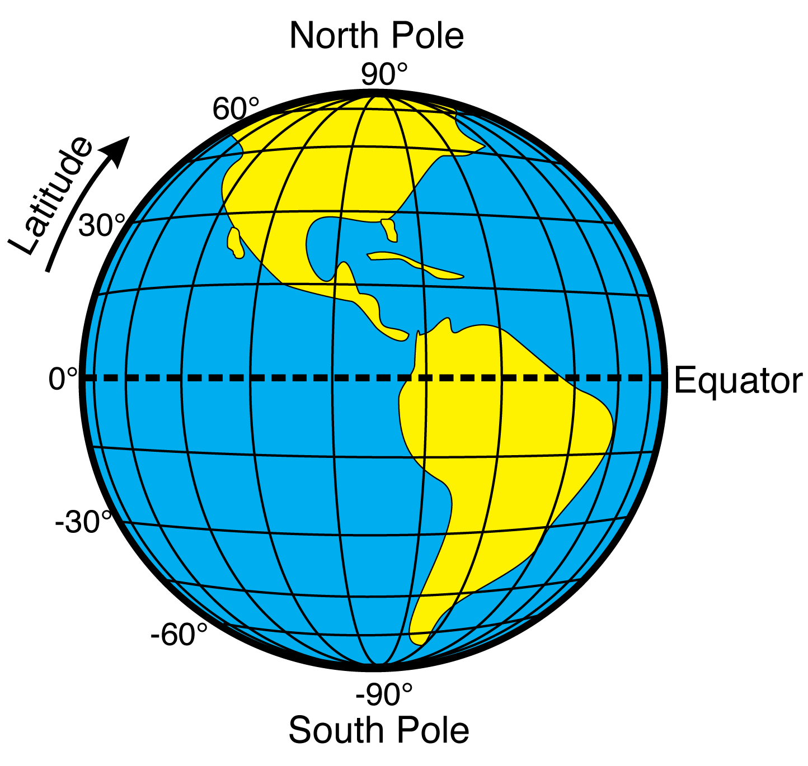

<!--

author:   Elizabeth Drellich
email:    drelliche@chop.edu
version:  0.0.1
module_template_version: 2.0.1
language: en
narrator: UK English Female
title: The Elements of a Map
comment:  This is a general overview of ways that geospatial data can be communicated visually using maps.
long_description: Raw geospatial data can be particularly tricky for humans to read. However the shapes, colors, sizes, symbols, and language that make up a good map can effectively communicate a variety of detailed data even to readers looking at the map with only minimum specialized background knowledge. This module will demystify how raw data becomes a map and explain common components of maps. It is appropriate for anyone considering making maps from geospatial data.
estimated_time: ?? minutes

@learning_objectives  

After completion of this module, learners will be able to:

- understand the latitude and longitude coordinate system
- understand how raw geospatial data becomes points, lines, and polygons on a map
- recognize the elements of maps
- name types of maps that focus on particular elements.

@end

link:  https://chop-dbhi-arcus-education-website-assets.s3.amazonaws.com/css/styles.css

script: https://kit.fontawesome.com/83b2343bd4.js

-->

# The Elements of a Map

## Overview
@comment

**Is this module right for me?** @long_description

**Estimated time to completion:** @estimated_time

**Pre-requisites**
None

**Learning Objectives**

@learning_objectives

## Locations on Earth

Before we can talk about locations all over the earth, we have to establish the locations of a few very special points. The first two are the **North Pole** and the **South Pole**. If you imagine a line going straight through the planet connecting the two poles, this is the axis around which the Earth rotates creating night and day.

The **equator** is the circle around the surface of the earth that is exactly half way between the north and south poles. Any celestial body, like a planet or a star, that spins on an axis has two poles and an equator. Imagine a flat surface containing the equator and dividing the planet into a northern hemisphere and southern hemisphere. That flat surface is called the **equatorial plane**.

A **meridian** is a straight line on the surface of the earth connecting the poles. The third point we need is the location of the [Greenwich Observatory](https://www.rmg.co.uk/royal-observatory) in London, England. The meridian running through the observatory is called the **Prime Meridian**. Unlike the poles, which are fixed points determined by the astronomical fact that the earth is spinning on an axis, the location of the Prime Meridian was a human decision made for [historical](https://greenwichmeantime.com/articles/history/navy/) rather than geographical reasons.

Now that we have established the poles, the equator, and the prime meridian, we can use those to to create a coordinate system that will specify and point on earth!

**Latitude and Longitude**
==========================

**Latitude** is a measure of how far north or south a location is from the equator. Given a point on the surface of the earth, imagine a straight line to the center of the earth. The angle that line makes with the equatorial plane, measured in degrees (denoted $ {}^\circ $), is the point's latitude. Since that angle could be either above or below the equatorial plane, we have to specify which angle we are talking about. The horizontal line on the picture below corresponding to 30 degrees north, or +30$ {}^\circ $, goes through the United States, while the line representing 30 degrees south, or -30$ {}^\circ $, runs through Chile and Argentina.

**Longitude** is similarly an angular measurement, but rather than measuring relative to the equatorial plane, it measures relative to the prime meridian. Positive angles correspond to locations to the east of the prime meridian, while negative angles refer to points west of it. The meridian on the exact opposite side of the world from the prime meridian is, by convention, +180$ {}^\circ $ or 180$ {}^\circ $ East, even though it could just as accurately be described as -180$ {}^\circ $ or 180$ {}^\circ $ West.

Together, latitude and longitude form a (spherical) coordinate system that can specify any point on the planet, with high precision.

The Roberts Center for Pediatric Research at the Children's Hospital of Philadelphia, for example, is located at 39.94583795815241, -75.18659130245932. These numbers actually have far more significant digits than are appropriate, and correspond to a particular spot in the building's lobby.

The location data produced today by satellites has no problem with long decimal numbers, but the first accurate measurements of longitude depended on the ability to accurately measure time.

While most of your geospatial data will likely use decimal degrees (DD), like the location for the Roberts Center above did, there is another way to specify smaller angles, using [degrees, minutes, and seconds (DMS)](https://gisgeography.com/decimal-degrees-dd-minutes-seconds-dms/). If you find yourself working with nautical data you may have to get comfortable with DMS measurements, but since most biomedical data deals with locations on land, we will leave this as a topic for you to explore further if interested.

It is important to remember that this coordinate system is measuring angles, not distance. The points (0N,90E) and (0N, 90W) are directly across the planet from each other, as a far away as two points can get (over 20,000 km). However (89N, 90E) and (89N, 90W) are both in the arctic circle, less than 240 km away from each other.

## Shapes

Interpreting the geospatial data presented by a map is one thing, but if you want to make a map, you need to know how geospatial data becomes a map!

The following map shows the city of Philadelphia, along with a few specific attributes:

- zip codes divide the city into regions,
- two train lines, the Broad Street Line (in orange) and the Market Frankfort Line (in dark blue) are also pictured,
- train stations along those two train lines are shown as black and white dots.

How did the data about stations, train lines (from [SEPTA](https://septaopendata-septa.opendata.arcgis.com/search?tags=Highspeed)), and zip codes (from [OpenDataPhilly](https://www.opendataphilly.org/dataset/zip-codes)) become a map? Each of those attributes was stored as text, a string of numbers representing one of the following types:

- Points (and Multipoints)
- Lines (and Mulitlines)
- Polygons (and Multipolygons)

Points
------

A point is a single location given by its latitude and longitude coordinates. On the map above, individual train stations are represented as points. A point has no length or width and therefore no area.

What objects are represented as points can depend on both the source of the geospatial data and the purpose of a particular map. For example if you are studying the health and safety of the city's unhoused population, representing a station that has multiple entrances as a single point could be insufficient. Alternatively if you are looking at national or global populations, the entire city of Philadelphia might be represented as a single point.

Lines
------

A line is an ordered sequence of points and all of the line segments connecting adjacent points. On the map above, the Market-Frankford and Broad Street train routes are represented as lines (actually multilines, but we will address that shortly). A line has legnth, but no width.

Much like with points, which objects are represented as points can depend on both the available data and the goal of your research. A road might be represented as a line when you are studying how children commute to school on a bus and are interested in the distance they travel. A similar study looking at children crossing large streets on the way to school might need additional information on how wide each street is. In that case, it could be helpful to represent streets not as lines but as polygons.

Polygons
-------

A polygon is a region encircled by a line that starts and ends at the same point. Each of the grey regions in the map above, representing zip codes, is a polygon. While the boundaries of these regions look curved, they are in fact made up of hundreds of straight line segments. A polygon has an inside and an outside. Its boundary is a line and it is possible to calculate the area of the polygon.

In theory, and with enough location data, you could represent every feature as a polygon. However this is extremely computationally intensive and might add a lot of work (for both the computer and the person operating it) without much added benefit. Even if the footprint of each train station were available for the map above, using those polygons would not improve the quality of this map since they would be too small to be visible.

Multipoints, Multilines, and Multipolygons
----------

Geospatial data doesn't always cleanly fit into a single point, line, or polygon. The orange Broad Street Line on the map above actually has a small loop at its northern end, and a "spur" just north of where it meets the Market-Frankford Line. These attributes can't be stored as a single ordered sequence of line segments, so they appear in the data files as multilines.

A **multiline** is a collection of two or more lines that make up a single geographic feature. Many rivers are multilines to account for tributaries flowing into the main river. Similar to multilines are multipolygons. A **multipolygon** is a collection of two or more polygons that form a single geographic region. The US state of Michigan is usually represented as a multipolygon since it is separated into two parts by the great lakes and no single line could enclose both parts.

A **multipoint** is a collection of two or more points. Multipoints can be an extremely helpful data structure for some of the more complicated geographic analyses. For example if you want to know how far an address is from a subway station, you could create a multipoint of all of the stations and find the distance from that multipoint to the address. Without the multipoint, you would need to find the distance from the address to each of the stations and then find the minimum distance.

## Beyond Shapes

A map that only shows points, lines, and polygons is unlikely to be detailed enough to incorporate

Dot distribution
-----------------

single points, you can still see a lot with only points, assuming you have a lot of points. Could be very accurate (where is this car?) or sort of vague and politically determined (each city has an official lat/long located somewhere within the city limits?)

### Colors

Choropleths
-----------
(and variations)

Heat maps
---------

### Sizes
Graduated symbol maps
--------------
(https://gisgeography.com/dot-distribution-graduated-symbols-proportional-symbol-maps/#:~:text=Graduated%20symbol%20maps%20and%20proportional%20symbol%20maps%20scale%20the%20size,instead%20of%20scaling%20them%20larger.)

Proportional symbol maps
--------------

Cartograms
------------
(kind of a weird one...)

### Language

Words
numbers
Legends and keys

## Types of Maps
We have seen several types of maps in this module. We list them all here for easy reference.

Dot Distribution
Choropleth
Heat Map
Graduated Symbol Map
Proportional Symbol Map
Cartogram

## Quiz

Which of the following statements are TRUE?

[[X]] Every location on Earth can be described using latitude and longitude.
[[ ]] The location of equator was an arbitrary decision made by historical map makers.
[[X]] Locations north of the equator are represented by positive latitudes and locations south of the equator are represented by negative latitudes.
[[ ]] Locations east of the prime meridian are represented by positive longitudes and locations west of the prime meridian are represented by negative longitudes.
***

Every location on Earth can be described using latitude and longitude. Positive latitudes are north of the equator and positive longitudes are east of the prime meridian while negative latitudes and longitudes are to the south and west, respectively. While the location of the prime meridian was chosen for historical reasons, the location of the equator is fixed by the planet's rotation.

***

## Additional Resources

The last section of the module content should be a list of additional resources, both ours and outside sources, including links to other modules that build on this content or are otherwise related.

## Feedback

In the beginning, we stated some goals.

**Learning Objectives:**

@learning_objectives

We ask you to fill out a brief (5 minutes or less) survey to let us know:

* If we achieved the learning objectives
* If the module difficulty was appropriate
* If we gave you the experience you expected

We gather this information in order to iteratively improve our work.  Thank you in advance for filling out [our brief survey](https://redcap.chop.edu/surveys/?s=KHTXCXJJ93&module_name=%22Module+Template%22)!

Remember to change the redcap link so that the module name is correct for this module!
