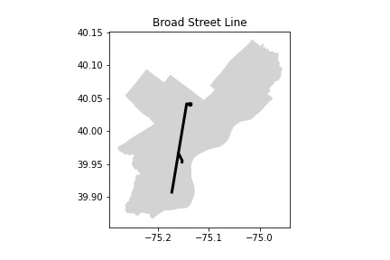
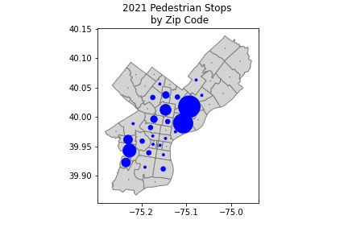

<!--

author:   Elizabeth Drellich
email:    drelliche@chop.edu
version:  1.0.0
module_template_version: 2.0.1
language: en
narrator: UK English Female
title: The Elements of Maps
comment:  This is a general overview of ways that geospatial data can be communicated visually using maps.
long_description: Raw geospatial data can be particularly tricky for humans to read. However the shapes, colors, sizes, symbols, and language that make up a good map can effectively communicate a variety of detailed data even to readers looking at the map with only minimum specialized background knowledge. This module will demystify how raw data becomes a map and explain common components of maps. It is appropriate for anyone considering making maps from geospatial data.
estimated_time: 30 minutes

@learning_objectives  

After completion of this module, learners will be able to:

- recognize the elements of maps
- describe types of maps that focus on particular elements.

@end

link:  https://chop-dbhi-arcus-education-website-assets.s3.amazonaws.com/css/styles.css

script: https://kit.fontawesome.com/83b2343bd4.js

-->

# The Elements of Maps

## Overview
@comment

**Is this module right for me?** @long_description

**Estimated time to completion:** @estimated_time

**Pre-requisites**
Some familiarity with latitude and longitude is required to get the most out of this module as all location data will be presented in that coordinate system.

**Learning Objectives**

@learning_objectives

## Creating a Map

Although a map can be an extremely effective way of sharing your data, be aware that as a visual medium, maps will be inaccessible to members of your audience who are visually impaired. While we are focusing on the visual aspects in this module, it is important to provide text summaries of your findings as well.

Interpreting the geospatial data presented by a map is one thing, but if you want to make a map, you need to know how geospatial data becomes a map.

The following map shows the city of Philadelphia, along with a few specific attributes:

- zip codes divide the city into regions,
- two train lines, the Broad Street Line (in orange) and the Market Frankfort Line (in dark blue) are also pictured,
- train stations along those two train lines are shown as black and white dots.

### Shapes

How did the data about stations, train lines (from [SEPTA](https://septaopendata-septa.opendata.arcgis.com/search?tags=Highspeed)), and zip codes (from [OpenDataPhilly](https://www.opendataphilly.org/dataset/zip-codes)) become a map? Each of those attributes was stored as text, a string of numbers representing one of the following types:

- Points (and Multipoints)
- Lines (and Mulitlines)
- Polygons (and Multipolygons)

Raw location data is stored as a set of points. This set of points is called a **geometry**.

In a tidy, tabular data array, you will have a column for the object name and a column for the geometry of that object. The names and geometries of the stations used for the map above are shown below:

<!-- style = "max-width:400px;" border = 5px solid -->

Note that the `geometry` column stores locations as longitude, followed by latitude.

Points
------

A point is a single location given by its longitude and latitude coordinates. On the map above, individual train stations are represented as points. The southernmost (bottom) station on the Broad Street Line, the NRG station has geometry `POINT (-75.17394 39.90543)`. A point has no length or width and therefore no area.

What objects are represented as points can depend on both the source of the geospatial data and the purpose of a particular map. For example if you are studying the health and safety of the city's unhoused population, representing a station that has multiple entrances as a single point could be insufficient. Alternatively if you are looking at national or global populations, the entire city of Philadelphia might be represented as a single point.

Lines
------

A line is an ordered sequence of points and all of the line segments connecting adjacent points. On the map above, the Market-Frankford and Broad Street train routes are represented as lines (actually multilines, which we will address that shortly). A line has length, but no width.

Since lines are made up of straight line segments, twists and turns a line require a lot of small line segments to accurately represent their geometry. While the Broad Street Line might look straight enough on the map, it is comprised of over 200 line segments!

Much like with points, which objects are represented as lines can depend on both the available data and the goal of your research. A road might be represented as a line when you are studying how children commute to school on a bus and are interested in the distance they travel. A similar study looking at children crossing large streets on the way to school might need additional information on how wide each street is. In that case, it could be helpful to represent streets not as lines but as polygons.

Polygons
-------

A polygon is a region encircled by a line that starts and ends at the same point. Each of the grey regions in the map above, representing zip codes, is a polygon. While the boundaries of these regions look curved, they are in fact made up of hundreds of straight line segments. A polygon has an inside and an outside. Its boundary is a line and it is possible to calculate the area of the polygon.

In theory, and with enough location data, you could represent every feature as a polygon. However this is extremely computationally intensive and might add a lot of work (for both the computer and the person operating it) without much added benefit. Even if the footprint of each train station were available for the map above, using those polygons would not improve the quality of this map since they would be too small to be visible.

Multipoints, Multilines, and Multipolygons
----------

Geospatial data doesn't always cleanly fit into a single point, line, or polygon. The orange Broad Street Line on the map above actually has a small loop at its northern end, and a "spur" just north of where it meets the Market-Frankford Line. These attributes can't be stored as a single ordered sequence of line segments, so they appear in the data files as multilines.

A **multiline** is a collection of two or more lines that make up a single geographic feature. Many rivers are multilines to account for tributaries flowing into the main river.

Similar to multilines are multipolygons. A **multipolygon** is a collection of two or more polygons that form a single geographic region. The US state of Michigan is usually represented as a multipolygon since it is separated into two parts by the Great Lakes and no single line could enclose both parts.

A **multipoint** is a collection of two or more points. Multipoints can be an extremely helpful data structure for some of the more complicated geographic analyses. For example if you want to know how far an address is from a subway station, you could create a multipoint of all of the stations and find the distance from that multipoint to the address. Without the multipoint, you would need to find the distance from the address to each of the stations and then find the minimum distance.

Software programs sometimes use different names for some shapes. For example QGIS calls a line containing more than two points a [polyline](https://docs.qgis.org/3.22/en/docs/gentle_gis_introduction/vector_data.html#polyline-features-in-detail).

### Language

While some geographic features are well understood enough to be recognizable from shapes alone, maps usually need some words in order to be understandable. Few shapes are globally familiar and even in settings where you might expect most of your audience to be comfortable with the outlines of your map, labeling can greatly increase a map's legibility.

Words
-------
It is a good practice to give every map a descriptive title, but the title doesn't need to be the only language on a map.

Many maps label individual features with their names. A world map might include ocean names, country names, and more. The map of Philadelphia trains that we saw before is more informative if we label the two train lines:

Numbers
-------

Numbers show the scale of a map. The map above has numbers on the side and bottom corresponding the the latitude and longitude respectively.

Other common uses of numbers of maps include measurement scales like "1cm = 10km" and elevation or depth markers. Sometimes the label of a particular region is itself a number, like on a map of Philadelphia zip codes.

Too much language on a map can be just as confusing as too little!

Legends and Keys
------------
A **legend** or **key** is a way to associate language with colors, sizes, or symbols without crowding too much language onto the visual.

## Displaying Data

Now that you know what goes into the outlines of a map, you likely want to use a map to display your data. Perhaps you have data on the locations of car accidents, or household income by neighborhood, or maybe you have addresses of households in which children have childhood asthma. You will need to use other elements to communicate the data you care about.

Before we look at other ways to communicate data, let's take a look at what we can see with just shapes:

Dot Distribution Map
-----------------
A dot distribution map lets you display the location of many individual, related events. Using data from [OpenDataPhilly](https://www.opendataphilly.org/dataset/vehicular-crash-data) we can plot every reported vehicular crash from 2019:

In this section we will discuss other elements of maps, and learn about types of maps that use these elements to display data.

### Colors

Not everyone can distinguish colors. While colors can be a powerful tool, if colors are the only way your are distinguishing features on your map, those features will be invisible to some of your audience.

While color isn't universally accessible, it is still an important way tool for distinguish features from each other on a map.

Hue
------

When choosing what color a certain feature should be, it is important to consider the larger context of the map. Our map of Philadelphia made the two train lines orange and blue, which are the colors used on both the signs and the train cars on those lines. While our map could have used other colors, that might have been visually confusing for people familiar with these trains.  

A more universal example is the convention that bodies of water are colored blue. Unless you have a good reason to use other colors, stick to this convention to avoid confusing your audience.

Intensity
---------

You can convey a lot of information with a single color by varying its intensity. A map showing ocean depth might be a deeper, darker blue where the water is deep, and a lighter shade where the water is shallow.

Using color intensity rather than changing hues to show differences can make a map more accessible to some readers.

---

**Two types of maps that rely primarily on color for displaying data are heat maps and choropleth maps.**

Heat Maps
---------

A heat map is a useful way to show how points cluster together. This heat map uses the same Philadelphia vehicle [crash data](https://www.opendataphilly.org/dataset/vehicular-crash-data) from 2019 from before:

<!-- style = "max-width:400px;" border = 5px solid -->

Instead of showing each individual crash, this map assigns colors based on how many of the crash locations are within a fixed distance. The brighter red you see on the map, the more crashes were close to that point. Green and blue colors are near to fewer crashes.

This map can show us interesting information, and also mislead if it isn't in the proper context. We are only looking at crashes inside the city, so this heat map may lead to the mistaken assumption that there are fewer crashes near the edge of the city because even though based on the data from within the city those areas are lighter colors. On the other hand, the redder region in the lower left of the map is where several highways converge near the Philadelphia airport, so that concentration of crashes might be a real observation.

Choropleth Maps
-----------
A choropleth map (pronounced "koro-pleth") colors map regions based on data. These maps may be familiar as they are frequently used by news organizations to display both political news, like election results, and public health news, like rates of Covid-19.

The map below colors each zip code in Philadelphia by how many times police stopped pedestrians within that area in 2021. The darkest red regions are where the most stops occurred, while the lighter regions had fewer stops.

The number of pedestrian stops in each zip code range from only three stops in 19109, which is a single square block near City Hall comprised mainly of office buildings, to 1371 stops in zip code 19134.

The colors in this map are points along a gradient, but a choropleth map could also designate certain colors for particular ranges of data. A common technique is to divide the regions into quartiles and then use four shades to color the quartiles from lowest to highest value.

### Sizes

The sizes of the regions on a map are usually determined by the geometry we looked at in the [Shapes](#shapes) section. While you might zoom into or out of a particular region, the sizes of those regions don't communicate non-geographic data.

But while polygons stay the same size, a lot can be conveyed by modifying the size of points and lines. A road map might us a very thick line for a highway, a medium thickness line for a paved road that is not a highway, and a thin line for dirt roads. Similarly the size of the text describing locations might vary from large text for large cities to very small text for small towns.

While polygons stay the same size and lines can really only vary in thickness, points have a lot of flexibility in their size. By changing the size of a point's marker, a map can convey a substantial amount of non-geographic data without compromising its locational accuracy.

---

Let's revisit the data on pedestrian stops made by law enforcement in the city of Philadelphia in 2021 using two types of maps that rely primarily on size for displaying data.

Proportional symbol map
--------------
In a proportional symbol map, the size of each symbol is proportional to the data for that location.

In the map below, each zip code has a single point in it, but the points range in size from very small dots to circles that almost fill their geographic region. The bigger the point, the more pedestrian stops that zip code had in 2021.

Graduated symbol map
--------------
A graduated symbol map is similar, but there are only a few different sizes of dots. In this case there are ? sizes, each corresponding to a different range of numbers.

Take a look at the two southernmost zip codes at the bottom of the map. In this graduated symbol map, they are marked by dots of the same tiny size. In the proportional symbol map you can see that though both are small dots, the one on the right is far smaller than the one on the left.

The difference between proportional and graduated symbol maps may look small, but touches on a a bigger question of what type of data you are working with. A proportional symbol map is more appropriate when you have **continuous data**, while a graduated symbol map is better at presenting **discrete data** in which each data point falls into one only a few bins.

This distinction between continuous and discrete data also shows up in the color choices of the choropleth maps we saw earlier.

Another way to display data using sizes is with a [**cartogram**](https://en.wikipedia.org/wiki/Cartogram). A cartogram scales and distorts regions so that the size of the region reflects the data.

### More

Symbols
-------

The maps we have seen previously have only used one type of symbol, a dot. While the sizes of the dots varied in the proportional and graduated symbol maps, we could also use multiple types of symbols to differentiate data points. Revisiting the vehicle crash data that we saw earlier, each incident includes a note of whether there were any pedestrian or bicyclist deaths. We can plot all of these incidents and use different symbols, a plus sign for pedestrians and a star for cyclists, to show which is which.

Lines can also be represented differently to show, symbolically rather than with color, how they differ. A dotted line might represent one type of boundary or path, while a dashed line could represent another.

Shapes can also be patterned or marked with symbols to indicate particular features. Be careful, though, as using patterns to differentiate regions can quickly get very busy-looking.

Combining Types of Maps
--------------------
You are not restricted to using only one type of map at a time. The data you want to display might benefit from a combination of multiple features. Perhaps you want to look at a heat map of pedestrian stops made by police, overlayed with the locations of police stations, schools, and liquor stores, each identified by a different symbol.

Or perhaps a choropleth could show you the concentration of green spaces in the city while each zip code is also labeled with the medium household income of its residents.

Just because you can use different elements to create maps that show many types of data together, doesn't mean it is a good idea. Remember that the best maps communicate their message clearly. If fitting all of your data onto a single map means none of it is understandable, you probably need to use more than one map to display that data!

## Reference

Elements of Maps
--------------

| Shapes       | Colors                           | Sizes                    | Language    | Symbols |
|:--|:--|:--|:--|:--|
| Points   |  Hue (water is blue)          | Thick / thin lines   |  Scales   | Specify locations |
| Lines    |  Intensity (e.g. water depth) | Large / small points |   Numbers | Solid / broken lines |
| Polygons |                                  |                   |  Words    | Patterned regions |

Types of Maps
--------------

We have seen several named types of maps in this lesson:

| Type | Example |
|:--:|:--:|
| Dot Distribution | <!-- style = "max-width:200px;" border = 5px solid --> |
| Heat Map | <!-- style = "max-width:200px;" border = 5px solid -->|
| Choropleth | <!-- style = "max-width:200px;" border = 5px solid --> |
| Graduated Symbol Map | <!-- style = "max-width:200px;" border = 5px solid --> |
| Proportional Symbol Map | <!-- style = "max-width:200px;" border = 5px solid -->  |

## Quiz

Which of the following statements about latitude and longitude are TRUE?

[[X]] Every location on Earth can be described using latitude and longitude.
[[ ]] The location of equator was an arbitrary decision made by historical map makers.
[[ ]] Locations east of the prime meridian are represented by positive longitudes and locations west of the prime meridian are represented by negative longitudes.
[[X]] Locations north of the equator are represented by positive latitudes and locations south of the equator are represented by negative latitudes.
***

Every location on Earth can be described using latitude and longitude. Positive latitudes are north of the equator and positive longitudes are east of the prime meridian while negative latitudes and longitudes are to the south and west, respectively. While the location of the prime meridian was chosen for historical reasons, the location of the equator is fixed by the planet's rotation.

***

Which types of geometry might be appropriate to represent a hospital on a map? Select all possibilities.

[[X]] Point
[[X]] Multipoint
[[ ]] Line
[[ ]] Multiline
[[X]] Polygon
[[X]] Multipolygon
***

The type of geometry depends on both the structure of the hospital, and the reason you are interested in it.

If you care about where the hospital is located in a city or country, a point might be an appropriate geometry. If the hospital has multiple locations, a multipoint could capture all of those locations.

If you are studying how the hospital building interacts with the surrounding neighborhood, it may be better to use a polygon representation of the footprint of the hospital. If the hospital has several buildings, a mulitpolygon geometry can include all of the buildings.

***

Consider a data set that contains the home addresses of of participants in a study that measures the level of lead in their blood. What types of maps could be appropriate for representing this data? There is no one correct answer, so think about what you would do and only then read our suggestions.

[[____]]

Click to see some possible answers

 

The best ways to present this data with a map depends on both the quantity of data you have, and what you are trying to show with the data. A study with a large number of participants might benefit from a choropleth or heat map.

- A choropleth map could show the percentage of participants living in each geographical subregion who have lead levels over a certain limit.
- A heat map could be used to show where the participants with lead levels above a certain threshold are most concentrated.
- A dot distribution where dots are colored by lead level, either continuously or in discrete buckets, might help illustrate if there are certain spots where lead is more prevalent.

 

## Additional Resources

All of the maps shown in this module were created in a Jupyter notebook that you are welcome to [explore for yourself](https://github.com/arcus/education_modules/blob/visual_vocab_of_geospatial_data/elements_of_maps/media/elements_of_maps.ipynb).

QGIS, an open source GIS platform has a [Gentle Introduction to GIS](https://docs.qgis.org/3.22/en/docs/gentle_gis_introduction/index.html).

For more on the distinctions between different kinds of maps, check out these resources by [gisgeography.com](https://gisgeography.com/dot-distribution-graduated-symbols-proportional-symbol-maps/#:~:text=Graduated%20symbol%20maps%20and%20proportional%20symbol%20maps%20scale%20the%20size,instead%20of%20scaling%20them%20larger) and the [geopandas guide to mapping](https://geopandas.org/en/stable/docs/user_guide/mapping.html).

## Feedback

In the beginning, we stated some goals.

**Learning Objectives:**

@learning_objectives

We ask you to fill out a brief (5 minutes or less) survey to let us know:

* If we achieved the learning objectives
* If the module difficulty was appropriate
* If we gave you the experience you expected

We gather this information in order to iteratively improve our work.  Thank you in advance for filling out [our brief survey](https://redcap.chop.edu/surveys/?s=KHTXCXJJ93&module_name=%22Elements+of+Maps%22)!
