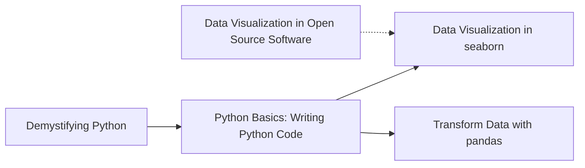

```mermaid 
graph LR
data_visualization_in_seaborn[Data Visualization in seaborn];
click data_visualization_in_seaborn href "https://liascript.github.io/course/?https://raw.githubusercontent.com/arcus/education_modules/main/data_visualization_in_seaborn/data_visualization_in_seaborn.md";
demystifying_python[Demystifying Python];
click demystifying_python href "https://liascript.github.io/course/?https://raw.githubusercontent.com/arcus/education_modules/main/demystifying_python/demystifying_python.md";
pandas_transform[Transform Data with pandas];
click pandas_transform href "https://liascript.github.io/course/?https://raw.githubusercontent.com/arcus/education_modules/main/pandas_transform/pandas_transform.md";
python_basics_writing_python_code[Python Basics: Writing Python Code];
click python_basics_writing_python_code href "https://liascript.github.io/course/?https://raw.githubusercontent.com/arcus/education_modules/main/python_basics_writing_python_code/python_basics_writing_python_code.md";
python_basics_writing_python_code[Python Basics: Writing Python Code] --> data_visualization_in_seaborn[Data Visualization in seaborn];
data_visualization_in_open_source_software[Data Visualization in Open Source Software] -.-> data_visualization_in_seaborn[Data Visualization in seaborn];
click data_visualization_in_open_source_software href "https://liascript.github.io/course/?https://raw.githubusercontent.com/arcus/education_modules/main/data_visualization_in_open_source_software/data_visualization_in_open_source_software.md";
python_basics_writing_python_code[Python Basics: Writing Python Code] --> pandas_transform[Transform Data with pandas];
demystifying_python[Demystifying Python] --> python_basics_writing_python_code[Python Basics: Writing Python Code];
``` 
