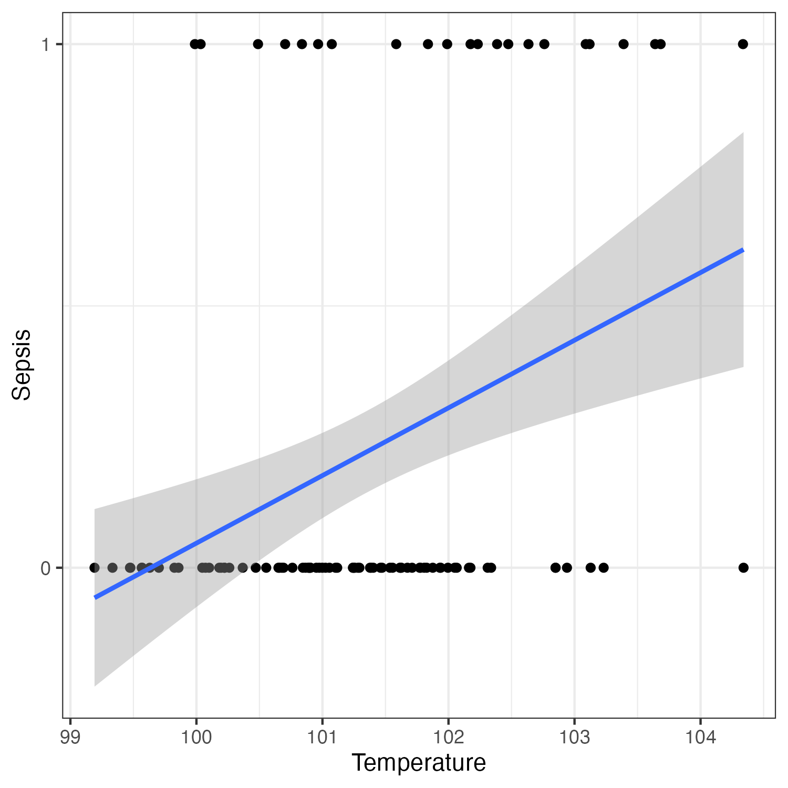

<!--

author:   Rose Hartman
email:    hartmanr1@chop.edu
version:  0.0.0
current_version_description: Initial version
module_type: standard
docs_version: 3.1.1
language: en
narrator: UK English Female
mode: Textbook

title: Generalized Linear Regression

comment:  This is a short, focused description of the module.

long_description: This is a longer description, which should be understandable for a lay audience.

estimated_time_in_minutes: 

@pre_reqs
Learners should already be familiar with the following concepts in statistics and math:

- linear regression (also called "ordinary least squares (OLS) linear regression")
- the equation of a line (intercept and slope)
@end

@learning_objectives  
After completion of this module, learners will be able to:

- identify key elements
- create a product
- do a task
- articulate the rationale for something
@end

good_first_module: false
collection: statistics
coding_required: false

@sets_you_up_for

@end

@depends_on_knowledge_available_in
- intro_to_nhst
@end

@version_history 
No previous versions.
@end

import: https://raw.githubusercontent.com/arcus/education_modules/main/_module_templates/macros.md
-->

# Generalized Linear Regression

@overview

## Linear models: A quick review

Many of the most common statistical tests are applications of one big overarching statistical approach, called the **General Linear Model**. 
Correlation, t-tests, ANOVAs, and linear regression are all examples of linear models. 

A linear model is anything that can be expressed as an equation for a line: 

$$
Y = \beta_0 + \beta_1 * X_1 + \beta_2 * X_2 ... \beta_n * X_n + e 
$$

<div class = "care">
<b style="color: rgb(var(--color-highlight));">A little encouragement...</b><br>

Even if you're used to running regression models in your own analyses, you may feel like your grasp of the math behind linear models is not strong. 
You're not alone!

For an approachable review of linear regression models, including a review of the equation behind them, check out this [article explaining linear regression](https://education.arcus.chop.edu/ordinary_linear_regression/).

</div>

For example, we could express a model [predicting fetal weight from sonographic measurements of femur length](https://www.ncbi.nlm.nih.gov/pmc/articles/PMC6077071/) as the equation:

$$
fetal\_weight = \beta_0 + \beta_{femoral_length} * femoral_length + e
$$ 

If we wanted to look at differences in fetal weigh by sex (a categorical predictor) instead, the equation would actually look quite similar (assuming that the sex variable was coded 0 and 1 in the data): 

$$
fetal\_weight = \beta_0 + \beta_{sex} * sex + e
$$ 

What if you want to model sex and femur length together at the same time? No problem, you can add as many predictors to a linear model as you like: 

$$
fetal\_weight = \beta_0 + \beta_{femoral_length} * femoral_length + \beta_{sex} * sex + e
$$ 

And you can allow quite a lot of complexity and nuance in a linear model as well, by including things like interaction terms or polynomial terms. 

<div class = "learn-more">
<b style="color: rgb(var(--color-highlight));">Learning connection</b><br>

To learn more about interaction terms in linear models, checkout this [article about how to interpret interactions in a regression model](https://education.arcus.chop.edu/understanding-interactions/).

</div>

Linear models are so popular in statistics because equations for lines are computationally simple (even if they're not simple to understand!) but still allow us to model pretty complex relationships.

It would be handy if linear models covered all possible research questions, but unfortunately they don't!
**Generalized linear models are a way to extend the functionality of linear models to cover situations when they normally wouldn't work.**

## Why do we need generalized linear models?

Linear models are only appropriate when your outcome variable(s) are **continuous** and **unbounded**. 
If you want to model a categorical outcome, or one that's bounded (like a proportion or percent), then usually can't rely on regular linear modeling to get the job done. 

<h3>What counts and continuous and unbounded?</h3>

A variable is **continuous** if it can take any value on a scale, not just discrete options. 
For example, age is generally continuous because you can be 11 years old, or 11.5, or 11.476 years old, etc.
In contrast, experimental group (treatment vs. control) is not continuous; there's no way to be halfway between treatment and control, you're in one or the other. 
Something like medication dose could be continuous or categorical depending on how it's used. 
If patients are restricted to categorical levels of dose (e.g. high, med, or low dose groups) then it would be categorical. 
But if it's something where their dose might theoretically be anywhere on the scale, then it's continuous.

A variable is **unbounded** if it can theoretically extend from negative infinity at the low end to positive infinity at the high end. 
We often have variables that aren't truly unbounded, but they're close enough for all practical purposes -- for example, IQ can't technically be negative, but in practice no measured IQs are close to 0 so the data stop naturally before they hit a the scale boundary at 0. 
IQ is generally treated as unbounded statistically.

Something like a probability or proportion is bounded at 0 and 1; it's not possible to have a negative probability, or one over 1. 

A variable like age might be unbounded or bounded depending on what ages you're studying. 
In a young pediatric population, age is bounded at 0 because you can't have any negative ages and a distribution of infant ages will get cutoff at that lower bound. 
But if you're studying adults, then age might be functionally unbounded in your dataset.

<div class = "learn-more">
<b style="color: rgb(var(--color-highlight));">Learning connection</b><br>

For an excellent review of continuous vs. categorical variables, see the [Khan Academy video on discrete and continuous random variables](https://www.khanacademy.org/math/statistics-probability/random-variables-stats-library/random-variables-discrete/v/discrete-and-continuous-random-variables).

</div>

We can coerce problematic outcome variables into nice, continuous ones so that we can still model them with a line.
The strategy for transforming your outcome depends on what its distribution is like to begin with --- if it's binary (or bounded at 0 and 1), then a logit works well. 
If it's count data, then a log is the right transformation, etc.

<div class = "important">
<b style="color: rgb(var(--color-highlight));">Important note</b><br>

Generalized linear models are just linear models on data that's been transformed with a link function.

</div>

## Quiz: Linear models

True or False: Both linear models and generalized linear models are based on the equation for a line. 

[(X)] TRUE
[( )] FALSE

## Special considerations for generalized linear models

When you run generalized linear models, it feels very similar in many ways to running a regular linear model. 
Your output will look largely similar (coefficient tests, measurement of overall model fit, etc.). 
Under the hood, though, your statistical software is doing something very different.

Unlike linear models, there is not a single analytic solution to generalized linear models -- that means you couldn't (even if you wanted to) figure out the solution by solving the equation by hand. 
Instead, the computer uses brute force to find a solution, iterating over tons of combinations of parameter estimates and seeing which gives the best model fit.

This means the results are not exact --- they depend on the sampling algorithm being used --- so you might see very small changes if you run the model again, or if you run it on other software. There's also a risk that your model won't converge if it's too complicated and you don't have enough data.

## Logistic regression

One of the most common kinds of generalized linear model is logistic regression. 
That's a linear model using a [logit](https://en.wikipedia.org/wiki/Logit) transformation to convert the outcome that's binary (or continuous but bounded at 0 to 1, like a proportion).

<div class = "behind-the-scenes">
<b style="color: rgb(var(--color-highlight));">Behind the scenes</b><br>

It's not necessary to really understand the logit transformation to be able to use logistic regression, so feel free to skip this bit if you don't find it helpful. 
But if you'd like to get a better idea of how the math works, here goes!

Data bounded at 0 and 1, like probabilities or binary outcomes, can be converted to unbounded data as follows:

1. Probabilities can be converted to odds by dividing the probability by 1-(the probability). So a probability of .5 becomes $0.5/(1-0.5) = 1$.
2. Odds are unbounded at the upper end (they can theoretically go to positive infinity), but they're still bounded at the lower end, at 0. We can fix that by taking the natural log of the odds. The natural log of the odds is called a logit. For a probability of .5, the logit would be $Ln(0.5/1-0.5) = 0$.

To build your intuition of probability, odds, and log-odds, it may be helpful to consider what counts as "likely" or "unlikely" for each. 
If an event is unlikely to happen, it would have a probability less than .5. 
That corresponds to an odds of less than 1, and a log-odds of less than 0. 
If an event is likely to happen, then the probability would be greater than .5, the odds would be greater than 1, and the log-odds would be greater than 0. 

</div>

### Example

Let's return to the linear model example we were considering, predicting fetal weight from femoral length measured during an ultrasound. 
As a reminder, here's the linear equation for that model: 

$$
fetal\_weight = \beta_0 + \beta_{femoral_length} * femoral_length + e
$$ 

But what if you're interested in predicting not weight, but whether or not the fetus has trisomy 21, a binary outcome?
In this case the predictor would be something like femur length (FL) relative to head size (biparietal diameter, BPD), so the variable captures whether the femur is relatively long or short for the fetus's overall size.
(Note that [although relative femur length has historically been used as a way to try to identify pregnancies affected by trisomy 21, its value as a predictor has been called into question]((https://pubmed.ncbi.nlm.nih.gov/11117083/)), especially for early in pregnancy. 
It's still a useful example of a model with a binary outcome, though!) 

$$
trisomy\_21\_dx = \beta_0 + \beta_{BPD/FL} * BPD/FL + e
$$ 

<div class = "cool-fact">
<b style="color: rgb(var(--color-highlight));">Did you know?</b><br>

Trisomy 21 is the most common chromosomal condition!
Learn more about trisomy 21 at the [National Down Syndrome Society website](https://ndss.org/about). 

</div>

Assume that `trisomy_21_dx` is coded as 0 (no) or 1 (yes) in the data.
**What would happen if you just tried to estimate this as a regular linear model?**

#### Trying a linear model 



``` -See the R code to generate the fake data
library(tidyverse)
# set the random seed so results replicate exactly with the random number generators
set.seed(24601)

# sample size
n <- 100

# random sampling of 0 and 1 for trisomy_21_dx
# sample from a normal distribution for BPD/FL, but use a higher mean if trisomy_21_dx == 1
data <- data.frame(trisomy_21_dx = sample(x = c(0,0,0,1), 
                                          size = n, 
                                          replace = TRUE)) |> 
  mutate(`BPD/FL` = ifelse(trisomy_21_dx == 1, 
                           rnorm(n, mean = 1.6, sd = .2),
                           rnorm(n, mean = 1.5, sd = .2)))
```

This model shows the probability of trisomy 21 diagnosis on the y-axis (0 = no, 1 = yes), and ratio of BPD to femur length on the x-axis. 
As we might expect, the probability of trisomy 21 diagnosis goes up as BPD/FL increases.
But there are also a couple serious problems with the above plot: 

 - First, you can see from the line of best fit that the probability of trisomy 21 diagnosis never gets above .5 for the observed values of BPD/FL. If we used 50% probability as a cutoff, that means we would never predict that any fetus had trisomy 21 based on these data --- not a very useful model.
 - Secondly, at very low values of BPD/FL, the predicted value for trisomy 21 diagnosis actually goes below 0. What does it mean to have a negative probability of trisomy 21? That value doesn't make any sense.

#### Transform with a link function


## Other kinds of GLMs

Let's say you wanted to see if the number of experiments reported in each article varies by journal. 

```r
summary(osf$Number.of.experiments)

hist(osf$Number.of.experiments)
```

There are a couple reasonable options for a link function here. Let's go with Poisson.

```r
osf.pois <- osf %>% 
  select(Number.of.experiments, Journal) %>% 
  filter(Journal != "Infant behavior & development") %>% 
  na.omit()
```

\hwydt{Write the glm call to model number of experiments by journal, using a Poisson link.}

```r
pois.model <- glm(Number.of.experiments ~ Journal, data=osf.pois,
                   family=poisson(link = "log"),
                   na.action=na.exclude)  
```

```r
ggplot(osf.pois, aes(x=Number.of.experiments)) + 
  geom_histogram() 
```

Show Journal info as well

```r
ggplot(osf.pois, aes(x=Number.of.experiments, fill=Journal)) + 
  geom_histogram()

ggplot(osf.pois, aes(x=Number.of.experiments, fill=Journal)) + 
  geom_density(alpha=.3, adjust=2) 
```

Try adding facet wrap by Journal as well, to put each density plot in its own facet.

## Quiz

True or False: Generalized linear models actually still use a line for the model (like ordinary linear regression), they just transform the outcome variable first.

[(X)] TRUE
[( )] FALSE
***
<div class = "answer">

True! 
We can only use ordinary linear regression when the outcome variable is continuous and unbounded, so if you have, for example, a binary outcome, then a regression model won't work unless you first transform the outcome to be continuous and unbounded -- that's what generalized linear models do! 

</div>
***

True or False: The logit transformation is an appropriate way to convert a variable that is binary or bounded at 0 and 1 (like a probability or proportion) to a continuous variable that isn't bounded.

[(X)] TRUE
[( )] FALSE
***
<div class = "answer">

True! 
We can only use linear regression when the outcome variable is continuous and unbounded, so if you have, for example, a binary outcome, then a regression model won't work unless you first transform the outcome to be continuous and unbounded -- that's what generalized linear models do! 

</div>
***

The transformation that will work (also called a "link" function) depends on the shape of the outcome variable to start with. 
For binary outcomes, a logit transformation works well. 
A generalized linear model with a logit link function is often called "logistic regression" for short.

## Additional Resources

There's an excellent chapter on [Logistic Regression](https://online.stat.psu.edu/stat504/lesson/6) published by Penn State.

If you'd like to compare output from different kinds of statistical software, [UCLA's IDRE](https://stats.oarc.ucla.edu/other/dae/) has published data analysis examples for logistic regression in [R](https://stats.oarc.ucla.edu/r/dae/logit-regression/), [Stata](https://stats.oarc.ucla.edu/stata/dae/logistic-regression/), [SPSS](https://stats.oarc.ucla.edu/spss/dae/logit-regression/), [SAS](https://stats.oarc.ucla.edu/sas/dae/logit-regression/), and [MPlus](https://stats.oarc.ucla.edu/mplus/dae/logit-regression/). 

## Feedback

@feedback
