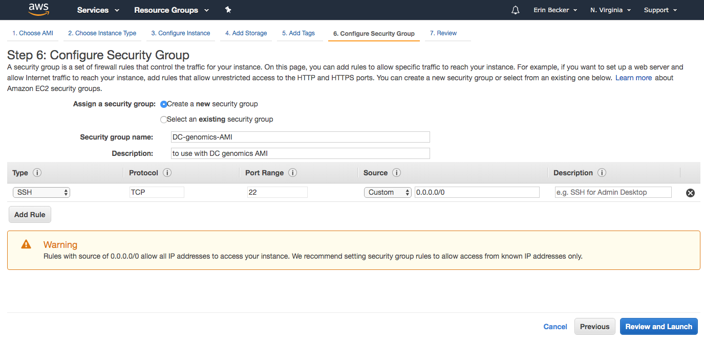
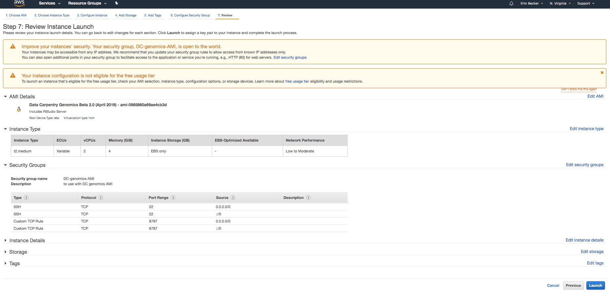
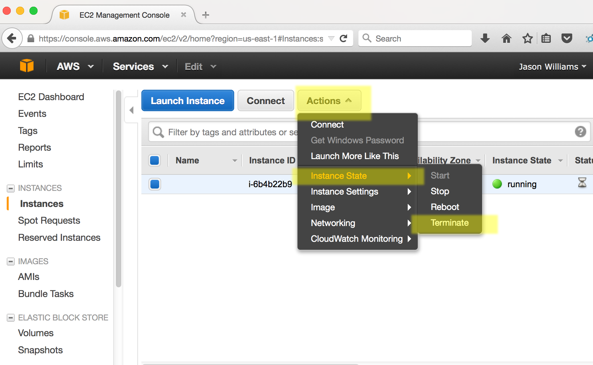

<!--

author:   Rose Hartman
email:    hartmanr1@chop.edu
version:  0.0.1
module_template_version: 2.0.0
language: en
narrator: UK English Female
title: Genomics Tools and Methods: Introduction
comment:  This is a short, focused description of the module.
long_description: This is a longer description, which should be understandable for a lay audience. It will print under "Is this module right for me?" in the overview.
estimated_time: This is rough guess of how long it might take a learner to work through the module. It will print under "Estimated time to completion" in the overview

@learning_objectives  

After completion of this module, learners will be able to:

- identify key elements
- create a product
- do a task
- articulate the rationale for something

@end

link:  https://chop-dbhi-arcus-education-website-assets.s3.amazonaws.com/css/styles.css

script: https://kit.fontawesome.com/83b2343bd4.js

-->

# Genomics Tools and Methods: Introduction

<div class = "overview">

## Overview
@comment

**Is this module right for me?** @long_description

**Estimated time to completion:** @estimated_time

**Pre-requisites**

This lesson assumes a working understanding of the bash shell.
If you aren’t familiar with the bash shell, please review our [Command Line 101 module](https://liascript.github.io/course/?https://raw.githubusercontent.com/arcus/education_modules/main/bash_scripting_101/bash_scripting_101.md) and/or the [Shell Genomics lesson by Data Carpentry](http://www.datacarpentry.org/shell-genomics/) before starting this lesson.

This lesson also assumes some familiarity with biological concepts, including the structure of DNA, nucleotide abbreviations, and the concept of genomic variation within a population.

**Learning Objectives**

@learning_objectives

</div>

## Getting started with genomics

Analysis of genomic sequencing data is different from many other kinds of analysis in several important ways:

- the data files are often so large that normal computing tools won't work to analyze them
- there are special issues of data quality to consider that are specific to sequencing data
- because of the unique challenges of genomics data, a number of specialized tools have been developed for each stage of the workflow, many of which have to be accessed via the command line

This module focuses specifically on how to set yourself up for genomics analysis; we won't actually start the analysis process here (there are related modules on that).


As you progress through the material in this and related lessons, keep in mind that, even if you aren’t going to be doing this exact same workflow in your research, you will be learning some very important lessons about using command-line bioinformatic tools.
What you learn here will enable you to use a variety of bioinformatic tools with confidence and greatly enhance your research efficiency and productivity.

## Using the command line

A lot of genomics analysis is done using command-line tools for three reasons:

1) you will often be working with a large number of files, and working through the command-line rather than through a graphical user interface (GUI) allows you to automate repetitive tasks,
2) you will often need more compute power than is available on your personal computer, and connecting to and interacting with remote computers requires a command-line interface, and
3) you will often need to customize your analyses, and command-line tools often enable more customization than the corresponding GUI tools (if in fact a GUI tool even exists).

Before starting this lesson, you should have tried using the bash shell to interact with your computer through a command line interface.
Now you will be applying this knowledge to carry out a common genomics workflow - identifying variants among sequencing samples taken from multiple individuals within a population.
We will be starting with a set of sequenced reads (.fastq files), performing some quality control steps, aligning those reads to a reference genome, and ending by identifying and visualizing variations among these samples.

## The data

We are going to use a long-term sequencing dataset from a population of *Escherichia coli*.

 - **What is *E. coli*?**
    - *E. coli* are rod-shaped bacteria that can survive under a wide variety of conditions including variable temperatures, nutrient availability, and oxygen levels. Most strains are harmless, but some are associated with food-poisoning.

 ](../img/172px-EscherichiaColi_NIAID.jpg)

<!-- https://species.wikimedia.org/wiki/Escherichia_coli#/media/File:EscherichiaColi_NIAID.jpg -->

 - **Why is *E. coli* important?**
    - *E. coli* are one of the most well-studied model organisms in science. As a single-celled organism, *E. coli* reproduces rapidly, typically doubling its population every 20 minutes, which means it can be manipulated easily in experiments. In addition, most naturally occurring strains of *E. coli* are harmless. Most importantly, the genetics of *E. coli* are fairly well understood and can be manipulated to study adaptation and evolution.

<div class = "learnmore">
For more information on why this particular dataset was chosen, see the [Data Carpentry summary page on these data](https://datacarpentry.org/organization-genomics/data/).
</div>

### This dataset

- The data we are going to use is part of a long-term evolution experiment led by [Richard Lenski](https://en.wikipedia.org/wiki/E._coli_long-term_evolution_experiment).

- The experiment was designed to assess adaptation in *E. coli*. A population was propagated for more than 40,000 generations in a glucose-limited minimal medium (in most conditions glucose is the best carbon source for *E. coli*, providing faster growth than other sugars). This medium was supplemented with citrate, which *E. coli* cannot metabolize in the aerobic conditions of the experiment. Sequencing of the populations at regular time points revealed that spontaneous citrate-using variant (**Cit+**) appeared between 31,000 and 31,500 generations, causing an increase in population size and diversity. In addition, this experiment showed hypermutability in certain regions. Hypermutability is important and can help accelerate adaptation to novel environments, but also can be selected against in well-adapted populations.

- To see a timeline of the experiment to date, check out this [figure](https://en.wikipedia.org/wiki/E._coli_long-term_evolution_experiment#/media/File:LTEE_Timeline_as_of_May_28,_2016.png), and this paper [Blount et al. 2008: Historical contingency and the evolution of a key innovation in an experimental population of *Escherichia coli*](http://www.pnas.org/content/105/23/7899).

### The metadata

We will be working with three sample events from the **Ara-3** strain of this experiment, one from 5,000 generations, one from 15,000 generations, and one from 50,000 generations.
The population changed substantially during the course of the experiment, and we will be exploring how (the evolution of a **Cit+** mutant and **hypermutability**) with our variant calling workflow.

The metadata file associated with this lesson can be [downloaded directly here](https://raw.githubusercontent.com/datacarpentry/wrangling-genomics/gh-pages/files/Ecoli_metadata_composite.csv) or [viewed in Github](https://github.com/datacarpentry/wrangling-genomics/blob/gh-pages/files/Ecoli_metadata_composite.csv).

Open the metadata file and examine it now.

The metadata describes information on the *Ara-3* clones, and the columns represent:

| Column           | Description                                |
|------------------|--------------------------------------------|
| strain           | strain name					|
| generation       | generation when sample frozen		|
| clade            | based on parsimony-based tree		|
| reference        | study the samples were originally sequenced for				|
| population       | ancestral population group |
| mutator          | hypermutability mutant status |
| facility         | facility samples were sequenced at |
| run              | Sequence read archive sample ID		|
| read_type        | library type of reads |
| read_length      | length of reads in sample |
| sequencing_depth | depth of sequencing |
| cit              | citrate-using mutant status		|

<div class = "learnmore">
If you would like to know details of how the file was created, you can look at [some notes and sources here](https://github.com/datacarpentry/wrangling-genomics/blob/gh-pages/files/Ecoli_metadata_composite_README.md).
</div>

## Quiz

**Based on the metadata, answer the following questions:**

How many different generations exist in the data?

[[25]]
****
<div class = "answer">
</div>
****

How many rows are in this data?

[[62]]
****
<div class = "answer">
There are 62 rows, 12 columns.
</div>
****

How many citrate+ mutants have been recorded in **Ara-3**?

[[10]]
****
<div class = "answer">
</div>
****

How many hypermutable mutants have been recorded in **Ara-3**?

[[6]]
****
<div class = "answer">
</div>
****

## Setting up your computing environment in AWS

<div class = "important">
Genomics analyses use large data files.
Even for the example data used here, which is from a relatively simple genome, many of the files will be too big to work with on a standard personal computer.
Therefore, **we strongly recommend that you perform the analyses in the cloud (AWS) rather than on your own machine**.
</div>

For these lessons, we will take advantage of the AMI instances generously built and freely shared by Data Carpentry.
You will need to create your own copy of the AMI instance using the instructions below from Data Carpentry.

The cost of using this AMI for a few days, with the t2.medium instance type is very low (about USD $1.50 per day).
Data Carpentry has no control over AWS pricing structure and provides this cost estimate with no guarantees.
Please read [AWS documentation on pricing](https://docs.aws.amazon.com/awsaccountbilling/latest/aboutv2/billing-getting-started.html) for up-to-date information.

### Create an AWS account

1. Go to Amazon Web Services [https://aws.amazon.com/](https://aws.amazon.com/)

2. Follow the button to sign up for an account - you will need to agree to Amazon's terms and conditions and provide credit card information.

### Sign into AWS and Launch an Instance

1. Sign into the AWS EC2 Dashboard: [https://console.aws.amazon.com/ec2/](https://console.aws.amazon.com/ec2/)

2. Click the 'Launch Instance' button  


3. In 'Step 1' you will be asked to choose an Amazon Machine Image (AMI), on the lefthand side, look for 'Community AMIs' and then search for the AMI `ami-04b3bc83255f918b0` (Data Carpentry Genomics with R 4.0); select that image  


<div class = "important">
Please note that you must set your location as `N. Virginia` in order to access this community AMI.
You can change your location in the upper right corner of the main AWS menu bar.
</div>

4. For 'Choose an Instance Type' select **t2.medium**; then click 'Review and Launch'  

  

5. Click on "6. Configure Security Group" in the top navigation menu. If this is your first time working with this AMI on your AWS account, choose "create a new security group". Name your security group something descriptive (for example "DC-genomics-AMI") and enter a description into the description box (for example "to use with DC genomics AMI").

Your security group should now look like this:



6. Click "Add Rule". A new row will appear. Select "Custom TCP Rule" and enter "8787" into box labeled "Port Range". Under the "Source" box, select "Anywhere" for both security rules. Click "Review and Launch".

You should now see a screen that looks like this:



7. Click "Launch". You will be asked to select an existing key pair or create a new key pair. Select "Create a new key pair" and enter a name for your key pair.


8. Then click "Download Key Pair". Your key pair file ends in `.pem`. Move it from your Downloads folder to a stable location on your computer. For these instructions, we will move it to our Desktop. You can do this by dragging and dropping the file from your Downloads folder to your desktop. Then click "Launch Instance".

You instance will now be launched.
You should follow the links to 'Create billing alerts' and then the instructions in the next sections for connecting to and terminating your Amazon Instance.

### Connect to your Amazon instance on Windows

<div class = "important">
If you are using a Mac or Linux operating system, ignore these instructions and skip to [Connect to your Amazon instance on Mac or Linux](#connect-to-your-amazon-instance-on-mac-or-linux).
</div>

1. Download the PuTTY application at: [http://the.earth.li/~sgtatham/putty/latest/x86/putty.exe](http://the.earth.li/~sgtatham/putty/latest/x86/putty.exe)

2. Log into your AWC EC2 Dashboard [https://console.aws.amazon.com/ec2/](https://console.aws.amazon.com/ec2/)

3. You should see that you have one instance, make sure instance state is 'running' (if you just launched the instance it will take <5 min for the instance to start running)  


4. At the bottom of the dashboard, you should see a **Public DNS** which will look something like *ec2.12.2.45.678.compute-1.amazonaws.com*. Copy that address (you may wish to make a note of it as you will need this each time you connect.)  


5. Start PuTTY. In the section 'Specify the destination you want to connect to' for 'Host Name (or IP address)' paste in the DNS address and click 'Open'

6. When prompted to login as, enter `dcuser`; you may be notified that the authenticity of the host cannot be verified - if so, ignore the warning and continue connecting

7. When prompted, enter the password `data4Carp`

You should now be connected to your personal instance. You can confirm this with the following commands; `whoami` and `pwd`, which should yield the following results:

```bash +output
Last login: Thu Jul 30 13:21:08 2015 from 8.sub-70-197-200.myvzw.com
$ whoami
dcuser
$ pwd
/home/dcuser
```

### Connect to your Amazon instance on Mac or Linux

<div class = "important">
If you are using a Windows operating system, ignore these instructions and instead use the ones from the previous section, [Connect to your Amazon instance on Windows](#connect-to-your-amazon-instance-on-windows).
</div>

1. Log into your AWC EC2 Dashboard [https://console.aws.amazon.com/ec2/](https://console.aws.amazon.com/ec2/)

2. You should see that you have one instance. To proceed, the instance state must be 'running' (if you just launched the instance it will take <5 min for the instance to start running).


3. At the bottom of the dashboard, you should see a **Public DNS** which will look something like *ec2.12.2.45.678.compute-1.amazonaws.com*. Copy that address (you may wish make a note of it as you will need this each time you connect.)  


4. Open the terminal application on your computer. Use the following commands to navigate to your Desktop and modify the file
permissions for your key pair file.

```bash
cd ~/Desktop
chmod 700 *.pem
```
5. You can now connect to your instance using `ssh`. Your command will be something like this:

```bash
ssh dcuser@ec2-3-89-254-171.compute-1.amazonaws.com
```

Be sure to replace `ec2-3-89-254-171.compute-1.amazonaws.com` with the DNS for your image.
You may be notified that the authenticity of the host cannot be verified - if so, ignore the warning and continue connecting

6. When prompted, enter the password `data4Carp`

You should now be connected to your personal instance. You can confirm that you are in the correct location
by using the `whoami` and `pwd` commands, which should yield the following results:

```bash +output
$ whoami
dcuser
$ pwd
/home/dcuser
```

### Terminating your instance

<div class = "warning">
**Very Important Warning - Avoid Unwanted Charges**

Please remember, for as long as this instance is running, you will be charged for your usage.
You can see an estimate of the current charge from your AWS EC2 dashboard by clicking your name (Account name) on the upper right of the dashboard and selecting 'Billing & Cost Management'.

**DO NOT FORGET TO TERMINATE YOUR INSTANCE WHEN YOU ARE DONE**
</div>

When you are finished with your instance, you must terminate it to avoid unwanted charges. Follow the following steps.

1. Sign into AWS and go to the EC2 Dashboard: [https://console.aws.amazon.com/ec2/](https://console.aws.amazon.com/ec2/)
2. Under 'Resources' select 'Running Instances'
3. Select the instance you wish to terminate, then click 'Actions'  



4. Under 'Instance State' select terminate.

<div class = "important">
Terminating an instance will delete any data on this instance, so you must first move any data you wish to save off the instance.
</div>

5. Select 'Yes, Terminate' to terminate the instance.

## Running analyses on your own machine instead of AWS

<div class = "options">
If AWS isn't a viable option for you, you can try downloading everything to your own computer instead.

For links to the necessary files, see the [Data Carpentry instructions for using the lessons on your own machine](https://datacarpentry.org/genomics-workshop/setup.html#option-b-using-the-lessons-on-your-local-machine)

**We don't recommend this approach unless you have an unusually powerful computer.**
</div>

Note that even with a good internet connection, it may take **several hours** for the data files to download, and even longer to complete the installation for all the required software.
Once downloading and installation are complete, you may still be unable to run the code for the lessons if your computer doesn't have enough [RAM](https://en.wikipedia.org/wiki/Random-access_memory).

The files for these lessons are smaller than many files used for genomics analysis.
If you want to apply what you learn here to your own work, you'll need to figure out a computing environment that works for you ---
in addition to trying AWS, you can reach out to support staff in information systems and/or library and information sciences at your institution to ask about high performance computing options for your work.

## Additional Resources

The last section of the module content should be a list of additional resources, both ours and outside sources, including links to other modules that build on this content or are otherwise related.

## Feedback

In the beginning, we stated some goals.

**Learning Objectives:**

@learning_objectives

We ask you to fill out a brief (5 minutes or less) survey to let us know:

* If we achieved the learning objectives
* If the module difficulty was appropriate
* If we gave you the experience you expected

We gather this information in order to iteratively improve our work.  Thank you in advance for filling out [our brief survey](https://redcap.chop.edu/surveys/?s=KHTXCXJJ93&module_name=%22Genomics+Tools+and+Methods+Introduction%22)!
