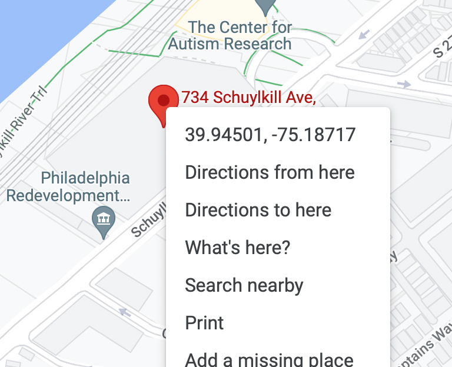

<!--

author:   Elizabeth Drellich
email:    drelliche@chop.edu
version: 1.0.1
module_template_version: 3.0.0
language: en
narrator: UK English Female
title: Encoding Geospatial Data: Latitude and Longitude
comment:  This is an introduction to latitude and longitude and the importance of geocoding - encoding geospatial data in the coordinate system.
long_description: If you use any geospatial data, such as patient or participant addresses, it is important that that location data be in a usable form. This means using the same coordinate system that Global Positioning Systems use: latitude and longitude. This module is appropriate, as either an introduction or review, for anyone considering using geospatial data in their analysis. 
estimated_time: 15 minutes

@learning_objectives  

After completion of this module, learners will be able to:

- Understand the importance of geocoding addresses
- Understand the latitude and longitude coordinate system
- Geocode single addresses.  

@end

link:  https://chop-dbhi-arcus-education-website-assets.s3.amazonaws.com/css/styles.css

script: https://kit.fontawesome.com/83b2343bd4.js

-->

# Encoding Geospatial Data: Latitude and Longitude

<div class = "overview">

## Overview
@comment

**Is this module right for me?** @long_description

**Estimated time to completion:** @estimated_time

**Pre-requisites**
None

**Learning Objectives**

@learning_objectives

</div>

## Where is it Located?

"Where is the research building?" If you have ever need to go somewhere new, you have run into the primary issue with the way humans discuss location.

Depending on who (or what) you ask, the answer could take many forms, each of which can be useful in some situations and useless in others. Consider the types of answers you could get to the question "Where is the Roberts Center for Pediatric Research?"

- **Relational Location**: "The research building is on the other side of the South St. bridge from the hospital." 

- **Directions**: "Go three blocks that way, turn left, and you will see the research building." 

- **Street Address**: "The research building is at 734 Schuylkill Ave."

- **Mailing Address**: "The research building is at 734 Schuylkill Ave. Philadelphia, PA 19146."

- **Coordinates**: "The research building is at 39.9458 North, -75.1865 West."
<div class = "care">
<b style="color: rgb(var(--color-highlight));">A little encouragement...</b><br>

Place names add an additional level of difficulty to working with geospatial data. People may notice and care if you use the wrong name for a place, or if you mispronounce a common local name. When in doubt about how to pronounce a place name, it is always a good idea to ask!

While you won't need to speak any place names out loud for this module, Philadelphians pronounce Schuylkill as "SKOO-kill."

</div>
Relative Location
------

The first two ways of describing the location are by far the most helpful if you are actually trying to get to the research building, but are useless if you are trying to use the location of the research building in some larger scientific analysis.

Address
-------

The next two descriptions, the addresses, are how a lot of location data is provided. Addresses can convey a lot of information, but can also obscure important relations, like the fact that it is much easier to enter the building, at least by foot, from the South St. bridge. The street address doesn't tell you anything about the building's location in relation to anywhere not on Schuylkill Avenue, nor does it tell you where to find Schuylkill Avenue. The mailing address gives a little more information by specifying that the building is located inside the 19146 zip code, but that could be a fairly large geographical area.

Precise Coordinates
-------
The last description, which gives the latitude and longitude of the building, pinpoints the exact location on the planet. The coordinates are enough to place the building precisely on a map, or take a picture of it from a satellite. If you had the latitude and longitude of another building it would be easy to calculate the distance between the two. This is why having latitude and longitude coordinates can be so important when using location data in research.

On the other hand, the precise coordinates leave out some important information that the building's address might provide. Precise distance, for example, turns out to be less relevant for calculating travel times when you know that the part of Schuylkill Avenue on which it sits is a one way street. The best location data would ideally contain both addresses and coordinates.

The rest of this module will focus on the latitude and longitude coordinate system, and introduce the concept of **geocoding,** which is the process of converting addresses and other location data into coordinates that uniquely identify their place on planet Earth. 

## Pinpointing Locations on Earth

Before we can talk about locations all over the Earth, we have to establish the locations of a few very special points. The first two are the **North Pole** and the **South Pole**. If you imagine a line going straight through the planet connecting the two poles, this is the axis around which the Earth rotates creating night and day.

The **equator** is the circle around the surface of the earth that is exactly halfway between the north and south poles. Any celestial body, like a planet or a star, that spins on an axis has two poles and an equator. Imagine a flat surface containing the equator and dividing the planet into a Northern Hemisphere and Southern Hemisphere. That flat surface is called the **equatorial plane**.

A **meridian** is a straight line on the surface of the earth connecting the poles. The third point we need is the location of the [Greenwich Observatory](https://www.rmg.co.uk/royal-observatory) in London, England. The meridian running through the observatory is called the **Prime Meridian**. Unlike the poles, which are fixed points determined by the astronomical fact that the earth is spinning on an axis, the location of the Prime Meridian was a human decision made for [historical](https://greenwichmeantime.com/articles/history/navy/) rather than geographical reasons.

Now that we have established the poles, the equator, and the prime meridian, we can use those to to create a coordinate system that will specify and point on earth!


### Latitude and Longitude


**Latitude** is a measure of how far north or south a location is from the equator. Given a point on the surface of the earth, imagine a straight line to the center of the earth. The angle that line makes with the equatorial plane, measured in degrees, is the point's latitude. The symbol for degrees is the superscript circle ${}^\circ $. 

Since the angle could be either above or below the equatorial plane, we have to specify which angle we are talking about. The horizontal line on the picture below corresponding to 30 degrees north, or +30$ {}^\circ $, goes through the United States, while the line representing 30 degrees south, or -30$ {}^\circ $, runs through Chile and Argentina.


**Longitude** is similarly an angular measurement, but rather than measuring relative to the equatorial plane, it measures relative to the prime meridian. Positive angles correspond to locations to the east of the prime meridian, while negative angles refer to points west of it. The meridian on the exact opposite side of the world from the prime meridian is, by convention, +180$ {}^\circ $ or 180$ {}^\circ $ East, even though it could just as accurately be described as -180$ {}^\circ $ or 180$ {}^\circ $ West.


### Coordinate Systems

Together, latitude and longitude form a (spherical) coordinate system that can specify any point on the planet, with high precision. To get that precision, degrees need to be divided into smaller units of measurement.

Decimal Degrees (DD) vs. Degrees, Minutes, and Seconds (DMS)
---

The location data produced today by satellites has no problem with long decimal numbers, but the first accurate measurements of longitude depended on the ability to accurately measure time. In the system of [degrees, minutes, and seconds (DMS)](https://gisgeography.com/decimal-degrees-dd-minutes-seconds-dms/) each angle of one degree is divided into 60 equal parts called "minutes" (denoted `'`) and each minute is further divided into 60 equal parts called "seconds" (denoted `"`).

Here is a table of a few locations with their coordinates given as both decimal degrees and degrees, minutes, seconds.

| City | Lat, Long (DD) | Lat, Long (DMS) |
| -- | -- | -- |
| Philadelphia, USA | 39.952583, -75.165222 | 39° 57' 9.2988'' N, 75° 9' 54.7992'' W |
| Gabororne, Botswana | -24.653257, 25.906792 | 24° 39' 11.7252'' S, 25° 54' 24.4512'' E |
| Manila, Philippines | 14.556586, 121.023415| 14° 33' 23.7096'' N, 120° 59' 3.1992'' E|
| Buenos Aires, Argentina | -34.603722, -58.381592 | 34° 36' 13.3992'' S, 58° 22' 53.7312'' W|


<div class = "cool-fact">
<b style="color: rgb(var(--color-highlight));">Did you know?</b><br>

It is common to associate the East/West axis of longitude with the variable "x" and the North/South axis of latitude with the variable "y." Because of this it is common to see location data stored as longitude first, followed by latitude.

</div>


Accuracy and Relative Scale
---

The Roberts Center for Pediatric Research at the Children's Hospital of Philadelphia, for example, is, [according to Google Maps](https://www.google.com/maps/place/CHOP+Roberts+Center+for+Pediatric+Research/@39.9458205,-75.18878,17z/data=!3m1!4b1!4m5!3m4!1s0x89c6c643a1cf897f:0x6f378f102e502212!8m2!3d39.9458205!4d-75.1865913) located at 39.94583795815241, -75.18659130245932. (You can right-click on the location icon to copy the latitude and longitude.) These numbers actually have far more significant digits than are appropriate, and correspond to a particular point in the building's lobby.

While 14 significant digits is clearly overkill, the number of digits needed to be accurate within a certain distance depends on where on the planet your location is. This is because latitude and longitude are measuring angles, not distance. The point 90E 0 N (in the Indian Ocean part way between Sri Lanka and Indonesia) and 90W 0N (near the Galapagos Islands off the west coast of South America) are directly across the planet from each other, as a far away as two points can get (over 20,000 km). However 90E 89N and 90W 89N are both in the Arctic Circle, less than 240 km away from each other.

## Geocoding

Some data will come as latitude and longitude coordinates. Unfortunately a lot of important information about social determinants of health like patient home addresses and places of work, will come to you as street or mailing addresses. In order to do useful analysis on this geospatial data, you may need to calculate the latitude and longitude of each address. This process is called **geocoding**.


Single Address
------

Let's take a look at geocoding a single address, the Roberts Center for Pediatric Research at the Children's Hospital of Philadelphia which has street address: 

```
734 Schuylkill Ave
Philadelphia, Pennsylvania
USA
```

If you can find this location in a mapping application or website, there is almost guaranteed to be a way to see the latitude and longitude of the address. Take a look at these screenshots from [Google Maps](https://www.google.com/maps/place/734+Schuylkill+Ave,+Philadelphia,+PA+19146/@39.9448832,-75.1893754,17z/data=!4m13!1m7!3m6!1s0x89c6c64302c9c583:0xc4442cfc6d066d69!2s734+Schuylkill+Ave,+Philadelphia,+PA+19146!3b1!8m2!3d39.9448832!4d-75.1871867!3m4!1s0x89c6c64302c9c583:0xc4442cfc6d066d69!8m2!3d39.9448832!4d-75.1871867), Apple Maps, and [Bing Maps](https://www.bing.com/search?q=734+schuylkill+ave+philadelphia&qs=SC&pq=734+schy&sc=5-8&cvid=452530F0C82D44A2B28204885EB07E61&FORM=QBLH&sp=1).



Taking a very close look at these three maps, the coordinates they show are slightly different:

|Map | Latitude | Longitude |
| -- | :--| :--|
| Google | 39.94501 | -75.18717 |
| Apple | 39.94541 | - 75.18718 |
| Bing | 39.945477 | -75.186367 |

These differences are pretty tiny geographically speaking, although Google is coding the address as in the building's parking lot, a different location than it gives for "Roberts Center for Pediatric Research" which it places in the building itself. 

<div class = "important">
<b style="color: rgb(var(--color-highlight));">Important note</b><br>
Accurate geocoding can still result in slightly different coordinates for the same location. When analyzing geospatial data it is important to be aware of this possible "fuzziness" when considering whether two places are the same.
</div>

Multiple Addresses
----

Geocoding addresses one by one might be fine if you only have a few to do, but what if you have hundreds or even thousands of addresses to geocode? 

<div class = "warning">
<b style="color: rgb(var(--color-highlight));">Warning!</b><br>

**Addresses are Protected Health Information (PHI)**

When geocoding addresses for research, make sure that you are preserving the privacy and security of you participants. If you will be using addresses as part of research, you should have a plan for geocoding approved by the appropriate regulatory bodies before you begin. This might look like:

- a plan to do all geocoding locally on a computer owned by your institution that is not using internet tools to geocode, or
- a formal agreement with a geocoding service to securely process addresses (for an example, see the [Texas A&M Geoservice's privacy and security page](https://geoservices.tamu.edu/About/Legal/)) 

**Never share protected health information like patient addresses with an online tool!**

</div>

If you have a public dataset, there are a number of geocoding services in existence, most of which will let you geocode addresses in batches. Google and Bing both have such services. A more extensive list, along with links to the services, is available from [GISGeography.com](https://gisgeography.com/geocoders/).

While using these tools is outside the scope of this module, many are free to try out, especially if you will be geocoding a relatively small number of addresses (e.g. only a few thousand).


## Quiz

TRUE or FALSE: Addresses are irrelevant for research into the social determinants of health if you have access to latitude and longitude coordinates.

[( )] True
[(X)] False
***

<div class = "answer">

Latitude and Longitude coordinates can tell you a lot that addresses can't, but they do not replace the important social and political information contained in a street address. Two people living geographically very close together but under different governmental regimes may have completely different healthcare options. Similarly, two people living seemingly far apart from each other but in the same town may both be impacted by the same city or district water source.

</div>

***

Which of the following statements about latitude and longitude are TRUE?

[[X]] Every location on Earth can be described using latitude and longitude.
[[ ]] The location of the equator was an arbitrary decision made by historical mapmakers.
[[ ]] Locations east of the prime meridian are represented by positive longitudes and locations west of the prime meridian are represented by negative longitudes.
[[X]] Locations north of the equator are represented by positive latitudes and locations south of the equator are represented by negative latitudes.
***

<div class = "answer">

Every location on Earth can be described using latitude and longitude. Positive latitudes are north of the equator and positive longitudes are east of the prime meridian while negative latitudes and longitudes are to the south and west, respectively. While the location of the prime meridian was chosen for historical reasons, the location of the equator is fixed by the planet's rotation.

</div>
***

What are the coordinates of the U.S. Census Bureau? Its street address is 4600 Silver Hill Road Washington, DC 20233.  You will need to open a new tab or window to access a map or geocoding program.

[( )] -75.927 W, 38.846 N
[(X)] -76.927 W, 38.846 N
[( )] -75.927 W, 39.846 N
[( )] -76.927 W, 39.846 N
***
<div class = "answer">

Entering the address into the [US Census Geocoder](https://geocoding.geo.census.gov/geocoder/locations/onelineaddress?address=4600%20Silver%20Hill%20Road%20Washington%2C%20DC%2020233&benchmark=4) and rounding the latitude and longitude to 3 decimal places gives coordinates of -76.927 W, 38.846 N.


</div>
***

## Additional Resources

QGIS, an open source GIS platform has a [Gentle Introduction to GIS](https://docs.qgis.org/3.22/en/docs/gentle_gis_introduction/index.html).

This [list of geocoding platforms](https://gisgeography.com/geocoders/) contains both paid and free resources.

For addresses in the United States of America, the US Census has an excellent [geocoding service](https://geocoding.geo.census.gov/geocoder/locations/onelineaddress?form).

## Feedback

In the beginning, we stated some goals.

**Learning Objectives:**

@learning_objectives

We ask you to fill out a brief (5 minutes or less) survey to let us know:

* If we achieved the learning objectives
* If the module difficulty was appropriate
* If we gave you the experience you expected

We gather this information in order to iteratively improve our work.  Thank you in advance for filling out [our brief survey](https://redcap.chop.edu/surveys/?s=KHTXCXJJ93&module_name=%22Encoding+Geospatial+Data:+Latitude+and+Longitude%22&version=1.0.1)!
