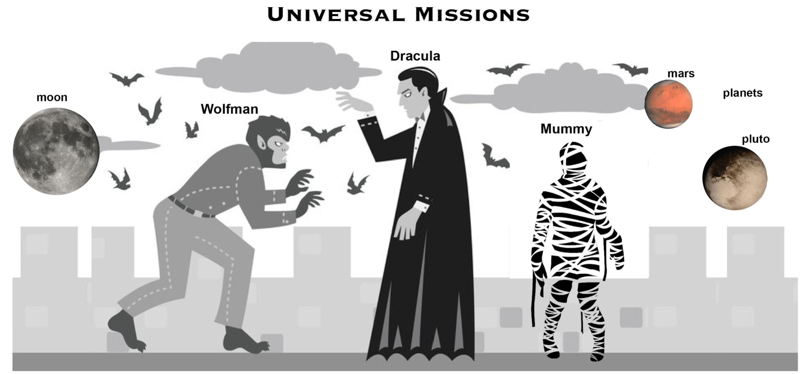

<!--

author:   Elizabeth Drellich
email:    drelliche@chop.edu
version:  0.0.11
language: en
narrator: UK English Female
title: Creating your Git Repository
comment:  Create a new Git repository and get started with version control.
long_description: You have heard that version control is important for reproducible research and are ready to start tracking your files. This module will teach you how to create a Git repository, add files to it, update files in it, and keep track of those changes in a clear and organized manner.

@learning_objectives

After completion of this module, learners will be able to:

- Create a Git repository
- Add and make changes to files in the repository
- Write short helpful descriptions to track the changes
- Understand what `add` and `commit` do.

@end

link:  https://chop-dbhi-arcus-education-website-assets.s3.amazonaws.com/css/styles.css

script: https://kit.fontawesome.com/83b2343bd4.js

-->

# Creating your Git Repository

<div class = "overview">

## Overview
@comment

**Is this module right for me?**

@long_description

**Estimated time to completion:**

**Pre-requisites**

Before you start this module, make sure you have

* Configured Git *on your computer*. See [this module](https://education.arcus.chop.edu) to learn how.
* The ability to edit .txt documents. Click [here](https://swcarpentry.github.io/shell-novice/03-create/#create-a-text-file) for an introduction to editing text files using `nano`.

If you would prefer to work through this module on your own computer, we also have [module on Bash 101](/fill/in/path).

**Learning Objectives**

@learning_objectives
</div>

## Lesson Preparation

Here we include information about a virtual box/command line emulator learners can use to do exercises.

If you prefer to run these examples on your own machine, open a command line interface (CLI).

## Creating a Repository

Once Git is configured,
we can start using it.

Usually you will use Git to track the progress of a project. As we learn about Git, we will use the story of Wolfman and Dracula who are investigating if it
is possible to send a planetary lander to Mars.


[Werewolf vs dracula](https://www.deviantart.com/b-maze/art/Werewolf-vs-Dracula-124893530)
by [b-maze](https://www.deviantart.com/b-maze) / [Deviant Art](https://www.deviantart.com/).
[Mars](https://en.wikipedia.org/wiki/File:OSIRIS_Mars_true_color.jpg) by European Space Agency /
[CC-BY-SA 3.0 IGO](https://creativecommons.org/licenses/by/3.0/deed.en).
[Pluto](https://commons.wikimedia.org/wiki/File:PIA19873-Pluto-NewHorizons-FlyingPastImage-20150714-transparent.png) /
Courtesy NASA/JPL-Caltech.
[Mummy](https://commons.wikimedia.org/wiki/File:Mummy_icon_-_Noun_Project_4070.svg)
&copy; Gilad Fried / [The Noun Project](https://thenounproject.com/) /
[CC BY 3.0](https://creativecommons.org/licenses/by/3.0/deed.en).
[Moon](https://commons.wikimedia.org/wiki/File:Lune_ico.png)
&copy; Luc Viatour / [https://lucnix.be](https://lucnix.be/) /
[CC BY-SA 3.0](https://creativecommons.org/licenses/by-sa/3.0/deed.en).

In all of our examples, we will see code as if it is written by Vlad Dracula. If you are practicing these steps as you move through this module, your name and email address will appear instead of Dracula's.

To copy the code in the examples, enter everything after the dollar sign "$" into the command line, and then press the enter or return key. If the command has any output, it will not start with a dollar sign, but a new line where you can type after a dollar sign will appear.

```console
$logname
vlad
$
```

The above codeblock tells you that when Dracula types `logname` and presses enter, the output is 'vlad', his username. Try entering `logname` in your own console. There will be other code in front of each `$` describing who and where you are. Since the stuff before the `$` will be different for everyone, it is customary to omit it from example code. We will also omit the `$` after the output.

### Initializing the repository

First, let's create a directory in `Desktop` folder for our work and then move into that directory:


```console
$ cd ~/Desktop
$ mkdir planets
$ cd planets
```

Then we tell Git to make `planets` a **repository** (also called a **repo**)
-- a place where Git can store versions of our files:


```console
$ git init
```


It is important to note that `git init` will create a repository that
includes subdirectories and their files---there is no need to create
separate repositories nested within the `planets` repository, whether
subdirectories are present from the beginning or added later. Also, note
that the creation of the `planets` directory and its initialization as a
repository are completely separate processes.

If we use `ls` to show the directory's contents,
it appears that nothing has changed:

```console
$ ls
```


But if we add the `-a` flag to show everything,
we can see that Git has created a hidden directory within `planets` called `.git`:

```console
$ ls -a

.	..	.git
```

Git uses this special subdirectory to store all the information about the project,
including all files and sub-directories located within the project's directory.
If we ever delete the `.git` subdirectory,
we will lose the project's history.

### Creating the  `main` branch

Next, we will change the default branch to be called `main`.
This might be the default branch depending on your settings and version
of git.
See the [setup episode](/path/to/earlier/module) for more information on this change.

```console
git checkout -b main

Switched to a new branch 'main'
```


We can check that everything is set up correctly
by asking Git to tell us the status of our project:

```console
$ git status

On branch main

No commits yet

nothing to commit (create/copy files and use "git add" to track)
```

If you are using a different version of Git, the exact
wording of the output might be slightly different.

### Quiz: `git init`

What command Dracula enter in the blank in order to create a new Git repository?

```console
$ cd ~/Desktop      # return to the Desktop directory
$ mkdir planets     # make the planets directory
$ cd planets        # go into the newly created planets directory
$ __________        # make the planets directory a Git repository

```
[[git init]]
***
<div class = "answer">
By initializing the Git repository inside the planets directory, Git will track every file inside planets.
</div>
***


Along with tracking information about planets (the project we have already created),
Dracula would also like to track information about moons.
Despite Wolfman's concerns, Dracula creates a `moons` project inside his `planets`
project with the following sequence of commands:

```console
$ cd ~/Desktop   # return to Desktop directory
$ cd planets     # go into planets directory, which is already a Git repository
$ ls -a          # ensure the .git subdirectory is still present in the planets directory
$ mkdir moons    # make a subdirectory planets/moons
$ cd moons       # go into moons subdirectory
$ git init       # make the moons subdirectory a Git repository
$ ls -a          # ensure the .git subdirectory is present indicating we have created a new Git repository
```

Is the `git init` command, run inside the `moons` subdirectory, required for
tracking files stored in the `moons` subdirectory?

[( )] Yes, running `git init` inside the `moons` subdirectory is necessary.
[( )] It is not necessary to run `git init` inside `moons` but it can't hurt.
[(X)] No, `moons` was already tracked as a subdirectory of `planets` and running `git init` inside `moons` could interfere with version control.
***
<div class = "answer">
No. Dracula does not need to make the `moons` subdirectory a Git repository
because the `planets` repository will track all files, sub-directories, and
subdirectory files under the `planets` directory.  Thus, in order to track
all information about moons, Dracula only needed to add the `moons` subdirectory
to the `planets` directory.

Additionally, Git repositories can interfere with each other if they are "nested":
the outer repository will try to version-control
the inner repository. Therefore, it's best to create each new Git
repository in a separate directory. To be sure that there is no conflicting
repository in the directory, check the output of `git status`. If it looks
like the following, you are good to go to create a new repository as shown
above:

```console
$ git status

fatal:
Not a git repository (or any of the parent directories):
.git
```
 </div>
 ***

### Fixing a nested `init`

<div class = "help">
What if you forgot to check `git status` and accidentally created a repository nested in another repository?
You can fix this by removing the `.git` file from the inner repository. Take another look at Dracula's code from our last example:

```console
$ cd ~/Desktop   # return to Desktop directory
$ cd planets     # go into planets directory, which is already a Git repository
$ ls -a          # ensure the .git subdirectory is still present in the planets directory
$ mkdir moons    # make a subdirectory planets/moons
$ cd moons       # go into moons subdirectory
$ git init       # make the moons subdirectory a Git repository
$ ls -a          # ensure the .git subdirectory is present indicating we have created a new Git repository
```

Dracula has created two tracking files, `planets/.git` which he should keep, and `planets/moons/.git` which should be removed.
Dracula can do this by running `pwd` and getting the output:

```console
/Users/vlad/Desktop/planets
```
before running:

```console
$ rm -rf moons/.git
```
</div>

## Tracking changes

 It might seem like *making* changes and *documenting* them are two different things, but the entire point of version control is to document every change you make.

 Just like any system that can help back-up or save your work, Git will only be helpful if you use it. In this section we will first teach you

 - *how* to make a record of your changes,

 - *where* those records are, and

 - *when* you should be recording that you changed things.

### Tell Git to track a file
Let's follow along with Dracula to add a file to the planets directory with notes about Mars.

First let's make sure we're still in the right directory.
You should be in the `planets` directory.

```console
$ cd ~/Desktop/planets
```

Let's create a file called `mars.txt` that contains some notes
about the Red Planet's suitability as a base.
We'll use `nano` to edit the file;
you can use whatever editor you like.
In particular, this does not have to be the `core.editor` you set globally earlier. But remember, the bash command to create or edit a new file will depend on the editor you choose (it might not be `nano`). For a refresher on text editors, check out ["Which Editor?"](https://swcarpentry.github.io/shell-novice/03-create/) in [The Unix Shell lesson](https://swcarpentry.github.io/shell-novice/) by Software Carpentry.

```console
$ nano mars.txt
```

Type the text below into the `mars.txt` file:


```console
Cold and dry, but everything is my favorite color
```


Let's first verify that the file was properly created by running the list command (`ls`):


```console
$ ls

mars.txt
```


`mars.txt` contains a single line, which we can see by running `cat`:


```console
$ cat mars.txt

Cold and dry, but everything is my favorite color
```


If we check the status of our project again,
Git tells us that it's noticed the new file:

```console
$ git status

On branch main

No commits yet

Untracked files:
   (use "git add <file>..." to include in what will be committed)

	mars.txt

nothing added to commit but untracked files present (use "git add" to track)
```

The "untracked files" message means that there's a file in the directory that Git isn't keeping track of.
We can tell Git to track a file using `git add`:


```console
$ git add mars.txt
```

and then use `git status` to check that the right thing happened:

```console
$ git status

On branch main

No commits yet

Changes to be committed:
  (use "git rm --cached <file>..." to unstage)

	new file:   mars.txt
```

Git now knows that it's supposed to keep track of `mars.txt`,
but it hasn't recorded these changes as a commit yet.
To get it to do that, we need to run one more command. Enter this into the console:

```console
$ git commit -m "Start notes on Mars as a base"
```
The console output will look like this, though your unique identifiers (f22b25e and 100644) will be different.

```console
[main (root-commit) f22b25e] Start notes on Mars as a base
 1 file changed, 1 insertion(+)
 create mode 100644 mars.txt
```

When we run `git commit`,
Git takes everything we have told it to save by using `git add`
and stores a copy permanently inside the special `.git` directory.
This permanent copy is called a **commit**
(or **revision**) and its short identifier is `f22b25e`. Your commit may have another identifier.

We use the `-m` flag (for "message")
to record a short, descriptive, and specific comment that will help us remember later on what we did and why.
If we just run `git commit` without the `-m` option,
Git will launch `nano` (or whatever other editor we configured as `core.editor`)
so that we can write a longer message.

**Good commit messages** Commit messages start with a brief (<50 characters) statement about the changes made in the commit. Generally, the message should complete the sentence "If applied, this commit will...".

If you want to go into more detail, add a blank line between the summary line and your additional notes. Use this additional space to explain why you made changes and/or what their impact will be.

If we run `git status` now it tells us everything is up to date.

```
$ git status

On branch main

nothing to commit, working directory clean
```


### Keeping track of your changes

Now that Git is keeping track of the file `mars.txt` we can keep a record of the changes we make to the file.

Each update to `mars.txt` will use that same `add` and `commit` pair of commands.

If we want to know what we've done recently,
we can ask Git to show us the project's history using `git log`:


```
$ git log
f22b25e3233b4645dabd0d81e651fe074bd8e73b
Author: Vlad Dracula <vlad@tran.sylvan.ia>
Date:   Thu Aug 22 09:51:46 2013 -0400

    Start notes on Mars as a base
```

`git log` lists all commits  made to a repository in reverse chronological order.
The listing for each commit includes
the commit's full identifier
(which starts with the same characters as
the short identifier printed by the `git commit` command earlier),
the commit's author,
when it was created,
and the log message Git was given when the commit was created.

<div class = 'help'>
**Where Are My Changes?** If we run `ls` at this point, we will still see just one file called `mars.txt`. That's because Git saves information about files' history in the special `.git` directory mentioned earlier so that our filesystem doesn't become cluttered (and so that we can't accidentally edit or delete an old version).
</div>

Now suppose Dracula adds more information to the file.
(Again, we'll edit with `nano` and then `cat` the file to show its contents;
you may use a different editor, and don't need to `cat`.)

```
$ nano mars.txt
$ cat mars.txt

Cold and dry, but everything is my favorite color
The two moons may be a problem for Wolfman
```

When we run `git status` now,
it tells us that a file it already knows about has been modified:

```
$ git status

On branch main
Changes not staged for commit:
  (use "git add <file>..." to update what will be committed)
  (use "git checkout -- <file>..." to discard changes in working directory)

	modified:   mars.txt

no changes added to commit (use "git add" and/or "git commit -a")
```

The last line is the key phrase:
"no changes added to commit".
We have changed this file,
but we haven't told Git we will want to save those changes
(which we do with `git add`)
nor have we saved them (which we do with `git commit`).
So let's do that now. It is good practice to always review
our changes before saving them. We do this using `git diff`.
This shows us the differences between the current state
of the file and the most recently saved version:

```
$ git diff

diff --git a/mars.txt b/mars.txt
index df0654a..315bf3a 100644
--- a/mars.txt
+++ b/mars.txt
@@ -1 +1,2 @@
 Cold and dry, but everything is my favorite color
+The two moons may be a problem for Wolfman
```

<div class = 'care'>
The output is cryptic because it is meant for a computer, not a human.
It is actually a series of commands for tools like editors and `patch`
telling them how to reconstruct one file given the other. Nevertheless we can gain some useful information
if we break it down into pieces:

  1. The first line tells us that Git is producing output similar to the Unix `diff` command comparing the old and new versions of the file.
  2. The second line tells exactly which versions of the file Git is comparing; `df0654a` and `315bf3a` are unique computer-generated labels for those versions.
  3. The third and fourth lines once again show the name of the file being changed.
  4. The remaining lines are the most interesting, they show us the actual differences and the lines on which they occur. In particular, the `+` marker in the first column shows where we added a line.
</div>

<div class = 'warning'>
If we immediately commit this change using `git commit` what will happen?

Git won't commit because we didn't use `git add` first! Git will give you a message reminding you to use `git add`.

</div>


Let's try adding the file and then committing the changes:

```
$ git add mars.txt
$ git commit -m "Add concerns about effects of Mars' moons on Wolfman"

[main 34961b1] Add concerns about effects of Mars' moons on Wolfman
 1 file changed, 1 insertion(+)
```
To double check that everything worked, you can run `git status` see:

```
$ git status

On branch main

nothing to commit, working directory clean
```

### How often should you `commit`?

Just like any method of backing up or saving your work, the benefits of using Git for version control are only available if you regularly use them. In our example, we have been committing every time we add or change a line in a single file. That is going to be odious overkill for most projects.

- **Commit each chunk of changes** If you add a new section to a file, or change a certain item across multiple files, it is a good practice to commit those changes with a message describing them. If a commit message like `-m "add section on bears"` or `-m "reorder paragraphs from smallest to largest mammals"` accurately describes your changes, make sure you commit the changes so that you can find them again later!

- **Commit before making any changes that could break your code** If your code currently works are you intend to add something new that may break it, make sure you commit so that you will be able to revert to the working version if needed.

- **Commit regularly** Even if you are only making very small changes, don't forget to commit at regular intervals, like before you switch tasks or end your work day.

### Quiz: `add` and `commit`

1. What sequence of commands would track the changes you made to `myFile.txt`?

  a. `$ git add myFile.txt`

  b. `$ git commit myFile.txt`

  c. `$ git add -m "my short, descriptive message"`

  d. `$ git commit -m "my short, descriptive message"`

[( )] First run a, then b
[(X)] First run a, then d
[( )] First run c, then b
[( )] First run c, then d
***
<div class = 'answer'>
You must run the `git add` to tell Git to stage `myFile.txt`, then you can commit the changes and leave your short, descriptive message. We will discuss how to think of these steps in the [next section](#understanding-the-git-workflow).
</div>
***

2. With each commit, we want to leave a short, descriptive, message describing the changes we make. Which of these would be the *best* commit message?

[( )] "updates"
[( )] "The Martian atmosphere is only 1% oxygen."
[( )] "add a line that the Martian atmosphere is only 1% oxygen"
[(X)] "add comments on Martian atmosphere"
***
<div class = "answer">
The commit message should describe what this commit does. If you want to know the line by line changes you should use the `diff` command. The purpose of the message is so that you know what you changed without having to read all the individual changes, which is especially helpful if you edited many lines or files.
</div>
***

## Understanding the Git workflow

 There were a lot of steps to getting our changes saved in Git! You could memorize that sequence of steps, but you will remember them better if you understand what each is doing.

 To get started we will use a metaphor about creating a digital version of a drawing. Imagine you are working on an art project that involves creating drawings on paper with pens, pencils, and markers. You want to have a record of how this project progresses, and have access to a copier/scanner that can make and save perfect digital copies of your work.


 Creating and editing your files on your computer is like drawing on paper at your desk. There is a single copy of your work stored on your computer, but no record of the changes you are making. You can always create a new file, or take out a new piece of paper, but no record of that new file exists yet.


 The `git add` command is how you designate what files will be added to the permanent record of your project. This step is called **staging**. In our art project metaphor, `git add` is putting all the drawings you want a record of into the scanner's intake slot. You can stage as many files and folders as you want.


 There isn't a record of your staged files until you commit them using `git commit`. This is like telling the scanner to actually scan all of the staged drawings in its intake slot. Note that if you left a drawing on your desk instead of putting it in the scanner, it won't get scanned. Now there is a record of this version of your project. The same way that the scanner now has a digital record of the current state of your art, Git stores a record of the state of your repository when you commit.

 


### Telling Git not to track some files

What if we have files that we do not want Git to track for us,
like backup files created by our editor
or intermediate files created during data analysis?
Let's create a few dummy files:

```
$ mkdir results
$ touch a.dat b.dat c.dat results/a.out results/b.out
```

The `touch` command opens, saves, and closes the files without changing them. Since they didn't previously exist, `touch` is also creating them. Now if we check the status of our repository we see:

```
$ git status


On branch main
Untracked files:
 (use "git add <file>..." to include in what will be committed)

	a.dat
	b.dat
	c.dat
	results/

nothing added to commit but untracked files present (use "git add" to track)
```

Putting these files under version control would be a waste of disk space.
What's worse,
having them all listed could distract us from changes that actually matter,
so let's tell Git to ignore them.

We do this by creating a file in the root directory of our project called `.gitignore`. Each line in this file is a rule for a type of file Git should ignore. Use your favorite text editor to make `.gitignore` contain the two lines:

```
*.dat
results/
```

These patterns tell Git to ignore any file whose name ends in `.dat`
and everything in the `results` directory.
(If any of these files were already being tracked,
Git would continue to track them.)

Once we have created this file,
the output of `git status` is much cleaner:

```
$ git status

On branch main
Untracked files:
 (use "git add <file>..." to include in what will be committed)

	.gitignore

nothing added to commit but untracked files present (use "git add" to track)
```

The only thing Git notices now is the newly-created `.gitignore` file.
You might think we wouldn't want to track it,
but if we share the repository, everyone we're sharing with will probably want to ignore
the same things that we are ignoring.
Let's add and commit `.gitignore`:

```
$ git add .gitignore
$ git commit -m "Ignore data files and the results folder."
$ git status

On branch main

nothing to commit, working directory clean
```

As a bonus, using `.gitignore` helps us avoid accidentally adding files to the repository that we don't want to track:

```
$ git add a.dat

The following paths are ignored by one of your .gitignore files:

 a.dat

Use -f if you really want to add them.
```

If we really want to override our ignore settings,
we can use `git add -f` to force Git to add something. For example,
`git add -f a.dat`.
We can also always see the status of ignored files if we want:

```
$ git status --ignored

On branch main
Ignored files:
(use "git add -f <file>..." to include in what will be committed)

a.dat
b.dat
c.dat
results/

nothing to commit, working directory clean
```


For more details on how to use `.gitignore` to include or exclude particular files or folders check out Software Carpentry's [module](https://swcarpentry.github.io/git-novice/06-ignore/index.html) on this.


### Quiz: `git` workflow

What does the `git commit` command do?

 [[ ]] Stages files so that their current version can be recorded.
 [[ ]] Creates a record of the current version of all files in the repository.
 [[X]] Creates a record of the current version of all of the staged files in the repository.
***
<div class = "answer">
The `git commit` command will only create a record of the files that you have *already staged.*

There are options you can use to automatically stage all files. Entering `git commit -a` or `git commit --all` will automatically stage all files that Git knows about and then commit them. But it will not save any new files that Git doesn't yet know about. In our artwork metaphor, if you started a new drawing on another sheet of paper, `git commit -a` would not put the new drawing into the slot and scan it, but it would scan the current version of every drawing that had previously been scanned.
</div>
***


## Additional Resources

The last section of the module content should be a list of additional resources, both ours and outside sources, including links to other modules that build on this content or are otherwise related.

## Feedback

In the beginning, we stated some goals.

**Learning Objectives:**

@learning_objectives

We ask you to fill out a brief (5 minutes or less) survey to let us know:

* If we achieved the learning objectives
* If the module difficulty was appropriate
* If we gave you the experience you expected

We gather this information in order to iteratively improve our work.  Thank you in advance for filling out [our brief survey](https://redcap.chop.edu/surveys/?s=KHTXCXJJ93&module_name=%22Module+Template%22)!

Remember to change the redcap link so that the module name is correct for this module!
