<!--

author:   Elizabeth Drellich
email:    drelliche@chop.edu
version:  0.0.1
module_template_version: 2.0.0
language: en
narrator: UK English Female
title: Setting Up Git on Windows

comment: This module provides recommendations and examples to help new users configure git on their Windows computer for the first time.

long_description: If you're ready to start using the Git version control system, this lesson will walk you through how to get set up. This lesson should be a good fit for people who already have an idea of what version control is but may not have any experience using it yet. No previous experience with Git is expected. This lesson is specific to Windows machines, If you are using Mac or Linux, please follow along with the [set-up guide for those computers]( ).

estimated_time: 25 min

@learning_objectives  

After completion of this module, learners will be able to:

- Download `git` onto a Windows computer
- Configure `git` the first time it is used on a computer
- Understand the meaning of the `--global` configuration flag

@end

link:  https://chop-dbhi-arcus-education-website-assets.s3.amazonaws.com/css/styles.css

script: https://kit.fontawesome.com/83b2343bd4.js

-->

# Setting Up Git on Windows

<div class = "overview">

## Overview
@comment

**Is this module right for me?** @long_description

**Estimated time to completion:** @estimated_time

**Pre-requisites**

- Have an account on github.com (you can [sign up now](https://github.com/signup) if you haven't yet --- it's free)


**Learning Objectives**

@learning_objectives

</div>

## Downloading `git`

Since Windows machines do not come with `git` pre-installed, you will need to download the latest version of [Git for Windows](https://git-scm.com/download/win).

When you open the `.exe` file you may be asked to confirm that you want to run it. Click the `Run` button to begin the installation process.

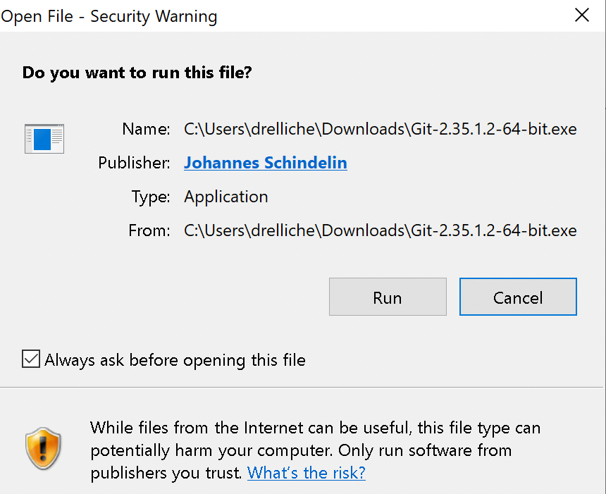

<div class = "important">
There are several helpful settings that you can choose in the Setup phase that will be useful in the future. However it is also possible to install with default settings and update them from the command line later.
</div>

### Selecting options in the Setup menu

While most of of the default options will work just fine, there are 16 screens to click through and there are settings to change on a few of them. Let's go through them one by one.

1. 

2. 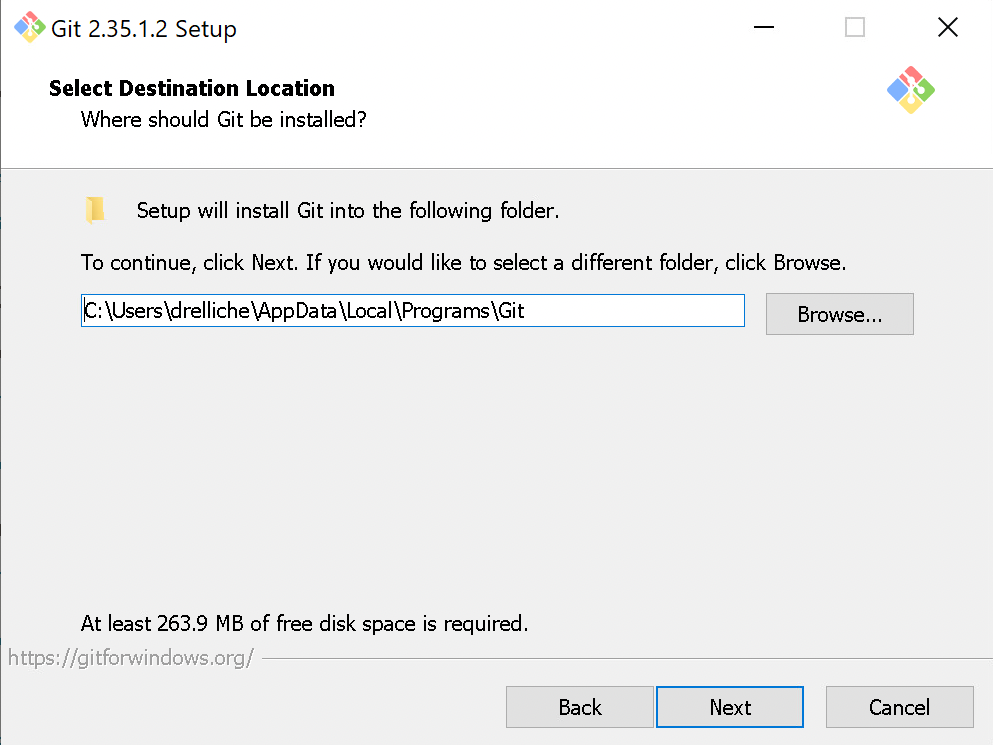

3. They should already be checked, but make sure that Windows Explorer integration and Git Bash are both checked on this screen. 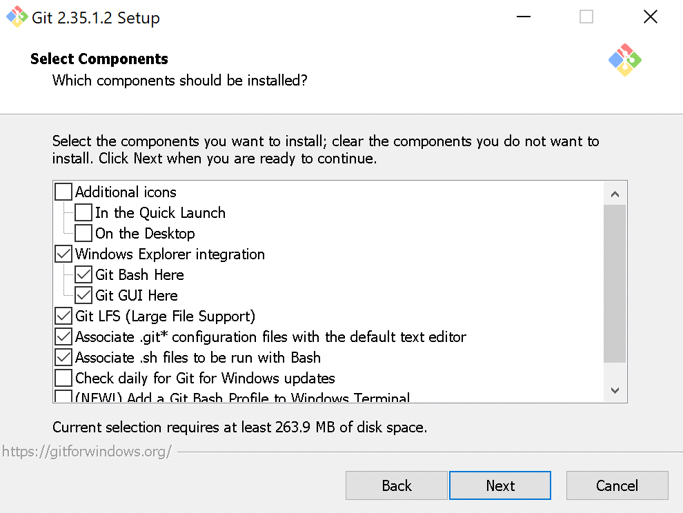

4. 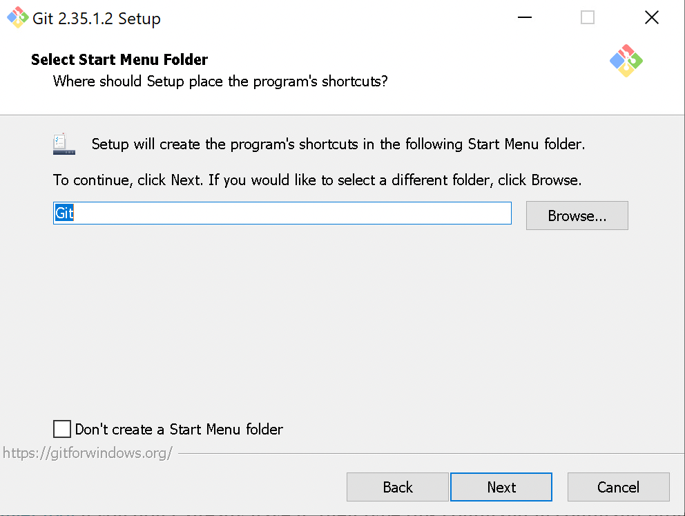

5. If you have a favorite text editor such as Atom, go ahead and select that. You can scroll up for more options like `nano`, or select Notepad, which will feel the most familiar if you are used to word processing programs. 

6. On this screen you want to change the default branch name to "main" to match with the conventions of GitHub. 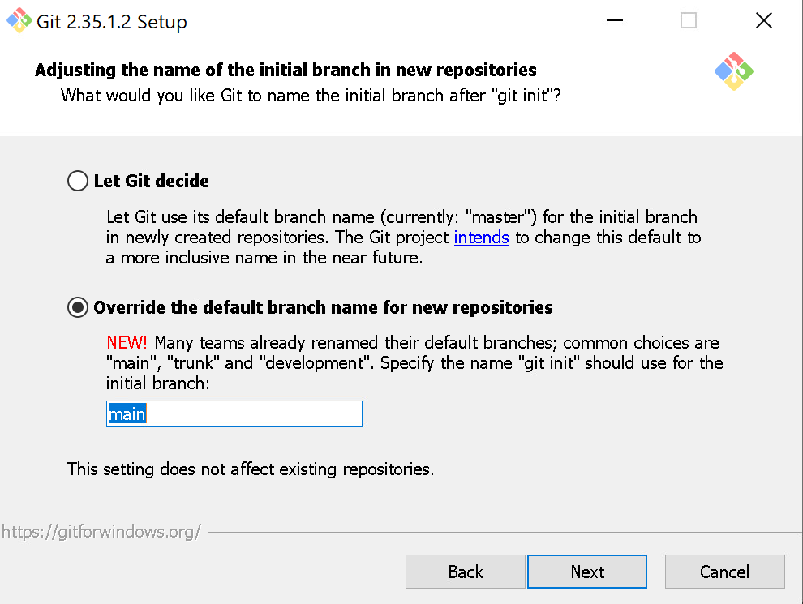

7. Allowing 3rd parties, such as GitHub Desktop, may be extremely useful to you in the future, so we recommend selecting this option. 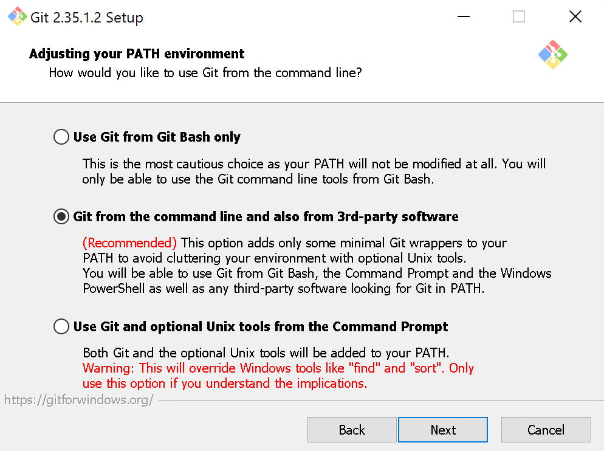

8. You can click next on each of the subsequent screens: 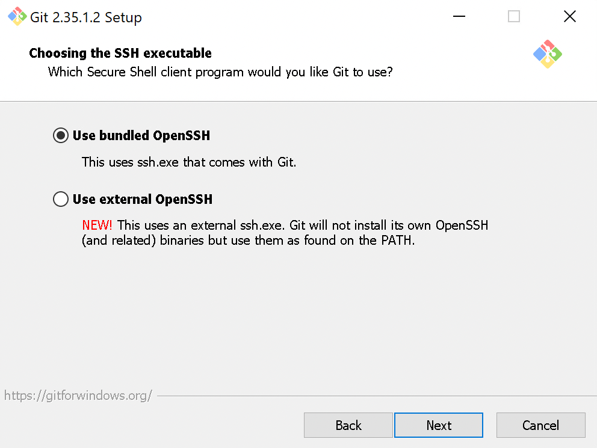

9. 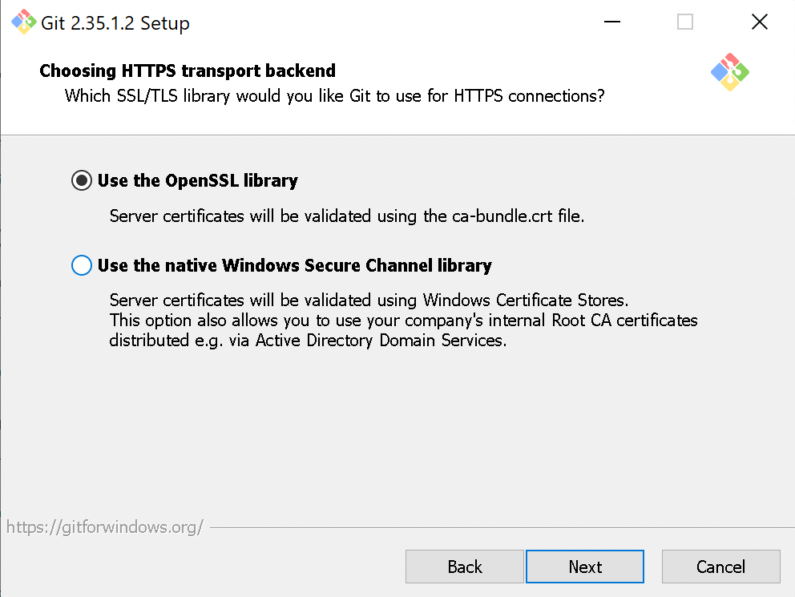

10. 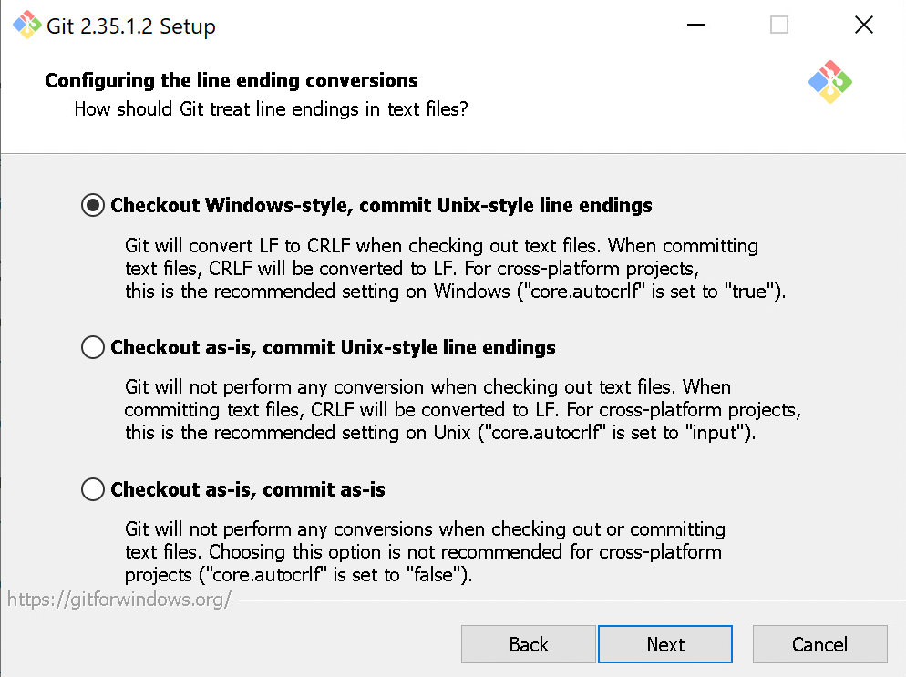

11. 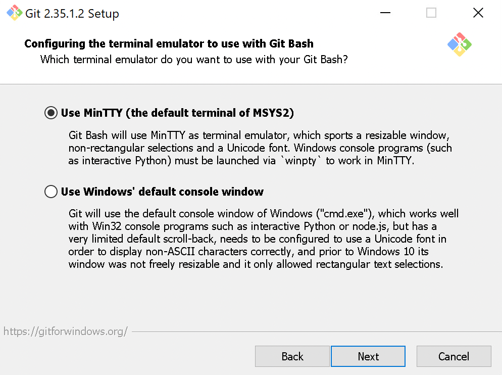

12. 

13. 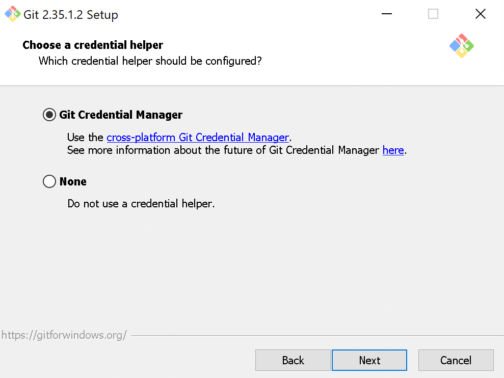

14. 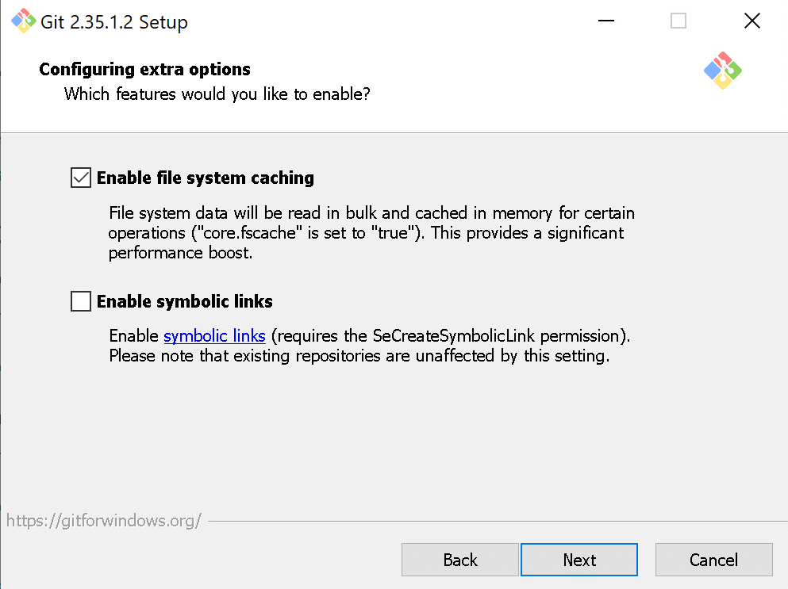

15. 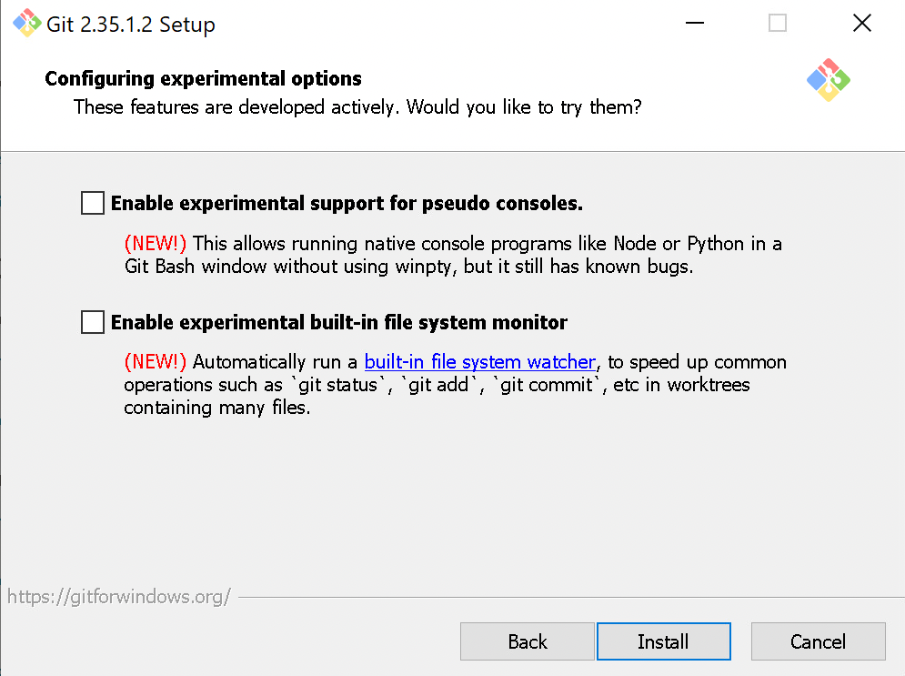

16. Click "Finish" to complete the installation. 


## Global configurations

You will interact with Git through the Git Bash application, which should now appear when you search for it.

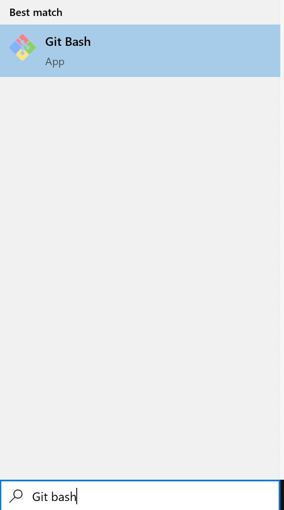

This application will open a new Git Bash console. It is here where you will enter all commands relating to Git.


When we use Git on a new computer for the first time, we need to configure a few things.
Below are a few examples of configurations we will set as we get started with Git:

*   our name and email address,
*   what our preferred text editor is,
*   and that we want to use these settings globally (i.e. for every project).

<div class = "important">
We will use `git config` with the `--global` option to configure a user name, email address, editor, and other preferences. This only needs to be done once per machine.
</div>

### Setting up your username and email

On a command line, Git commands are written as `git verb options`,
where `verb` is what we actually want to do and `options` is additional optional information which may be needed for the `verb`. So here is how
Dracula sets up his new laptop:

```bash
$ git config --global user.name "Vlad Dracula"
$ git config --global user.email "vlad@tran.sylvan.ia"
```
<div class = "warning">
Please use your own name and email address instead of Dracula's.
</div>

This user name and email will be associated with your subsequent Git activity,
which means that any changes pushed to
[GitHub](https://github.com/),
[BitBucket](https://bitbucket.org/),
[GitLab](https://gitlab.com/) or
another Git host server
after this lesson will include this information.

For this lesson, we will be interacting with [GitHub](https://github.com/) and so the email address used should be the same as the one used when setting up your GitHub account.

<div class = "options">
If you are concerned about privacy, please review [GitHub's instructions for keeping your email address private][https://docs.github.com/en/account-and-profile/setting-up-and-managing-your-github-user-account/managing-email-preferences/setting-your-commit-email-address].
</div>

If you elect to use a private email address with GitHub, then use that same email address for the `user.email` value, e.g. `username@users.noreply.github.com` replacing `username` with your GitHub one.

### Handling line endings

<div class = "learnmore">
You already told Git how to handle line endings in one of those installation windows, but it never hurts to double check that your settings are correct.
</div>

As with other keys, when you hit `Enter` or `↵` or on Macs, `Return` on your keyboard,
your computer encodes this input as a character.
Different operating systems use different character(s) to represent the end of a line.
(You may also hear these referred to as newlines or line breaks.)
Because Git uses these characters to compare files,
it may cause unexpected issues when editing a file on different machines.

<div class = "learnmore">
Though it is beyond the scope of this lesson, you can read more about this issue
[in the Pro Git book](https://www.git-scm.com/book/en/v2/Customizing-Git-Git-Configuration#_core_autocrlf).
</div>

You can change the way Git recognizes and encodes line endings using the `core.autocrlf` command to `git config`.
The following settings are recommended:

```bash
$ git config --global core.autocrlf true
```

### Setting your text editor


You already told Git what your default text editor is in one of the installation windows, but if you ever change your mind, you can change your defaults.

If you accepted the default settings during installation, your text editor is set to Vim. To prevent future frustration, it is highly recommended that you pick a different editor.


| Editor             | Configuration command                            |
|:-------------------|:-------------------------------------------------|
| Atom | `$ git config --global core.editor "atom --wait"`|
| nano               | `$ git config --global core.editor "nano -w"`    |
| BBEdit (Mac, with command line tools) | `$ git config --global core.editor "bbedit -w"`    |
| Sublime Text (Mac) | `$ git config --global core.editor "/Applications/Sublime\ Text.app/Contents/SharedSupport/bin/subl -n -w"` |
| Sublime Text (Win, 32-bit install) | `$ git config --global core.editor "'c:/program files (x86)/sublime text 3/sublime_text.exe' -w"` |
| Sublime Text (Win, 64-bit install) | `$ git config --global core.editor "'c:/program files/sublime text 3/sublime_text.exe' -w"` |
| Notepad (Win)    | `$ git config --global core.editor "c:/Windows/System32/notepad.exe"`|
| Notepad++ (Win, 32-bit install)    | `$ git config --global core.editor "'c:/program files (x86)/Notepad++/notepad++.exe' -multiInst -notabbar -nosession -noPlugin"`|
| Notepad++ (Win, 64-bit install)    | `$ git config --global core.editor "'c:/program files/Notepad++/notepad++.exe' -multiInst -notabbar -nosession -noPlugin"`|
| Kate (Linux)       | `$ git config --global core.editor "kate"`       |
| Gedit (Linux)      | `$ git config --global core.editor "gedit --wait --new-window"`   |
| Scratch (Linux)       | `$ git config --global core.editor "scratch-text-editor"`  |
| Emacs              | `$ git config --global core.editor "emacs"`   |
| Vim                | `$ git config --global core.editor "vim"`   |
| VS Code                | `$ git config --global core.editor "code --wait"`   |

It is possible to reconfigure the text editor for Git whenever you want to change it.


<div class = "help">
**Exiting Vim**

Note that Vim is the default editor for many programs. If you haven't used Vim before and wish to exit a session without saving your changes, press `Esc` then type `:q!` and hit `Enter` or `↵` or on Macs, `Return`.
If you want to save your changes and quit, press `Esc` then type `:wq` and hit `Enter` or `↵` or on Macs, `Return`.

This is [a common problem that has frustrated many a new git user](https://stackoverflow.blog/2017/05/23/stack-overflow-helping-one-million-developers-exit-vim/)! You are not alone.
</div>

### Default branch naming

Git (2.28+) allows configuration of the name of the branch created when you initialize any new repository.  Dracula decides to use that feature to set it to `main` so
it matches GitHub, which is the cloud service he will eventually use. If you already changed the default branch name when installing Git, you can skip this step.

```bash
$ git config --global init.defaultBranch main
```

Source file changes are associated with a "branch."
For new learners in this lesson, it's enough to know that branches exist, and this lesson uses one branch.
By default, Git will create a branch called `master`
when you create a new repository with `git init` (as explained in the next Episode). This term evokes
the racist practice of human slavery and the
[software development community](https://github.com/github/renaming)  has moved to adopt
more inclusive language.

In 2020, most Git code hosting services transitioned to using `main` as the default branch. As an example, any new repository that is opened in GitHub and GitLab default
to `main`.  However, Git has not yet made the same change.  As a result, local repositories must be manually configured have the same main branch name as most cloud services.

For versions of Git prior to 2.28, the change can be made on an individual repository level.  The
command for this is in the next episode.  Note that if this value is unset in your local Git
configuration, the `init.defaultBranch` value defaults to `master`.

### Check your global configurations

The commands we just ran in the sections above only need to be run once: the flag `--global` tells Git to use the settings for every project, in your user account, on this computer.

You can check your settings at any time:

```bash
$ git config --list
```

You can change your configuration as many times as you want: use the same commands to choose another editor or update your email address.

<div class = "help">
**Proxy**

In some networks you need to use a
[proxy](https://en.wikipedia.org/wiki/Proxy_server). If this is the case, you may also need to tell Git about the proxy:

```bash
$ git config --global http.proxy proxy-url
$ git config --global https.proxy proxy-url
```

To disable the proxy, use

```bash
$ git config --global --unset http.proxy
$ git config --global --unset https.proxy
```
</div>

## Git Help and Manual

Always remember that if you forget the subcommands or options of a `git` command, you can access the relevant list of options typing `git <command> -h` or access the corresponding Git manual by typing
`git <command> --help`, e.g.:

```bash
$ git config -h
$ git config --help
```

<div class = "important">
While viewing the manual, remember the `:` is a prompt waiting for commands and you can press `Q` to exit the manual.
</div>

More generally, you can get the list of available `git` commands and further resources of the Git manual typing:

```bash
$ git help
```

## Quiz

Without looking it up, what can you say about the following command? `git config --global alias.ci commit` Select all that apply.

[[X]] It will change something in the global settings, meaning it will apply to all the projects in your user account on this computer
[[ ]] You'll need to run this command each time you start a new git repository if you want it to take effect
[[ ]] It will affect your settings on GitHub.com as well as on your local computer
***
<div class = "answer">
This command begins with `git config --global`, like most of the commands we ran during this lesson. The `--global` flag tells us this setting will be applied for all of the git projects on this user account on this computer (for a review of this topic, see [Check your global configurations](#check-your-global-configurations)).

Global configurations for git only need to be run once and then they will continue to apply until you undo them or replace them with new settings.

Importantly, 'global' only refers to within your account on your machine; if you use git on multiple machines, or when you use it in the cloud (for example, on GitHub.com), your global configuration settings from your personal machine won't apply.
</div>
***

If you wanted to learn more about the command above, which of the following would be good places to start? Select all that apply.

[[X]] `git config -h`
[[X]] Google it
[[X]] Ask a friend, or post a question in an online community forum
***
<div class = "answer">
All of these are great ideas!

In this particular case, the help file for `git config` won't tell you what you want to know about the global settings for aliases, so that will be a dead end here. But sometimes the git help files will have exactly what you need, so it's never a bad idea to check!

Googling it is also never a bad idea. There are tons of great git resources available online, and for common problems you're likely to find a useable answer quickly. Keep in mind that there are lots of very advanced git users posting things online as well, though, and if you get unlucky you could end up with search results that are not at all user-friendly for beginners. When that happens, remind yourself that kind of gatekeeping is a failure on the part of the writer, not something wrong with you as a learner, and keep searching to find a good answer to your question somewhere else.

Asking a peer (in person, or via an online community of practice) is probably the best strategy in a lot of situations, especially if the first two strategies don't yield useful results right away. If you feel embarrassed to ask a question, remind yourself that everyone is a beginner at some point and [asking for help is a great skill to practice](https://www.linkedin.com/pulse/20141027152039-95387062-why-you-should-never-feel-embarrassed-to-ask-questions)!
</div>
***

<div class = "learnmore">
In case you're curious, this command is an example of [how to set aliases in git](https://www.atlassian.com/git/tutorials/git-alias), something we didn't cover in this lesson.

Basically, aliases are shortcuts you can write for yourself so you don't have to type out full git commands every time. We won't be using aliases in the lessons here, but you may like to set some up on your own computer if that sounds attractive to you!
</div>

## Additional Resources

Although the content here focuses on command line git, you may prefer to use the GitHub Desktop program instead. See the instructions posted on GitHub.com for how to [install and configure GitHub Desktop](https://docs.github.com/en/desktop/installing-and-configuring-github-desktop).

## Feedback

In the beginning, we stated some goals.

**Learning Objectives:**

@learning_objectives

We ask you to fill out a brief (5 minutes or less) survey to let us know:

* If we achieved the learning objectives
* If the module difficulty was appropriate
* If we gave you the experience you expected

We gather this information in order to iteratively improve our work.  Thank you in advance for filling out [our brief survey](https://redcap.chop.edu/surveys/?s=KHTXCXJJ93&module_name=%22Setting+up+Git+on+Windows%22)!
