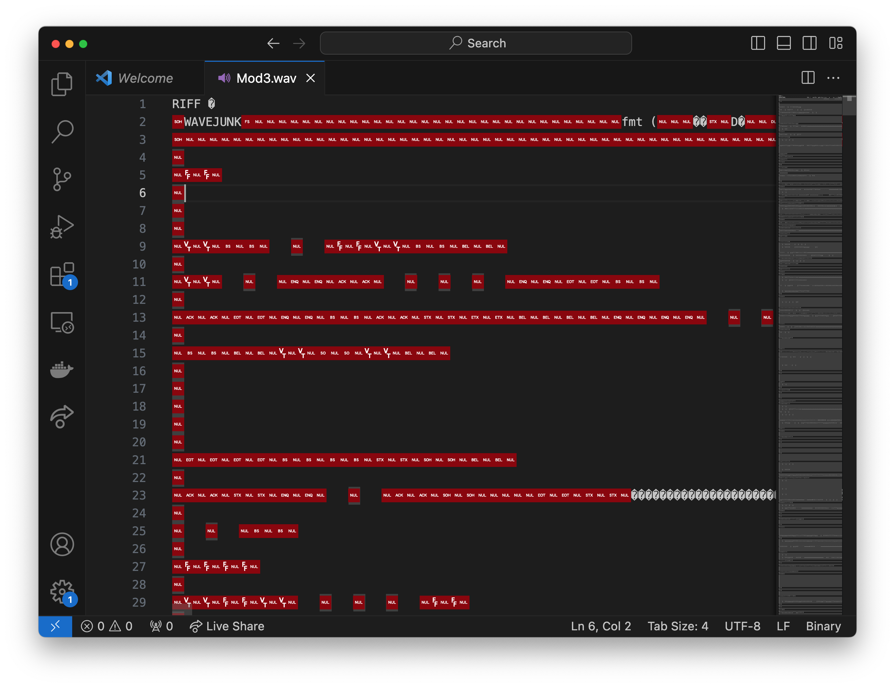

<!--

author:   Joy Payton
email:    paytonk@chop.edu
version:  1.0.0
current_version_description: Brief description of why this version exists
module_type: standard
docs_version: 3.0.0
language: en
narrator: US English Female
mode: Textbook

title: Git Text Mini-Module

comment: Why does't Microsoft Word work great with Git?  Because Git works best with text files, and Microsoft Word isn't text.  Find out why!

long_description: This is a proto-module that might become a full Git module, might be included in an existing Git module, or might be best in a file types module.

estimated_time_in_minutes: 10

@pre_reqs
None
@end

@learning_objectives  
After completion of this module, learners will be able to:

- identify key elements
- create a product
- do a task
- articulate the rationale for something
@end

good_first_module: false
coding_required: false

@sets_you_up_for

@end

@depends_on_knowledge_available_in

@end

@version_history 

Previous versions: No previous versions

@end

import: https://raw.githubusercontent.com/arcus/education_modules/main/_module_templates/macros.md
-->

# Git Text Mini-Module

@overview

## Git Refresher

You may already know what Git is and even use it for version control, but let's review.  Git is a **distributed**, **open source** **version control** system. For now, we'll leave aside the definitions of *distributed* and *open source* and concentrate instead on what constitutes *version control*.

Version control is a way to track changes to files.  In version control, we want to track what changed in a set of one or more interrelated files (a **repository**). 

Not only do we want to track what changed (e.g. a file got deleted or a line of code got changed), but we also want to track when the change was made, who changed it, and the reason the person made the change.

We also want to be able to go back to older versions of these files to rescue anything that we decide we need to bring back after changes or deletions.

If the idea of version control is very new to you, you might be interested in the brief [Introduction to Version Control](https://liascript.github.io/course/?https://raw.githubusercontent.com/arcus/education_modules/main/git_intro/git_intro.md#1) module.

## Git Works Best With Text Files

We just told you that Git allows you to track what changed to files, like a file being added or changed or deleted.  Git can explain what changed in a file at different levels of specificity depending on what kind of file it is.

We'll explain what **text files** and **non-text files** are soon, but it's helpful to understand why we're making the distinction.  Git can track changes to these two types of files at different levels.  If a non-text file is changed, Git will tell you **that** the file changed, but not exactly what changed in the file.  In contrast, if a text file changes, Git can tell you **what** changed, down to what words in which line.  

Why does this matter?  Often, when you're reviewing changes to a repository, you need to know more than just "File 1 changed, and it was Mary who changed it on June 12."  You want to be reminded of what exactly changed.  Did Mary correct a typo, transforming "incusion criteria" on line 15 to "inclusion criteria"?  Did she add a new line of code to the analysis script, making sure to filter out subjects with creatinine above 125 µmol/L?  Did she add a new paragraph to the methods section?

What can be tricky is that not everything you **think** is a text file might be a text file!  We'll explain more in the next section.

## Text Files

There are lots of ways to categorize files: by file extension, by how they're used, by whether they're encrypted, by when they were updated, and many more.  Here we are going to talk about a way to categorize files into two distinct groups: files that are saved using plain text encoding, or **text files**, and files that do not use plain text encoding, or **non-text files.**

Many file types, when they are saved to a disk, are written in standard plain text encoding that includes a group of characters that includes numbers, letters, punctuation, and some symbols, like math symbols.  Plain text encoded files are readable in any text editor.  Some file types that are saved as plain text include .ics (calendar files), .csv (comma separated values files), .R (R scripts), .txt (plain text files), .ipynb (Jupyter notebooks), .md (markdown text files), and many more.  While you might not normally open these file types in a plain text editor, if you do so, you can read these files.  There aren't a bunch of weird, unreadable characters.  Rather, it's the set of text characters you're used to reading.  Here are some examples. 

First, here's an .ics file, which we've changed up a bit from the original in order to make it anonymous.  You wouldn't typically open an .ics file in a text editor (here and in the next few screenshots, we're using the Visual Studio Code application).  It makes more sense to open it in a calendar application.  Still, it's readable, which is what makes this file a text document.

Next, let's consider a .csv.  This is a .csv of completely fabricated, made up patient data.  Again, this is sort of a clumsy way to work with the .csv, you'd be much more likely to open this file using R or Python or Microsoft Excel.  But, it's readable in the regular set of text characters you're accustomed to.

Finally, let's look at a Jupyter notebook.  Normally, you'd open a Jupyter notebook in a Jupyter product like JupyterLab, or perhaps using an online service like Google Colaboratory.  Even if you know what a Jupyter notebook is and use them frequently, you might not be used to seeing them in their plain text format, as they are saved to disk.  Again, however, even though the format may seem strange, this file is readable. That's because it's encoded in plain text -- it's a text file!

## Non-text Files

While the file types we were just looking at encode their data in plain text, there are many other file types that don't.  Images, for example, have complex encoding that gives a mathematical representation of color for each pixel.  They also have included metadata, such as when and where the image was made, the dimensions of the image, and so forth.  Audio files are also quite complex, and can't save their data in the limited set of symbols provided by plain text.  They encode a mathematical representation of each short interval of sound, as well as also including metadata about the file. 

Let's consider two examples, to show you what we mean.

First, let's look at what an image file looks like to the computer system, in its encoding saved to disk.  Instead of opening the image file in an image viewer, we open it in a text viewer, and realize that what we're seeing is not the plain text we're accustomed to.  The text editor will replace bytes that don't correspond with an actual text character with a visual depiction of an unprintable character, such as a question mark enclosed in a hexagon or a plain square box.   There is a bit of plain text in the middle of this document, where the metadata about the file appears, but the rest is incomprehensible.  It's not text you would find on any keyboard.

Let's next consider a sound file.  A waveform file, or .wav, will play back in a media player as a sound.  But if we open it in a text editor and look at the encoding, it's definitely not in plain text.  There are a couple of possible words we can discern: *RIFF*, whatever that means, and *WAVEJUNK*, which might refer to the format of the sound file.  The rest of the characters are red control characters or unknown / unprintable characters represented by question marks enclosed in hexagons.  

It's not surprising that these kinds of files are non-text, because when we open a picture of a sunset or play a file that has the chiming of bells, we don't expect that kind of information to be able to be encoded in a simple way.  What can be surprising, however, are the **kinds of non-text files that we use to store mostly text**.

Consider, for example, file types like Microsoft Excel spreadsheets, Adobe .pdf files, or Microsoft Word documents.  **These are non-text files, which can be surprising**. After all, these file types may be used to save data that's just written text.  If I were to create an Excel spreadsheet that was only words, with nothing fancy like an embedded image, it's normal that I might expect this data to be saved to my disk as plain text.  But it won't be!  Similarly, if I write a single paragraph (or even a single word) in Microsoft Word and then save my work as a .pdf or as a .docx (Microsoft Word Document), that data will not be written to disk as plain text.

These programs use proprietary encoding to write codes to disk that aren't plain text.  
Let's consider an Excel spreadsheet.  In the last section, we showed you the plain text view of a .csv file related to patient allergies.  Here, we've saved that same data in an Excel spreadsheet. Let's look to see what it looks like if we open it with a text editor instead of with Excel:

Identical data about patient allergies is saved very differently when it's saved as an Excel spreadsheet.  You could not open this file in a text editor to gain any information about patients... it's simply not readable.  It's not a text file, even though we only added text to the spreadsheet!

## Compare and Contrast: .docx versus .txt

As a final example of file types, let's save identical text to two different files.  One will be a .txt file and one will be a .docx file.  In each we'll add just the phrase, "Is this a text document?" and save the file.

Word Document
-----

This is what the Word file looks like: 

Note that the text is 24 characters long.  Just a few words.  Yet, when we save the file to disk, it's saved at a suprisingly high byte count: 12 kilobytes.  That's huge, compared to the 24 characters we want to save.

 

Why is this file so big?  Let's peek inside it:

As you can see, Microsoft Word has added a lot more information to this file than just what we typed in.  And in fact we can't find our words in plain text anywhere in this file.

Text File 
----

Let's consider a text file that we save as .txt.  It contains the same words as our Word document:

When we save this as a .txt file, and look at the file size, it's very different than the Word version of this document.  It's 24 bytes, which is the length of the actual text.  Nothing extra is added.  There's no bloat, and no special encoding. 

We could open this file from any text editor or even in the command line, and we'd see the same text we typed.  

Why This Matters
----

Many research teams like to collaborate on things like manuscripts, grant applications, or other documents, and they'd like to use Git to track changes and be able to go back and forth between versions, try different approaches, and perhaps have different Git **branches** for different varieties of the document, such as submissions to two or more grant foundations who have slightly different requirements.  Often, people are used to using Microsoft Word to write these documents.  However, if you do that, Git will not be able to be particularly helpful.  We'll explain more in the next section.

## Using Git With Documents

If you write a document and want to track it using Git, we strongly encourage you to use a text editor and write your documents using either plain text (.txt) or .md (markdown).  Markdown allows you to add text elements that indicate formatting choices like making something bold or italics or creating a bulleted list, and is a good choice for working in a document that will have headers, lists, hyperlinks, bold and italics, and other format that you can't capture in a typical .txt file.

When you use Markdown, Git can report the changes in your files down to the line number and character.  Let's show an example.  Let's say we have the start of a manuscript related to the history, methods, and materials related to peanut butter and jelly sandwiches.

We could write this in Markdown, and it would look like this, with special markings indicating where headers, hyperlinks, emphasis, and bulleted lists shold appear:

Or, we could write the same information in a Word document, and it would look like this:

Let's see what Git tells us when we make a few changes to these files.  Let's say that a member of your team says, "I went through and fixed some typos for you."  You're grateful, but you'd also like to know exactly what your colleague did.  Maybe they fixed some things you wanted left alone!

For the sake of comparison, we changed a few things in the Word version and the markdown version of this file, making the same small corrections in both file types.

This is what the reported change looks like in Git for the Word document.  No list of what was changed, no helpful text showing the corrections, but just a message "This binary file has changed.  Open file in external program."  In other words, look and see if you can figure out what changed, because Git cannot.

This is what the reported change looks like in Git for the markdown document.  Lines in red are deleted and lines in green are added. If you look carefully, there's a brighter highlight showing you exactly what changed on each line.  Your eye is drawn to the precise changes your colleague made -- one on line 3, one on line 7, and one on line 11.  That's much more useful!

## Feedback

@feedback
