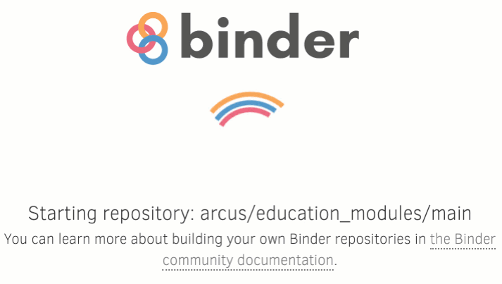
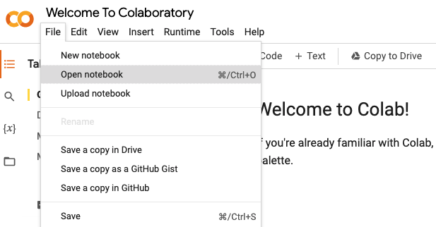

<!--

author:   Meredith Lee
email:    leemc@chop.edu
version:  2.0.0
module_template_version: 2.0.0
language: en
narrator: UK English Female
title: Introduction to Python
comment:  This module introduces the Python programming language, explores why Python is useful in research, and describes how to download Python and Jupyter.
long_description: Python is a versatile programming language that is frequently used for data analysis, machine learning, web development, and more. If you are interested in learning about any of these topics and are new to programming, are joining a team where Python is used, or have just heard about Python and are looking for a general introduction to the language, this module is a good place to start. This is appropriate for someone at the beginner level.
estimated_time: 1 hr
@learning_objectives  

After completion of this module, learners will be able to:

- Describe what Python is and why they might want to use it for research
- Identify several ways to write Python code
- Understand the purpose and utility of a Jupyter notebook
- Download Python to their own computers
- Install and import packages

@end

link:  https://chop-dbhi-arcus-education-website-assets.s3.amazonaws.com/css/styles.css

script:  https://kit.fontawesome.com/83b2343bd4.js

script:  https://code.jquery.com/jquery-3.6.0.slim.min.js

@gifPreload

@end
-->

# Introduction to Python

## Overview

@comment

### Is this module right for me?

@long_description

### Details

**Estimated time to completion**: @estimated_time

**Pre-requisites**: Learners should be familiar with tabular data (data stored in a rectangular format, like an Excel spreadsheet or a comma separated file). It is helpful to have some familiarity with navigating to specific directories and running programs in the Command Line/Terminal. Learners do not need to have access to Python or Jupyter notebooks on their own computers.

**Learning Objectives**:

@learning_objectives

## Lesson Preparation

For the hands-on activity in this module, we will be using an online environment containing a Jupyter notebook. To load the environment, open the link below in a new tab:

Please read over both options before you start performing any actions, to make sure you pick the right option for you.

Option 1: Work in the Cloud
=======

This might work well for you if you either can't or don't want to install Python and Jupyter on your computer, or are not familiar with working with directories or Github. The benefit is that you don't have to install anything, but one negative is that this option requires a bit of waiting for your environment to come online.

**First**, we need to create a small container in the cloud for you to work in just using your web browser.  **Click "Launch binder" below.**  It might take a couple of minutes to create, depending on how recently it was created (when it's being used more, it's quicker!).

 **← Click the "launch binder" button!**

 If you're the first person to fire up this environment in a while, you might see this loading screen for a few minutes.  Be patient!

 <!--
style = "border: 1px solid rgb(var(--color-highlight));"-->

Option 2: Work on Your Computer
=======

If you have [Python](https://www.python.org/) and [Jupyter](https://jupyter.org/) installed already on your local computer, and have some familiarity working with file directories or Github, you might be interested in simply downloading our sample code to your computer. If you haven't downloaded Python or Jupyter to your computer but would like to, you'll learn how in the [Next Steps](#next-steps) section of this module. Then you can come back here when you're done and follow these steps to download the code (If you already completed this work for a previous module, and it's been a while since you downloaded this project to your computer, you may want to get any new and improved files that have been placed there in the meantime):

* Go to the [GitHub repository](https://github.com/arcus/education_modules) where the materials for this lesson are located.
* You can use Git to **clone**, or download, a repository (or "repo", as it is sometimes called). Here are the steps to follow:

  * It is likely that Git is already installed on your computer, even if you've never used it before. Open the Terminal application (if you're using a Mac/Linux machine) or the Windows Powershell (if you're using Windows 10 or later -- here is [more information about finding the Windows Powershell](https://liascript.github.io/course/?https://raw.githubusercontent.com/arcus/education_modules/main/bash_scripting_101/bash_scripting_101.md#5). Then run the code `git --version`. If Git is installed, you should see a version number. If not, check out [these instructions for installing git on Mac or PC](https://carpentries.github.io/workshop-template/#git).

  * You can also use GitHub Desktop, which you can use to interact with GitHub repositories. The [GitHub Desktop documentation](https://docs.github.com/en/desktop/installing-and-configuring-github-desktop/overview/getting-started-with-github-desktop) for download instructions and getting started.
  * If you are using Git in a command line interface, go to the [education_modules repository on GitHub.com](https://github.com/arcus/education_modules) and then follow [these instructions to clone the repository](https://docs.github.com/en/repositories/creating-and-managing-repositories/cloning-a-repository#cloning-a-repository).

  

  It's often useful to have a folder called `GitHub` on your computer for storing repositories that you clone. To navigate to a specific directory in the command line, use the `cd` command (check out the [Command Line 101 module](https://liascript.github.io/course/?https://raw.githubusercontent.com/arcus/education_modules/main/bash_scripting_101/bash_scripting_101.md#1) for more information).
  

  * If you are using GitHub desktop, follow [these instructions for cloning a repository from GitHub to GitHub Desktop](https://docs.github.com/en/desktop/contributing-and-collaborating-using-github-desktop/adding-and-cloning-repositories/cloning-a-repository-from-github-to-github-desktop).

If you don't want to wait for the binder environment to load, but don't want to use git to clone the repository, you can also view the [rendered Jupyter notebook on GitHub](https://github.com/arcus/education_modules/blob/main/intro_to_python/notebooks/intro-to-python.ipynb). You will not be able to interact with the code, but if you have Jupyter installed you can copy and paste the code into code cells that you create in your own notebook.

## The Python Programming Language

While the word "python" might immediately make you think of a snake, that's not all it is! Python refers to a programming language. There are a lot of different programming languages that are used for a variety of tasks, but what they all have in common is that they tell your computer what to do. Behind all of your favorite applications is a software developer (or, more often, several developers) who have written the instructions for the computer in a programming language. Python is a particularly versatile language that can be used for web development, data science, machine learning, and more.

So why should you consider Python for your data analysis? There are a few reasons:

- Python is designed to be human-readable. Creating human-readable code is great for research because your analyses will be more reproducible (if you know exactly what you did, you can reproduce it) and transparent (writing the methods section of a paper is much easier when there is clear language about what was done and why).

- Python is **free** to download and use; it is also **open source**, meaning that updates and innovations can happen more quickly than with proprietary software.

- Because Python is quite popular and fairly mature, there are quite a lot of resources out there to help you get started learning, from free online tutorials and cheatsheets to semester-long courses and everything in between.

### Quiz: The Python Programming Language

What are some reasons to consider using Python for data analysis? Select all that apply.

[[X]] Python is free and open-source.
[[ ]] Python is simple point-and-click software.
[[X]] Python is human-readable.
[[X]] The Python community has lots of resources to help you get started.
***

While Python is human-readable and free, it is not point-and-click software, and it can take some time and effort to learn how to write Python code. Don't worry, there are lots of resources out there to help you learn!

***

## Python Code

Python can be written in several ways. You can write Python code interactively using your computer's Terminal program or Command Line, you can write scripts that include Python code, or you can create Python notebooks using [Jupyter](https://jupyter.org/) or online using [Google Colaboratory](https://colab.research.google.com/?utm_source=scs-index) (or "Colab" for short). In most cases, you'll need to start with downloading Python to your computer (the exception will be if you are using cloud-based solutions like Google Colab); which option you choose will come down to personal preference and your specific goals.

If you have Python installed on your computer, you can use your computer's Command Line or Terminal program to write Python code interactively using a Python **interpreter** by typing `python3`:

@gifPreload

<figure>
  

<figcaption>Click on the image to play the demo.</figcaption>
</figure>

To exit the Python interpreter, type the command `exit()` and then press the Enter key. Alternatively, you can also close the interpreter window.

Using Python interactively in the terminal can be useful if you want to quickly test out short pieces of code. Most of the time, though, you'll either be creating Python scripts or using a notebook instead.

## Python Scripts

Instead of writing instructions one at a time, for more complex tasks you might want to write a Python **script**, a series of instructions that you can write out ahead of time and then run in order with one command. Scripts are often written using special text editors that are designed for writing code (such as Atom or Sublime) or full-featured integrated development environments, or IDEs for short (IDEs, such as PyCharm or Spyder, have more debugging and automation capabilities than text editors).

Here is a short script written in the Spyder IDE:

In the above example, our script asks for input of a user's name using the `input()` function, stores that input in a variable we've called `name`, and prints out a welcome message to the screen that includes the name the user entered using the code `print("Welcome to Intro to Python, "+name+"!")`.

In the script above you can also see lines of text marked with a pound sign `#` at the beginning. The pound sign marks a **comment**, which is anything you write in a script that you don't want to run as code. Comments are a good way to briefly describe or explain aspects of your script, and can also be used to "hide" lines of code as you experiment (an alternative to deleting code that you may want to add back later).

The Spyder IDE has a console where you can see the output of your script without having to run it in the Command Prompt/Terminal. As you can see in the screenshot below, all we had to do was create the file one time and then run that file instead of typing in the code interactively. This can save you time and effort if you have a task you know you'll want to perform repeatedly. In the Spyder IDE there is a "run" button (a green arrow in menu at the top) but you could also run the same file in your Terminal/Command Line by typing the command `python` followed by the file name of your Python script.

@gifPreload

<figure>
  

<figcaption>Click on the image to play the demo.</figcaption>
</figure>

In this case, when you run the code we wrote before in the Spyder console, you'll be asked for an input value (I've supplied the name "Pythonista"). If you hit "Enter", the output of the second line of code will appear: `Welcome to Intro to Python, Pythonista!`.

When you save a Python script, you'll use the file extension .py, and so to run the script in the example above, you would navigate to the correct directory in the Terminal (the folder where you've saved your file) and type `python intro-to-python.py`. If you are in the right place, you should see the output of your code!

### Quiz: Where to write Python code

Which of the following is **not** a recommended way to write Python code?

[( )] in the Python interpreter in the command line.
[(X)] as a script a Google document.
[( )] as a script in an IDE.
[( )] online in a notebook.
***

While it is technically possible to write Python scripts in a Google document, a word processor like Microsoft Word, or a text editor not designed to write code, it is generally not recommended and will make your life harder. There are a variety of text editors that are specifically designed for writing scripts. They generally support multiple languages and have special features that help you write code, such as syntax highlighting, smart code completion, and collaboration tools. Which features you have access to depends on on which editor you choose ([Atom](https://atom.io/) and [Visual Studio Code](https://code.visualstudio.com/) are two free options).

***

## Jupyter Notebooks

If you are interested in using Python for data analysis, you might want to write Python in a [Jupyter notebook](https://jupyter.org/) (which was previously called an IPython notebook). There are a couple of reasons why you should consider using Jupyter notebooks:

- Notebooks provide the best of both worlds between interactive and scripted code: code is written in chunks that can be run individually, with any output displayed beneath the code chunk.

- You can intersperse sections of text, written in Markdown language, that can provide explanations and context for your code. This is especially valuable for data analysis, similar to a scientific notebook.

### Quiz: Jupyter Notebooks

What are the components of a Jupyter notebook? Select all that apply.

[[X]] Code cells
[[X]] Text cells written in Markdown
[[ ]] A console where you can write lines of code interactively
***

Jupyter notebooks contain code cells and text cells. The code cells are written in Python and can contain as much or as little code as you want; the output of the code can be displayed directly beneath the code cell and the code can be edited and re-run at any time. The text cells are written in Markdown language and can provide more context and reasoning than can easily be done using comments. Additionally, using Markdown allows you to add useful formatting to your text. Jupyter notebooks do not have console, but since you can run each code cell independently, you don't really need one!

***

## Accessing Python on Your Computer

Are you interested in learning more about Python, or even starting to work with it? Here are some tips for what you might want to do next!

Installing Python On Your Own Computer
=======

Your computer most likely will **not** have Python already installed. To check, you can open your Command Line/Terminal and type `python --version`. The version you have will be displayed if you have Python installed. If Python is not installed, you have a few options:

* You can [install Python using Anaconda](https://www.anaconda.com/products/individual) (recommended), a toolkit that gives you not only Python itself but also many other data science tools to help with coding, analysis, and visualization. The individual version of Anaconda is also free to download!

  Once you've downloaded Anaconda, you can open the Anaconda Navigator; when you do, you'll see the the window below. Now you have access to lots of tools for working with Python!
  

  
  

* You can also download [just the latest version of Python directly at python.org](https://www.python.org/downloads/). If you also want Jupyter or any IDEs, you will need to download those separately as well. [You can install Jupyter here](https://jupyter.org/install) and [here is a list of IDEs where you can write Python code](https://wiki.python.org/moin/IntegratedDevelopmentEnvironments).

  

  That list of IDEs might seem a bit intimidating! Let's narrow things down to a few good options. If you don't know where to start, [Thonney](https://thonny.org/) is a good option for beginners, and actually comes with Python built in. [Spyder](https://www.spyder-ide.org/) was designed for scientific programming, and is a popular option for data scientists and analysts. [PyCharm](https://www.jetbrains.com/pycharm/) is popular with professional developers and has many features that other IDEs lack, but may come with a steeper learning curve. Both Spyder and PyCharm come with the Anaconda distribution.
  

Using Python in the Cloud
=======

If you don't want to download Python and would instead prefer to continue practicing in the cloud, [Google Colaboratory](https://colab.research.google.com/), or Google Colab, provides an online Jupyter notebook environment that is completely free (though you do need a Google account). The introduction is actually written as a Colab notebook itself, so you can jump right in practicing. While it won't look exactly like the Jupyter notebook we used for this module, it will be a very similar experience, with a mix of code cells and text cells written in Markdown.

You can even see what this module's notebook looks like in Google Colab! Once you've worked through the introduction above:

1. Click "File" in the upper left-hand corner and then "Open notebook" in the drop-down menu:

   

 2. In the window that appears, one of the options at the top is **GitHub**. Click that, and you'll see where you can type in a GitHub URL.
 3. In that space, copy and paste the repository where these modules live: [https://github.com/arcus/education_modules](https://github.com/arcus/education_modules).
 4. Click the magnifying glass to the far right. You should see a list of the Python notebooks in that repository.
 5. When you find the one you want, the button on the far right (an upward-slanting arrow in a box) will open the notebook file as a Colab notebook in another tab.

   
@gifPreload

   <figure>
     

   <figcaption>Click on the image to play the demo.</figcaption>
   </figure>

### Quiz: Accessing Python on Your Computer

How can you access Python to begin practicing on your own?

[( )] By downloading the latest version at https://www.python.org/downloads/
[( )] By downloading the latest Anaconda distribution
[( )] By using cloud-based tools, such as Google Colab
[(X)] All of the above
***

You can download Python directly to your computer, use Anaconda to download Python as well as many other data science tools, or use cloud-based notebooks like Google Colab. The choice is yours!

***

## Modules, Packages, and Libraries

While Python does contain a lot of basic functions "out of the box", if you plan on using it for more complex tasks you'll need more functions and methods. For that, you'll need modules, packages, and libraries.

* A **module** is a Python script that contains a number of related **functions** (defined pieces of code that perform a specific task, which can then be called whenever you want to do that task) and **variables**, which you can think of as containers for storing values (and which you can call just like functions to access their values). You can even [write your own Python modules](https://www.w3schools.com/python/python_modules.asp)!
* A **package** is a group of related modules. You can import the entire package, or if you only need one module, you can just import that module. One package that is frequently used in scientific computing is called **numpy** ([you can read more about numpy here](https://numpy.org/)).
* A **library** is often used as a generic term for a collection of related code (and is therefore sometimes used interchangeably with "module" and "package"), but is frequently used to refer to a collection that contains both modules and packages. [**matplotlib**](https://matplotlib.org/) is a popular data visualization library.

### Installation

In almost every Python script or notebook that you write, you will probably need to import at least one module, package, or library (and usually it will be more than one). Most of the time, these will need to be installed before they can be imported. There are a couple of ways that you can install modules, packages, and libraries, but the syntax is the same for all three.

* One method of installation with Python is using [`pip`](https://pypi.org/project/pip/) to install packages from the [Python Package Index, or PyPI](https://pypi.org/). Most of the packages you'll want to use can be found there! To install packages (or libraries) with `pip`, run `pip install package-name`  in the command line (you would replace `package-name` with the actual name of the package you want to install). So if I wanted to install the [PyTorch](https://pytorch.org/) package, a popular package for machine learning, I would open my command line interface and run `pip install pytorch`.

* If you run Python using the Anaconda distribution, many data science-related packages will come pre-installed, but for ones that don't, you can use the command `conda install package-name`. Not everything is available as a conda package, but it's worth checking if you use Anaconda.

While you can often use either `pip` or `conda` when installing packages, they aren't exactly the same thing-- but they're close enough for our purposes at the moment. [You can read more about `pip` and `conda` here](https://www.anaconda.com/blog/understanding-conda-and-pip) if you're curious. When in doubt, you can always Google "python install package-name" and you should get all of the information you need.

### Import

While you only need to install a module, package, or library one time, you will need to **import** them any time we need to use them in a script or a notebook. This uses the `import` keyword, and you will need to include the import statement at some point before you use a package or library (or any of the individual modules contained within it) for the first time. It's generally considered good practice to import all of the packages and libraries that you want to use in your script or notebook at the very beginning of the document, for organizational purposes. For example, if we wanted to use the `matplotlib` data visualization package in a script or notebook, we would need to run the code `import matplotlib` at some point before using it. Then, if you use a function that is contained within that package or module, you use the syntax `package_name.function_name`.

Let's look at an example. One useful module is `math` which, as its name suggests, contains many useful mathematical functions, including one that returns the square root of a number passed to it, `sqrt()`. To use the `math` module, first we need to import it:

`import math`

Then let's say we want to find the square root of 42. If we try to run the code `sqrt(42)`, we'll get an error (`NameError: name 'sqrt' is not defined`). We have to explicitly tell Python to look in `math` to find the `sqrt()` function. So instead, we run this code:

`math.sqrt(42)`

If you want to use a variable from a module rather than a function, the syntax is similar, but you don't need the parentheses at the end. For example, the `math` module also contains several mathematical constants as variables; interestingly, one of these "constants" is infinity, which is stored in the variable `inf`. To access `inf` from the `math` module, we would run this code:

`math.inf`

For many modules, packages, and libraries, it is often the convention that they are given an **alias**, or a shorter handle used to refer to them later in your script or notebook, using the `as` keyword (for example, `numpy` is customarily given the alias `np`, so the import statement would be `import numpy as np`). Then, if we wanted to use the `numpy` function `linspace()`(which generates evenly spaced numbers over a specified interval, see the [`linspace` documentation](https://numpy.org/doc/stable/reference/generated/numpy.linspace.html) if you're interested in learning more), you would use the code `np.linspace(start, stop)` (with start and stop indicting the interval).

Sometimes, you might only want to import part of a library instead of the whole thing, especially if it is very large and you will only need a small part. There are a couple of ways to do this; we'll use `matplotlib` and one of its modules `pyplot` as an example:

1. `from matplotlib import pyplot as plt`

2. `import pyplot.matplotlib as plt`

Both of these methods do essentially the same thing (and note that we've also used the alias `plt` for `pyplot`). The first option is more readable (that is, it's a little clearer what the code is doing), while the second option is a little faster to type out. In either case, you **don't** need to type out `matplotlib.plt()`; if you want to use `pyplot` going forward, you would only need to type `plt`. This is nice, because `pyplot` is actually a module in the `matplotlib` package, and so to use, for example, the `plot()` function from `pyplot`, now we only need to write the code `plt.plot()`.

If you're thoroughly confused now by libraries, packages, and modules, that's understandable! It can take some time to sort it all out. Just remember that functions and variables can be grouped together into modules, which can themselves be grouped into packages and libraries. And when in doubt, Google can help! Just search for "Python import" and the module/packages that you want to use.

### Quiz: Modules, packages, and libraries

Fatima wants to use Python to select a random of number from a given collection of numbers. She knows that `numpy` has a module called `random` for working with random numbers, which in turn has a function called `choice()` that chooses a selection of random numbers based on a sample that you give it.

Which of the following import statements would allow Fatima to use the `choice()` function described above? Select all that apply.

[[X]] `import numpy as np`
[[X]] `from numpy import random`
[[ ]] `import choice`
[[ ]] `from random import choice`
***

In this case, because the `choice()` function is part of the `random` module in the `numpy` library, Fatima can either import the whole `numpy` package (a good option if she wants to use several modules in `numpy`) or just import the `random` module. She won't be able to import `choice()` or `random` without pointing Python to the library where it exists.

***

For one of her calculations, Fatima needs the variable `pi`, and she needs this constant with more precision than the common 3.14 approximation. Luckily, Python's `math` module has this constant available in the `pi`constant. If Fatima has imported the `math` module with the code `import math`, how would she access the constant `pi`?

[[math.pi]]
***

Because Fatima imported the `math` module, but not the `pi` constant explicitly, to access the constant she'll need to refer to it as part of the `math` module. If instead she had imported just the `pi` constant with the code `from math import pi`, then she could just use `pi` to access the constant.

***

## Hands-On Exercises

This is a hands-on activity to get you used to looking at and using a Jupyter notebook. Feel free to pop over to that tab you opened in the [Lesson Preparation section](#Lesson-Preparation) to get started. Need the link again? Here it is:

 **← Click the "launch binder" button!**

Don't forget to come back here when you're done!

## Additional Resources

* For a beginner-friendly walk-through of writing Python scripts, [Hello World! Your Very First Computer Program](https://youtu.be/cV-QwT4fV7M) delivered by Jeff Pennington is an excellent introduction if you've got an hour to spend.

* [python.org](https://www.python.org/) is a great resource for documentation, FAQ's, and tutorials for beginners, as well as information about what is happening in the wider Python community. Check it out and explore!

* If you're interested in practicing more with Google Colab, check out [this notebook looking at statistics](https://colab.research.google.com/drive/1zkW5Y0SoV3gMU6sQtlgnZsfR2GIXi6F_?usp=sharing).

## Feedback

*5 minute survey*

At the beginning of this module we described the following goals:

@learning_objectives

We ask you to fill out a brief (5 minutes or less) survey to let us know:

* If we achieved the learning objectives
* If the module difficulty was appropriate
* If we gave you the experience you expected

We gather this information in order to iteratively improve our work.  Thank you in advance for [filling out our brief survey](https://redcap.chop.edu/surveys/?s=KHTXCXJJ93&module_name=%22Intro+to+Python%22)!
