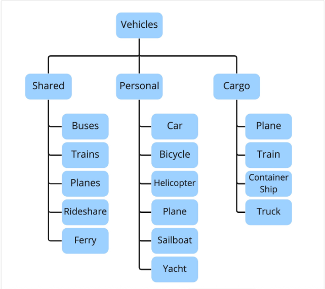
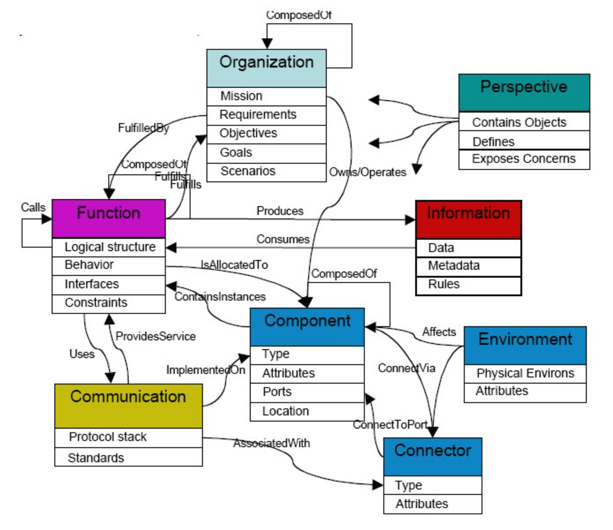
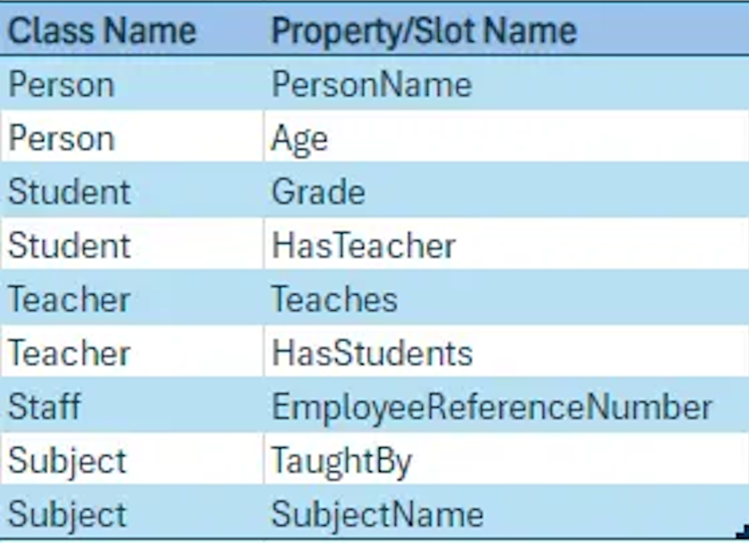
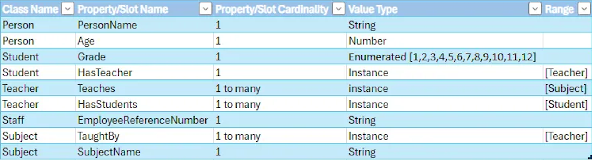
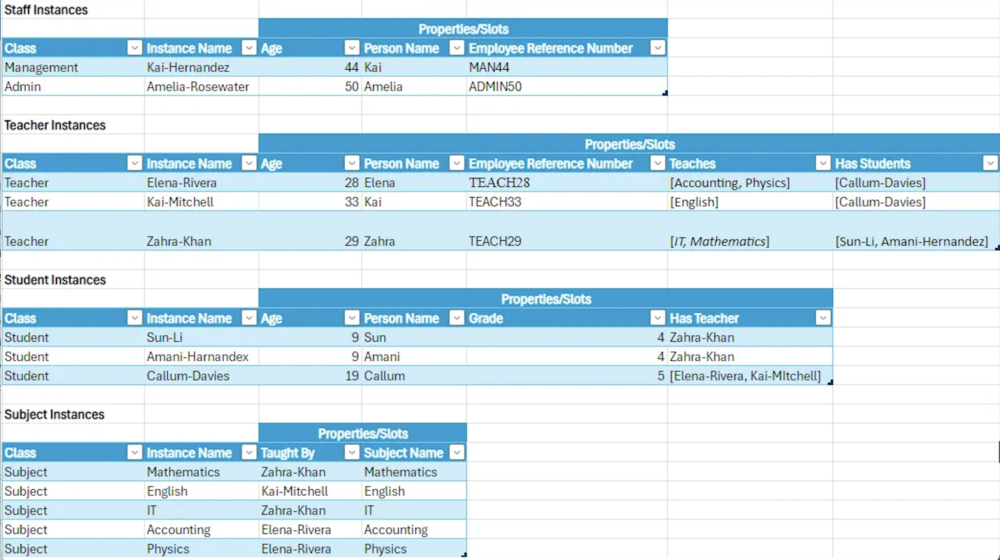

## Ontologies

To better understand ontologies and why we use them, as opposed to taxonomies, as part of the annotation process, it is best to zoom out a bit and broadly define not just what an ontology is but also review what a taxonomy is in relation to an ontology.

### What is a taxonomy?

A taxonomy is a hierarchical classification system used to categorize and organize information into groups and sub-groups. It is often thought of as a structured way of grouping entities based on shared characteristics represented as a tree-like structure where each note is a category or subcategory.

_Key Characteristics:_

- Hierarchical Structure: Tree structure with parent-child relationships.
- Simple Relationships: Captures broad to narrow terms, not usually capturing complex interrelationships between categories.
- Fixed Vocabulary: Can be less flexible in accommodating new or unforeseen concepts.

_Generic Taxonomy Diagram_

### What is an ontology?

An ontology is a complex, flexible framework used to model the relationships between entities and their properties, providing a rich, formal representation of knowledge within a domain, capturing not only the hierarchy, but also the various relationships between concepts. An ontology essentially connects taxonomies, capturing the interrelationships among entities to provide rich information.

_Key Characteristics:_

- Rich Relationships: Multiple types of relationships between concepts represented (parent-child, part-whole, etc.) in addition to including properties and constraints that define how entities interact.
- Formal Representation: Often use formal languages to provide precise definitions and infer logical relationships.
- Dynamic Vocabulary: Adaptable to allow for the inclusion of new concepts and relationships.

_Generic Ontology Chart_

### Why Ontology and Not Taxonomy

An ontological approach captures connections naturally as most knowledge and concepts do not exist in isolation as they do in most taxonomies.

- Ontologies adapt easily to evolving ideas without rebuilding the system
- Relationships are clearly defined
- Connections revealed that might otherwise be missed via a taxonomy
- AI thrives on interconnected data

### So What?

As determining key terms for labels is one of the first steps in creating Annotation Guidelines, it is important to know if you will be utilizing an existing ontology or creating your own for the project. Below is information on three existing ontologies that you can utilize as well as information on creating your own ontology if the existing ones do not meet your needs. HPO and SNOMED are already available in the BRAT annotation tool within Arcus labs. For a larger listing of existing Biomedical Ontologies, [see this resource](https://guides.lib.umich.edu/ontology/ontologies#:~:text=ICD%20-%20International%20Classification%20of%20Diseases,Nomenclature%20of%20Medicine-Clinical%20Terms) from the University of Michigan.

## Existing Ontologies

Detailed here are three existing ontologies that you could use as the ontology for the key terms for your labels in your annotation project: Human Phenotype Ontology (HPO), SNOMED CT, and the Unified Medical Language System (UMLS). 

### HPO

The [Human Phenotype Ontology (HPO)](https://hpo.jax.org/) project provides an ontology of medically relevant phenotypes, disease-phenotype annotations, and the algorithms that operate on these. The HPO can be used to support differential diagnostics, translational research, and a number of applications in computational biology by providing the means to _compute_ over the clinical phenotype. The HPO is being used for computational deep phenotyping and precision medicine as well as integration of clinical data into translational research. [Deep phenotyping](https://www.ncbi.nlm.nih.gov/pubmed/22504886) can be defined as the precise and comprehensive analysis of phenotypic abnormalities in which the individual components of the phenotype are observed and described. The HPO is being increasingly adopted as a standard for phenotypic abnormalities by diverse groups such as international rare disease organizations, registries, clinical labs, biomedical resources, and clinical software tools and will thereby contribute toward nascent efforts at global data exchange for identifying disease etiologies.

The HPO currently contains over 18,000 terms arranged in a directed acyclic graph and are connected by is-a (subclass-of) edges, such that a term represents a more specific or limited instance of its parent term(s). All relationships in the HPO are is-a relationships, i.e. simple class-subclass relationships. For instance, [_Abnormal lens morphology_](https://hpo.jax.org/browse/term/HP:0000517) is-a [_Abnormal eye morphology_](https://hpo.jax.org/browse/term/HP:0012372). The relationships are transitive, meaning that they are inherited up all paths to the root. [_Phenotypic abnormality_](https://hpo.jax.org/browse/term/HP:0000118) is the main subontology of the HPO and contains descriptions of clinical abnormalities. Additional subontologies are provided to describe inheritance patterns, onset/clinical course, and modifiers of abnormalities.

### SNOMED

[SNOMED International](https://www.snomed.org/) is a not-for-profit organization that owns, administers, and develops SNOMED CT. SNOMED CT is a comprehensive, multilingual clinical healthcare terminology resource with scientifically validated clinical content, enabling consistent representation of clinical content in the electronic health records.

The SNOMED CT logical model defines the way in which each type of SNOMED CT component and derivative is related and represented. The core component types in SNOMED CT are concepts, descriptions, and relationships.

_Concepts_

Every concept represents a unique clinical meaning, which is referenced using a unique, numeric, and machine-readable SNOMED CT identifier. The identifier provides an unambiguous unique reference to each concept and does not have any ascribed human interpretable meaning.

_Relationships_

A relationship represents an association between two concepts. Relationships are used to logically define the meaning of a concept in a way that can be processed by a computer. A third concept, called a relationship type (or attribute), is used to represent the meaning of the association between the source and destination concepts. There are different types of relationships available within SNOMED CT.

_Descriptions_

Descriptions are the human readable terms that are associated with clinical ideas. Each description has a description type and may be marked "preferred for use" in particular languages or dialects. A fully specified name (FSN) is a type of description which uniquely and fully captures the meaning of the clinical idea. Synonyms are descriptions that allow the same concept to be expressed in different ways, each of which are associated with the same concept ID.

### UMLS

The [Unified Medical Language System (UMLS)](https://www.nlm.nih.gov/research/umls/index.html) is a collection of files and software developed by the National Library of Medicine that enables interoperability across biomedical computer systems. At its core, is the UMLS Metathesaurus, a large biomedical thesaurus organized by concept, which serves as a bridge connecting over [200 source vocabularies](https://www.nlm.nih.gov/research/umls/sourcereleasedocs/), including SNOMED CT, HPO, ICD-10, RxNORM, etc., by linking synonymous terms to shared concepts. This means a clinician's SNOMED CT code, and a geneticist's HPO term can be recognized as referring to the same underlying concept, allowing seamless traversal across vocabularies. The Metathesaurus preserves each vocabulary's original meanings, concept meanings and relationships while surfacing cross vocabulary connections through a unified concept identifier (CUI) system. The [UMLS Metathesaurus Browser](https://uts.nlm.nih.gov/uts/umls/home) is a web interface for searching and exploring these linked concepts and their relationships interactively.

## Creating an ontology 

There is no one-way or comprehensive methodology that you can always use that covers everything you could need when developing an ontology. Generally speaking, you can follow the below steps to guide you through the process:

1. Determine the domain and scope of the ontology

    - To determine the domain and scope, start with a few basic questions such as:

      - What is the domain of the ontology?
      - What are we using the ontology for?
      - What answers should the ontology provide us with?
      - Who will use this ontology?

2. Consider reusing existing ontologies

    - In some cases, you have the benefit of reusing an existing ontology that was developed by someone else for similar purposes to your own, in these cases you could simply extend those ontologies to better suit your needs.

3. Enumerate important terms in the ontology

    - You need to understand the scope of the ontology in terms of what you want to define and work with. To this end, you need to come up with terms that you would like to make statements about or explain to users.

4. Define the classes and class hierarchy

    - A class is a collection of instances.
    - For the creation of a class hierarchy, there are three choices:
      
      - Top-down: Identify most general classes first and then work to specifics
      - Botton-up: Identify specifics first and then work to general classes
      - Combination
  
5. Define the properties of classes

    - Now that classes and high-level concepts have been defined, they need detail.
    - By using properties, you are able to describe the internal structure of your classes
    - Example: 

6. Define the facts of the properties (Properties can also be referred to as slots)

    - Important aspects to consider regarding the properties include:

      - Value Type: Is it a string, number, Boolean, enumeration, instance of another class?
      - Property cardinality: How many values does the property have?
      - Range: Instance properties are when an instance of another class is used as a property in another class; these properties often only allow certain instances of another class, and these instances are specified in a range. 
      - Domain: Refers to the classes to which a property is attached or classes which a property describes.

    - Example:

7. Create Instances

    - Create individual instances of the classes that were previously defined:

      - Choose a class
      - Create an individual instance of that class
      - Fill in the property values

    - Example:

_Note: In ontologies, properties and classes form a hierarchy and inherit the properties/slots of the classes above them._

For more detailed information on the steps outlined, view [Ontology Development 101: A Guide to Creating Your First Ontology](https://protege.stanford.edu/publications/ontology_development/ontology101.pdf).

## Managing an Ontology 

Managing an ontology is an important part of the process whether you are utilizing an existing ontology or creating your own. Detailed here are widely used tools, including Protégé, PoolParty, and BRAT, to help you do this, in addition to noting the importance of adding, editing, and deprecating Terms.

### Tools

Several ontology editing tools are available to support the creation and management of ontologies, with [Protégé](https://protege.stanford.edu/) and [PoolParty](https://www.poolparty.biz/) being among the most widely used. Both tools provide a visual interface for defining classes, relationships, and hierarchies, and support standard ontology formats such as [OWL](https://www.w3.org/TR/owl2-overview/) and [SKOS](https://www.w3.org/TR/skos-reference/). Protégé is a free, open-source option well suited to building and editing ontologies from scratch, while PoolParty offers additional enterprise features such as taxonomy management, version control, and integration with data pipelines.

If you are using an ontology for clinical note annotation within an Arcus lab, you will need to integrate it with the [BRAT annotation tool](https://brat.nlplab.org/). BRAT provides a visual interface for annotating text spans with ontology terms and defining relationships between them. Your ontology terms and relationship types are managed through BRAT's configuration files, which must be updated whenever terms are added or changed in your ontology. [See this guide](https://forum.arcus.chop.edu/t/note-annotator-guidelines/221) for more information about using BRAT with clinical notes in Arcus.

### Adding, Editing, and Deprecating Terms

Managing ontology terms over time involves three core activities: adding new terms, updating existing ones, and deprecating those that are no longer needed. New terms should only be added when they represent a clearly defined concept not already covered by the ontology, and should follow a consistent naming and definition convention established by your team. Updates to existing terms, such as revised definitions or relationships, should be documented with a rationale to maintain transparency. Rather than deleting outdated terms, deprecated terms should be marked as obsolete and retained in the ontology to preserve the integrity of any existing annotations that reference them.

Within Arcus labs, it is recommended to maintain your ontology terms, relationships, and definitions in GitHub, a web-based platform that uses Git to track changes to files over time, including files edited collaboratively by a team. GitHub is particularly well suited to ontology management because every change is automatically recorded in the repository history, eliminating the need to manually number or rename files to track versions. When making changes, it is helpful to distinguish between major updates (such as significant restructuring of classes or relationships) and minor updates (such as small definition edits) noting these differences in your commit messages. Consistent file naming conventions should be established from the outset within GitHub that is useful, consistent and well documented, [see this resource](https://storage.googleapis.com/arcus-edu-libsci/Arcus%20RDM%20Resources/fileNaming_bestPractices_MIT.pdf) for more information.

## Knowledge Check

1. Which statement best distinguishes an ontology from a taxonomy?

[( )] A. A taxonomy can express multiple relationship types, while an ontology cannot  
[(X)] B. An ontology is a richer formal model that can express multiple relationship types and constraints; a taxonomy is typically a simple hierarchical classification  
[( )] C. Taxonomies always include inference capabilities and OWL semantics  
[( )] D. Ontologies are always flat lists of terms  

---

2. True or false: Ontologies improve computability and interoperability by providing formal definitions, relationships, and constraints.

[(X)] True  
[( )] False  

---

3. You should prefer an ontology over a simple label list when: (Select all that apply.)

[[X]] A. Relationships between concepts (e.g., is-a, part-of) are important to downstream analysis  
[[X]] B. You need computable definitions to support reasoning or mapping across vocabularies  
[[ ]] C. The project only requires a short, fixed hierarchical label list with no relationships  
[[X]] D. Reuse and interoperability with other datasets or EHR systems are goals  

---

4. Before building a new ontology, it is recommended to consider reusing or ______ an existing ontology.

[[extending]]

---

5. Which resource aggregates many biomedical vocabularies and provides mappings across them via unified concept identifiers?

[( )] A. HPO  
[( )] B. SNOMED CT  
[(X)] C. UMLS  
[( )] D. Protégé  

---

6. True or false: SNOMED CT is primarily designed as a comprehensive clinical terminology for EHR interoperability.

[(X)] True  
[( )] False  

---

7. Which steps are important when creating a practical ontology for annotation projects? (Select all that apply.)

[[X]] A. Define domain and scope  
[[ ]] B. Omit documentation to keep the ontology compact  
[[X]] C. Enumerate terms and build class hierarchy  
[[X]] D. Define properties (domain, range, cardinality) and document semantics  

---

8. When constructing classes and properties, top-down, bottom-up, or ______ approaches are commonly used (one word).

[[hybrid]]

---

9. Which of the following is the best practice when removing or changing terms that have already been used in annotations?

[( )] A. Delete the old term immediately to prevent future use  
[(X)] B. Mark the term obsolete/deprecated, retain it in version history, and document the change  
[( )] C. Rename silently without notifying annotators  
[( )] D. Remove all annotations that used the term  

---

10. Version control (e.g., GitHub) and clear commit messages are recommended for managing ontology files and changes.

[(X)] True  
[( )] False  

---

11. Which free/open-source tool is recommended for building and editing OWL ontologies?

[( )] A. Excel  
[(X)] B. Protégé  
[( )] C. Photoshop  
[( )] D. ArcGIS  

---

12. Which of the following is **not** an example of an interoperable file format suitable for exporting a created ontology?

[(X)] PDF  
[( )] OWL  
[( )] SKOS  
[( )] CSV  

---

13. Best practices for using ontologies in annotation projects include: (Select all that apply.)

[[X]] A. Embedding ontology term definitions and examples in annotation guidelines  
[[ ]] B. Updating the ontology without retraining annotators or revising guidelines  
[[X]] C. Coordinating ontology updates with annotator retraining and guideline revisions  
[[X]] D. Preferring reuse/extension of well-maintained ontologies over building new ones when possible  

---

14. True or false: Keeping ontology mappings and examples in the annotation guideline helps annotators choose consistent terms.

[(X)] True  
[( )] False  

## Sources

Bice, B. (2025, July 28). Why ontology and not taxonomy. _International Legal Technology Association_. <https://www.iltanet.org/blogs/william-bice/2025/07/28/why-ontology-and-not-taxonomy>

De Jager, B. (2024, July 23). Ontology engineering for beginners - Part 1. _Medium_. <https://medium.com/@brucedej/ontology-engineering-for-beginners-part-1-69a01df66caa>

De Jager, B. (2024, August 3). Ontology engineering for beginners - Part 2. _Medium_. <https://medium.com/@brucedej/ontology-engineering-for-beginners-part-2-f0cdac19ab16>

Doubleday, K. (2024, September 4). Taxonomies versus ontologies: A short guide. _Fluree_. <https://flur.ee/fluree-blog/taxonomies-versus-ontologies-a-short-guide/>

Earley Information Science. (n.d.). _What is the difference between taxonomy and ontology?_ <https://www.earley.com/insights/what-difference-between-taxonomy-and-ontology-it-matter-complexity>

Gargano, M.A., Matentzoglu, N., Coleman, B., Addo-Lartey, E.B., Anagnostopoulos, A.V., Anderton, J., Avillach, P., Bagley, A.M., Bakštein, E., Balhoff, J.P., Baynam, G., Bello, S.M., Berk, M., Bertram, H., Bishop, S., Blau, H., Bodenstein, D.F., Botas, P., Boztug, K., Cady, J., ... Robinson, P.N.. (2024). The Human Phenotype Ontology in 2024: phenotypes around the world. _Nucleic Acids Res, 52_(D1), D1333-D1346. <https://doi.org/10.1093/nar/gkad1005>

Kempe, S. (2017, October 17). Taxonomy vs ontology: Machine learning breakthroughs. _Dataversity_. <https://www.dataversity.net/articles/taxonomy-vs-ontology-machine-learning-breakthroughs/>

Laubheimer, P. (2022, July 3). Taxonomy 101: Definition, best practices, and how it complements other IA work. _Nielsen Norman Group_. <https://www.nngroup.com/articles/taxonomy-101/>

Noy, N.F., & McGuinness, D.L. (n.d.). Ontology development 101: A guide to creating your first ontology. _Stanford University_. <https://protege.stanford.edu/publications/ontology_development/ontology101.pdf>

OBO Foundry. (n.d.). _Principles: Overview_. <https://obofoundry.org/principles/fp-000-summary.html>

Ontology (information science). (2026, May 4). In Wikipedia. <https://en.wikipedia.org/wiki/Ontology\_(information_science]>

SNOMED International. (n.d.). _SNOMED_. <https://www.snomed.org/>

University of Michigan Library. (2026, April 17). Biomedical ontologies and controlled vocabularies. _Library Research Guides_. <https://guides.lib.umich.edu/ontology/ontologies>
