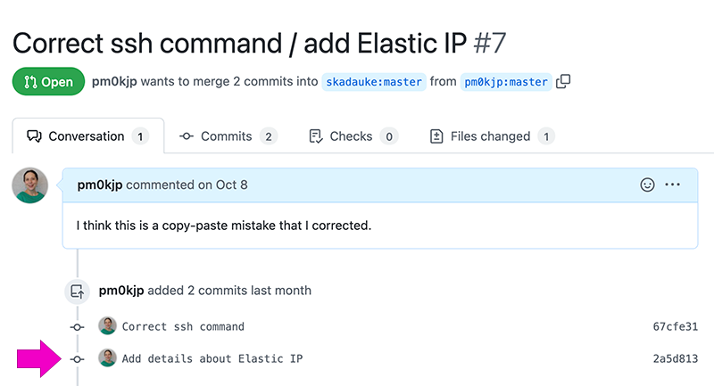

# Quality Assurance for modules

When a module creator is ready to request that their module be included, they will create a Pull Request (PR).  This begins the work of quality assurance.  As someone who is reviewing the modules created by others, it's important to have use a consistent method for evaluating content.  This work is exacting and can be tedious.  It's probably worthwhile to look at other QA issues that have successfully been closed to see a bit more information about the level of detail other reviewers provide.  To see a sample issue, look at https://github.com/arcus/education_modules/issues/9.  To see a completed review, check out https://github.com/arcus/education_modules/issues/11.

## Step 1: Create an Issue

* Click on "Issues" or go to https://github.com/arcus/education_modules/issues.
* Choose "New Issue" (or if your screen is small, just "New").  This is a green button on the right side:

* Give your issue a good title: "QA" plus the proposed directory name from the PR. For example, if the PR includes a new module with the directory named "reproducibility", the title would be "QA reproducibility".)
* In the "Write" tab area, paste the following (from `# Module Quality Assurance Report for PR #[put in the PR number here] ` to `* [ ] description or quote, line ___ in file ____`).  Where square brackets appear, remove the square brackets and their contents and replace with the appropriate values.  To see what this looks like in a real issue, see To see a completed review, check out https://github.com/arcus/education_modules/issues/11.

```
# Module Quality Assurance Report for PR #[PR number here]  
----
Date: [yyyy-mm-dd]
Reviewer: [your name]
Name of Module: [take from the title of the main markdown in the PR]
Current Liascript URL: [makes it easy for reviewers and authors to look at content as learners will]
Current Version of Module (use the latest commit value):  [click on the PR and get the clickable short link to the latest commit -- add screenshot here]

# Checklist Reports:

## Structural elements

* [ ] YAML top section filled in with name, email, language, narrator, title, and comment (blurb) filled out appropriately.
* [ ] YAML top section includes proper link to CSS (currently https://chop-dbhi-arcus-education-website-assets.s3.amazonaws.com/css/modules.css).
* [ ] YAML top section has a version of at least 1.0.0 (first public version).
* [ ] Title is the first line and is the only level-1 header in the document.
* [ ] Overview section immediately follows Title, surrounded in div with class overview, and has filled in sections including an intro blurb, Estimated time to completion, Pre-requisites, Learning objectives, and Contents.
* [ ] Contents within Overview reflect accurately the sections and the links in the contents section work.
* [ ] Sections following Overview all have content (no pages with just header and no additional text / media material).
* [ ] Final section is Feedback.

## Content

* [ ] Good amount of content, both in terms of the complexity/usefulness of the material covered and the time estimate
* [ ] Clearly defined learning objectives using strong, descriptive verbs. (See [Bloom's taxonomy](https://cft.vanderbilt.edu/guides-sub-pages/blooms-taxonomy/) for ideas.)
* [ ] Every learning objective is covered in the module content.
* [ ] There are no tangents or mission creep in the module content, straying from the learning objectives.
* [ ] No betrayal of expectations: The module title, description, learning objectives, time estimate, and overview all accurately reflect the content of the module. A learner should be able to make an informed decision about whether or not to complete the module.
* [ ] Avoids unclear language: unexplained idioms or references, unexplained acronyms, unnecessary technical language.
* [ ] Unusual words, or words taking on a very specific meaning in context, are always defined for the user, either on the page (e.g. using footnotes) or with links to a definition/glossary. Provides pronunciation guides for especially unusual words of particular importance.
* [ ] Provides content in a variety of forms and styles: screencasts, text, webinars/lectures, practical exercises, etc. Whenever possible, multiple forms/styles should be incorporated in each module so learners have multiple avenues to the content.
* [ ] Avoids unnecessarily gendered language (e.g. uses "they" singular rather than "he or she" for an unknown person).
* [ ] Informative link text (e.g. instead of "To learn more about python, click [here](www.example.com)", say "Read this article to [learn more about python](www.example.com).")
* [ ] Includes accurately formatted and functional link to feedback form.
* [ ] Spelling and grammar are correct.

## Organization

* [ ] Clear, informative headers and sensible hierarchical structure (the TOC in the left margin should give a good overview of the content convered)
* [ ] Uses specially formatted highlight boxes consistently and appropriately
* [ ] Short, digestible pieces --- avoids long paragraphs and breaks long sections up with sub-headers

## Formative assessment

* [ ] Frequent [formative assessment](https://carpentries.github.io/instructor-training/02-practice-learning/#identifying-and-correcting-misconceptions) in the form of knowledge checks and/or hands-on exercises
* [ ] Clear explanations available after questions unless the nature of the question itself or answer options makes it unnecessary (e.g. a T/F question may not always require follow-up explanation)
* [ ] Knowledge check questions and hands-on exercises relate directly to learning objectives

## Videos and images

* [ ] Screencasts cover a single coherent task so the recording is a short as is feasible. To demonstrate more than one related task, include several short screencasts in succession rather than recording one long screencast.
* [ ] Subtitles available for every recording with audio.
* [ ] Alt text available for every image.
* [ ] Important visuals (in video, image, or gif) are always described in the audio or in accompanying text.
  - For example, in a screencast, instead of just, "And then click here," provide description that could help scaffold someone without visual access like, "And then click on the button that says 'Run' in the top-right corner of the screen". Be sure to make use of text cues when available (e.g. button labels), not just visual signals like color or location.
  - When important content is conveyed in a visual, describe the key elements. For example, "Running this query produces the table below. It displays the first 5 rows by default, and columns for ID, encounter ID, diagnosis, and outcome."
  - When including a data visualization, describe important features, such as both axis labels and visible trends in the data. For example, "Here's a scatterplot showing number of encounters on the y-axis and age on the x-axis. All 183 patients from our sample are represented here, and it looks like a weak positive trend, with older patients being more likely to have had more encounters. There are a few important outliers, though, such as this patient at about 6 months old with more than 20 encounters already."
  - When visual information is repeated with minimal changes, it's fine to indicate that without providing a full description again. For example, "And here's the updated table, filtered to only show patients who have been seen in the last 2 years."
  - When important visual information in a video is too complex to include sufficient audio description (i.e. it would slow the content down so much as to impair its utility), an alternative video file should be provided with audio descriptions included.
* [ ] Color is never the sole method for distinguishing visual content (including in data visualizations).

## Branch References to Change prior to PR

List here any internal references (stated or hyperlinked) that work now because they refer to the named branch, but will not work once this is on the main branch and the named branch is deleted.

* [ ] description or quote, line ___ in file ____
* [ ] description or quote, line ___ in file ____
* [ ] description or quote, line ___ in file ____
```

* Click on the "Preview" tab to see if everything is rendering nicely and there are at least two clickable links -- one to the PR (the top line in the issue) and one to the commit version (6th line).
* Click "Submit new issue".

## Step 2: Go through checklists

Once you create the issue, then go through and actually evaluate the checklists.  

If you're convinced a checklist item is complete, you can click the checkbox without editing the text of the issue -- simply click in the checkbox as if it were a checkbox on any web page.  Helpfully, you will see the number of "tasks" at the top of the issue reflect what's been marked as complete.


If there are problems to resolve before a checklist item is complete, communicate with the author using comments on the issue and @ the author.  Be as precise as possible (e.g. what file, what line, what problem are you referring to?).  If it's clear that the module has many glaring issues, it's okay to stop work on review, close the PR, and simply ask the author to review the checklist and resubmit.  It's not worth a lot of effort to do QA on a module that needs a substantial rework.


The author may make fixes to their code and commit to the branch.  This will simply update their PR with newer commits.  This means that you will want to change the version in the top part of the issue (show screenshot of how to edit the main issue) with the commit hash for the now current version.  In GitHub, when you look at the PR, the most recent commit is the lowest one down on the page:



Once you are satisfied with the quality of the module (don't worry, it can always be improved, this is a best effort only, no perfection expected or implied), the last thing to do before the PR is to make sure that any changes to references within the material relating to the branch name are resolved (see the last bit of the copy-paste issue code).  Issue a final comment reminding the author to handle this in a new commit.  Check that commit and if all is well, approve the PR and close the issue.

In general we should not delete issues or comments on issues, because they provide a useful history of the project.
