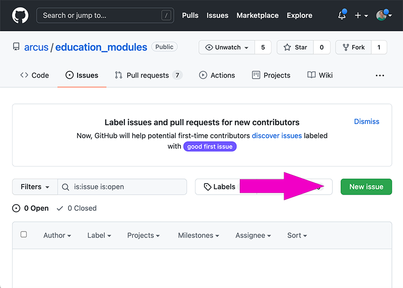
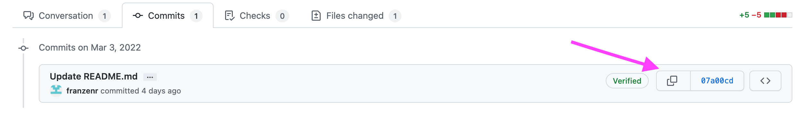
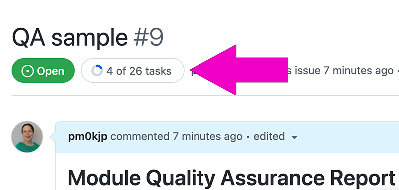
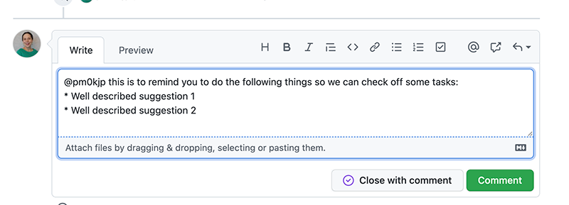
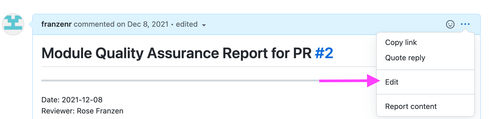
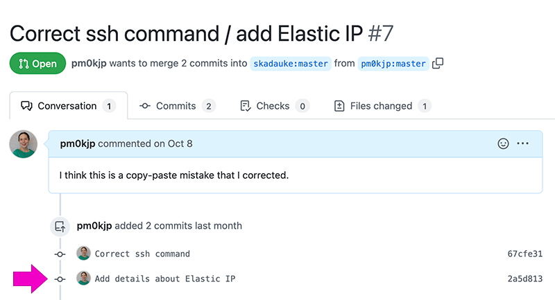

# Quality Assurance for modules

When a module creator is ready to request that their module be included, they will create a Pull Request (PR).  This begins the work of quality assurance.  As someone who is reviewing the modules created by others, it's important to have use a consistent method for evaluating content.  This work is exacting and can be tedious.  It's probably worthwhile to look at other QA issues that have successfully been closed to see a bit more information about the level of detail other reviewers provide. To see a completed review, check out https://github.com/arcus/education_modules/issues/53.

## Step 1: Create an Issue

* Click on "Issues" or go to https://github.com/arcus/education_modules/issues.
* Choose "New Issue" (or if your screen is small, just "New").  This is a green button on the right side:

* Title the issue as "QA" plus the proposed directory name from the PR.
  * For example, if the PR includes a new module with the directory named "reproducibility", the title would be "QA reproducibility".)
* In the "Write" tab area, paste the text of the [quality assurance template](https://github.com/arcus/education_modules/blob/main/quality_assurance_template.md) (from `# Module Quality Assurance Report for PR #[put in the PR number here] ` to `* [ ] description or quote, line ___ in file ____` Do not include the three back ticks at the beginning or end of the file.).  

* Where curly brackets appear, remove the curly brackets and their contents and replace with the appropriate values. To see a completed review, check out https://github.com/arcus/education_modules/issues/53.
  * To find the clickable short link to the latest commit, open the pull request and click the "commits" tab. That page will show all commits to the pull request. If there are multiple commits to the PR, the newest will be at the bottom of the page. Click the button next to the commit value.
  
  * When you paste this into the issue it will appear as a long string of letters and numbers -- don't worry, GitHub will automatically format this into the clickable short link.

* Click on the "Preview" tab to see if everything is rendering nicely and there are at least two clickable links -- one to the PR (the top line in the issue) and one to the commit version (8th line).
* Click "Submit new issue".

## Step 2: Go through checklists

Once you create the issue, then go through and actually evaluate the checklists.  

If you're convinced a checklist item is complete, you can click the checkbox without editing the text of the issue -- simply click in the checkbox as if it were a checkbox on any web page.  Helpfully, you will see the number of "tasks" at the top of the issue reflect what's been marked as complete.

If there are problems to resolve before a checklist item is complete, communicate with the author using comments on the issue and @ the author.  Be as precise as possible (e.g. what file, what line, what problem are you referring to?).  If it's clear that the module has many glaring issues, it's okay to stop work on review, close the PR, and simply ask the author to review the checklist and resubmit.  It's not worth a lot of effort to do QA on a module that needs a substantial rework.

The author may make fixes to their code and commit to the branch.  This will simply update their PR with newer commits.  This means that you will want to change the version in the top part of the issue with the commit hash for the now current version.  In GitHub, when you look at the PR, the most recent commit is the lowest one down on the page:

Once you are satisfied with the quality of the module (don't worry, it can always be improved, this is a best effort only, no perfection expected or implied), the last thing to do before the PR is to make sure that any changes to references within the material relating to the branch name are resolved (see the last bit of the copy-paste issue code).  Issue a final comment reminding the author to handle this in a new commit.  Check that commit and if all is well, update the commit value listed at top of the QA document to the most recent commit, approve the PR and close the issue.

In general we should not delete issues or comments on issues, because they provide a useful history of the project.
