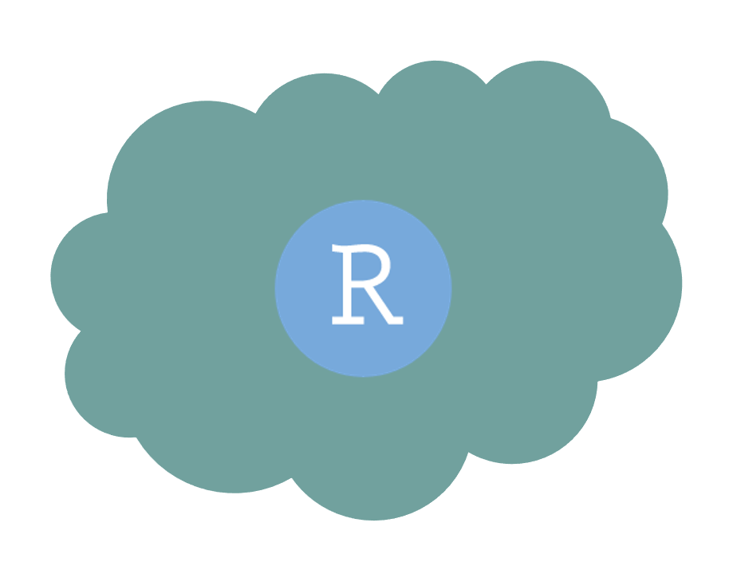
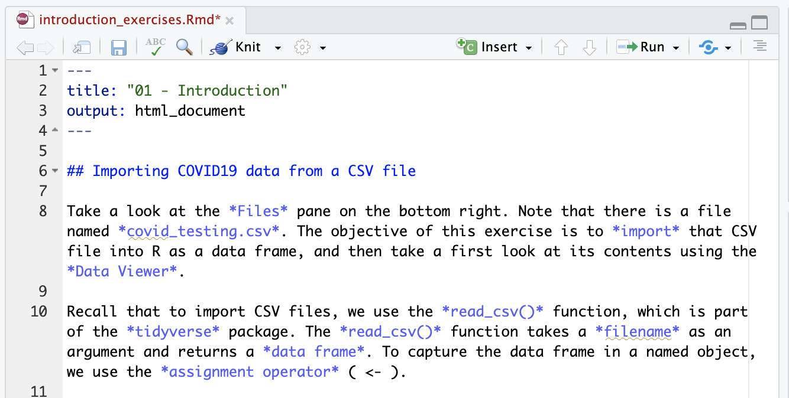

<!--
author:   Joy Payton
email:    paytonk@chop.edu
version:  1.0.0
module_template_version: 2.0.0
language: en
narrator: US English Female
title: R Basics: Introduction
comment:  Introduction to R and hands-on first steps for brand new beginners.
long_description: Are you brand new to R, and ready to get started?  This module teaches concepts and vocabulary related to R, RStudio, and R Markdown.  It also includes some introductory-level hands-on work in RStudio.  This is a good course if you know that you want to use R but haven't ever used it, or you've barely used it and need a refresher on the basics.
estimated_time: 1 hour

@learning_objectives  

After completion of this module, learners will be able to:

- Define and differentiate "R", "RStudio", and "R Markdown"
- Install and load packages in R
- Create a simple R Markdown file and its associated output document
- Import a .csv file as a data frame


@end
script:  https://code.jquery.com/jquery-3.6.0.slim.min.js

@gifPreload
<script>
(function($) {

  // Get the .gif images from the "data-alt".
	var getGif = function() {
		var gif = [];
		$('img').each(function() {
			var data = $(this).data('alt');
			gif.push(data);
		});
		return gif;
	}

	var gif = getGif();

	// Preload all the gif images.
	var image = [];

	$.each(gif, function(index) {
		image[index]     = new Image();
		image[index].src = gif[index];
	});

	// Change the image to .gif when clicked and vice versa.
	$('figure').on('click', function() {

		var $this   = $(this),
				$index  = $this.index(),

				$img    = $this.children('img'),
				$imgSrc = $img.attr('src'),
				$imgAlt = $img.attr('data-alt'),
				$imgExt = $imgAlt.split('.');

		if($imgExt[1] === 'gif') {
			$img.attr('src', $img.data('alt')).attr('data-alt', $imgSrc);
		} else {
			$img.attr('src', $imgAlt).attr('data-alt', $img.data('alt'));
		}

		// Add play class to help with the styling.
		$this.toggleClass('play');

	});

})(jQuery);
</script>
@end

link:  https://chop-dbhi-arcus-education-website-assets.s3.amazonaws.com/css/styles.css
script: https://kit.fontawesome.com/83b2343bd4.js
-->
# R Basics: Introduction

<div class = "overview">

## Overview

@comment

**Is this module right for me?** @long_description

**Estimated time to completion:** @estimated_time

**Pre-requisites**

No prior experience of using R, RStudio, or R Markdown is required for this course.   

This course is designed for brand new beginners with zero or minimal experience working with R.

**Learning Objectives**

@learning_objectives

</div>

Material for this module was adapted, with permission, from [Stephan Kadauke's R for Clinical Data workshop materials](https://skadauke.github.io/intro-to-r-for-clinicians-chop/).  We owe special thanks to Dr. Kadauke as well as the [R User Group](https://redcap.chop.edu/surveys/?s=NPY49R9ARF) at Children's Hospital of Philadelphia for their generosity in sharing these materials.

## Terminology: The Three "R"s of This Module

We begin by presenting three distinct but interrelated terms: R, RStudio, and R Markdown.  

<div style = "align-items: center; display: flex;">

<div style = "margin: 1rem; max-width: 25%; float:left; padding-right:4em;"> 
</div>
<div style = "margin: 1rem auto; max-width: 75%; float:left;">

<h3>R</h3>

The first is **R**. R is a statistical programming language that's great for doing data analysis. There are a lot of features that make R great:  

* R is **open source**, which means that it is "free" in two ways -- in the meaning of having **no cost** and also in that can be used widely **without intellectual property concerns or licensing restrictions**.
* R makes it possible to **wrangle** (arrange, reshape, and organize) complex data sets, and
* R can produce publication-quality visualizations.

There is also an open and welcoming community of R users, which is just as important, if not more important, as the actual underlying details of the language.


</div>
</div>

<div style = "align-items: center; display: flex;">

<div style = "margin: 1rem; max-width: 25%; float:left; padding-right:4em;"> 
</div>
<div style = "margin: 1rem auto; max-width: 75%; float:left;">

<h3>RStudio</h3>

Then, there's **RStudio**. RStudio is the name of a company and also the name of a piece of software this company makes (and makes available for free). You can think of RStudio as a fancy text editor for writing R code. The technical term for a fancy text editor for writing code is "Integrated Development Environment", or IDE (you pronounce each letter, eye-dee-ee). You can run RStudio on Mac, Windows, or Linux. It can run on a local computer like your laptop, or on a server that is accessed using a web browser.

</div>
</div>

<div style = "align-items: center; display: flex;">

<div style = "margin: 1rem; max-width: 25%; float:left; padding-right:4em;"> 
</div>
<div style = "margin: 1rem auto; max-width: 75%; float:left;">

<h3>R Markdown</h3>

Finally there's **R Markdown**. R Markdown is a **computational document**, an example of [**literate programming**](https://education.arcus.chop.edu/literate-statistical-programming/). A computational document is a document that has executable code inside of it, and as we'll discuss shortly, it's a great way to perform data analysis in a reproducible fashion. You'll also hear this called "literate programming" or "literate statistical programming", because an R Markdown document contains both human language (it's literate) as well as computer code (programming).  With R Markdown, we will usually write that executable code using the R language. However, it's actually possible to write code in Python, C++, SQL, and other languages inside of an R Markdown document.  That goes beyond the scope of this module, but it's helpful to remember that R Markdown is quite flexible.

</div>
</div>

So we have **R**, **RStudio**, and **R Markdown**. For the remainder of this module, we'll show you how these three R's come together to form the infrastructure for performing state of the art data analysis.

### RStudio

As we mentioned on the previous page, there are two versions of RStudio:

<div style = "align-items: center; display: flex;">

<div style = "margin: 1rem; max-width: 25%; float:left; padding-right:4em;"> 
</div>
<div style = "margin: 1rem auto; max-width: 75%; float:left;">

**RStudio Server** – a version of the RStudio IDE that can be accessed from a web browser. It's hosted on a server that could be on premises or in the cloud. We'll offer a version of RStudio in the cloud for use, in case you can't or don't want to download R and RStudio to your computer just yet.
</div>
</div>

<div style = "align-items: center; display: flex;">

<div style = "margin: 1rem; max-width: 25%; float:left; padding-right:4em;"> 
</div>
<div style = "margin: 1rem auto; max-width: 75%; float:left;">

**RStudio Desktop** – a version of the RStudio IDE that is installed on a personal device like your desktop or laptop. This is what you should use after the course to continue learning R and working on R projects. On the course website, I posted videos that show you how to install RStudio Desktop on a Mac or Windows computer.  

</div>
</div>

It's important to note that regardless of which version of RStudio that you use, you will be accessing the same general product -- there's no functionality in RStudio Server that you can't get in RStudio Desktop, or vice versa.

Here's what the RStudio window looks like, regardless of version.

<!-- style = "max-width:900px;" -->

On the top left is the **Editor**. This is where you edit your files with code in them.

On the bottom left is the **Console**. The console allows you to quickly run an individual R command, like for installing a package. We won't use the console very much in this course.

On the top right is the **Environment** tab set. The environment (first and most frequently used tab in the set of tabs in this pane) allows you to look at the data that's loaded into R's memory. Interacting with data in the environment tab can be a little bit like working in Excel, and we'll look at that in an upcoming exercise.

Finally, on the bottom right is where you find your **Files** and related tabs. We'll be using an R Markdown files for coding exercises.

### Quiz: The Three "R"s

<div class = "question">

Which of the following are true?

[[X]] R is a programming language
[[ ]] R Markdown is an editor for writing in the R language
[[X]] RStudio has both an online or cloud version as well as a downloadable version for your computer
[[ ]] R is expensive but powerful
[[X]] RStudio is an Integrated Development Environment or IDE
[[?]] There are several correct answers!

<div class = "answer">
<details><summary>Click to see an explanation of the answer.</summary>

R is a programming language that is free and open source.  It's a good idea to use RStudio, which is an editor or IDE (Integrated Development Environment) to write your R code.  You can use a "server" edition at your institution or via RStudio.cloud, or you can download RStudio to your own computer.  One kind of document you can write in RStudio is an R Markdown document, which allows you to weave together human language, written in Markdown, along with computer code.

</details>
</div>
</div>

## Lesson Preparation: Our RStudio Environment

Please do this step now, because we're going to ask you to follow along throughout and try out code as you go.  

Please read over both options before you start performing any actions, to make sure you pick the right option for you.

<h3>Option 1: Work in the Cloud</h3>

This might work well for you if you either can't or don't want to install R and RStudio on your computer.  The benefit is that you don't have to install anything, but one negative is that this option requires a bit of waiting for your environment to come online.

**First**, we need to create a small container in the cloud for you to work in just using your web browser.  **Click "Launch binder" below.**  It might take a while (5 minutes) to create, depending on how recently it was created (when it's being used more, it's quicker!).  We're looking for a faster way to get you off and running in RStudio without downloads and without creating accounts, but for now this is a great, free way for us to get you working with no extra work on your part.

  <a href = "https://mybinder.org/v2/gh/arcus/education_r_environment/main?urlpath=rstudio" target = "_blank"></a> **← Click the "launch binder" button!**

<div class = "hint" style = "align-items: center; display: flex;">

<div style = "margin: 1rem; max-width: 45%; float:left;"> If you're the first person to fire up this environment in a while, you might see this loading screen for several minutes.  Be patient!</div>
<div style = "margin: 1rem auto; max-width: 45%; float:left;"> <!--
style = "border: 1px solid rgb(var(--color-highlight));"-->
</div>
</div>

**Then**, once you have access to RStudio and you see something like the image below, you'll need to open the sample data for this course.  In the file area to the lower right, you'll see, among multiple choices, the folder called "r\_basics\_visualize\_data".  That's the code for this module!

<!--
style = "border: 1px solid rgb(var(--color-highlight)); max-width: 800px;"-->

<h3>Option 2: Work on Your Computer</h3>

If you have [R](https://www.r-project.org/) and [RStudio](https://www.rstudio.com/products/rstudio/download/#download) installed already on your local computer, you might be interested in simply downloading our sample code to your computer. Here's how.  Note -- if you've already done this step in another module, you might have the material for this module already!

* In RStudio, open a new project (File, New Project)
* Select Version Control, then Git
* Drop this link into the "Repository URL": https://github.com/arcus/education_r_environment
* Change the "Project directory name" and "Create project as a subdirectory of" boxes to suit your needs (where will this code be stored on your computer?).
* Click to select the "Open in new session" checkbox
* Click "Create Project"
* In the file area to the lower right, you'll see, among multiple choices, the folder called "r\_basics\_visualize\_data".  That's the code for this module!

**Want to watch this process?  Click on the image below to play an animated gif.  It will continue to loop and you can re-start it by clicking again.**

<div style="display:none">@gifPreload</div>

<figure>
  

<figcaption style = "font-size: 1em;">Click on the image to play the demo of the above steps!</figcaption>
</figure>

If you already completed this work for a previous module, and it's been a while since you downloaded this project to your computer, you may want to get any new and improved files that have been placed there in the meantime:

* Open your project.
* In the Version Control menu, choose "pull branches".  There are two places to do this, as shown below:

<!-- style = "border: 1px solid rgb(var(--color-highlight)); max-width:400px;" -->  
<!-- style = "border: 1px solid rgb(var(--color-highlight)); max-width:400px;" -->

<div class = "warning">
If you're pulling branches after having worked in previous modules, you might have made local changes (for example, when you filled in exercise code) that will be overwritten by pulling the latest version.  If you want to save your changes, consider making a copy of any exercise files and naming them something new.  For example, if you have already worked in the `r_basics_transform_data` exercise files, you might want to save your version of `transform.Rmd` to `my_transform.Rmd`.  That way, you can pull down the latest version of code, overwriting `transform.Rmd` while holding on to your changes in the new file.
</div>

## Motivation: Reproducible Research

<div style = "align-items: center; display: flex;">

<div style = "margin: 1rem; max-width: 65%; float:left;">
Now that you know a bit more about the vocabulary and computing environment we'll be using, we want to contextualize **why** you might want to use R, RStudio, and R Markdown, even though you may have worked with data before in other software.

One of the most important reasons to learn R is to improve the **reproducibility** of your research. One of the most powerful aspects of working in the R environment is that it makes it straightforward to produce **reproducible data analyses**, which will reduce risk and make "future you" much happier.

Consider the following case study, which highlights potential consequences of **irreproducibile** research.

In the mid-2000s, researchers at Duke University tried to use microarray gene expression data of tumor cells to predict sensitivity to chemotherapeutic agents. This approach generated a lot of excitement at the time, and the resulting work was published in high-profile journals.

Unfortunately, there were a number of **serious errors** in the data analysis.

Even more unfortunately, patients were enrolled in clinical trials and allocated based on **flawed models**. It's likely that some patients were actually treated with the chemo they are **least likely** to respond to rather than the chemo that's **most likely** to work.

In the end, 18 papers were retracted, and Duke settled more than 10 lawsuits for an undisclosed amount of money.
</div>
<div style = "margin: 1rem; max-width: 30%; float:left;">

</div>
</div>

### Probe Set Errors

Two biostatisticians at MD Anderson uncovered these mistakes in painstaking work. Let's look at one of the errors they found.

<div style = "align-items: center; display: flex;">
<div style = "margin: 1rem; max-width: 65%; float:left;">
What you see here are the names of are a few of the hundreds of microarray probe sets – each roughly corresponds to a gene – that the Duke investigators reported to predict sensitivity to 5-fluorouracil.
</div>
<div style = "margin: 1rem; max-width: 30%; float:left;">
<lia-keep>
<pre>
"1881_at"
"31321_at"
"31725_s_at"
"32307_r_at"
</pre>
</lia-keep>
</div>
</div>

<div style = "align-items: center; display: flex;">

<div style = "margin: 1rem; max-width: 65%; float:left;">
And here are the probe sets that the MD Anderson team got. You can see that they're not the same.
</div>
<div style = "margin: 1rem; max-width: 30%; float:left;">
<lia-keep>
<pre>
"1882_g_at"
"31322_at"
"31726_at"
"32308_r_at"
</pre>
</lia-keep>
</div>
</div>

Can you see what went wrong?

If you look at the values long enough, you might notice a pattern: the number of the probe set that Duke reported is always one less than the number of the probe that MD Anderson found when they re-did the analysis.

This is what's called an **off-by-one indexing error**. This happens when you use a tool like Excel and accidentally miss one row; or you have one dataset that has a header and another one that doesn't.  The result is that all the values in the affected column are shifted by one. This is a simple error to make, but it completely invalidates all downstream results.

### Simple Errors

The off-by-one indexing error was just one of many simple errors the MD Anderson team discovered.

Another type of error that was pervasive in the study was label reversal; cell lines were labeled sensitive to a drug when they actually were resistant, and vice versa. That type of error can lead to a scenario where a patient gets the chemotherapy that would be predicted to be least beneficial.

Other problems they identified were confounding, inclusion of data from sources that were not reported in the paper, and wrong figure shown.

These are all simple errors – people who make them aren't necessarily incompetent or negligent.

Because these errors are so easy to make and because without good documentation or a reproducible workflow it's hard to catch them, they are also very common.

A key issue in this case study is that the Duke investigators used "point and click" tools like Excel.

This prevented peers and independent investigators from catching errors in the analysis, until it was too late.

<!-- style = "max-width:200px" -->

Unfortunately, the Duke case study is only one example where the barrier to reproducibility was that people used graphical user interface "point-and-click" type tools for analyzing large and complicated sets of data. Excel doesn't record user actions and because of this, is fundamentally not reproducible.

### Future You

Reproducibility doesn't only help people **outside** a study understand how things were done.  They also help the initial conduct of research as well.  Consider the following 3 statements and ask yourself if they sound familiar.

- Can we redo the analysis with this month's data?
- Why do the data in Table 1 not seem to agree with Figure 2?
- Why did I decide to omit these six samples from my analysis?

**Your closest collaborator is you from 6 months ago...**

...  but they don't answer your emails!

Additionally, we've already seen how irreproducibility can cause real harm to human subjects, something we all want to avoid.  

In short, reproducible research can reduce harm for subjects, science, and scientists.  There are tools to help you conduct research data analysis in a way that helps your future collaborators, including future you, understand and extend your work.  A great tool for reproducible research is the use of R Markdown to record your research steps.

## R Markdown

Now that we have convinced you (we hope) that reproducibility is important, how do you undertake a reproducible analysis using the R language? One answer to this is **R Markdown**.

<div style = "align-items: center; display: flex;">
<div style = "margin: 1rem; max-width: 65%; float:left;">
R Markdown lets you write computer code mixed in with English (or other human language) narrative annotation that documents the purpose of the code and details about the decisions you made in your analysis.

R Markdown is quickly becoming the standard for reproducible data analysis. A primary aim of this module is to teach you to use R Markdown and to encourage you to start working it into your day to day data workflows.
</div>
<div style = "margin: 1rem; max-width: 30%; float:left; padding-left:4em;">
<!-- style = "max-width: 200px;" -->
</div>
</div>

R Markdown documents are composed of 3 basic types of building blocks.

<!-- style = "max-width: 900px;" -->

The first is the **header** which includes information about the document, such as its title, author, and the desired output format when the document is rendered. A lot of this information is optional so a header can be pretty short, as this one here which only contains a title and an output format, or much longer.

The second type of building block is **text**. Text can include special kinds of marks (Markdown) that add styling.  This includes hash marks that turn a line of text into a header, asterisks that can create italics, lines of dashes that turn into horizontal lines, and more.

The third is **code chunks**.  Code chunks contain R code that can be executed to output results.

So how do you execute the code in the code chunks?  There are a couple of ways.

The first is to run the code in a single code chunk. And you do this by clicking the green right-pointing triangle on the top right of the chunk. This symbol looks like a "play" button.  There are other symbols, too, including one that means "run all the code chunks that came before this one".

<!-- style = "max-width: 600px;" -->

When you click the play button in a chunk, as shown above, the code will execute.  Then, immediately below the code chunk, you will see any results of the code printed on your screen.  In this case, the summary function provides some statistics about a normal distribution.

The second way to execute code is to convert the entire R Markdown document into HTML (or another target format).  For now we'll stick to HTML because it's the default and usually what you want. This process of converting R Markdown into a target format is called "rendering" or "knitting" – the mental model here is that you're knitting together marked up text, code, and results into a nicely formatted document that you can then present or share with others.

To **knit** a document, click the button that says "Knit" next to a blue ball of yarn on the top left of the Editor pane.  Then in a few moments, a rendered document will be shown:

<!-- style = "max-width:600px;"-->
<!-- style = "max-width:600px;"-->

### R Markdown in Detail

Let's look at this R Markdown document in a little more detail.  Below is an R Markdown document and the resulting output in HTML that was created when this R Markdown document was knitted.

Below these images, we'll explain what each part of the R Markdown includes in a bit more detail.

<div style = "align-items: center; display: flex;">
<div style = "margin: 1rem; max-width: 50%; float:left;">

</div>
<div style = "margin: 1rem; max-width: 50%; float:left;">


</div>
</div>

Again, the first block is the **header** section. We're telling R Markdown that the title should be "My Markdown Document" and that when the document is rendered, we want to output to be an "html_document". That's the default. You can see that in the resulting HTML document there's the title "My Markdown Document" in large type letters.  The header is enclosed on both sides with three dashes, and the data inside is in a format called "YAML" (rhymes with Hammill).  YAML, according to most people, stands for "Yet Another Markup Language", and it consists of a named field, a colon, and the value for that field.  

Here we also have some narrative **text** with marks such as hash marks and asterisks. Having a hash mark at the beginning of a line makes that line a header, and the more hash marks you write, the smaller the header. Depending on where you write it, asterisks serve different functions. IF you use just one asterisk at the start of a line, it makes an item in a bulleted list. If you surround text on both sides by either one or two asterisks, the text renders as either italicized or bolded, respectively. This system of using special marks to indicate how text should look is called **Markdown**.

Then we get to the code chunks. Don't worry about the contents of the code for now - in brief, the first code chunk asks R to generate 100 random values and then print out some summary statistics. The knitted document shows us our code in a gray box to make it visually distinct from the text; and then immediately after, the results of that code after it was executed.  Code chunks are enclosed by three "backticks" (not single quotes), and the letter "r" enclosed in curly braces. Check out your keyboard now to see if you can find the backtick.  It's likely in a corner of your keyboard, and in many layouts it travels alongside the tilde (~) symbol.  The letter "r" enclosed in curly braces tells RStudio what language is being used, in our case, the R language.  

The second code chunk demonstrates that (1) in addition to text output, you can also make R create graphical plots, and (2) you can tweak the behavior of a code chunk – note that this code chunk has a chunk option of `echo=FALSE` within the curly braces. This tells R that you don't want it to repeat, or "echo", the code in the rendered document.  Notice that while the code itself is suppressed in the rendered output document, the results of the code (that is, the graph), does appear.

Now let's practice creating an R Markdown document, running a code chunk, and knitting.

### Practicing R Markdown

Go back to the RStudio session you opened earlier in this module.
Then:

* Go to the File menu, choose "New File", and finally select "R Markdown". Click OK.  This will give you a handy template which is used to show you a working example of a simple R Markdown document.  You will be asked to provide a title and author, and you can choose any values you like, such as "Test" or "My First Markdown".

<!-- style = "max-width: 400px; margin-left: 3em; border: 1px solid rgb(var(--color-highlight));" -->

* Run each code chunk in order by clicking the green "play" button at the top right corner of each chunk.  Notice what happens!

<!-- style = "max-width: 400px; margin-left: 3em; border: 1px solid rgb(var(--color-highlight));" -->

* Knit the document, using the "Knit" button at the top of the screen. You will be prompted to provide a name for your file.  Type "test" and click "Save".  

<!-- style = "max-width: 400px; margin-left: 3em; border: 1px solid rgb(var(--color-highlight));" -->

* Once your document is knitted, it will open in HTML (if you're using RStudio Server, you might see a prompt about "pop up windows" -- be sure to permit pop-up windows).   Take a look at the HTML output.  Can you see the relationship between what's in the R Markdown document and the resulting HTML output?

In the "Files" pane in the lower right of RStudio, there's now two new files: test.Rmd, the R Markdown file which you created and saved, and also test.html, which is the knitted HTML file.

You might wonder why you want to deal with two files. The file ending in "Rmd" is your **source code** that includes what you're doing with data.  It makes sense to share this file with data analysts and other R coders.  The HTML is a presentation format that doesn't require R knowledge or the R program, since it can be viewed in a regular HTML browser.  This makes sense to share with stakeholders who don't need to work with the code but are more interested in the findings -- people like your boss or a publisher.

## Packages

<div style = "align-items: center; display: flex;">
<div style = "margin: 1rem; max-width: 70%; float:left;">
The **tidyverse** is package (a collection of functions, data, and help documentation) that we can use to extend the innate functionality of R, which is often referred to as "base R".  In fact, tidyverse is special because it includes a suite of interrelated packages that work together to do a number of tasks related to importing, reshaping, visualizing, and analyzing data.

You can download and **install** a package with the command `install.packages`. For example, to install the tidyverse package, you would go to the R Console and type `install.packages("tidyverse")`. Each package you want to use needs to be installed only once on each computer.

<div class = "warning">

On our RStudio Server, you won't need to install any packages for this course (as we have installed them for you). If you're using R on your own computer, however, you will have to install packages.

</div>

</div>
<div style = "margin: 1rem; max-width: 30%; float:left;">

<!-- style = "max-width:200px;" -->
</div>
</div>
<div class = "warning">

Make sure you include the quotes around tidyverse. When to use quotes is a tricky topic that we will talk about more later in this module, but for now, keep in mind that you will *always* need to put quotes around the name of a package whenever using `install.packages()`.

</div>

After you've installed the package, in order to use the functions that it provides, you also need to **load** the package into the computer's memory. This is done with the command `library`. So to enable all the functions in the "tidyverse" package, you type `library("tidyverse")`. Packages remain loaded until you quit or restart the R program. Every time you start a new R session you have to load each package that you want to use again, and you need to put your `library` statements in the R documents that you write, preferably near the top of the file.  We'll use functions within the `tidyverse` package in this module when we import data, so it's useful to learn about packages now.

Congratulations, you've just learned your first two R commands - `install.packages` and `library`.

One of the great things about R is that there are tens of thousands of packages that are free to download and use.  


## Importing Data

<!-- style = "max-width:500px;"-->

The first step in the data analysis pipeline is to bring in, or **import**, the data to your environment, which for the purposes of this module is R.

In this module, we'll work with a fabricated (completely made up) data set consisting of COVID-19 laboratory test results from a hypothetical infectious disease diagnostics lab. This data is stored as a **CSV file**.

So what's a .csv file? CSV stands for **comma-separated values**.  When we say this aloud, we just say each letter: C - S - V.  

A .csv file is a plain text file, which means you can open it in a text editor and look at it.  This is different than how you may have opened .csv files in the past, using Microsoft Excel or another spreadsheet program.  Let's take a look at what the raw data looks like when we open it in a text editor.

<!-- style = "max-width:500px;" -->

Here we have a .csv file with the names, medical record numbers, and dates of birth for three fictional "patients".

This data structure is called **rectangular** or **"tabular"** because it falls into rows and columns, often called a table, where each row has the same number of columns, and each columns has the same number of rows.

Also note that this particular .csv file has a **header** row that instead of data, has a name for each column. .csv files often have such a header row and unless we specify otherwise, when we import this data, R assumes the first line is a header row.  Not all .csv files have headers, however, so be aware that you might run across these at some point.

### Reading CSV Files

We can import CSV files using the `read_csv()` function.

Here is how you use the `read_csv` function to read a CSV file into a data frame object. A data frame is a type of object that works like a spreadsheet and holds tabular (rectangular, row-and-column based) data.

``` r
data_frame <- read_csv(file_name)
```
<!-- style = "max-width:500px;" -->

You start with the name of the object you want to hold the data, then you type a leftward arrow symbol using the less than followed by a dash symbol, then "read_csv" and then the file name in parentheses.

This code construct is exceedingly common in R, and it's a good moment to explain **functions**.

`read_csv()` is a **function**. Functions are defined in packages. We loaded the tidyverse package to be able to use the `read_csv` function.

You may be familiar with functions from math class or perhaps also from formulas in Excel. A function takes an input, say an 'x' value, and returns an output, say a 'y' value. Functions in computer programming also take inputs and return outputs. But the inputs and outputs here are the objects that exist within the context of a programming language.

For `read_csv`, the input is the file name of a CSV file; and the output is a data frame with the contents of the file.

In the snippet of code that reads in a csv to create a data frame, we have a **function** with an **argument** that creates an **object**.

The input that goes into a function is called an **argument**. The argument to a function gets put in parentheses.

A function can have zero, one, or many arguments. If there is more than one argument, we use commas to separate them. We'll see examples of that later.

The output of the read_csv function is a data frame object. You will usually want to *capture* that data frame inside of a named object so you can use it as the input for other functions, for example to summarize or visualize your data.

<!-- style = "max-width:500px;" -->

To put the output of the `read_csv` function into a named object, we use the **assignment operator**.

The assignment operator is a less than symbol followed by a dash and resembles an arrow pointing left. Some people like to pronounce the arrow with the word "gets."

Let's put these pieces together to load our covid data set.

Consider this line of code:

``` r
covid_testing <- read_csv("covid_testing.csv")
```
<div class = "warning">
We could speak aloud the line of code above saying "covid underscore testing gets read underscore csv of covid underscore testing dot csv", or we could gloss over the underscores and just say "covid testing" and "read csv".  When we talk with others about R, this is often what we do, so just be aware that you sometimes have to intuit underscores when someone is reading aloud or talking through a code issue.
</div>

<h3>Quotes</h3>

You might notice that one of our "covid testing" objects is put in quotes and the other one isn't.

To be honest, quotes in R can be super confusing. A couple of rules are:

* Names of objects such as data frames don't get quotes.
* Literal file names are always put in quotes.
* When you're referring to a string value, like "abc123" or "jones", you have to use quotes.
* Names of packages, when you're installing especially, use quotes
* But in `library`, putting the package name in quotes is optional!

Sometimes, either quoting or not quoting works. This is one of the things where you will get a good sense but not until after some trial and error. If a line of code you're working on doesn't seem to be working as you expect, sometimes adding or removing quotes can be a good place to start when trying to figure it out.

### Quiz: Packages and Functions

<lia-keep>
<div class = "question">
</lia-keep>

Which of the following statements are accurate?

[[X]] Functions use zero or more inputs called arguments
[[ ]] Functions use one or more inputs called arguments
[[ ]] You must install a package before using it in each new session of R
[[X]] You must load a package before using it in each new session of R
[[X]] The `install.packages()` function requires putting the package name in quotes
[[?]] Hint: multiple correct answers!

<div class = "answer">
<details><summary>Click to see an explanation of the answer.</summary>

Functions can have zero, one, or many inputs.  An example of a function taking zero inputs is `getwd()`, which tells you what R considers its current "working directory".

You only need to install a package using `install.packages()` **once** per computer (unless the package has a new update that you want to install).  You do, however, have to load a package using `library()` before its functions are available to you.  That means loading it each time you start a new session of R.  **When you knit a document, that counts as a separate session**, so make sure and put a `library()` in place for each package you use in your code in each R Markdown document you create.  Oh, and yep, for `install.packages()` you do indeed have to put quotes around the name of the package.

<lia-keep>

</div>
</div>

</lia-keep>

### Hands-On: Import Data

Please go into the "r\_basics\_visualize\_data" directory in whichever RStudio environment you're working in and open `introduction_exercises.Rmd`.  Instructions for this exercise are in the text of the R Markdown document.

<!-- style = "max-width:700px;" -->

Read through the instructions and complete the assigned tasks:

* import data from a .csv file
* use the RStudio data viewer to answer some questions
Whenever you're done, come back to this page. We will go over the solutions in the next section.

### Solutions

You can open the `introduction_solutions.Rmd` file to see the answers.

To import data, you run the cell indicated.  Click on the image below to show a short clip of what this looks like.

<div style="display:none">@gifPreload</div>

<figure>
  

<figcaption style = "font-size: 1em;">Click on the image to play the demo of running the chunk that imports data.</figcaption>
</figure>

To answer the questions using the file viewer, click on the name of a data frame (like `covid_testing`) to open a view into the data in a new tab.  Click on the image below to show a short clip of what this looks like.

<div style="display:none">@gifPreload</div>

<figure>
  

<figcaption style = "font-size: 1em;">Click on the image to play the demo of opening a viewer of a data frame.</figcaption>
</figure>

Here are the answers to the questions posed in `introduction_exercises.Rmd`:

1. How many rows are in the data frame? How many columns?

There are 15,524 rows and 17 columns. This information can be seen at the bottom of the Data Viewer, and also in the Environment pane. Note that in R parlance, rows are observations, and columns are variables.

2. Go ahead and try to edit one of the values in this viewer. You will find that you can't. It would have been easy for the RStudio programmers to allow editing of specific values, but they decided not to add that feature. Why do you think this was designed that way?

This would encourage point-and-click workflows that are not reproducible.

3. Each row in *covid_testing* represents a single COVID19 test. The value in the *pan_day* column indicates the day (after the start of the pandemic) on which the test sample was taken. On which "pandemic day" was the first test sample taken? The last?

If you sort the table by `pan_day` and then look at the very top and the very bottom, you will find out the first "pandemic day" was 4, and the last one was 107. You can sort the data in the Data Viewer by clicking on the column header.

Important: this doesn't actually change the data in the `covid_testing` data frame!

4. How many tests overall were positive? How many positive tests were there in the first 30 days of the pandemic? (Hint: look at the Filter button)

The `result` column holds that information. We can apply a filter to that column to only show us rows where the value in the `result` column is "positive". Click on Filter and enter "positive" in the text field that appears below the `result` header. You will now see that the bottom line of the data viewer reads "Showing 1 to [some number] of 865 entries, 17 total columns (filtered from 15,524 total entries)". So there were 865 positive tests, out of 15,524 total.

### More Data Types

<h3>File Formats</h3>

Not all data is in CSV files, and fortunately R supports a huge number of other file formats, and here are some of the packages that help import or export them:

* Readxl: Microsoft Excel
* Haven: SPSS, Stata, and SAS files
* Googlesheets: Google Sheets
* Rvest: web scraping
* Jsonlite: JSON data and many APIs on the web

<!-- style = "max-width:600px;" -->

<h3>Databases</h3>

You can also connect to a large number of **databases** directly in R to pull your data. For example, you can connect to SQL databases including MySQL and Oracle, as well as using APIs (application programming interfaces) for data collection applications like REDCap and websites with API access like PubMed or the New York Times.


### Additional Features

<h3>Output Document Options</h3>

<div style = "align-items: center; display: flex;">
<div style = "margin: 1rem; max-width: 50%; float:left;">
In addition to HTML, R Markdown documents can be "knitted" into a number of additional formats including PDF, Microsoft Word, PowerPoint, and even interactive dashboards.
</div>
<div style = "margin: 1rem; max-width: 50%; float:left;">
<!-- style = "max-width: 400px;" -->
</div>
</div>

<h3>Language Support</h3>

Finally, in addition to R, R Markdown supports many other programming languages, including Python.

So you can mix code chunks written in R with code chunks written in, say, Python:

<div style = "align-items: center; display: flex;">

<div style = "margin: 1rem; max-width: 50%; float:left;">
<!-- style = "max-width: 400px;" -->
</div>
<div style = "margin: 1rem; max-width: 50%; float:left;">

<lia-keep>
<pre>
```{python}
import pandas
covid_testing.info()
```
</pre>
</lia-keep>
</div>
</div>

## Recap

Let's recap what we have covered in this session.

<!-- style="max-width:300px; margin:2em auto;" --> <!-- style="max-width:300px; margin:2em auto;" --><!-- style="max-width:300px; margin:2em auto;" -->

We started by defining and differentiating **R** (the programming language) from **RStudio** (the integrated development environment -- IDE -- or editor) and **R Markdown** (the document format we use for reproducible data analysis). Then we explored RStudio and R Markdown more closely.

<div style = "align-items: center; display: flex;">
<div style = "margin: 1rem; max-width: 30%; float:left;">
<!-- style = "max-width: 400px;" -->
</div>
<div style = "margin: 1rem; max-width: 70%; float:left;">
Packages extend the functionality of R. Install with `install.packages()` and load with `library()`.
</div>
</div>
<div style = "align-items: center; display: flex;">
<div style = "margin: 1rem; max-width: 30%; float:left;">
<!-- style = "max-width: 400px;" -->
</div>
<div style = "margin: 1rem; max-width: 70%; float:left;">
Functions do stuff. They accept Arguments as input and return an Output. Capture an output in an Object using the assignment operator (` <- `).
</div>
</div>
<div style = "align-items: center; display: flex;">
<div style = "margin: 1rem; max-width: 30%; float:left;">
<!-- style = "max-width: 400px;" -->
</div>
<div style = "margin: 1rem; max-width: 70%; float:left;">
Importing Data is the first step of data analysis. Use `read_csv()` from the tidyverse package to import data stored in a CSV file.
</div>
</div>

## Additional Resources

<h3>Cheat Sheets</h3>

To find official cheat sheets, go to the Help menu in RStudio and choose "Cheat Sheets".  You can look around the short list provided, which includes great options for beginners such as "RStudio IDE Cheat Sheet", "R Markdown Cheat Sheet", and more.  You can also "Browse", and in the RStudio website you'll find other cheat sheets as well, including the Data Import cheat sheet.

RStudio's Data Import cheat sheet helps with importing data from file types similar to CSV but with other delimiters (for example, TSV, or tab-delimited values files).  Cheat sheets for the RStudio IDE and Markdown can reinforce what you've learned so far in this module and help you extend your capabilities.

<!-- style = "max-width:700px;" -->


## Feedback

In the beginning, we stated some goals.

**Learning Objectives:**

@learning_objectives

We ask you to fill out a brief (5 minutes or less) survey to let us know:

* If we achieved the learning objectives
* If the module difficulty was appropriate
* If we gave you the experience you expected

We gather this information in order to iteratively improve our work.  Thank you in advance for filling out [our brief survey](https://redcap.chop.edu/surveys/?s=KHTXCXJJ93&module_name=%22R+Basics+Introduction%22)!

Material for this module was adapted, with permission, from [Stephan Kadauke's R for Clinical Data workshop materials](https://skadauke.github.io/intro-to-r-for-clinicians-chop/).  We owe special thanks to Dr. Kadauke as well as the [R User Group](https://redcap.chop.edu/surveys/?s=NPY49R9ARF) at Children's Hospital of Philadelphia for their generosity in sharing these materials.
