<!--
author:   Joy Payton
email:    paytonk@chop.edu
version:  1.0.1
module_template_version: 2.0.0
language: en
narrator: US English Female
title: R Basics: Transforming Data With dplyr
comment:  Learn how to transform (or wrangle) data using R's `dplyr` package.
long_description: Do you want to learn how to work with tabular (table-shaped, with rows and columns) data in R?  In this module you'll learn in particular how to select just the rows and columns you want to work with, how to create new columns, and how to create multi-step transformations to get your data ready for visualization or statistical analysis.  This module teaches the use of the `dplyr` package, which is part of the `tidyverse` suite of packages.
estimated_time: 1 hour

@learning_objectives  

After completion of this module, learners will be able to:

- Write R code that uses the `dplyr` package to select only desired columns from a data frame
- Write R code that uses the `dplyr` package to filter only rows that meet a certain condition from a data frame
- Write R code that uses the `dplyr` package to create a new column in a data frame
- Use the "pipe" syntax to link a series of transformations in a "pipeline" that performs desired changes to a data frame

@end
script:  https://code.jquery.com/jquery-3.6.0.slim.min.js

@gifPreload
<script>
(function($) {

  // Get the .gif images from the "data-alt".
	var getGif = function() {
		var gif = [];
		$('img').each(function() {
			var data = $(this).data('alt');
			gif.push(data);
		});
		return gif;
	}

	var gif = getGif();

	// Preload all the gif images.
	var image = [];

	$.each(gif, function(index) {
		image[index]     = new Image();
		image[index].src = gif[index];
	});

	// Change the image to .gif when clicked and vice versa.
	$('figure').on('click', function() {

		var $this   = $(this),
				$index  = $this.index(),

				$img    = $this.children('img'),
				$imgSrc = $img.attr('src'),
				$imgAlt = $img.attr('data-alt'),
				$imgExt = $imgAlt.split('.');

		if($imgExt[1] === 'gif') {
			$img.attr('src', $img.data('alt')).attr('data-alt', $imgSrc);
		} else {
			$img.attr('src', $imgAlt).attr('data-alt', $img.data('alt'));
		}

		// Add play class to help with the styling.
		$this.toggleClass('play');

	});

})(jQuery);
</script>
@end

link:  https://chop-dbhi-arcus-education-website-assets.s3.amazonaws.com/css/styles.css
script: https://kit.fontawesome.com/83b2343bd4.js
-->
# R Basics: Transforming Data With dplyr

<div class = "overview">

## Overview

@comment

**Is this module right for me?** @long_description

**Estimated time to completion:** @estimated_time

**Pre-requisites**

Minimal experience of using the RStudio IDE and writing R code (specifically, within an R Markdown document) is necessary to understand and use this material.  If you can understand and do the following, you'll be able to complete this course:

* Run a command that's provided to you in the console
* Use the Environment tab to find a data frame and learn more about it
* Insert a new code chunk in an R Markdown document

**Learning Objectives**

@learning_objectives

</div>

Material for this module was adapted, with permission, from [Stephan Kadauke's R for Clinical Data workshop materials](https://skadauke.github.io/intro-to-r-for-clinicians-chop/).  We owe special thanks to Dr. Kadauke as well as the R User Group at Children's Hospital of Philadelphia for their generosity in sharing these materials.

## Lesson Preparation

Let's start by taking a peek at the data we'll be using.

The data we will use in this module is a data frame called `covid_testing`, which consists of fabricated (completely fake) demographic and testing data for Covid tests early in the Covid-19 pandemic.

This is what that data looks like:

<!--
style = "max-width:800px;"-->

You will be asked to do some code-based exercises at the **end** of this module, but you may find it useful to use the sample code and data throughout the module.

On the next page, you'll learn how to get access to the sample code.  

### Lesson Preparation: Our RStudio Environment

You can do this step now, if you like to follow along throughout and try out code as you go.  Or, we'll present this step again at the end, when we give you some concrete tasks to perform.  It's totally up to you!  

Please read over both options before you start performing any actions, to make sure you pick the right option for you.

<h3>Option 1: Work in the Cloud</h3>

This might work well for you if you either can't or don't want to install R and RStudio on your computer.  The benefit is that you don't have to install anything, but one negative is that this option requires a bit of waiting for your environment to come online.

**First**, we need to create a small container in the cloud for you to work in just using your web browser.  **Click "Launch binder" below.**  It might take a while (5 minutes) to create, depending on how recently it was created (when it's being used more, it's quicker!).  We're looking for a faster way to get you off and running in RStudio without downloads and without creating accounts, but for now this is a great, free way for us to get you working with no extra work on your part.

  <a href = "https://mybinder.org/v2/gh/arcus/education_r_environment/main?urlpath=rstudio" target = "_blank"></a> **← Click the "launch binder" button!**

<div class = "hint" style = "align-items: center; display: flex;">

<div style = "margin: 1rem; max-width: 45%; float:left;"> If you're the first person to fire up this environment in a while, you might see this loading screen for up to five minutes.  Be patient!</div>
<div style = "margin: 1rem auto; max-width: 45%; float:left;"> <!--
style = "border: 1px solid rgb(var(--color-highlight));"-->
</div>
</div>

**Then**, once you have access to RStudio and you see something like the image below, you'll need to open the sample data for this course.  In the file area to the lower right, you'll see, among multiple choices, the folder called "r\_basics\_transform\_data".  That's the code for this module!

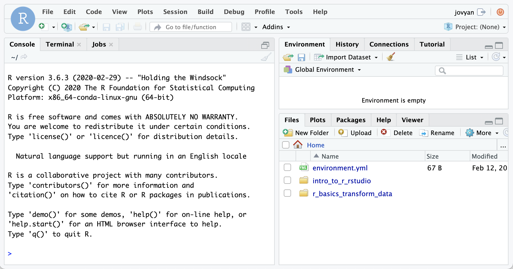<!--
style = "border: 1px solid rgb(var(--color-highlight)); max-width: 800px;"-->


<h3>Option 2: Work on Your Computer</h3>

If you have [R](https://www.r-project.org/) and [RStudio](https://www.rstudio.com/products/rstudio/download/#download) installed already on your local computer, you might be interested in simply downloading our sample code to your computer. Here's how.  Note -- if you've already done this step in another module, you might have the material for this module already!

* In RStudio, open a new project (File, New Project)
* Select Version Control, then Git
* Drop this link into the "Repository URL": https://github.com/arcus/education_r_environment
* Change the "Project directory name" and "Create project as a subdirectory of" boxes to suit your needs (where will this code be stored on your computer?).
* Click to select the "Open in new session" checkbox
* Click "Create Project"
* In the file area to the lower right, you'll see, among multiple choices, the folder called "r\_basics\_transform\_data".  That's the code for this module!

**Want to watch this process?  Click on the image below to play an animated gif.  It will continue to loop and you can re-start it by clicking again.**

<div style="display:none">@gifPreload</div>

<figure>
  

<figcaption style = "font-size: 1em;">Click on the image to play the demo of the above steps!</figcaption>
</figure>

If you already completed this work for a previous module, and it's been a while since you downloaded this project to your computer, you may want to get any new and improved files that have been placed there in the meantime:

* Open your project.
* In the Version Control menu, choose "pull branches".  There are two places to do this, as shown below:

<!-- style = "border: 1px solid rgb(var(--color-highlight)); max-width:400px;" -->  
<!-- style = "border: 1px solid rgb(var(--color-highlight)); max-width:400px;" -->

<div class = "warning">
If you're pulling branches after having worked in other R modules, you might have made local changes (for example, when you filled in exercise code) that will be overwritten by pulling the latest version.  If you want to save your changes, consider making a copy of any exercise files and naming them something new.  For example, if you have already worked in the `r_basics_visualize_data` exercise files, you might want to save your version of `visualize_exercies.Rmd` to `my_visualize_exercises.Rmd`.  That way, you can pull down the latest version of code, overwriting `visualize_exercises.Rmd` while holding on to your changes in the new file.
</div>

### How to Follow Along

You can use this module in a couple of different ways:

* If you have experience working in R markdown and want to try out some of the code we share with you as we go along, please go ahead and open the "r\_basics\_transform\_data" directory, then open `transform_exercises.Rmd` and add some code chunks for your own experimentation.  Or, create a new R Markdown file that begins with reading in the .csv file in the "exercises" directory.
* Not sure you are ready to DIY?  Prefer to learn some concepts first, then do some hands-on work at the end?  Then just follow our steps and we'll guide you through the exercise file when you reach the end of the module.  No need to worry about trying out the code along the way.

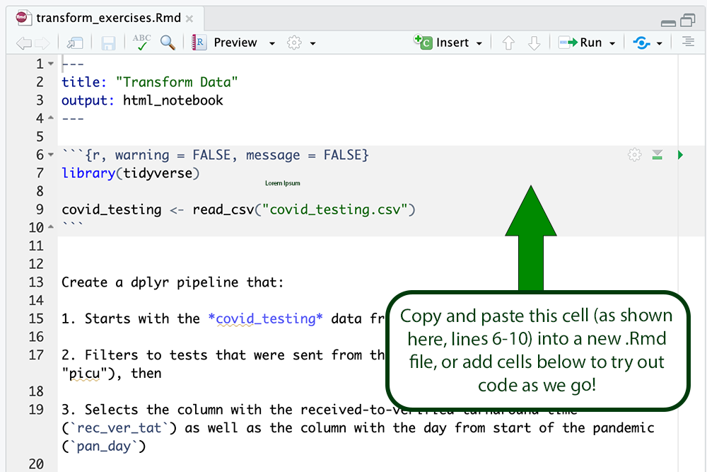<!-- style = "border: 1px solid rgb(var(--color-highlight)); max-width: 800px;" -->

## The `dplyr` Package

<div style = "margin: 1rem; max-width: 75%; float:left;">
`dplyr` (pronounced dee-ply-er, a play on words with "data" and "pliers") is a useful R package we'll discuss.  The various functions we'll use, like `select`, `filter`, and `mutate` are all functions that belong to the `dplyr` package.  In R, we bring in the functionality of a package by using the `library()` command.  Because `dplyr` forms part of the `tidyverse` suite of packages, we can bring in the useful functions of `dplyr` by either using the `library(dplyr)` command or the `library(tidyverse)` command.
</div>
<div style = "margin: 1rem auto; max-width: 20%; float:left;">
</div>

<div class = "warning">
Note -- in the cloud RStudio using Binder, we've already installed `tidyverse`.  But if you're using the course materials in your own computer's installation of RStudio, it's possible you don't have `tidyverse` installed.  If you get a message telling you that there's no package installed with that name, issue this command: `install.packages("tidyverse")`.
</div>


### Subsetting Columns or Rows

Often, you have a large data frame but want to create a graph or analyze data from only a small part of it. The `dplyr` package, part of the larger [tidyverse](https://www.tidyverse.org/) set of packages, works great for this purpose.

Let's look at how you can subset a data frame (choose only certain columns and/or rows) by using `dplyr`.

`dplyr` provides two functions for subsetting data frames: `select()` for subsetting columns, and `filter()` for subsetting rows:

`select()` reshapes data so that it includes only the columns you specify. 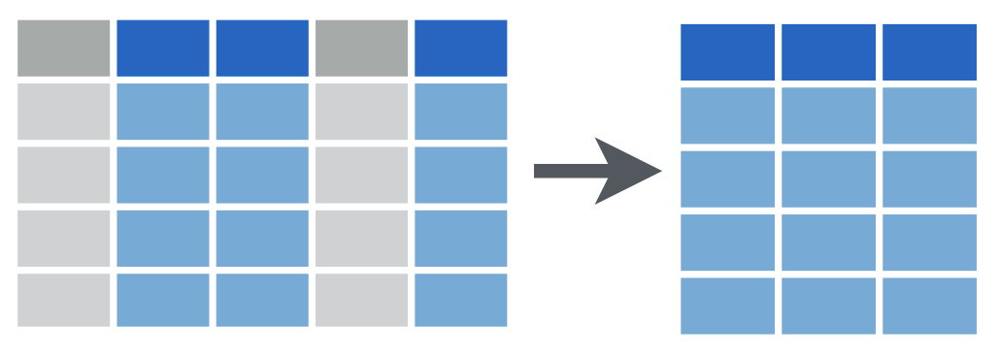<!--
style = "max-width:500px;"-->

`filter()` reshapes data so that it includes only the rows that meet your conditions. 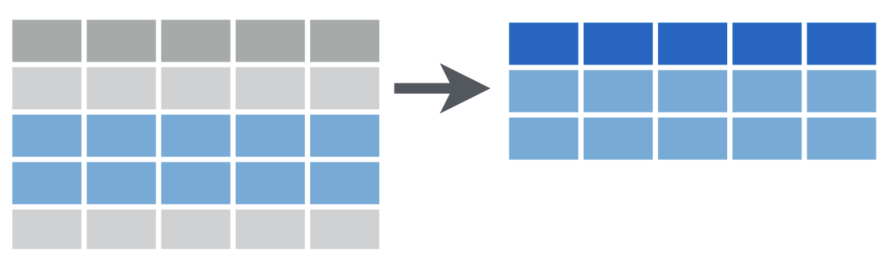<!--
style = "max-width: 600px;"
-->

### Quiz: `dplyr()` Functions

Let's see what you remember about dplyr and its functions (which we've only described briefly so far)

<div class = "question">

Which of the following are true statements about "dplyr"?  Check all that apply!

[[X]] dplyr is part of the tidyverse suite of packages
[[ ]] tidyverse is part of the dplyr suite of packages
[[ ]] dplyr provides a number of functions good for providing data privacy
[[X]] dplyr provides a number of functions good for getting precise subsets of data from a data frame
[[ ]] dplyr includes the function `select()`, which can be used to subset both rows or columns
[[?]] There are multiple correct answers!

<div class = "answer">

The dplyr package is one of several packages that together make up the tidyverse suite of packages, not the other way around. Additionally, dplyr is intended to help with data reshaping -- for example, removing unneeded rows from a data frame, selecting some columns and not others, or creating a new column for a data frame.  It's not a package related to data privacy.  Finally, while dplyr does include the `select()` function, it's not true that `select()` works on both rows and columns.

</div>
</div>


## The `select()` Function

Let's look at `select()` first. The `select()` function extracts **columns** from a data frame, using the column **name(s)** as argument(s).

`select()` takes a data frame as its first argument. After that it takes any number of additional arguments that specify the names of the columns that you want to pick.

We extract columns by name with code that looks like this, and we replace the three dots with the names of the columns we want to keep:

`select(data_frame, ...)`

For example, in the next section we'll unpack the following code:

`select(covid_testing, mrn, last_name)`

### `select()` Example

Let's examine the following code:

`select(covid_testing, mrn, last_name)`

This `select` statement will take the data frame `covid_testing`, and return a new data frame that only has the columns `mrn` and `last_name`, shown here in blue to help you visualize this transformation:

<!--
style = "max-width: 800px;"
-->

An important point to note here is that `select` **will not modify the original data frame** but simply returns the altered data frame you asked for, without saving it automatically.

If you write the `select` statement like this it will simply print out the result in the console or in your R Markdown document. If you want to **capture** the modified data frame you need to **assign** it to a named object.

### Quiz: `select()`

<div class = "question">
Which of the following will select the `first_name` column from the `covid_testing` data frame and capture the result in a data frame named `newdata`?


[( )] A: `newdata = select(first_name, covid_testing)`
[(X)] B: `newdata <- select(covid_testing, first_name)`
[( )] C: `select(newdata, covid_testing, first_name)`
[( )] D: `newdata <- select(covid_testing, First_Name)`
[( )] E: Both B and D

<div class = "answer">

Answer (A) isn't correct, because the first argument that appears inside `select` represents the data frame, and `first_name` is not the name of a data frame.  Also, we notice that instead of an assignment arrow, we see an equals sign.  This isn't wrong *per se*, but it isn't advised.

Answer (B) is correct: it uses the assignment arrow to create a new object called `newdata`, and the data that gets assigned to that object is the correct subset of the data frame called `covid_testing`, namely, a single column called `first_name`.

Answer (C) is not correct, because it does not create a new object, but instead tries to include the name of a new object within the `select` statement.  That won't work!

Answer (D) is a bit of a trick.  It's incorrect because in R, capitalization matters.  It's a "case sensitive" language, and there is no column named "First_Name" with capital letters!

Answer (E) is not correct, because we know (D) is incorrect.

</div>
</div>

## The `filter()` Function

One of the most important `dplyr` functions to know about is `filter()`. `filter()` extracts rows, and it does that based on **logical criteria**, or a **condition** that can be evaluated to be true (keep that row as part of our subset) or false (don't keep that row).

<!--
style = "max-width: 600px;"
-->

Like `select()`, `filter()` takes a data frame as its first argument. The second argument is a condition or logical test. R then performs that logical test on each row of the dataset and returns all rows in which the logical test was true.

To extract rows that meet logical criteria, we write code that looks like this, and we replace the three dots with the condition we want to test for each row:

`filter(data_frame, ...)`

For example, we'll take a look at this code in the next section:
`filter(covid_testing, mrn == 5000083)`

### `filter()` Example

Let's think over:
`filter(covid_testing, mrn == 5000083)`

To give you an example: the logical test here is whether or not the `mrn` value is equal to the 5000083. This is **false** for the first three rows.  In these rows, the `mrn` value is something else.  For the 4th row, however, it is **true** that the `mrn` value is equal to the 5000083.

This filter statement will return a data frame that only contains the 4th row, in which the logical condition is **true**, as shown on the right.

<!--style = "max-width:1000px;"-->

<div class = "warning">
One common issue to be aware of is the difference between the single equals (=) and the double equals (==) operators.

In R, using a single equals sign assigns a value.  It asserts "these things **are** equal."

The double equals sign does not assign, but compares.  It asks "**are** these things equal?".

That's why we use double equals in the context of a logical test that compares the left hand side, e.g. `mrn`, with the right hand side, e.g. 5000083, to check whether or not they are the same.

If you use the wrong kind of equals, you’ll get an error.  This is a very common mistake, and one you're almost guaranteed to accidentally commit at one point or another!  This is what some of those scary errors look like:

<code style = "color:darkred;">
Error: Problem with `filter()` input `..1`.
x Input `..1` is named.
ℹ This usually means that you've used `=` instead of `==`.
</code>

OR

<code style = "color:darkred;">
Error: unexpected '='
</code>

OR

<code style = "color:darkred;">
invalid (do_set) left-hand side to assignment
</code>

</div>

### Logical Operators

Here are some important logical operators to know about. They will all come in handy when you’re filtering rows of a data frame. `x` and `y` each represent expressions, which could be column names or constant values or a combination thereof.

| logical expression | means | example |
| :---: | --- | --- |
| `x < y` | less than | `pan_day < 10` |
| `x > y`| greater than | `mrn > 5001000` |
| `x == y` | equal to | `first_name == last_name` |
| `x <= y` | less than or equal to | `mrn <= 5000000` |
| `x >= y` | greater than or equal to | `pan_day >= 30` |
| `x != y` | not equal to | `test_id != "covid"` |
| `is.na(x)` | a missing value | `is.na(clinic_name)` |
| `!is.na(x)` | not a missing value | `!is.na(pan_day)` |

We've already seen the double equals `==`. Note the less than or and greater than operators. These operators also come as "or equal to" versions.

Use `!=` if you want to select rows in which a value is **not** equal to another value.   

`is.na()` is how you can test for missing values (`NA` in R). This comes in handy when you want to remove missing values from your data, which we'll see later.

### Quiz: `filter()`

<div class = "question">
In the box below, write a `filter()` statement that returns a data frame containing only the rows from `covid_testing` in which the `last_name column` is NOT equal to "stark". Don't capture the returned data frame to assign it to an object.

[[filter(covid_testing, last_name != "stark")]]
[[?]] Hint: We include a space after any comma and on either side of the comparison operator `!=`.  We also aren't assigning the results of this `filter` to a new object.

<div class = "answer">

`filter(covid_testing, last_name != "stark")` is correct:

* it uses the `filter()` command
* it puts the name of the data frame that will be filtered as the first argument, and follows that with a comma
* after the comma, there is a logical condition that can be evaluated to be either true or false.
* within the logical condition, we check whether it's true that the last_name value is not equal to the exact string "stark".


</div>
</div>

<div class = "warning">
When you do a comparison with a literal character string, such as "stark", that string needs to go inside quotes. A character string is anything that's not a number or a logical value such as TRUE and FALSE.  Quotes can be tricky in R, and practice makes perfect.

* 945 is not the same value as "945"
* "TRUE" is not the same as "true", "True" or TRUE
* "00321" is not the same as "321" or 321.

</div>

<div class = "question">
Which of these would successfully filter the `covid_testing` data frame to only tests with positive results?

[( )] A: `filter(covid_testing, result == positive)`
[( )] B: `filter(covid_testing, result = "positive")`
[(X)] C: `filter(covid_testing, result == "positive")`
[( )] D: `filter(covid_testing, positive == "result")`

<div class = "answer">

A is not correct because "positive" is a character string that must appear in quotes (it's not a number or a logical value such as TRUE or FALSE).

B is not correct because you're trying to do a comparison with a single equals.  You need a double equals here to compare!

C is correct.  It includes `filter()`, has the name of a data frame as the first argument, a comma, and a valid comparison.

D is not correct because it flips the positions of the comparison; the column name goes to the left and the comparator on the right.

</div>
</div>

### Filtering a Complex Condition

Often, we want to filter data based on a combination of conditions.  For example, what if you want to preserve rows that meet one or both of the following conditions:

* a male patient seen in the PICU
* a patient seen in "oncology day hosp" in the first 20 days of the pandemic

When we have complex conditions like this, we need to consider how to phrase these conditions using **boolean logic** (also known as **boolean algebra**), which is the system of symbols and rules for interpreting the True/False value of a condition.  Boolean operators include AND (represented as `&` in R), OR (in R, `|`), and NOT (`!`, as we've already seen).  OR here means "at least one of", not "exactly one of".  

Here's a "truth table" to help you understand these operators:

| Operator | Rule | Example |
| --- | --- | --- |
| AND (`&` in R) | True if and only if both sides are True | "Rabbits are mammals AND rabbits are quadrupeds" is True |
| AND (`&` in R) | False if one or both sides are False | "Rabbits are mammals AND rabbits are bipeds" is False |
| OR (`|` in R) | True if at least one side is True | "Rabbits are reptiles OR rabbits are quadrupeds" is True |
| OR (`|` in R) | False if and only if both sides are False | "Rabbits are reptiles OR rabbits are bipeds" is False |
| NOT (`!` in R) | Turns True into False and False into True | ! "Rabbits are reptiles" is True, ! "Rabbits are mammals" is False |


We also have to consider using parenthesis to ensure the proper order of operations.  The order of operations for boolean algebra, from highest to lowest priority is NOT, then AND, then OR.  Forgetting to account for order of operations is a common mistake by novice users of boolean logic.

Let's go step by step.  First, let's convert each of our two conditions to code:

* `gender == "male" & clinic_name == "picu"`  (Both must be true, so we use AND)
* `clinic_name == "oncology day hosp" & pan_day <= 20` (Both must be true, so we use AND)

Since each of our bullet points above contain internal boolean logic, let's encapsulate them in parentheses.  

* `(gender == "male" & clinic_name == "picu")`  Now this is treated as a single unit which can be True, False, or NA.
* `(clinic_name == "oncology day hosp" & pan_day <= 20)` Now this is treated as a single unit which can be  True, False, or NA.

Since we need either one but not both of the bulleted conditions to be true, we'll conjoin them using OR:

`(gender == "male" & clinic_name == "picu") | (clinic_name == "oncology day hosp" & pan_day <= 20)`

Now we have a filter condition we can use!  If you're working in the code, try this:

```
filter(covid_testing,
  (gender == "male" & clinic_name == "picu") |
  (clinic_name == "oncology day hosp" & pan_day <= 20))
```

We added whitespace (carriage returns and indentation) above to make this a bit more readable, but you don't have to.

<div class = "warning">
What happens if you don't use parentheses to create smaller units in your boolean logic?  As long as you're using all OR or all AND, you won't run into problems.

For example, `filter(covid_testing, clinic_name == "clinical lab" & results == negative & last_name == "frey")` works as you might think... it gives you back rows of testing results (if there are any) which meet all three conditions.

Similarly, `filter(covid_testing, clinic_name == "clinical lab" | results == negative | last_name == "frey")` will give you back rows where at least one of the conditions were met.

But when you **mix** AND and OR, or need to add a NOT to a combination of conditions, mistakes can happen when **your** interpretation of the logic differs from the **computer's** interpretation of the logic, based on the order of operations in boolean logic.  And often, a mix of AND, OR, and NOT is exactly what we want to do.  

Let's consider the case where you're interested in test results for males from the PICU or ED.

We could write this in pseudocode (not true code, but a way of sketching out code ideas briefly) as "gender:male AND clinic:PICU OR clinic:ED".

But we aren't done yet!  We need to consider whether we need to add parentheses.  Without parenthesis, we follow the order of operations standard in boolean logic: AND is evaluated before OR.

That means that without any added parentheses, we would **really** be asking for "(gender:male AND clinic:PICU) OR clinic:ED".  In other words, I want rows that are either "males seen in the PICU" or "anyone seen in the ED".  Is that actually what I want to ask for?  No!  We need to add a set of parentheses around the "this OR that" clause, giving us "gender:male AND (clinic:PICU OR clinic:ED)".  

Without adding our helpful parentheses, non-male patients could be included, if their test was sourced from the ED.

To see what this code would look like, consider these two filter operations, which differ only by the addition of parentheses.  First, let's do our search without adding parentheses around the "or" clause.  We end up with almost 3600 rows:

``` r
> filter(covid_testing, gender == "male" & clinic_name == "picu" | clinic_name == "emergency dept")
# A tibble: 3,563 × 17
       mrn first_name last_name gender pan_day test_id clinic_name result demo_group   age drive_thru_ind ct_value
     <dbl> <chr>      <chr>     <chr>    <dbl> <chr>   <chr>       <chr>  <chr>      <dbl>          <dbl>    <dbl>
 1 5008967 rolley     karstark  male         8 covid   emergency … negat… patient      0.8              0       45
 2 5002158 ravella    frey      female       9 covid   emergency … negat… patient      0                0       45
 3 5004930 sarra      frey      female      10 covid   emergency … negat… patient      0.9              0       45
 4 5002083 weasel     tarly     female      10 covid   emergency … negat… patient     18                1       45
 5 5010468 chella     mormont   female      10 covid   emergency … negat… patient      0                0       45
 6 5000227 maege      sand      female      11 covid   emergency … negat… patient      0.9              0       45
 7 5002983 ronnel     snow      male        11 covid   emergency … negat… patient     18                0       45
 8 5006569 lanna      baelish   female      11 covid   emergency … negat… patient      1                0       45
 9 5004088 lennocks   greyjoy   male        11 covid   picu        negat… patient      4                1       45
10 5008165 arianne    clegane   female      11 covid   emergency … negat… patient      1                0       45
# … with 3,553 more rows, and 5 more variables: orderset <dbl>, payor_group <chr>, patient_class <chr>,
#   col_rec_tat <dbl>, rec_ver_tat <dbl>
```

And for comparison, let's add parentheses around the OR clause to accurately capture our true intent.  We get only around 1800 rows!  That's a big difference.

``` r
> filter(covid_testing, gender == "male" & (clinic_name == "picu" | clinic_name == "emergency dept"))
# A tibble: 1,820 × 17
       mrn first_name last_name gender pan_day test_id clinic_name result demo_group   age drive_thru_ind ct_value
     <dbl> <chr>      <chr>     <chr>    <dbl> <chr>   <chr>       <chr>  <chr>      <dbl>          <dbl>    <dbl>
 1 5008967 rolley     karstark  male         8 covid   emergency … negat… patient      0.8              0     45  
 2 5002983 ronnel     snow      male        11 covid   emergency … negat… patient     18                0     45  
 3 5004088 lennocks   greyjoy   male        11 covid   picu        negat… patient      4                1     45  
 4 5008878 hullen     stark     male        11 covid   emergency … negat… patient      1                0     45  
 5 5004652 woth       martell   male        11 covid   emergency … negat… patient     18                1     45  
 6 5010986 brenett    karstark  male        11 covid   emergency … negat… patient     18                0     45  
 7 5011560 ulwyck     stark     male        11 covid   emergency … negat… patient      1                0     45  
 8 5000140 walton     kettlebl… male        11 covid   emergency … negat… patient     13                0     45  
 9 5000902 owen       seaworth  male        12 covid   emergency … posit… patient      0.1              0     33.0
10 5002573 glendon    lannister male        12 covid   emergency … posit… patient     18                0     31.2
# … with 1,810 more rows, and 5 more variables: orderset <dbl>, payor_group <chr>, patient_class <chr>,
#   col_rec_tat <dbl>, rec_ver_tat <dbl>
```

</div>

## The "Pipe" Operator (`%>%`)

One of the most powerful concepts in the `tidyverse` suite of packages is the pipe operator, which is written as percent, greater than, percent (`%>%`).  

The pipe operator passes the **object on its left** as the **first argument** to the **function on its right**.

Here's a drawing of what that looks like:

<!--
style = "max-width:600px;"-->


Here, for example, the pipe operator takes the object on its left, here the `covid_testing` data frame, and inserts it as the first argument of the function on its right ... in our case, the `filter()` function.

That means that this statement:

`covid_testing %>% filter(pan_day <= 10)`

is equivalent to:

`filter(covid_testing, pan_day <= 10)`

Those two lines of code are equivalent. In both cases we're taking the `covid_testing` data frame, passing it as the first argument to the `filter()` function, and adding a condition that we're filtering by.  In our case that condition is `pan_day` less than or equal to 10.

**Why would we use this way of typing our commands?**  Are we complicating matters?  No, as you're about to see, this is a very useful way of writing out the changes you make on a data frame in the order you want them to take place.

### Why Use the "Pipe" (`%>%`)

Here's why the pipe (`%>%`) is so useful.

"Tidy" functions like `select()`, `filter()`, and others we'll see later always have as first argument a data frame, and they always return a data frame as well.  Data frame in, data frame out.

This makes it possible to create a pipeline in which a data frame object is handed from one `dplyr` function to the next.  The data frame result of step 1 becomes the data frame starting point for step 2, then the result of step 2 becomes the starting point for step 3, and so on.

For example, here we start with `covid_testing`, then `select` the `last_name` and `result` columns, then `filter` to get rows where `result` is equal to "positive".

```
covid_testing %>%
  select(last_name, result) %>%
  filter(result == "positive")
```

<div class = "options">
You might wonder why we've put each step in its own line.  Is this a requirement?  No, it's not.  Many R users like to use **whitespace** (new lines, tabs, spaces, indents) to make their code more human readable.  But these two code snippets work exactly the same way:

**Option 1, Lots of Whitespace**

```
covid_testing %>%
  select(last_name, result) %>%
  filter(result == "positive")
```

**Option 2, No Whitespace at All**

```
covid_testing%>%select(last_name,result)%>%filter(result=="positive")
```

How you use whitespace is totally up to you, but we suggest that in a pipeline (steps in data transformation that are separated by `%>%`), each step appear in its own line, indented below the first step.

</div>

By connecting logical steps, you can get a **pipeline** of data analysis steps which are concise and also fairly human readable.  You can think of the `%>%` symbol as "then...", describing the steps in order.

This approach to coding is powerful because it makes it much easier for someone who doesn't know R well to read and understand your code as a series of instructions.   

### Quiz: `%>%`

<div class = "question">
In the box below, rewrite the following statement with a pipe:

`select(mydata, first_name, last_name)`

[[mydata %>% select(first_name, last_name)]]
[[?]] Hint: We include a space after any comma and on either side of the pipe `%>%`.  We also aren't assigning the results of this `select` to a new object.

<div class = "answer">

`mydata %>% select(first_name, last_name)` is correct because:

* It uses the pipe operator `%>%`
* To the left of the pipe, there is the name of a data frame, in this case `mydata`.
* To the right of the pipe, there is a `select()` function that includes additional arguments giving the names of the columns we want to keep.

</div>
</div>

## The `mutate()` Function

`mutate()` is an extremely useful `dplyr` function, and you can use it to make new variables / columns.  That's what we'll use it for here.  You can also use `mutate()` to change existing columns (say, turn an entire column lowercase or round or scale a numeric value).  

Like all `dplyr` functions, `mutate()` takes a data frame as its first argument. After that, you tell it what to name the new column and what should be in it. This is done using **name-value expressions**.

In **name-value expression**, you have:

* a name
* an equals sign (`=`), and
* a value

The **name** is the name of the new column that you'd like to create.

Then you have a **single equals sign** - because you're assigning a value (`=`), you're not asking whether two things are equal (`==`).

Then you have **value**. This can be a constant, e.g. 100, or a calculation that involves data from already existing columns.

This is what it looks like:

`mutate(data_frame, name = value)`

### `mutate()` Example

For example, let's take a look at one of the columns of `covid_testing` that we haven't looked at yet in this module: `col_rec_tat`.

This column contains the specimen collection ("col") to received-in-lab ("rec") turn around time ("tat"), in hours. Let's create a new column, that contains the same data, but in minutes instead of hours.

To do so, you write `mutate(covid_testing,` followed by a name-value expression. The left part is the new column name, which we could choose to be `col_rec_tat_mins`. Then we have a single equals sign. Then the calculation, which is `col_rec_tat` times 60.

```
mutate(covid_testing,
     col_rec_tat_mins = col_rec_tat * 60)
```

Upon executing the code, `mutate()` creates the new column and fills each row with the result of the calculation:

<!-- style = "max-width: 800px;" -->

If, on the other hand, you wanted to change an **existing** column using `mutate()`, you could do it like this.  This command takes the column ct_value, which currently holds decimal values, rounds it to the nearest whole number, and then uses that as the new set of values for ct_value.

```
mutate(covid_testing,
     ct_value = round(ct_value))
```

### Quiz: `mutate()`

<div class = "question">

Which of the following can you accomplish with `mutate()`?

[[X]] create a new column that uses existing data to calculate the new column's value
[[X]] create a new column that is uniform (has the same value for each row)
[[X]] change an existing column from mixed case to all lower case
[[X]] change an existing column from a decimal value to an integer value
[[ ]] transpose a data frame, so that rows become columns and columns become rows
[[?]] There are multiple correct answers!

<div class = "answer">

`mutate()` works well as a method for altering existing columns (for instance, changing the case of a string field to all lower case or all upper case, or rounding numbers).  It's also useful for creating new columns.  You can use existing columns to create a new column, based on some calculation (say, if you want to add two columns to create the new column) or entirely new data (such as adding a new column, "hospital_name" that says "city general" for every row).

</div>
</div>


## Exercises

<h3>A Setup Reminder</h3>

If you're already set up in RStudio with the materials for this course (we had some instructions early on), you can skip this page and go ahead to the next!

If you haven't yet started to work in the files for this module, please read over both options below before choosing one to continue with.

<h3>Option 1: Work in the Cloud</h3>

This might work well for you if you don't want to, or can't, install R and RStudio on your computer.  The benefit is that you don't have to install anything, but one negative is that this option requires a bit of waiting for your environment to come online.

**First**, we need to create a small container in the cloud for you to work in just using your web browser.  **Click "Launch binder" below.**  It might take a while (5 minutes) to create, depending on how recently it was created (when it's being used more, it's quicker!).  We're looking for a faster way to get you off and running in RStudio without downloads and without creating accounts, but for now this is a great, free way for us to get you working with no extra work on your part.

<a href = "https://mybinder.org/v2/gh/arcus/education_r_environment/main?urlpath=rstudio" target = "_blank">

**← Click to launch binder**

</a>

<div class = "hint" style = "align-items: center; display: flex;">

<div style = "margin: 1rem; max-width: 45%; float:left;"> If you're the first person to fire up this environment in a while, you might see this loading screen for up to five minutes.  Be patient!</div>
<div style = "margin: 1rem auto; max-width: 45%; float:left;"> <!--
style = "border: 1px solid rgb(var(--color-highlight));"-->
</div>
</div>

**Then**, once you have access to RStudio and you see something like the image below, you'll need to open the sample data for this course.  In the file area to the lower right, you'll see, among multiple choices, the folder called "r\_basics\_transform\_data".  That's the code for this module!

<!--
style = "border: 1px solid rgb(var(--color-highlight)); max-width: 800px;"-->


<h3>Option 2: Work on Your Computer</h3>

If you have [R](https://www.r-project.org/) and [RStudio](https://www.rstudio.com/products/rstudio/download/#download) installed already on your local computer, you might be interested in simply downloading our sample code to your computer. Here's how.  Note -- if you've already done this step in another module, you might have the material for this module already!

* In RStudio, open a new project (File, New Project)
* Select Version Control, then Git
* Drop this link into the "Repository URL": https://github.com/arcus/education_r_environment
* Change the "Project directory name" and "Create project as a subdirectory of" boxes to suit your needs (where will this code be stored on your computer?).
* Click to select the "Open in new session" checkbox
* Click "Create Project"
* In the file area to the lower right, you'll see, among multiple choices, the folder called "r\_basics\_transform\_data".  That's the code for this module!

**Want to watch this process?  Click on the image below to play an animated gif.  It will continue to loop and you can re-start it by clicking again.**

<div style="display:none">@gifPreload</div>

<figure>
  

<figcaption style = "font-size: 1em;">Click on the image to play the demo of the above steps!</figcaption>
</figure>

If you already completed this work for a previous module, and it's been a while since you downloaded this project to your computer, you may want to get any new and improved files that have been placed there in the meantime:

* Open your project.
* In the Version Control menu, choose "pull branches".  There are two places to do this, as shown below:

<!-- style = "border: 1px solid rgb(var(--color-highlight))" -->  <!-- style = "border: 1px solid rgb(var(--color-highlight))" -->

### Work On Data Transformation

Within the `r_basics_transform_data` folder, please open `transform_exercises.Rmd` to work through the exercises.  You'll see something like the below.

<!-- style = "max-width: 800px; border: 1px solid rgb(var(--color-highlight))" -->

To work in this file:

(1) Run the first code chunk by clicking the green "play" button (look at line 6).  This gives you the data frame with fake Covid testing data, the data we've been using for our instruction in this module so far.

(2) For each of the three code chunks below the first one, please read the instructions before the code chunk and then add the right code to the code chunk to make it work.

When you've done the best you can on your own, go to the next page, where we'll discuss the solutions.

<div class = "warning">
Note -- in the cloud RStudio using Binder, we've already installed `tidyverse`.  But if you're using the course materials in your own computer's installation of RStudio, it's possible you don't have `tidyverse` installed.  If you get a message telling you that there's no package installed with that name, issue this command: `install.packages("tidyverse")`.
</div>

### Solutions for Data Transformation

You can find the solution file in the "r\_basics\_transform\_data" directory.  Simply open `transform_solutions.Rmd` in that folder to see the answers.  

In the first task, you were asked to create a dplyr pipeline:

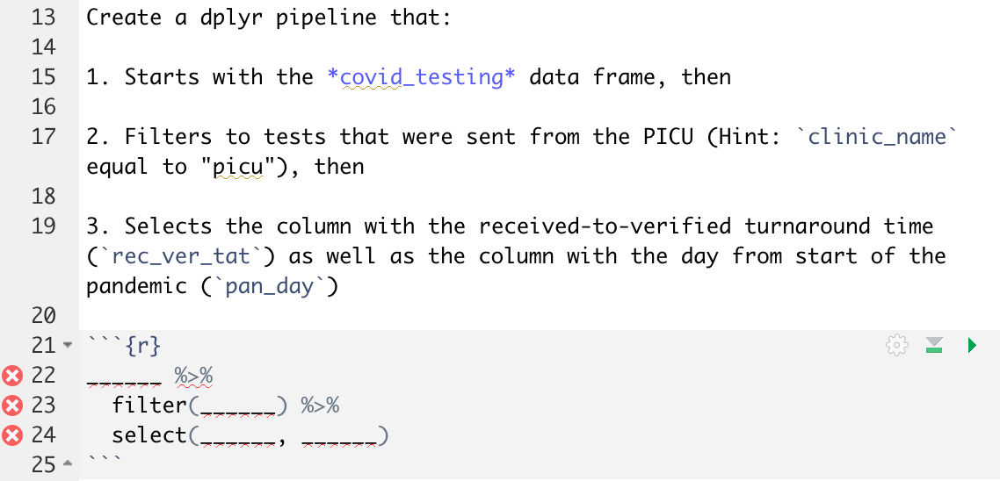<!-- style = "max-width: 400px; border: 1px solid rgb(var(--color-highlight))" -->

Here's the solution that should go inside that code block.  We start with `covid_testing` in the first line, then we apply a filter in the second line (making sure to use that double equals sign).  Finally, we finish our pipeline by using select to just give us the columns we're interested in.

``` r
covid_testing %>%
  filter(clinic_name == "picu") %>%
  select(rec_ver_tat, pan_day)
```

In the next task, you were asked to try using mutate:

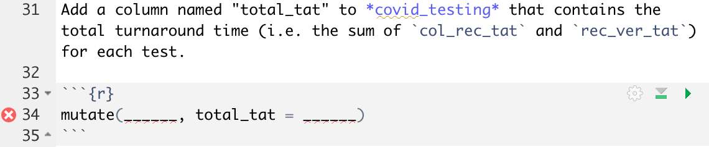<!-- style = "max-width: 400px; border: 1px solid rgb(var(--color-highlight))" -->

Here's the solution that should go inside that code block.  We begin the `mutate` statement with our first argument being the data frame we want to see altered, in our case `covid_testing`.  We then use a single equal to set a new value, `total_tat`, which is set equal to the sum of `col_rec_tat` and `rec_ver_tat`.

```r
mutate(covid_testing, total_tat = col_rec_tat + rec_ver_tat)

```

Finally, we asked you to change that last code you just wrote:

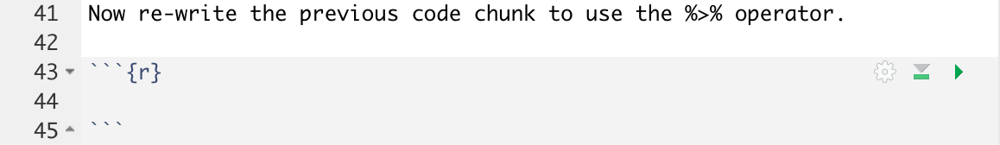<!-- style = "max-width: 400px; border: 1px solid rgb(var(--color-highlight))" -->


And here's that last solution!  It does the same thing as the second bit of code, but in a different (and some would argue, more useful, format).

```
covid_testing %>%
  mutate(total_tat = col_rec_tat + rec_ver_tat)
```


## More `dplyr` functions

We’ve only scratched the surface of data transformation functions in dplyr. Other important ones include:

| function | graphic |
| :---: | --- |
| `arrange()`, which sorts a data frame (for example, alphabetically by `last_name`) | 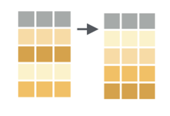<!-- style = "max-width:200px;" -->  |
| `add_row()`, which adds rows to a data frame | 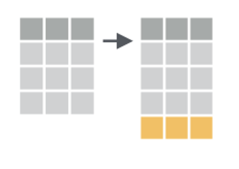<!-- style = "max-width:200px;" -->  |
| `group_by()` and `summarize()`, which allow you to create data summaries such as means, medians, sums, etc.| 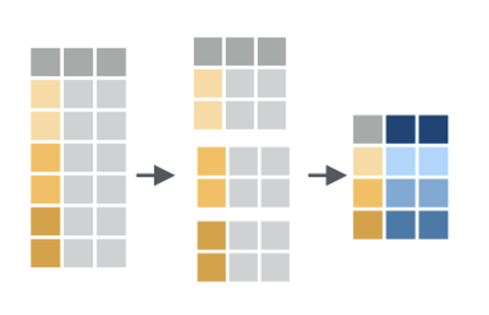<!-- style = "max-width:200px;" -->  |
| `bind_cols()` and `bind_rows()`, which allow you to combine data frames by row or column| 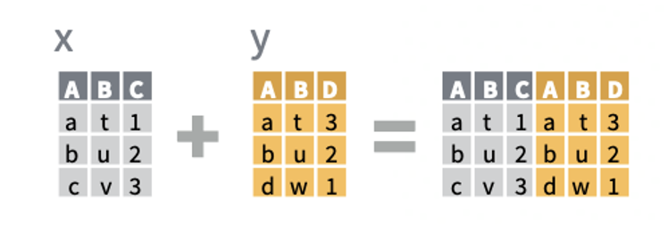<!-- style = "max-width:200px;" -->  |
| `_join()` functions including `left_join()` that combine data frames by looking up matching values from one table in another | 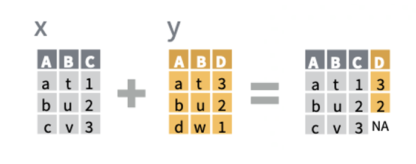<!-- style = "max-width:200px;" -->  |

<div class = "options">
You may notice here and elsewhere that we include international English spellings (e.g. `summarise()`) for some functions.  "American" spellings (`summarize()`) also work, and both spellings trigger the same function.  Feel free to use either.
</div>


## Recap

To recap, `dplyr` is a package you can load in R that provides a grammar for transforming data frames. Some of the key `dplyr` functions are:

| function | graphic |
| :---: | --- |
| `select()`, which subsets columns by name | <!-- style = "max-width:200px;" --> |
| `filter()`, which subsets rows by a logical condition | 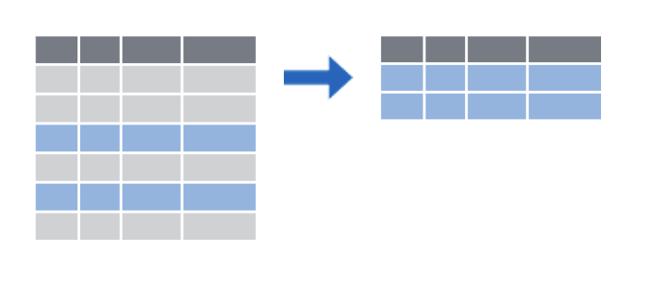<!-- style = "max-width:200px;" -->  |
| `mutate()`, which creates new calculated columns or changes existing columns | <!-- style = "max-width:200px;" -->  |

Additionally, `dplyr` and other `tidyverse` packages make use of the pipe operator (`%>%`), which can be used to string together `dplyr` functions into a pipeline that performs several transformations.

Other `dplyr` functions include `arrange()`, `add_row()`, `group_by()` (especially helpful when combined with `summarize()`), `bind_cols()` and `bind_rows()`, and `_join()` functions.

## Additional Resources

<h3>`dplyr` Cheatsheet</h3>

RStudio creates and distributes a number of cheatsheets for various purposes.  You can find them by clicking in the **Help menu** in RStudio -- try that now!  Here's a screenshot of the `dplyr` cheatsheet:

<!-- style = "max-width: 600px; border: 1px solid rgb(var(--color-highlight))" -->

Note that in this cheatsheet they refer to "cases" to mean rows or observations and "variables" to mean columns.

You can also find cheatsheets [on the RStudio website](https://www.rstudio.com/resources/cheatsheets/).

### Beyond `dplyr`

Beyond dplyr, there are a number of other [`tidyverse`](https://www.tidyverse.org/) packages that provide powerful tools for data transformation:

* `tidyr` provides functions that allow you to convert messy data frames into tidy ones
* `lubridate` provides functions to manipulate times and dates
* `stringr` provides tools for manipulating text strings
* `purrr` offers advanced functionality to automate complex data transformations
* `dbplyr` allows you to interact with a table inside a database as if it were a data frame

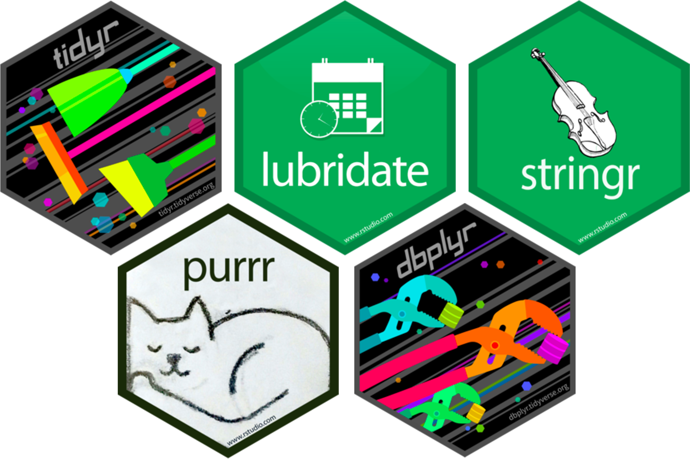<!-- style = "max-width:600px;" -->  

## Feedback

In the beginning, we stated some goals.

**Learning Objectives:**

@learning_objectives

We ask you to fill out a brief (5 minutes or less) survey to let us know:

* If we achieved the learning objectives
* If the module difficulty was appropriate
* If we gave you the experience you expected

We gather this information in order to iteratively improve our work.  Thank you in advance for filling out [our brief survey](https://redcap.chop.edu/surveys/?s=KHTXCXJJ93&module_name=%22R+Basics+Transform+Data%22)!

Material for this module was adapted, with permission, from [Stephan Kadauke's R for Clinical Data workshop materials](https://skadauke.github.io/intro-to-r-for-clinicians-chop/).  We owe special thanks to Dr. Kadauke as well as the R User Group at Children's Hospital of Philadelphia for their generosity in sharing these materials.
