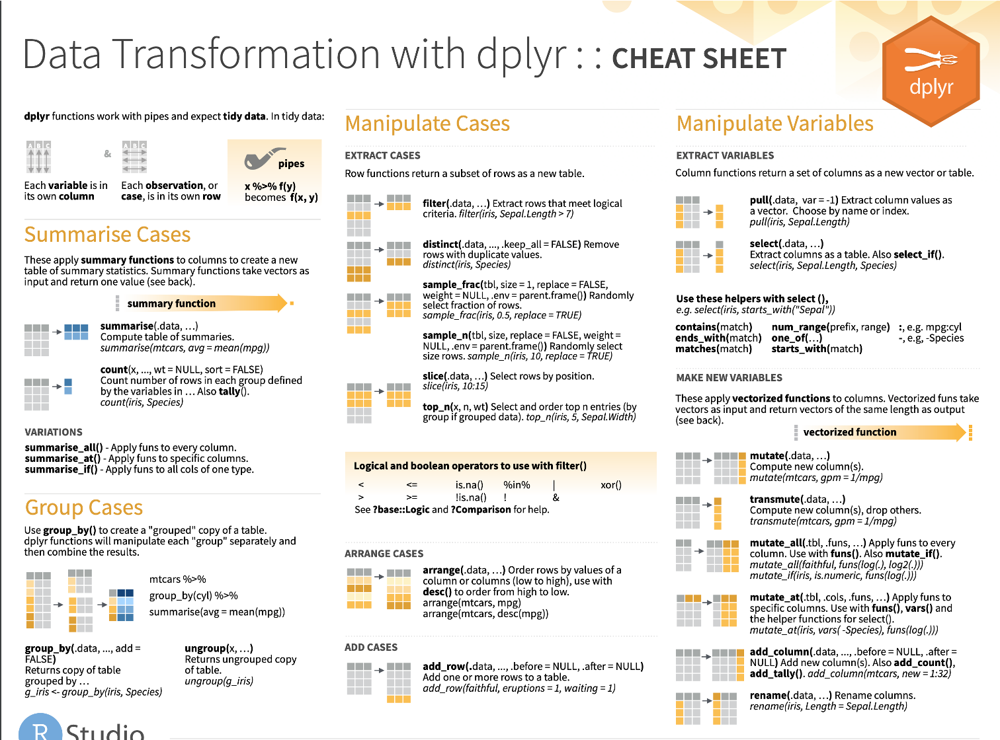

<!--
author:   Joy Payton
email:    paytonk@chop.edu
version:  1.1
language: en
narrator: US English Female
title: R Basics: Transforming Data With dplyr
comment:  Learn how to transform (or wrangle) data using R's `dplyr` package.
long_description: Do you want to learn how to work with tabular (table-shaped, with rows and columns) data in R?  In this module you'll learn in particular how to select just the rows and columns you want to work with, how to create new columns, and how to create multi-step transformations to get your data ready for visualization or statistical analysis.  This module teaches the use of the `dplyr` package, which is part of the `tidyverse` suite of packages.

@learning_objectives  

After completion of this module, learners will be able to:

- Write R code that uses the `dplyr` package to select only desired columns from a data frame
- Write R code that uses the `dplyr` package to filter only rows that meet a certain condition from a data frame
- Write R code that uses the `dplyr` package to create a new column in a data frame
- Use the "pipe" syntax to link a series of transformations in a "pipeline" that performs desired changes to a data frame

@end
script:  https://code.jquery.com/jquery-3.6.0.slim.min.js

@gifPreload
<script>
(function($) {

  // Get the .gif images from the "data-alt".
	var getGif = function() {
		var gif = [];
		$('img').each(function() {
			var data = $(this).data('alt');
			gif.push(data);
		});
		return gif;
	}

	var gif = getGif();

	// Preload all the gif images.
	var image = [];

	$.each(gif, function(index) {
		image[index]     = new Image();
		image[index].src = gif[index];
	});

	// Change the image to .gif when clicked and vice versa.
	$('figure').on('click', function() {

		var $this   = $(this),
				$index  = $this.index(),

				$img    = $this.children('img'),
				$imgSrc = $img.attr('src'),
				$imgAlt = $img.attr('data-alt'),
				$imgExt = $imgAlt.split('.');

		if($imgExt[1] === 'gif') {
			$img.attr('src', $img.data('alt')).attr('data-alt', $imgSrc);
		} else {
			$img.attr('src', $imgAlt).attr('data-alt', $img.data('alt'));
		}

		// Add play class to help with the styling.
		$this.toggleClass('play');

	});

})(jQuery);
</script>
@end

link:  https://chop-dbhi-arcus-education-website-assets.s3.amazonaws.com/css/styles.css

-->
# R Basics: Transforming Data With dplyr

<div class = "overview">

## Overview

@comment

**Is this module right for me?** @long_description

**Estimated time to completion:** 1 hour

**Pre-requisites**

Some experience of using the RStudio IDE and writing R code is necessary to understand and use this material.  If you do not have this experience, consider

* [R and RStudio: tools and vocabulary](https://education.arcus.chop.edu)
* [R Basics: Visualizing Data](https://education.arcus.chop.edu)

**Learning Objectives**

@learning_objectives

</div>

## Lesson Preparation: Our Data

The data we will use in this module is a data frame called `covid_testing`, which consists of fabricated (completely fake) demographic and testing data for Covid tests early in the Covid-19 pandemic.

This is what that data looks like:


You will be asked to do some code-based exercises at the **end** of this module, but you may find it useful to use the sample code and data throughout the module.

On the next page, you'll learn how to get access to the sample code.  

## Lesson Preparation: Our RStudio Environment

<h3>Option 1: Work in the Cloud</h3>

**First**, we need to create a small container in the cloud for you to work in just using your web browser.  Click "Launch binder" below.  It might take a while (5 minutes) to create, depending on how recently it was created (when it's being used more, it's quicker!).  We're looking for a faster way to get you off and running in RStudio without downloads and without creating accounts, but for now this is a great, free way for us to get you working with no extra work on your part.

  <a href = "https://mybinder.org/v2/gh/arcus/education_r_environment/main?urlpath=rstudio" target = "_blank"></a> **← Click the "launch binder" button!**

**Then**, once you have access to RStudio and you see something like the image below, you'll need to open the sample data for this course.  In the file area to the lower right, click on the folder called "R Basics: Transforming Data".

<h3>Option 2: Work on Your Computer</h3>

If you have [R](https://www.r-project.org/) and [RStudio](https://www.rstudio.com/products/rstudio/download/#download) installed already on your local computer, you might be interested in simply downloading our sample code to your computer. Here's how.

* In RStudio, open a new project (File > New Project)
* Select Version Control, then Git
* Drop this link into the "Repository URL": https://github.com/arcus/education_r_environment
* Change the "Project directory name" and "Create project as a subdirectory of" boxes to suit your needs (where will this code be stored on your computer?).
* Click to select the "Open in new session" checkbox
* Click "Create Project"

**Want to watch this process?  Click on the image below to play an animated gif.**

<div style="display:none">@gifPreload</div>

<figure>
  

<figcaption>Click on the image to play the demo of the above steps!</figcaption>
</figure>


## The `dplyr` Package


`dplyr` (pronounced dee-ply-er, a play on words with "data" and "pliers") is a useful R package we'll discuss.

## Subsetting Columns or Rows

Often, you have a large data frame but only want to create a graph or analyze data from only a small part of it. The `dplyr` package, part of the larger `[tidyverse](https://www.tidyverse.org/)` set of packages, works great for this purpose.

Let's look at how you can subset a data frame (choose only certain columns and/or rows) by using `dplyr`.

`dplyr` provides two functions for subsetting data frames: `select()` for subsetting columns, and `filter()` for subsetting rows:

`select()` reshapes data so that it includes only the columns you specify. 

`filter()` reshapes data so that it includes only the rows that meet your conditions. 

## The `select()` Function

Let's look at `select()` first. Select extracts columns from a data frame, using the column **name**.

`select()` takes a data frame as its first argument. After that it takes any number of additional arguments that specify the names of the columns that you want to pick.

We extract columns by name with code that looks like this, and we replace the three dots with the names of the columns we want to keep:

`select(data_frame, ...)`

## `select()` Example

For example, take the following code:

`select(covid_testing, mrn, last_name)`

This `select` statement will take the data frame `covid_testing`, and return a new data frame that only has the columns `mrn` and `last_name`, shown here in blue to help you visualize this transformation:


An important point to note here is that `select` **will not modify the original data frame**.

If you write the `select` statement like this it will simply print out the result in the console or in your R Markdown document. If you want to *capture* the modified data frame you need to assign it to a named object.

<div class = "question">
Which of the following will select the `first_name` column from the `covid_testing` data frame and capture the result in a data frame named `newdata`?


[( )] A: `newdata = select(first_name, covid_testing)`
[(X)] B: `newdata <- select(covid_testing, first_name)`
[( )] C: `select(newdata, covid_testing, first_name)`
[( )] D: `newdata <- select(covid_testing, First_Name)`
[( )] E: Both B and D

<div class = "answer">
<details><summary>Click to see an explanation of the answer.</summary>

Answer (A) isn't correct, because the first argument that appears inside `select` represents the data frame, and `first_name` is not the name of a data frame.  Also, we notice that instead of an assignment arrow, we see an equals sign.  This isn't wrong *per se*, but it isn't advised.

Answer (B) is correct: it uses the assignment arrow to create a new object called `newdata`, and the data that gets assigned to that object is the correct subset of the data frame called `covid_testing`, namely, a single column called `first_name`.

Answer (C) is not correct, because it does not create a new object, but instead tries to include the name of a new object within the `select` statement.  That won't work!

Answer (D) is a bit of a trick.  It's incorrect because in R, capitalization matters.  It's a "case sensitive" language, and there is no column named "First_Name" with capital letters!

Answer (E) is not correct, because we know (D) is incorrect.
</details>
</div>
</div>

## The `filter()` Function

One of the most important `dplyr` functions to know about is `filter()`. `filter()` extracts rows, and it does that based on **logical criteria**, or a **condition** that can be evaluated to be true (keep that row as part of our subset) or false (don't keep that row).

Like `select()`, `filter()` takes a data frame as its first argument. The second argument is a condition or logical test. R then performs that logical test on each row of the dataset and returns all rows in which the logical test was true.

To extract rows that meet logical criteria, we write code that looks like this, and we replace the three dots with the condition we want to test for each row:

`filter(data_frame, condition)`

## `filter()` Example

To give you an example: the logical test here is whether or not the `mrn` value is equal to the 5000083. This is **false** for the first three rows.  In these rows, the `mrn` value is something else.  For the 4th row, however, it is **true** that the `mrn` value is equal to the 5000083.

This filter statement will return a data frame that only contains the 4th row, in which the logical condition is **true**, as shown on the right.


<div class = "warning">
One common issue to be aware of is the difference between the single equals (=) and the double equals (==) operators.

In R, using a single equals sign assigns a value.  It asserts "these things **are** equal."

The double equals sign does not assign, but compares.  It asks "**are** these things equal?".

That's why we use double equals in the context of a logical test that compares the left hand side, e.g. `mrn`, with the right hand side, e.g. 5000083, to check whether or not they are the same.

If you use the wrong kind of equals, you’ll get an error.  This is a very common mistake, and one you're almost guaranteed to accidentally commit at one point or another!
</div>

## Logical Operators

Here are some important logical operators to know about. They will all come in handy when you’re filtering rows of a data frame. `x` and `y` each represent expressions, which could be column names or constant values or a combination thereof.

|---|---|---|
|logical expression | means | example
|x < y |less than| pan_day < 10
|x > y|greater than| mrn > 5001000
|x == y|equal to| first_name == last_name
|x <= y|less than or equal to| mrn <= 5000000
|x >= y|greater than or equal to| pan_day >= 30
|x != y|not equal to| test_id != "covid"
|is.na(x)|a missing value| is.na(clinic_name)


We've already seen the double equals `==`. Note the less than or and greater than operators. These operators also come as "or equal to" versions.

Use `!=` if you want to select rows in which a value is **not** equal to another value.   

`is.na()` is how you can test for missing values (`NA` in R). This comes in handy when you want to remove missing values from your data, which we’ll see later.

<div class = "question">
Write a `filter()` statement that returns a data frame containing only the rows from `covid_testing` in which the `last_name column` is NOT equal to "stark". Don't capture the returned data frame to assign it to an object.

[[filter(covid_testing, last_name != "stark")]]
[[?]] Hint: We include a space after any comma and on either side of the comparison operator `!=`.  We also aren't assigning the results of this `filter` to a new object.

<div class = "answer">
<details><summary>Click to see an explanation of the answer.</summary>

`filter(covid_testing, last_name != "stark")` is correct:

* it uses the `filter()` command
* it puts the name of the data frame that will be filtered as the first argument, and follows that with a comma
* after the comma, there is a logical condition that can be evaluated to be either true or false.
* within the logical condition, we check whether it's true that the last_name value is not equal to the exact string "stark".

</details>
</div>
</div>

<div class = "warning">
When you do a comparison with a literal character string, such as "stark", that string needs to go inside quotes. A character string is anything that's not a number or a logical value such as TRUE and FALSE.  Quotes can be tricky in R, and practice makes perfect.

* 945 is not the same value as "945"
* "TRUE" is not the same as "true", "True" or TRUE
* "00321" is not the same as "321" or 321.

</div>

<div class = "question">
Which of these would successfully filter the `covid_testing` data frame to only tests with positive results?

[( )] A: `filter(covid_testing, result == positive)`
[(X)] B: `filter(covid_testing, result = "positive")`
[( )] C: `filter(covid_testing, result == "positive")`
[( )] D: `filter(covid_testing, positive == "result")`

<div class = "answer">
<details><summary>Click to see an explanation of the answer.</summary>

A is not correct because "positive" is a character string that must appear in quotes (it's not a number or a logical value such as TRUE or FALSE).

B is not correct because you're trying to do a comparison with a single equals.  You need a double equals here to compare!

C is correct.  It includes `filter()`, has the name of a data frame as the first argument, a comma, and a valid comparison.

D is not correct because it flips the positions of the comparison; the column name goes to the left and the comparator on the right.


</details>
</div>
</div>

## The "Pipe" Operator (`%>%`)

One of the most powerful concepts in the `tidyverse` suite of packages is the pipe operator, which is written as percent, greater than, percent (`%>%`).  

The pipe operator passes the **object on its left** as the **first argument** to the **function on its right**.

Here's an all-text "drawing" of what that looks like:

```
       ╭-------------------╮
       ↑                   ↓
covid_testing %>% filter(     , pan_day <= 10)
```

And here's a nicer image of the same idea:


Here, for example, the pipe operator takes the object on its left, here the `covid_testing` data frame, and inserts it as the first argument of the function on its right ... in our case, the `filter()` function.

That means that this statement:

`covid_testing %>% filter(pan_day <= 10)`

is equivalent to:

`filter(covid_testing, pan_day <= 10)`

Those two lines of code are equivalent. In both cases we're taking the `covid_testing` data frame, passing it as the first argument to the `filter()` function, and adding a condition that we're filtering by.  In our case that condition is `pan_day` less than or equal to 10.

Why would we use this way of typing our commands?  Are we complicating matters?  No, as you're about to see, this is a very useful way of writing commands.

## Why Use the "Pipe" (`%>%`)

Here's why the pipe (`%>%`) is so useful.

"Tidy" functions like `select()`, `filter()`, and others we'll see later always have as first argument a data frame, and they always return a data frame as well.  Data frame in, data frame out.

This makes it possible to create a pipeline in which a data frame object is handed from one `dplyr` function to the next.  The data frame result of step 1 becomes the data frame starting point for step 2, then the result of step 2 becomes the starting point for step 3, and so on.

For example, here we start with `covid_testing`, then `select` the `last_name` and `result columns`, then `filter` to get rows where `result` is equal to "positive".

```
covid_testing %>%
  select(last_name, result) %>%
  filter(result == "positive")
```

<div class = "options">
You might wonder why we've put each step in its own line.  Is this a requirement?  No, it's not.  Many R users like to use **whitespace** (new lines, tabs, spaces, indents) to make their code more human readable.  But these two code snippets work exactly the same way:

**Option 1, Lots of Whitespace**

```
covid_testing %>%
  select(last_name, result) %>%
  filter(result == "positive")
```

**Option 2, No Whitespace at All**

```
covid_testing%>%select(last_name,result)%>%filter(result=="positive")
```

How you use whitespace is totally up to you, but we suggest that in a pipeline (steps in data transformation that are separated by `%>%`), each step appear in its own line, indented below the first step.

</div>

By connecting logical steps, you can get a **pipeline** of data analysis steps which are concise and also fairly human readable.  You can think of the `%>%` symbol as "then...", describing the steps in order.

This approach to coding is powerful because it makes it much easier for someone who doesn't know R well to read and understand your code as a series of instructions.   

<div class = "question">
Rewrite the following statement with a pipe:

`select(mydata, first_name, last_name)`

[[mydata %>% select(first_name, last_name)]]
[[?]] Hint: We include a space after any comma and on either side of the pipe `%>%`.  We also aren't assigning the results of this `select` to a new object.

<div class = "answer">
<details><summary>Click to see an explanation of the answer.</summary>

`mydata %>% select(first_name, last_name)` is correct because:

* It uses the pipe operator `%>%`
* To the left of the pipe, there is the name of a data frame, in this case `mydata`.
* To the right of the pipe, there is a `select()` function that includes additional arguments giving the names of the columns we want to keep.

</details>
</div>
</div>

## Create New Columns With `mutate()`

`mutate()` is an extremely useful `dplyr` function, and you can use it to make new variables / columns.

Like all `dplyr` functions, `mutate()` takes a data frame as its first argument. After that, you tell it what to name the new column and what should be in it. This is done using **name-value expressions**.

In **name-value expression**, you have:

* a name
* an equals sign (`=`), and
* a value

The **name** is the name of the new column that you'd like to create.

Then you have a **single equals sign** - because you're assigning a value (`=`), you're not asking whether two things are equal (`==`).

Then you have **value**. This can be a constant, e.g. 100, or a calculation that involves data from already existing columns.

This is what it looks like:

`mutate(data_frame, name = value)`

## `mutate()` Example

For example, let's take a look at one of the columns of `covid_testing` that we haven't looked at yet in this module: `col_rec_tat`.

This column contains the specimen collection ("col") to received-in-lab ("rec") turn around time ("tat"), in hours. Let's create a new column, that contains the same data, but in minutes instead of hours.

To do so, you write `mutate(covid_testing,` followed by a name-value expression. The left part is the new column name, which we could choose to be `col_rec_tat_mins`. Then we have a single equals sign. Then the calculation, which is `col_rec_tat` times 60.

```
mutate(covid_testing,
     col_rec_tat_mins = col_rec_tat * 60)
```

Upon executing the code, `mutate()` creates the new column and fills each row with the result of the calculation:


## Put Your Knowledge to Work!

If you haven't already opened the R environment with the sample data and scripts, here are some instructions for how to do that:

JOY
JOY
JOY

Please open `Transform.Rmd` and work through the exercises.  Once you're finished, or if you're stuck, try looking at the solutions in... JOY

## Recap

To recap, `dplyr` is a package you can load in R that provides a grammar for transforming data frames. Some of the key `dplyr` functions are:

function | graphic
---|---
`select()`, which subsets columns by name | 
`filter()`, which subsets rows by a logical condition | 
`mutate()`, which creates new calculated columns | 

Additionally, `dplyr` and other `tidyverse` packages make use of the pipe operator (`%>%`), which can be used to string together `dplyr` functions into a pipeline that performs several transformations.

## More `dplyr` functions

We’ve only scratched the surface of data transformation functions in dplyr. Other important ones include:

function | graphic
---|---
`arrange()`, which sorts a data frame (for example, alphabetically by `last_name`) | 
`add_row()`, which adds rows to a data frame | 
`group_by()` and `summarize()`, which allow you to create data summaries such as means, medians, sums, etc.| 
`bind_cols()` and `bind_rows()`, which allow you to combine data frames by row or column| `
`_join()` functions including `left_join()` that combine data frames by looking up matching values from one table in another | `

<div class = "options">
You may notice here and elsewhere that we include "British" spellings (e.g. `summarise()`) for some functions.  "American" spellings (`summarize()`) also work, and both spellings trigger the same function.  Feel free to use either.
</div>

## `dplyr` Cheatsheet

RStudio creates and distributes a number of cheatsheets for various purposes.  You can find them by clicking in the Help menu in RStudio -- try that now!  Here's a screenshot of the `dplyr` cheatsheet:



Note that in this cheatsheet they refer to "cases" to mean rows or observations and "variables" to mean columns.

You can also find cheatsheets [on the RStudio website](https://www.rstudio.com/resources/cheatsheets/).

## Beyond `dplyr`

Beyond dplyr, there are a number of other `[tidyverse](https://www.tidyverse.org/)` packages that provide powerful tools for data transformation:

* `tidyr` provides functions that allow you to convert messy data frames into tidy ones
* `lubridate` provides functions to manipulate times and dates
* `stringr` provides tools for manipulating text strings
* `purrr` offers advanced functionality to automate complex data transformations
* `dbplyr` allows you to interact with a table inside a database as if it were a data frame


