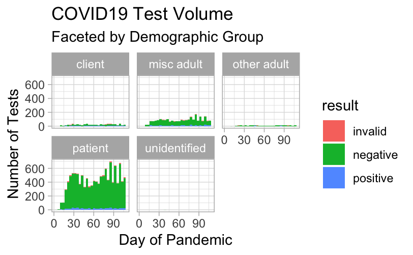

<!--
author:   Joy Payton
email:    paytonk@chop.edu
version:  1.0.0
language: en
module_template_version: 2.0.0
narrator: US English Female
title: R Basics: Visualizing Data With ggplot2
comment:  Learn how to visualize data using R's `ggplot2` package.
long_description: Do you want to learn how to make some basic data visualizations (graphs) in R?  In this module you'll learn about the "grammar of graphics" and the base code that you need to get started.  We'll use the basic ingredients of a tidy data frame, a geometric type, and some aesthetic mappings (we'll explain what all of those are).  This module teaches the use of the `ggplot2` package, which is part of the `tidyverse` suite of packages.
estimated_time: 1 hour

@learning_objectives  

After completion of this module, learners will be able to:

- Describe what makes a data frame "tidy"
- Identify geometric types available in `ggplot2`
- Write R code that creates basic data visualizations

@end
script:  https://code.jquery.com/jquery-3.6.0.slim.min.js

@gifPreload
<script>
(function($) {

  // Get the .gif images from the "data-alt".
	var getGif = function() {
		var gif = [];
		$('img').each(function() {
			var data = $(this).data('alt');
			gif.push(data);
		});
		return gif;
	}

	var gif = getGif();

	// Preload all the gif images.
	var image = [];

	$.each(gif, function(index) {
		image[index]     = new Image();
		image[index].src = gif[index];
	});

	// Change the image to .gif when clicked and vice versa.
	$('figure').on('click', function() {

		var $this   = $(this),
				$index  = $this.index(),

				$img    = $this.children('img'),
				$imgSrc = $img.attr('src'),
				$imgAlt = $img.attr('data-alt'),
				$imgExt = $imgAlt.split('.');

		if($imgExt[1] === 'gif') {
			$img.attr('src', $img.data('alt')).attr('data-alt', $imgSrc);
		} else {
			$img.attr('src', $imgAlt).attr('data-alt', $img.data('alt'));
		}

		// Add play class to help with the styling.
		$this.toggleClass('play');

	});

})(jQuery);
</script>
@end

link:  https://chop-dbhi-arcus-education-website-assets.s3.amazonaws.com/css/styles.css
script: https://kit.fontawesome.com/83b2343bd4.js
-->
# R Basics: Visualizing Data With `ggplot2`

<div class = "overview">

## Overview

@comment

**Is this module right for me?** @long_description

**Estimated time to completion:** @estimated_time

**Pre-requisites**

Minimal experience of using the RStudio IDE and writing R code (specifically, within an R Markdown document) is necessary to understand and use this material.  If you can understand and do the following, you'll be able to complete this course:

* Run a command that's provided to you in the console
* Use the Environment tab to find a data frame and learn more about it
* Insert a new code chunk in an R Markdown document

One potential way to get these basic skills is to take our [R Basics: Introduction](https://liascript.io/course/?https://raw.githubusercontent.com/arcus/education_modules/main/r_basics_introduction/r_basics_introduction.md) course.

This course is designed for R beginners with minimal experience and it is not an advanced course in `ggplot2`.  If you have experience with `ggplot2` already, you may find our ["Data Visualization in ggplot2"](https://liascript.io/course/?https://raw.githubusercontent.com/arcus/education_modules/main/data_visualization_in_ggplot2/data_visualization_ggplot2.md), which is more advanced, a better fit for your needs.

**Learning Objectives**

@learning_objectives

</div>

Material for this module was adapted, with permission, from [Stephan Kadauke's R for Clinical Data workshop materials](https://skadauke.github.io/intro-to-r-for-clinicians-chop/).  We owe special thanks to Dr. Kadauke as well as the R User Group at Children's Hospital of Philadelphia for their generosity in sharing these materials.

## Lesson Preparation

Let's start by taking a peek at the data we'll be using.

The data we will use in this module is a data frame called `covid_testing`, which consists of fabricated (completely fake) demographic and testing data for Covid tests early in the Covid-19 pandemic.

This is what that data looks like:

<!--
style = "max-width:800px;"-->

On the next page, you'll learn how to get access to the sample code.  

### Our RStudio Environment

Please do this step now, because we're going to ask you to follow along throughout and try out code as you go.  

Please read over both options before you start performing any actions, to make sure you pick the right option for you.

<h3>Option 1: Work in the Cloud</h3>

This might work well for you if you don't want to, or can't, install R and RStudio on your computer.  The benefit is that you don't have to install anything, but one negative is that this option requires a bit of waiting for your environment to come online.

**First**, we need to create a small container in the cloud for you to work in just using your web browser.  **Click "Launch binder" below.**  It might take a while (5 minutes) to create, depending on how recently it was created (when it's being used more, it's quicker!).  We're looking for a faster way to get you off and running in RStudio without downloads and without creating accounts, but for now this is a great, free way for us to get you working with no extra work on your part.

  <a href = "https://mybinder.org/v2/gh/arcus/education_r_environment/main?urlpath=rstudio" target = "_blank"></a> **← Click the "launch binder" button!**

<div class = "hint" style = "align-items: center; display: flex;">

<div style = "margin: 1rem; max-width: 45%; float:left;"> If you're the first person to fire up this environment in a while, you might see this loading screen for several minutes.  Be patient!</div>
<div style = "margin: 1rem auto; max-width: 45%; float:left;"> <!--
style = "border: 1px solid rgb(var(--color-highlight));"-->
</div>
</div>

**Then**, once you have access to RStudio and you see something like the image below, you'll need to open the sample data for this course.  In the file area to the lower right, you'll see, among multiple choices, the folder called "r\_basics\_visualize\_data".  That's the code for this module!

<!--
style = "border: 1px solid rgb(var(--color-highlight)); max-width: 800px;"-->


<h3>Option 2: Work on Your Computer</h3>

If you have [R](https://www.r-project.org/) and [RStudio](https://www.rstudio.com/products/rstudio/download/#download) installed already on your local computer, you might be interested in simply downloading our sample code to your computer. Here's how.  Note -- if you've already done this step in another module, you might have the material for this module already!

* In RStudio, open a new project (File, New Project)
* Select Version Control, then Git
* Drop this link into the "Repository URL": https://github.com/arcus/education_r_environment
* Change the "Project directory name" and "Create project as a subdirectory of" boxes to suit your needs (where will this code be stored on your computer?).
* Click to select the "Open in new session" checkbox
* Click "Create Project"
* In the file area to the lower right, you'll see, among multiple choices, the folder called "r\_basics\_visualize\_data".  That's the code for this module!

**Want to watch this process?  Click on the image below to play an animated gif.  It will continue to loop and you can re-start it by clicking again.**

<div style="display:none">@gifPreload</div>

<figure>
  

<figcaption style = "font-size: 1em;">Click on the image to play the demo of the above steps!</figcaption>
</figure>

If you already completed this work for a previous module, and it's been a while since you downloaded this project to your computer, you may want to get any new and improved files that have been placed there in the meantime:

* Open your project.
* In the Version Control menu, choose "pull branches".  There are two places to do this, as shown below:


<div class = "warning">
If you're pulling branches after having worked in previous modules, you might have made local changes (for example, when you filled in exercise code) that will be overwritten by pulling the latest version.  If you want to save your changes, consider making a copy of any exercise files and naming them something new.  For example, if you have already worked in the `r_basics_transform_data` exercise files, you might want to save your version of `transform_exercises.Rmd` to `my_transform_exercises.Rmd`.  That way, you can pull down the latest version of code, overwriting `transform_exercises.Rmd` while holding on to your changes in the new file.
</div>

### How to Follow Along

Please go ahead and open the "r\_basics\_visualize\_data" directory in whichever RStudio environment you're working in. You can open "visualize_exercises.Rmd" which will make you ready for our first hands-on activity in just a bit!

<!-- style = "border: 1px solid rgb(var(--color-highlight)); max-width: 800px;" -->

## Thinking Graphically From Data

Let's try to imagine some **data visualizations** (also known as **plots** and **graphs**, and we may use all of these terms interchangably).  

Consider the `covid_testing` data frame shown below, which we'll work on in the hands-on part of this module.  Think about what the columns mean and which columns you might like to see represented on a data visualization.

<!-- style = "max-width:800px;"-->

What do you think a plot would look like in which:

* the x-axis represents `pan_day` (day of the pandemic), and
* the y-axis represents the number of tests that were performed on that day?

Take a few seconds and try to visualize this graph in your mind or doodle it on a piece of paper in front of you.

### Thinking Graphically From Data, Part 2

What we've asked you to imagine is a plot in which we have the **count** or the **frequency** of a test on the y axis, plotted against the pandemic day, represented by the x axis. Do you know the name of that type of plot that has the count of a thing on the y axis and the distribution of those counts along the x axis?

Here's another example of that kind of plot:

<!-- style = "max-width:800px;"-->

<div class = "question">
In the box below, write what you think the name of this is (all lowercase, please).

[[histogram]]
[[?]] Hint: this word ends in "gram"

<div class = "answer">
<details><summary>Click to see an explanation of the answer.</summary>

"histogram" is the right answer!  A histogram plots the frequency of something in terms of some other thing (for instance, a time value like days).  In our next section, we're going to build a histogram.
</details>
</div>
</div>

### Building Your First Histogram

To get started, let's first load up our fabricated data.  In the `visualize_exercises.Rmd` file, run the first code chunk by clicking the green "play" button (look at line 10).  This gives you the data frame with fake Covid testing data, which we will use for our instruction in this module.

For the next step, we'd like for you to go into the **console** to practice running some code there.  The console is usually in the lower left pane (or it might take up the whole left side, if you don't have any files open yet).

Don't panic if the code we ask you to input seems incomprehensible right now or you get an error message.  We'll walk you through what it all means!

In the console, please type in the following.  While you can certainly cut and paste, there is sometimes an advantage to typing the code by hand, because it helps you develop "muscle memory" about how to construct code.  Pay attention to the spelling, capitalization, and parentheses!  

```r

ggplot(data = covid_testing) +
  geom_histogram(mapping = aes(x = pan_day))

```

And yes, you can hit "Enter" after that plus sign and keep typing on the next line.  There will be a little plus sign on the second line that lets you know that the console is accepting the second line as a continuation of the first.  When you're finished, just hit "Enter" to run that code.  

When you run the code, you'll  see a graph open up in the lower right pane, and your console should look something like this:

<!-- style = "border: 1px solid rgb(var(--color-highlight)); max-width:700px;" -->

When you run this code, you get what looks like an error in the console but is actually just a message (even though it's in a scary red color).

R lets you know that when you ask it to draw a histogram, you should probably tell it how wide each bin should be, because this affects the granularity of the data displayed.  You can either set the number of bins (say, 10 bins or 100 bins) or you can set the bin width (like 1 to make a bin 1 day wide, 7 to make a bin one week wide, etc.)

### The Power of Data Visualizations

<!-- style = "max-width: 800px;"  -->

When we asked you to imagine what this plot might look like - the number of Covid tests that were performed on a given day over time – you might have imagined something like this. Initially you have very few tests that are being run, maybe because the pandemic hasn't started yet or because the test isn't yet broadly available. And at some point the number of tests increases and remains at a high level. But this simple visualization tells you so much more than that general shape. You can see that by 30 days, the testing ramp-up settles. And there appear to be some interesting things going on after day 60 that you might want to look into further.

Even though this graph isn't publication-perfect (at least not yet), it's still very useful for honing your knowledge about the data.

## Introducing `ggplot2`

<div style = "align-items: center; display: flex;">

<div style = "margin: 1rem; max-width: 65%; float:left;">


We'll be using the `ggplot2` package for creating graphics. `ggplot2` is part of the tidyverse so it will get loaded when you load the tidyverse package.

`ggplot2` (and its main function, plain old `ggplot` without the 2) provides a "**grammar of graphics**" for data visualization. The idea of having a "grammar" for something is actually pretty common in R. Essentially, there should be a consistent way to build any type of graph. This makes it easier to learn and also easier to for humans to read the code later and make sense of it. And that's super important because most people who use R are not programmers.

The idea of the grammar of graphics is that you should be able to specify any type of graph by specifying the data that goes into it, a the type of graph that you want to make, and a mapping that describes how the data should be represented as visual marks on that graph.

Having a consistent grammar means that once you learn how to make a histogram that knowledge can be applied to make a scatter plot with little extra effort. This makes it easy to generate lots of different graphs quickly which helps you understand your data more quickly.

Also, `ggplot2` graphs look great and the package can be used to generate publication-quality plots.
</div>
<div style = "margin: 1rem auto; max-width: 30%; float:left;">


</div>
</div>

### The ggplot() Function

So here is a quick analysis of how we just used ggplot to make that histogram.

<!-- style = "max-width: 600px;" -->

<lia-keep>
<table style = "width = 100%">
<tr><th style = "width: 45%;"></th><th style = "width: 45%;"></th></tr>
<tr style="padding: 3em; border: 1px solid rgb(var(--color-text));"><td>1) We always start with <code>ggplot()</code>.</td>
<td><pre style = "color: rgba(var(--color-text), 0.5); margin:1em; font-size:0.8em;">
<span style = "color: rgb(var(--color-text)); font-weight: bold;">ggplot(</span>data = covid_testing<span style = "color: rgb(var(--color-text)); font-weight: bold;">)</span> +
  geom_histogram(mapping = aes(x = pan_day))
</pre>
</td></tr>
<tr style="padding: 3em; border: 1px solid rgb(var(--color-text));"><td>2)In the parentheses just after ggplot, give it a <b>data frame</b> to start with, in this case, our <code>covid_testing</code> data frame.</td>
<td><pre style = "color: rgba(var(--color-text), 0.5); margin:1em; font-size:0.8em;">
ggplot(<span style = "color: rgb(var(--color-text)); font-weight: bold;">data = covid_testing</span>) +
  geom_histogram(mapping = aes(x = pan_day))
</pre>
</td></tr>
<tr style="padding: 3em; border: 1px solid rgb(var(--color-text));"><td>3) We build our plot across several different lines, so we include a plus sign (<code>+</code>) at the end of the line to say "wait, we're not done yet!"
</td>
<td><pre style = "color: rgba(var(--color-text), 0.5); margin:1em; font-size:0.8em;">
ggplot(data = covid_testing) <span style = "color: rgb(var(--color-text)); font-weight: bold;">+ </span>
  geom_histogram(mapping = aes(x = pan_day))
</pre>
</td></tr>
<tr style="padding: 3em; border: 1px solid rgb(var(--color-text));"><td>4) In the second line, we describe what kind of geometric representation we want -- a histogram, which we communicate to R using  <code>geom_histogram()</code>.
</td>
<td><pre style = "color: rgba(var(--color-text), 0.5); margin:1em; font-size:0.8em;">
ggplot(data = covid_testing) +
  <span style = "color: rgb(var(--color-text)); font-weight: bold;">geom_histogram(</span>mapping = aes(x = pan_day)<span style = "color: rgb(var(--color-text)); font-weight: bold;">)</span>
</pre>
</td></tr>
<tr style="padding: 3em; border: 1px solid rgb(var(--color-text));"><td>5)  We also add some mappings inside the parentheses of `geom_histogram`, explaining which data from the data frame should be displayed in the histogram.  We use `aes()` (short for "aesthetic" or "aesthetic mapping") to tell ggplot how to draw the visualization.
</td>
<td><pre style = "color: rgba(var(--color-text), 0.5); margin:1em; font-size:0.8em;">
ggplot(data = covid_testing) +
  geom_histogram(<span style = "color: rgb(var(--color-text)); font-weight: bold;">mapping = aes(</span>x = pan_day<span style = "color: rgb(var(--color-text)); font-weight: bold;">)</span>)
</pre>
</td></tr>
<tr style="padding: 3em; border: 1px solid rgb(var(--color-text));"><td>6) Inside the parentheses of "aes" we specify the x-axis by including "x = variable". We only have to specify the <b>x axis</b>, because a histogram assumes that you're counting rows of data and will map that to the y axis.
</td>
<td><pre style = "color: rgba(var(--color-text), 0.5); margin:1em; font-size:0.8em;">
ggplot(data = covid_testing) +
  geom_histogram(mapping = aes(<span style = "color: rgb(var(--color-text)); font-weight: bold;">x = pan_day</span>))
</pre>
</td></tr>
</table>
</lia-keep>

### A Template

So that was a lot of information on the specific use case of working with the `covid_testing` data frame. We explained that in six steps on the last page, but once you have the pattern in mind, you mostly have to think about three main tasks:

1) Pick a **tidy data frame** (this contains the data you want to plot, organized in a tidy way) and add it to the first line, where we see `ggplot(data = )`

2) Pick a **geom function** (this is the type of plot you want to make), and add it as a new line (like we did with `geom_histogram`)

3) Write **aesthetic mappings** (which columns of the data you want to see added to the plot, and how you want them visualized)

Here's a visual of what that a template looks like, with those three tasks:

<!-- style = "max-width:700px;" -->

And here is the template in case you want to copy and paste it.  The first task, of picking a data frame, would change the first line of the template, and the second and third tasks would change the second line.  You don't have to indent the second line, but it's a good idea, because it visually reminds you that it's the continuation of an earlier line of code.

```
ggplot(data = data_frame) +
  geom_function(mapping = aes(mappings))
```

In the next section, we'll talk about what it means to call a data frame "tidy".

### Template, Step 1

Let's get started. The first detail is a "tidy" data frame which contains the data you want to plot.  It replaces the generic `data_frame` in our template (shown again below).

<!-- style = "max-width:700px;" -->

What do we mean by "tidy" data frame?

A data set can take on a lot of different shapes with different styles of organizing data. The one method or shape that is best suited for data analysis is known as "tidy".

<!-- style = "max-width: 400px;" -->

A data set is tidy if:

* Each variable is in its own column
* Each observation is in its own row, and
* Each value is in its own cell.

The opposite of "tidy" is often called "messy." And often times a lot of the data analysis work is to convert "messy" data into "tidy data." But for now, fortunately for us, the `covid_testing` data set is tidy already.

Here's one simple example of tidy versus messy. If a column is called "name" and includes first names and last names, that's messy.  It can be difficult to extract just the first names or just the last names, since some people have more than one word forming their first name (José María, Leigh Ann) and some people have more than one word forming their last name (de la Cruz, Bonham Carter).  A "tidy" approach would be to have one column for first names and one column for last names.

[Hadley Wickham](https://www.jstatsoft.org/article/view/v059i10) (a statistician who is prominent in the R world -- you'll likely become familiar with his name as you continue your R journey) suggests that there are five common problems that occur to make data "messy":

* Column headers are values, not variable names.
* Multiple variables are stored in one column.
* Variables are stored in both rows and columns.
* Multiple types of observational units are stored in the same table.
* A single observational unit is stored in multiple tables.

To see a "messy" data frame and its "tidy" alternative, see [a brief 2018 article](https://education.arcus.chop.edu/tidyverse/) for a brief read, or, if you want a deeper dive,  there really isn't a better article than [Hadley Wickham's classic work](https://www.jstatsoft.org/article/view/v059i10).

### Quiz: Tidy Data

Let's see what you remember about tidy datasets!  Take a look at the sample table provided below.  It's similar to what you might see in a publication, and it's in a great format for humans... but it's not tidy enough to work with easily in a computational way.  This table shows the results of the "QPT" psychometric (something we made up) and shares pre- and post-treatment means and standard deviations for different kinds of research cohorts.

<table border="1" cellpadding="0.5em" cellspacing="0"><tbody><tr><td style="padding: 0.5em;">
            </td>
            <td colspan="2" style="padding: 0.5em;">
            <p>Mean QPT - pretreatment</p>
            </td>
            <td colspan="2" style="padding: 0.5em;">
            <p>SD QPT -- pretreatment</p>
            </td>
            <td colspan="2" style="padding: 0.5em;">
            <p>Mean QPT - post-treatment</p>
            </td>
            <td colspan="2" style="padding: 0.5em;">
            <p>SD QPT -- post-treatment</p>
            </td>
        </tr><tr><td style="padding: 0.5em;">
            </td>
            <td style="padding: 0.5em;">
            <p>m</p>
            </td>
            <td style="padding: 0.5em;">
            <p>f</p>
            </td>
            <td style="padding: 0.5em;">
            <p>m</p>
            </td>
            <td style="padding: 0.5em;">
            <p>f</p>
            </td>
            <td style="padding: 0.5em;">
            <p>m</p>
            </td>
            <td style="padding: 0.5em;">
            <p>f</p>
            </td>
            <td style="padding: 0.5em;">
            <p>m</p>
            </td>
            <td style="padding: 0.5em;">
            <p>f</p>
            </td>
        </tr><tr><td style="padding: 0.5em;">
            <p>Depression alone</p>
            <p>(n=9m, 7f)</p>
            </td>
            <td style="padding: 0.5em;">
            <p>122</p>
            </td>
            <td style="padding: 0.5em;">
            <p>137</p>
            </td>
            <td style="padding: 0.5em;">
            <p>28.1</p>
            </td>
            <td style="padding: 0.5em;">
            <p>27.0</p>
            </td>
            <td style="padding: 0.5em;">
            <p>109</p>
            </td>
            <td style="padding: 0.5em;">
            <p>140</p>
            </td>
            <td style="padding: 0.5em;">
            <p>26.0</p>
            </td>
            <td style="padding: 0.5em;">
            <p>39.5</p>
            </td>
        </tr><tr><td style="padding: 0.5em;">
            <p>Depression with Anxiety (n=12m,8f)</p>
            </td>
            <td style="padding: 0.5em;">
            <p>130</p>
            </td>
            <td style="padding: 0.5em;">
            <p>145</p>
            </td>
            <td style="padding: 0.5em;">
            <p>25.0</p>
            </td>
            <td style="padding: 0.5em;">
            <p>19.8</p>
            </td>
            <td style="padding: 0.5em;">
            <p>103</p>
            </td>
            <td style="padding: 0.5em;">
            <p>142</p>
            </td>
            <td style="padding: 0.5em;">
            <p>24.9</p>
            </td>
            <td style="padding: 0.5em;">
            <p>40.1</p>
            </td>
        </tr><tr><td style="padding: 0.5em;">
            <p>Controls / Neither Depression nor Anxiety (n=10m, 10f)</p>
            </td>
            <td style="padding: 0.5em;">
            <p>107</p>
            </td>
            <td style="padding: 0.5em;">
            <p>110</p>
            </td>
            <td style="padding: 0.5em;">
            <p>15.8</p>
            </td>
            <td style="padding: 0.5em;">
            <p>13.9</p>
            </td>
            <td style="padding: 0.5em;">
            <p>88</p>
            </td>
            <td style="padding: 0.5em;">
            <p>95</p>
            </td>
            <td style="padding: 0.5em;">
            <p>21.8</p>
            </td>
            <td style="padding: 0.5em;">
            <p>20.6</p>
            </td>
        </tr><tr><td style="padding: 0.5em;">
            <p>Anxiety Alone (n=13m, 15f)</p>
            </td>
            <td style="padding: 0.5em;">
            <p>124</p>
            </td>
            <td style="padding: 0.5em;">
            <p>119</p>
            </td>
            <td style="padding: 0.5em;">
            <p>20.7</p>
            </td>
            <td style="padding: 0.5em;">
            <p>18.3</p>
            </td>
            <td style="padding: 0.5em;">
            <p>100</p>
            </td>
            <td style="padding: 0.5em;">
            <p>110</p>
            </td>
            <td style="padding: 0.5em;">
            <p>24.2</p>
            </td>
            <td style="padding: 0.5em;">
            <p>20.5</p>
            </td>
        </tr></tbody></table>

Which of the following are ways to make this dataset "tidy"?  Check all that apply!

[[X]] move "depression" status into a column instead of using it in a cell combined with other descriptors
[[ ]] remove sex as a variable, since there's no way to detangle it from other variables
[[ ]] ensure that each number has the same number of significant digits after the decimal point
[[X]] make "timepoint" into a new column, with possible values including "pre" and "post"
[[X]] increase the rows so that there are 16 rows representing 16 distinct cohorts
[[?]] There are multiple correct answers!

<div class = "answer">

<details><summary>Click to see an explanation of the answer.</summary>

Depression status and timepoint should each become a column.  In fact, we suggest the following columns:

* Depression +/- dx
* Anxiety +/- dx
* Sex
* Timepoint (pre- vs post- treatment)
* Mean QPT value
* SD QPT value
* n (count of participants in this group)

There's no need to remove the sex variable, and the numerical values don't necessarily need to have the same number of significant digits to be considered "tidy".  Here's one way to make the table above into a tidy dataset ready for computational analysis:

| Depression status | Anxiety status | Sex | Count | Timepoint | Mean QPT | SD QPT |
| --- | --- | --- | --- | --- | --- | --- |
| pos | pos | m | 12 | pre | 130 | 25 |
| pos | pos | f | 8 | pre | 145 | 19.8 |
| pos | pos | m | 12 | post | 103 | 24.9 |
| pos | pos | f | 8 | post | 142 | 40.1 |
| pos | neg | m | 9 | pre | 122 | 28.1 |
| pos | neg | f | 7 | pre | 137 | 27.0 |
| pos | neg | m | 9 | post | 109 | 26.0 |
| pos | neg | f | 7 | post | 140 | 39.5 |
| neg | pos | m | 13 | pre | 124 | 20.7 |
| neg | pos | f | 15 | pre | 119 | 18.3 |
| neg | pos | m | 13 | post | 100 | 24.2 |
| neg | pos | f | 15 | post | 110 | 20.5 |
| neg | neg | m | 10 | pre | 107 | 15.8 |
| neg | neg | f | 10 | pre | 110 | 13.9 |
| neg | neg | m | 10 | post | 88 | 21.8 |
| neg | neg | f | 10 | post | 95 | 20.6 |

</div>

### Template, Step 2

As a reminder, we put forth three steps in our `ggplot` template:

1) Pick a **tidy data frame** (this contains the data you want to plot, organized in a tidy way) and add it to the first line, where we see `ggplot(data = )`

2) Pick a **geom function** (this is the type of plot you want to make), and add it as a new line (like we did with `geom_histogram`)

3) Write **aesthetic mappings** (which columns of the data you want to see added to the plot, and how you want them visualized)

<!-- style = "max-width:700px;" -->

Let's take on the second step: selecting a **geom function**.

We'll go into more detail about what geom functions are, but for now, just know that you need to tell ggplot what type of graph you want, and you do that by picking the right `geom_` function.  And in RStudio, thanks to code completion suggestions, when you start typing `geom_`, you'll see a long list of possible ways to finish that term:


Here are a few useful geom functions for visualizing clinical data, but there are many more. With these six you can make histograms, bar plots, scatter plots, dot plots, boxplots, and line graphs.

| Visual depiction | ggplot geom function |
| --- | --- |
| <!-- style = "max-width:100px;" --> | geom_histogram() |
| <!-- style = "max-width:100px;" --> | geom_bar() |
| <!-- style = "max-width:100px;" --> | geom_point() |
| <!-- style = "max-width:100px;" --> | geom_dotplot() |
| <!-- style = "max-width:100px;" --> | geom_boxplot() |
| <!-- style = "max-width:100px;" --> | geom_line() |

### Using our Template, Step 3


As a reminder, we put forth three steps in our `ggplot` template:

1) Pick a **tidy data frame** (this contains the data you want to plot, organized in a tidy way) and add it to the first line, where we see `ggplot(data = )`

2) Pick a **geom function** (this is the type of plot you want to make), and add it as a new line (like we did with `geom_histogram`)

3) Write **aesthetic mappings** (which columns of the data you want to see added to the plot, and how you want them visualized)

<!-- style = "max-width:700px;" -->
Let's take on the third step: writing aesthetic mappings.  This is where you tell R how you want the columns of the data frame represented as graphical markings on the plot.  It's important to start with a couple of important distinctions:

* An **aesthetic** is something that you can see about a data element on a graphic, such as its **position** on an x/y grid, but also other features such as for example its **color**.
* An **aesthetic mapping** is a rule that tells ggplot how to draw the data from a specific column of the data set on the plot.

* A data visualization contains visual elements that **don't change** according to the data (for example, the color of the background of the graph, which doesn't vary based on the data).  **We can set these, but we don't "map" them.**
* A data visualization contains visual elements that **do change** with the data (for example, the height of a bar changes depending on the data, and the x and y position of a point on a scatter plot changes depending on the data).  **We "map" these visual elements.**

We'll keep thinking about these distinctions in the next few sections.  For now, let's consider an example aesthetic mapping, in a data frame with three columns, called "a", "b", and "c".  We can imagine mapping the values in column "a", which are numerical values, to the x axis.  With column "b", also numerical, we can map those values to the y axis.  And for column "c", which has categorical data with "M" and "F" values, we can imagine mapping that to colors.  

The mapping in ggplot would be within an **aes()**, or aesthetic mapping, and looks like this:

`aes(x = a, y = b, color = c)`

Note that R automatically figures out reasonable axis limits and a color scale, but you can fine tune this manually.

Here's a visual that might help:


## Aesthetic Mappings

Let's do a quick check of your understanding of aesthetic mappings.  As a reminder:

* A data visualization contains visual elements that **don't change** according to the data (for example, the color of the background of the graph, which doesn't vary based on the data).  **We can set these, but we don't "map" them.**
* A data visualization contains visual elements that **do change** with the data (for example, the height of a bar changes depending on the data, and the x and y position of a point on a scatter plot changes depending on the data).  **We "map" these visual elements.**

Here are some aesthetic mappings to consider:

<!-- style = "max-width:700px" -->

From *Fundamentals of Data Visualization*, by Claus Wilke, licensed under CC-BY-NC-ND

<div class = "question">
Which of the following elements of a graph could reasonably form part of an aesthetic mapping? Check all that apply!

[[ ]] The size of font used in the title of a plot
[[X]] The size of a point on a scatterplot
[[X]] The location of a point on a scatterplot
[[ ]] The location of the caption on a graph
[[ ]] The color of the font for the x-axis title
[[ ]] The color of gridlines in the background of a graph
[[X]] The color of a line that connects data points in a line graph
[[X]] The color of paired bars in a bar chart
[[X]] The line style (solid, dotted) in a line graph
[[?]] There are multiple correct answers!

<div class = "answer">
<details><summary>Click to see an explanation of the answer.</summary>

Elements that don't get their value from data don't form part of an aesthetic **mapping**.  For example, the size of the font I want for the title of a plot is based on what looks good, what is readable, and what my publisher asks for.  I can set that without looking at any of the actual data.  The same thing is true of the location of a caption.  I might left-justify it, or center it, or put it above or below the graph, but that's an aesthetic choice that doesn't have any relationship (or mapping) to the data I want to display.

Out of the list above, these are the visual elements that could be reasonably mapped back to the data I want to display:

* The size of a point on a scatterplot (for example, more cases = a bigger dot, fewer cases = a smaller dot)
* The location of a point on a scatterplot (the x value could be the day of the pandemic and the y value could be the number of tests)
* The color of a line that connects data points in a line graph (imagine a blue line that shows invalid tests over time, and a purple line that shows valid tests, both positive and negative, over time)
* The color of paired bars in a bar chart (perhaps we have the number of male and female patients being tested each week, and use different colors to indicate the sex in a paired bar chart)
* The line style (solid, dotted) in a line graph (we could have actual number of tests administered in a solid line and a machine learning prediction of number of tests in a dotted line)

</details>
</div>
</div>

There are actually a lot of aesthetic mapping possibilities, and they depend on the kind of plot you're making. For example, for a line graph you can define line width and line type, and for scatter plots you can define the shape of the dots.

Note that things like axis labels, fonts, and annotations aren't considered aesthetic mappings because they don't vary with each data element and therefore you can't map those things to a specific column of a data frame.

Complicating matters, sometimes you just set the way points or lines look, not by mapping them to data, but by setting them to a predetermined value no matter what.  For instance, if you wanted all the points in a scatter plot to be purple stars, regardless of the data represented, we would call this "setting" an aesthetic, not "mapping" it.  

Picking the best aesthetics for your graph is as much an art as it is a science. Claus Wilke's *Fundamentals of Data Visualization* is a great introduction to this topic.

The distinction between visual elements that are "set" and those that are "mapped", and the code that each of these requires, is a common point of confusion and frustration for new users of ggplot, so if you're not solid on these concepts, give the last couple of sections a quick re-read before moving ahead.

### Exercise Time!

Using your RStudio file browser (one of the tabs that usually appears in the lower right pane of RStudio), please find and open the `r_basics_visualize_data` directory, and then open `visualize_exercises.Rmd`, which will allow you to work alongside the sections of this module.

<!-- style = "max-width: 600px; border: 1px solid rgb(var(--color-highlight))" -->

To get started, let's first load up our fabricated data.  Run the first code chunk by clicking the green "play" button (look at line 10).  This gives you the data frame with fake Covid testing data, the data we will use for our instruction in this module.  You may have already done this a few sections ago, but it won't hurt to do it again.

Then, work through the exercises in the `visualize_exercises.Rmd` file, adding and updating code as indicated.

Stop when it says "Stop here".  We'll go over the solutions in the next section.

### Solutions

If you like, you can open the solutions version of `visualize_exercises.Rmd` by using your RStudio file browser to open `visualize_solutions.Rmd`.

You had three tasks to complete.  We'll go through them one at a time.

In your first task, you were asked to do what we already did once in this module: create a histogram of Covid tests as a function of `pan_day`.  There were three blanks to fill in, and three numbered instructions.

<!-- style = "max-width:700px; border: 1px solid rgb(var(--color-highlight))" -->

Here's the solution that you should place in that code chunk:

``` r
ggplot(data = covid_testing) +
  geom_histogram(mapping = aes(x = pan_day))
```


In the second task, you were asked to rework that code with a bin width ("binwidth" in code) that corresponded to daily counts:

<!-- style = "max-width:700px; border: 1px solid rgb(var(--color-highlight))" -->

Here's the solution that you should place in that code chunk:

``` r
ggplot(data = covid_testing) +
  geom_histogram(mapping = aes(x = pan_day), binwidth = 1)
```

Finally, for the third task, you had to create a new code chunk by using copy and paste, **and** you had to add an aesthetic mapping using "fill".  Complicated!

<!-- style = "max-width:700px; border: 1px solid rgb(var(--color-highlight))" -->


And here's the solution:

```
ggplot(data = covid_testing) +
  geom_histogram(mapping = aes(x = pan_day, fill = result), binwidth = 1)
```

### Setting vs. Mapping Aesthetics

In the third task you just completed (if you didn't actually do it, at least go back one section and read about the three tasks), you **mapped** the fill aesthetic to the **result** variable, by writing "fill = result" inside the **aes()** function:

<div style = "align-items: center; display: flex;">

<div style = "margin: 1rem; max-width: 45%; float:left;"> 
</div>
<div style = "margin: 1rem auto; max-width: 45%; float:left;">
<lia-keep>
<pre>
ggplot(data = covid_testing) +
  geom_histogram(mapping = aes(x = pan_day, fill = result))
</pre>
</lia-keep>
</div>
</div>

In contrast, consider this plot. It's the same as the one you've created at the beginning of the session, except the bars are blue, not black. So the difference is the "fill" aesthetic. But we're not really mapping the fill aesthetic to a variable here, because all bars are the same fill color. They don't represent the values of a column (or variable) of a data frame. Instead, we're setting it to a constant value, the color blue.

<!-- style = "max-width: 800px;" -->

To do this in ggplot, you can still use "fill", but:

* Instead of setting it equal to a column / variable, you'll set it to a color, like "blue" or "#1111FF" (if you use "hex" or "hexidecimal" RGB values)
* Instead of placing the "fill = " inside `aes()`, you'll move it outside of `aes()`.

This is how you'd get an all-blue histogram:

```
ggplot(data = covid_testing) +
  geom_histogram(mapping = aes(x = pan_day), fill = "blue")
```

Notice **where** the `fill =` appears and what it it set equal to!

Importantly, R knows a lot of different colors by their English names.  To see them, you can use a [great cheat sheet](http://www.stat.columbia.edu/~tzheng/files/Rcolor.pdf) that shows the color and the color name, or perhaps [this one](http://derekogle.com/NCGraphing/resources/colors).  For "hex" colors, there are a number of "color pickers" out there, like [Google's](https://g.co/kgs/hv1JrX).

## Working With Geoms

Consider: how are these two plots similar?  How are they different?

<div style = "align-items: center; display: flex;">

<div style = "margin: 1rem; max-width: 45%; float:left;"> 
</div>
<div style = "margin: 1rem auto; max-width: 45%; float:left;"> 
</div>
</div>

These two graphs share the same data, plotted on the same x and y axes.  What's different? What's different is that on the left, the data is shown as a histogram, and on the right, it's shown as what's called a frequency polygon.

A geom function is a function that, given the data and aesthetic mappings, generates the **geometric object** used to represent the data.

In the next exercise, you're going to work hands-on with geom functions.

### Exercise Time!

In your RStudio environment, you should already have `visualize_exercises.Rmd` open.  If not, please reopen it.  Scroll down to `### Your Turn: Geom functions`, which should be around line 90 or so.

<!-- style = "max-width:700px; border: 1px solid rgb(var(--color-highlight))" -->

Then, work through the exercises from that point forward, running, adding, and updating code as indicated.  Hint: take advantage of code completion suggestions in RStudio to help you make an educated guess as to how to proceed, especially in the first task.

We'll go over the solutions in the next section, and you can also look in the RStudio file browser and open `visualize_solutions.Rmd` to see the solution!

### Solutions

If you like, you can open the solutions version of `visualize_exercises.Rmd` by using your file browser to open `visualize_solutions.Rmd`.

You had three tasks to complete.  We'll go through them one at a time.

Your first task invited you to run a code chunk that creates a histogram and use that code as the basis of a new code chunk that creates a frequency polygon.  

<!-- style = "max-width:700px; border: 1px solid rgb(var(--color-highlight))" -->

This is the solution code:

```
ggplot(data = covid_testing) +
  geom_freqpoly(mapping = aes(x = pan_day))
```

In your second task, you were asked to set the color of the line to "blue".  Note that lines have "color" and shapes have "fill" (for the inside) as well as optional "color" (for the edges).

<!-- style = "max-width:700px; border: 1px solid rgb(var(--color-highlight))" -->

This is the proper code:

```
ggplot(data = covid_testing) +
  geom_freqpoly(mapping = aes(x = pan_day), color = "blue")
```

Finally, you were asked to predict what the output of `ggplot` code using two different `geom_` functions would be:

<!-- style = "max-width:700px; border: 1px solid rgb(var(--color-highlight))" -->

Run that code, and you should see something like this!

<!-- style = "max-width:700px; border: 1px solid rgb(var(--color-highlight))" -->


## More Visualization Options

The next few sections of this module include additional information that will help you on your way, presented a bit more briefly than we've done so far.  We'll start with saving plot images!

<h3>Saving Plot Images</h3>

To save a plot you've created in the console, you can go to the **Plots** pane on the bottom right of the RStudio window, click "Export", and select "Save as Image".

To save a plot you've created by running some code inside an R notebook, you can **right-click** the plot and select "Save image as".

<!-- style = "max-width:700px;" -->

### Position Adjustments

We've only barely scratched the surface of what you can do with ggplots. For example, you can change how overlapping objects are arranged.  For example, instead of a stacked histogram, you can request side-by-side bars.

```
ggplot(covid_testing) +
  geom_histogram(
    mapping = aes(x = pan_day, fill = result),
    position = position_dodge()
  )
```

<!-- style = "max-width:700px;" -->

### Themes

You can use different themes which affect how non-data elements such as axes, gridlines, and background appear.

```
ggplot(covid_testing) +
  geom_histogram(
    mapping = aes(x = pan_day, fill = result),
    position = position_dodge()
  ) +
  theme_light()
```

<!-- style = "max-width:700px;" -->

### Scales

You can customize color scales.

```
library(colorspace)

cols <- c(
  "invalid" = "grey80",
  qualitative_hcl(2, palette = "dark3")
)

ggplot(covid_testing) +
  geom_histogram(
    mapping = aes(x = pan_day, fill = result),
    position = position_dodge()
  ) +
  theme_light() +
  scale_fill_manual(values = cols)
```

<!-- style = "max-width:700px;" -->

### Facets

You can facet your plot. That means breaking it into sub-plots by another variable, for example, gender or location in the hospital.

```
ggplot(covid_testing) +
  geom_histogram(
    mapping = aes(x = pan_day, fill = result)
  ) +
  theme_light() +
  scale_fill_manual(values = cols) +
  facet_wrap(~demo_group)
```

<!-- style = "max-width:700px;" -->

### Coordinate systems

You can easily make radial plots or geographical maps.

```
ggplot(covid_testing) +
  geom_histogram(
    mapping = aes(x = pan_day, fill = result)
  ) +
  theme_light() +
  scale_fill_manual(values = cols) +
  facet_wrap(~demo_group) +
  coord_polar()
```


<!-- style = "max-width:700px;" -->

### Titles and Captions

And you can add titles, subtitles, or annotations, and change the axis labels or the appearance.

```
ggplot(covid_testing) +
  geom_histogram(
    mapping = aes(x = pan_day, fill = result)
  ) +
  theme_light() +
  scale_fill_manual(values = cols) +
  facet_wrap(~demo_group) +
  coord_polar() +
  ggtitle(
    label = "COVID19 test volume",
    subtitle = "Displayed in polar coordinates, mostly to show off ggplot2"
  )
```

<!-- style = "max-width:700px;" -->

### Adding New elements

All of these elements, like position adjustments, themes, color scales, facets, coordinate systems, and text can be added to a ggplot command in the same way that we added a second geom layer – by writing a plus sign followed by a theme function, a scale function, a facet function, etc.

```
ggplot(data = data_frame) +                     # Required
  geom_function(mapping = aes(mappings)) +      # Required
  theme_function +                              # Optional
  scale_function +                              # Optional
  facet_function +                              # Optional
  coordinate_function +                         # Optional
  ...
```

### Survival Plots

The `survminer` package extends `ggplot2` to make it straightforward to create publication-quality survival curves and risk tables.

<!-- style = "max-width:700px;" -->

### A Grammar for Tables

<!-- style = "max-width:300px;" --><!-- style = "max-width:500px;" -->

The `gt` package provides a grammar for creating display tables, i.e. tables that you might want to show in a publication or on a summary report. The `gtsummary` package makes it trivial to generate publication-ready tables from a tidy data frame.

## Recap

| <!-- style = "max-width:200px;" --> | **ggplot2** is a package that provides a **grammar of graphics**. You can create any type of plot using a simple template to which you provide: |
| <!-- style = "max-width:200px;" --> | 1. A **tidy data frame**, in which each variable is in its own column, each observation is in its own row, and each value is in its own cell; |
| <!-- style = "max-width:75px;" -->  <!-- style = "max-width:75px;" --> | 2. A **geom function**, which tells R what kind of plot to make; and |
| <!-- style = "max-width:75px;" -->  <!-- style = "max-width:75px;" -->  | 3. **Aesthetic mappings**, which tell R how to represent data as graphical markings on the plot. |
| <!-- style = "max-width:75px;" -->   <!-- style = "max-width:75px;" -->   | Aesthetics can be **mapped** to a variable or **set** to a constant value. |
| | Additionally, you can do things like change theme, color palette, coordinate systems, facet your graph, and more! |

## Additional Resources

<!-- style = "max-width:700px;" -->

If you'd like to learn more about which graphics are most effective in specific situations, we recommend taking a look at *Fundamentals of Data Visualizations* by Claus Wilke. This is a very readable and recent primer on data visualization and figure design, and it's [available for free!](https://serialmentor.com/dataviz)<!-- style = "max-width:400px;" -->

### Cheat Sheet!

The ggplot Cheat Sheet is great to have on hand as you're exploring your data. It reviews the basic template for building any plot and also lists the most useful geom functions.

To find official cheat sheets, go to the Help menu and choose "Cheat Sheets".  There are many to choose from!

<!-- style = "max-width:700px;" -->

## Feedback

In the beginning, we stated some goals.

**Learning Objectives:**

@learning_objectives

We ask you to fill out a brief (5 minutes or less) survey to let us know:

* If we achieved the learning objectives
* If the module difficulty was appropriate
* If we gave you the experience you expected

We gather this information in order to iteratively improve our work.  Thank you in advance for filling out [our brief survey](https://redcap.chop.edu/surveys/?s=KHTXCXJJ93&module_name=%22R+Basics+Visualize+Data%22)!

Material for this module was adapted, with permission, from [Stephan Kadauke's R for Clinical Data workshop materials](https://skadauke.github.io/intro-to-r-for-clinicians-chop/).  We owe special thanks to Dr. Kadauke as well as the R User Group at Children's Hospital of Philadelphia for their generosity in sharing these materials.
