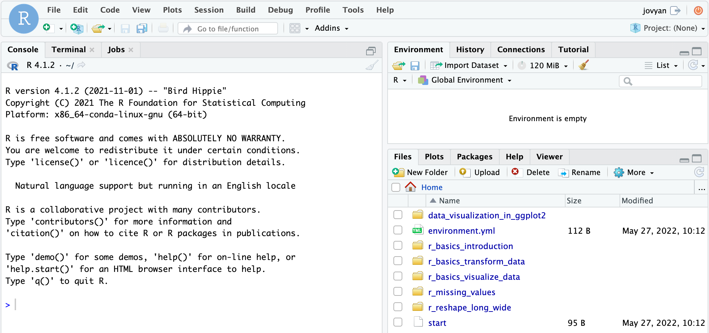

<!--

author:   Rose Hartman
email:    hartmanr1@chop.edu
version:  1.1.1
module_template_version: 3.0.0
language: en
narrator: UK English Female
title: Missing Values in R
comment:  A practical demonstration of how missing values show up in R and how to deal with them. Note that this module does **not** cover statistical approaches for handling missing data, but instead focuses on the code you need to find, work with, and assign missing values in R.
long_description: This is a beginner's guide to handling missing values in R. It covers what `NA` values are and how to check for them, how to mark values as missing, how to work around missing values in your analysis, and how to filter your data to remove missingness. This module is appropriate for learners who feel comfortable with R basics and are ready to get into the realities of data analysis, like dealing with missing values.

estimated_time: 45 min

@learning_objectives  

After completion of this module, learners will be able to:

- check the number and location of missing values in a dataframe
- mark values as missing
- use common arguments like `na.rm` and `na.action` to control how functions handle missingness
- remove cases with missing values from a dataframe

@end

@version_history
1.1.1: add information about Posit Cloud

@end

script:  https://code.jquery.com/jquery-3.6.0.slim.min.js

@gifPreload
<script>
(function($) {

  // Get the .gif images from the "data-alt".
	var getGif = function() {
		var gif = [];
		$('img').each(function() {
			var data = $(this).data('alt');
			gif.push(data);
		});
		return gif;
	}

	var gif = getGif();

	// Preload all the gif images.
	var image = [];

	$.each(gif, function(index) {
		image[index]     = new Image();
		image[index].src = gif[index];
	});

	// Change the image to .gif when clicked and vice versa.
	$('figure').on('click', function() {

		var $this   = $(this),
				$index  = $this.index(),

				$img    = $this.children('img'),
				$imgSrc = $img.attr('src'),
				$imgAlt = $img.attr('data-alt'),
				$imgExt = $imgAlt.split('.');

		if($imgExt[1] === 'gif') {
			$img.attr('src', $img.data('alt')).attr('data-alt', $imgSrc);
		} else {
			$img.attr('src', $imgAlt).attr('data-alt', $img.data('alt'));
		}

		// Add play class to help with the styling.
		$this.toggleClass('play');

	});

})(jQuery);
</script>
@end

link:  https://chop-dbhi-arcus-education-website-assets.s3.amazonaws.com/css/styles.css
script: https://kit.fontawesome.com/83b2343bd4.js

-->

# Missing Values in R

<div class = "overview">

## Overview
@comment

**Is this module right for me?** @long_description

**Estimated time to completion:** @estimated_time

**Pre-requisites**

This module assumes familiarity with R basics, including using dplyr tools to do basic transformation including choosing only certain columns or rows of a data frame and changing or adding columns.  
If you need to learn these basics, we suggest our [R Basics: Introduction](https://liascript.github.io/course/?https://raw.githubusercontent.com/arcus/education_modules/main/r_basics_introduction/r_basics_introduction.md) module and our [R Basics: Transform Data](https://liascript.github.io/course/?https://raw.githubusercontent.com/arcus/education_modules/main/r_basics_transform_data/r_basics_transform_data.md) module.

This module also uses several R functions as examples to demonstrate how missing values work across a variety of settings, but it's fine if you don't have any experience with the example functions used.
When example functions for plotting or statistical tests appear in the module, there will be links provided for you to learn more about those functions if you're curious about them, but it's also fine to ignore that and just focus on how the missing values are handled.    

**Learning Objectives**

@learning_objectives

</div>

## Lesson Preparation: Our RStudio Environment

Please do this step now, because we're going to ask you to follow along throughout and try out code as you go.  

Please read over all the options before you start performing any actions, to make sure you pick the right option for you.

<h3>Option 1: Work Anonymously in the Cloud</h3>

This might work well for you if you either can't or don't want to install R and RStudio on your computer.  The benefit is that you don't have to install anything or have any account set up with an online cloud provider.  This solution is completely anonymous.  However, there are some drawbacks.  One negative is that this option requires a bit of waiting for your environment to come online.  Another is that your changes aren't saved anywhere, and your environment will time out and disappear forever.  

**First**, we need to create a small container in the cloud for you to work in just using your web browser.  **Click "Launch binder" below.**  It might take a while (5 minutes) to create, depending on how recently it was created (when it's being used more, it's quicker!).  We're looking for a faster way to get you off and running in RStudio without downloads and without creating accounts, but for now this is a great, free way for us to get you working with no extra work on your part.

  <a href = "https://mybinder.org/v2/gh/arcus/education_r_environment/main?urlpath=rstudio" target = "_blank"></a> **← Click the "launch binder" button!**

<div class = "important" style = "align-items: center; display: flex;">
<b style="color: rgb(var(--color-highlight));">Important note</b><br>

<div style = "margin: 1rem; max-width: 45%; float:left;"> If you're the first person to fire up this environment in a while, you might see this loading screen for up to five minutes.  Be patient!</div>
<div style = "margin: 1rem auto; max-width: 45%; float:left;"> <!--
style = "border: 1px solid rgb(var(--color-highlight));"-->
</div>
</div>

**Then**, once you have access to RStudio and you see something like the image below, you'll need to open the sample data for this course.  In the file area to the lower right, you'll see, among multiple choices, the folder called "r\_missing\_values".  That's the code for this module!

<!--
style = "border: 1px solid rgb(var(--color-highlight)); max-width: 800px;"-->

<h3>Option 2: Use Posit Cloud</h3>

Posit (the company formerly known as RStudio) provides a multi-tiered cloud environment for using RStudio.  Unlike option 1 above, this option does require you to have an account with Posit Cloud, their online RStudio server.  The good news is that the base level of Posit Cloud is free!

First, you'll need to [create a (free!) Posit cloud account](https://posit.cloud/plans).  

Then, once you're logged in at https://posit.cloud/, open the "education\_r\_environment" project at https://posit.cloud/content/5273350.  That will give you a temporary copy so you can run our code, but not make any changes to it.

In the file area to the lower right, you'll see, among multiple choices, the folder called "r\_missing\_values".  That's the code for this module!

Click on "Save a Permanent Copy" if you want to save any changes to your version of this code. 

<!--
style = "border: 1px solid rgb(var(--color-highlight)); clear:both;"-->

Now you can not only work in the cloud, but also save your work.

<h3>Option 3: Work on Your Computer</h3>

If you have [R](https://www.r-project.org/) and [RStudio](https://www.rstudio.com/products/rstudio/download/#download) installed already on your local computer, you might be interested in simply downloading our sample code to your computer. Here's how.  Note: If you've already done this step in another module, you might have the material for this module already!

* In RStudio, open a new project (File, New Project)
* Select Version Control, then Git
* Drop this link into the "Repository URL": https://github.com/arcus/education_r_environment
* Change the "Project directory name" and "Create project as a subdirectory of" boxes to suit your needs (where will this code be stored on your computer?).
* Click to select the "Open in new session" checkbox
* Click "Create Project"
* In the file area to the lower right, you'll see, among multiple choices, the folder called "r\_missing\_values".  That's the code for this module!

**Want to watch this process?  Click on the image below to play an animated gif.  It will continue to loop and you can re-start it by clicking again.**

<div style="display:none">

@gifPreload

</div>

<figure>

  

<figcaption style = "font-size: 1em;">

Click on the image to play the demo of the above steps!

</figcaption>

</figure>

If you already completed this work for a previous module, and it's been a while since you downloaded this project to your computer, you may want to get any new and improved files that have been placed there in the meantime:

* Open your project.
* In the Version Control menu, choose "pull branches".  There are two places to do this, as shown below:

<!-- style = "border: 1px solid rgb(var(--color-highlight)); max-width:400px;" -->  
<!-- style = "border: 1px solid rgb(var(--color-highlight)); max-width:400px;" -->

<div class = "warning">
<b style="color: rgb(var(--color-highlight));">Warning!</b><br>

If you're pulling branches after having worked in other R modules, you might have made local changes (for example, when you filled in exercise code) that will be overwritten by pulling the latest version.  If you want to save your changes, consider making a copy of any exercise files and naming them something new.  For example, if you have already worked in the `r_basics_transform_data` exercise files, you might want to save your version of `transform_exercises.Rmd` to `my_transform_exercises.Rmd`.  That way, you can pull down the latest version of code, overwriting `transform_exercises.Rmd` while holding on to your changes in the new file.

</div>

## What does "missing" look like in R?

Understanding the amount and type of missing data you have is crucial to conducting appropriate statistical analyses.
Although techniques for analyzing and correcting for different missingness patterns is outside the scope of this module,
one of the first steps in any of those techniques is checking how much missing data you have and on which variables, which we will cover here.

<div class = "learn-more">
<b style="color: rgb(var(--color-highlight));">Learning connection</b><br>

For an excellent introduction to different types of missing data, read Rubin's classic paper [Inference and Missing Data](http://math.wsu.edu/faculty/xchen/stat115/lectureNotes3/Rubin%20Inference%20and%20Missing%20Data.pdf).

</div>

Even if you won't be doing any formal techniques to correct for missing data, it's still important to know what missing data you have because it will impact your effective sample size.
Moreover, checking your missingness is one of the key steps you can take to understand your data quality and any cleaning steps that may be necessary.

So how can you tell when you have missing data in R?

Different statistical software mark missing values in different ways.
In R, missing values are marked with `NA`, which is short for "Not Available".

<div class = "behind-the-scenes">
<b style="color: rgb(var(--color-highlight));">Behind the scenes</b><br>

Technically, there are actually four different kinds of `NA`, one for each of the different data types in R. To learn more, read about [missing values in the free online book R for Data Science](https://r4ds.had.co.nz/vectors.html?q=missing#missing-values-4).

For most practical purposes, you don't need to know anything about these different kinds of `NA`, though; they all just mean "missing", and you can usually use `NA` to refer to all of them.

</div>

Here's an example of what some data with missing values might look like when printed in R:

<!-- data-type="none" -->
| sensor_id | PM2.5 | PM10 | O3 | NO2 |
| ---- | --- | --- | --- | --- |
| 0001 | 10 | 25 | 0.0 | 67 |
| 0002 | 13 | 21 |  NA | 71 |
| 0003 | 9  | NA |  NA | 64 |

Note that the second and third rows have `NA` instead of numerical values for some of the measurements.
The `NA` indicates a lack of any information for each of those cells; those values are missing.

<div class = "behind-the-scenes">
<b style="color: rgb(var(--color-highlight));">Behind the scenes</b><br>

**What about `NULL`?**

If you've been using R for a while, you may have seen `NULL` in some cases instead of `NA` when things are missing.
`NULL` is a bit different --- it doesn't stand in for missing data the way `NA` does, instead it shows up when you have an expression or function whose result is undefined (for example, a logical comparison whose result is neither `TRUE` nor `FALSE`).
If you'd like to learn more, check out this [blog post explaining the difference between `NA` and `NULL`](https://www.r-bloggers.com/2010/04/r-na-vs-null/).

If you're just beginning in R, though, you can safely ignore `NULL` for now.

</div>

### How to check for missing values

One way to see missing data in R is to take a look at the full dataset, either by printing it in the console or using `View()` to see it opened like a spreadsheet (to see examples of how to use `View()`, see this [tutorial on RStudio's data viewer](https://support.rstudio.com/hc/en-us/articles/205175388-Using-the-Data-Viewer-in-the-RStudio-IDE)).
Then you can just scan visually for `NA` cells, as in the example table in the previous section.
If your dataset is anything larger than a handful of rows and columns, though, you'll want a way to summarize that information without having to count everything by hand yourself.

There are many functions available to check for missing values in R, but one especially handy one is the `summary()` function.
It gives you some basic summary information about each variable in your data (minimum and maximum values, etc.), and will also tell you how many missing values you have for each variable.
Because it gives you summary statistics and missingness information at the same time, many people like to use it as a quick way to check their data as a start to their [exploratory data analysis](https://r4ds.had.co.nz/exploratory-data-analysis.html).

<div class = "options">
<b style="color: rgb(var(--color-highlight));">Another option</b><br>

There are many more options for how to explore missing values in R!

For some handy visualizations of missingness, see the [`visdat` package](https://cran.r-project.org/web/packages/visdat/vignettes/using_visdat.html), and the [`missmap` function from the `Amelia` package](https://www.rdocumentation.org/packages/Amelia/versions/1.8.0/topics/missmap).

</div>

Now **return to your RStudio instance** to work through practical examples on how to check for missing values in R.

In your R environment, open the file `missing_values_exercises.Rmd` from within the `r_missing_values` folder.
You'll start at the top of the file and work until you see the message to return to the module on line 96.

### Quiz: Missing values

True or False: The only way to check for missing values in R is by using the `summary()` function.

[( )] True
[(X)] False
****
<div class = "answer">

Although it's the only function we demonstrated in depth, there are lots and lots of options other than `summary()` for exploring missing values in your data!

For some alternate options, check out the tutorials listed in the [Additional Resources](#additional-resources) section at the end.
Play around with different methods and find something that works well for you and the kinds of data you work with most.

</div>
****

Why might you need to know which variables in your data have missing values? Select all that apply.

[[X]] Checking for missing data can help you know whether the data were read in correctly
[[X]] Missing values can change the effective sample size for analysis
[[X]] Depending on how much data is missing and the pattern of missingness, you might need to apply statistical corrections to be able to run your planned analyses
****
<div class = "answer">

All of these are important reasons to check for missing values in your data.

In many cases, you know beforehand whether there should be any missing values on particular variables in your data.
After you import the data into R, checking for missingness can give you a sense for whether the data were imported correctly.
For example, if you were expecting some missingness on a given variable and you see none, it can give you a hint that the missing values in the raw data aren't being correctly interpreted.

When you have missing values, the sample size that you can actually use for your analysis is often reduced.
For example, if you collect 100 samples, but 20 of them are missing at least some of the measurements, you might only have 80 complete samples you can analyze.

If you have substantial missingness (a good rule of thumb is 5% or more of your data are missing), then you may need special statistical techniques to be able to analyze the data without introducing bias.
Such techniques are outside the scope of this module, but there are lots of excellent papers and tutorials available with instructions.  

</div>
****

## Assigning values to missing

As part of your data exploration, you may notice values for some variables that are impossible or extremely unlikely.

For example, imagine you have a dataset called `df` with a variable called `rating`.
You know it's on a scale from 1-5, so respondents weren't able to rate it as anything outside of those options.
And yet, when you read in the data you see there are a handful of -99 scores for this variable.
Depending on the data collection mechanism, these may be the result of typos during data entry or a systematic way of marking invalid or missing responses.
Either way, you don't want to treat those -99 scores as actual responses to the question (imagine how they would distort the estimate of the mean for that variable!); instead, you can mark them missing so they'll be excluded from analysis.

Here's some code to assign the -99 values in our pretend dataset to missing:

```r
mutate(df, rating = ifelse(rating == -99, NA, rating))
```

Let's break that down.

We're using a `mutate` command to change ("mutate") a variable (a column of data), and we're setting what the new value of this column should be by using a special conditional function, the `ifelse` function.
The `ifelse` command is what's called a ternary operator, and it has three parts:

 * a conditional test
 * a value to use if the test returns `TRUE`
 * a value to use if the test returns `FALSE`.

Our `ifelse` statement begins with a conditional test, in this case `rating == -99`.

<div class = "help">
<b style="color: rgb(var(--color-highlight));">Troubleshooting help</b><br>

Remember that the double equals sign is a comparison --- it's **asking** whether `rating` is equal to -99, while a single equals sign is a "setter", and it will try to **make** `rating` equal to -99.  

</div>

For each value in `rating`, it will run the test and return either `TRUE` or `FALSE`.
If it returns `TRUE`, then it assigns the next argument, in this case `NA`, which will mark that value missing.


If it returns `FALSE`, then it assigns the last argument, in this case `rating`, which will leave the value untouched.


So for any `rating` values that equal -99, we're asking it to replace them with `NA`, otherwise leave them as they were.

<div class = "learn-more">
<b style="color: rgb(var(--color-highlight));">Learning connection</b><br>

For more on `mutate` and `ifelse`, see the [R Basics: Data Transformation sections on `mutate`](https://liascript.github.io/course/?https://raw.githubusercontent.com/arcus/education_modules/main/r_basics_transform_data/r_basics_transform_data.md#the-mutate%28%29-function) and [logical operators](https://liascript.github.io/course/?https://raw.githubusercontent.com/arcus/education_modules/main/r_basics_transform_data/r_basics_transform_data.md#logical-operators), and the [`ifelse` section in the free online book Advanced R](https://adv-r.hadley.nz/control-flow.html#vectorised-if).

</div>

We could make this command more general by replacing all values that fall outside of the 1-5 scale with `NA`:

```r
mutate(df, rating = ifelse(rating < 1 | rating > 5, NA, rating))
```

Here we're using [the "or" operator](https://www.statmethods.net/management/operators.html) `|` to combine two tests together.
So this checks whether each `rating` value is less than 1 or greater than 5, and if so changes it to `NA`.
Otherwise it leaves it as it was.

<div class = "options">
<b style="color: rgb(var(--color-highlight));">Another option</b><br>

There is another function, `case_when` from the `dplyr` package, that is similar to `ifelse` but can also handle more complex recoding situations.
For a situation like the one when have here, with a single logical test, `ifelse` works fine.
But if you find yourself needing multiple `ifelse` statements to recode a column, then `case_when` may be a better choice.
To learn more, see the [`case_when` help documentation](https://dplyr.tidyverse.org/reference/case_when.html).

</div>

Now **return to your RStudio instance** to work through some practical examples of assigning values to missing in R.
You'll start at line 99 and work until you see the message to return to the module on line 130.

### Quiz: Assigning values to missing

When might it be a good idea to mark values as missing? Select all that apply.

[[X]] Extremely unlikely outliers
[[X]] Values that are logically impossible
[[X]] Values that you know are meant to mark missing or invalid responses
****
<div class = "answer">

These are all perfectly reasonable situations in which to mark values as missing.

Note, however that you should be cautious when excluding observations in general.
Dropping outliers can become problematic when you might be excluding valid data (i.e. not typos or impossible values).
This is an especially important problem when you decide whether or not to drop outliers after checking the results of your analysis both ways, because that can lead to unintentional bias in your results.
To learn more, read [The Extent and Consequences of P-Hacking in Science](https://journals.plos.org/plosbiology/article?id=10.1371/journal.pbio.1002106).

</div>
****

## Working around missing values

Most real datasets have some missing values, and it's likely you'll want to be able to generate plots, run statistical analyses, etc. on those data, so how to work around the missing values is an important question.

In general, there are two basic options: Skip over missing stuff and just run the calculations on whatever data are available (this is sometimes called ["listwise deletion" or "complete case analysis"](https://www.theanalysisfactor.com/when-listwise-deletion-works)), or stop everything and throw an error if there are missing values in the calculations.

As you move to more complex functions, though, the options for handling missingness can become more complex as well.
The example code will walk you through several R functions with different kinds of options for handling missingness. In particular, we'll talk about the following functions:

- `mean`, which calculates the [mean or average](https://www.khanacademy.org/math/cc-sixth-grade-math/cc-6th-data-statistics/mean-and-median/v/statistics-intro-mean-median-and-mode?modal=1) of a set of numbers
- `prcomp`, which runs a [Principal Components Analysis (PCA)](https://www.theanalysisfactor.com/tips-principal-component-analysis/)
- `geom_point`, from the [ggplot2 data visualization package](https://ggplot2.tidyverse.org/index.html), which is used to create [scatterplots](https://ggplot2.tidyverse.org/reference/geom_point.html)
- `cor`, which is used to generate a [correlation matrix](https://www.displayr.com/what-is-a-correlation-matrix/)

<div class = "care">
<b style="color: rgb(var(--color-highlight));">A little encouragement...</b><br>

**Are these functions new to you? No problem!**

You don't need to understand the underlying statistics for any of these functions to work through the R code and learn from the missingness examples.

If you want to learn more about these functions and what they do, click through the links above for explanations and tutorials.

</div>

Now **return to your RStudio instance** to work through practical examples of how R handles missing values in each of those functions.
You'll start at line 133 and work until you see the message to return to the module on line 238.

### Quiz: Working around missing values

True or False: The output from R functions usually tells you how missing data were handled.

[( )] True
[(X)] False
****
<div class = "answer">

Although some functions, like `geom_point`, provide a warning when dropping missing values, many functions in R do not. We saw an example of this with the `prcomp` function.

</div>
****

If you want R to skip over missing values and give you the results based only on the available data, which argument might you use?

[(X)] `na.rm = TRUE`
[( )] `na.rm = FALSE`
****
<div class = "answer">

For functions that have an `na.rm` argument, like `mean()` does, setting `na.rm = TRUE` will give you the result ignoring missing values.
The default setting for most of these functions is `na.rm = FALSE`, which will return `NA` as the result whenever there are missing values present.

</div>
****

Which of the following are typical options for the argument `na.action`? Select all that apply.

[[X]] `na.omit`
[[X]] `na.fail`
[[ ]] `na.pairwise`
[[X]] `na.exclude`
[[ ]] `na.skip`
****
<div class = "answer">

Typical options for `na.action` are `na.omit`, `na.exclude`, and `na.fail`.
The first two drop any observations with missing values for the variables in the analysis (listwise deletion), and `na.fail` stops the analysis and gives you an error message if it encounters any missing values.

The difference between `na.omit` and `na.exclude` is subtle, and it only matters when you're running models from which you might generate predictions, or when you want to analyze the model residuals.
To learn more, see this [post explaining the difference between `na.omit` and `na.exclude`](https://stats.stackexchange.com/questions/492955/should-i-use-na-omit-or-na-exclude-in-a-linear-model-in-r).
In general, you'll get the same results either way, but `na.exclude` will preserve the fact that there was missingness, so most people prefer to use that over `na.omit`.

`na.skip` and `na.pairwise` are not typical options for `na.action`.
To skip missing values, use `na.omit` or `na.exclude`.
For special functions that have extra options for pairwise complete observations (like `cor`), it's an entirely separate argument (the `use` argument for `cor`), not part of `na.action`.  

</div>
****

## Filtering out missing values

Sometimes you want to create a new version of your data that excludes cases with missing values.
This can be especially important if you want to make sure you're using a consistent dataset across several related analyses.

For example, let's say you ran a study on the relationship between cortisol levels and time spent on a challenging task.
In addition to measuring cortisol and how long participants spent on the task, you also collected a set of demographic variables and background information like age, education level, and socio-economic status.

Because the main focus of your analysis is on cortisol, you want to exclude any participants who have missing cortisol values (perhaps because of problems with the saliva sample they provided), even from parts of the analysis that don't use the cortisol data directly.
For example, you may begin your analysis by describing your participants with summary statistics on their demographic information (e.g. what is the median age in this sample?). If some of those participants have missing cortisol values, you want them excluded from the demographic summaries as well. The most straightforward way to do this is to save a new version of your data that only includes the observations you want in your final analysis, and to use that for all of your calculations.

There are a few different options for doing that in R.
We'll walk through two common approaches to filtering out missing data:

- `na.omit()`
- `filter()` with `is.na()`

Now **return to your RStudio instance** to work through practical examples of filtering our missing values in R.
You'll start at line 241 and work until the end of the file.

### Quiz: Filtering out missing values

What is the function to drop all cases from a dataframe with missing values on any variable?

[[na.omit()]]
<script>
let input = "@input".trim()
input == "na.omit()" || input == "na.omit"
</script>
****
<div class = "answer">

It is also possible to drop cases with missing values by using `filter()` or other similar options, but `na.omit()` is the simplest.

</div>
****

True or False: The function from the previous answer also works to just drop cases where values are missing on certain variables.

[( )] True
[(X)] False
****
<div class = "answer">

`na.omit()` is just for removing cases where there's missingness on any variable.
If you want to target just one or more specific variables and remove cases with missing values on those variables, you need to use something like `filter` instead.

</div>
****

## Additional Resources

There are many excellent tutorials online about missing data in R. Many of them cover a lot of the same information presented here, but you may find a different perspective helpful to consolidate your learning. Here are a couple good ones:

- [Just Enough R](https://benwhalley.github.io/just-enough-r/missingvalues.html)
- [The Epidemiologist R Handbook](https://epirhandbook.com/en/missing-data.html)

For more powerful analysis of missing data in R, checkout the [`Amelia` package](https://gking.harvard.edu/amelia) and the [`mice` package](https://amices.org/mice/).

## Feedback

In the beginning, we stated some goals.

**Learning Objectives:**

@learning_objectives

We ask you to fill out a brief (5 minutes or less) survey to let us know:

* If we achieved the learning objectives
* If the module difficulty was appropriate
* If we gave you the experience you expected

We gather this information in order to iteratively improve our work.  Thank you in advance for filling out [our brief survey](https://redcap.chop.edu/surveys/?s=KHTXCXJJ93&module_name=%22Missing+Values+in+R%22)!