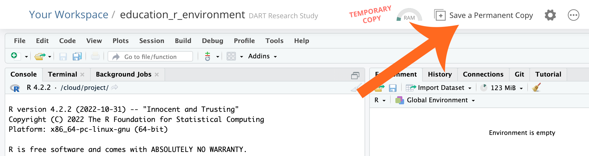

<!--

author:   Meredith Lee
email:    leemc@chop.edu
version: 1.0.3
current_version_description: Initial version
module_type: exercise
docs_version: 2.0.0
language: en
narrator: UK English Female
mode: Textbook
title: R Practice
comment: Use the basics of R coding, data transformation, and data visualization to work with real data.
long_description: When learning R for data science, the ultimate goal is to be able to put all of the pieces together to analyze a dataset. This module aims to provide a data science task in order to help learners practice R skills in a real-world context.
estimated_time_in_minutes: 60

@pre_reqs
Learners should be familiar with [the basics of R coding](https://liascript.github.io/course/?https://raw.githubusercontent.com/arcus/education_modules/main/r_basics_introduction/r_basics_introduction.md#1), including [data transformation with dplyr](https://liascript.github.io/course/?https://raw.githubusercontent.com/arcus/education_modules/main/r_basics_transform_data/r_basics_transform_data.md#1) and [data visualization with ggplot2](https://liascript.github.io/course/?https://raw.githubusercontent.com/arcus/education_modules/main/data_visualization_in_ggplot2/data_visualization_in_ggplot2.md#1). Learners should also have access to R, either on their own computer or in the cloud.
@end

@learning_objectives
After completion of this module, learners will be able to:

- Import a dataset from an online database
- Recode data and change variable types in a dataframe
- Use exploratory data visualization to identify trends in data and generate hypotheses
@end

good_first_module: false
coding_required: true
coding_level: intermediate
coding_language: r

@sets_you_up_for

@end

@depends_on_knowledge_available_in
- r_basics_transform_data
- r_basics_visualize_data
- r_reshape_long_wide
- r_summary_stats
- data_visualization_in_ggplot2
@end

@version_history
No previous versions.
@end

import: https://raw.githubusercontent.com/arcus/education_modules/main/_module_templates/macros.md
-->

# R Practice
@overview

## Lesson Preparation

For this module, you'll need access to R, either on your own computer or in the cloud. For details about how to download R, you can take a look at the [preparation section of our R Basics: Introduction module](https://liascript.github.io/course/?https://raw.githubusercontent.com/arcus/education_modules/main/r_basics_introduction/r_basics_introduction.md#5). If you'd prefer to work in the cloud, [posit.cloud](https://posit.cloud/) is a cloud-based R notebook environment.

## Topics to Review

- Loading libraries
- Reading a CSV and creating a data frame
- Editing/recoding data
- Exploratory data visualization

Stretch topics
=====

There are a couple of additional skills that haven't been introduced in a module yet, but that might come in handy solving this data science problem:

- Correlation matrices
- Heat maps

<b style="color: rgb(var(--color-highlight));">A little encouragement...</b> 

Finding correlations and creating heat maps are not topics that you have learned in preceding modules or in other prior learning -- which means you might need to do some searching to figure out how to do them! This is an important step in your development as a programmer and a data scientist, but don't worry if it seems difficult in the beginning; it'll get easier with practice. To start, try googling "R" and "correlations" and see where it takes you.

## The Data

For this practice module we will be using real, publicly-available cervical cancer data from [UC Irvine's machine learning data repository](http://archive.ics.uci.edu/). To download the data file, [follow this link to the cervical cancer risk factors dataset](http://archive.ics.uci.edu/dataset/383/cervical+cancer+risk+factors) and click the "Download" button, which you should see on the right of the page. 

 If you have done the [Python Practice Module](https://liascript.github.io/course/?https://raw.githubusercontent.com/arcus/education_modules/main/python_practice/python_practice.md), this dataset might be familiar! 

## Practice Problem

According to the UCI Machine Learning database, the Cervical Cancer (Risk Factors) dataset "focuses on the prediction of indicators/diagnosis of cervical cancer. The features cover demographic information, habits, and historic medical records."

Your Task
=====

1. Explore [the Cervical Cancer (Risk Factors) dataset](http://archive.ics.uci.edu/dataset/383/cervical+cancer+risk+factors) and
2. Use the R skills that you've learned to **develop a hypothesis about some likely risk factors** for a diagnosis of cervical cancer.  

Remember that there are several ways to approach this task; there is no one right answer! So have fun, and good luck!

### Stuck?

If this practice problem was challenging, [here is a link to an example notebook](https://github.com/arcus/education_r_environment/blob/main/r_practice/r_practice.Rmd) where we go through one possible solution to the practice problem.

To work with our sample solution, you could do any of the three possibilities below:

* Copy / paste the code from the link above

  * You can use the "Copy" button which looks like two pieces of paper in the menu bar across the top of the file:
  <!--
style = "border: 1px solid rgb(var(--color-highlight));"-->

  * Or you can just use your mouse and highlight all the code, and use the "copy" keyboard shortcut
  * Paste the sample code into your own R Markdown file

* Make a clone of the "education\_r\_environment" repository:

  * In RStudio, open a new project (File, New Project)
  * Select Version Control, then Git
  * Drop this link into the "Repository URL": https://github.com/arcus/education_r_environment
  * Change the "Project directory name" and "Create project as a subdirectory of" boxes to suit your needs (where will this code be stored on your computer?).
  * Click to select the "Open in new session" checkbox
  * Click "Create Project"
  * In the file area to the lower right, you'll see, among multiple choices, the folder called "r\_practice". That's the code for this module!

* Use Posit.Cloud:

  * [Create a (free!) Posit Cloud account](https://posit.cloud/plans)
  * Open the "education\_r\_environment" project at https://posit.cloud/content/5273350.  That will give you a temporary copy so you can run our code, but not make any changes to it.
  * Click on "Save a Permanent Copy" if you want to save any changes to your version of this code.
  <!--
style = "border: 1px solid rgb(var(--color-highlight));"-->

We encourage you to spend some time playing around with the data before you look at the example! And remember, just because your solution doesn't look exactly like the example doesn't mean it's wrong-- there are a variety of ways you might have approached the task we gave you.  

<b style="color: rgb(var(--color-highlight));">A little encouragement...</b> 

Feeling overwhelmed? Learning data science in R take time and practice. Don't worry if you feel like you have to go back and look and the modules over and over, or Google lots of things-- folks who do this for a living Google things every day! You don't have to memorize everything. Just keep your favorite resources close at hand so you remember what tools you have access to.

## Additional Resources

The best way to continue learning R for data science is to **do data science with R**! Here are some sources of publicly-available data that you can download and start practicing with today:

- [Kaggle.com](https://www.kaggle.com/) has a lot datasets to practice with, and even competitions and short courses!
- [World Bank Data](https://data.worldbank.org/)-- this repository has many global development datasets
- [Data.gov](https://data.gov/)
- And so many more! Try searching "open" or "public" data and see what you can find!

A great way to keep resources close at hand is to use cheat sheets:

- [Posit.co](https://posit.co/about/) has many cheat sheets available to download, including one for [data transformation with dplyr](https://posit.co/wp-content/uploads/2022/10/data-transformation-1.pdf), [data visualization with ggplot2](https://posit.co/wp-content/uploads/2022/10/data-visualization-1.pdf).

And as always, [R for Data Science](https://r4ds.had.co.nz/) is always a great resource!

## Feedback
@feedback
