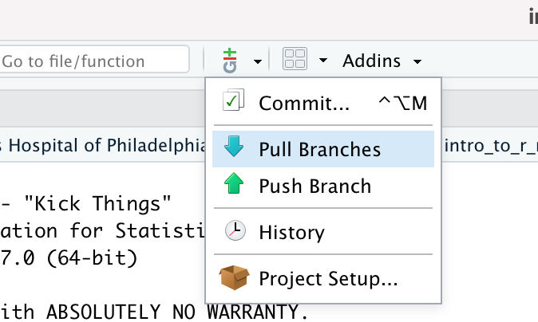

<!--
author:   Joy Payton
email:    paytonk@chop.edu
version:  1.0.0
module_template_version: 2.0.0
language: en
narrator: US English Female
title: Reshaping Data in R: Long and Wide Data
comment:  A module that teaches how to reshape tabular data in R, concentrating on some typical shapes known as "long" and "wide" data.
long_description: Reshaping data is one of the essential skills in getting your data in a tidy format, ready to visualize, analyze, and model.  This module is appropriate for learners who feel comfortable with R basics and are ready to take on the challenges of real life data, which is often messy and requires considerable effort to tidy.

estimated_time: 1 hour

@learning_objectives  

After completion of this module, learners will be able to:

- Define and differentiate "long data" and "wide data"
- Use tidyr and dplyr tools to reshape data effectively


@end
script:  https://code.jquery.com/jquery-3.6.0.slim.min.js

@gifPreload
<script>
(function($) {

  // Get the .gif images from the "data-alt".
	var getGif = function() {
		var gif = [];
		$('img').each(function() {
			var data = $(this).data('alt');
			gif.push(data);
		});
		return gif;
	}

	var gif = getGif();

	// Preload all the gif images.
	var image = [];

	$.each(gif, function(index) {
		image[index]     = new Image();
		image[index].src = gif[index];
	});

	// Change the image to .gif when clicked and vice versa.
	$('figure').on('click', function() {

		var $this   = $(this),
				$index  = $this.index(),

				$img    = $this.children('img'),
				$imgSrc = $img.attr('src'),
				$imgAlt = $img.attr('data-alt'),
				$imgExt = $imgAlt.split('.');

		if($imgExt[1] === 'gif') {
			$img.attr('src', $img.data('alt')).attr('data-alt', $imgSrc);
		} else {
			$img.attr('src', $imgAlt).attr('data-alt', $img.data('alt'));
		}

		// Add play class to help with the styling.
		$this.toggleClass('play');

	});

})(jQuery);
</script>
@end

link:  https://chop-dbhi-arcus-education-website-assets.s3.amazonaws.com/css/styles.css
script: https://kit.fontawesome.com/83b2343bd4.js
-->
# Reshaping Data in R: Long and Wide Data

<div class = "overview">

## Overview

@comment

**Is this module right for me?** @long_description

**Estimated time to completion:** @estimated_time

**Pre-requisites**

This module assumes familiarity with R basics, including ingesting .csv data and using dplyr tools to do basic transformation including choosing only certain columns or rows of a data frame.  If you need to learn these basics, we suggest our [R Basics: Introduction](https://liascript.github.io/course/?https://raw.githubusercontent.com/arcus/education_modules/main/r_basics_introduction/r_basics_introduction.md) module and our [R Basics: Transform Data](https://liascript.github.io/course/?https://raw.githubusercontent.com/arcus/education_modules/main/r_basics_transform_data/r_basics_transform_data.md) module

**Learning Objectives**

@learning_objectives

</div>

## Data Shapes

Importantly, we're only dealing with "rectangular" data here. Rectangular data (or **"tabular"** data, from the word "table") has rows and columns.  Rectangular data (such as rows and columns of demographic or biosample data) is by no means the only data that matters to biomedical researchers.  For example, wave form data, genomics files, and audio recordings can all be important data for research.  That kind of data is out of scope for this module, however.

A rectangular data set can take on a lot of different rectangular shapes with different styles of organizing data. Some disciplines have specific types of summary tables, for example, that customarily appear in published manuscripts.  The one method or shape that is best suited for data analysis is known as "tidy".

Two rectangular data shapes are the "long" and "wide" formats.

### Wide Data

We'll start with wide data, which may be more familiar to you.  Wide data stores variables in columns, with (ideally) each variable assigned its own column.  Consider, for example, some fabricated biosample data.  In this study, research subjects have come in for one or two biosample data collections.  Either blood or saliva was taken.  This is the way data might be stored in REDCap, for example, if you use events with suffixes to indicate which event.

subject_id | biosample_id_1 | collection_date_1 | collection_time_1 | sample_type_1 | collection_method_1 | collected_by_id_1 | sample_size_1 | biosample_id_2 | collection_date_2 | collection_time_2 | sample_type_2 | collection_method_2 | collected_by_id_2 | sample_size_2
--- | --- | --- | --- | --- | --- | --- | --- | --- | --- | --- | --- | --- | --- | --- |
876123 | 3380629109 | 2019-05-14 | 9:15 | blood | venipuncture | 4511 | 10 ml | 3380629887 | 2019-05-14 | 18:34 | blood | venipuncture | 4511 | 10 ml
612351 | 3531370968 | 2019-06-04 |  | blood | venipuncture | 7124 | 10 ml | 4182110569 | 2020-02-14 | 13:55 | blood | venipuncture | 3201 | 10 ml
716978 | 3860881351 | 2019-10-20 | 10:45 | saliva | swab | 4511 | 4 g |  |  |  |  |  |  |
321900 | 4190070221 | 2020-02-25 |  | saliva | swab | 7124 | NA |  |  |  |  |  |  |
342855 | 4348365204 | 2020-06-19 | 15:20 | blood | venipuncture | NA | 10 ml |  |  |  |  |  |  |
901284 | 4377143652 | 2020-08-10 |  | blood | venipuncture | 3201 | 10 ml |  |  |  |  |  |  |

### Long Data

Compare that with long data, which might seem less familiar.  Long data has one or more columns that uniquely identify an observation, then just one column that discloses the name of a measured variable, and one column that gives the value of that variable.

The long data below, which focuses on the `biosample_id` (which is unique for each biosample) instead of the `subject_id`, has the same information as the wide data above.  However, the data is organized in a format that features **keys** (or **names**) and **values** appearing in **key-value pairs**.  You'll also notice that we've changed the variable names to remove the `_1` and `_2` suffixes used to indicate a first or second collection and instead added a "sequence" variable to state that information.

| biosample_id | key |	value |
| --------- | --- | --- |
| 3380629109 | subject_id | 876123 |
| 3380629109 | collection_date | 2019-05-14 |
| 3380629109 | collection_time | 09:15:00 |
| 3380629109 | sample_type | blood |
| 3380629109 | collection_method | venipuncture |
| 3380629109 | collected_by_id | 4511 |
| 3380629109 | sample_size | 10 ml |
| 3380629109 | sequence | 1 |
| 3531370968 | subject_id | 612351 |
| 3531370968 | collection_date | 2019-06-04 |
| 3531370968 | sample_type | blood |
| 3531370968 | collection_method | venipuncture |
| 3531370968 | collected_by_id | 7124 |
| 3531370968 | sample_size | 10 ml |
| 3531370968 | sequence | 1 |
| 3860881351 | subject_id | 716978 |
| 3860881351 | collection_date | 2019-10-20 |
| 3860881351 | collection_time | 10:45:00 |
| 3860881351 | sample_type | saliva |
| 3860881351 | collection_method | swab |
| 3860881351 | collected_by_id | 4511 |
| 3860881351 | sample_size | 4 g |
| 3860881351 | sequence | 1 |
| 4190070221 | subject_id | 612351 |
| 4190070221 | collection_date | 2020-02-25 |
| 4190070221 | sample_type | saliva |
| 4190070221 | collection_method | swab |
| 4190070221 | collected_by_id | 7124 |
| 4190070221 | sequence | 1 |
| 4348365204 | subject_id | 342855 |
| 4348365204 | collection_date | 2020-06-19 |
| 4348365204 | collection_time | 15:20:00 |
| 4348365204 | sample_type | blood |
| 4348365204 | collection_method | venipuncture |
| 4348365204 | sample_size | 10 ml |
| 4348365204 | sequence | 1 |
| 4377143652 | subject_id | 901284 |
| 4377143652 | collection_date | 2020-08-10 |
| 4377143652 | sample_type | blood |
| 4377143652 | collection_method | venipuncture |
| 4377143652 | collected_by_id | 3201 |
| 4377143652 | sample_size | 10 ml |
| 4377143652 | sequence | 1 |
| 3380629887 | subject_id | 876123 |
| 3380629887 | collection_date | 2019-05-14 |
| 3380629887 | collection_time | 18:34 |
| 3380629887 | sample_type | blood |
| 3380629887 | collection_method | venipuncture |
| 3380629887 | collected_by_id | 4511 |
| 3380629887 | sample_size | 10 ml |
| 3380629887 | sequence | 2 |
| 4182110569 | subject_id | 612351 |
| 4182110569 | collection_date | 2020-02-14 |
| 4182110569 | collection_time | 13:55 |
| 4182110569 | sample_type | blood |
| 4182110569 | collection_method | venipuncture |
| 4182110569 | collected_by_id | 3201 |
| 4182110569 | sample_size | 10 ml |
| 4182110569 | sequence | 2 |

Why would you ever want data in long format?  Your eyes have to do a lot of work to keep track of all the variables for a given biosample.  Long data might seem awkward and not particularly useful.  However, getting data into a long format allows you to reshape the data effectively.  

In fact, you may also hear long data called "molten" data, and hear phrases like "melting" the data.  When something is molten or melted, it's easier to then "pour" that data into a new shape (you might hear "cast" or "mold" to describe this process).  It's easier to melt something down to reshape it, rather than take a shape you don't want, cut off bits and reattach them in the new shape.

Additionally, if you have lots of missing data (as in our example, in which only two of the subjects have completed both sample collections), storing data in a long format that eliminates missing data might be more efficient (it all depends on the number of missing values).

We'll work with long and wide data in R, so please use the next page to open the RStudio environment that's best for you.

## Quiz: Wide vs Long Data

<div class = "question">

Which of the following is true?

[[ ]] It's usually easier to reshape wide data into other wide formats than it is to reshape long data into wide data.
[[X]] Long data stores data in key-value pairs
[[ ]] Long data is more familiar and what tends to appear in journal articles
[[X ]] Wide data has multiple columns for variables
[[?]] There are several correct answers!
***********

<div class = "answer">

It's actually easier to reshape long data into wide data than it is to convert one kind of wide data to a different wide data shape.  This is why it's so useful to know how to turn wide data into long data!

Long data formats include data stored in key-value pairs, while wide data has multiple columns (1, 2, 100) for data.  The wide data format is what most people are used to seeing in journal articles, in .csvs, and in spreadsheets.

</div>

*******

</div>


## Lesson Preparation: Our RStudio Environment

Please do this step now, because we're going to ask you to follow along throughout and try out code as you go.  

Please read over both options before you start performing any actions, to make sure you pick the right option for you.

<h3>Option 1: Work in the Cloud</h3>

This might work well for you if you either can't or don't want to install R and RStudio on your computer.  The benefit is that you don't have to install anything, but one negative is that this option requires a bit of waiting for your environment to come online.

**First**, we need to create a small container in the cloud for you to work in just using your web browser.  **Click "Launch binder" below.**  It might take a while (5 minutes) to create, depending on how recently it was created (when it's being used more, it's quicker!).  We're looking for a faster way to get you off and running in RStudio without downloads and without creating accounts, but for now this is a great, free way for us to get you working with no extra work on your part.

  <a href = "https://mybinder.org/v2/gh/arcus/education_r_environment/main?urlpath=rstudio" target = "_blank"></a> **← Click the "launch binder" button!**

<div class = "hint" style = "align-items: center; display: flex;">

<div style = "margin: 1rem; max-width: 45%; float:left;"> If you're the first person to fire up this environment in a while, you might see this loading screen for up to five minutes.  Be patient!</div>
<div style = "margin: 1rem auto; max-width: 45%; float:left;"> <!--
style = "border: 1px solid rgb(var(--color-highlight));"-->
</div>
</div>

**Then**, once you have access to RStudio and you see something like the image below, you'll need to open the sample data for this course.  In the file area to the lower right, you'll see, among multiple choices, the folder called "r\_reshape\_long\_wide".  That's the code for this module!

<!--
style = "border: 1px solid rgb(var(--color-highlight)); max-width: 800px;"-->

<h3>Option 2: Work on Your Computer</h3>

If you have [R](https://www.r-project.org/) and [RStudio](https://www.rstudio.com/products/rstudio/download/#download) installed already on your local computer, you might be interested in simply downloading our sample code to your computer. Here's how.  Note -- if you've already done this step in another module, you might have the material for this module already!

* In RStudio, open a new project (File, New Project)
* Select Version Control, then Git
* Drop this link into the "Repository URL": https://github.com/arcus/education_r_environment
* Change the "Project directory name" and "Create project as a subdirectory of" boxes to suit your needs (where will this code be stored on your computer?).
* Click to select the "Open in new session" checkbox
* Click "Create Project"
* In the file area to the lower right, you'll see, among multiple choices, the folder called "r\_reshape\_long\_wide".  That's the code for this module!

**Want to watch this process?  Click on the image below to play an animated gif.  It will continue to loop and you can re-start it by clicking again.**

<div style="display:none">@gifPreload</div>

<figure>
  

<figcaption style = "font-size: 1em;">Click on the image to play the demo of the above steps!</figcaption>
</figure>

If you already completed this work for a previous module, and it's been a while since you downloaded this project to your computer, you may want to get any new and improved files that have been placed there in the meantime:

* Open your project.
* In the Version Control menu, choose "pull branches".  There are two places to do this, as shown below:

<!-- style = "border: 1px solid rgb(var(--color-highlight)); max-width:400px;" -->  
<!-- style = "border: 1px solid rgb(var(--color-highlight)); max-width:400px;" -->

<div class = "warning">
If you're pulling branches after having worked in other R modules, you might have made local changes (for example, when you filled in exercise code) that will be overwritten by pulling the latest version.  If you want to save your changes, consider making a copy of any exercise files and naming them something new.  For example, if you have already worked in the `r_basics_transform_data` exercise files, you might want to save your version of `transform_exercises.Rmd` to `my_transform_exercises.Rmd`.  That way, you can pull down the latest version of code, overwriting `transform_exercises.Rmd` while holding on to your changes in the new file.
</div>


## Pivots in `tidyr`

### `pivot_longer`

The `tidyr` package, a subset of the `tidyverse` suite of packages, includes two reshaping functions we'll use in this module.  We'll start with `pivot_longer`.  This function is used to reshape wide data, with multiple variable columns, into long data, with key-value pairs in a pair of columns that hold the variable name (or key) and the variable value.  Besides this pair of columns, there is a set of one or more leading columns that are used to uniquely identify an observation (for example, a sensor id, MRN, order number, or combination of name and date).

Visually, `pivot_longer` aims to transform a data frame that looks like this:

| name | age | fave_dinosaur | fave_movie |
| ---- | --- | ------------- | ---------- |
| Ayana | 8 | stegosaurus | Encanto |

To a data frame that looks like this:

| name | key | value |
| ---- | --- | ----- |
| Ayana | age | 8 |
| Ayana | fave_dinosaur | stegosaurus |
| Ayana | fave_movie | Encanto |

All of the column names, except for "name" (in this case), are converted to keys, and the value in the cells are converted to values.

Note that instead of "key" and "value" as the column headers, you could have other names that make more sense to you or your data users:

| name | variable_name | value |
| ---- | --- | ----- |
| Ayana | age | 8 |
| Ayana | fave_dinosaur | stegosaurus |
| Ayana | fave_movie | Encanto |

Sometimes you might have additional columns that help specify an observation (such as year).  Maybe we poll students about their preferences yearly and have wide data that looks like this:

| name | year | age | fave_dinosaur | fave_movie |
| ---- | --- | --- | ------------- | ---------- |
| Ayana | 2021 | 7 | stegosaurus | Coco |
| Ayana | 2022 | 8 | stegosaurus | Encanto |

Because the first two columns together indicate a single observation, we could pivot that data longer to look like this, keeping `name` and `year` and pivoting the rest of the variables.

| name | year | variable_name | value |
| ---- | --- | ----- | --- |
| Ayana | 2021 | age | 7 |
| Ayana | 2021 | fave_dinosaur | stegosaurus |
| Ayana | 2021 | fave_movie | Coco |
| Ayana | 2022 | age | 8 |
| Ayana | 2022 | fave_dinosaur | stegosaurus |
| Ayana | 2022 | fave_movie | Encanto |

### `pivot_wider`

Similarly, `pivot_wider` is a `tidyr` function.  It does the inverse of `pivot_longer` -- it takes a long data format and transforms it so that the column with variable names is transformed to become a set of columns and the column with values is transformed into cells placed in the correct intersection of row and column.  

Visually, `pivot_wider` transforms a data frame that looks like this:

| sensor_id | name | value |
| ---- | --- | --- |
| 0001 | PM2.5 | 10 |
| 0001 | PM10 | 25 |
| 0001 | O3 | 0.0 |
| 0001 | NO2 | 67 |

into something like this:

| sensor_id | PM2.5 | PM10 | O3 | NO2 |
| ---- | --- | --- | --- | --- |
| 0001 | 10 | 25 | 0.0 | 67 |

Sometimes, you'll have more than just one column that uniquely identifies the observation.  So your long data might look something like this:

| sensor_id | date | name | value |
| ---- | --- | --- | --- |
| 0001 | 2022-01-01 | PM2.5 | 10 |
| 0001 | 2022-01-01 | PM10 | 25 |
| 0001 | 2022-01-01 | O3 | 0.0 |
| 0001 | 2022-01-01 | NO2 | 67 |
| 0001 | 2022-01-05 | PM2.5 | 17 |
| 0001 | 2022-01-05 | PM10 | 35 |
| 0001 | 2022-01-05 | O3 | 0.1 |
| 0001 | 2022-01-05 | NO2 | 45 |

which can be pivoted into a wide data that looks like this:

| sensor_id | date | PM2.5 | PM10 | O3 | NO2 |
| ---- | --- | --- | --- | --- | --- |
| 0001 | 2022-01-01 | 10 | 25 | 0.0 | 67 |
| 0001 | 2022-01-05 | 17 | 35 | 0.1 | 45 |

## Using `pivot_longer`

`pivot_longer` has several required arguments or parameters (information we have to pass to it for it to work), as well as several optional arguments.  Let's take a look at the help file for `pivot_longer` to learn more.

In the Console of your RStudio, you'll first type `library(tidyverse)`, so that `tidyr` and other important packages load.  Once that happens, then type `?pivot_longer`.  You should get a long and possibly difficult to understand help file opening in the Files / Plots / Packages / Help / Viewer pane (usually the lower right corner of the screen).

Help files can be hard to understand, so let's walk through this help text.  It begins with a **Description** that briefly describes the aim of the function, without much detail.  This section is mostly useful to make sure you aren't confusing similarly-named functions.  Does this function do what you want it to do?  In our case, yes, it does. Then we can take on the much denser **Usage** section.  The usage section includes the function call with all of its arguments:

```
pivot_longer(
  data,
  cols,
  names_to = "name",
  names_prefix = NULL,
  names_sep = NULL,
  names_pattern = NULL,
  names_ptypes = list(),
  names_transform = list(),
  names_repair = "check_unique",
  values_to = "value",
  values_drop_na = FALSE,
  values_ptypes = list(),
  values_transform = list(),
  ...
)
```

There are a few things worth noticing in the text above.  First, there are only two arguments that aren't followed by an equals sign and **default value**.  These arguments are `data` and `cols`.  Since they don't have an equals sign followed by a default value, you **must** supply these two values at a minimum, for `pivot_longer` to work.  

The other arguments have a default value, and are therefore optional (if you agree with the default value, you can just leave them out).  If you omit, say, `names_to`, it's not a big deal, because the function has a default value already set for `names_to`: "name".  If you don't have an opinion about whether empty values should be dropped, then the default value of
`values_drop_na` will be used: `FALSE`, don't drop empty (NA) values.  But if you want to change these (or any other) optional arguments, you can.

So, what do we put in as our `data`, and what do we add for `cols`?  Look a bit further down in the help file under the **Arguments** section and you'll see that `data` refers to the data frame you want to reshape (pivot), and `cols` refers to the columns you want to pivot.

When it comes to choosing columns, you generally want to pivot all the columns of your data frame except for the ones that uniquely identify an observation (a group, a patient, a vital signs reading, an environmental sensor reading at a particular moment, a town).  Sometimes that's just one column, as we'll see in our first example.  Other times, you might need two or more columns to uniquely identify an observation (like patient MRN and encounter ID to uniquely identify a patient encounter).

This might all seem very theoretical and hard to understand.  That's why normally we like to scroll down in the help file all the way to the bottom, where there are some examples.  Let's start with a simple case.  This is the example given in the help file:

```
# Simplest case where column names are character data
relig_income
relig_income %>%
  pivot_longer(!religion, names_to = "income", values_to = "count")
```

Let's try that in R!  In your R environment, open the file `reshape_data.Rmd` from within the `r\_reshape\_wide\_long` folder.

Please read over the first 70 lines of code and execute that code in the R Markdown document.  This is what you'll be doing:

* Looking at some Pew religion survey data in wide format
* Making a first long format of that data
* Looking at your resulting long data
* Re-creating the long format by making it a little better, with better column names
* Looking at the final long data

## Using `pivot_wider`

Just as in our `pivot_longer` work, let's start by looking at the help file for `pivot_wider`, using `?pivot_wider` in the Console.

This command has only one required field, as shown in the **Usage** section:

```
pivot_wider(
  data,
  id_cols = NULL,
  names_from = name,
  names_prefix = "",
  names_sep = "_",
  names_glue = NULL,
  names_sort = FALSE,
  names_repair = "check_unique",
  values_from = value,
  values_fill = NULL,
  values_fn = NULL,
  ...
)
```

That means that the only required argument we know we have to add is `data`.  We may also need to add other arguments, depending on our situation.  Pivot wider will take whatever is in the column with the name provided in the "names_from" argument (default is "name") and make that column's contents into new column headers.  It will take whatever is in the column with the name provided in the `values_from` argument (default is "value") and put those into cells in the appropriate row and column.

Please read over lines 71-140 and run the code in that section.  This is what you'll be doing:

* Attempting to pivot the religion data back from long data to wide data
* Troubleshooting what went wrong with that pivot and correcting it
* Pivoting the religion data back from long data to a different wide data arrangement
* Pivoting a dataset (fish encounters) that was originally in long format to a wide format

## Quiz: `pivot_longer` and `pivot_wider`

<div class = "question">

What do you need to know in order to use `pivot_longer` to turn wide data into long data?

[[X]] The name of the wide data frame
[[ ]] The dimensions (number of rows and columns) of the wide data frame
[[X]] Which variables of the wide data frame are needed to uniquely identify an observation
[[ ]] Which variables of the data frame have missing values
[[X]] Which variables of the wide data frame you'd like to pivot
[[?]] There are several correct answers!
***********

<div class = "answer">

`pivot_longer` requires you to pass two arguments: the data frame you want to reshape, and the columns to be pivoted into key-value pairs.  This means that you need to know the name of the data frame as well as which columns you'll leave alone (because they are needed to uniquely identify an observation) and which columns you'll pivot.  You do not need to know the dimensions of the wide data frame, nor do you need to have insight into missing values.

</div>

*******

</div>


<div class = "question">

What are some potential snags in using `pivot_longer` and `pivot_wider`?

[[ ]] Trying to do `pivot_wider` when the key-value pairs are different data types can cause an error
[[X]] Trying to do `pivot_longer` on columns of different data types can cause an error
[[X]] The names of the name and value columns of a long data frame might not be the default "name" and "value"
[[ ]] Missing values in either a wide or long data frame can cause an error
[[ ]] It is difficult to use `pivot_longer` on a data frame with more than one column that shouldn't be pivoted
[[?]] There are several correct answers!
***********

<div class = "answer">

A long data frame with a set of columns that provide key-value pairs will not have different key-value data types.  This is because in R, each column in a data frame must have a single, uniform data type.  So it's not true that trying to do `pivot_wider` when the key-value pairs are different data types can cause an error.  That's sort of a trick question!  But it is true that various columns in a wide data frame can have different data types, and uniting their values in a single column by using `pivot_longer` can cause an error.  We ran into that in the hands-on work in the last section.  

We also had column naming errors in the last section, too.  You don't have to name the key-value pair of columns "name" and "value".  You could name them "key" and "value" or "variable" and "contents" or any pair of valid column names.  That means that you have to remember to pass those names to `pivot_wider` if you want to change the shape from longer to wider.  

Missing values aren't a problem for pivoting.  Also, although we haven't seen this, it's easy to pivot "all columns except for three" or "just these five columns and not the rest".  For example, you could do something like:

```
data_frame %>%
  pivot_longer(!c(pat_id, enc_id, enc_date))  # please don't pivot these three
```

or

```
data_frame %>%
  pivot_longer(c(pref_name, gender, dx_code, dx_name, unit))  # pivot these five
```

</div>

*******

</div>

## Reshaping into a Tidy Format

First, a reminder about tidy data!

A data set is tidy, [according to Hadley Wickham and Garrett Grolemund](https://r4ds.had.co.nz/tidy-data.html#tidy-data-1), if:

* Each variable is in its own column
* Each observation is in its own row, and
* Each value is in its own cell

If you want to understand more about tidy data, we encourage you to try our brief [Tidy Data](https://liascript.github.io/course/?https://raw.githubusercontent.com/arcus/education_modules/main/tidy_data/tidy_data.md#1) module.

"Tidy" data is wide, but not all wide data is tidy! For example, we'd argue that the wide biosample data we first showed you isn't particularly tidy.

For example, we're repeating columns (`collection_date_1`, `collection_date_2`, etc.) in a way that makes it tricky to do things like count the number of blood draws or do a time-series graph on number of samples taken per day.  We're also treating the "observation" for each row as a subject, but really, a unique observation is a single biosample collection.  Our data is split into two column sets, and we'd like to tidy it.  As a reminder, this is the data we're starting with:

subject_id | biosample_id_1 | collection_date_1 | collection_time_1 | sample_type_1 | collection_method_1 | collected_by_id_1 | sample_size_1 | biosample_id_2 | collection_date_2 | collection_time_2 | sample_type_2 | collection_method_2 | collected_by_id_2 | sample_size_2
--- | --- | --- | --- | --- | --- | --- | --- | --- | --- | --- | --- | --- | --- | --- |
876123 | 3380629109 | 2019-05-14 | 9:15 | blood | venipuncture | 4511 | 10 ml | 3380629887 | 2019-05-14 | 18:34 | blood | venipuncture | 4511 | 10 ml
612351 | 3531370968 | 2019-06-04 |  | blood | venipuncture | 7124 | 10 ml | 4182110569 | 2020-02-14 | 13:55 | blood | venipuncture | 3201 | 10 ml
716978 | 3860881351 | 2019-10-20 | 10:45 | saliva | swab | 4511 | 4 g |  |  |  |  |  |  |
321900 | 4190070221 | 2020-02-25 |  | saliva | swab | 7124 | NA |  |  |  |  |  |  |
342855 | 4348365204 | 2020-06-19 | 15:20 | blood | venipuncture | NA | 10 ml |  |  |  |  |  |  |
901284 | 4377143652 | 2020-08-10 |  | blood | venipuncture | 3201 | 10 ml |  |  |  |  |  |  |


We'll work with this dataset in R, to give you the practice you need!  But first, think about what a "tidy" version of this data might look like.  Sketch it out on a piece of paper!  What columns would you have?  Would you change the order of column names?  How many rows do you think you would have?

It might be tempting to start reshaping by cutting off some columns from the right and pasting them at the bottom of the data frame -- using some complex rules about renaming things and how to stack the data.  But we are going to first transform this wide-but-not-tidy data to long format, then take that long data and pour it into our desired shape.  Remember -- usually you transform wide data to long not because that's the final form you want, but because it's a very versatile format you can convert to many useful shapes.

Go on to the next page for more instructions.

## Working With Our Biosample Data

### Preliminary work

The data we're working with is tricky -- we have column names that are suffixed with `_1` and `_2`, and we have a column name, `subject_id`, that doesn't have a suffix.  In a way, we have two data frames stuck together, side by side.  The values of all the `_1` belong to one event and the values of all the `_2` belong to another event, separated in time.  And `subject_id` applies to both groups!  

So one thing we'll need to do is separate the `_1` and `_2` events into two data frames, at least temporarily, and then use that data to turn wide data into long.

In order to turn wide data into long, which is our ultimate goal, we need to think about the long data columns we'll end up with.  We'll have:

* one or more columns that uniquely identify an observation,
* a single column that holds variable names, and
* a single column that holds values.

Let's start by thinking about what constitutes a unique observation.  

* Does a `subject_id` alone constitute a unique observation?  No, because two subjects have more than one biosample collection.  
* What about the `subject_id` along with date?  Again, no, because we have one subject with two biosample collections on the same day.
* `subject_id`, date, and time?  That would work... but we now have three columns required to make a unique observation.  Is there a better way?
* What about the `biosample_id`?  Yes, that would work.  Each sample (blood or saliva) has its own `biosample_id` and those ids don't repeat.

OK, so we'd like our  "one or more columns that uniquely identify and observation" to be the `biosample_id`.  One problem is that we have two sets of these -- one with the suffix `_1` and one with the suffix `_2`.  We'll have to do some clean up, and we can do that when we cut our data frame down the middle.

All of the other columns headers (the cleaned up version, without suffixes) will be the contents of our column that holds variable names, and the data within cells will be placed in the column that holds values.

The final data will therefore look something like this (just a few rows shown):

| biosample_id | key |	value |
| --------- | --- | --- |
| 3380629109 | subject_id | 876123 |
| 3380629109 | collection_date | 2019-05-14 |
| 3380629109 | collection_time | 09:15:00 |
| 3380629109 | sample_type | blood |
| 3380629109 | collection_method | venipuncture |
| 3380629109 | collected_by_id | 4511 |

Without having written any code, we've gotten an idea of what we want to accomplish:

* split the data frame into two events
* get rid of suffixes in column names
* pivot all the column data except for `biosample_id` into a long format

Let's jump into R and get started.  In `reshape_data.Rmd` in your RStudio environment, start by loading this data and taking a look at it (look at and run the code in lines 150-165).

### Dealing With Suffixes

All done bringing in the data and looking at it?  Great!  Time to move along to data reshaping.

Our first challenge is to get all the `_1` variables, along with `subject_id` into one object, and all the `_2` variables, along with `subject_id`, into another.  We can do this using `dplyr`.

Read and execute the code in lines 170-225 to create `biosample_first` and `biosample_second`, which will capture the two sets of data neatly (and even add an additional field giving the 1 or 2 sequence number, in case that ends up being important).  

We'll use some commands that you already know, like `select`, as well as some that you might not be as familiar with, like `rename_with`.  Now that you've gotten some experience using help files, try using the `?` functionality and trying out `?rename_with` (or other function names) in the Console.

### Pivoting Wide to Long

Do you now have two objects, called `biosample_first` and `biosample_second`?  Great!

At this point, you might be thinking, "Hey!  If we just stack `biosample_first` and `biosample_second`, we'll be done, and have some tidy data!".  You're not wrong, and you might be tempted to do just that and not bother with transforming wide data to long data.  Just remember that once you get data into a long format, it's very versatile, and it's worth the effort to put your data into a long format first.

Go to lines 230 - 265 and read through the explanations and run the code in this section of the file.

By the end of this section, you should have a `biosample_data_long` object that has our data in long format.

### Pivoting Long to Wide

By now, you should have long data that's ready to be pivoted to wide -- but this time, it will be wide data that's tidy, a vast improvement over the data we began with.

Go to lines 270 - 290 to see what we mean!

In the end, we have tidy data that meets our needs and will make computation simpler.

## Feedback

In the beginning, we stated some goals.

**Learning Objectives:**

@learning_objectives

We ask you to fill out a brief (5 minutes or less) survey to let us know:

* If we achieved the learning objectives
* If the module difficulty was appropriate
* If we gave you the experience you expected

We gather this information in order to iteratively improve our work.  Thank you in advance for filling out [our brief survey](https://redcap.chop.edu/surveys/?s=KHTXCXJJ93&module_name=%22R+Basics+Introduction%22)!
