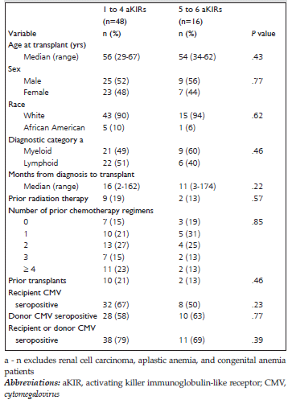
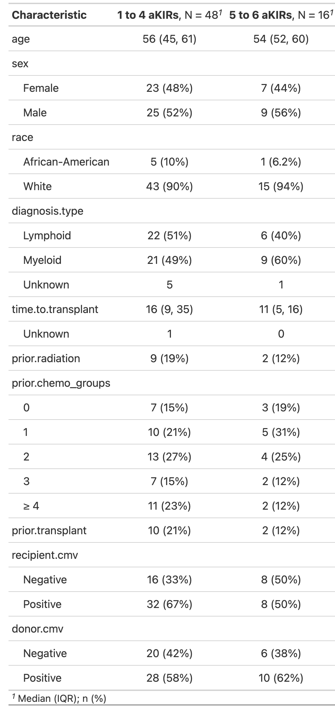
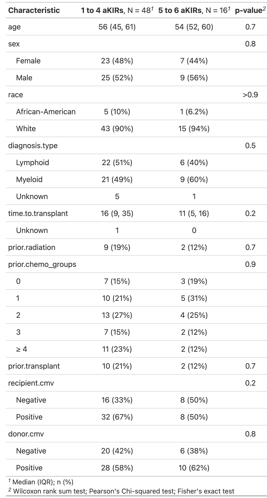
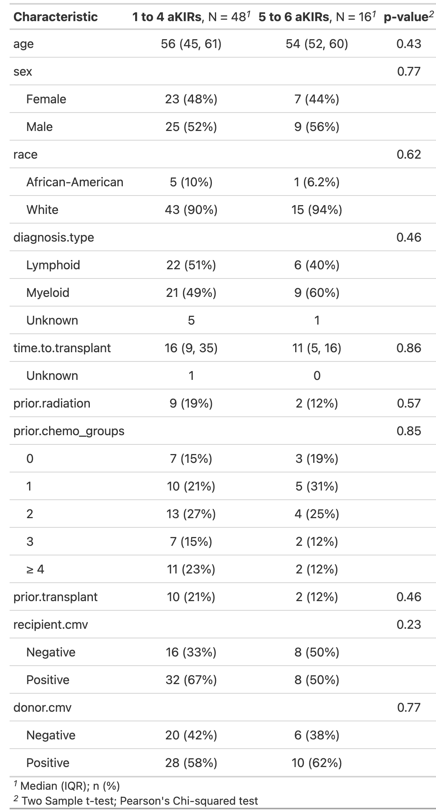
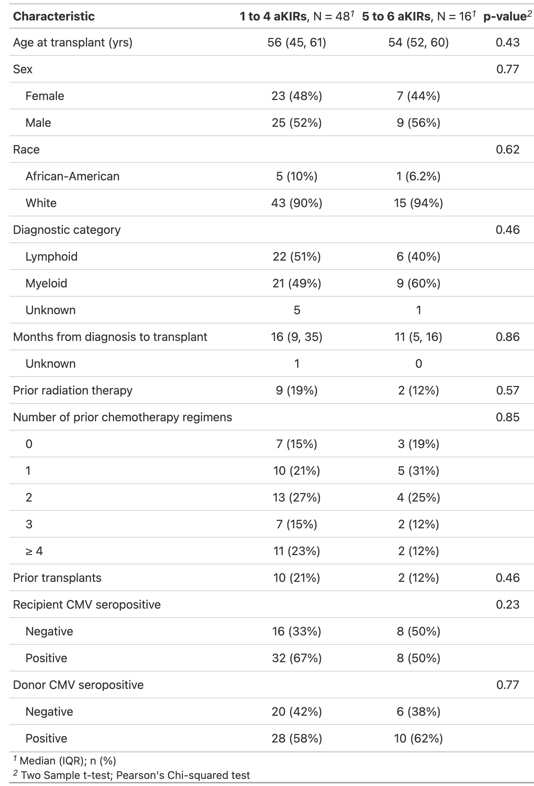
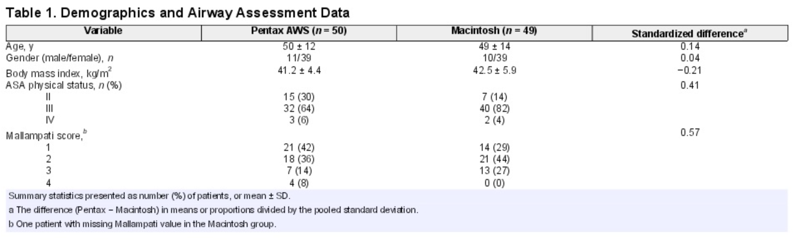

<!--

author:   Rose Hartman
email:    hartmanr1@chop.edu
version:  1.0.4
current_version_description: Initial version
module_type: standard
docs_version: 2.0.0
language: en
narrator: UK English Female
mode: Textbook

title: Summary Statistics in R

comment:  Learn to calculate summary statistics in R, and how to present them in a table for publication.

long_description: Get started with data analysis in R! This module covers how to get basic descriptive statistics for both continuous and categorical variables in R, and how to present your summary statistics in a beautiful publication-ready table (i.e. Table 1 in most research papers). You'll learn how to use several functions from base R including `summary()` to get a quick overview of your data, and also how to use the popular `gtsummary` package to create tables. 

estimated_time_in_minutes: 30

r_file: r\_summary\_stats

@pre_reqs
Minimal experience of using the RStudio IDE and writing R code (specifically, within an R Markdown document) is necessary to understand and use this material.  In particular, you should be able to do the following:

- Run a command that's provided to you in the console
- Use the Environment tab to find a data frame and learn more about it
- Insert a new code chunk in an R Markdown document

This module also assumes some basic familiarity with R, including

- [installing and loading packages](https://r4ds.had.co.nz/data-visualisation.html#prerequisites-1)
- manipulating data frames, including [selecting columns and calculating new columns](https://liascript.github.io/course/?https://raw.githubusercontent.com/arcus/education_modules/main/r_basics_transform_data/r_basics_transform_data.md)
- the difference between [numeric (continuous) and factor (categorical) variables](https://swcarpentry.github.io/r-novice-inflammation/13-supp-data-structures) in a dataframe

If you are brand new to R (or want a refresher) consider starting with [Intro to R](https://liascript.github.io/course/?https://raw.githubusercontent.com/arcus/education_modules/main/r_basics_introduction/r_basics_introduction.md) first.
@end

@learning_objectives  

After completion of this module, learners will be able to:

- calculate common summary statistics in R, for both continuous and categorical variables
- generate publication-ready tables of descriptive statistics using the gtsummary package

@end

good_first_module: false
data_task: data_analysis
collection: learn_to_code, statistics
coding_required: true
coding_level: intermediate
coding_language: r

@sets_you_up_for

@end

@depends_on_knowledge_available_in
r_basics_introduction
r_basics_transform_data
@end

@version_history
No previous versions.
@end

import: https://raw.githubusercontent.com/arcus/education_modules/main/_module_templates/macros.md
import: https://raw.githubusercontent.com/arcus/education_modules/main/_module_templates/macros_r.md

-->

# Summary Statistics in R

@overview

## Lesson Preparation
@lesson_prep_r

## Thinking About Summary Statistics

Summary statistics, also called descriptive statistics, serve a few important functions: 

- they help you understand your data better during exploratory data analysis (including things like catching errors or outliers!)
- they give you (and your readers) a better idea of what your study population was like at baseline, which has implications for how generalizable your results might be
- they can show any preexisting differences between groups (or lack thereof), which is important for interpreting any differences between groups after treatment

For categorical variables, summary statistics are generally limited to counts in each category (for example, how many patients tested positive and negative for CMV?).

For continuous variables, there are many more options. Summary statistics generally focus on **central tendency** and **variability**. In other words, where on the scale are the data located, and how spread out are the data?

For example, consider a variable like age. A measure of central tendency would tell you, generally, how old are the research subjects? Is this a pediatric population, or adult? 

Examples of statistics that capture central tendency are the **mean** and the **median**. Let's say the mean age of participants in our study was 45. Now you have an idea of where on the scale we are --- this is not a population of children, nor is it a study about advanced age. 

But how spread out are the data? This could be a population sampled from across the lifespan, with participants ranging from 5 to 90, or it could be a focused investigation of people in middle age, with all of the subjects in their 40s or even in their mid-40s. 

Examples of statistics that capture variability are **variance**, **standard deviation**, **interquartile range**, and **range**. 

<div class = "learn-more">
<b style="color: rgb(var(--color-highlight));">Learning connection</b><br>

We won't get into the mathematical definitions of each of these statistics here, but if you'd like a refresher, check out these excellent Khan academy videos:

- [Statistics Intro: Mean, Median, and Mode](https://www.khanacademy.org/math/engageny-alg-1/alg1-2/alg1-2a-center/v/statistics-intro-mean-median-and-mode)
- [Measures of Spread: Range, Variance, and Standard Deviation](https://www.khanacademy.org/math/statistics-probability/summarizing-quantitative-data/variance-standard-deviation-population/v/range-variance-and-standard-deviation-as-measures-of-dispersion)
- [Interquartile Range (IQR)](https://www.khanacademy.org/math/engageny-alg-1/alg1-2/alg1-2b-interquartile-range/v/calculating-interquartile-range-iqr)

</div>

### Quiz: Summary Statistics

Which of the following are good summary statistics for **categorical** variables?

[( )] median
[( )] variance
[( )] interquartile range
[(X)] counts
[( )] all of the above
***
<div class = "answer">

Only counts are good for summarizing categorical variables. Median, variance, and interquartile range are all for summarizing continuous variables. 

</div>
***

True or False: Measures of central tendency tell you **where** data are on a scale, whereas measures of variability tell you **how spread out** the data are.

[(X)] TRUE
[( )] FALSE
***
<div class = "answer">

Yes, that's true. 

Mean and median are two popular examples of measures of central tendency. Standard deviation and interquartile range are two examples of measures of variability.

</div>
***

## Getting Summary Statistics in R

Time to start coding! By far the best way to learn R is to practice, so work through this code yourself as you follow along.

If you don't already have it open, open R Studio either in your browser or locally on your computer (see instructions in the [lesson preparation section](#lesson-preparation)).

### Load packages

First, we need to load the `tidyverse` packages, since we'll be using several functions that come in the `tidyverse`.
We'll also load the `medicaldata` package, which includes several publicly available data sets with medical data. 
And we'll load the `gtsummary` package for creating publication-ready tables. 

<div class = "learn-more">
<b style="color: rgb(var(--color-highlight));">Learning connection</b><br>

There's a lot of helpful information (including examples and tutorials) on the package websites for each of the packages we'll be using:

- [tidyverse](https://www.tidyverse.org/)
- [medicaldata](https://higgi13425.github.io/medicaldata/)
- [gtsummary](https://www.danieldsjoberg.com/gtsummary)

</div>

If you're running this on your own computer rather than in the cloud instance we set up, you may need to run `install.packages(c("tidyverse", "medicaldata", "gtsummary"))` first if you haven't ever used these packages before.

```r
library(tidyverse)
library(medicaldata) 
library(gtsummary)
```

### The data

Let's take a look at the data. 
In the console or in the exercises rmd file, run the following command:

```r
head(cytomegalovirus)
```

You should see the first six rows of the cytomegalovirus data frame, which look like this:

<!-- data-type="none" -->
| ID| age|sex    |race             |diagnosis                    |diagnosis.type | time.to.transplant|prior.radiation | prior.chemo|prior.transplant | recipient.cmv|donor.cmv |donor.sex | TNC.dose| CD34.dose| CD3.dose| CD8.dose| TBI.dose|C1/C2        | aKIRs|cmv | time.to.cmv|agvhd | time.to.agvhd|cgvhd | time.to.cgvhd|aKIRs_groups |
|--:|---:|:------|:----------------|:----------------------------|:--------------|------------------:|:---------------|-----------:|:----------------|-------------:|:---------|:---------|--------:|---------:|--------:|--------:|--------:|:------------|-----:|:---|-----------:|:-----|-------------:|:-----|-------------:|:------------|
|  1|  61|Male   |African-American |acute myeloid leukemia       |Myeloid        |               5.16|No              |           2|No               |             1|Negative  |Male      |    18.31|      2.29|     3.21|     0.95|      200|Heterozygous |     1|Yes |        3.91|Yes   |          3.55|No    |          6.28|1 to 4 aKIRs |
|  2|  62|Male   |White            |non-Hodgkin lymphoma         |Lymphoid       |              79.05|Yes             |           3|No               |             0|Negative  |Female    |     4.26|      2.04|       NA|       NA|      200|Homozygous   |     5|No  |       65.12|No    |         65.12|No    |         65.12|5 to 6 aKIRs |
|  3|  63|Female |White            |non-Hodgkin lymphoma         |Lymphoid       |              35.58|No              |           4|No               |             1|Positive  |Male      |     8.09|      6.97|     2.19|     0.59|      200|Heterozygous |     3|No  |        3.75|No    |          3.75|No    |          3.75|1 to 4 aKIRs |
|  4|  33|Female |White            |Hodgkin lymphoma             |Lymphoid       |              33.02|Yes             |           4|No               |             1|Negative  |Female    |    21.02|      6.09|     4.87|     2.32|      200|Heterozygous |     2|No  |       48.49|Yes   |         28.55|Yes   |         10.45|1 to 4 aKIRs |
|  5|  54|Female |White            |acute lymphoblastic leukemia |Lymphoid       |              11.40|No              |           5|No               |             1|Positive  |Male      |    14.70|      2.36|     6.55|     2.40|      400|Heterozygous |     6|No  |        4.37|Yes   |          2.79|No    |          4.37|5 to 6 aKIRs |
|  6|  55|Male   |White            |myelofibrosis                |Myeloid        |               2.43|No              |           0|No               |             1|Positive  |Female    |     4.29|      6.91|     2.53|     0.86|      200|Heterozygous |     2|Yes |        4.53|Yes   |          3.88|No    |          6.87|1 to 4 aKIRs |

Note that this is one of the example datasets that comes built-in when you install the `medicaldata` package, so it's already available to you without you having to read it in or download anything.

To learn more about this dataset, type the following into the R console:

``` r
?cytomegalovirus
```

From the help documentation: 

> This data set contains 64 consecutive patients who underwent T-cell replete, matched sibling donor reduced-intensity conditioning allogeneic hematopoietic stem cell transplant. The primary risk factor of interest was the number of activating killer immunoglobulin-like receptors (aKIRs: 1-4 vs. 5-6). 

<div class = "learn-more">
<b style="color: rgb(var(--color-highlight));">Learning connection</b><br>

To learn more about the cytomegalovirus data and the study behind it, read [Sobecks et al. 2011](https://pubmed.ncbi.nlm.nih.gov/21605017/).

To learn more about the `medicaldata` R package these data are published in, see the [`medicaldata` package website](https://higgi13425.github.io/medicaldata/) -- and note that the maintainers are always looking for more data contributions!

</div>

### Using `summary()`

The best place to start your exploratory data analysis is often the `summary` function.
You can run it on an individual column, or on a whole dataframe.

First try running `summary()` on just the `age` column:

``` r
summary(cytomegalovirus$age)
```

``` +Output
    ##    Min. 1st Qu.  Median    Mean 3rd Qu.    Max. 
    ##   29.00   46.00   55.00   52.44   61.00   67.00
```

Now try running `summary` on the whole dataframe all at once:

``` r
summary(cytomegalovirus)
```

``` +Output
       ID             age             sex              race         diagnosis        
 Min.   : 1.00   Min.   :29.00   Min.   :0.0000   Min.   :0.0000   Length:64         
 1st Qu.:16.75   1st Qu.:46.00   1st Qu.:0.0000   1st Qu.:1.0000   Class :character  
 Median :32.50   Median :55.00   Median :1.0000   Median :1.0000   Mode  :character  
 Mean   :32.50   Mean   :52.44   Mean   :0.5312   Mean   :0.9062                     
 3rd Qu.:48.25   3rd Qu.:61.00   3rd Qu.:1.0000   3rd Qu.:1.0000                     
 Max.   :64.00   Max.   :67.00   Max.   :1.0000   Max.   :1.0000                     
                                                                                     
 diagnosis.type   time.to.transplant prior.radiation   prior.chemo    prior.transplant
 Min.   :0.0000   Min.   :  1.84     Min.   :0.0000   Min.   :0.000   Min.   :0.0000  
 1st Qu.:0.0000   1st Qu.:  8.15     1st Qu.:0.0000   1st Qu.:1.000   1st Qu.:0.0000  
 Median :1.0000   Median : 13.70     Median :0.0000   Median :2.000   Median :0.0000  
 Mean   :0.5172   Mean   : 30.85     Mean   :0.1719   Mean   :2.188   Mean   :0.1875  
 3rd Qu.:1.0000   3rd Qu.: 33.28     3rd Qu.:0.0000   3rd Qu.:3.000   3rd Qu.:0.0000  
 Max.   :1.0000   Max.   :173.83     Max.   :1.0000   Max.   :8.000   Max.   :1.0000  
 NA's   :6        NA's   :1                                                           
 recipient.cmv     donor.cmv        donor.sex      TNC.dose       CD34.dose     
 Min.   :0.000   Min.   :0.0000   Min.   :0.0   Min.   : 2.06   Min.   : 2.040  
 1st Qu.:0.000   1st Qu.:0.0000   1st Qu.:0.0   1st Qu.: 6.89   1st Qu.: 4.165  
 Median :1.000   Median :1.0000   Median :0.5   Median :10.48   Median : 5.840  
 Mean   :0.625   Mean   :0.5938   Mean   :0.5   Mean   :10.44   Mean   : 5.546  
 3rd Qu.:1.000   3rd Qu.:1.0000   3rd Qu.:1.0   3rd Qu.:13.42   3rd Qu.: 6.990  
 Max.   :1.000   Max.   :1.0000   Max.   :1.0   Max.   :21.02   Max.   :12.510  
                                                                                
    CD3.dose       CD8.dose        TBI.dose         C1/C2            aKIRs      
 Min.   :1.08   Min.   :0.160   Min.   :200.0   Min.   :0.0000   Min.   :1.000  
 1st Qu.:3.08   1st Qu.:0.805   1st Qu.:200.0   1st Qu.:0.0000   1st Qu.:1.000  
 Median :3.98   Median :1.200   Median :200.0   Median :1.0000   Median :2.000  
 Mean   :4.30   Mean   :1.323   Mean   :287.5   Mean   :0.5156   Mean   :2.844  
 3rd Qu.:5.48   3rd Qu.:1.663   3rd Qu.:400.0   3rd Qu.:1.0000   3rd Qu.:4.250  
 Max.   :8.18   Max.   :3.190   Max.   :400.0   Max.   :1.0000   Max.   :6.000  
 NA's   :3      NA's   :12                                                      
      cmv          time.to.cmv         agvhd        time.to.agvhd        cgvhd       
 Min.   :0.0000   Min.   : 0.430   Min.   :0.0000   Min.   : 0.660   Min.   :0.0000  
 1st Qu.:0.0000   1st Qu.: 2.712   1st Qu.:0.0000   1st Qu.: 2.623   1st Qu.:0.0000  
 Median :0.0000   Median : 5.030   Median :0.0000   Median : 5.800   Median :0.0000  
 Mean   :0.4062   Mean   :13.206   Mean   :0.4062   Mean   :15.605   Mean   :0.4375  
 3rd Qu.:1.0000   3rd Qu.:16.012   3rd Qu.:1.0000   3rd Qu.:21.410   3rd Qu.:1.0000  
 Max.   :1.0000   Max.   :84.470   Max.   :1.0000   Max.   :85.190   Max.   :1.0000  
                                                                                     
 time.to.cgvhd   
 Min.   : 0.820  
 1st Qu.: 3.848  
 Median : 6.735  
 Mean   :10.304  
 3rd Qu.:11.307  
 Max.   :65.120  
```

You should see a summary of each of the 26 variables in the data, with a set of summary statistics printed under each. 
This is a great way to get a lot of information quickly. 
The `summary` function is clever enough to print different summary statistics for different variable types --- it won't try to calculate the mean or median of a categorical variable (called a factor in R), for example, since that wouldn't be meaningful.

The `summary` function checks what type of variable (numeric, categorical/factor, etc.) is in each column and returns sensible summary statistics for each. 
For a factor, you get the count for each level, and also a count of how many observations are missing. 
For numeric variables, you get the range (minimum and maximum), the 1st quartile, median, mean, 3rd quartile, and the count of missing observations. 

In this dataframe, most of the data are numeric.
There is one column, diagnosis, that shows up as character. 
If you look at the help documentation for the data set (`?cytomegalovirus`), you'll see that should actually be a factor with 13 levels. 
If it were a factor, we could get more useful summary statistics for it, too. 

``` r
# convert diagnosis column from character to factor
cytomegalovirus$diagnosis <- as.factor(cytomegalovirus$diagnosis)

# re-run the summary for that column
summary(cytomegalovirus$diagnosis)
```

``` +Output
    ## acute lymphoblastic leukemia       acute myeloid leukemia 
    ##                            1                           12 
    ##              aplastic anemia chronic lymphocytic leukemia 
    ##                            1                            5 
    ##     chronic myeloid leukemia            congenital anemia 
    ##                            4                            1 
    ##             Hodgkin lymphoma            multiple myelomas 
    ##                            3                            7 
    ##     myelodysplastic syndrome                myelofibrosis 
    ##                            9                            4 
    ##  myeloproliferative disorder         non-Hodgkin lymphoma 
    ##                            1                           12 
    ##         renal cell carcinoma 
    ##                            4
```

Now we get counts for each type of diagnosis! Much better.

There are also several other variables that are represented in the data
as 0 or 1, but should really be considered as factors. We'll clean those
up now. We could do it with individual commands like
`cytomegalovirus$sex <- as.factor(cytomegalovirus$sex)`, but instead
we'll take a look at another approach:

``` r
cytomegalovirus <- cytomegalovirus |> 
  mutate(sex = factor(sex, levels = c(0, 1), labels = c("Female", "Male")),
         race = factor(race, levels = c(0, 1), labels = c("African-American", "White")),
         diagnosis.type = factor(diagnosis.type, levels = c(0, 1), labels = c("Lymphoid", "Myeloid")),
         prior.radiation = factor(prior.radiation, levels = c(0, 1), labels = c("No", "Yes")),
         prior.transplant = factor(prior.transplant, levels = c(0, 1), labels = c("No", "Yes")),
         donor.cmv = factor(donor.cmv, levels = c(0, 1), labels = c("Negative", "Positive")),
         recipient.cmv = factor(recipient.cmv, levels = c(0, 1), labels = c("Negative", "Positive")),
         donor.sex = factor(donor.sex, levels = c(0, 1), labels = c("Male", "Female")),
         `C1/C2` = factor(`C1/C2`, levels = c(0, 1), labels = c("Heterozygous", "Homozygous")),
         cmv = factor(cmv, levels = c(0, 1), labels = c("No", "Yes")),
         agvhd = factor(agvhd, levels = c(0, 1), labels = c("No", "Yes")),
         cgvhd = factor(cgvhd, levels = c(0, 1), labels = c("No", "Yes"))
         )
```

Let's break that down. 
We're using `mutate` to make changes to the columns in the dataframe. 
You can use `mutate` to create new columns, but in this case we're just overwriting existing columns. 
Within the mutate command, we have a different argument for each column we want to change. 
They all take the form `column_name = factor(column_name, levels = c(), labels = c())` where the levels are the existing values in the colum already (e.g. 0 and 1) and labels are what we want them to show up as in the factor (e.g. “no” and “yes”). 
Note that the order of levels and labels has to line up, so the first level will get the first label, and the second level will get the second label, etc. 
To learn more about the `factor()` command, check out its help documentation with `?factor`.

<div class = "help">
<b style="color: rgb(var(--color-highlight));">Troubleshooting help</b><br>

If you make a mistake modifying the data, how can you undo it?

If this were a dataset we read in from an external file (like a .csv), you could just read it in again to get a fresh copy. 
But how do you get a fresh copy of a built-in dataset? 

To reset the data to its original state, run `rm(cytomegalovirus)` in the console. This will delete your current version of the data from R's environment, and you'll just be left with the original clean copy from the `medicaldata` package.

Remember: If you run `rm(cytomegalovirus)` to reset the data, you'll need to re-run any changes you made to the data that you want to keep, like converting `diagnosis` to a factor above. 

</div>

Let's run `summary` on the whole dataframe again to see the results now that we've cleaned up the column types.

``` r
summary(cytomegalovirus)
```

``` +Output
       ID             age            sex                   race     diagnosis          diagnosis.type time.to.transplant
 Min.   : 1.00   Min.   :29.00   Female:30   African-American: 6   Length:64          Lymphoid:28     Min.   :  1.84    
 1st Qu.:16.75   1st Qu.:46.00   Male  :34   White           :58   Class :character   Myeloid :30     1st Qu.:  8.15    
 Median :32.50   Median :55.00                                     Mode  :character   NA's    : 6     Median : 13.70    
 Mean   :32.50   Mean   :52.44                                                                        Mean   : 30.85    
 3rd Qu.:48.25   3rd Qu.:61.00                                                                        3rd Qu.: 33.28    
 Max.   :64.00   Max.   :67.00                                                                        Max.   :173.83    
                                                                                                      NA's   :1         
 prior.radiation  prior.chemo    prior.transplant  recipient.cmv    donor.cmv   donor.sex     TNC.dose       CD34.dose     
 No :53          Min.   :0.000   No :52           Negative:24    Negative:26   Male  :32   Min.   : 2.06   Min.   : 2.040  
 Yes:11          1st Qu.:1.000   Yes:12           Positive:40    Positive:38   Female:32   1st Qu.: 6.89   1st Qu.: 4.165  
                 Median :2.000                                                             Median :10.48   Median : 5.840  
                 Mean   :2.188                                                             Mean   :10.44   Mean   : 5.546  
                 3rd Qu.:3.000                                                             3rd Qu.:13.42   3rd Qu.: 6.990  
                 Max.   :8.000                                                             Max.   :21.02   Max.   :12.510  
                                                                                                                           
    CD3.dose       CD8.dose        TBI.dose              C1/C2        aKIRs        cmv      time.to.cmv     agvhd   
 Min.   :1.08   Min.   :0.160   Min.   :200.0   Heterozygous:31   Min.   :1.000   No :38   Min.   : 0.430   No :38  
 1st Qu.:3.08   1st Qu.:0.805   1st Qu.:200.0   Homozygous  :33   1st Qu.:1.000   Yes:26   1st Qu.: 2.712   Yes:26  
 Median :3.98   Median :1.200   Median :200.0                     Median :2.000            Median : 5.030           
 Mean   :4.30   Mean   :1.323   Mean   :287.5                     Mean   :2.844            Mean   :13.206           
 3rd Qu.:5.48   3rd Qu.:1.663   3rd Qu.:400.0                     3rd Qu.:4.250            3rd Qu.:16.012           
 Max.   :8.18   Max.   :3.190   Max.   :400.0                     Max.   :6.000            Max.   :84.470           
 NA's   :3      NA's   :12                                                                                          
 time.to.agvhd    cgvhd    time.to.cgvhd   
 Min.   : 0.660   No :36   Min.   : 0.820  
 1st Qu.: 2.623   Yes:28   1st Qu.: 3.848  
 Median : 5.800            Median : 6.735  
 Mean   :15.605            Mean   :10.304  
 3rd Qu.:21.410            3rd Qu.:11.307  
 Max.   :85.190            Max.   :65.120  
```

### Individual summary statistics

What is the shortest time from diagnosis to transplant in the data? You can see in the help documentation for the data (`?cytomegalovirus`) that this variable is in months.

``` r
min(cytomegalovirus$time.to.transplant)
```
``` +Output
    ## [1] NA
```

Uh-oh! It returns `NA` for this because there is a missing observation for this column. If you look at `?min`, you'll see the default for this function (and most statistics functions in R) is `na.rm = FALSE`, which basically means "don't remove (`rm`) any missing values (`na`)."  
When doing arithmetic, R will only compute a value if there are no missing observations.  
If you want to remove the missing values, so that you can get a numeric value, you'll need to indicate that.

To get the minimum for this column ignoring the missing value, change that to `na.rm = TRUE`.

``` r
min(cytomegalovirus$time.to.transplant, na.rm = TRUE)
```
``` +Output
    ## [1] 1.84
```

What is the longest time from diagnosis to transplant?

``` r
max(cytomegalovirus$time.to.transplant, na.rm = TRUE)
```
``` +Output
    ## [1] 173.83
```

What is the mean time to transplant?

``` r
mean(cytomegalovirus$time.to.transplant, na.rm = TRUE)
```
``` +Output
    ## [1] 30.84556
```

Other descriptive stats:

``` r
median(cytomegalovirus$time.to.transplant, na.rm = TRUE) # median
```
``` +Output
    ## [1] 13.7
```

``` r
var(cytomegalovirus$time.to.transplant, na.rm = TRUE) # variance
```
``` +Output
    ## [1] 1638.105
```

``` r
sd(cytomegalovirus$time.to.transplant, na.rm = TRUE) # standard deviation
```
``` +Output
    ## [1] 40.47351
```

The median is the 50th percentile, but you may want other values, like the 25th and 75th percentile. You can get any you want with the `quantile` function:

``` r
# the default quantiles
quantile(cytomegalovirus$time.to.transplant, na.rm = TRUE) 
```
``` +Output
    ##     0%    25%    50%    75%   100% 
    ##   1.84   8.15  13.70  33.28 173.83
```

``` r
# custom quantiles
quantile(cytomegalovirus$time.to.transplant, probs = c(.1, .2, .3, .4), na.rm = TRUE)
```
``` +Output
    ##    10%    20%    30%    40% 
    ##  4.156  5.542  8.848 10.924
```

### Coding Challenge 1

**Your turn!**

Look in the `summary_stats_exercises.Rmd` file to find your first coding challenge. You'll see it clearly marked with a line that reads `## CODING CHALLENGE 1`.

<div class = "important">
<b style="color: rgb(var(--color-highlight));">Important note</b><br>

Don't work through the whole exercise file now. 
When you reach the lines that say `STOP HERE!  Go back to the module to continue.`, pause your work and return to this screen to read the next section.

</div>

### Counts

For categorical variables, summary statistics are just counts. 
We'll look at two ways to get the counts for a single categorical variable in R: the `summary()` command, and the `table()` command. 

``` r
summary(cytomegalovirus$diagnosis.type)
```
``` +Output
    ## Lymphoid  Myeloid     NA's 
    ##       28       30        6
```

``` r
table(cytomegalovirus$diagnosis.type)
```
``` +Output
    ## 
    ## Lymphoid  Myeloid 
    ##       28       30
```

You can use `summary` to get counts for factors, but it won't work on character vectors, whereas `table` works to get counts on factors or characters. 

Note that `table` doesn't give you any information about missing values by default, though – it just gives counts for observations with data. 
If you want to see missing values using `table`, add the argument `useNA = "always"`:

``` r
table(cytomegalovirus$diagnosis.type, useNA = "always")
```
``` +Output
    ## 
    ## Lymphoid  Myeloid     <NA> 
    ##       28       30        6
```    

To get counts of two categorical variables together (e.g. what is the diagnosis type breakdown by recipient CMV status?), use [cross-tabulation](https://www.khanacademy.org/math/statistics-probability/analyzing-categorical-data/two-way-tables-for-categorical-data/a/two-way-tables-review), also called “crosstabs” or "two-way frequency tables".

``` r
xtabs(~cmv + diagnosis.type, data = cytomegalovirus)
```
``` +Output
    ##      diagnosis.type
    ## cmv   Lymphoid Myeloid
    ##   No        15      19
    ##   Yes       13      11
```

To get the results of a chi-squared test on the crosstabs, you can apply the `summary` function to an xtabs object.
There are two equivalent ways to do that:

``` r
# you can nest the summary and xtabs functions
summary(xtabs(~cmv + diagnosis.type, data = cytomegalovirus))
```
``` +Output
    ## Call: xtabs(formula = ~cmv + diagnosis.type, data = cytomegalovirus)
    ## Number of cases in table: 58 
    ## Number of factors: 2 
    ## Test for independence of all factors:
    ##  Chisq = 0.569, df = 1, p-value = 0.4507
```

``` r
# or you can save the xtabs object and then run summary() on it
cmv_and_diagnosistype <- xtabs(~cmv + diagnosis.type, data = cytomegalovirus)
summary(cmv_and_diagnosistype)
```
``` +Output
    ## Call: xtabs(formula = ~cmv + diagnosis.type, data = cytomegalovirus)
    ## Number of cases in table: 58 
    ## Number of factors: 2 
    ## Test for independence of all factors:
    ##  Chisq = 0.569, df = 1, p-value = 0.4507
```

<div class = "learn-more">
<b style="color: rgb(var(--color-highlight));">Learning connection</b><br>

For beautifully printed crosstabs, see [the `tbl_cross` function in the `gtsummary` package](https://www.danieldsjoberg.com/gtsummary/articles/tbl_summary.html#tbl_cross).

</div>

### Coding Challenge 2
 
 **Your turn!**

 For your next coding challenge, return to RStudio and work from the line that reads `## CODING CHALLENGE 2` until you see the next message telling you to stop and return to the module.


## Presenting Summary Statistics in R

Many research articles begin with a table summarizing the patients or research subjects analyzed, usually broken down by condition or exposure to allow the reader to see any baseline differences between groups. 
For example, here is Table 1 from the paper this dataset is from: 




One way to create a summary table would be to copy-paste all of your summary stats from R into whatever program you use to write your article. 
That is both error-prone and tedious, and it also means if anything changes in your data you need to re-do all of that work.

Another approach is creating the whole table right in R! 
The `gtsummary` package is a great way to do that.

### Creating Table 1 with `gtsummary`

We'll recreate an approximation of the cytomegalovirus Table 1 using `gtsummary`.
As a reminder, here's the published table:


Note that the table breaks patients down by whether their aKIRs are 1-4 or 5-6. 
In the data, aKIRs are just numeric scores 1-6, so first we'll need to create a factor for those two groups.
Similarly, the table groups all patients with at least 4 prior chemo treatments as one group.

``` r
cytomegalovirus <- cytomegalovirus |> 
  mutate(aKIRs_groups = if_else(aKIRs > 4, "5 to 6 aKIRs", "1 to 4 aKIRs"),
         aKIRs_groups = factor(aKIRs_groups, levels = c("1 to 4 aKIRs", "5 to 6 aKIRs")),
         prior.chemo_groups = if_else(prior.chemo >= 4, "≥ 4", as.character(prior.chemo)),
         prior.chemo_groups = factor(prior.chemo_groups, levels = c("0", "1", "2", "3", "≥ 4")))
```

Let's break that down.

We're using the `if_else` function to recode the numeric variable `aKIRs` as one of two strings, "5 to 6 aKIRs" if it's greater than 4 and "1 to 4 aKIRs" otherwise.
That will result in a character vector called `aKIRs_groups`, so then with the next line we turn it into a factor.

Then we apply the same approach to the `prior.chemo` variable, first we make everything greater than or equal to 4 into "≥ 4", and set all other values to `as.character()` on whatever their original values were --- this changes the numbers into string versions, so 0 becomes "0", 1 becomes "1", etc.
That creates a new variable called `prior.chemo_groups`, but it's a character vector, so we turn it into a factor.

The `if_else` function is what's called a ternary operator, and it has three parts:

 * a conditional test
 * a value to use if the test returns `TRUE`
 * a value to use if the test returns `FALSE`.

In the aKIRs example, we first tested each value to see if it was > 4. If yes, we assigned it "5 to 6 aKIRs", and if no we assigned it to "1 to 4 aKIRs". 
Note that `if_else` preserves missing values, so anything that was NA in aKIRs will still be NA in aKIRs_groups. 

<div class = "learn-more">
<b style="color: rgb(var(--color-highlight));">Learning connection</b><br>

For more on using `mutate` and `if_else`, see see the [R Basics: Data Transformation sections on `mutate`](https://liascript.github.io/course/?https://raw.githubusercontent.com/arcus/education_modules/main/r_basics_transform_data/r_basics_transform_data.md#the-mutate%28%29-function) and [logical operators](https://liascript.github.io/course/?https://raw.githubusercontent.com/arcus/education_modules/main/r_basics_transform_data/r_basics_transform_data.md#logical-operators) to see more examples of the kinds of conditional tests you can put in.

</div>

<div class = "help">
<b style="color: rgb(var(--color-highlight));">Troubleshooting help</b><br>

Note that there are two different functions that look similar and do almost (but not quite!) exactly the same thing: `if_else` and `ifelse`. 

`if_else` is part of the `dplyr` package, and `ifelse` is part of base R. 
This is a common point of confusion. 
There are a few differences in how the two functions work, but one of the big ones is that `ifelse` does NOT preserve missingness. 
It's a subtle difference, but watch out!

</div>

Now we can use the new `aKIRs_groups` and `prior.chemo_groups` variables in our Table 1.

``` r
cytomegalovirus |>  
  select(aKIRs_groups, 
         age, 
         sex, 
         race, 
         diagnosis.type, 
         time.to.transplant, 
         prior.radiation, 
         prior.chemo_groups, 
         prior.transplant, 
         recipient.cmv, 
         donor.cmv) |> 
  tbl_summary(by = aKIRs_groups) 
```



This is a decent table! 
Notice there are a few things about this table that we might still want to change, for example:

- row labels are taken from the variable names in the dataframe, so they're lowercase and don't use whitespace as we might like (e.g. "diagnosis.type" would be better as "Diagnosis Type")
- There's no information about significance testing, like there is in the published table

We can add a lot of customization, though, to bring it closer to the publication version. 
We'll look at a few options now.

```r
# to save re-typing code and highlight just what's new, save the first part
table_data <- cytomegalovirus  |>  
  select(aKIRs_groups, 
         age, 
         sex, 
         race, 
         diagnosis.type, 
         time.to.transplant, 
         prior.radiation, 
         prior.chemo_groups, 
         prior.transplant, 
         recipient.cmv, 
         donor.cmv) 
```

```r
# add a column showing p values
table_data |> 
  tbl_summary(by = aKIRs_groups) |> 
  add_p()
```



This is an improvement, but the p values here don't match the published table, and the footnote explains why --- says it's using Wilcoxon rank sum test, Pearson's chi-squared, and Fisher's exact test to get the p values. 
The help documentation (`?add_p.tbl_summary`) explains a little more thoroughly:

>Tests default to "kruskal.test" for continuous variables ("wilcox.test" when "by" variable has two levels), "chisq.test.no.correct" for categorical variables with all expected cell counts >=5, and "fisher.test" for categorical variables with any expected cell count <5.

It would be nice if the published table included a footnote explaining which tests they used, but unfortunately it doesn't. 
We can guess that it was a standard t-test rather than the Wilcoxon rank sum test, though.
We can control which tests `gtsummary` uses by adding a `test` argument to the `add_p()` command.
We'll also have it round to two digits instead of one by modifying the `pvalue_fun` command.

```r
# make the p values round to 2 digits instead of 1, 
# and use t.test instead of wilcoxon rank sum test
table_data |> 
  tbl_summary(by = aKIRs_groups) |> 
  add_p(test = list(all_continuous() ~ "t.test",
                    all_categorical() ~ "chisq.test.no.correct"),
        test.args = all_continuous() ~ list(var.equal = TRUE),
        pvalue_fun = function(x) style_pvalue(x, digits = 2))
```

<div class = "care">
<b style="color: rgb(var(--color-highlight));">A little encouragement...</b><br>

If you're feeling like these arguments look confusing (why does it start with `list()`? What does the `~` mean??), you're not alone! 

As you get further away from the default settings in `gtsummary` (and other packages), your code is likely to become less intuitive and harder to read. 
That's okay!

Pretty much no one, even an R expert, would be able to guess how to specify these arguments without looking it up first. 
The normal, expected process for something like this is to search for what you want to do online (e.g. "gtsummary round p value to 2 digits"), or look in the help documentation, until you find example code that does what you need and then copy it. 
Part of why we included these examples in this module is so you can come back and copy them later when you're making your own tables!

</div>

Here's our updated table:



The results of the significance testing here are now much closer to what we see in the published table.

<div class = "behind-the-scenes">
<b style="color: rgb(var(--color-highlight));">Behind the scenes</b><br>

When you ran the above code, you may have noticed that R printed out several warnings with text like `Warning for variable 'race': simpleWarning in stats::chisq.test(x = structure(c(1L, 2L, 2L, 2L, 2L, 2L, 2L, : Chi-squared approximation may be incorrect`. 

Like many warnings in R (and other programming languages), the text is unfortunately not super clear. 
But at least it does let you know what variable has a problem (race, in this case) and that it has something to do with the Chi-squared test we're running on it to get those p-values. 

It's beyond the scope of this module to get into the details, but the reason this warning comes up is because it's actually a bad idea statistically to run an uncorrected Chi-squared test on variables where the expected counts are too low, as is the situation for several of the variables in this table (including race). 
We're just trying to replicate the tests that were done to get the published version of the table, but R is right that we're not using the best choice of tests here. 

</div>

One glaring issue that remains is the row labels. We don't want labels like "prior.chemo_groups" in our final table! 
We can clean those up with the `label` argument in the `tbl_summary` command:

```r
# customize the row labels
table_data |> 
  tbl_summary(by = aKIRs_groups, 
              label = list(age ~ "Age at transplant (yrs)",
                           sex ~ "Sex",
                           race ~ "Race",
                           diagnosis.type ~ "Diagnostic category",
                           time.to.transplant ~ "Months from diagnosis to transplant",
                           prior.radiation ~ "Prior radiation therapy",
                           prior.chemo_groups ~ "Number of prior chemotherapy regimens",
                           prior.transplant ~ "Prior transplants",
                           recipient.cmv ~ "Recipient CMV seropositive",
                           donor.cmv ~ "Donor CMV seropositive")) |> 
  add_p(test = list(all_continuous() ~ "t.test",
                    all_categorical() ~ "chisq.test.no.correct"),
        test.args = all_continuous() ~ list(var.equal = TRUE),
        pvalue_fun = function(x) style_pvalue(x, digits = 2))
```



This is starting to look a lot like the published paper! 

There are still things to change (for example, our table prints the median with IQR for continuous variables, whereas the published paper prints the median with range), but this shows how you might go about building a table with `gtsummary`.

### Exporting a table 

So how do you get the table from R to Word? You can save the table as a Word doc, which you can then open and copy into your article. 

<div class = "options">
<b style="color: rgb(var(--color-highlight));">Another option</b><br>

Not working in Word? No problem!

You can export your table in many different formats! For a list, see [the `gtsummary` website](https://www.danieldsjoberg.com/gtsummary/articles/rmarkdown.html).

</div>

To save a table as a Word file, add the following two lines to the end of your table commands (you can change "my_table.docx" to be whatever you want the filename to be).  Don't forget to put a pipe (`|>`) at the end of what used to be the last line of your code, so that these two lines are read as a continuation of your work.

```r
  as_flex_table() |> 
  flextable::save_as_docx(path = "my_table.docx")
```

<div class = "help">
<b style="color: rgb(var(--color-highlight));">Troubleshooting help</b><br>

Note that this requires a function from the flextable package. If you've never used flextable before, you may need to run `install.packages("flextable")` before this code will work.

</div>

For example, to save the table above, you could do the following:

```r
table_data |> 
  tbl_summary(by = aKIRs_groups, 
              label = list(age ~ "Age at transplant (yrs)",
                           sex ~ "Sex",
                           race ~ "Race",
                           diagnosis.type ~ "Diagnostic category",
                           time.to.transplant ~ "Months from diagnosis to transplant",
                           prior.radiation ~ "Prior radiation therapy",
                           prior.chemo_groups ~ "Number of prior chemotherapy regimens",
                           prior.transplant ~ "Prior transplants",
                           recipient.cmv ~ "Recipient CMV seropositive",
                           donor.cmv ~ "Donor CMV seropositive")) |> 
  add_p(test = list(all_continuous() ~ "t.test",
                    all_categorical() ~ "chisq.test.no.correct"),
        test.args = all_continuous() ~ list(var.equal = TRUE),
        pvalue_fun = function(x) style_pvalue(x, digits = 2)) |> 
  as_flex_table() |> 
  flextable::save_as_docx(path = "my_table.docx")
```

By default, `flextable::save_as_docx` will save the table in your current working directory. To save it somewhere else, use the `path` argument to specify which folder you want to save it in (for example, "reports/table1.docx").

<div class = "learn-more">
<b style="color: rgb(var(--color-highlight));">Learning connection</b><br>

For a review of how to specify a path, see the [explanation of absolute and relative paths in the Directories and File Paths module](https://liascript.github.io/course/?https://raw.githubusercontent.com/arcus/education_modules/main/directories_and_file_paths/directories_and_file_paths.md#file-paths).

</div>


### Coding Challenge 3

For your final coding challenge, return to RStudio, look for `## CODING CHALLENGE 3` and follow the instructions there to create a Table 1 for a brand new data set, the [laryngoscope data](https://www.causeweb.org/tshs/datasets/Laryngoscope%20Dataset%20Introduction.pdf). 

Here's the published table you'll be trying to recreate:



Have fun, and don't worry about getting everything perfect --- if you get stuck on part of the table, just move on and try something else. The goal is to get practice using the `gtsummary` commands. 

For inspiration (and lots of examples of things to try), check out [the `tbl_summary` help documentation](https://www.danieldsjoberg.com/gtsummary/articles/tbl_summary.html).

**When you're done, remember to come back here for the last sections of this module.**

## Additional Resources

For general background on statistics: 

- [StatsQuest videos on Statistics Fundamentals](https://www.youtube.com/playlist?list=PLblh5JKOoLUK0FLuzwntyYI10UQFUhsY9)
- [Videos on statistics from Khan Academy](https://www.khanacademy.org/math/statistics-probability)

For more on the `gtsummary` package, see their website, especially the [FAQ and gallery of example tables](https://www.danieldsjoberg.com/gtsummary/articles/gallery.html)

## Feedback
@feedback
