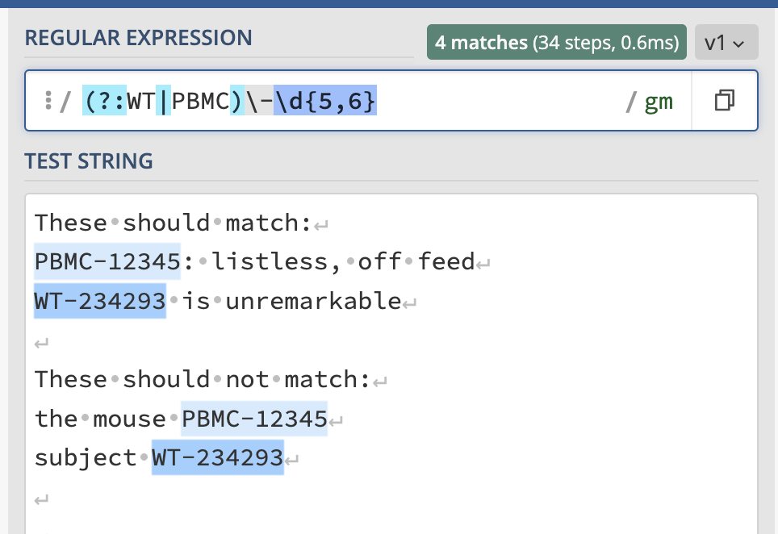
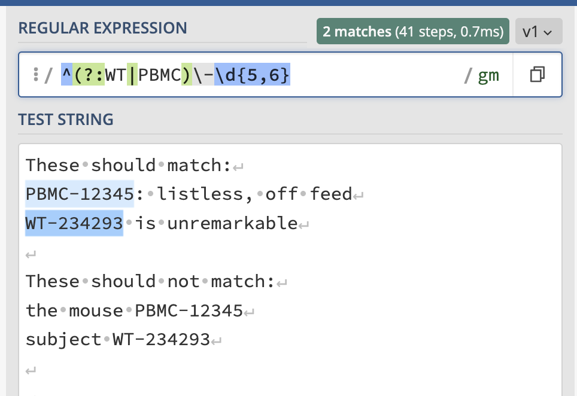
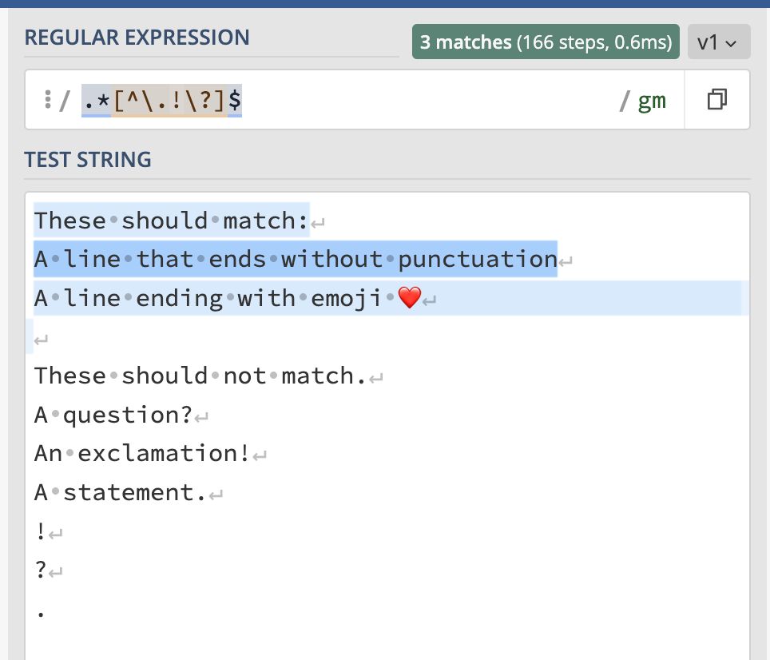
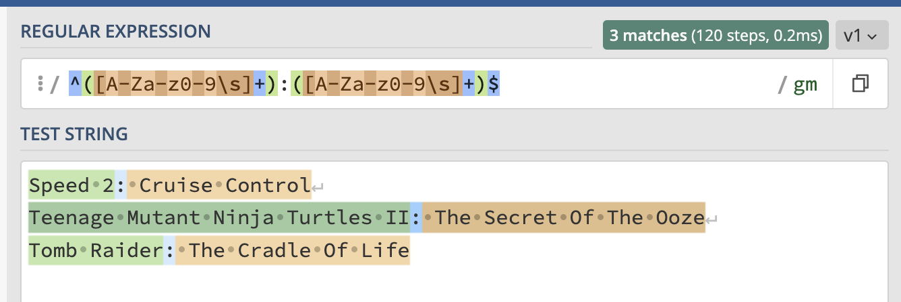
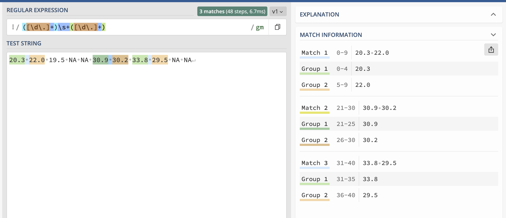
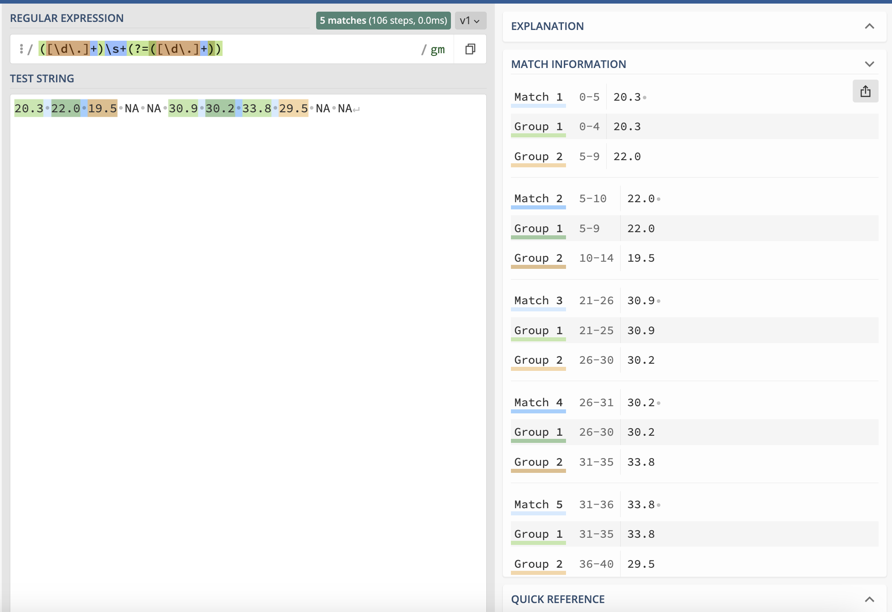

<!--

author:   Joy Payton
email:    paytonk@chop.edu
version:  1.0.0
current_version_description: Initial version
module_type: standard
docs_version: 1.0.0
language: en
narrator: UK English Female
mode: Textbook

title: Introduction to Regular Expressions

comment:  Learn about pattern matching using regular expressions, or regex.

long_description: Regular expressions, or regex, are a way to specify patterns (such as the pattern that defines a valid email address, medical record number, or credit card number).  Being able to use regex will make it easier for you to find important data.

estimated_time_in_minutes: 60

@pre_reqs
Learners will be able to apply the skills learned in this module most rapidly if they have beginner-level experience in at least one query or programming language, such as SQL, R, Python, or Bash.  However, this module does not require coding experience and no computer code is written in this module.
@end

@learning_objectives  
After completion of this module, learners will be able to:

- Define an alphanumeric pattern in regex notation
- Use capturing groups to extract data from a regular expression
- Use anchors and boundaries in regular expressions
- Test regular expressions in a browser
@end

@version_history 
No previous versions.
@end

import: https://raw.githubusercontent.com/arcus/education_modules/main/_module_templates/macros.md
-->

# Regular Expressions

@overview

## What is a Regular Expression?

The word *regular* (like *regulate*) comes from the Latin root for "rule": *regula*.  A **regular expression** is a specific way to **express** a **rule** for a pattern.  For example, one pattern rule might be for a phone number in the United States.  A phone number in the United States has:

1. A three-digit area code, possibly enclosed by parentheses
2. An optional separator, like a whitespace character (tab, space, etc.), hyphen, or a period
3. A set of three digits
4. An optional separator, like a whitespace character (tab, space, etc.), hyphen, or a period
5. A set of four digits

For example, these are all valid US phone numbers, and you might see them written various ways.

* `(212) 555-1212`
* `212.555.1212`
* `212 555-1212`
* `2125551212`
* `(215)555.1212`

How could you write an expression that expresses the rules we listed above?  This is the regular expression that captures the five rules we enumerated.

`\(?\d{3}\)?[\s\-\.]?\d{3}[\s\-\.]?\d{4}`

Using the pattern above, you could search for and find any phone number (assuming we got the rules right) in your data, without having to scan visually or search for specific area codes.  In this module, you'll learn how to construct regular expressions like the one above and how to use them in code.  For now, here's a sneak preview of what each segment of this regular expression mean:

* `\(?` : Optionally, a single `(` character
* `\d{3}`: Exactly three digits 0-9
* `\)?` : Optionally, a single `)` character
* `[\s\-\.]?`: Optionally, one of the following: a whitespace character, a hyphen, or a period.
* `\d{3}`: Exactly three digits 0-9
* `[\s\-\.]?`: Optionally, one of the following: a whitespace character, a hyphen, or a period.
* `\d{4}`: Exactly four digits 0-9

## Why Use Regex?

There are two very common reasons you as a researcher might want to use regular expressions (also referred to as "regex", which you can pronounce either with "reg" rhyming with "beg" or "reg" rhyming with "wedge").

**Reason 1: Searching for the needle in the haystack**

You're writing code or looking through data and want to find, or find and replace, something that matches a predictable pattern.  For example, maybe you have used hexidecimal color specifications such as `#ccc` or `#FF1451` in your data visualizations in R, and you want to find all of those, because you want to add comments in your code disclosing the color in English so that your code is more understandable. 

This goes beyond the typical search you would use in Word or other programs, because you want to find multiple values that start with a hash mark (#) and are followed by three or six digits ranging from 0-9 and A-F (or a-f).

**Reason 2: Extracting useful sub-strings**

You're analyzing some text values and need to change them, mine them for parts, or clean them up. For example, in your data, every time you see an identifier that looks like `[some numbers]_[more numbers]` you want to extract the first set of numbers, which represents a patient identifier, and the second set of numbers, which represents a sample number, and create new data columns with that information, which will allow you to work with just the patient identifier or just the sample number more easily.

<b style="color: rgb(var(--color-highlight));">A little encouragement...</b> 

Regular expressions can look intimidating, but they aren't that hard to learn thanks to useful web tools that help you practice.  If you work with strings (character data) frequently, whether that's from free-text entries in a REDCap database, text from web-scraped blogs, or a clinical notes from an electronic health record, the learning curve is definitely worth it!  

The goal of regular expressions is to describe patterns based in which characters occur, and how many, in what order.  You can also put in a "capturing" element, to capture a specific part of the pattern (in our  example, extracting the patient identifier and/or the sample number).

## A Great Tool to Start With

Before we explain the details of how to construct regular expressions, it can be helpful to introduce the online regex checker as a great resource to learn and to check your regex before trying to use it in a script.

We like "Regex 101", at https://www.regex101.com, but you can also search online for "regex checker" to find other, similar websites.  Regex 101 allows you to enter your regular expression as well as some sample text that you want to apply the regular expression to.  Below, or by [trying it out yourself](https://regex101.com/r/JJB8T3/1), you can see that we put in our "phone number" regular expression (at the top of the screen, in the appropriately labeled box) as well as the different varieties of phone number we want to make sure match our pattern (pasted in the larger text area below).  Matches are highlighted, and the number of matches is given (in our case, all five varieties of phone number do indeed match our pattern).  

<!-- style = "border: 1px solid rgb(var(--color-highlight));" -->

On the right side, there are helpful hints in three different scrollable windows.

**Explanation Section**

At the top of the right pane, each segment of the regular expression is parsed, or explained.  For example, we read the explanation of our first bit of regex as follows:

> `\(` matches the character `(` with index 4010 (2816 or 508) literally (case sensitive)  
> ? matches the previous token between zero and one times, as many times as possible, giving back as needed (greedy)

This explanation describes the first bit of regex.  First, it describes the character or characters indicated (in our case, the left parenthesis, `(`), then it describes the modifier that follows, which in our case is a question mark (`?`), which indicates that we want to find the indicated character 0-1 times in the pattern at that position.

What does "index 4010 (2816 or 508)" mean?  It's a description of the encoding of the `(` symbol in different number systems. The decimal code for left parenthesis is 40. This is equivalent to the hexadecimal (base 16 number that uses digits 0-F) number 28 and the octal (base 8 number that uses digits 0-7) 50.

**Match Information Section**

Below the explanation of the regular expression, there's a section marked "Match Information" which indicates which lines in our test string area match the pattern we gave.  In our case, each line is a match.  Matches are highlighted in alternating bands of light and dark highlighting.

**Quick Reference Section**

At the bottom right, there is a reference section to help you write regular expressions.  "Common Tokens" and "Quantifiers" will be a great place to get started learning or practicing regular expressions

**Other elements**

You might notice a language selector on the left indicating what "flavor" of regular expressions to use. Generally, we suggest PCRE2 to learn from, as this flavor (Perl Compatible Regular Expressions 2) is widely adopted across languages and any differences between PCRE2 and the flavor used in your environment is likely to be small.

### An Aside: Flags

The regular expression checker we refer to and use for this module, [Regex 101](https://www.regex101.com), has, by default, the "global" and "multiline" flags set.  We won't get into setting flags, which is something you will learn when you start using regular expressions within the context of a programming language.

If you do some internet searches or use a regular expression checker, you might wondering why regular expressions are often put between forward slashes followed by a lower case `g`, or lower case `gm`, it's because of how regular expressions are written in some programming languages like Perl and Javascript and some utilities like `sed`.  

<!-- style = "border: 1px solid rgb(var(--color-highlight)); max-width: 400px;" -->

<!-- style = "border: 1px solid rgb(var(--color-highlight)); max-width: 300px;" -->

<!-- style = "border: 1px solid rgb(var(--color-highlight)); max-width: 400px;" -->

You don't need to worry about enclosing your regular expressions in forward slashes for this module!  However, if you do use different "flags" than we do, you might see an occasional difference in how the regular expression we show works in your environment.  Try setting your flags to "global" and "multiline", and you should get identical results to what we show here.

## Simple Regular Expressions

To describe a pattern, you need to indicate what characters you expect to see, and how many of them, for each section of the pattern.  Most typically, we work left to right, and describe a pattern in order.  

We'll start out by describing the two most important elements of regex: describing which characters, and then quantifying how many of those characters you expect to find at that point in the pattern.

Soon, the mysterious set of symbols that makes up a regular expression will make sense and not feel like random characters!

### Which Characters?

Patterns defined in regex often involve special groups of [unicode characters](https://en.wikipedia.org/wiki/List_of_Unicode_characters).  For example, alphabetic characters (a-z and A-Z) are made of several groups, digits (0-9) form a group, whitespace characters like tab and space are another group of characters.  Maybe your patient identifiers begin with three letters (a special group), then have a hyphen (only a single character is valid here), then have four digits (another special group).  You can use predefined groups or define your own.

Here are some common ways to designate which characters form part of a pattern:

* Any single digit (0-9) is represented `\d`  
* Any character at all? That's `.`
* A whitespace character like space or tab? That's `\s`
* Any given letter or number, like the character "u", can be used as-is: `u`
* The upper-case letters only?  You can enclose a range of unicode characters in square brackets using a hyphen: `[A-Z]` captures the Latin letters A to Z.  Letters are tricky because they can have two cases and also have various diacritics, so let's take a closer look:

  * Any lower case Latin letter? `[a-z]`.  
  * Upper and lower? You can do two ranges: `[A-Za-z]`. You can also do this by using a special code: `[[:alpha:]]`.
  * `[A-Za-zÀ-ÿ]` will additionally give you [accented letters and letters with circumflex, umlaut, etc.](https://en.wikipedia.org/wiki/List_of_Unicode_characters#Latin_script:~:text=%23-,Latin%20Extended%2DA,-%5Bedit%5D) that belong to European languages.  However, this range also happens to span the unicode range that includes some math characters, namely `×` and `÷`.
  * `[A-Za-zÀ-ÖØ-öø-ÿ]` gives you all the European letters and excludes `×`, and `÷`.
  * Need to add [Cyrillic](https://en.wikipedia.org/wiki/List_of_Unicode_characters#Cyrillic)? That's this range: `[Ѐ-ӿ]`
  * There are other language-specific ranges to consider, and you can find the starting and ending symbols to put as the range by looking at a [list of unicode characters](https://en.wikipedia.org/wiki/List_of_Unicode_characters).

* Any digit 0-7, but not other digits? `[0-7]`
* Need to put in an "or"?  For example, there will either be an `8` or the letter `Z` in a given position?  You can use the vertical pipe: `8|Z`.
* What if you have several possibilities and you want to simplify things and not pipe between each letter?  An alternate way to indicate a group of possibilities is to put the permitted characters between square brackets.  `[rRpP]` indicates that any of the four included characters `r`, `R`, `p`, or `P` could appear.
* What about excluding some characters?  Let's say you are describing an alphanumeric code that excludes 0 and O (the digit and the capital letter) to reduce confusion.  You can use the caret (`^`) followed by the characters to avoid: `[^0O]`

**Special Characters**

Want to use a "special" character (such as square brackets or parentheses or periods) that regex uses as part of its syntax to define patterns? You can use a backslash to indicate "literally this character".  The use of a backslash to indicate "no, this thing, literally" is called an **escape sequence**.  

* For example, `.` means "any character can go here in the pattern" while `\.` means "a literal period should go here in the pattern."  
* A hyphen, if it's within square brackets as part of a range, is interpreted as "through", so that `[A-Z]` means "A through Z".  If you meant "A, or hyphen, or Z", you'd need that backslash: `[A\-Z]`.
* A hyphen **outside** of square brackets doesn't technically require the backslash, but it will never hurt to add it, if you're looking for a literal hyphen.  
* Are you looking for a literal square bracket or parenthesis?  You'll need a backslash: `\[` and `\(`, respectively.
* What if you're looking for a literal backslash (` \ `)?  You'll have to double it: ` \\ `.

<b style="color: rgb(var(--color-highlight));">Important note</b> 

These are the symbols that **always** have special meaning in regex, regardless of where they appear in a regular expression.  This means you'll need to use a backslash to indicate you are referring to the literal character, and not using it in its special regex way:

`. ^ $ * + ? { } [ ] \ | ( )`

We haven't talked about all of these symbols yet, but it will be helpful for you to keep in mind that these special characters (**metacharacters**, to be precise) will always have a special meaning in regex and will require an escape sequence.

These rules can be confusing, and even with lots of practice using regular expressions, it can be time saving and helpful to use a regex checker like [Regex 101](https://www.regex101.com) to test out your pattern with some sample strings.  Add your pattern and put in a few test strings -- some that match your desired pattern, and some that don't, so you can see if you're getting the pattern description right in your regex code.

### How Many Characters?

How many characters of the same kind are in a row? Sometimes we know there should be only one of something (for example, just one `@` in an email address).  Sometimes there can be an optional character (like the optional parentheses around the area code of a U.S. phone number).  Sometimes there are a specific number of characters from the same group (like exactly three letters or five numbers).  Maybe there's a range, such as at least 2 letters but not more than 20.  Regular expressions allow you to quantify characters in a pattern as well.

* An optional character, which might not appear at all or might appear once can be represented with a `?` quantifier.  For example, a phone number pattern that might begin with the number 1 or might omit it could begin with `1?`
* An optional character that could repeat zero, one, or multiple times can be quantified with an asterisk (`*`).  For example, a phone number can have an optional extension that has one, two, or more digits.  That could be represented as `\d*`.
* At least one, maybe more? That's `+`. So, a first name has to have at least one letter, but could have more: `[A-Za-z]+`
* A specific range, like one to three, but not less than one or more than three? That's `{1,3}`.  For example, maybe you know that in your health system, medical record numbers could have 6, 7, or 8 digits: `\d{6,8}`
* An open ended range, such as "two or more" can be written by omitting the upper boundary: `{2,}`.

### Quiz 1: Simple Patterns

Let's get started with some simple patterns.

You are running an animal model study of insulin resistance and immune function, and your wild type subjects are given identifiers that include `WT` (wild type), followed by a hyphen, and a subject identifier of usually five (possibly 6) digits.  You are searching a long set of text notes for any observations made of your wild type subjects, and you're using a text editor like VSCode that allows you to use regular expressions in your search.  What's the best way to describe the pattern of a mouse identifier using regular expressions?

[( )] `[WT]\-\d{5}`
[( )] `WT\-\d{5-6}`
[(X)] `WT\-\d{5,6}`
[( )] `[WT\t\d{5,6}]`
[( )] `WT\-d{5,6}`
[[?]] Hint: Feeling stuck?  Try using [Regex 101](https://www.regex101.com)!
***

The regular expression `[WT]\-\d{5}` describes: One letter which could be a `W` or a `P`, followed by a literal hyphen `-`, followed by five digits.  That's not quite what we're looking for!

The regular expression `WT\-\d{5-6}` isn't written correctly and will be misinterpreted.  It starts off fine: Look for `W`, then `T`, then a literal hyphen `-`, then any digit... but the `{5-6}` part isn't the correct syntax for a quantifier, so it will probably be interpreted as the literal text to match.

The regular expression `WT\-\d{5,6}` is correct.  It describes a pattern that starts with `W`, then `T`, then a literal hyphen `-`, then five to six digits.

The regular expression `[WT\-\d{5,6}]` is entirely in square brackets.  This means it's describing a one character pattern that could include any of: `W`,`T`, a literal hyphen `-`, curly brace `{`, the number `5`, a comma `,`, the number `6`, or a curly brace `}`.

The regular expression `WT\-d{5,6}` is almost right. It describes a pattern that starts with `W`, then `T`, then a literal hyphen `-`, followed by five to six repetitions of the letter `d`.

***

The regular expression that gives the pattern for American Express credit card numbers is given as `3[47][0-9]{13}`.  Which of the following is true?  Select all that apply.

[[ ]] American Express credit card numbers start with `347`.
[[X]] American Express credit card numbers start with `34` or `37`.
[[ ]] American Express credit card numbers start with `3` or `47`.
[[ ]] American Express credit card numbers have 13 digits.
[[X]] American Express credit card numbers have 15 digits.
[[ ]] American Express credit card numbers have 16 digits.
[[ ]] American Express credit card numbers have a flexible number of digits.
[[?]] Hint: Feeling stuck?  Try using [Regex 101](https://www.regex101.com)!
***

Let's parse `3[47][0-9]{13}`.  This pattern indicates that American Express credit card numbers:

* Begin with a `3`
* Are followed with either a `4` or a `7`
* Then include 13 digits between `0` and `9`, inclusive.

This means that American Express credit card numbers will start with `34` or `37` and will have 15 digits.

***

## Capturing and Non-Capturing Groups

We stated at the beginning of this module that one of the primary reasons to use regular expressions is to extract data from strings.  That's what capturing groups accomplish.  Sometimes we need the power of groups to give our regular expressions more flexibility, but we don't need to capture the group we've made.  That's a non-capturing group.  

Let's dive in and learn about these very useful topics!

### Capturing Groups

Let's consider the case where you have identifiers for some genomics data, in which there is a series of numbers that represents the trio (a proband and their genetic parents), a letter that indicates the member of the trio (`P` for proband, `M` for mother, and `F` for father), an alphanumeric series that indicates an individual id, and a final alphanumeric identifier that is an accession id that can be traced back to the sequencer used.  Each of these groups is separated by an underscore, and it is not clear if there are any rules around the length of any of these fields, save the P/M/F trio membership identifier.  All letters will be uppercase.

For example, `002923_P_A56G199C2_030023472948651` indicates:

* Trio id: 002923
* Proband member of the trio 
* Individual subject identifier: A56G199C2
* Sample accession id: 030023472948651

In your analysis code, you want to separate these fields into several different columns of data, so that you can organize your data by trios, by individuals, and so on.  How can you extract different parts of the pattern?

This is where **capturing groups** become relevant.  You can indicate a capturing group by using parentheses, and this will allow you to capture text content, not just match the pattern.

Here's how we would simply **define** the pattern of our complex identifier, without capturing anything:

`\d+_[PMF]_[A-Z\d]+_\d+`

* `\d+` indicates 1 or more digits, 0-9 (the trio identifier).
* `_` indicates an underscore.
* `[PMF]` indicates one of `P`, `M` or `F` (the trio role).
* `_` indicates an underscore.
* `[A-Z\d]+` indicates one or more capital letters or digits 0-9 (the individual's id).
* `_` indicates an underscore.
* `\d+` indicates 1 or more digits, 0-9 (the accession id).

If we wanted to add a capture group for the trio identifier, we'd just add parentheses around that section of the regex (the first bit of our pattern):

`(\d+)_[PMF]_[A-Z\d]+_\d+`

We can do multiple capturing groups, too.  In a programming language like R or Python, you'll be able to write code that will give you the results of these capture groups.  For example, if you have a data frame with a column called "id" that has the long identifiers, you could split out that data into four additional columns that you call "trio\_id", "trio\_role", "subject\_id", and "accession\_id".

We won't go into the details for how to write this in code in this module, but you can look at the capturing results for multiple groups and practice this skill in a regex checker.  For example, let's say we wanted to extract all four components of our long id.  We can put parentheses around each group and add this regular expression to a regex checker like [Regex 101](https://www.regex101.com) and check to make sure we're capturing what we intend to.

We'll add the pattern `(\d+)_([PMF])_([A-Z\d]+)_(\d+)` to the small box labeled "regular expression", and our sample id, `002923_P_A56G199C2_030023472948651`, to the larger box labeled "test string".  [We can then see our captured groups on the right!](https://regex101.com/r/XmG4kp/1)

<!-- style = "border: 1px solid rgb(var(--color-highlight));" -->

We see four groups listed in the "Match Information" pane on the right side.  Above that pane, the "Explanation" pane goes into detail about each group.

### Non-Capturing Groups

Sometimes you want to define two different pattern options at a certain point in a complex string.  For example, let's go back to our mouse model example from [Quiz 1](#quiz-1-simple-patterns).  There, we said:

> You are running an animal model study of insulin resistance and immune function, and your wild type subjects are given identifiers that include `WT` (wild type), followed by a hyphen, and a subject identifier of usually five (possibly 6) digits.  

What if you additionally had PBMC humanized mice, in addition to wild type mice, and you wanted to search for ids that started with either `WT` or `PBMC`, followed by a hyphen, followed by 5-6 digits?  You can add `WT|PBMC` (that is, either `WT` or `PBMC`) to a group by enclosing it in parentheses, like this:

`(WT|PBMC)\-\d{5,6}`

[That will work as valid regex](https://regex101.com/r/ZHs5iI/1) that will match with your various mouse subject ids.  However, you really don't need to capture that group, you're just using the parentheses to enclose a group that could go one of two different ways.  If you prefer, you can indicate that it's a non-capturing group by adding `?:` after the opening parenthesis, like this:

`(?:WT|PBMC)\-\d{5,6}`

[This will also work](https://regex101.com/r/ko7ySn/1) as a matching regular expression, but won't capture the group in question.

### Quiz 2: Capturing and non-capturing groups

Consider a regular expression with capturing group that describes email addresses:

`[A-Za-z\d\-\._]+@([A-Za-z\d\-\._]+\.[A-Za-z]{2,})`

 What will the capturing group in this regular expression actually capture?

[( )] The entire email address
[( )] The user mailbox (the entire part before the `@` of the email address)
[(X)] The email domain (the entire part following the `@` of the email address)
[( )] The TLD, or "top level domain" (the last period and last few letters, like `.com`, `.edu`, or `.gov`)
[( )] None of these
[[?]] Hint: Feeling stuck?  Try using [Regex 101](https://www.regex101.com)!
***

This regex looks intimidating, but it's really only a few parts.  Let's break it apart considering the email address `regex_is_awesome_123@fakemail.org`

* `[A-Za-z\d\-\._]+` means one or more letter, number, hyphen, period, or underscore (in our case, "regex_is_awesome_123")
* `@` indicates the `@`
* `[A-Za-z\d\-\._]+` again means one or more letter, number, hyphen, period, or underscore ("fakemail")
* `\.` indicates a literal period
* `[A-Za-z]{2,}` indicates two or more letters ("org").

In our case, we had a capturing group around the last three of those bullet points.  That means that what is captured is "fastmail.org", the entire email domain.

***

Consider these test strings, which are movie sequel titles:

* Speed 2: Cruise Control
* Teenage Mutant Ninja Turtles II: The Secret Of The Ooze
* Tomb Raider: The Cradle Of Life

Write a regular expression that will capture two groups for each movie: first, the part of the title before the colon, and second, the part of the title after the colon.  You can assume that you will have only one colon per movie title.  

What is the regex pattern that works for this use case?

[[put your regex here]]

***

There are multiple ways to make this regex work, and we haven't set this up to autograde, we've just marked your answer as correct.  But here are two ways to capture the two parts of the title.  You can click on either regular expression to see it in Regex 101!

* [`(.+):(.+)`](https://regex101.com/r/Hkewu0/1)
* [`([A-Za-z0-9 ]+):([A-Za-z0-9 ]+)`](https://regex101.com/r/oYNBKt/1).  

<b style="color: rgb(var(--color-highlight));">Important note</b> 

Note, in our second suggested regex we've put in a literal space (`  `) in the regular expression instead of using `\s`, because we don't want to capture carriage returns / new lines.  What's at issue?  Read on. 

* [`([A-Za-z0-9 ]+):([A-Za-z0-9 ]+)`](https://regex101.com/r/oYNBKt/1) works and returns six captured groups: three "main" titles before the colons and three "sub" titles after the colons.
* [`([A-Za-z0-9\s]+):([A-Za-z0-9\s]+)`](https://regex101.com/r/3kyzIp/1) looks like it should work -- the only thing we're doing is swapping out a literal space for `\s`, but it doesn't work.  This regular expression only captures four groups!  

What happened?  In the example that uses `\s`, we're treating "Cruise Control Teenage Mutant Ninja Turtles II" as a single string.  The special code `\s` includes the carriage return / new line which means our regular expression keeps going past the end of the line.  We'll talk about how to fix this in the next section, [Anchors](#anchors).

***

## A Bit More Advanced

Let's now delve into more advanced topics, including anchors, boundaries, and lookaheads.  Once you've learned these skills, you'll be a regular expressions hero!

![A note declares "Whenever I learn a new skill, I concoct elaborate fantasy scenarios where it lets me save the day."  A comic follows that shows one stick figure saying "Oh no! The killer must have followd her on vacation!  But to find them, we'd have to search through 200 MB of emails looking for something formatted like an address!", to which another stick figure replies, "It's hopeless!".  From afar, someone says, "Everybody stand back. I know regular expressions."  This hero then swings in on a rope, types some Perl code into the computer, and swings out on the same rope while the others cheer.](https://imgs.xkcd.com/comics/regular_expressions.png "[Regular Expressions](https://xkcd.com/208/) comic by xkcd, [CC BY-NC 2.5](https://xkcd.com/license.html).")

### Anchors

Sometimes, it's important that certain characters appear in a certain place in a string.  For example, maybe you're not trying to find all the mouse identifiers in your text, but rather trying to find only those entries in which the line **starts** with an identifier.  

Or maybe you are editing a text transcript and you want to find all the lines that end without one of the punctuation marks of `.`, `!`, or `?`.

Or, as in the case of our movie titles in [Quiz 2](#quiz-2-capturing-and-non-capturing-groups), we don't want the pattern matching to keep going over to the next string, but stop at the end of the line and restart at the beginning of the next.

The caret symbol `^` (indicating the beginning of a string) and dollar sign `$` (indicating the end of a string) are special characters called "anchors", which can be used when it's important to find patterns in a specific location.  

**Start of string anchoring**

Let's consider our mouse identifiers example.  We want to find text entries that begin with mouse identifiers, such as:  

* PBMC-12345: listless, off feed
* WT-234293 is unremarkable

We don't, on the other hand, want to find texts that have mouse identifiers that aren't at the beginning of the line.  These should not be pattern matches:

* the mouse PBMC-12345
* subject WT-234293

If we just [use the pattern for the identifier alone](https://regex101.com/r/oTOVnK/1), `(?:WT|PBMC)\-\d{5,6}`, we won't get that discrimination between line starters and non-line starters:

<!-- style = "border: 1px solid rgb(var(--color-highlight)); max-width:400px;" -->

However, if [we add the `^` at the start of our pattern](https://regex101.com/r/4HxMlo/1), resulting in `^(?:WT|PBMC)\-\d{5,6}`, we can indicate that our pattern must immediately begin the string:

<!-- style = "border: 1px solid rgb(var(--color-highlight)); max-width:400px;" -->

**End of string anchoring**

Let's check that strings end with one of our preapproved punctuation options.  We'd like to match problematic strings, which are ones that don't end in either a period, question mark, or exclamation point.  Do you remember how to say "except these characters" within square brackets in regex?  That's right...  we use `^`, which we could also use to indicate the start of a line!  Placement is everything.  Here's how we can write the pattern:

`.*[^\.!\?]$`

* `.*` means any amount of text, from zero to many characters
* `[^\.!\?]` means any character that isn't a period, exclamation point, or question mark.
* `$` means "the end of the string".

We can [check this in Regex 101](https://regex101.com/r/KIkx58/1) for accuracy, and put a few strings in to see if it's matching what we want it to match:

<!-- style = "border: 1px solid rgb(var(--color-highlight)); max-width:400px;" -->

**Remember the Movies?**

In our second quiz, we challenged you to come up with capturing two groups for each movie sequel title: first, the part of the title before the colon, and second, the part of the title after the colon.  We ran into problems when we used the regular expression `([A-Za-z0-9\s]+):([A-Za-z0-9\s]+)`.  [As we can see in Regex 101](https://regex101.com/r/3kyzIp/1), this did not segment our movie titles exactly right.  

This is what we had in mind:

| Title  | Subtitle |
| :--------- | :--------- |
| Speed 2   | Cruise Control   |
| Teenage Mutant Ninja Turtles II | The Secret Of The Ooze|
| Tomb Raider | The Cradle Of Life |

But this is what we got instead:

| Title  | Subtitle |
| :--------- | :--------- |
| Speed 2   | Cruise Control Teenage Mutant Ninja Turtles II | 
| The Secret Of The Ooze Tomb Raider | The Cradle Of Life |

We can fix this by adding anchors!  We'll say "start reading at the start of the line" by adding the start of string anchor (`^`) at the beginning and say "stop reading when you get to the end of the line" by adding the end of string character (`$`) at the end.  This gives us 

`^([A-Za-z0-9\s]+):([A-Za-z0-9\s]+)$`

When we [try this in Regex 101](https://regex101.com/r/Ld3HWY/1) we get exactly what we intended:

<!-- style = "border: 1px solid rgb(var(--color-highlight)); max-width:600px;" -->

### Boundaries 

Boundaries are similar to anchors in that they allow you to think in advanced ways about where your pattern is positioned.  For example, let's consider the **word boundary**.  

Word characters are (generally, and this can depend a bit by what flavor of regular expression engine you're using) letters, numbers, and underscores (`_`).  In the string `subject AB_123 has 12 lesions.`, there are five words: "subject", "AB\_123", "has", "12", and "lesions".  Between the words and after the last word are non-word characters (spaces and a period).  Where word characters meet non-word characters, there's a word boundary, indicated in regex as `\b`.

Word boundaries are useful in case you're looking for patterns that match the start or end of a word.  For example, what if you're looking in a text for "ome" words -- mentions of "microbiome", "genome", "transcriptome", "exome", "proteome", "trisome", "microsome" and similar words?  [If you look just for the pattern `ome`](https://regex101.com/r/gk7BYK/1), you will also match "women", "foment", "moment", "omega" and so on.  

<!-- style = "border: 1px solid rgb(var(--color-highlight)); max-width:400px;" -->

How can you indicate words that end in "ome"?  [Append a word boundary](https://regex101.com/r/GnLvOU/1) at the end of the `ome` pattern: `ome\b`.

<!-- style = "border: 1px solid rgb(var(--color-highlight)); max-width:400px;" -->

We still have some "false" hits with "home" and "some".  How could we solve this and require at least two, and not just one, leading letter?  That way, "home", "some", "come", "dome", etc. would be excluded, but "exome" would still match.

Well, what if we started off our pattern with "two or more characters" followed immediately by "ome" and then the word boundary?  [Something like `.{2,}ome\b`](https://regex101.com/r/Pm16s0/1)?

<!-- style = "border: 1px solid rgb(var(--color-highlight)); max-width:400px;" -->

What went wrong here?  Why is this treating my entire string up to "proteome" as a single match?  Regular expressions are by default **greedy**.  This is a technical term in regex that indicates that a regular expression will match the longest possible string that will match the pattern.  In our case, we weren't specific enough, because we said that any character (`.`) could be in the leading part of the string.  That includes letters and spaces.  Therefore, our long phrase "The genome of women is home to some of the most comely parts of the human exome: the omega moment that foments the prote" matches as the longest series of at least two characters preceding "ome" and a word boundary (the period). But that's not what we meant!  Luckily we can fix this by being more specific.  Click the regular expressions below to see them *in situ* on Regex 101.

* We could indicate that we want two or more letters, excluding other things like spaces, with [`[A-Za-z]{2,}ome\b`](https://regex101.com/r/TdF4kr/1)
* We could use the special "word character" symbol of `\w` to indicate that letters, numbers, and underscores are what we mean: [`\w{2,}ome\b`](https://regex101.com/r/sh6CV5/1).

In both of these cases, the matches we get back are the longer words that end in "ome" -- namely, "genome", "exome", and "proteome".

There are other defined boundaries, such as the "not a word" boundary (`\B`), which isn't supported in every engine.  For now, the word boundary will probably be enough for most of the regular expressions you need to write.

### Lookaheads

A regular expression engine (a program on your computer that operates your regular expressions) works by moving forward through text and analysing it.  You can imagine the computer as a finger tracing the text, always advancing, never moving backwards.  "Oh, a 3?  Great! I was told to expect a number, so that matches. Let me slide my finger to the next character.  It's a space, and that works, because there was an optional space in the next part of the pattern. I'll move once more. Oh, but the next character is a letter, which I wasn't expecting.  This isn't a match."

That usually works perfectly, but there are times when the "move ahead" model can cause trouble.  Overlapping patterns is one great example.

**Overlapping Patterns** 

A sensor in your experiment stores decimal values for PM 2.5 air contamination with a decimal number for each hour.  These are all saved together in a log file that continues with reading after reading, separated by spaces.  Sometimes the sensor stores the letters `NA` instead of a number because its intake was blocked, or there was an error of some sort.  

A log file includes text like `20.3 22.0 19.5 NA NA 30.9 30.2 33.8 29.5 NA NA`.

In your code, you'd like to process each pair of consecutive decimal values to study rate of change, so you are using regular expressions to return consecutive pairs of decimal numbers.  You only want consecutive pairs of numbers, not any consecutive pairs that have `NA` values.

You start by writing this very good regular expression to capture consecutive decimal numbers: `([\d\.]+)\s+([\d\.]+)`.  You [try this out in your favorite regex checker](https://regex101.com/r/pecVbn/1), and you're confused! Why do you only capture three pairs of numbers?  There should be five pairs!

Well, once the regex engine has found and captured the first pair (20.3 and 22.0), it has already "moved its finger" to the space following 22.0.  It then starts moving forward again, looking for a pattern match, and finds another pair at 30.9 and 30.2, and captures those.  At this point, it's at the space after 30.2, and it begins to move again. It then finds 33.8 and 29.5 as the final pair.  In the image below, we're showing the regular expression, the test string, and the matches that occur from "moving ahead" in the string.

 <!-- style = "border: 1px solid rgb(var(--color-highlight)); " -->

This is a case where you would like the regex engine to not **move** ahead, but rather **look** ahead.  Imagine that the regex engine moves along and finds 20.3.  Then it keeps its place and doesn't move, but it "looks" ahead and sees that yes, 20.3 is indeed followed by another decimal number, so this is a match.  The computer therefore captures that pair, 20.3 and 22.0.  Once that's done, it starts moving again, to 22.0, and when it hits the space after 22.0, it again stops, and **looks** ahead, without **moving** ahead, to see 19.5.  That's our second pair of numbers, 22.0 and 19.5.  This continues and we manage to find all 5 pairs of consecutive numbers, even when the patterns overlap.  

The **lookahead** regular expression syntax takes the form of `(?=regex)` where `regex` is replaced with what you're looking for.  So, for example, our pattern for the second decimal number, which is currently in a capturing group and looks like: `([\d\.]+)` could be placed between `(?=` and `)`, giving us `(?=([\d\.]+))`.
Go ahead and [try that in a regex checker](https://regex101.com/r/NvzPb0/1) and you should see something like the following:

 <!-- style = "border: 1px solid rgb(var(--color-highlight));" -->

There are other types of "lookarounds", including **lookbehinds**, that you might consider learning if you write a lot of regular expressions, but for now, the lookahead by itself will serve you well for more complex cases.

### Quiz 3: A Bit More Advanced

What's the anchor character that indicates the "start of a string"?

[[just one character here]]

***

The anchor for the start of a string is the caret, or `^`, symbol.

***

What's the anchor character that indicates the "end of a string"?

[[just one character here]]

***

The anchor for the start of a string is the dollar sign, or `$`, symbol.

***

What's the two character sequence that indicates the boundary between a word-type character (like a letter, number, or underscore) and a non-word-type character (like punctuation or spaces)?

[[just two characters here]]

***

The code for a word boundary is ` \b `.

***

Which of these is true about lookaheads in regular expressions?

[( )] Lookaheads use the syntax ` \w`
[( )] Lookaheads can be helpful when dealing with overlapping patterns
[( )] Lookaheads describe special places in a string, like the very beginning or the very end.

***

The syntax ` \w` actually indicates a word character, like a letter, number, or underscore.  Lookaheads use a syntax like `(?=regex)`.

Lookaheads are ideal for overlapping patterns, and prevent missing matches.

The word that describes special places in the string, like the very beginning or end, is **anchor**, not lookahead.

***

## Additional Resources

If you want to check out regular expression checkers, here are a few we like:

* [Regex 101](https://regex101.com) is the regular expressions tester used in this module.  We use it regularly, even after working with regular expressions for many years.
* [RegExr](https://regexr.com/) has helpful teaching aids, including a hover-over explainer that allows you to investigate matches, and a way to look at complex nested elements (for instance, a range of characters inside square brackets inside a capturing group) in a visual way.
* [RegEx Testing](https://www.regextester.com/) has a clean, simple interface and a library of popular regular expressions to start with. 

For learning more about regular expressions, consider:

[Regular-Expressions.info](https://www.regular-expressions.info/) is a compact and comprehensive handbook that includes much more information than we could convey in this module. It does seem to want readers to download or buy particular products, but if you ignore that aspect, the website is quite useful. Their [quick reference](https://www.regular-expressions.info/refquick.html), for example, is great to keep nearby while writing regex!

The [Wikipedia page for regular expressions](https://en.wikipedia.org/wiki/Regular_expression) is quite good and delves into the history of regular expressions as well as some of its mathematical qualities.

## Feedback

@feedback
