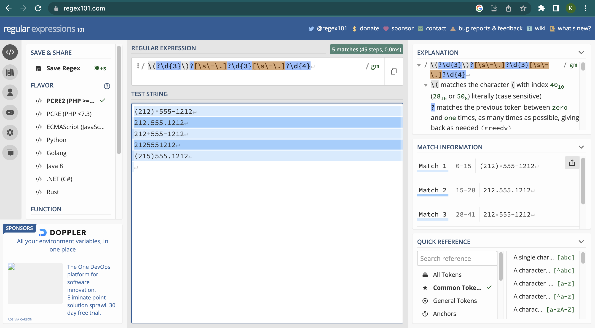

<!--

author:   Joy Payton
email:    paytonk@chop.edu
version:  1.0.0
current_version_description: Initial version
module_type: standard
docs_version: 1.0.0
language: en
narrator: UK English Female
mode: Textbook

title: Regular Expressions

comment:  Learn about regular expressions, or regex, and how to use them in SQL, R, and Python.

long_description: Regular expressions, or regex, are a way to specify patterns (such as the pattern that defines a valid email address, medical record number, or credit card number).  Being able to use regex will make it easier for you to find important data.

estimated_time_in_minutes: 60

@pre_reqs
Learners will get the most out of this module if they have beginner-level experience in at least one query or programming language, such as SQL, R, or Python.
@end

@learning_objectives  
After completion of this module, learners will be able to:

- Define an alphanumeric pattern in regex notation
- Test regular expressions in a browser
- Use regular expressions to filter data in SQL, R, or Python
@end

@version_history 
No previous versions.
@end

import: https://raw.githubusercontent.com/arcus/education_modules/main/_module_templates/macros.md
-->

# Regular Expressions

@overview

## What is a Regular Expression?

The word *regular* (like *regulate*) comes from the Latin root for "rule": *regula*.  A **regular expression** is a specific way to **express** a **rule** for a pattern.  For example, one pattern rule might be for a phone number in the United States.  A phone number in the United States has:

1. A three-digit area code, possibly enclosed by parentheses
2. An optional separator, like a space, dash, or a period
3. A set of three digits
4. An optional separator, like a space, dash, or a period
5. A set of four digits

For example, these are all valid US phone numbers, and you might see them written various ways.

* `(212) 555-1212`
* `212.555.1212`
* `212 555-1212`
* `2125551212`
* `(215)555.1212`

How could you write an expression that expresses the rules we listed above?  This is the regular expression that captures the five rules we enumerated.

`\(?\d{3}\)?[\s\-\.]?\d{3}[\s\-\.]?\d{4}`

Using the pattern above, you could search for and find any phone number (assuming we got the rules right) in your data, without having to scan visually or search for specific area codes.  In this module, you'll learn how to construct regular expressions like the one above and how to use them in code.  For now, here's a sneak preview of what each segment of this regular expression mean:

* `\(?` : Optionally, a single `(` character
* `\d{3}`: Exactly three digits 0-9
* `\)?` : Optionally, a single `)` character
* `[\s\-\.]?`: Optionally, one of the following: a blank space, a dash, or a period.
* `\d{3}`: Exactly three digits 0-9
* `[\s\-\.]?`: Optionally, one of the following: a blank space, a dash, or a period.
* `\d{4}`: Exactly four digits 0-9

## Why Use Regex?

There are two very common reasons you as a researcher might want to use regular expressions (also referred to as "regex", which you can pronounce either with "reg" rhyming with "beg" or "reg" rhyming with "wedge").

**Reason 1**: You're writing code or looking through data and want to find, or find and replace, something that matches a predictable pattern.  For example, maybe you have used hexidecimal color specifications such as `#ccc` or `#FF1451` in your data visualizations in R, and you want to find all of those, because you want to add comments in your code disclosing the color in English so that your code is more understandable. This goes beyond the typical search you would use in Word or other programs, because you want to find multiple values that start with a hash mark (#) and are followed by three or six digits ranging from 0-9 and A-F (or a-f).

**Reason 2**: You're analyzing some text values and need to change them, mine them for parts, or clean them up. For example, in your data, every time you see an identifier that looks like `[some numbers]_[more numbers]` you want to extract the first set of numbers, which represents a patient identifier, and the second set of numbers, which represents a sample number, and create new data columns with that information, which will allow you to work with just the patient identifier or just the sample number more easily.

Regular expressions are tricky to learn but if you work with strings (character data) frequently, whether that's from free-text entries in a REDCap database, text from web-scraped blogs, or a problem list from an electronic health record, the learning curve is definitely worth it!

The idea of regular expressions is to describe patterns based in which characters occur, and how many, in what order.  You can also put in a "capturing" element, to capture a specific part of the pattern (in our  example, extracting the patient identifier and/or the sample number).

## A Great Tool to Start With

Before we explain the details of how to construct regular expressions, it can be helpful to introduce the online regex checker as a great resource to learn and to check your regex before trying to use it in a script.

We like "Regex 101", at https://www.regex101.com, but you can also search online for "regex checker" to find other, similar websites.  Regex 101 allows you to enter your regular expression as well as some sample text that you want to apply the regular expression to.  Below, you can see that we put in our "phone number" regular expression (at the top of the screen, in the appropriately labeled box) as well as the different varieties of phone number we want to make sure match our pattern (pasted in the larger text area below).  Matches are highlighted, and the number of matches is given (in our case, all five varieties of phone number do indeed match our pattern).  

On the right side, there are helpful hints in three different scrollable windows.

**Explanation Section**

At the top of the right pane, each segment of the regular expression is parsed, or explained.  For example, we read the explanation of our first bit of regex as follows:

> `\(` matches the character `(` with index 4010 (2816 or 508) literally (case sensitive)  
> ? matches the previous token between zero and one times, as many times as possible, giving back as needed (greedy)

This explanation describes the first bit of regex.  First, it describes the character or characters indicated (in our case, the left parenthesis, `(`), then it describes the modifier that follows, which in our case is a question mark (`?`), which indicates that we want to find the indicated character 0-1 times in the pattern at that position.

What does "index 4010 (2816 or 508)" mean?  It's a description of the encoding of the `(` symbol in different number systems. The decimal code for left parenthesis is 40. This is equivalent to the hexadecimal (base 16 number that uses digits 0-F) number 28 and the octal (base 8 number that uses digits 0-7) 50.

**Match Information Section**

Below the explanation of the regular expression, there's a section marked "Match Information" which indicates which lines in our test string area match the pattern we gave.  In our case, each line is a match.  Matches are highlighted in alternating bands of light and dark highlighting.

**Quick Reference Section**

At the bottom right, there is a reference section to help you write regular expressions.  "Common Tokens" and "Quantifiers" will be a great place to get started learning or practicing regular expressions

**Other elements**

You might notice a language selector on the left indicating what "flavor" of regular expressions to use. Generally, we suggest PCRE2 to learn from, as this flavor (Perl Compatible Regular Expressions 2) is widely adopted across languages and any differences between PCRE2 and the flavor used in your environment is likely to be small.

## Writing Regular Expressions

To describe a pattern, you need to indicate what characters you expect to see, and how many of them, for each section of the pattern.  Most typically, we work left to right, and describe a pattern in order.  

We'll start out by describing the two most important elements of regex: describing which characters, and then quantifying how many of those characters you expect to find at that point in the pattern.

### Which Characters?

Patterns defined in regex often involve special groups of [unicode characters](https://en.wikipedia.org/wiki/List_of_Unicode_characters).  For example, alphabetic characters (a-z and A-Z) are a group, digits (0-9) are another, whitespace characters like tab and space are another group of characters.  Maybe your patient identifiers begin with three letters (a special group), then have a dash (only a single character is valid here), then have four digits (another special group).  You can use predefined groups or define your own.

Here are some common ways to designate which characters form part of a pattern:

* Any single digit (0-9) is represented `\d`  
* Any character at all? That's `.`
* A whitespace character like space or tab? That's `\s`
* Any given letter or number, like the character "u", can be used as-is: `u`
* The upper-case letters only?  You can enclose a range of unicode characters in square brackets using a dash: `[A-Z]` captures the Latin letters A to Z.  Letters are tricky because they can have two cases and also have various diacritics, so let's take a closer look:

  * Any lower case Latin letter? `[a-z]`.  
  * Upper and lower? You can do two ranges: `[A-Za-z]`. You can also do this by using a special code: `[[:alpha:]]`.
  * `[A-Za-zÀ-ÿ]` will additionally give you [accented letters and letters with circumflex, umlaut, etc.](https://en.wikipedia.org/wiki/List_of_Unicode_characters#Latin_script:~:text=%23-,Latin%20Extended%2DA,-%5Bedit%5D) that belong to European languages.  However, this range also happens to span the unicode range that includes some math characters, namely `×` and `÷`.
  * `[A-Za-zÀ-ÖØ-öø-ÿ]` gives you all the European letters and excludes `×`, and `÷`.
  * Need to add [Cyrillic](https://en.wikipedia.org/wiki/List_of_Unicode_characters#Cyrillic)? That's this range: `[Ѐ-ӿ]`
  * There are other language-specific ranges to consider, and you can find the starting and ending symbols to put as the range by looking at a [list of unicode characters](https://en.wikipedia.org/wiki/List_of_Unicode_characters).

* Any digit 0-7, but not other digits? `[0-7]`
* Need to put in an "or"?  For example, there will either be an `8` or the letter `Z` in a given position?  You can use the vertical pipe: `8|Z`.
* What if you have several possibilities and you want to simplify things and not pipe between each letter?  An alternate way to indicate a group of possibilities is to put the permitted characters between square brackets.  `[rRpP]` indicates that any of the four included characters `r`, `R`, `p`, or `P` could appear.
* What about excluding some characters?  Let's say you are describing an alphanumeric code that excludes 0 and O (the digit and the capital letter) to reduce confusion.  You can use the caret (`^`) followed by the characters to avoid: `[^0O]`

**Special Characters**

Want to use a "special" character (such as square brackets or parentheses or periods) that regex uses as part of its syntax to define patterns? You can use a backslash (or several... more on this later) to indicate "literally this character".  The use of a backslash to indicate "no, this thing, literally" is called an **escape sequence**.  

* For example, `.` means "any character can go here in the pattern" while `\.` means "a literal period should go here in the pattern."  
* A dash, if it's within square brackets as part of a range, is interpreted as "through", so that `[A-Z]` means "A through Z".  If you meant "A, or dash, or Z", you'd need that backslash: `[A\-Z]`.
* A dash outside of square brackets might not absolutely need the backslash, but it will never hurt to add it, if you're looking for a literal dash, which happens in lots of places (hyphenated names, Social Security numbers, phone numbers, ranges in lab reports, and more).
* Are you looking for a literal square bracket or parenthesis?  You'll need a backslash: `\[` and `\(`, respectively.

These rules can be confusing, and even with lots of practice using regular expressions, it can be time saving and helpful to use a regex checker like [Regex 101](https://www.regex101.com) to test out your pattern with some sample strings.  Add your pattern and put in a few test strings -- some that match your desired pattern, and some that don't, so you can see if you're getting the pattern description right in your regex code.

### How Many Characters?

How many characters of the same kind are in a row? Sometimes we know there should be only one of something (for example, just one `@` in an email address).  Sometimes there can be an optional character (like the optional parentheses around the area code of a U.S. phone number).  Sometimes there are a specific number of characters from the same group (like exactly three letters or five numbers).  Maybe there's a range, such as at least 2 letters but not more than 20.  Regular expressions allow you to quantify characters in a pattern as well.

* An optional character, which might not appear at all or might appear once can be represented with a `?` quantifier.  For example, a phone number pattern that might begin with the number 1 or might omit it could begin with `1?`
* An optional character that could repeat zero, one, or multiple times can be quantified with an asterisk (`*`).  For example, a phone number can have an optional extension that has one, two, or more digits.  That could be represented as `\d*`.
* At least one, maybe more? That's `+`. So, a first name has to have at least one letter, but could have more: `[A-Za-z]+`
* A specific range, like one to three, but not less than one or more than three? That's {1,3}.  For example, maybe you know that in your health system, medical record numbers could have 6, 7, or 8 digits: `\d{6,8}`

## Quiz 1: Simple Patterns

Let's get started with some simple patterns.

You are running an animal model study of insulin resistance and immune function, and your wild type subjects are given identifiers that include `WT` (wild type), followed by a dash, and a subject identifier of usually five (possibly 6) digits.  You are searching a long set of text notes for any observations made of your wild type subjects, and you're using a text editor like VSCode that allows you to use regular expressions in your search.  What's the best way to describe the pattern of a mouse identifier using regular expressions?

[( )] `[WT]\-\d{5}`
[( )] `WT\-\d{5-6}`
[(X)] `WT\-\d{5,6}`
[( )] `[WT\t\d{5,6}]`
[( )] `WT\-d{5,6}`
[[?]] Hint: Feeling stuck?  Try using [Regex 101](https://www.regex101.com)!
***

The regular expression `[WT]\-\d{5}` describes: One letter which could be a `W` or a `P`, followed by a literal dash `-`, followed by five digits.  That's not quite what we're looking for!

The regular expression `WT\-\d{5-6}` isn't written correctly and will be misinterpreted.  It starts off fine: Look for `W`, then `T`, then a literal dash `-`, then any digit... but the `{5-6}` part isn't the correct syntax for a quantifier, so it will probably be interpreted as the literal text to match.

The regular expression `WT\-\d{5,6}` is correct.  It describes a pattern that starts with `W`, then `T`, then a literal dash `-`, then five to six digits.

The regular expression `[WT\-\d{5,6}]` is entirely in square brackets.  This means it's describing a one character pattern that could include any of: `W`,`T`, a literal dash `-`, curly brace `{`, the number `5`, a comma `,`, the number `6`, or a curly brace `}`.

The regular expression `WT\-d{5,6}` is almost right. It describes a pattern that starts with `W`, then `T`, then a literal dash `-`, followed by five to six repetitions of the letter `d`.

***

### Special Actions

Do some characters need to be saved or pulled out of a string? For example, do I want to pull out just the first number sequence in every phrase that looks like subject_[numbers]_studylocation_[more numbers]?

## Additional Resources

## Feedback

@feedback
