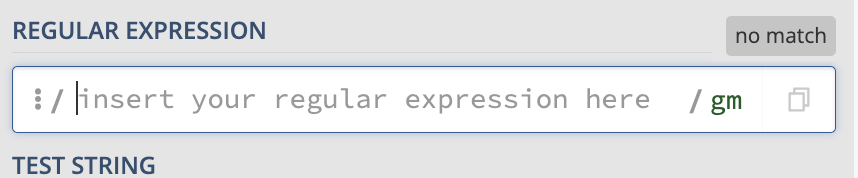
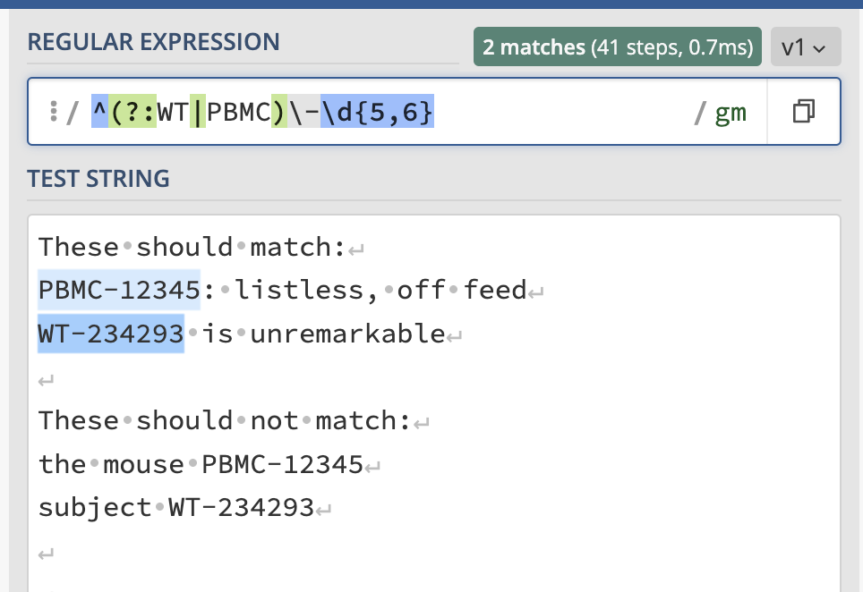

<!--

author:   Joy Payton
email:    paytonk@chop.edu
version:  1.0.0
current_version_description: Initial version
module_type: standard
docs_version: 1.0.0
language: en
narrator: US English Female
mode: Textbook

title: Regular Expressions: Flags, Anchors, and Boundaries

comment:  Use flags, anchors, and boundaries in regular expressions, or regex, for complex pattern matching.

long_description: Learn to compose intermediate regular expressions using flags, anchors, boundaries, and more, in order to find text that matches patterns you describe.

estimated_time_in_minutes: 45

@pre_reqs
Learners should have some experience composing and using moderately complex regular expressions (regex).  For an introduction to regular expression concepts, consider the [Demystifying Regular Expressions](https://liascript.github.io/course/?https://raw.githubusercontent.com/arcus/education_modules/main/demystifying_regular_expressions/demystifying_regular_expressions.md#1) module.  To learn how to compose and use simple regular expressions, consider the [Regular Expressions Basics](https://liascript.github.io/course/?https://raw.githubusercontent.com/arcus/education_modules/main/regular_expressions_basics/regular_expressions_basics.md#1) module.  We refer to groups in this module, which are covered in the [Regular Expressions: Groups](https://liascript.github.io/course/?https://raw.githubusercontent.com/arcus/education_modules/main/regular_expressions_groups/regular_expressions_groups.md#1) module. 
@end

@learning_objectives  
After completion of this module, learners will be able to:

- Explain what a regular expression flag does
- Use anchors and boundaries in regular expressions
- Use boundaries in regular expressions

@end
good_first_module: false
coding_required: true
coding_level: intermediate
sequence_name: regex
previous_sequential_module: regular_expressions_groups
@sets_you_up_for
- regular_expressions_lookaheads
@end 
@depends_on_knowledge_available_in
- demystifying_regular_expressions
- regular_expressions_basics
- regular_expressions_groups
@end
@version_history 
No previous versions.
@end

import: https://raw.githubusercontent.com/arcus/education_modules/main/_module_templates/macros.md
-->

# Regular Expressions: Flags, Anchors, and Boundaries

@overview

## Regular Expression Refresher

A **regular expression** (also known as "regex") is a specific way to **express** a **rule** for a pattern.  Regular expressions are useful to biomedical researchers because they can allow you to find, replace, or extract text that matches patterns you define.  

A good place to practice regular expressions is an online regex testing website.  We like **Regex 101**, at https://www.regex101.com.

Regex consists of **tokens** which represent characters that appear in a particular location, and **quantifiers**, which give the number of times a given token repeats.

- **Tokens** include `\d`, `[A-Za-z]`, `A`, and `.`

- **Quantifiers** include `*`, `{2,5}`, and `+`

Regular expressions can make use of **groups**, both **capturing** and **non-capturing**.

If this refresher doesn't seem familiar, you might want to consider reviewing [Demystifying Regular Expressions](https://liascript.github.io/course/?https://raw.githubusercontent.com/arcus/education_modules/main/demystifying_regular_expressions/demystifying_regular_expressions.md#1), [Regular Expressions Basics](https://liascript.github.io/course/?https://raw.githubusercontent.com/arcus/education_modules/main/regular_expressions_basics/regular_expressions_basics.md#1), and [Regular Expressions: Groups](https://liascript.github.io/course/?https://raw.githubusercontent.com/arcus/education_modules/main/regular_expressions_groups/regular_expressions_groups.md#1).

## Scope of This Module

We consider this module to be intermediate, because it assumes basic knowledge covers more advanced regular expressions topics, without delving into the advanced topic of using regular expressions within the context of code.  

Specifically, we'll address these topics:

* **Anchors**, which help you define patterns that belong in the beginning and end of a string as a whole
* **Exclusions**, which allow you to look for patterns that exclude certain characters
* **Flags**, which are parameters that alter how regular expressions are interpreted
* **Boundaries**, which help you define patterns that belong in certain places that appear within a string
* **Greedy** default behavior in regex, which can cause unexpected pattern matches

## Regular Expression Flags

**Flags** in regex are parameters which can change how regular expressions are interpreted.  The regular expression checker we refer to and use for this module, [Regex 101](https://www.regex101.com), has, by default, the "global" and "multiline" flags set, which you can see written as "gm" after the "Regular Expression" box.   

Flags aren't written within a regular expression, but are set **outside** of it, either by clicking on something (it might be the word "flag" or an image of a flag) or by typing a letter (like "g" or "m") or letters into your code, separate from the definition of a regular expression. Three frequently used flags are:

* **Global (g)**.  This indicates that the entire string given for matching against the pattern should be checked.  Without the "g" or "global" flag, only the first match to the pattern will be found, and the regex parser will stop looking for additional matches.
* **Multiline (m)**.  This flag indicates that each line should be treated as as if it were its own string.  This is important when working with start-of-string and end-of-string **anchors**, which we'll talk about later in this module.  When the multiline flag is turned on, it means that the anchors that typically only refer to the beginning and end of a string will also be used to the beginning and end of each line. 
* **Ignore / Insensitive (i)**.  "Ignore" indicates that pattern matching should be case-insensitive, so that differences in capitalization are ignored.

If you use different "flags" than we do (for example, if you're not using the default [Regex 101](https://www.regex101.com) as your regex checker), you might see an occasional difference in how the regular expression we show works in your environment.  In the regex checker you're using, try setting your flags to "global" and "multiline," and you should get identical results to what we show here in this module.  The flags usually are shown following a forward slash, appearing just after the regular expression ends:

<!-- style = "border: 1px solid rgb(var(--color-highlight)); max-width: 400px;" --> Screenshot taken from [https://regex101.com/](https://regex101.com/)

![A sample regular expression: `([A-Z])\w+` is enclosed within forward slashes.  After the closing forward slash, the letter "g" appears.](media/example2.png)<!-- style = "border: 1px solid rgb(var(--color-highlight)); max-width: 300px;" --> Screenshot taken from [https://regexr.com/](https://regexr.com/)

<!-- style = "border: 1px solid rgb(var(--color-highlight)); max-width: 400px;" --> Screenshot taken from [https://www.regextester.com/](https://www.regextester.com/)

<b style="color: rgb(var(--color-highlight));">Behind the scenes</b> 

If you do some internet searches or use a regular expression checker, you might wondering why regular expressions are often written between forward slashes.  That's because of how regular expressions are written in some programming languages like Perl and Javascript and some utilities like `sed`.  

You don't need to worry about enclosing your regular expressions in forward slashes for this module.  In fact, depending on what kind of code you write, you may never have to enclose your regular expressions in forward slashes.  Still, it's somewhat customary to see regular expressions written this way.

### Quiz: Flags

Which of the following statements are true?  Check all that apply.

[[ ]] Flags are only important if you're working in Perl.
[[ ]] Flags are written as the last letter or letters of a regular expression.
[[X]] Flags alter the rules around regular expression parsing.
[[X]] One common flag is "global," written with a `g`, which allows for multiple matches.
***

Flags can be important whether you're writing code or using a regular expressions checker, so it's not true that flags only matter for Perl code.  

Flags are declared outside of the definition of a regular expression, so the second statement is also false.  The last two statements are true.  

Flags alter the rules around regular expression parsing, and one common flag is "global," written with a `g`, which allows for multiple matches.

***

## Anchors

Sometimes, it's important that certain characters appear in a certain place in a string.  For example, maybe you're not trying to find all the mouse identifiers in your text, but rather trying to find only those entries in which the line **starts** with an identifier.  

Or maybe you are editing a text transcript and you want to find all the lines that **end** with a typo you keep seeing: a single or double quotation mark followed by a period.  

The caret symbol `^` (indicating the beginning of a string) and dollar sign / money symbol `$` (indicating the end of a string) are special characters called **anchors**, which can be used when it's important to find patterns in a specific location.  

It's important to recognize that each string has one and only one beginning, and one and only one end.  For example, this paragraph of text is written such that it may wrap to take up one, two, or more lines in your browser, depending on your browser.  But because there are no carriage returns (new lines) between the sentences in this paragraph, we could assert that the start of this string is the (invisible and unprinted) point right before the word "It's" in the first sentence.

And the end of the string above would be the (invisible and unprinted) point right after the period in the final word, "sentence." 

<b style="color: rgb(var(--color-highlight));">Important note</b> 

This is where one of your **flags** becomes important.  We're going to use Regex 101 with the "multiline" flag, which means that each line of text is considered its own string, which starts with a start-of-string and ends with an end-of-string.  You get a new string within the "Test String" box by hitting the Enter key and getting a new line of text.  Each time you do this, you get a new string, such that you can have multiple strings within your "Test String" box.  

As you try these yourself, make sure you're using a multiline flag as well!

If you're not using multiline, you might have a regular expression checker that considers the entire box that holds your test text to be just one string.  That would mean it has a single beginning and a single end for all of what you've written there.

### Start-of-string Anchoring

In a previous module, we talked about wild type (WT) and PBMC-humanized (PBMC) mouse models as a sample naming convention in a research study.  Let's consider the use case in which we want to find text entries (strings) that begin with subject identifiers, such as:  

* PBMC-12345: listless, off feed
* WT-234293 is unremarkable

We don't, on the other hand, want to find texts that have mouse identifiers that aren't at the beginning of the line.  These should not be pattern matches:

* the mouse PBMC-12345
* subject WT-234293

If we just [use the pattern for the identifier alone](https://regex101.com/r/oTOVnK/1), `(?:WT|PBMC)\-\d{5,6}`, we won't get that discrimination between line starters and non-line starters:

<!-- style = "border: 1px solid rgb(var(--color-highlight)); max-width:400px;" -->

However, if [we add the `^` at the start of our pattern](https://regex101.com/r/4HxMlo/1), resulting in `^(?:WT|PBMC)\-\d{5,6}`, we can indicate that our pattern must immediately begin the string:

<!-- style = "border: 1px solid rgb(var(--color-highlight)); max-width:400px;" -->

<b style="color: rgb(var(--color-highlight));">Important note</b> 

To correctly use `^` as the start-of-string token, you must not enclose it in square brackets.  If `^` appears inside square brackets, it will be intepreted as doing something quite different, as you are about to discover.

### Except: Another Use of the Caret 

On the previous page, we warned you about a potential pitfall:

> To correctly use `^` as the start-of-string token, you must not enclose it in square brackets.  If `^` appears inside square brackets, it will be intepreted as doing something quite different, as you are about to discover.

Let's look at three ways we can use the caret (`^`).

Start-of-string Caret
-----

If we want to indicate the start of a string, we add the caret at the beginning of our regular expression, being sure to not enclose it in square brackets.  We see an example of this in the regular expression `^(?:WT|PBMC)\-\d{5,6}`, which includes a start of string character followed by a non-capturing group with two alternatives, a hyphen, and then five to six digits.

Except-for Caret
------

We can also use the caret symbol in an "except for" clause in our regular expression.  For example, what if at a given position in a pattern, any character is possible except for a hash mark (#)?  We can say "except for" by using `^` as the first character within square brackets: `[^#]`.  

We can add multiple characters that should not appear within the square brackets.  If any character except for  #, 5, ., and % are permitted at a given location in a string, we could express that with the regular expression list `[^#5\.%]`. For example, `[ABXYZ]` means "any of these: A, B, X, Y, or Z," while `[^ABXYZ]` means "anything that **isn't** one of these: A, B, X, Y, and Z."  

<b style="color: rgb(var(--color-highlight));">Important note</b> 

To use `^` as "except for", it has to immediately follow an opening square bracket, and be followed by the characters it is indicating aren't acceptable.  You can't, for example, say "all the digits except for 7" by typing `\d^7` or `[\d^7]`.  One way to do that would be `[012345689]`, and another would be `[0-689]`.  

In some regular expression environments, you can do some advanced practices such as creating an **intersection** between two sets (such as the set of all digits and the set of all symbols except for 7), but the way to do this is different in different languages and regular expressions environments, so we won't go into detail about that here.

Similarly, if you wanted to define a list with all uppercase letters except F and L, the most universal way to accomplish that is `[A-EG-KM-Z]`, but you'll sometimes see other, system-specific regular expressions that go beyond the scope of this module.

Literal Caret
---

If you're looking for the actual symbol `^` in your text, you'll have to **escape** it by adding a backslash right before the caret: `\^`.  As a reminder, that backslash is useful for all **metacharacters** in regular expressions.  You'd do the same thing for the end-of-string character: `\$` is how you look for a literal dollar sign / money symbol.

### End-of-string Anchoring 

As a reminder, the symbol for end-of-string in a regular expression is `$`.  We can use this symbol to look for specific patterns at the end of strings.  For example, we could look for specific typos that tend to appear at the end of strings: periods that follow single or double quotation marks instead of being enclosed within the quotation.  Here are some examples of acceptable grammar and typos:

**Acceptable**

* stated, "I want to withdraw from the study."
* not clear on pre-registration next steps.'

**Typos**

* reported she "did not receive the sample".
* chi-square would not be robust'. 

The pattern we're looking for is "single or double quotation followed by a period and the end of the string," or `['"]\.$`.  If you want to see this in action, you can [try it on Regex 101](https://regex101.com/r/9eMUve/1).

### Combining It All

Let's combine start-of-string, except-for, and end-of-string, to match strings in our text which:

* Have a start-of-string followed by a capital letter A-Z, then
* Have ten to thirty characters that cannot include digits and then
* End in a final period (.) and end-of-string.

We could do that with this expression: `^[A-Z][^\d]{10,30}\.$`. 

* `^[A-Z]`: Start of string, capital letter.
* `[^\d]{10,30}`: Anything that isn't a digit, 10 to 30 of them.
* `\.$`: Literal period and end of string.

[See what that looks like on Regex 101](https://regex101.com/r/9tHqoi/1) and in the image below:

![A regular expression,`^[A-Z][^\d]{10,30}\.$`, is in the box labeled "Regular Expression," and there are five test strings typed in the "Test String" box. The test string that reads "This is a good string.", with a capital T at the beginning, is selected as a pattern match.  The second string, "this, not so good.", which begins with a lower case t, is not selected.  The third string reads "I'm an okay string." It is selected as a match.  The fourth string is "um, 3 things wrong here!", with a lower case starting letter, a numeral, and ending with an exclamation point. It is not selected. The final string says "I'm. A. Good. String."  Each word is capitalized and followed by a period.  It is marked as a match.](media/combining_it_all.png)<!-- style = "max-width: 300px; border: 1px solid rgb(var(--color-highlight));" -->

### Scenario: Start- and End-of-String Anchors

Consider these test strings, which are movie sequel titles:

* Speed 2: Cruise Control
* Teenage Mutant Ninja Turtles II: The Secret Of The Ooze
* Tomb Raider: The Cradle Of Life

You're helping a colleague who tried to write regex that would capture two groups for each movie: first, the part of the title before the colon, and second, the part of the title after the colon. 

They used this regular expression, which uses capturing groups:  `([A-Za-z0-9\s]+):([A-Za-z0-9\s]+)`. [As we can see in Regex 101](https://regex101.com/r/3kyzIp/1), this did not segment the movie titles exactly right.  The regular expression matches the pattern twice, not three times.  It gets the first capturing group correct.  But for the second capturing group, the parser takes the second part of the first movie and keeps reading well into the second movie line, stopping only when it gets to a colon. 

<!-- style = "border: 1px solid rgb(var(--color-highlight));" -->

This is what they **expected to see**:

| Title  | Subtitle |
| :--------- | :--------- |
| Speed 2   | Cruise Control   |
| Teenage Mutant Ninja Turtles II | The Secret Of The Ooze|
| Tomb Raider | The Cradle Of Life |

But this is what they got instead:

| Title  | Subtitle |
| :--------- | :--------- |
| Speed 2   | Cruise Control Teenage Mutant Ninja Turtles II | 
| The Secret Of The Ooze Tomb Raider | The Cradle Of Life |

It seems like the regular expression parser isn't stopping at the end of a string and restarting at the beginning of a string.  You assist your collague by adding syntax to their regular expression such that the pattern must start at the beginning of a string and end at the end of a string.  This is what you write:  

`^([A-Za-z0-9\s]+):([A-Za-z0-9\s]+)$`

When you [try this in Regex 101](https://regex101.com/r/Ld3HWY/1) you get exactly what was intended:

<!-- style = "border: 1px solid rgb(var(--color-highlight)); max-width:600px;" -->

<b style="color: rgb(var(--color-highlight));">Another option</b> 

There are other ways to solve your colleague's problem.  You may have realized that the `\s` that allowed for spaces in titles and subtitles was too broad -- `\s` allows for spaces, tabs, carriage returns, and new lines.  You could also have rewritten their regex by changing the `\s` to just be a literal space, like this: `([A-Za-z0-9 ]+):([A-Za-z0-9 ]+)`

In regular expressions, there are often many ways to accomplish the same goal!

## Boundaries 

Boundaries are similar to anchors in that they allow you to think in advanced ways about where your pattern is positioned.  For example, let's consider **words** and **word boundary**.  

Word characters, expressed in regex as `\w`, are (generally, and this can depend a bit by what flavor of regular expression engine you're using) letters, numbers, and underscores (`_`).  Where word characters meet non-word characters, there's a word boundary, indicated in regex as `\b`.

Let's identify the word boundaries in the string `subject AB_123 has 10 lesions.`. Between the words in that string, and after the last word, there are five non-word characters (four spaces and one period).  That means there are five word boundaries, which are invisible and unprinted points between characters:

*  The point between the "t" in "subject" and the space following it is a word boundary and can be expressed as `\b`.  
* The same is true for the boundary between "3" and the space following it.
* Also there's a word boundary between the "s" in has and the space following it.
* The point between "0" and the space following it, is also a word boundary.
* Finally, between the "s" in "lesions" and the period following it is our final word boundary.

Word boundaries are useful in case you're looking for patterns that match the start or end of a word.  For example, what if you're looking in a text for "ome" words -- mentions of "microbiome," "genome," "transcriptome," "exome," "proteome," "trisome," "microsome," and similar words?  [If you look just for the pattern `ome`](https://regex101.com/r/gk7BYK/1), you will also match "women," "foment," "moment," "omega," and so on.  

<!-- style = "border: 1px solid rgb(var(--color-highlight)); max-width:400px;" -->

How can you indicate words with "ome" and the end?  [Append a word boundary](https://regex101.com/r/GnLvOU/1) at the end of the `ome` pattern: `ome\b`.

<!-- style = "border: 1px solid rgb(var(--color-highlight)); max-width:400px;" -->

We still have some "false" hits with "home" and "some."  How could we solve this and require at least two, and not just one, leading letter?  That way, "home," "some," "come," "dome," etc. would be excluded, but "exome" would still match.

Well, what if we started off our pattern with "two or more characters" followed immediately by "ome" and then the word boundary?  Let's try it on the next page.

### A Greedy Complication

What if we started off our "-ome but not four letter words" pattern with "two or more characters" followed immediately by "ome" and then the word boundary?  [Something like `.{2,}ome\b`](https://regex101.com/r/Pm16s0/1)?

<!-- style = "border: 1px solid rgb(var(--color-highlight)); max-width:400px;" -->

What went wrong here?  Why is this treating my entire string up to "proteome" as a single match?  Regular expressions are by default **greedy**.  

Greedy
-----

This is a technical term in regex that indicates that a regular expression will, by default, match the longest possible string that will match the pattern.  

In our case, we weren't specific enough, because we said that any character (`.`) could be in the leading part of the string.  That includes letters and spaces.  Therefore, our long phrase "The genome of women is home to some of the most comely parts of the human exome: the omega moment that foments the prote" matches as the longest series of at least two characters preceding "ome" and a word boundary (the period). 

But that's not what we meant!  Luckily we can fix this by being more specific.  Click the regular expressions below to see them *in situ* on Regex 101.

* We could indicate that we want two or more letters, excluding other things like spaces, with [`[A-Za-z]{2,}ome\b`](https://regex101.com/r/TdF4kr/1)
* We could use the special "word character" symbol of `\w` to indicate that letters, numbers, and underscores are what we mean: [`\w{2,}ome\b`](https://regex101.com/r/sh6CV5/1).

In both of these cases, the matches we get back are the longer words that end in "ome" -- namely, "genome," "exome," and "proteome."

<b style="color: rgb(var(--color-highlight));">Behind the scenes</b> 

There are other defined boundaries, such as the "not a word" boundary (`\B`), which isn't supported in every engine.  For now, the word boundary will probably be enough for most of the regular expressions you need to write.

## Quiz: Anchors and Boundaries

What's the anchor character that indicates the "start of a string"?

[[^]]

***

The anchor for the start of a string is the caret, or `^`, symbol.

***

What's the anchor character that indicates the "end of a string"?

[[$]]

***

The anchor for the start of a string is the dollar sign, or `$`, symbol.

***

What's the two character sequence that indicates the boundary between a word-type character (like a letter, number, or underscore) and a non-word-type character (like punctuation or spaces)?

[[\b]]
***

The code for a word boundary is `\b`.

***

## Additional Resources

Anchors and Boundaries:

* [Regex Anchors](https://www.rexegg.com/regex-anchors.html) is an article that provides information on other anchors, beyond the `^` and `$` we cover in this module.
* [Regex Boundaries and Delimiters—Standard and Advanced](https://www.rexegg.com/regex-boundaries.html) explains the difference in nomenclature between boundaries and anchors, and gives advanced examples.  

General regex cheat sheets:

* [Dave Child's cheat sheet](https://cheatography.com/davechild/cheat-sheets/regular-expressions/) is fairly comprehensive.
* [DataCamp's cheat sheet for regex](https://images.datacamp.com/image/upload/v1665049611/Marketing/Blog/Regular_Expressions_Cheat_Sheet.pdf) is another good option.

If you want to check out regular expression checkers, here are a few we like:

* [Regex 101](https://regex101.com) is the regular expressions tester used in this module.  We use it regularly, even after working with regular expressions for many years.
* [RegExr](https://regexr.com/) has helpful teaching aids, including a hover-over explainer that allows you to investigate matches, and a way to look at complex nested elements (for instance, a range of characters inside square brackets inside a capturing group) in a visual way.
* [RegEx Testing](https://www.regextester.com/) has a clean, simple interface and a library of popular regular expressions to start with. 

For learning more about regular expressions, consider:

[Regular-Expressions.info](https://www.regular-expressions.info/) is a compact and comprehensive handbook that includes much more information than we could convey in this module. It does seem to want readers to download or buy particular products, but if you ignore that aspect, the website is quite useful. Their [quick reference](https://www.regular-expressions.info/refquick.html), for example, is great to keep nearby while writing regex!

The [Wikipedia page for regular expressions](https://en.wikipedia.org/wiki/Regular_expression) is quite good and delves into the history of regular expressions as well as some of its mathematical qualities.

## Feedback

@feedback
